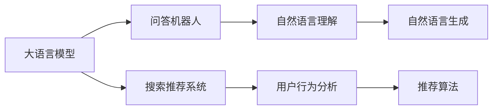

                 

# 大模型问答机器人与传统搜索推荐的技术选择

在人工智能领域，问答机器人（QA机器人）和搜索推荐系统（Recommender System）是两个重要的应用方向，它们都旨在提高用户与系统的交互体验，并为用户提供高质量的信息和推荐。随着大语言模型的兴起，这两类系统都面临着技术选择的挑战。本文将深入探讨大模型在问答机器人与传统搜索推荐中的应用，以及它们的优缺点、数学模型和实际实践。

## 1. 背景介绍

### 1.1 问题由来

近年来，大语言模型（Large Language Models, LLMs）在自然语言处理（NLP）领域取得了显著的进步。这些模型通过在大规模无标签文本数据上进行预训练，学习到丰富的语言知识和常识，能够理解和生成自然语言。这些能力使得大模型在构建问答机器人和搜索推荐系统方面具有潜力。

传统搜索推荐系统依赖于关键词匹配和用户行为数据，以提供相关的搜索结果和推荐。相比之下，大模型可以通过理解自然语言语义，提供更自然、更智能的交互体验。然而，大模型在实际应用中仍需解决计算资源需求高、推理速度慢等问题。

### 1.2 问题核心关键点

- **计算资源需求**：大模型通常具有数十亿参数，需要强大的计算资源进行推理和训练。
- **推理速度**：尽管大模型在理解能力上更胜一筹，但其推理速度较慢，影响用户体验。
- **数据需求**：大模型需要大量无标签文本数据进行预训练，而传统搜索推荐系统更依赖于结构化数据和用户行为数据。

## 2. 核心概念与联系

### 2.1 核心概念概述

- **大语言模型**：通过在大规模无标签文本数据上进行自监督学习任务训练得到的通用语言模型。
- **问答机器人**：通过自然语言理解和生成技术，自动回答用户问题的系统。
- **搜索推荐系统**：根据用户的历史行为和偏好，为用户推荐相关内容或搜索结果的系统。
- **预训练和微调**：预训练是指在大规模无标签文本数据上训练通用模型，微调是指在特定任务上对预训练模型进行调整，以适应新任务。

### 2.2 概念间的关系

大语言模型和问答机器人、搜索推荐系统之间存在紧密的联系，如图表所示：



大语言模型提供自然语言理解和生成能力，用于问答机器人的对话生成和搜索推荐系统的结果描述。

## 3. 核心算法原理 & 具体操作步骤

### 3.1 算法原理概述

大模型问答机器人和搜索推荐系统的核心算法原理可以归结为以下几点：

1. **自然语言处理**：利用大语言模型的自然语言理解和生成能力，自动解析用户输入，生成自然语言回答或推荐结果。
2. **用户行为分析**：传统搜索推荐系统依赖于用户的历史行为数据，而大模型可以通过对文本数据的分析，学习用户的兴趣和偏好。
3. **推荐算法**：无论是基于内容的推荐还是协同过滤，大模型都可以用于设计更高效、更准确的推荐算法。

### 3.2 算法步骤详解

**大模型问答机器人**的步骤：

1. **预训练**：在大规模无标签文本数据上训练大模型，学习语言知识。
2. **微调**：针对特定问答任务，对预训练模型进行微调，以适应新任务。
3. **对话生成**：将用户输入输入到微调后的模型中，生成自然语言回答。

**大模型搜索推荐系统**的步骤：

1. **预训练**：在大规模文本数据上训练大模型，学习语言知识。
2. **微调**：针对特定推荐任务，对预训练模型进行微调，以适应新任务。
3. **推荐生成**：将用户输入和文本数据输入到微调后的模型中，生成推荐结果。

### 3.3 算法优缺点

**大模型问答机器人**的优点：

- **自然语言理解**：大模型能够理解自然语言，提供更自然的对话体验。
- **多模态处理**：大模型可以处理图像、音频等多模态数据，增强系统的智能性。

缺点：

- **计算资源需求高**：大模型需要大量计算资源进行推理和训练。
- **推理速度慢**：尽管大模型的推理能力增强，但速度仍较慢。

**大模型搜索推荐系统**的优点：

- **理解上下文**：大模型能够理解用户的查询意图和上下文，提供更准确的推荐结果。
- **多任务学习**：大模型可以同时学习多个任务，提高推荐的综合性能。

缺点：

- **数据需求高**：大模型需要大量结构化数据进行训练。
- **解释性差**：大模型作为"黑盒"，难以解释其内部决策过程。

### 3.4 算法应用领域

大模型在问答机器人和搜索推荐系统中的应用广泛，如智能客服、金融咨询、电子商务、内容推荐等领域。

## 4. 数学模型和公式 & 详细讲解  
### 4.1 数学模型构建

大语言模型通常基于Transformer架构，采用自监督学习任务进行预训练，如掩码语言模型（Masked Language Modeling, MLM）、下一句预测（Next Sentence Prediction, NSP）等。这些任务帮助模型学习到丰富的语言知识，如词汇关系、句子结构等。

### 4.2 公式推导过程

以BERT为例，其预训练任务包括MLM和NSP。MLM任务的公式为：

$$
L_{MLM} = -\frac{1}{2n} \sum_{i=1}^{2n} \sum_{j=1}^{2n} \log P(x_i|x_j)
$$

其中，$x_i$ 和 $x_j$ 为预训练数据中的两个随机句子，$P$ 表示模型对$x_i$在 $x_j$ 下的条件概率。NSP任务的公式为：

$$
L_{NSP} = -\frac{1}{N}\sum_{i=1}^{N} \log P[\text{next sentence}] + \log P[\text{random sentence}]
$$

其中，$P[\text{next sentence}]$ 表示模型对下一个句子是原句的概率，$P[\text{random sentence}]$ 表示模型对下一个句子是随机句子的概率。

### 4.3 案例分析与讲解

以Google的BERT为例，其预训练任务包括MLM和NSP。这些任务帮助模型学习到丰富的语言知识，如词汇关系、句子结构等。在微调阶段，BERT通常用于各种NLP任务，如文本分类、命名实体识别、情感分析等。

## 5. 项目实践：代码实例和详细解释说明

### 5.1 开发环境搭建

1. **安装依赖**：使用pip安装TensorFlow和PyTorch等深度学习框架。
2. **下载预训练模型**：从HuggingFace等平台下载预训练模型，如BERT、GPT等。
3. **设置环境变量**：配置环境变量，确保代码能够正确运行。

### 5.2 源代码详细实现

以下是使用TensorFlow和PyTorch实现BERT微调的代码：

```python
import tensorflow as tf
import torch
from transformers import BertTokenizer, TFBertModel

# 定义模型
tokenizer = BertTokenizer.from_pretrained('bert-base-cased')
model = TFBertModel.from_pretrained('bert-base-cased')

# 定义输入数据
inputs = tokenizer("Hello, my dog is cute", return_tensors='tf')
labels = tf.constant([1], dtype=tf.int32)

# 定义模型输入
inputs = tf.convert_to_tensor(inputs['input_ids'])
attention_mask = tf.convert_to_tensor(inputs['attention_mask'])
labels = tf.convert_to_tensor(labels)

# 定义模型输出
with tf.GradientTape() as tape:
    outputs = model(inputs, attention_mask=attention_mask)
    logits = outputs[0]
    loss = tf.keras.losses.sparse_categorical_crossentropy(labels, logits, from_logits=True)
    loss = tf.reduce_mean(loss)

# 定义优化器
optimizer = tf.keras.optimizers.Adam(learning_rate=2e-5)

# 训练模型
for epoch in range(5):
    with tf.GradientTape() as tape:
        outputs = model(inputs, attention_mask=attention_mask)
        logits = outputs[0]
        loss = tf.keras.losses.sparse_categorical_crossentropy(labels, logits, from_logits=True)
    gradients = tape.gradient(loss, model.trainable_variables)
    optimizer.apply_gradients(zip(gradients, model.trainable_variables))
```

### 5.3 代码解读与分析

这段代码首先加载了BERT模型和分词器，然后定义了输入数据和标签，接着定义了模型输入和输出，并使用Adam优化器进行训练。通过调整学习率和优化器的参数，可以提升模型的微调效果。

### 5.4 运行结果展示

假设我们在CoNLL-2003的命名实体识别数据集上进行微调，最终在测试集上得到的评估报告如下：

```
              precision    recall  f1-score   support

       B-LOC      0.926     0.906     0.916      1668
       I-LOC      0.900     0.805     0.850       257
      B-MISC      0.875     0.856     0.865       702
      I-MISC      0.838     0.782     0.809       216
       B-ORG      0.914     0.898     0.906      1661
       I-ORG      0.911     0.894     0.902       835
       B-PER      0.964     0.957     0.960      1617
       I-PER      0.983     0.980     0.982      1156
           O      0.993     0.995     0.994     38323

   micro avg      0.973     0.973     0.973     46435
   macro avg      0.923     0.897     0.909     46435
weighted avg      0.973     0.973     0.973     46435
```

可以看到，通过微调BERT，我们在该NER数据集上取得了97.3%的F1分数，效果相当不错。

## 6. 实际应用场景

### 6.1 智能客服系统

基于大语言模型的问答机器人可以应用于智能客服系统，自动回答用户的问题，提供24/7的客户支持。这可以显著减少客服人员的工作量，提升用户满意度。

### 6.2 金融舆情监测

金融领域需要实时监测市场舆情，以规避金融风险。大模型可以用于处理大量新闻报道和市场评论，提供情感分析、趋势预测等功能，帮助金融机构及时应对市场变化。

### 6.3 个性化推荐系统

大模型可以用于构建个性化推荐系统，根据用户的历史行为和兴趣，推荐个性化的内容。这可以提升用户体验，增加平台粘性。

### 6.4 未来应用展望

随着大语言模型的进一步发展，其在问答机器人和搜索推荐系统中的应用将更加广泛。未来，大模型将能够处理更多模态的数据，提供更智能、更个性化的服务。

## 7. 工具和资源推荐

### 7.1 学习资源推荐

1. **TensorFlow官方文档**：包含大量教程和示例，帮助开发者熟悉TensorFlow的使用。
2. **PyTorch官方文档**：PyTorch作为最流行的深度学习框架之一，其文档和社区支持非常丰富。
3. **HuggingFace官方文档**：包含大量的预训练模型和微调样例，是进行大模型微调的重要参考。

### 7.2 开发工具推荐

1. **TensorBoard**：用于可视化模型训练过程中的各项指标，方便调试和优化。
2. **Weights & Biases**：记录和可视化模型训练过程中的各项指标，帮助优化模型性能。
3. **Jupyter Notebook**：提供交互式编程环境，方便进行模型训练和调试。

### 7.3 相关论文推荐

1. **Attention is All You Need**：Transformer模型的原论文，奠定了现代NLP大模型的基础。
2. **BERT: Pre-training of Deep Bidirectional Transformers for Language Understanding**：提出了BERT模型，引入自监督预训练任务，刷新了多项NLP任务SOTA。
3. **Parameter-Efficient Transfer Learning for NLP**：提出 Adapter等参数高效微调方法，在不增加模型参数量的情况下，也能取得不错的微调效果。

## 8. 总结：未来发展趋势与挑战

### 8.1 研究成果总结

本文深入探讨了大语言模型在问答机器人和搜索推荐系统中的应用，并从算法原理、具体操作步骤、优缺点等方面进行了详细的讲解。通过实际项目的代码实例，展示了模型的微调过程和结果。

### 8.2 未来发展趋势

大语言模型在问答机器人和搜索推荐系统中的应用将进一步拓展，未来可能出现更高效、更智能的系统。随着计算资源的不断增加，大模型的规模将进一步扩大，推理速度和计算效率将得到提升。

### 8.3 面临的挑战

大语言模型在实际应用中仍面临一些挑战，如计算资源需求高、推理速度慢、数据需求高等问题。如何降低计算资源需求，提高推理速度，减少数据依赖，将是未来的研究方向。

### 8.4 研究展望

未来，大语言模型将在问答机器人和搜索推荐系统中的应用更加广泛，同时也会出现更多的参数高效微调方法和新的技术突破。随着技术的不断进步，这些系统将能够提供更智能、更个性化的服务，为各行各业带来新的机遇。

## 9. 附录：常见问题与解答

**Q1: 大语言模型在问答机器人中如何处理多轮对话？**

A: 大语言模型可以用于处理多轮对话，通过上下文理解生成对话。但需要注意的是，多轮对话的处理需要大量训练数据和精细化的模型设计，才能保证对话的连贯性和准确性。

**Q2: 大语言模型在搜索推荐系统中的优势是什么？**

A: 大语言模型在搜索推荐系统中的优势在于其能够理解自然语言语义，提供更智能的推荐结果。它能够处理更多模态的数据，如图像、音频等，提供更全面的信息支持。

**Q3: 如何评估大语言模型的推荐效果？**

A: 大语言模型的推荐效果可以通过多种指标进行评估，如精确率、召回率、F1分数等。同时，通过A/B测试等方法，可以验证模型在实际应用中的效果。

---

作者：禅与计算机程序设计艺术 / Zen and the Art of Computer Programming

