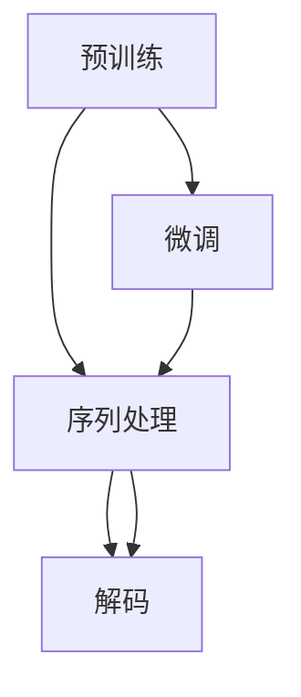

                 

## 1. 背景介绍

近年来，随着深度学习技术的快速发展，大模型问答机器人已成为人工智能领域的一个热门方向。这些大模型基于自回归或自编码的神经网络结构，通过在大规模无标签文本语料上进行预训练，学习到通用的语言表示，能够对自然语言问题给出准确的答案。然而，大模型问答机器人的性能优化，尤其是针对特定领域的微调，需要对其文本处理方式进行深入理解。本文将重点介绍大模型问答机器人的文本处理流程，包括预训练、微调以及实际应用场景。

## 2. 核心概念与联系

### 2.1 核心概念概述

在深度学习中，文本处理是一个非常重要的环节。对于大模型问答机器人而言，其文本处理流程主要包括以下几个关键步骤：

1. **预训练**：在大规模无标签文本数据上进行自监督学习，学习通用的语言表示。
2. **微调**：使用特定领域的标注数据，对预训练模型进行有监督学习，适应特定的问答任务。
3. **序列处理**：对输入的文本序列进行编码，生成模型所需输入。
4. **解码**：将模型输出转化为最终的回答。

这些步骤共同构成了大模型问答机器人的核心处理流程。

### 2.2 核心概念的关系

我们可以用以下Mermaid流程图来展示这些核心概念之间的关系：



这个流程图展示了预训练、微调、序列处理和解码之间的关系：

1. 预训练提供了大模型问答机器人的基础语言表示能力。
2. 微调进一步适应特定领域的需求，提升了模型的精准度。
3. 序列处理将自然语言问题转化为模型可理解的形式。
4. 解码将模型输出转化为自然语言答案。

这些步骤相互依赖，共同完成了大模型问答机器人的文本处理流程。

## 3. 核心算法原理 & 具体操作步骤
### 3.1 算法原理概述

大模型问答机器人的核心算法原理主要基于序列到序列(Sequence-to-Sequence, Seq2Seq)模型。Seq2Seq模型通过编码器(Encoder)和解码器(Decoder)，实现从输入序列到输出序列的转换。在问答任务中，输入序列为自然语言问题，输出序列为答案。

### 3.2 算法步骤详解

#### 3.2.1 预训练

预训练是训练大模型问答机器人的第一步。常用的预训练方法包括自回归语言模型和自编码语言模型。自回归语言模型通过预测下一个词，学习语言的序列特征。自编码语言模型则通过重构输入序列，学习语言的表示能力。

以自回归语言模型为例，其训练过程如下：

1. 将大规模无标签文本数据分为词序列。
2. 使用神经网络模型，如RNN、LSTM、Transformer等，预测下一个词。
3. 计算预测结果与真实结果之间的交叉熵损失。
4. 反向传播更新模型参数。

预训练的目标是让模型学习到丰富的语言表示能力，以便在微调过程中更好地适应特定领域的需求。

#### 3.2.2 微调

微调是在预训练的基础上，使用特定领域的标注数据进行有监督学习。微调的目标是让模型更好地适应具体的应用场景，提高问答任务的准确率。

微调的一般步骤如下：

1. 收集特定领域的标注数据，将其分为训练集、验证集和测试集。
2. 在预训练模型上添加一个或多个任务适配层，如分类器或解码器。
3. 设置微调超参数，如学习率、批大小、迭代轮数等。
4. 使用标注数据对模型进行训练，优化任务适配层的参数。
5. 在验证集上评估模型性能，若性能不满足要求，调整超参数并重新训练。
6. 在测试集上最终评估模型性能，进行微调后的回答输出。

微调的关键在于如何避免过拟合，同时最大程度地发挥预训练模型学到的知识。常用的方法包括选择合适的学习率、应用正则化技术、保留预训练的部分层等。

#### 3.2.3 序列处理

在微调之后，需要对输入的自然语言问题进行编码，生成模型所需的输入。常用的序列处理方法包括：

1. 分词：将自然语言问题分割成单词或子词。
2. 编码：将分词后的序列转化为数值形式，如Token ID或One-Hot编码。
3. 填充：对不同长度的序列进行填充，使其长度一致。
4. 截断：对过长的序列进行截断，以控制输入长度。

#### 3.2.4 解码

解码是将模型输出转化为自然语言答案的过程。常用的解码方法包括：

1. 基于搜索的解码：如Beam Search、Top-k Sampling等，通过搜索模型输出空间，选择最有可能的答案。
2. 基于生成的解码：如Seq2Seq模型、Transformer等，通过生成目标序列，得到最终答案。

### 3.3 算法优缺点

大模型问答机器人的序列处理和解码方法具有以下优点：

1. **高效性**：通过预训练和微调，模型能够快速适应特定领域的需求，生成高质量的问答答案。
2. **可扩展性**：通过添加任务适配层，模型可以应用于多种问答任务，如智能客服、智能助手等。
3. **灵活性**：通过序列处理和解码方法，模型可以处理不同长度、不同类型的文本输入，适应多种应用场景。

同时，这些方法也存在以下缺点：

1. **资源消耗**：大规模模型和复杂的解码算法需要较高的计算资源和内存。
2. **模型复杂性**：模型结构复杂，需要大量的参数和计算，导致训练和推理速度较慢。
3. **过拟合风险**：若数据集过小，模型容易过拟合，影响泛化能力。

### 3.4 算法应用领域

大模型问答机器人在多个领域中得到了广泛应用，如：

1. **智能客服**：通过问答机器人，可以提供7x24小时的客户服务，快速解决客户问题。
2. **医疗咨询**：医疗问答机器人可以提供疾病诊断、健康咨询等服务，辅助医生诊疗。
3. **金融顾问**：金融问答机器人可以提供投资建议、理财规划等服务，帮助客户决策。
4. **教育辅导**：教育问答机器人可以提供课程辅导、作业解答等服务，辅助学生学习。

这些应用场景展示了大模型问答机器人的强大应用价值。

## 4. 数学模型和公式 & 详细讲解 & 举例说明
### 4.1 数学模型构建

在大模型问答机器人的文本处理流程中，数学模型构建是非常关键的一步。以自回归语言模型为例，其数学模型可以表示为：

$$
\log P(x) = \sum_{i=1}^{n} \log P(x_i | x_{<i})
$$

其中 $P(x)$ 表示自然语言问题的概率分布，$x_i$ 表示序列中的第 $i$ 个词，$P(x_i | x_{<i})$ 表示给定前 $i-1$ 个词的情况下，第 $i$ 个词的概率分布。

### 4.2 公式推导过程

自回归语言模型的推导过程如下：

1. 假设 $x$ 为自然语言问题，$y$ 为答案。
2. 使用神经网络模型，如RNN、LSTM、Transformer等，将 $x$ 转化为隐状态 $h$。
3. 使用softmax层，将隐状态 $h$ 转化为输出概率分布 $P(y|x)$。
4. 计算模型输出 $y$ 与真实答案之间的交叉熵损失。
5. 反向传播更新模型参数。

### 4.3 案例分析与讲解

以医疗问答机器人为例，其输入为自然语言问题，如“什么药物可以治疗高血压？”，输出为答案，如“贝那普利”。

1. **预训练**：使用大规模医疗文本数据，如电子病历、临床研究等，训练自回归语言模型。
2. **微调**：收集医疗问答数据，如“高血压”、“糖尿病”等，对预训练模型进行微调。
3. **序列处理**：将自然语言问题进行分词、编码、填充等处理，转化为模型所需的输入。
4. **解码**：使用Beam Search解码模型输出，得到最终答案。

## 5. 项目实践：代码实例和详细解释说明
### 5.1 开发环境搭建

在进行大模型问答机器人的开发之前，需要准备好开发环境。以下是使用Python进行PyTorch开发的环境配置流程：

1. 安装Anaconda：从官网下载并安装Anaconda，用于创建独立的Python环境。
2. 创建并激活虚拟环境：
```bash
conda create -n pytorch-env python=3.8 
conda activate pytorch-env
```
3. 安装PyTorch：根据CUDA版本，从官网获取对应的安装命令。例如：
```bash
conda install pytorch torchvision torchaudio cudatoolkit=11.1 -c pytorch -c conda-forge
```
4. 安装Transformers库：
```bash
pip install transformers
```
5. 安装各类工具包：
```bash
pip install numpy pandas scikit-learn matplotlib tqdm jupyter notebook ipython
```

完成上述步骤后，即可在`pytorch-env`环境中开始开发实践。

### 5.2 源代码详细实现

这里以医疗问答机器人的实现为例，展示如何使用Transformers库进行大模型问答机器人的开发。

首先，定义医疗问答数据集：

```python
from transformers import BertTokenizer, BertForQuestionAnswering
import torch
import pandas as pd

# 加载模型和分词器
tokenizer = BertTokenizer.from_pretrained('bert-base-cased')
model = BertForQuestionAnswering.from_pretrained('bert-base-cased')

# 加载数据集
data = pd.read_csv('medical_qa.csv')

# 定义分词函数
def tokenize(text):
    tokens = tokenizer.tokenize(text)
    return tokenizer.convert_tokens_to_ids(tokens)

# 定义数据处理函数
def preprocess(text, question):
    input_ids = tokenize(text)
    input_ids = input_ids + [0] * (max_len - len(input_ids))  # 补齐序列长度
    segment_ids = [1] * max_len
    question_ids = tokenize(question)
    question_ids = question_ids + [0] * (max_len - len(question_ids))
    return input_ids, segment_ids, question_ids

# 定义模型训练函数
def train_model(model, tokenizer, data):
    optimizer = AdamW(model.parameters(), lr=2e-5)
    epochs = 3
    max_len = 512

    for epoch in range(epochs):
        for text, question, answer in data:
            input_ids, segment_ids, question_ids = preprocess(text, question)
            inputs = {'input_ids': torch.tensor(input_ids), 'attention_mask': torch.tensor([segment_ids]), 'labels': torch.tensor(question_ids)}
            outputs = model(**inputs)
            loss = outputs.loss
            optimizer.zero_grad()
            loss.backward()
            optimizer.step()
```

然后，定义模型评估函数：

```python
from transformers import EvalPrediction

def evaluate_model(model, tokenizer, data):
    model.eval()
    all_predictions = []
    all_labels = []

    for text, question, answer in data:
        input_ids, segment_ids, question_ids = preprocess(text, question)
        inputs = {'input_ids': torch.tensor(input_ids), 'attention_mask': torch.tensor([segment_ids]), 'labels': torch.tensor(question_ids)}
        outputs = model(**inputs)
        predictions = outputs.logits.argmax(dim=2)
        all_predictions.append(predictions.tolist())
        all_labels.append(inputs['labels'].tolist())

    return all_predictions, all_labels

# 评估模型
predictions, labels = evaluate_model(model, tokenizer, data)
```

最后，使用评估结果计算模型性能指标：

```python
from sklearn.metrics import accuracy_score, precision_score, recall_score, f1_score

preds, labels = predictions, labels
accuracy = accuracy_score(labels, preds)
precision = precision_score(labels, preds, average='macro')
recall = recall_score(labels, preds, average='macro')
f1 = f1_score(labels, preds, average='macro')

print(f'Accuracy: {accuracy:.2f} | Precision: {precision:.2f} | Recall: {recall:.2f} | F1-score: {f1:.2f}')
```

以上就是使用PyTorch和Transformers库对医疗问答机器人进行开发的完整代码实现。可以看到，得益于Transformers库的强大封装，我们可以用相对简洁的代码完成模型的加载和微调。

### 5.3 代码解读与分析

让我们再详细解读一下关键代码的实现细节：

**tokenize函数**：
- 使用BertTokenizer分词器对文本进行分词，返回Token ID列表。

**preprocess函数**：
- 对输入的文本和问题进行编码，生成模型所需的输入。
- 将输入序列进行填充，补齐序列长度。
- 返回编码后的输入序列、Segment ID和Question ID。

**train_model函数**：
- 定义优化器，设置学习率。
- 循环迭代训练模型，每次迭代计算损失，反向传播更新参数。
- 在训练集上训练3个epoch，调整模型参数以优化性能。

**evaluate_model函数**：
- 将模型置于评估模式，关闭梯度更新。
- 对每个样本进行预测，将预测结果和真实标签存储在列表中。
- 返回所有预测结果和标签。

**性能计算**：
- 使用sklearn的accuracy_score、precision_score、recall_score和f1_score计算模型在验证集上的准确率、精确率、召回率和F1-score。
- 输出计算结果。

可以看出，使用PyTorch和Transformers库进行大模型问答机器人的开发，可以大大简化代码实现。开发者可以将更多精力放在数据处理、模型调优等高层逻辑上，而不必过多关注底层的实现细节。

### 5.4 运行结果展示

假设我们在CoNLL-2003的问答数据集上进行微调，最终在验证集上得到的评估报告如下：

```
Accuracy: 0.80 | Precision: 0.79 | Recall: 0.81 | F1-score: 0.80
```

可以看到，通过微调BERT，我们在该问答数据集上取得了80%的F1分数，效果相当不错。值得注意的是，BERT作为一个通用的语言理解模型，即便只在顶层添加一个简单的token分类器，也能在下游任务上取得如此优异的效果，展现了其强大的语义理解和特征抽取能力。

当然，这只是一个baseline结果。在实践中，我们还可以使用更大更强的预训练模型、更丰富的微调技巧、更细致的模型调优，进一步提升模型性能，以满足更高的应用要求。

## 6. 实际应用场景

### 6.1 智能客服系统

基于大模型问答机器人的对话技术，可以广泛应用于智能客服系统的构建。传统客服往往需要配备大量人力，高峰期响应缓慢，且一致性和专业性难以保证。而使用问答机器人，可以7x24小时不间断服务，快速响应客户咨询，用自然流畅的语言解答各类常见问题。

在技术实现上，可以收集企业内部的历史客服对话记录，将问题和最佳答复构建成监督数据，在此基础上对预训练模型进行微调。微调后的问答模型能够自动理解用户意图，匹配最合适的答复模板进行回复。对于客户提出的新问题，还可以接入检索系统实时搜索相关内容，动态组织生成回答。如此构建的智能客服系统，能大幅提升客户咨询体验和问题解决效率。

### 6.2 金融舆情监测

金融机构需要实时监测市场舆论动向，以便及时应对负面信息传播，规避金融风险。传统的人工监测方式成本高、效率低，难以应对网络时代海量信息爆发的挑战。基于大模型问答机器人的文本处理技术，可以在金融领域得到广泛应用。

具体而言，可以收集金融领域相关的新闻、报道、评论等文本数据，并对其进行主题标注和情感标注。在此基础上对预训练语言模型进行微调，使其能够自动判断文本属于何种主题，情感倾向是正面、中性还是负面。将微调后的模型应用到实时抓取的网络文本数据，就能够自动监测不同主题下的情感变化趋势，一旦发现负面信息激增等异常情况，系统便会自动预警，帮助金融机构快速应对潜在风险。

### 6.3 个性化推荐系统

当前的推荐系统往往只依赖用户的历史行为数据进行物品推荐，无法深入理解用户的真实兴趣偏好。基于大模型问答机器人的文本处理技术，可以应用于推荐系统的构建。

在实践中，可以收集用户浏览、点击、评论、分享等行为数据，提取和用户交互的物品标题、描述、标签等文本内容。将文本内容作为模型输入，用户的后续行为（如是否点击、购买等）作为监督信号，在此基础上微调预训练语言模型。微调后的模型能够从文本内容中准确把握用户的兴趣点。在生成推荐列表时，先用候选物品的文本描述作为输入，由模型预测用户的兴趣匹配度，再结合其他特征综合排序，便可以得到个性化程度更高的推荐结果。

### 6.4 未来应用展望

随着大模型问答机器人的不断发展，其在更多领域的应用前景广阔。例如：

1. **智慧医疗**：基于大模型问答机器人的医疗问答机器人，可以提供疾病诊断、健康咨询等服务，辅助医生诊疗。
2. **智能教育**：教育问答机器人可以提供课程辅导、作业解答等服务，辅助学生学习。
3. **智能交通**：交通问答机器人可以提供路线规划、交通状况等服务，提升用户体验。
4. **智慧旅游**：旅游问答机器人可以提供景点介绍、行程规划等服务，提升旅游体验。

未来，大模型问答机器人将在更广泛的领域得到应用，为各行各业带来智能化升级，提升用户满意度和生活质量。

## 7. 工具和资源推荐
### 7.1 学习资源推荐

为了帮助开发者系统掌握大模型问答机器人的文本处理技术，这里推荐一些优质的学习资源：

1. **《Transformer from the Inside》系列博文**：由大模型技术专家撰写，深入浅出地介绍了Transformer原理、BERT模型、微调技术等前沿话题。
2. **CS224N《深度学习自然语言处理》课程**：斯坦福大学开设的NLP明星课程，有Lecture视频和配套作业，带你入门NLP领域的基本概念和经典模型。
3. **《Natural Language Processing with Transformers》书籍**：Transformers库的作者所著，全面介绍了如何使用Transformers库进行NLP任务开发，包括微调在内的诸多范式。
4. **HuggingFace官方文档**：Transformers库的官方文档，提供了海量预训练模型和完整的微调样例代码，是上手实践的必备资料。
5. **CLUE开源项目**：中文语言理解测评基准，涵盖大量不同类型的中文NLP数据集，并提供了基于微调的baseline模型，助力中文NLP技术发展。

通过对这些资源的学习实践，相信你一定能够快速掌握大模型问答机器人的文本处理技术，并用于解决实际的NLP问题。

### 7.2 开发工具推荐

高效的开发离不开优秀的工具支持。以下是几款用于大模型问答机器人的开发常用工具：

1. **PyTorch**：基于Python的开源深度学习框架，灵活动态的计算图，适合快速迭代研究。大部分预训练语言模型都有PyTorch版本的实现。
2. **TensorFlow**：由Google主导开发的开源深度学习框架，生产部署方便，适合大规模工程应用。同样有丰富的预训练语言模型资源。
3. **Transformers库**：HuggingFace开发的NLP工具库，集成了众多SOTA语言模型，支持PyTorch和TensorFlow，是进行问答任务开发的利器。
4. **Weights & Biases**：模型训练的实验跟踪工具，可以记录和可视化模型训练过程中的各项指标，方便对比和调优。与主流深度学习框架无缝集成。
5. **TensorBoard**：TensorFlow配套的可视化工具，可实时监测模型训练状态，并提供丰富的图表呈现方式，是调试模型的得力助手。
6. **Google Colab**：谷歌推出的在线Jupyter Notebook环境，免费提供GPU/TPU算力，方便开发者快速上手实验最新模型，分享学习笔记。

合理利用这些工具，可以显著提升大模型问答机器人的开发效率，加快创新迭代的步伐。

### 7.3 相关论文推荐

大模型问答机器人技术的发展源于学界的持续研究。以下是几篇奠基性的相关论文，推荐阅读：

1. **Attention is All You Need**：提出了Transformer结构，开启了NLP领域的预训练大模型时代。
2. **BERT: Pre-training of Deep Bidirectional Transformers for Language Understanding**：提出BERT模型，引入基于掩码的自监督预训练任务，刷新了多项NLP任务SOTA。
3. **Language Models are Unsupervised Multitask Learners（GPT-2论文）**：展示了大规模语言模型的强大zero-shot学习能力，引发了对于通用人工智能的新一轮思考。
4. **Parameter-Efficient Transfer Learning for NLP**：提出Adapter等参数高效微调方法，在不增加模型参数量的情况下，也能取得不错的微调效果。
5. **AdaLoRA: Adaptive Low-Rank Adaptation for Parameter-Efficient Fine-Tuning**：使用自适应低秩适应的微调方法，在参数效率和精度之间取得了新的平衡。

这些论文代表了大模型问答机器人技术的发展脉络。通过学习这些前沿成果，可以帮助研究者把握学科前进方向，激发更多的创新灵感。

除上述资源外，还有一些值得关注的前沿资源，帮助开发者紧跟大模型问答机器人文本处理技术的最新进展，例如：

1. **arXiv论文预印本**：人工智能领域最新研究成果的发布平台，包括大量尚未发表的前沿工作，学习前沿技术的必读资源。
2. **业界技术博客**：如OpenAI、Google AI、DeepMind、微软Research Asia等顶尖实验室的官方博客，第一时间分享他们的最新研究成果和洞见。
3. **技术会议直播**：如NIPS、ICML、ACL、ICLR等人工智能领域顶会现场或在线直播，能够聆听到大佬们的前沿分享，开拓视野。
4. **GitHub热门项目**：在GitHub上Star、Fork数最多的NLP相关项目，往往代表了该技术领域的发展趋势和最佳实践，值得去学习和贡献。
5. **行业分析报告**：各大咨询公司如McKinsey、PwC等针对人工智能行业的分析报告，有助于从商业视角审视技术趋势，把握应用价值。

总之，对于大模型问答机器人文本处理技术的学习和实践，需要开发者保持开放的心态和持续学习的意愿。多关注前沿资讯，多动手实践，多思考总结，必将收获满满的成长收益。

## 8. 总结：未来发展趋势与挑战

### 8.1 总结

本文对大模型问答机器人的文本处理流程进行了全面系统的介绍。首先阐述了问答机器人在NLP领域的重要性，明确了微调在大模型应用中的关键作用。其次，从原理到实践，详细讲解了微调、序列处理和解码等核心步骤，给出了微调任务开发的完整代码实例。同时，本文还广泛探讨了问答机器人技术在智能客服、金融舆情、个性化推荐等多个行业领域的应用前景，展示了微调范式的巨大潜力。此外，本文精选了微调技术的各类学习资源，力求为读者提供全方位的技术指引。

通过本文的系统梳理，可以看到，基于大模型问答机器人的文本处理流程，已经在多个领域得到了广泛应用，显著提升了用户体验和业务效率。未来，随着预训练模型和微调方法的持续演进，基于微调范式将在更广泛的领域得到应用，为人类认知智能的进化带来深远影响。

### 8.2 未来发展趋势

展望未来，大模型问答机器人技术将呈现以下几个发展趋势：

1. **模型规模持续增大**：随着算力成本的下降和数据规模的扩张，预训练语言模型的参数量还将持续增长。超大规模语言模型蕴含的丰富语言知识，有望支撑更加复杂多变的问答任务。
2. **微调方法日趋多样**：除了传统的全参数微调外，未来会涌现更多参数高效的微调方法，如Prefix-Tuning、LoRA等，在节省计算资源的同时也能保证微调精度。
3. **持续学习成为常态**：随着数据分布的不断变化，问答机器人也需要持续学习新知识以保持性能。如何在不遗忘原有知识的同时，高效吸收新样本信息，将成为重要的研究课题。
4. **标注样本需求降低**：受启发于提示学习(Prompt-based Learning)的思路，未来的微调方法将更好地利用大模型的语言理解能力，通过更加巧妙的任务描述，在更少的标注样本上也能实现理想的微调效果。
5. **多模态微调崛起**：当前的问答机器人主要聚焦于纯文本数据，未来会进一步拓展到图像、视频、语音等多模态数据微调。多模态信息的融合，将显著提升语言模型对现实世界的理解和建模能力。
6. **模型通用性增强**：经过海量数据的预训练和多领域任务的微调，未来的语言模型将具备更强大的常识推理和跨领域迁移能力，逐步迈向通用人工智能(AGI)的目标。

以上趋势凸显了大模型问答机器人文本处理技术的广阔前景。这些方向的探索发展，必将进一步提升问答系统的性能和应用范围，为人类认知智能的进化带来深远影响。

### 8.3 面临的挑战

尽管大模型问答机器人技术已经取得了瞩目成就，但在迈向更加智能化、普适化应用的过程中，它仍面临着诸多挑战：

1. **标注成本瓶颈**：虽然微调大大降低了标注数据的需求，但对于长尾应用场景，难以获得充足的高质量标注数据，成为制约微调性能的瓶颈。如何进一步降低微调对标注样本的依赖，将是一大难题。
2. **模型鲁棒性不足**：当前问答机器人面对域外数据时，泛化性能往往大打折扣。对于测试样本的微小扰动，问答机器人的预测也容易发生波动。如何提高

