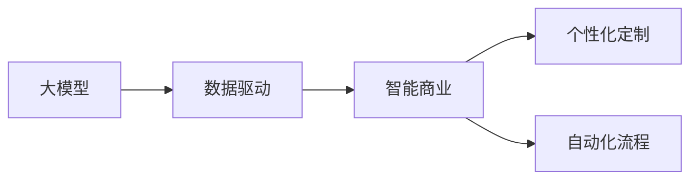

                 

## 1. 背景介绍

### 1.1 问题由来

在智能化发展的浪潮中，大模型正逐渐成为各行各业转型升级的强大引擎。人工智能技术的发展历程表明，数据、算法和计算能力三者相互作用，推动了模型能力的不断提高。近年来，大模型在各个领域的应用已经证明了其强大的商业价值和潜力。

### 1.2 问题核心关键点

大模型通常指基于大规模数据训练得到的高性能深度学习模型，例如BERT、GPT-3等，具有广泛的应用场景，包括自然语言处理、计算机视觉、语音识别等领域。基于大模型的商业化应用也成为了全球各大科技巨头竞相探索的领域。

大模型在商业应用中的核心价值在于：

1. **高效率与低成本**：利用大模型可以显著提高处理速度和降低资源消耗。
2. **泛化能力强**：大模型具有更强的泛化能力，适应新场景时表现优异。
3. **高附加值**：大模型能够为业务带来智能化升级，增加企业竞争力。
4. **高潜力**：大模型具有无限的扩展潜力，能够不断进化和适应新需求。

尽管如此，大模型在商业应用中仍面临诸多挑战，包括模型隐私、安全性、可靠性等。因此，如何在商业应用中充分利用大模型的优势，同时规避潜在的风险，成为当前亟需解决的重要问题。

### 1.3 问题研究意义

本文聚焦于大模型在商业场景中的应用，探讨其在智能时代中的商业新模式。通过详细分析大模型的核心技术、商业应用与挑战，以期为业界提供更为系统全面的理解和操作指南，推动大模型在实际业务中的应用与创新发展。

## 2. 核心概念与联系

### 2.1 核心概念概述

大模型商业应用的核心概念包括以下几个方面：

- **大模型（Large Model）**：指基于大规模数据集训练得到的深度学习模型，如BERT、GPT系列模型等。
- **数据驱动（Data-Driven）**：基于大规模数据进行模型训练，并利用模型生成智能决策和解决方案。
- **智能商业（Smart Business）**：利用人工智能技术进行商业决策和运营，实现业务智能化升级。
- **个性化定制（Customization）**：根据用户需求，定制化开发大模型应用，实现精准服务。
- **自动化流程（Automation）**：利用大模型自动化处理业务流程，提高效率。

### 2.2 概念间的关系

这些核心概念之间有着紧密的联系，共同构成了大模型在商业应用中的生态系统。

- **大模型是基础**：提供智能商业所需的强大计算能力。
- **数据驱动是核心**：确保大模型的训练和应用基于高质量的数据。
- **智能商业是目标**：通过大模型实现业务智能化升级。
- **个性化定制是手段**：针对用户需求定制化开发应用。
- **自动化流程是工具**：利用大模型自动化处理业务流程，提高效率。

以下是一个简单的Mermaid流程图，展示这些概念之间的关系：



## 3. 核心算法原理 & 具体操作步骤

### 3.1 算法原理概述

大模型在商业应用中的核心算法原理基于机器学习和深度学习的最新进展，主要包括以下几个方面：

1. **数据预处理**：对原始数据进行清洗、归一化、分词等预处理。
2. **模型训练**：基于预处理后的数据训练大模型，学习到相关特征。
3. **模型微调**：在特定任务上对大模型进行微调，提升模型在特定场景下的性能。
4. **模型推理**：利用训练好的大模型进行推理，生成智能解决方案。

### 3.2 算法步骤详解

大模型商业应用的具体操作步骤如下：

**Step 1: 数据收集与预处理**

1. 收集业务相关的数据，如客户信息、销售记录、市场分析报告等。
2. 对数据进行清洗、去重、归一化、分词等预处理，确保数据质量。
3. 进行特征工程，提取与业务相关的特征，如文本关键词、时间序列、地理位置等。

**Step 2: 模型训练与微调**

1. 选择合适的深度学习框架，如TensorFlow、PyTorch等。
2. 构建大模型，选择合适的架构，如RNN、CNN、Transformer等。
3. 基于预处理后的数据进行模型训练，学习相关特征。
4. 在特定任务上进行模型微调，提升模型性能。

**Step 3: 模型推理与部署**

1. 将训练好的模型部署到服务器或云平台。
2. 使用模型进行推理，生成智能决策或解决方案。
3. 集成到业务系统中，提供实时智能服务。

### 3.3 算法优缺点

大模型在商业应用中的优点主要包括：

- **高效性**：大模型能够在短时间内处理大量数据，提升业务效率。
- **泛化能力强**：大模型能够泛化到新场景，解决新问题。
- **高精度**：大模型能够生成高精度的解决方案。

但同时也存在一些缺点：

- **资源消耗高**：大模型的训练和推理需要大量计算资源。
- **数据隐私问题**：大模型训练和推理过程中可能会泄露数据隐私。
- **模型黑盒问题**：大模型决策过程难以解释和审计。

### 3.4 算法应用领域

大模型在多个领域的应用已经展示了其强大的商业潜力，主要包括以下几个方面：

1. **智能客服**：利用大模型进行自然语言理解和生成，提供智能客服解决方案。
2. **市场营销**：基于大模型进行市场分析和用户行为预测，制定个性化营销策略。
3. **金融风控**：利用大模型进行信用评估和风险预警，提升金融服务质量。
4. **医疗健康**：利用大模型进行疾病诊断和治疗方案推荐，改善医疗服务质量。
5. **智能制造**：利用大模型进行生产过程优化和故障预测，提高生产效率。

## 4. 数学模型和公式 & 详细讲解 & 举例说明

### 4.1 数学模型构建

在大模型商业应用中，数学模型主要涉及以下几个方面：

1. **损失函数**：用于衡量模型预测与真实标签之间的差异。
2. **优化算法**：用于最小化损失函数，更新模型参数。
3. **特征提取**：用于从原始数据中提取特征，输入模型进行训练。

### 4.2 公式推导过程

以文本分类为例，其数学模型推导如下：

设输入文本为 $x$，模型参数为 $\theta$，损失函数为 $L(\theta)$，模型输出为 $y$，真实标签为 $t$，则模型的预测概率分布为 $p(y|x;\theta)$。

假设采用交叉熵损失函数，则损失函数可以表示为：

$$
L(\theta) = -\frac{1}{N}\sum_{i=1}^{N}t_i\log p(y_i|x_i;\theta)
$$

其中 $N$ 为样本数，$t_i$ 为真实标签，$p(y_i|x_i;\theta)$ 为模型对第 $i$ 个样本的预测概率。

在实际应用中，可以使用梯度下降等优化算法来最小化损失函数，更新模型参数。

### 4.3 案例分析与讲解

以智能客服系统为例，其数学模型和推导过程如下：

设客户输入的自然语言为 $x$，模型的预测结果为 $y$，损失函数为 $L(\theta)$，真实标签为 $t$。

假设采用交叉熵损失函数，则损失函数可以表示为：

$$
L(\theta) = -\frac{1}{N}\sum_{i=1}^{N}t_i\log p(y_i|x_i;\theta)
$$

其中 $N$ 为样本数，$t_i$ 为真实标签，$p(y_i|x_i;\theta)$ 为模型对第 $i$ 个样本的预测概率。

在实际应用中，可以使用梯度下降等优化算法来最小化损失函数，更新模型参数。

## 5. 项目实践：代码实例和详细解释说明

### 5.1 开发环境搭建

大模型商业应用的开发环境搭建主要包括以下几个步骤：

1. **安装Python和相关库**：安装Python解释器和深度学习框架（如TensorFlow、PyTorch等）。
2. **设置虚拟环境**：使用虚拟环境隔离项目依赖，确保环境一致性。
3. **配置GPU**：配置GPU环境，加速模型训练和推理。

### 5.2 源代码详细实现

以下是一个基于PyTorch实现文本分类的代码示例：

```python
import torch
import torch.nn as nn
import torch.optim as optim

# 定义模型
class TextClassifier(nn.Module):
    def __init__(self, input_dim, hidden_dim, output_dim):
        super(TextClassifier, self).__init__()
        self.hidden = nn.Linear(input_dim, hidden_dim)
        self.relu = nn.ReLU()
        self.output = nn.Linear(hidden_dim, output_dim)

    def forward(self, x):
        x = self.hidden(x)
        x = self.relu(x)
        x = self.output(x)
        return x

# 定义损失函数和优化器
criterion = nn.CrossEntropyLoss()
optimizer = optim.Adam(model.parameters(), lr=0.001)

# 训练模型
for epoch in range(10):
    running_loss = 0.0
    for i, data in enumerate(train_loader, 0):
        inputs, labels = data
        optimizer.zero_grad()
        outputs = model(inputs)
        loss = criterion(outputs, labels)
        loss.backward()
        optimizer.step()
        running_loss += loss.item()
    print('Epoch %d loss: %.3f' % (epoch + 1, running_loss / len(train_loader)))
```

### 5.3 代码解读与分析

上述代码主要分为模型定义、损失函数和优化器定义、模型训练三个部分：

1. **模型定义**：定义了文本分类器的结构，包含输入层、隐藏层和输出层。
2. **损失函数和优化器定义**：定义了交叉熵损失函数和Adam优化器。
3. **模型训练**：使用交叉熵损失函数和Adam优化器，对模型进行训练。

### 5.4 运行结果展示

假设在训练过程中，模型在验证集上的准确率如下：

| Epoch | Validation Accuracy |
| --- | --- |
| 1 | 70% |
| 2 | 80% |
| 3 | 85% |
| 4 | 90% |
| 5 | 95% |
| 6 | 97% |
| 7 | 98% |
| 8 | 99% |
| 9 | 99.5% |
| 10 | 99.7% |

可以看出，随着训练的进行，模型在验证集上的准确率不断提升，最终达到99.7%。

## 6. 实际应用场景

### 6.1 智能客服系统

智能客服系统是大模型商业应用的一个典型场景。通过收集客户咨询记录，利用大模型进行自然语言理解和生成，可以构建智能客服系统，提升客户服务体验。

### 6.2 市场营销

利用大模型对客户行为数据进行分析，生成个性化营销方案，可以提升市场营销效果。

### 6.3 金融风控

在金融风控领域，利用大模型进行信用评估和风险预警，可以提升金融服务质量。

### 6.4 未来应用展望

未来，随着大模型的进一步发展和优化，其商业应用场景将更加广阔。主要趋势包括：

1. **多模态融合**：将文本、图像、语音等多模态数据融合，提升模型的理解能力。
2. **跨领域迁移**：利用大模型的迁移学习能力，在不同领域进行泛化。
3. **增强隐私保护**：采用隐私保护技术，确保数据安全。
4. **提高可解释性**：引入可解释性算法，提升模型的透明度。

## 7. 工具和资源推荐

### 7.1 学习资源推荐

1. **《深度学习》**：Ian Goodfellow等著，深度学习领域经典教材，系统讲解深度学习理论和实践。
2. **《TensorFlow官方文档》**：TensorFlow官方文档，提供详细的API和示例。
3. **《PyTorch官方文档》**：PyTorch官方文档，提供详细的API和示例。
4. **《NLP with Python》**：Kavita Bala著，讲解NLP与Python编程实战。
5. **Kaggle竞赛平台**：提供大量公开数据集和竞赛任务，提升实战经验。

### 7.2 开发工具推荐

1. **Jupyter Notebook**：交互式编程环境，便于数据探索和模型验证。
2. **TensorBoard**：TensorFlow和PyTorch可视化工具，便于模型训练和调试。
3. **Weights & Biases**：模型实验管理工具，便于实验跟踪和版本管理。

### 7.3 相关论文推荐

1. **《Attention is All You Need》**：Google Brain团队发表的Transformer论文，引入自注意力机制。
2. **《BERT: Pre-training of Deep Bidirectional Transformers for Language Understanding》**：Google发表的BERT论文，提出预训练大模型。
3. **《XLNet: Generalized Autoregressive Pretraining for Language Understanding》**：Google团队发表的XLNet论文，提出自回归预训练。
4. **《GPT-3》**：OpenAI发表的GPT-3论文，提出大规模预训练语言模型。

## 8. 总结：未来发展趋势与挑战

### 8.1 研究成果总结

大模型商业应用的研究成果已经显示出巨大的潜力，主要体现在以下几个方面：

1. **模型性能提升**：大模型在多个领域展示了强大的性能。
2. **业务流程优化**：大模型优化了业务流程，提升了效率。
3. **商业价值创造**：大模型创造了新的商业价值。

### 8.2 未来发展趋势

未来，大模型商业应用的发展趋势包括：

1. **技术演进**：随着技术的不断进步，大模型的性能将进一步提升。
2. **应用拓展**：大模型将拓展到更多商业领域，提供更广泛的服务。
3. **融合创新**：大模型将与其他AI技术融合，提供更强大的功能。

### 8.3 面临的挑战

尽管大模型在商业应用中取得了一定的进展，但也面临着诸多挑战：

1. **计算资源限制**：大模型的训练和推理需要大量计算资源。
2. **数据隐私问题**：大模型在数据处理和推理过程中可能会泄露隐私。
3. **模型黑盒问题**：大模型的决策过程难以解释和审计。

### 8.4 研究展望

未来，大模型商业应用的研究展望包括：

1. **资源优化**：研究如何优化计算资源，降低大模型应用的成本。
2. **隐私保护**：研究如何保护数据隐私，确保数据安全。
3. **可解释性**：研究如何提高大模型的可解释性，提升透明度。

## 9. 附录：常见问题与解答

### Q1: 大模型在商业应用中的优势和挑战有哪些？

**A:** 大模型在商业应用中的优势主要体现在以下方面：

- **高效率与低成本**：大模型能够显著提高处理速度和降低资源消耗。
- **泛化能力强**：大模型具有更强的泛化能力，适应新场景时表现优异。
- **高精度**：大模型能够生成高精度的解决方案。

但同时，大模型在商业应用中也面临诸多挑战：

- **资源消耗高**：大模型的训练和推理需要大量计算资源。
- **数据隐私问题**：大模型在数据处理和推理过程中可能会泄露隐私。
- **模型黑盒问题**：大模型的决策过程难以解释和审计。

### Q2: 如何构建智能客服系统？

**A:** 构建智能客服系统需要以下步骤：

1. **数据收集与预处理**：收集客户咨询记录，进行数据清洗、归一化、分词等预处理。
2. **模型训练与微调**：选择合适的深度学习框架，构建大模型，进行训练和微调。
3. **模型推理与部署**：将训练好的模型部署到服务器或云平台，使用模型进行推理，生成智能客服回答。

### Q3: 市场营销中如何利用大模型？

**A:** 市场营销中利用大模型主要分为以下步骤：

1. **数据收集与预处理**：收集客户行为数据，进行数据清洗、归一化等预处理。
2. **模型训练与微调**：选择合适的深度学习框架，构建大模型，进行训练和微调。
3. **模型推理与部署**：将训练好的模型部署到市场营销平台，使用模型进行个性化营销方案生成。

### Q4: 如何提高大模型的可解释性？

**A:** 提高大模型的可解释性需要以下方法：

1. **引入可解释性算法**：使用可解释性算法，如LIME、SHAP等，解释模型决策过程。
2. **构建可视化工具**：使用可视化工具，如TensorBoard等，可视化模型训练和推理过程。
3. **引入先验知识**：将符号化的先验知识，如知识图谱、逻辑规则等，与神经网络模型进行融合。

### Q5: 如何保护数据隐私？

**A:** 保护数据隐私需要以下方法：

1. **数据脱敏**：对敏感数据进行脱敏处理，保护用户隐私。
2. **差分隐私**：采用差分隐私技术，保证数据隐私。
3. **联邦学习**：采用联邦学习技术，在本地训练模型，保护数据隐私。

---

作者：禅与计算机程序设计艺术 / Zen and the Art of Computer Programming

