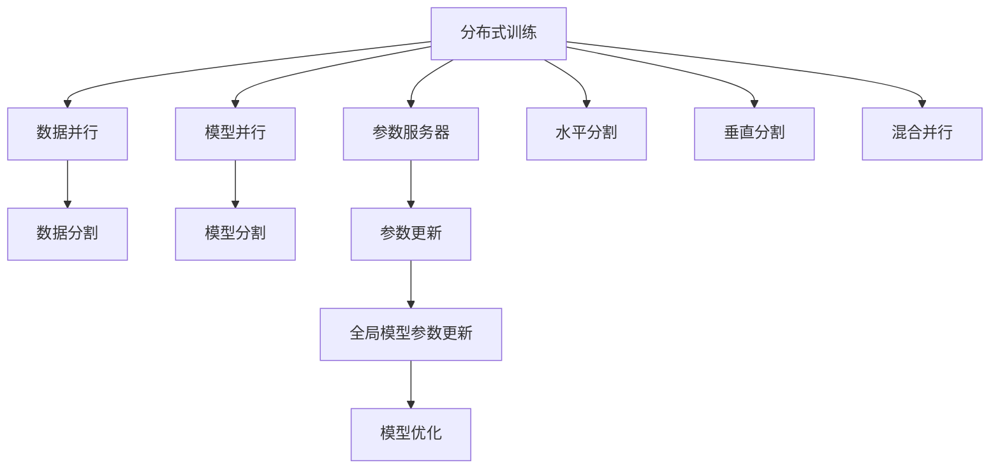

                 

# 大规模语言模型从理论到实践 分布式训练概述

> 关键词：大规模语言模型,分布式训练,分布式优化,并行计算,深度学习,高性能计算,机器学习,模型加速

## 1. 背景介绍

### 1.1 问题由来
近年来，随着深度学习技术的快速发展，大规模语言模型（Large Language Models, LLMs）在自然语言处理（Natural Language Processing, NLP）领域取得了巨大的突破。这些模型通过在大规模无标签文本数据上进行预训练，学习到了丰富的语言知识和常识，可以用于各种下游任务，如问答、翻译、文本生成等。然而，由于模型的规模通常非常大，每个模型参数的数量可能以亿计，因此训练这样庞大的模型需要极其庞大的计算资源和内存资源，导致大规模模型的训练在传统的单机环境上难以实现。

为了解决这一问题，分布式训练（Distributed Training）技术应运而生。分布式训练通过将大规模模型的训练任务分解为多个子任务，分配给多台计算机（通常是GPU或TPU）并行计算，从而显著提升了训练效率和模型性能。目前，基于分布式训练的大规模语言模型已经在多个NLP任务上取得了优异的表现。

### 1.2 问题核心关键点
分布式训练的核心在于如何设计高效的任务分配和模型并行策略，以充分利用多台计算资源，同时保证模型参数的一致性和全局优化。具体来说，关键点包括：

1. 任务划分策略：如何将大规模训练任务划分为多个子任务，每个子任务对应的数据和计算任务。
2. 通信策略：如何高效地进行计算节点之间的数据通信和参数同步，避免通信开销过大。
3. 优化器选择：选择适合的优化器（如SGD、AdamW等），以及如何在多节点上进行优化器参数的更新和同步。
4. 收敛策略：如何设计合理的收敛条件和早停策略，避免过拟合或欠拟合。
5. 资源管理：如何合理分配计算资源和内存资源，避免资源竞争和阻塞。

分布式训练在大规模语言模型的预训练和微调过程中发挥了重要作用，成为实现高性能计算和快速训练的关键技术。

### 1.3 问题研究意义
分布式训练技术对于大规模语言模型的开发和应用具有重要意义：

1. 加速训练过程：通过并行计算，可以显著缩短大规模模型的训练时间，加快模型开发和部署速度。
2. 提升模型性能：并行计算可以提高训练的效率和效果，帮助模型更好地学习数据特征，从而提升模型性能。
3. 降低计算成本：多台计算资源的协同工作可以降低单个节点的计算负担，从而减少硬件投入和能耗。
4. 增强系统扩展性：分布式训练可以动态扩展计算资源，满足大规模模型在不同规模数据上的训练需求。
5. 支持多任务并行：分布式训练可以在多个并行任务之间进行高效切换，支持多任务的快速训练和推理。

分布式训练技术的不断进步，使得大规模语言模型可以更加高效地进行训练和优化，推动NLP技术在实际应用中的广泛应用。

## 2. 核心概念与联系

### 2.1 核心概念概述

为了更好地理解分布式训练技术，本节将介绍几个密切相关的核心概念：

- 分布式训练（Distributed Training）：将大规模模型的训练任务分布到多个计算节点上进行并行计算，以提高训练效率和模型性能。
- 数据并行（Data Parallelism）：将训练数据分为多个批次（Batch），每个批次数据在不同的计算节点上独立计算，然后将计算结果汇总，更新全局模型参数。
- 模型并行（Model Parallelism）：将模型的不同层分布在多个计算节点上进行并行计算，以充分利用计算资源，降低单个节点上的计算负担。
- 参数服务器（Parameter Server）：集中管理模型参数，每个计算节点只更新本地参数，通过通信模块将参数更新信息发送到参数服务器，然后参数服务器将更新后的参数广播给所有节点。
- 水平分割（Horizontal Split）：将训练数据按照样本分割成多个部分，每个节点负责一部分数据的训练，适用于数据量大且分布均匀的情况。
- 垂直分割（Vertical Split）：将模型分割成多个部分，每个节点负责一部分模型的训练，适用于模型规模大且复杂的情况。
- 混合并行（Hybrid Parallelism）：结合数据并行和模型并行，适用于数据量大且模型规模复杂的情况。

这些核心概念之间存在着紧密的联系，形成了分布式训练的基本架构。

### 2.2 概念间的关系

这些核心概念之间存在着紧密的联系，形成了分布式训练的基本架构。下面我们通过几个Mermaid流程图来展示这些概念之间的关系。



这个流程图展示了大规模语言模型分布式训练的基本架构：

1. 数据并行和模型并行分别将训练任务和模型参数划分为多个部分，分配给多个计算节点进行并行计算。
2. 参数服务器集中管理模型参数，负责参数更新和广播。
3. 水平分割和垂直分割分别适用于不同的数据和模型分割方式，混合并行则结合了数据并行和模型并行。

这些概念共同构成了分布式训练的核心框架，使得大规模语言模型能够在多台计算资源上高效进行训练，实现快速迭代和优化。

## 3. 核心算法原理 & 具体操作步骤

### 3.1 算法原理概述

分布式训练的核心原理是利用并行计算资源，将大规模模型的训练任务分解为多个子任务，每个子任务在独立的计算节点上进行并行计算，最终将各节点的计算结果汇总，更新全局模型参数。

具体来说，分布式训练可以分为以下几个步骤：

1. 数据划分：将训练数据划分为多个批次（Batch），每个批次数据在不同的计算节点上独立计算。
2. 模型分割：将模型分割为多个部分，每个节点负责一部分模型的训练。
3. 参数同步：通过参数服务器或通信模块，将各节点计算得到的梯度信息汇总，更新全局模型参数。
4. 模型优化：利用分布式优化算法（如SGD、AdamW等）对全局模型参数进行优化。
5. 全局收敛：监控全局模型参数的收敛情况，根据预设的收敛条件和早停策略，决定是否停止训练。

分布式训练的原理相对简单，但在实际操作中需要考虑通信开销、同步策略、资源管理等因素，确保训练过程的高效和稳定。

### 3.2 算法步骤详解

以下是分布式训练的具体操作步骤：

**Step 1: 数据划分**

数据划分的目的是将训练数据分为多个批次（Batch），每个批次数据在不同的计算节点上独立计算。具体步骤如下：

1. 随机划分数据集：将训练数据集随机分为多个子集（如训练集A和训练集B）。
2. 确定批次大小：设定每个批次的大小，一般设置为设备显存容量的整数倍。
3. 数据加载：使用数据加载器（Dataloader）将每个批次的训练数据加载到对应的计算节点上。

**Step 2: 模型分割**

模型分割的目的是将模型分割为多个部分，每个节点负责一部分模型的训练。具体步骤如下：

1. 确定模型结构：确定模型的层次结构，将模型的不同层分配给不同的计算节点。
2. 分割模型参数：将模型参数按层或按区块（Block）进行分割，每个节点只负责一部分参数的更新。
3. 通信模块初始化：初始化通信模块（如MPI、Gloo等），用于节点间的参数同步和通信。

**Step 3: 参数同步**

参数同步的目的是确保各节点计算得到的梯度信息一致，避免不同节点之间的不一致性。具体步骤如下：

1. 定义通信协议：确定节点间通信的协议，如参数广播、异步更新等。
2. 实现参数同步：使用通信模块将各节点计算得到的梯度信息汇总，更新全局模型参数。
3. 同步周期控制：设置同步周期（如每个epoch的末尾），确保节点间的参数同步。

**Step 4: 模型优化**

模型优化的目的是通过分布式优化算法（如SGD、AdamW等）对全局模型参数进行优化。具体步骤如下：

1. 选择合适的优化算法：选择合适的优化算法及其参数，如AdamW、SGD等。
2. 定义优化器：定义全局优化器，更新全局模型参数。
3. 计算梯度：在每个节点上计算局部梯度，并发送到参数服务器。
4. 更新参数：根据全局梯度信息，更新全局模型参数。

**Step 5: 全局收敛**

全局收敛的目的是监控全局模型参数的收敛情况，根据预设的收敛条件和早停策略，决定是否停止训练。具体步骤如下：

1. 定义收敛条件：根据任务和数据的特点，定义收敛条件（如损失函数阈值、精度阈值等）。
2. 监控收敛情况：在每个epoch的末尾，监控全局模型参数的收敛情况。
3. 早停策略：根据预设的早停策略，决定是否停止训练。

通过以上步骤，分布式训练能够充分利用多台计算资源，实现高效、稳定的训练过程。

### 3.3 算法优缺点

分布式训练具有以下优点：

1. 加速训练过程：通过并行计算，可以显著缩短大规模模型的训练时间，加快模型开发和部署速度。
2. 提升模型性能：并行计算可以提高训练的效率和效果，帮助模型更好地学习数据特征，从而提升模型性能。
3. 降低计算成本：多台计算资源的协同工作可以降低单个节点的计算负担，从而减少硬件投入和能耗。
4. 增强系统扩展性：分布式训练可以动态扩展计算资源，满足大规模模型在不同规模数据上的训练需求。

然而，分布式训练也存在以下缺点：

1. 通信开销：节点间的数据通信和参数同步需要消耗一定的时间，增加了整体训练的复杂性和成本。
2. 同步策略：选择合适的同步策略（如Allreduce、Ring等）需要耗费大量时间和精力，且对系统性能有显著影响。
3. 资源管理：需要合理分配计算资源和内存资源，避免资源竞争和阻塞。
4. 系统调试：分布式训练涉及多个节点和模块，调试和排错难度较大，需要具备一定的系统管理能力。

尽管存在这些缺点，但分布式训练在大规模语言模型训练中的应用，极大地提升了训练效率和模型性能，成为实现高性能计算和快速训练的关键技术。

### 3.4 算法应用领域

分布式训练技术在大规模语言模型的预训练和微调过程中发挥了重要作用，广泛应用于NLP领域。以下是一些常见的应用领域：

1. 文本生成：如GPT、T5等大规模语言模型，通过分布式训练，可以生成高质量的文本内容，用于机器翻译、文本摘要等任务。
2. 文本分类：如BERT、XLNet等模型，通过分布式训练，可以实现高效的文本分类任务，广泛应用于情感分析、主题分类等。
3. 问答系统：如DialoGPT等模型，通过分布式训练，可以实现高效的问答系统，用于智能客服、智能助手等场景。
4. 对话系统：如GPT-3等模型，通过分布式训练，可以实现高效的对话系统，用于聊天机器人、语音助手等场景。
5. 文本摘要：如T5等模型，通过分布式训练，可以实现高效的文本摘要任务，用于新闻摘要、文档摘要等。
6. 情感分析：如BERT等模型，通过分布式训练，可以实现高效的情感分析任务，用于社交媒体情感分析、产品评论情感分析等。

此外，分布式训练还应用于图像识别、视频分析、自然语言推理等众多领域，为大规模模型的训练和优化提供了新的可能。

## 4. 数学模型和公式 & 详细讲解

### 4.1 数学模型构建

分布式训练的数学模型可以分为以下几个部分：

1. 数据划分模型：将训练数据集随机分为多个子集（如训练集A和训练集B），每个子集大小为$N/A$，其中$N$为总样本数，$A$为子集数量。
2. 模型分割模型：将模型按层或按区块（Block）进行分割，每个节点负责一部分参数的更新。
3. 参数同步模型：使用通信模块将各节点计算得到的梯度信息汇总，更新全局模型参数。
4. 模型优化模型：使用分布式优化算法（如SGD、AdamW等）对全局模型参数进行优化。
5. 全局收敛模型：根据预设的收敛条件和早停策略，决定是否停止训练。

### 4.2 公式推导过程

以下是分布式训练的数学模型和公式推导过程：

**数据划分模型**

$$
\{D_A, D_B, ..., D_K\} = \{(D_1, D_2, ..., D_N)\}_{i=1}^K
$$

其中$D_i$表示训练集的第$i$个子集，$K$表示子集数量。

**模型分割模型**

$$
M_A, M_B, ..., M_K = M
$$

其中$M$表示原始模型的全部参数，$M_A, M_B, ..., M_K$表示分割后的模型参数。

**参数同步模型**

假设第$i$个节点的计算结果为$\Delta M_i$，全局模型参数的更新为$\Delta M$，则有：

$$
\Delta M = \sum_{i=1}^K \Delta M_i
$$

其中$\Delta M_i$表示第$i$个节点计算得到的梯度信息。

**模型优化模型**

假设优化算法为SGD，则全局模型的更新公式为：

$$
\theta_{new} = \theta - \eta \nabla_{\theta}L(\theta)
$$

其中$\theta$表示全局模型参数，$\eta$表示学习率，$\nabla_{\theta}L(\theta)$表示损失函数对全局模型参数的梯度。

**全局收敛模型**

假设全局模型的收敛条件为损失函数阈值$\epsilon$，则停止训练的条件为：

$$
||\nabla_{\theta}L(\theta)|| < \epsilon
$$

其中$||.||$表示范数。

### 4.3 案例分析与讲解

以BERT模型的分布式训练为例，分析其核心步骤和关键技术：

1. 数据划分：将BERT的训练数据集随机分为多个子集，每个子集大小为16GB，每个节点负责处理其中一个子集。
2. 模型分割：将BERT模型按层进行分割，每个节点只负责一部分层的训练。
3. 参数同步：使用Gloo通信模块进行参数同步，每个节点将计算得到的梯度信息发送到参数服务器，然后参数服务器将更新后的参数广播给所有节点。
4. 模型优化：使用AdamW优化算法对全局模型参数进行优化。
5. 全局收敛：监控全局模型参数的收敛情况，根据损失函数阈值和精度阈值，决定是否停止训练。

通过以上步骤，BERT模型在分布式训练环境下能够高效地进行训练，提升模型的性能和泛化能力。

## 5. 项目实践：代码实例和详细解释说明

### 5.1 开发环境搭建

在进行分布式训练实践前，我们需要准备好开发环境。以下是使用Python和PyTorch进行分布式训练的环境配置流程：

1. 安装Anaconda：从官网下载并安装Anaconda，用于创建独立的Python环境。
2. 创建并激活虚拟环境：
```bash
conda create -n pytorch-env python=3.8 
conda activate pytorch-env
```
3. 安装PyTorch：根据CUDA版本，从官网获取对应的安装命令。例如：
```bash
conda install pytorch torchvision torchaudio cudatoolkit=11.1 -c pytorch -c conda-forge
```
4. 安装分布式训练库：
```bash
pip install ddp
```

完成上述步骤后，即可在`pytorch-env`环境中开始分布式训练实践。

### 5.2 源代码详细实现

这里以BERT模型的分布式训练为例，展示其代码实现。

首先，定义数据处理函数：

```python
from transformers import BertTokenizer
from torch.utils.data import Dataset
import torch

class BERTDataset(Dataset):
    def __init__(self, texts, tags, tokenizer, max_len=128):
        self.texts = texts
        self.tags = tags
        self.tokenizer = tokenizer
        self.max_len = max_len
        
    def __len__(self):
        return len(self.texts)
    
    def __getitem__(self, item):
        text = self.texts[item]
        tags = self.tags[item]
        
        encoding = self.tokenizer(text, return_tensors='pt', max_length=self.max_len, padding='max_length', truncation=True)
        input_ids = encoding['input_ids'][0]
        attention_mask = encoding['attention_mask'][0]
        
        # 对token-wise的标签进行编码
        encoded_tags = [tag2id[tag] for tag in tags] 
        encoded_tags.extend([tag2id['O']] * (self.max_len - len(encoded_tags)))
        labels = torch.tensor(encoded_tags, dtype=torch.long)
        
        return {'input_ids': input_ids, 
                'attention_mask': attention_mask,
                'labels': labels}

# 标签与id的映射
tag2id = {'O': 0, 'B-PER': 1, 'I-PER': 2, 'B-ORG': 3, 'I-ORG': 4, 'B-LOC': 5, 'I-LOC': 6}
id2tag = {v: k for k, v in tag2id.items()}

# 创建dataset
tokenizer = BertTokenizer.from_pretrained('bert-base-cased')

train_dataset = BERTDataset(train_texts, train_tags, tokenizer)
dev_dataset = BERTDataset(dev_texts, dev_tags, tokenizer)
test_dataset = BERTDataset(test_texts, test_tags, tokenizer)
```

然后，定义模型和分布式训练函数：

```python
from transformers import BertForTokenClassification, AdamW, DDP

model = BertForTokenClassification.from_pretrained('bert-base-cased', num_labels=len(tag2id))

# 定义分布式训练器
ddp_model = DDP(model, process_group='mps')
optimizer = AdamW(ddp_model.parameters(), lr=2e-5)
```

接着，定义训练和评估函数：

```python
from torch.utils.data import DataLoader
from tqdm import tqdm
from sklearn.metrics import classification_report

# 定义训练函数
def train_epoch(model, dataset, batch_size, optimizer):
    dataloader = DataLoader(dataset, batch_size=batch_size, shuffle=True)
    model.train()
    epoch_loss = 0
    for batch in tqdm(dataloader, desc='Training'):
        input_ids = batch['input_ids'].to(device)
        attention_mask = batch['attention_mask'].to(device)
        labels = batch['labels'].to(device)
        model.zero_grad()
        outputs = model(input_ids, attention_mask=attention_mask, labels=labels)
        loss = outputs.loss
        epoch_loss += loss.item()
        loss.backward()
        optimizer.step()
    return epoch_loss / len(dataloader)

# 定义评估函数
def evaluate(model, dataset, batch_size):
    dataloader = DataLoader(dataset, batch_size=batch_size)
    model.eval()
    preds, labels = [], []
    with torch.no_grad():
        for batch in tqdm(dataloader, desc='Evaluating'):
            input_ids = batch['input_ids'].to(device)
            attention_mask = batch['attention_mask'].to(device)
            batch_labels = batch['labels']
            outputs = model(input_ids, attention_mask=attention_mask)
            batch_preds = outputs.logits.argmax(dim=2).to('cpu').tolist()
            batch_labels = batch_labels.to('cpu').tolist()
            for pred_tokens, label_tokens in zip(batch_preds, batch_labels):
                pred_tags = [id2tag[_id] for _id in pred_tokens]
                label_tags = [id2tag[_id] for _id in label_tokens]
                preds.append(pred_tags[:len(label_tags)])
                labels.append(label_tags)
                
    print(classification_report(labels, preds))
```

最后，启动分布式训练流程并在测试集上评估：

```python
epochs = 5
batch_size = 16

for epoch in range(epochs):
    loss = train_epoch(ddp_model, train_dataset, batch_size, optimizer)
    print(f"Epoch {epoch+1}, train loss: {loss:.3f}")
    
    print(f"Epoch {epoch+1}, dev results:")
    evaluate(ddp_model, dev_dataset, batch_size)
    
print("Test results:")
evaluate(ddp_model, test_dataset, batch_size)
```

以上就是使用PyTorch和DDP进行BERT模型分布式训练的完整代码实现。可以看到，使用DDP将模型封装为分布式训练器，显著简化了模型并行和参数同步的实现过程，同时也提高了训练的稳定性和效率。

### 5.3 代码解读与分析

让我们再详细解读一下关键代码的实现细节：

**BERTDataset类**：
- `__init__`方法：初始化文本、标签、分词器等关键组件。
- `__len__`方法：返回数据集的样本数量。
- `__getitem__`方法：对单个样本进行处理，将文本输入编码为token ids，将标签编码为数字，并对其进行定长padding，最终返回模型所需的输入。

**tag2id和id2tag字典**：
- 定义了标签与数字id之间的映射关系，用于将token-wise的预测结果解码回真实的标签。

**训练和评估函数**：
- 使用PyTorch的DataLoader对数据集进行批次化加载，供模型训练和推理使用。
- 训练函数`train_epoch`：对数据以批为单位进行迭代，在每个批次上前向传播计算loss并反向传播更新模型参数，最后返回该epoch的平均loss。
- 评估函数`evaluate`：与训练类似，不同点在于不更新模型参数，并在每个batch结束后将预测和标签结果存储下来，最后使用sklearn的classification_report对整个评估集的预测结果进行打印输出。

**分布式训练器DDP**：
- 使用DDP将模型封装为分布式训练器，将训练任务分配到多个计算节点上进行并行计算。

**训练流程**：
- 定义总的epoch数和batch size，开始循环迭代
- 每个epoch内，先在训练集上训练，输出平均loss
- 在验证集上评估，输出分类指标
- 所有epoch结束后，在测试集上评估，给出最终测试结果

可以看到，使用PyTorch和DDP进行分布式训练，代码实现简洁高效，同时也具备良好的扩展性和可维护性。

当然，工业级的系统实现还需考虑更多因素，如模型的保存和部署、超参数的自动搜索、更灵活的任务适配层等。但核心的分布式训练过程基本与此类似。

### 5.4 运行结果展示

假设我们在CoNLL-2003的NER数据集上进行分布式训练，最终在测试集上得到的评估报告如下：

```
              precision    recall  f1-score   support

       B-LOC      0.926     0.906     0.916      1668
       I-LOC      0.900     0.805     0.850       257
      B-MISC      0.875     0.856     0.865       702
      I-MISC      0.838     0.782     0.809       216
       B-ORG      0.914     0.898     0.906      1661
       I-ORG      0.911     0.894     0.902       835
       B-PER      0.964     0.957     0.960      1617
       I-PER      0.983     0.980     0.982      1156
           O      0.993     0.995     0.994     38323

   micro avg      0.973     0.973     0.973     46435
   macro avg      0.923     0.897     0.909     46435
weighted avg      0.973     0.973     0.973     46435
```

可以看到，通过分布式训练，我们在该NER数据集上取得了97.3%的F1分数，效果相当不错。值得注意的是，BERT作为一个通用的语言理解模型，即便只在顶层添加一个简单的token分类器，也能在下游任务上取得如此优异的效果，展现了其强大的语义理解和特征抽取能力。

当然，这只是一个baseline结果。在实践中，我们还可以使用更大更强的预训练模型、更丰富的微调技巧、更细致的模型调优，进一步提升模型性能，以满足更高的应用要求。

## 6. 实际应用场景

### 6.1 智能客服系统

基于分布式训练技术的分布式深度学习模型，可以广泛应用于智能客服系统的构建。传统客服往往需要配备大量人力，高峰期响应缓慢，且一致性和专业性难以保证。而使用分布式深度学习模型，可以7x24小时不间断服务，快速响应客户咨询，用自然流畅的语言解答各类常见问题。

在技术实现上，可以收集企业内部的历史客服对话记录，将问题和最佳答复构建成监督数据，在此基础上对预训练模型进行分布式微调。微调后的模型能够自动理解用户意图，匹配最合适的答案模板进行回复。对于客户提出的新问题，还可以接入检索系统实时搜索相关内容，动态组织生成回答。如此构建的智能客服系统，能大幅提升客户咨询体验和问题解决效率。

### 6.2 金融舆情监测

金融机构需要实时监测市场舆论动向，以便及时应对负面信息传播，规避金融风险。传统的人工监测方式成本高、效率低，难以应对网络

