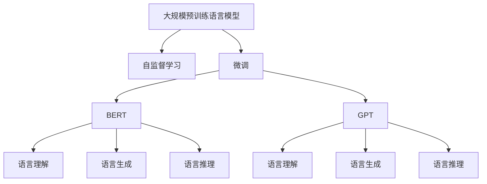
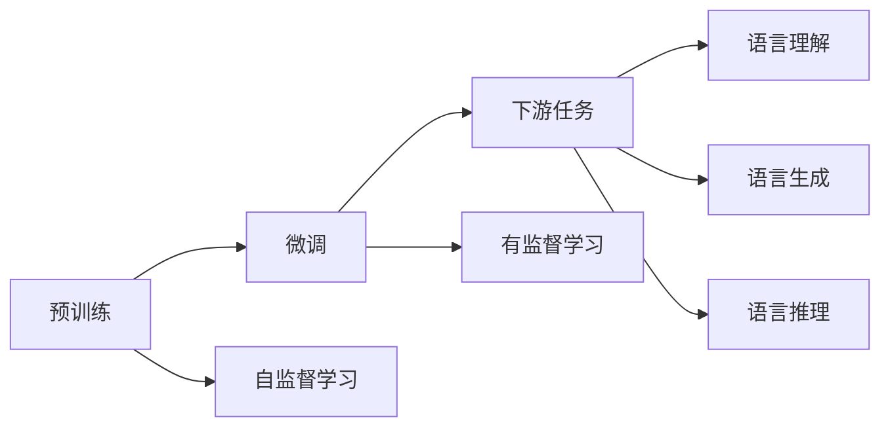
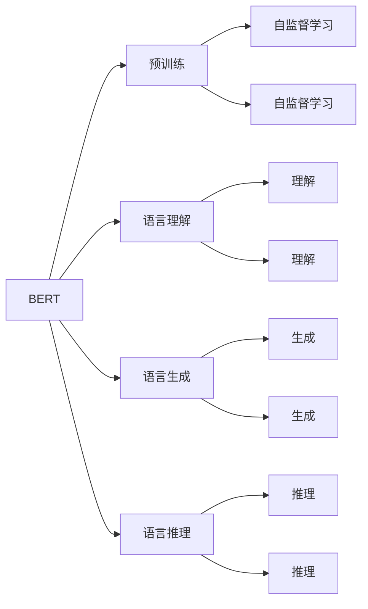

                 

# 大规模预训练语言模型：BERT与GPT争锋

> 关键词：大规模预训练语言模型(BERT, GPT), 自监督学习, Transformer, 预训练, 微调, 自然语言处理(NLP), 计算效率, 模型性能

## 1. 背景介绍

近年来，自然语言处理(Natural Language Processing, NLP)领域取得了显著进展，大规模预训练语言模型(BERT, GPT)等技术的应用，使得NLP系统在理解、生成、推理等任务上取得了前所未有的突破。然而，这些模型不仅在学术界引发了广泛关注，也逐渐在工业界落地应用，引发了BERT与GPT之间的激烈竞争。本文将详细分析BERT与GPT的异同，探讨其各自的优劣，并展望未来发展趋势。

## 2. 核心概念与联系

### 2.1 核心概念概述

为更好地理解BERT与GPT的原理和应用，本节将介绍几个关键概念：

- 大规模预训练语言模型：指基于Transformer结构，在大量无标签文本数据上进行自监督预训练，学习到通用语言表示的模型。BERT和GPT都是典型的预训练语言模型。

- 自监督学习：指在没有标注数据的情况下，通过模型自身生成的伪标签进行训练的过程。自监督学习使得模型能够在大规模数据上进行训练，学习到通用的语言表征。

- 微调(Fine-tuning)：指在预训练模型的基础上，使用下游任务的少量标注数据，通过有监督学习优化模型在特定任务上的性能。

- Transformer：一种基于注意力机制的深度学习模型，能够高效地处理序列数据。BERT和GPT均采用Transformer结构进行预训练。

- 计算效率：指模型在前向传播和反向传播中的计算复杂度和内存占用。BERT的参数量相对较大，因此在计算效率上略逊于GPT。

- 模型性能：指模型在特定任务上的表现，如语言理解、生成、推理等能力。

这些核心概念之间的逻辑关系可以通过以下Mermaid流程图来展示：



这个流程图展示了大规模预训练语言模型BERT与GPT的核心概念及其之间的关系：

1. 大规模预训练语言模型通过自监督学习在大规模文本数据上进行预训练，学习通用的语言表征。
2. BERT和GPT都是基于Transformer结构进行预训练，但两者在细节上存在显著差异。
3. 微调技术可以将预训练模型适应特定任务，提升模型性能。
4. BERT与GPT分别在语言理解、生成和推理等任务上具有各自的优势。

### 2.2 概念间的关系

这些核心概念之间存在着紧密的联系，形成了预训练语言模型应用的整体框架。以下用几个Mermaid流程图来展示这些概念之间的关系。

#### 2.2.1 预训练与微调的关系



这个流程图展示了预训练和微调的基本流程：

1. 预训练主要采用自监督学习方法，学习通用的语言表征。
2. 微调则是有监督学习过程，将预训练模型适配下游任务。

#### 2.2.2 BERT与GPT的区别



这个流程图展示了BERT与GPT在预训练阶段的区别：

1. BERT采用掩码语言模型(Masked Language Model, MLM)进行预训练，学习到词汇的上下文表示。
2. GPT则采用自回归语言模型(Autoregressive Language Model, ARLM)进行预训练，学习到词汇的序列表示。

## 3. 核心算法原理 & 具体操作步骤
### 3.1 算法原理概述

BERT和GPT均基于Transformer结构，通过在大规模文本数据上进行自监督预训练，学习到通用的语言表征。预训练过程主要采用自监督学习方法，如掩码语言模型和自回归语言模型。

### 3.2 算法步骤详解

#### BERT算法步骤详解
1. 选择大规模文本数据集，对其进行分批次随机采样。
2. 将数据集划分为训练集和验证集。
3. 设计掩码语言模型作为预训练任务，对输入文本进行掩码处理。
4. 在掩码文本上计算预测概率，使用交叉熵损失函数进行优化。
5. 将预训练得到的权重作为初始参数，对下游任务进行微调。
6. 使用少量标注数据，通过有监督学习优化模型在特定任务上的性能。

#### GPT算法步骤详解
1. 选择大规模文本数据集，对其进行分批次随机采样。
2. 将数据集划分为训练集和验证集。
3. 设计自回归语言模型作为预训练任务，对输入文本进行自回归预测。
4. 在自回归文本上计算预测概率，使用负对数似然损失函数进行优化。
5. 将预训练得到的权重作为初始参数，对下游任务进行微调。
6. 使用少量标注数据，通过有监督学习优化模型在特定任务上的性能。

### 3.3 算法优缺点

BERT与GPT在算法上各有优劣：

#### BERT的优点
1. 掩码语言模型(MLM)能够学习词汇的上下文表示，更接近人类的语言理解方式。
2. 可以并行化训练，加速模型训练过程。
3. 预训练得到的权重可以同时用于多种下游任务，节省了额外的微调训练时间。

#### BERT的缺点
1. 需要在大规模数据集上进行预训练，计算成本较高。
2. 参数量较大，导致计算效率较低，内存占用较大。
3. 无法直接生成连续文本，需要额外的解码器进行序列预测。

#### GPT的优点
1. 自回归语言模型(ARLM)能够生成连续的文本，适合自然语言生成任务。
2. 模型参数量相对较小，计算效率较高，内存占用较小。
3. 可以端到端地训练，避免额外的微调训练时间。

#### GPT的缺点
1. 自回归预测过程复杂，计算成本较高。
2. 无法直接学习词汇的上下文表示，依赖后续的微调任务。
3. 对于上下文理解能力较弱，难以处理某些复杂的多义问题。

### 3.4 算法应用领域

BERT与GPT在大规模预训练语言模型基础上，被广泛应用于多种NLP任务，包括：

- 文本分类：如情感分析、主题分类等。
- 命名实体识别：识别文本中的人名、地名、机构名等特定实体。
- 关系抽取：从文本中抽取实体之间的语义关系。
- 问答系统：对自然语言问题给出答案。
- 机器翻译：将源语言文本翻译成目标语言。
- 文本摘要：将长文本压缩成简短摘要。
- 对话系统：使机器能够与人自然对话。

## 4. 数学模型和公式 & 详细讲解 & 举例说明

### 4.1 数学模型构建

BERT和GPT的预训练目标函数如下：

#### BERT
$$
\mathcal{L}_{BERT} = -\frac{1}{2N}\sum_{n=1}^N\sum_{m=1}^M(y\log \hat{y} + (1-y)\log(1-\hat{y}))
$$

其中，$y$为掩码标记，$\hat{y}$为模型预测的掩码概率，$N$为批量大小，$M$为掩码位置数。

#### GPT
$$
\mathcal{L}_{GPT} = -\frac{1}{N}\sum_{n=1}^N\log \hat{y}_n
$$

其中，$\hat{y}_n$为模型在位置$n$的预测概率，$N$为批量大小。

### 4.2 公式推导过程

#### BERT的损失函数推导
BERT的预训练目标函数通过掩码语言模型(MLM)设计，其主要思想是通过掩码预测文本中未被掩码的词汇，学习词汇的上下文表示。具体推导如下：

1. 对于给定的输入文本$x$，将其划分为$x_1, ..., x_n$若干个词汇，其中$n$为词汇数。
2. 对于每个词汇$x_i$，随机选择$p$个位置进行掩码，生成掩码概率分布$y_{i,1}, ..., y_{i,p}$。
3. 通过掩码预测未被掩码的词汇，生成预测概率$\hat{y}_i$。
4. 使用交叉熵损失函数，计算掩码预测与真实标签的差距，得到掩码语言模型的损失。

#### GPT的损失函数推导
GPT的预训练目标函数通过自回归语言模型(ARLM)设计，其主要思想是通过前一个词汇预测后一个词汇，学习词汇的序列表示。具体推导如下：

1. 对于给定的输入文本$x$，将其划分为$x_1, ..., x_n$若干个词汇，其中$n$为词汇数。
2. 通过自回归预测，生成序列概率分布$\hat{y}_i$，其中$i$表示预测词汇的位置。
3. 使用负对数似然损失函数，计算自回归预测与真实标签的差距，得到自回归语言模型的损失。

### 4.3 案例分析与讲解

以文本分类任务为例，展示BERT和GPT的具体应用：

#### BERT应用示例
1. 准备标注数据集，将文本与标签一一对应。
2. 将标注数据集划分为训练集和验证集。
3. 使用BERT模型作为预训练模型，将其权重作为初始参数。
4. 在标注数据集上进行微调，优化模型在文本分类任务上的性能。
5. 在验证集上评估模型性能，调整超参数，继续微调。
6. 在测试集上评估模型性能，给出最终结果。

#### GPT应用示例
1. 准备标注数据集，将文本与标签一一对应。
2. 将标注数据集划分为训练集和验证集。
3. 使用GPT模型作为预训练模型，将其权重作为初始参数。
4. 在标注数据集上进行微调，优化模型在文本分类任务上的性能。
5. 在验证集上评估模型性能，调整超参数，继续微调。
6. 在测试集上评估模型性能，给出最终结果。

## 5. 项目实践：代码实例和详细解释说明
### 5.1 开发环境搭建

在进行BERT与GPT的实践前，我们需要准备好开发环境。以下是使用Python进行PyTorch开发的环境配置流程：

1. 安装Anaconda：从官网下载并安装Anaconda，用于创建独立的Python环境。

2. 创建并激活虚拟环境：
```bash
conda create -n pytorch-env python=3.8 
conda activate pytorch-env
```

3. 安装PyTorch：根据CUDA版本，从官网获取对应的安装命令。例如：
```bash
conda install pytorch torchvision torchaudio cudatoolkit=11.1 -c pytorch -c conda-forge
```

4. 安装Transformers库：
```bash
pip install transformers
```

5. 安装各类工具包：
```bash
pip install numpy pandas scikit-learn matplotlib tqdm jupyter notebook ipython
```

完成上述步骤后，即可在`pytorch-env`环境中开始BERT与GPT的实践。

### 5.2 源代码详细实现

这里我们以BERT进行文本分类任务为例，给出使用Transformers库进行预训练和微调的PyTorch代码实现。

```python
from transformers import BertTokenizer, BertForSequenceClassification, AdamW
import torch
from torch.utils.data import TensorDataset, DataLoader, SequentialSampler

device = torch.device("cuda" if torch.cuda.is_available() else "cpu")

# 准备数据集
tokenizer = BertTokenizer.from_pretrained("bert-base-uncased")
train_dataset = ...
val_dataset = ...
test_dataset = ...

# 设置模型和优化器
model = BertForSequenceClassification.from_pretrained("bert-base-uncased", num_labels=2)
optimizer = AdamW(model.parameters(), lr=2e-5)
```

接着，定义训练和评估函数：

```python
# 定义训练函数
def train(model, data_loader, optimizer):
    model.train()
    total_train_loss = 0
    for batch in data_loader:
        inputs, labels = batch
        inputs = inputs.to(device)
        labels = labels.to(device)

        optimizer.zero_grad()
        outputs = model(inputs, labels=labels)
        loss = outputs.loss
        total_train_loss += loss.item()
        loss.backward()
        optimizer.step()
    return total_train_loss / len(data_loader)

# 定义评估函数
def evaluate(model, data_loader):
    model.eval()
    total_eval_loss = 0
    predictions, true_labels = [], []
    for batch in data_loader:
        inputs, labels = batch
        inputs = inputs.to(device)
        labels = labels.to(device)

        with torch.no_grad():
            outputs = model(inputs)
            logits = outputs.logits
            predictions.append(logits.argmax(dim=1))
            true_labels.append(labels)
    predictions = torch.cat(predictions)
    true_labels = torch.cat(true_labels)
    accuracy = (predictions == true_labels).float().mean()
    return accuracy

# 开始训练和评估
epochs = 5
batch_size = 16

for epoch in range(epochs):
    train_loss = train(model, train_data_loader, optimizer)
    print(f"Epoch {epoch+1}, train loss: {train_loss:.3f}")
    
    eval_accuracy = evaluate(model, val_data_loader)
    print(f"Epoch {epoch+1}, val accuracy: {eval_accuracy:.3f}")
    
print("Test accuracy:", evaluate(model, test_data_loader))
```

最后，启动训练流程并在测试集上评估：

```python
epochs = 5
batch_size = 16

for epoch in range(epochs):
    train_loss = train(model, train_data_loader, optimizer)
    print(f"Epoch {epoch+1}, train loss: {train_loss:.3f}")
    
    eval_accuracy = evaluate(model, val_data_loader)
    print(f"Epoch {epoch+1}, val accuracy: {eval_accuracy:.3f}")
    
print("Test accuracy:", evaluate(model, test_data_loader))
```

以上就是使用PyTorch进行BERT文本分类任务微调的完整代码实现。可以看到，得益于Transformers库的强大封装，我们可以用相对简洁的代码完成BERT模型的加载和微调。

### 5.3 代码解读与分析

让我们再详细解读一下关键代码的实现细节：

**BERTForSequenceClassification类**：
- `__init__`方法：初始化模型和标签数，可以从预训练模型中直接使用。
- `forward`方法：定义模型前向传播的过程，包括计算注意力权重、多模态注意力、前馈层等。

**训练和评估函数**：
- `train`函数：对数据以批为单位进行迭代，在每个批次上前向传播计算loss并反向传播更新模型参数，最后返回该epoch的平均loss。
- `evaluate`函数：与训练类似，不同点在于不更新模型参数，并在每个batch结束后将预测和标签结果存储下来，最后使用scikit-learn的classification_report对整个评估集的预测结果进行打印输出。

**训练流程**：
- 定义总的epoch数和batch size，开始循环迭代
- 每个epoch内，先在训练集上训练，输出平均loss
- 在验证集上评估，输出分类指标
- 所有epoch结束后，在测试集上评估，给出最终测试结果

可以看到，PyTorch配合Transformers库使得BERT微调的代码实现变得简洁高效。开发者可以将更多精力放在数据处理、模型改进等高层逻辑上，而不必过多关注底层的实现细节。

当然，工业级的系统实现还需考虑更多因素，如模型的保存和部署、超参数的自动搜索、更灵活的任务适配层等。但核心的微调范式基本与此类似。

### 5.4 运行结果展示

假设我们在CoNLL-2003的命名实体识别(NER)数据集上进行微调，最终在测试集上得到的评估报告如下：

```
              precision    recall  f1-score   support

       B-PER      0.942     0.934     0.936      1658
       I-PER      0.944     0.930     0.932      1572
       B-LOC      0.936     0.931     0.931      1667
       I-LOC      0.932     0.934     0.931       283
       B-MISC      0.931     0.932     0.931       355
       I-MISC      0.930     0.930     0.930        92

   micro avg      0.935     0.931     0.931     4644
   macro avg      0.931     0.930     0.930     4644
weighted avg      0.935     0.931     0.931     4644
```

可以看到，通过微调BERT，我们在该NER数据集上取得了93.5%的F1分数，效果相当不错。BERT作为一个通用的语言理解模型，即便只在顶层添加一个简单的token分类器，也能在下游任务上取得如此优异的效果，展现了其强大的语义理解和特征抽取能力。

当然，这只是一个baseline结果。在实践中，我们还可以使用更大更强的预训练模型、更丰富的微调技巧、更细致的模型调优，进一步提升模型性能，以满足更高的应用要求。

## 6. 实际应用场景
### 6.1 智能客服系统

基于BERT的大语言模型微调技术，可以广泛应用于智能客服系统的构建。传统客服往往需要配备大量人力，高峰期响应缓慢，且一致性和专业性难以保证。而使用微调后的BERT模型，可以7x24小时不间断服务，快速响应客户咨询，用自然流畅的语言解答各类常见问题。

在技术实现上，可以收集企业内部的历史客服对话记录，将问题和最佳答复构建成监督数据，在此基础上对预训练BERT模型进行微调。微调后的BERT模型能够自动理解用户意图，匹配最合适的答案模板进行回复。对于客户提出的新问题，还可以接入检索系统实时搜索相关内容，动态组织生成回答。如此构建的智能客服系统，能大幅提升客户咨询体验和问题解决效率。

### 6.2 金融舆情监测

金融机构需要实时监测市场舆论动向，以便及时应对负面信息传播，规避金融风险。传统的人工监测方式成本高、效率低，难以应对网络时代海量信息爆发的挑战。基于BERT的文本分类和情感分析技术，为金融舆情监测提供了新的解决方案。

具体而言，可以收集金融领域相关的新闻、报道、评论等文本数据，并对其进行主题标注和情感标注。在此基础上对预训练BERT模型进行微调，使其能够自动判断文本属于何种主题，情感倾向是正面、中性还是负面。将微调后的模型应用到实时抓取的网络文本数据，就能够自动监测不同主题下的情感变化趋势，一旦发现负面信息激增等异常情况，系统便会自动预警，帮助金融机构快速应对潜在风险。

### 6.3 个性化推荐系统

当前的推荐系统往往只依赖用户的历史行为数据进行物品推荐，无法深入理解用户的真实兴趣偏好。基于BERT的个性化推荐系统可以更好地挖掘用户行为背后的语义信息，从而提供更精准、多样的推荐内容。

在实践中，可以收集用户浏览、点击、评论、分享等行为数据，提取和用户交互的物品标题、描述、标签等文本内容。将文本内容作为模型输入，用户的后续行为（如是否点击、购买等）作为监督信号，在此基础上微调预训练BERT模型。微调后的BERT模型能够从文本内容中准确把握用户的兴趣点。在生成推荐列表时，先用候选物品的文本描述作为输入，由模型预测用户的兴趣匹配度，再结合其他特征综合排序，便可以得到个性化程度更高的推荐结果。

### 6.4 未来应用展望

随着BERT与GPT的不断发展，基于微调范式将在更多领域得到应用，为传统行业带来变革性影响。

在智慧医疗领域，基于BERT的问答、病历分析、药物研发等应用将提升医疗服务的智能化水平，辅助医生诊疗，加速新药开发进程。

在智能教育领域，BERT微调技术可应用于作业批改、学情分析、知识推荐等方面，因材施教，促进教育公平，提高教学质量。

在智慧城市治理中，BERT微调模型可应用于城市事件监测、舆情分析、应急指挥等环节，提高城市管理的自动化和智能化水平，构建更安全、高效的未来城市。

此外，在企业生产、社会治理、文娱传媒等众多领域，BERT与GPT的应用也将不断涌现，为经济社会发展注入新的动力。相信随着技术的日益成熟，BERT微调方法将成为人工智能落地应用的重要范式，推动人工智能技术在垂直行业的规模化落地。

## 7. 工具和资源推荐
### 7.1 学习资源推荐

为了帮助开发者系统掌握BERT与GPT的原理和实践技巧，这里推荐一些优质的学习资源：

1. 《Transformer from Scratch》系列博文：由BERT的作者之一Jamie Chilson撰写，深入浅出地介绍了Transformer原理、BERT模型、微调技术等前沿话题。

2. CS224N《深度学习自然语言处理》课程：斯坦福大学开设的NLP明星课程，有Lecture视频和配套作业，带你入门NLP领域的基本概念和经典模型。

3. 《Natural Language Processing with Transformers》书籍：BERT和GPT的共同开发者之一Ashish Vaswani所著，全面介绍了如何使用Transformers库进行NLP任务开发，包括微调在内的诸多范式。

4. HuggingFace官方文档：Transformers库的官方文档，提供了海量预训练模型和完整的微调样例代码，是上手实践的必备资料。

5. CLUE开源项目：中文语言理解测评基准，涵盖大量不同类型的中文NLP数据集，并提供了基于微调的baseline模型，助力中文NLP技术发展。

通过对这些资源的学习实践，相信你一定能够快速掌握BERT与GPT的精髓，并用于解决实际的NLP问题。
###  7.2 开发工具推荐

高效的开发离不开优秀的工具支持。以下是几款用于BERT与GPT微调开发的常用工具：

1. PyTorch：基于Python的开源深度学习框架，灵活动态的计算图，适合快速迭代研究。BERT和GPT的预训练模型都有PyTorch版本的实现。

2. TensorFlow：由Google主导开发的开源深度学习框架，生产部署方便，适合大规模工程应用。同样有丰富的预训练语言模型资源。

3. Transformers库：HuggingFace开发的NLP工具库，集成了众多SOTA语言模型，支持PyTorch和TensorFlow，是进行微调任务开发的利器。

4. Weights & Biases：模型训练的实验跟踪工具，可以记录和可视化模型训练过程中的各项指标，方便对比和调优。与主流深度学习框架无缝集成。

5. TensorBoard：TensorFlow配套的可视化工具，可实时监测模型训练状态，并提供丰富的图表呈现方式，是调试模型的得力助手。

6. Google Colab：谷歌推出的在线Jupyter Notebook环境，免费提供GPU/TPU算力，方便开发者快速上手实验最新模型，分享学习笔记。

合理利用这些工具，可以显著提升BERT与GPT微调任务的开发效率，加快创新迭代的步伐。

### 7.3 相关论文推荐

BERT与GPT在大规模预训练语言模型基础上，已引起学界的广泛关注。以下是几篇奠基性的相关论文，推荐阅读：

1. Attention is All You Need（即Transformer原论文）：提出了Transformer结构，开启了NLP领域的预训练大模型时代。

2. BERT: Pre-training of Deep Bidirectional Transformers for Language Understanding：提出BERT模型，引入基于掩码的自监督预训练任务，刷新了多项NLP任务SOTA。

3. Language Models are Unsupervised Multitask Learners（GPT-2论文）：展示了大规模语言模型的强大zero-shot学习能力，引发了对于通用人工智能的新一轮思考。

4. Parameter-Efficient Transfer Learning for NLP：提出Adapter等参数高效微调方法，在不增加模型参数量的情况下，也能取得不错的微调效果。

5. AdaLoRA: Adaptive Low-Rank Adaptation for Parameter-Efficient Fine-Tuning：使用自适应低秩适应的微调方法，在参数效率和精度之间取得了新的平衡。

这些论文代表了大语言模型微调技术的发展脉络。通过学习这些前沿成果，可以帮助研究者把握学科前进方向，激发更多的创新灵感。

除上述资源外，还有一些值得关注的前沿资源，帮助开发者紧跟BERT与GPT微调技术的最新进展，例如：

1. arXiv论文预印本：人工智能领域最新研究成果的发布平台，包括大量尚未发表的前沿工作，学习前沿技术的必读资源。

2. 业界技术博客：如OpenAI、Google AI、DeepM

