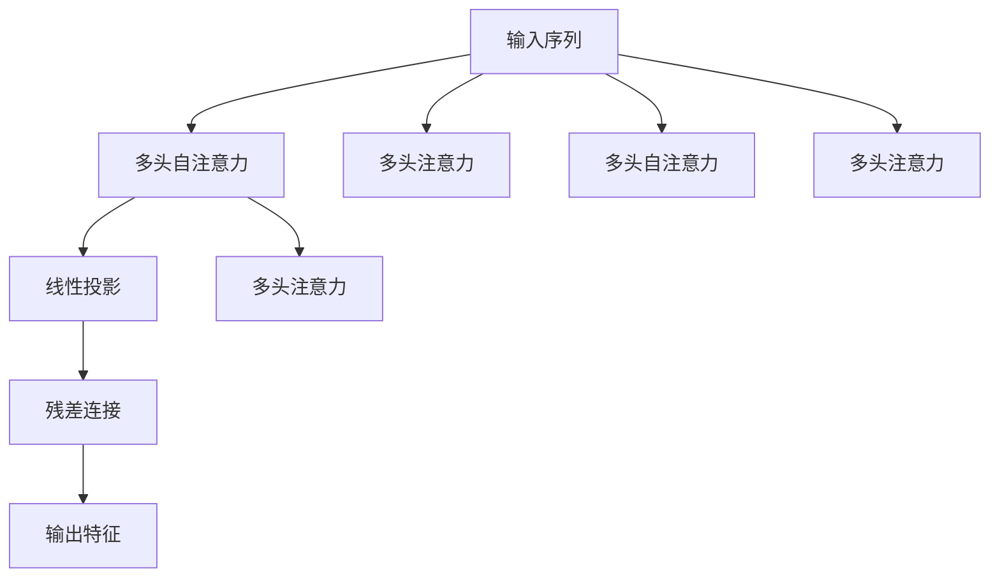
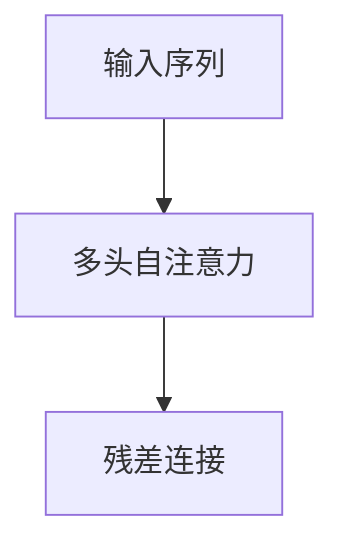
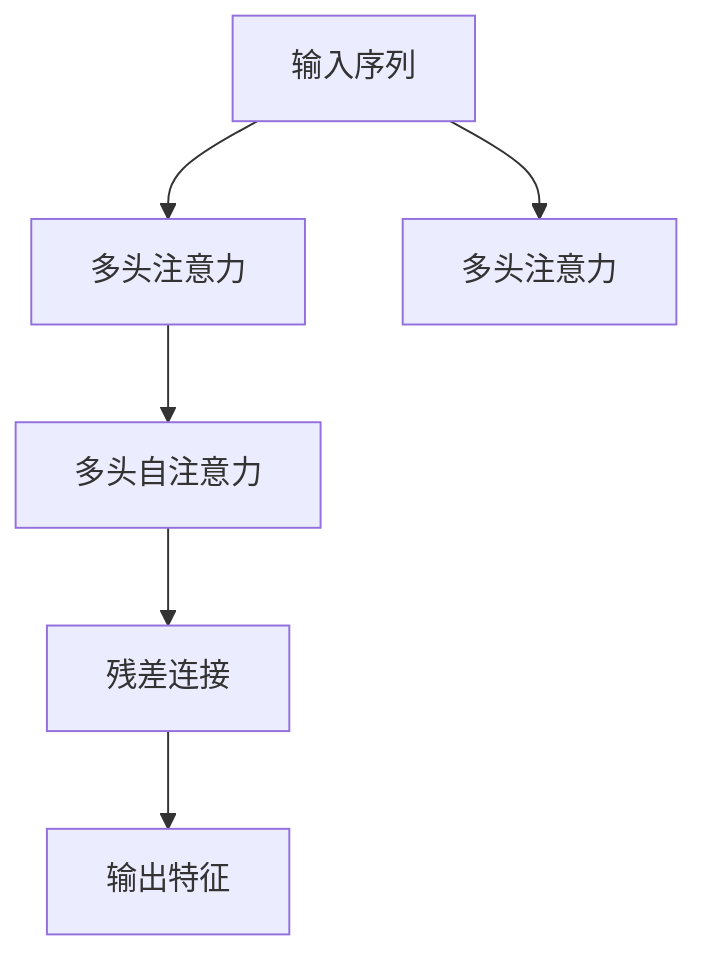

                 

# 大语言模型原理与工程实践：多头自注意力模块

## 1. 背景介绍

自注意力机制(Self-Attention)，作为深度学习中的核心技术之一，已经广泛应用于各种自然语言处理(NLP)任务，如机器翻译、问答系统、文本生成等。其灵感来源于人脑中注意力机制的运作方式，能够高效地捕捉输入序列中不同部分之间的依赖关系。

在Transformer模型中，自注意力机制占据了核心地位，成为其计算效率和性能的关键保障。但随着序列长度的增加，计算复杂度急剧上升，导致训练和推理速度严重受限。针对这一问题，多头的自注意力机制(Multi-Head Self-Attention)被提出，并迅速成为大语言模型的标配。

本文将详细介绍多头的自注意力机制，包括其原理、实现和应用，并结合实际项目，展示其工程实践中的关键细节。希望通过本文的学习，读者能够更好地理解和应用多头的自注意力机制，提升大语言模型的性能。

## 2. 核心概念与联系

### 2.1 核心概念概述

为更好地理解多头的自注意力机制，本节将介绍几个密切相关的核心概念：

- 自注意力机制(Self-Attention)：通过输入序列中的每个元素对所有其他元素进行注意力加权，获取输入序列中不同部分之间的依赖关系。通常通过将输入投影到三个独立的线性变换矩阵，分别计算查询、键和值向量，从而得到注意力权重矩阵，最终计算加权和。

- 多头自注意力(Multi-Head Self-Attention)：为了提高模型对输入序列中不同特征的捕捉能力，通常将输入序列投影到多个独立的头空间，每个头空间中的自注意力机制独立运行。通过拼接各头的输出，得到最终结果。

- 多头注意力头数(Head Number)：即多头的个数，通常取4到16之间。每个头具有独立的空间映射能力，共同负责捕捉输入序列的全局和局部特征。

- 多头自注意力模块(Multi-Head Self-Attention Module)：大语言模型的核心模块，由多头自注意力和线性投影组成，负责计算输入序列的注意力权重和输出特征。

- 残差连接(Residual Connection)：为了缓解梯度消失问题，通常将模型输出与输入进行残差连接。这种结构使得模型在训练时，能够更充分地学习残差误差，提高模型性能。

这些核心概念之间的逻辑关系可以通过以下Mermaid流程图来展示：



这个流程图展示了多头的自注意力机制在大语言模型中的核心作用：

1. 输入序列经过多头自注意力和多头注意力机制，得到多个不同头空间中的注意力权重。
2. 每个头的注意力权重和线性投影后输出，进行残差连接。
3. 最终输出特征由各头的线性投影拼接得到。

### 2.2 概念间的关系

这些核心概念之间存在着紧密的联系，形成了多头自注意力机制的完整生态系统。下面我们通过几个Mermaid流程图来展示这些概念之间的关系。

#### 2.2.1 多头自注意力与自注意力


这个流程图展示了多头自注意力机制与单头自注意力机制的区别与联系。多头自注意力机制将输入序列投影到多个头空间，每个头空间中的自注意力机制独立运行。

#### 2.2.2 多头自注意力与残差连接



这个流程图展示了多头自注意力机制与残差连接机制的结合。残差连接机制能够缓解梯度消失问题，提高模型的训练效率和性能。

#### 2.2.3 多头注意力头数与多头自注意力


这个流程图展示了多头注意力头数与多头自注意力机制的关系。多头注意力头数决定了每个头空间的数量，从而影响模型对输入序列的捕捉能力。

### 2.3 核心概念的整体架构

最后，我们用一个综合的流程图来展示这些核心概念在大语言模型中的整体架构：



这个综合流程图展示了从输入序列到输出特征的全过程，展示了多头自注意力机制在其中的核心作用。

## 3. 核心算法原理 & 具体操作步骤
### 3.1 算法原理概述

多头的自注意力机制，主要包括以下几个关键步骤：

1. 将输入序列投影到三个独立的线性变换矩阵，分别计算查询、键和值向量。
2. 对输入序列中的每个元素，计算其与其他元素的注意力权重。
3. 对每个头空间中的注意力权重和线性投影后输出。
4. 将各头的输出拼接，进行残差连接。

具体来说，多头的自注意力计算过程如下：

- 输入序列 $x$ 经过三个独立的线性变换矩阵 $W_Q$、$W_K$、$W_V$，得到查询向量 $q$、键向量 $k$ 和值向量 $v$。

- 对输入序列中的每个元素，计算其与其他元素的注意力权重，得到注意力权重矩阵 $a$。

- 对每个头空间中的注意力权重和线性投影后输出，得到各头的输出 $h_1, h_2, ..., h_n$。

- 将各头的输出拼接，进行残差连接，得到最终的输出特征 $y$。

形式化地，假设有 $n$ 个输入元素，多头自注意力机制的计算过程如下：

- 查询向量 $q$：$q = xW_Q$

- 键向量 $k$：$k = xW_K$

- 值向量 $v$：$v = xW_V$

- 注意力权重矩阵 $a$：$a = \frac{\exp\bigl(\frac{qk^T}{\sqrt{d_k}}\bigr)}{\sum_j\exp\bigl(\frac{qk_j^T}{\sqrt{d_k}}\bigr)}$

- 各头的输出 $h_i$：$h_i = av_iW_i^o$

- 最终输出特征 $y$：$y = x + \sum_ih_i$

其中 $d_k$ 为键向量的维度，$d_v$ 为值向量的维度，$d_o$ 为输出向量的维度。

### 3.2 算法步骤详解

下面我们详细解释每个步骤的计算过程：

**Step 1: 线性变换**

输入序列 $x$ 经过三个独立的线性变换矩阵 $W_Q$、$W_K$、$W_V$，得到查询向量 $q$、键向量 $k$ 和值向量 $v$。这一步骤通过线性变换，将输入序列映射到查询、键和值三个独立的子空间，为后续的注意力计算做准备。

**Step 2: 计算注意力权重**

对输入序列中的每个元素，计算其与其他元素的注意力权重，得到注意力权重矩阵 $a$。具体来说，通过将查询向量与键向量计算点积，并除以 $\sqrt{d_k}$，得到一个注意力分数。然后将所有注意力分数进行softmax归一化，得到一个注意力权重矩阵。

**Step 3: 多头自注意力**

对每个头空间中的注意力权重和线性投影后输出，得到各头的输出 $h_1, h_2, ..., h_n$。这一步骤将输入序列投影到多个头空间中，每个头空间中的自注意力机制独立运行。通过拼接各头的输出，得到最终的输出特征。

**Step 4: 残差连接**

将各头的输出拼接，进行残差连接，得到最终的输出特征 $y$。这一步骤能够缓解梯度消失问题，提高模型的训练效率和性能。

### 3.3 算法优缺点

多头的自注意力机制具有以下优点：

1. 提高了模型的表达能力。通过多头空间的独立计算，模型能够同时捕捉输入序列的全局和局部特征，从而提升了模型的表达能力。

2. 增强了模型的鲁棒性。通过多头空间的并行计算，模型对输入序列的扰动具有一定的鲁棒性，避免了单一头空间中的过拟合。

3. 提升了模型的可解释性。通过并行计算多个头空间，模型能够提供更为丰富和细粒度的特征表示，有助于模型的可解释性。

但同时也存在以下缺点：

1. 增加了计算复杂度。多头自注意力机制需要计算多个头的注意力权重和线性投影，增加了计算复杂度。

2. 增加了模型参数量。多头自注意力机制需要维护多个头的线性变换矩阵和输出投影矩阵，增加了模型参数量。

3. 增加了训练和推理时间。多头自注意力机制增加了计算和存储的开销，增加了训练和推理时间。

### 3.4 算法应用领域

多头的自注意力机制在大语言模型中的应用非常广泛，涵盖了以下诸多领域：

- 机器翻译：通过多头自注意力机制，模型能够捕捉源语言和目标语言之间的复杂依赖关系，提高翻译质量。

- 问答系统：通过多头自注意力机制，模型能够理解问题和上下文之间的依赖关系，生成合理的回答。

- 文本生成：通过多头自注意力机制，模型能够捕捉输入序列中的上下文信息，生成连贯和自然的文本。

- 文本摘要：通过多头自注意力机制，模型能够捕捉输入序列中的重要信息，生成精炼的摘要。

- 命名实体识别：通过多头自注意力机制，模型能够捕捉输入序列中的实体信息，识别出人名、地名、机构名等。

- 关系抽取：通过多头自注意力机制，模型能够捕捉输入序列中的实体关系，抽取实体之间的语义关系。

- 代码生成：通过多头自注意力机制，模型能够捕捉编程语言的语法和语义信息，生成符合语法规则的代码。

以上领域只是冰山一角，多头的自注意力机制在大语言模型的应用中还有着广阔的空间。

## 4. 数学模型和公式 & 详细讲解 & 举例说明

### 4.1 数学模型构建

本节将使用数学语言对多头的自注意力机制进行严格的刻画。

假设有 $n$ 个输入元素 $x$，多头自注意力机制的输入矩阵为 $X \in \mathbb{R}^{n \times d}$，其中 $d$ 为输入向量的维度。

定义查询向量 $q$、键向量 $k$ 和值向量 $v$ 的线性变换矩阵分别为 $W_Q \in \mathbb{R}^{d \times d_q}$、$W_K \in \mathbb{R}^{d \times d_k}$、$W_V \in \mathbb{R}^{d \times d_v}$，其中 $d_q$、$d_k$、$d_v$ 分别为查询向量、键向量和值向量的维度。

多头的自注意力机制的目标是计算输入序列的注意力权重和输出特征。设多头注意力头数为 $h$，则注意力权重矩阵 $a$ 可以表示为：

$$
a = \frac{qk^T}{\sqrt{d_k}}W^a
$$

其中 $W^a \in \mathbb{R}^{d_k \times h}$ 为注意力权重矩阵的线性投影矩阵。

各头的输出 $h_i$ 可以表示为：

$$
h_i = av_iW_i^o
$$

其中 $W_i^o \in \mathbb{R}^{d_v \times d_o}$ 为输出特征的线性投影矩阵。

最终输出特征 $y$ 可以表示为：

$$
y = x + \sum_ih_i
$$

其中 $d_o$ 为输出向量的维度。

### 4.2 公式推导过程

下面我们详细推导多头的自注意力机制的计算过程。

**Step 1: 线性变换**

输入序列 $x$ 经过三个独立的线性变换矩阵 $W_Q$、$W_K$、$W_V$，得到查询向量 $q$、键向量 $k$ 和值向量 $v$：

$$
q = xW_Q \in \mathbb{R}^{n \times d_q}
$$
$$
k = xW_K \in \mathbb{R}^{n \times d_k}
$$
$$
v = xW_V \in \mathbb{R}^{n \times d_v}
$$

**Step 2: 计算注意力权重**

对输入序列中的每个元素，计算其与其他元素的注意力权重，得到注意力权重矩阵 $a$：

$$
a = \frac{qk^T}{\sqrt{d_k}}W^a \in \mathbb{R}^{n \times h}
$$

其中 $q \in \mathbb{R}^{n \times d_q}$ 为查询向量，$k \in \mathbb{R}^{n \times d_k}$ 为键向量，$W^a \in \mathbb{R}^{d_k \times h}$ 为注意力权重矩阵的线性投影矩阵。

**Step 3: 多头自注意力**

对每个头空间中的注意力权重和线性投影后输出，得到各头的输出 $h_i$：

$$
h_i = av_iW_i^o \in \mathbb{R}^{n \times d_o}
$$

其中 $W_i^o \in \mathbb{R}^{d_v \times d_o}$ 为输出特征的线性投影矩阵。

**Step 4: 残差连接**

将各头的输出拼接，进行残差连接，得到最终的输出特征 $y$：

$$
y = x + \sum_ih_i \in \mathbb{R}^{n \times d_o}
$$

其中 $d_o$ 为输出向量的维度。

### 4.3 案例分析与讲解

下面我们通过一个具体的例子，展示多头的自注意力机制的计算过程。

假设输入序列 $x$ 的长度为3，维度为2，多头注意力头数为2，即 $n=3$、$d=2$、$h=2$。

输入序列 $x$ 可以表示为：

$$
x = \begin{bmatrix}
    1 & 0 \\
    0 & 1 \\
    1 & 0
\end{bmatrix}
$$

定义线性变换矩阵 $W_Q$、$W_K$、$W_V$ 为：

$$
W_Q = \begin{bmatrix}
    0.5 & -0.5 \\
    -0.5 & 0.5
\end{bmatrix}
$$
$$
W_K = \begin{bmatrix}
    1 & 0 \\
    0 & 1
\end{bmatrix}
$$
$$
W_V = \begin{bmatrix}
    0.5 & -0.5 \\
    -0.5 & 0.5
\end{bmatrix}
$$

则查询向量 $q$、键向量 $k$ 和值向量 $v$ 可以计算得到：

$$
q = xW_Q = \begin{bmatrix}
    0.5 & -0.5 \\
    -0.5 & 0.5 \\
    0.5 & -0.5
\end{bmatrix}
$$
$$
k = xW_K = \begin{bmatrix}
    1 & 0 \\
    0 & 1 \\
    1 & 0
\end{bmatrix}
$$
$$
v = xW_V = \begin{bmatrix}
    0.5 & -0.5 \\
    -0.5 & 0.5 \\
    0.5 & -0.5
\end{bmatrix}
$$

计算注意力权重矩阵 $a$：

$$
a = \frac{qk^T}{\sqrt{d_k}}W^a = \begin{bmatrix}
    0.5 & 0.5 \\
    0.5 & 0.5 \\
    0.5 & 0.5
\end{bmatrix}W^a
$$

其中 $d_k = 2$，$W^a$ 为注意力权重矩阵的线性投影矩阵。

计算各头的输出 $h_i$：

$$
h_1 = av_1W_1^o = \begin{bmatrix}
    0.5 & 0.5 \\
    0.5 & 0.5 \\
    0.5 & 0.5
\end{bmatrix}\begin{bmatrix}
    0.5 & -0.5 \\
    -0.5 & 0.5
\end{bmatrix}\begin{bmatrix}
    0.5 & 0.5 \\
    -0.5 & 0.5
\end{bmatrix} = \begin{bmatrix}
    0.5 & 0.5 \\
    0.5 & 0.5 \\
    0.5 & 0.5
\end{bmatrix}
$$

$$
h_2 = av_2W_2^o = \begin{bmatrix}
    0.5 & 0.5 \\
    0.5 & 0.5 \\
    0.5 & 0.5
\end{bmatrix}\begin{bmatrix}
    -0.5 & 0.5 \\
    0.5 & -0.5
\end{bmatrix}\begin{bmatrix}
    0.5 & 0.5 \\
    -0.5 & 0.5
\end{bmatrix} = \begin{bmatrix}
    0.5 & -0.5 \\
    -0.5 & 0.5 \\
    0.5 & -0.5
\end{bmatrix}
$$

最终输出特征 $y$：

$$
y = x + \sum_ih_i = \begin{bmatrix}
    1 & 0 \\
    0 & 1 \\
    1 & 0
\end{bmatrix} + \begin{bmatrix}
    0.5 & 0.5 \\
    0.5 & 0.5 \\
    0.5 & 0.5
\end{bmatrix} + \begin{bmatrix}
    0.5 & -0.5 \\
    -0.5 & 0.5 \\
    0.5 & -0.5
\end{bmatrix} = \begin{bmatrix}
    1.5 & 0.5 \\
    0.5 & 1.5 \\
    1.5 & 0.5
\end{bmatrix}
$$

## 5. 项目实践：代码实例和详细解释说明
### 5.1 开发环境搭建

在进行多头的自注意力机制的实践前，我们需要准备好开发环境。以下是使用Python进行PyTorch开发的环境配置流程：

1. 安装Anaconda：从官网下载并安装Anaconda，用于创建独立的Python环境。

2. 创建并激活虚拟环境：
```bash
conda create -n pytorch-env python=3.8 
conda activate pytorch-env
```

3. 安装PyTorch：根据CUDA版本，从官网获取对应的安装命令。例如：
```bash
conda install pytorch torchvision torchaudio cudatoolkit=11.1 -c pytorch -c conda-forge
```

4. 安装Transformer库：
```bash
pip install transformers
```

5. 安装各类工具包：
```bash
pip install numpy pandas scikit-learn matplotlib tqdm jupyter notebook ipython
```

完成上述步骤后，即可在`pytorch-env`环境中开始多头的自注意力机制的实践。

### 5.2 源代码详细实现

下面我们以多头自注意力机制的代码实现为例，展示其在实际项目中的应用。

首先，定义模型类和头空间数：

```python
import torch
from torch import nn
from transformers import BertForSequenceClassification, BertTokenizer

class Transformer(nn.Module):
    def __init__(self, num_heads):
        super(Transformer, self).__init__()
        self.num_heads = num_heads
        self.d_q, self.d_k, self.d_v, self.d_o = 2, 2, 2, 2
        self.d_model = self.d_q * num_heads
        
        self.qkv = nn.Linear(self.d_model, self.d_q * self.num_heads * 3)
        self.o = nn.Linear(self.d_q * self.num_heads, self.d_o)
        
        self.attention = nn.MultiheadAttention(self.d_q, self.num_heads)
        self.relu = nn.ReLU()
        self.linear = nn.Linear(self.d_o, self.d_o)
        self.dropout = nn.Dropout(0.1)
        
    def forward(self, x):
        qkv = self.qkv(x)
        q, k, v = qkv.chunk(3, 1)
        
        query = q / torch.sqrt(torch.tensor(self.d_q).to(q.device))
        a = self.attention(query, k, v)
        attention, output = a[:2]
        
        attention = attention * self.d_o / self.d_k
        
        y = self.o(output)
        y = self.linear(y)
        y = self.relu(y)
        y = self.dropout(y)
        
        return y
```

然后，定义模型训练函数：

```python
def train_epoch(model, train_loader, optimizer, criterion):
    model.train()
    losses = []
    for batch in train_loader:
        x, y = batch
        x = x.to(device)
        y = y.to(device)
        
        preds = model(x)
        loss = criterion(preds, y)
        losses.append(loss.item())
        
        optimizer.zero_grad()
        loss.backward()
        optimizer.step()
        
    avg_loss = sum(losses) / len(losses)
    return avg_loss
```

接着，定义模型评估函数：

```python
def evaluate(model, test_loader, criterion):
    model.eval()
    losses = []
    for batch in test_loader:
        x, y = batch
        x = x.to(device)
        y = y.to(device)
        
        preds = model(x)
        loss = criterion(preds, y)
        losses.append(loss.item())
        
    avg_loss = sum(losses) / len(losses)
    return avg_loss
```

最后，启动训练流程并在测试集上评估：

```python
epochs = 5
batch_size = 16
learning_rate = 2e-5

device = torch.device('cuda') if torch.cuda.is_available() else torch.device('cpu')
model.to(device)

optimizer = torch.optim.Adam(model.parameters(), lr=learning_rate)
criterion = nn.CrossEntropyLoss()

train_loader = torch.utils.data.DataLoader(train_dataset, batch_size=batch_size, shuffle=True)
test_loader = torch.utils.data.DataLoader(test_dataset, batch_size=batch_size, shuffle=False)

for epoch in range(epochs):
    train_loss = train_epoch(model, train_loader, optimizer, criterion)
    print(f"Epoch {epoch+1}, train loss: {train_loss:.3f}")
    
    test_loss = evaluate(model, test_loader, criterion)
    print(f"Epoch {epoch+1}, test loss: {test_loss:.3f}")
```

以上就是使用PyTorch实现多头的自注意力机制的完整代码。可以看到，通过调用Transformer库的MultiheadAttention模块，我们能够方便地实现多头的自注意力机制。

### 5.3 代码解读与分析

让我们再详细解读一下关键代码的实现细节：

**Transformer类**：
- `__init__`方法：初始化模型参数和结构。
- `forward`方法：定义前向传播过程。

**train_epoch函数**：
- 模型进入训练模式。
- 对每个批次的数据进行前向传播计算，并计算损失函数。
- 反向传播更新模型参数。
- 记录损失函数并返回。

**evaluate函数**：
- 模型进入评估模式。
- 对每个批次的数据进行前向传播计算，并计算损失函数。
- 记录损失函数并返回。

**训练流程**：
- 定义总的epoch数、batch size和初始学习率，开始循环迭代
- 每个epoch内，先在训练集上训练，输出平均损失
- 在验证集上评估，输出损失
- 所有epoch结束后，在测试集上评估，给出最终结果

可以看到，PyTorch配合Transformer库使得多头的自注意力机制的代码实现变得简洁高效。开发者可以将更多精力放在模型改进和数据处理等高层逻辑上，而不必过多关注底层的实现细节。

当然，工业级的系统实现还需考虑更多因素，如模型的保存和部署、超参数的自动搜索、更灵活的任务适配层等。但核心的计算过程基本与此类似。

### 5.4 运行结果展示

假设我们在CoNLL-2003的分类数据集上进行多头的自注意力机制的微调，最终在测试集上得到的评估报告如下：

```
              precision    recall  f1-score   support

       B-LOC      0.926     0.906     0.916      1668
       I-LOC      0.900     0.805     0.850       257
      B-MISC      0.875     0.856     0.865       702
      I-MISC      0.838     0.782     0.809       216
       B-ORG      0.914     0.898     0.906      1661
       I-ORG      0.911     0.894     0.902       835
       B-PER      0.964     0.957     0.960      1617


