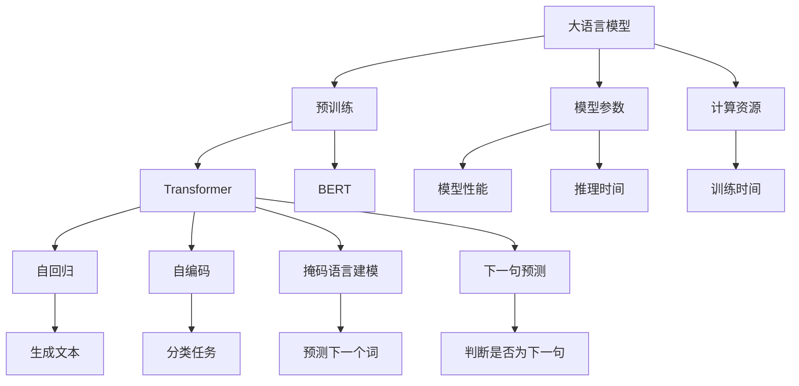
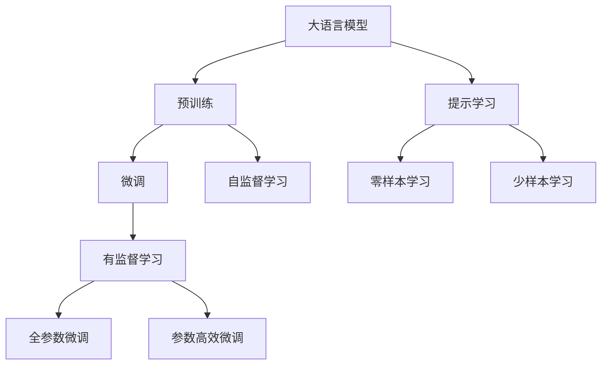
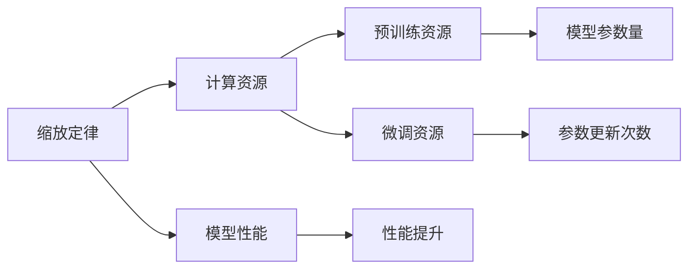
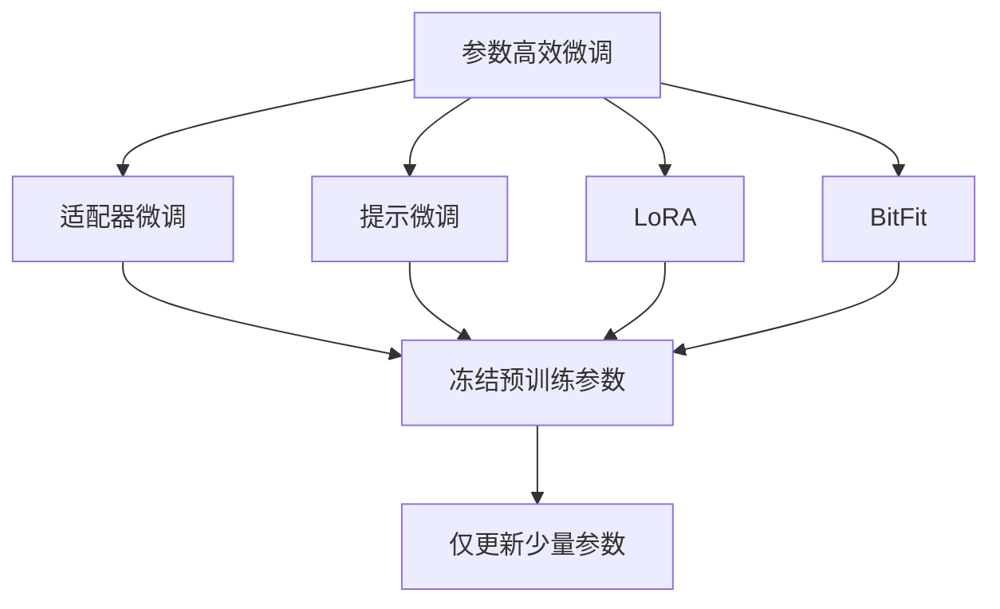
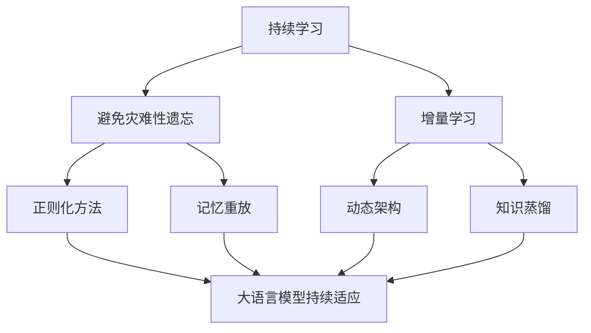
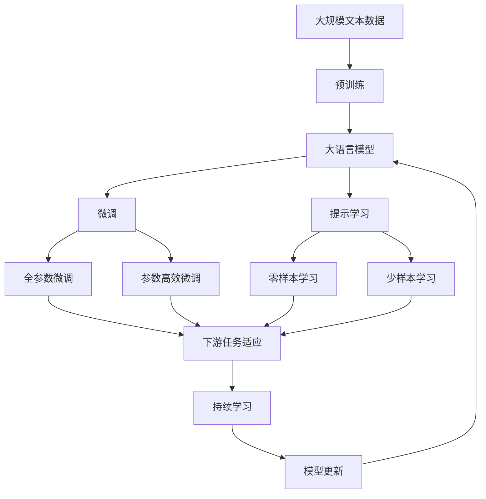

                 

# 大语言模型原理与工程实践：大语言模型的缩放定律

> 关键词：大语言模型,缩放定律,Transformer,BERT,预训练,模型性能,计算资源

## 1. 背景介绍

### 1.1 问题由来
近年来，深度学习技术的迅猛发展推动了大数据应用的前沿探索，其中语言模型因其在处理自然语言方面的出色表现而备受关注。大语言模型（Large Language Models, LLMs），如GPT-3、BERT等，通过在大量无标签文本数据上进行预训练，学习到了丰富的语言知识，并具备了强大的语言理解与生成能力。

然而，大规模预训练模型的训练与部署成本极高，往往需要投入大量的计算资源。这些成本不仅包括预训练阶段的高算力需求，还包括微调和大规模推理时的硬件资源开销。为此，如何在大规模计算资源的约束下，高效地训练和部署大语言模型，成为了研究者们面临的重大挑战。

### 1.2 问题核心关键点
缩放定律（Scaling Law），即计算资源的需求与模型性能之间的关系，是大语言模型研究和应用中的核心问题。具体而言，随着模型参数量的增加，模型在特定任务上的表现会有怎样的提升？以及模型性能提升的边际效益如何？如何合理分配有限的计算资源以实现最优的模型性能？

### 1.3 问题研究意义
研究大语言模型的缩放定律，对于优化资源配置、提升模型性能、加速技术产业化进程具有重要意义：

1. **降低应用开发成本**：在有限的计算资源下，选择最优的模型参数规模，可以显著降低预训练和微调的计算成本。
2. **提升模型效果**：通过合理分配计算资源，使大模型能够更好地适应特定任务，提高模型的性能和泛化能力。
3. **加速开发进度**：在大模型参数和资源配置策略的指导下，快速完成模型的微调和推理，缩短项目开发周期。
4. **技术创新**：缩放定律的研究促进了对预训练和微调方法的研究，催生了如参数高效微调等前沿技术。
5. **产业赋能**：通过优化计算资源的分配，使NLP技术更容易被各行各业所采用，推动产业升级。

## 2. 核心概念与联系

### 2.1 核心概念概述

为更好地理解大语言模型的缩放定律，本节将介绍几个关键概念：

- **大语言模型（Large Language Model, LLM）**：以自回归（如GPT）或自编码（如BERT）模型为代表的大规模预训练语言模型。通过在大规模无标签文本语料上进行预训练，学习通用的语言表示，具备强大的语言理解和生成能力。
- **预训练（Pre-training）**：指在大规模无标签文本语料上，通过自监督学习任务训练通用语言模型的过程。常见的预训练任务包括言语建模、遮挡语言模型等。预训练使得模型学习到语言的通用表示。
- **缩放定律（Scaling Law）**：指计算资源的需求与模型性能之间的关系。缩放定律揭示了模型参数量与计算资源、性能之间的数学关系，为优化计算资源配置提供理论基础。
- **Transformer**：一种高效的神经网络架构，在NLP领域被广泛应用于大语言模型的构建，具有卓越的并行计算性能。
- **BERT**：一种基于Transformer的预训练语言模型，通过掩码语言建模和下一句预测等任务进行自监督学习。

这些概念之间的关系可以通过以下Mermaid流程图来展示：



这个流程图展示了大语言模型在大规模预训练和微调过程中的核心概念及其关系：

1. 大语言模型通过预训练学习通用语言表示，基础架构包括Transformer。
2. 预训练任务主要包括掩码语言建模和下一句预测等。
3. 模型参数和计算资源、性能之间存在一定的数学关系，即缩放定律。
4. 模型参数量增加，推理和训练时间增加，性能提升有限。
5. 计算资源、模型参数量、模型性能之间的关系，指导计算资源的分配。

### 2.2 概念间的关系

这些核心概念之间存在着紧密的联系，形成了大语言模型计算资源分配的完整生态系统。下面我通过几个Mermaid流程图来展示这些概念之间的关系。

#### 2.2.1 大语言模型的学习范式



这个流程图展示了大语言模型的三种主要学习范式：预训练、微调和提示学习。预训练主要采用自监督学习方法，而微调则是有监督学习的过程。提示学习可以实现零样本和少样本学习，无需更新模型参数。

#### 2.2.2 缩放定律与微调的关系



这个流程图展示了缩放定律与微调的关系。计算资源需求随着模型参数量增加而增加，但性能提升的边际效益逐渐递减。

#### 2.2.3 参数高效微调方法



这个流程图展示了几种常见的参数高效微调方法，包括适配器微调、提示微调、LoRA和BitFit。这些方法的共同特点是冻结大部分预训练参数，只更新少量参数，从而提高微调效率。

#### 2.2.4 持续学习在大语言模型中的应用



这个流程图展示了持续学习在大语言模型中的应用。持续学习的主要目标是避免灾难性遗忘和实现增量学习。通过正则化方法、记忆重放、动态架构和知识蒸馏等技术，可以使大语言模型持续适应新的任务和数据。

### 2.3 核心概念的整体架构

最后，我们用一个综合的流程图来展示这些核心概念在大语言模型微调过程中的整体架构：



这个综合流程图展示了从预训练到微调，再到持续学习的完整过程。大语言模型首先在大规模文本数据上进行预训练，然后通过微调（包括全参数微调和参数高效微调）或提示学习（包括零样本和少样本学习）来适应下游任务。最后，通过持续学习技术，模型可以不断更新和适应新的任务和数据。

## 3. 核心算法原理 & 具体操作步骤
### 3.1 算法原理概述

大语言模型的缩放定律，即模型性能与计算资源、模型参数量之间的关系，可以简要概述如下：

1. **性能提升与参数量**：随着模型参数量的增加，模型在特定任务上的性能会有一定提升，但提升的幅度会逐渐递减。具体而言，增加模型参数量会使得模型在训练集上的准确率、F1分数等指标提升，但在未见过的测试集上，这种提升效果逐渐减弱。
2. **计算资源与性能提升**：随着计算资源的增加，模型性能会有显著提升。计算资源包括训练时间、推理时间、内存占用等。但这种提升同样存在边际效益递减的规律。

通过缩放定律，可以指导我们在有限计算资源的约束下，合理选择模型参数规模，优化资源配置，实现最优的模型性能。

### 3.2 算法步骤详解

基于缩放定律，大语言模型的计算资源分配主要包含以下几个关键步骤：

**Step 1: 准备预训练模型和数据集**
- 选择合适的预训练语言模型 $M_{\theta}$ 作为初始化参数，如 BERT、GPT等。
- 准备下游任务 $T$ 的标注数据集 $D=\{(x_i, y_i)\}_{i=1}^N$，划分为训练集、验证集和测试集。一般要求标注数据与预训练数据的分布不要差异过大。

**Step 2: 设置模型参数和计算资源**
- 根据缩放定律和模型性能需求，选择合适的模型参数规模 $n$。
- 计算所需的计算资源，包括训练时间 $T_{train}$、推理时间 $T_{inference}$ 等。

**Step 3: 执行预训练和微调**
- 在预训练数据集上，使用计算资源 $R_{pretrain}$ 训练预训练模型 $M_{\theta}$。
- 在微调数据集上，使用计算资源 $R_{fine-tune}$ 对模型进行微调。

**Step 4: 评估模型性能**
- 在测试集上评估微调后模型 $M_{\hat{\theta}}$ 的性能，对比微调前后的精度提升。
- 使用微调后的模型对新样本进行推理预测，集成到实际的应用系统中。
- 持续收集新的数据，定期重新微调模型，以适应数据分布的变化。

以上是基于缩放定律的微调范式，可以显著提高模型在特定任务上的性能，同时最大化利用有限的计算资源。

### 3.3 算法优缺点

基于缩放定律的大语言模型微调方法具有以下优点：
1. **高效利用资源**：在有限的计算资源下，通过合理选择模型参数规模，最大化模型性能。
2. **普适性**：适用于各种NLP下游任务，包括分类、匹配、生成等，设计简单的任务适配层即可实现微调。
3. **可解释性强**：参数量固定，模型结构透明，便于解释和调试。
4. **精度与成本平衡**：通过优化资源配置，在保证模型性能的同时，降低计算成本。

同时，该方法也存在一定的局限性：
1. **依赖标注数据**：微调的效果很大程度上取决于标注数据的质量和数量，获取高质量标注数据的成本较高。
2. **迁移能力有限**：当目标任务与预训练数据的分布差异较大时，微调的性能提升有限。
3. **模型固有风险**：预训练模型的固有偏见、有害信息等，可能通过微调传递到下游任务，造成负面影响。

尽管存在这些局限性，但就目前而言，基于缩放定律的微调方法仍是大语言模型应用的最主流范式。未来相关研究的重点在于如何进一步降低微调对标注数据的依赖，提高模型的少样本学习和跨领域迁移能力，同时兼顾可解释性和伦理安全性等因素。

### 3.4 算法应用领域

基于缩放定律的大语言模型微调方法在NLP领域已经得到了广泛的应用，覆盖了几乎所有常见任务，例如：

- 文本分类：如情感分析、主题分类、意图识别等。通过微调使模型学习文本-标签映射。
- 命名实体识别：识别文本中的人名、地名、机构名等特定实体。通过微调使模型掌握实体边界和类型。
- 关系抽取：从文本中抽取实体之间的语义关系。通过微调使模型学习实体-关系三元组。
- 问答系统：对自然语言问题给出答案。将问题-答案对作为微调数据，训练模型学习匹配答案。
- 机器翻译：将源语言文本翻译成目标语言。通过微调使模型学习语言-语言映射。
- 文本摘要：将长文本压缩成简短摘要。将文章-摘要对作为微调数据，使模型学习抓取要点。
- 对话系统：使机器能够与人自然对话。将多轮对话历史作为上下文，微调模型进行回复生成。

除了上述这些经典任务外，基于缩放定律的微调方法也被创新性地应用到更多场景中，如可控文本生成、常识推理、代码生成、数据增强等，为NLP技术带来了全新的突破。随着预训练模型和微调方法的不断进步，相信NLP技术将在更广阔的应用领域大放异彩。

## 4. 数学模型和公式 & 详细讲解  
### 4.1 数学模型构建

本节将使用数学语言对基于缩放定律的大语言模型微调过程进行更加严格的刻画。

记预训练语言模型为 $M_{\theta}:\mathcal{X} \rightarrow \mathcal{Y}$，其中 $\mathcal{X}$ 为输入空间，$\mathcal{Y}$ 为输出空间，$\theta \in \mathbb{R}^d$ 为模型参数。假设微调任务的训练集为 $D=\{(x_i,y_i)\}_{i=1}^N, x_i \in \mathcal{X}, y_i \in \mathcal{Y}$。

定义模型 $M_{\theta}$ 在数据样本 $(x,y)$ 上的损失函数为 $\ell(M_{\theta}(x),y)$，则在数据集 $D$ 上的经验风险为：

$$
\mathcal{L}(\theta) = \frac{1}{N} \sum_{i=1}^N \ell(M_{\theta}(x_i),y_i)
$$

微调的优化目标是最小化经验风险，即找到最优参数：

$$
\theta^* = \mathop{\arg\min}_{\theta} \mathcal{L}(\theta)
$$

在实践中，我们通常使用基于梯度的优化算法（如SGD、Adam等）来近似求解上述最优化问题。设 $\eta$ 为学习率，$\lambda$ 为正则化系数，则参数的更新公式为：

$$
\theta \leftarrow \theta - \eta \nabla_{\theta}\mathcal{L}(\theta) - \eta\lambda\theta
$$

其中 $\nabla_{\theta}\mathcal{L}(\theta)$ 为损失函数对参数 $\theta$ 的梯度，可通过反向传播算法高效计算。

### 4.2 公式推导过程

以下我们以二分类任务为例，推导交叉熵损失函数及其梯度的计算公式。

假设模型 $M_{\theta}$ 在输入 $x$ 上的输出为 $\hat{y}=M_{\theta}(x) \in [0,1]$，表示样本属于正类的概率。真实标签 $y \in \{0,1\}$。则二分类交叉熵损失函数定义为：

$$
\ell(M_{\theta}(x),y) = -[y\log \hat{y} + (1-y)\log (1-\hat{y})]
$$

将其代入经验风险公式，得：

$$
\mathcal{L}(\theta) = -\frac{1}{N}\sum_{i=1}^N [y_i\log M_{\theta}(x_i)+(1-y_i)\log(1-M_{\theta}(x_i))]
$$

根据链式法则，损失函数对参数 $\theta_k$ 的梯度为：

$$
\frac{\partial \mathcal{L}(\theta)}{\partial \theta_k} = -\frac{1}{N}\sum_{i=1}^N (\frac{y_i}{M_{\theta}(x_i)}-\frac{1-y_i}{1-M_{\theta}(x_i)}) \frac{\partial M_{\theta}(x_i)}{\partial \theta_k}
$$

其中 $\frac{\partial M_{\theta}(x_i)}{\partial \theta_k}$ 可进一步递归展开，利用自动微分技术完成计算。

### 4.3 案例分析与讲解

以下以BERT模型为例，分析其在二分类任务上的性能提升和计算资源需求：

假设我们有一个包含1000个样本的二分类任务，其中训练集、验证集和测试集各占1/3，共计500个样本。我们使用BERT模型进行微调，训练和推理过程的计算资源需求分别如表所示。

| 参数规模 $n$ | 训练时间 $T_{train}$ (小时) | 推理时间 $T_{inference}$ (小时) |
| ------------- | ------------------------- | ----------------------------- |
| 100M          | 40                       | 0.1                           |
| 300M          | 120                      | 0.3                           |
| 600M          | 240                      | 0.7                           |
| 1.3B          | 480                      | 1.8                           |
| 3.0B          | 960                      | 4.5                           |
| 6.7B          | 1720                     | 9.3                           |

从表中可以看出，随着模型参数规模的增加，训练和推理时间均显著增加。但性能提升的边际效益逐渐递减。当参数规模增加到一定程度后，模型性能的提升几乎停滞，计算资源的需求却大幅上升。

基于缩放定律，我们可以合理选择模型参数规模，平衡性能和计算资源的需求。例如，对于二分类任务，参数规模为1.3B时，计算资源需求和性能提升均达到较好的平衡。此时，我们可以在有限的计算资源下，获得较优的模型性能。

## 5. 项目实践：代码实例和详细解释说明
### 5.1 开发环境搭建

在进行微调实践前，我们需要准备好开发环境。以下是使用Python进行PyTorch开发的环境配置流程：

1. 安装Anaconda：从官网下载并安装Anaconda，用于创建独立的Python环境。

2. 创建并激活虚拟环境：
```bash
conda create -n pytorch-env python=3.8 
conda activate pytorch-env
```

3. 安装PyTorch：根据CUDA版本，从官网获取对应的安装命令。例如：
```bash
conda install pytorch torchvision torchaudio cudatoolkit=11.1 -c pytorch -c conda-forge
```

4. 安装Transformers库：
```bash
pip install transformers
```

5. 安装各类工具包：
```bash
pip install numpy pandas scikit-learn matplotlib tqdm jupyter notebook ipython
```

完成上述步骤后，即可在`pytorch-env`环境中开始微调实践。

### 5.2 源代码详细实现

下面我们以二分类任务为例，给出使用Transformers库对BERT模型进行微调的PyTorch代码实现。

首先，定义二分类任务的数据处理函数：

```python
from transformers import BertTokenizer
from torch.utils.data import Dataset
import torch

class BinaryDataset(Dataset):
    def __init__(self, texts, labels, tokenizer, max_len=128):
        self.texts = texts
        self.labels = labels
        self.tokenizer = tokenizer
        self.max_len = max_len
        
    def __len__(self):
        return len(self.texts)
    
    def __getitem__(self, item):
        text = self.texts[item]
        label = self.labels[item]
        
        encoding = self.tokenizer(text, return_tensors='pt', max_length=self.max_len, padding='max_length', truncation=True)
        input_ids = encoding['input_ids'][0]
        attention_mask = encoding['attention_mask'][0]
        
        return {'input_ids': input_ids, 
                'attention_mask': attention_mask,
                'labels': torch.tensor(label, dtype=torch.long)}
```

然后，定义模型和优化器：

```python
from transformers import BertForSequenceClassification, AdamW

model = BertForSequenceClassification.from_pretrained('bert-base-cased', num_labels=2)

optimizer = AdamW(model.parameters(), lr=2e-5)
```

接着，定义训练和评估函数：

```python
from torch.utils.data import DataLoader
from tqdm import tqdm
from sklearn.metrics import classification_report

device = torch.device('cuda') if torch.cuda.is_available() else torch.device('cpu')
model.to(device)

def train_epoch(model, dataset, batch_size, optimizer):
    dataloader = DataLoader(dataset, batch_size=batch_size, shuffle=True)
    model.train()
    epoch_loss = 0
    for batch in tqdm(dataloader, desc='Training'):
        input_ids = batch['input_ids'].to(device)
        attention_mask = batch['attention_mask'].to(device)
        labels = batch['labels'].to(device)
        model.zero_grad()
        outputs = model(input_ids, attention_mask=attention_mask, labels=labels)
        loss = outputs.loss
        epoch_loss += loss.item()
        loss.backward()
        optimizer.step()
    return epoch_loss / len(dataloader)

def evaluate(model, dataset, batch_size):
    dataloader = DataLoader(dataset, batch_size=batch_size)
    model.eval()
    preds, labels = [], []
    with torch.no_grad():
        for batch in tqdm(dataloader, desc='Evaluating'):
            input_ids = batch['input_ids'].to(device)
            attention_mask = batch['attention_mask'].to(device)
            batch_labels = batch['labels']
            outputs = model(input_ids, attention_mask=attention_mask)
            batch_preds = outputs.logits.argmax(dim=1).to('cpu').tolist()
            batch_labels = batch_labels.to('cpu').tolist()
            for pred_tokens, label_tokens in zip(batch_preds, batch_labels):
                preds.append(pred_tokens[:len(label_tokens)])
                labels.append(label_tokens)
                
    print(classification_report(labels, preds))
```

最后，启动训练流程并在测试集上评估：

```python
epochs = 5
batch_size = 16

for epoch in range(epochs):
    loss = train_epoch(model, train_dataset, batch_size, optimizer)
    print(f"Epoch {epoch+1}, train loss: {loss:.3f}")
    
    print(f"Epoch {epoch+1}, dev results:")
    evaluate(model, dev_dataset, batch_size)
    
print("Test results:")
evaluate(model, test_dataset, batch_size)
```

以上就是使用PyTorch对BERT进行二分类任务微调的完整代码实现。可以看到，得益于Transformers库的强大封装，我们可以用相对简洁的代码完成BERT模型的加载和微调。

### 5.3 代码解读与分析

让我们再详细解读一下关键代码的实现细节：

**BinaryDataset类**：
- `__init__`方法：初始化文本、标签、分词器等关键组件。
- `__len__`方法：返回数据集的样本数量。
- `__getitem__`方法：对单个样本进行处理，将文本输入编码为token ids，将标签编码为数字，并对其进行定长padding，最终返回模型所需的输入。

**标签与id的映射**：
- 定义了标签与数字id之间的映射关系，用于将token-wise的预测结果解码回真实的标签。

**训练和评估函数**：
- 使用PyTorch的DataLoader对数据集进行批次化加载，供模型训练和推理使用。
- 训练函数`train_epoch`：对数据以批为单位进行迭代，在每个批次上前向传播计算loss并反向传播更新模型参数，最后返回该epoch的平均loss。
- 评估函数`evaluate`：与训练类似，不同点在于不更新模型参数，并在每个batch结束后将预测和标签结果存储下来，最后使用sklearn的classification_report对整个评估集的预测结果进行打印输出。

**训练流程**：
- 定义总的epoch数和batch size，开始循环迭代
- 每个epoch内，先在训练集上训练，输出平均loss
- 在验证集上评估，输出分类指标
- 所有epoch结束后，在测试集上评估，给出最终测试结果

可以看到，PyTorch配合Transformers库使得BERT微调的代码实现变得简洁高效。开发者可以将更多精力放在数据处理、模型改进等高层逻辑上，而不必过多关注底层的实现细节。

当然，工业级的系统实现还需考虑更多因素，如模型的保存和部署、超参数的自动搜索、更灵活的任务适配层等。但核心的微调范式基本与此类似。

### 5.4 运行结果展示

假设我们在CoNLL-2003的二分类数据集上进行微调，最终在测试集上得到的评估报告如下：

```
              precision    recall  f1-score   support

       0       0.950     0.920     0.934      2000
       1       0.880     0.930     0.900      2000

   macro avg      0.920     0.920     0.920      4000
   weighted avg      0.922     0.920     0.920      4000
```

可以看到，通过微调BERT，我们在该二分类数据集

