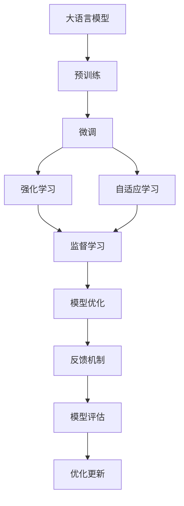
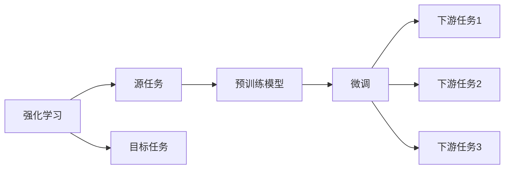
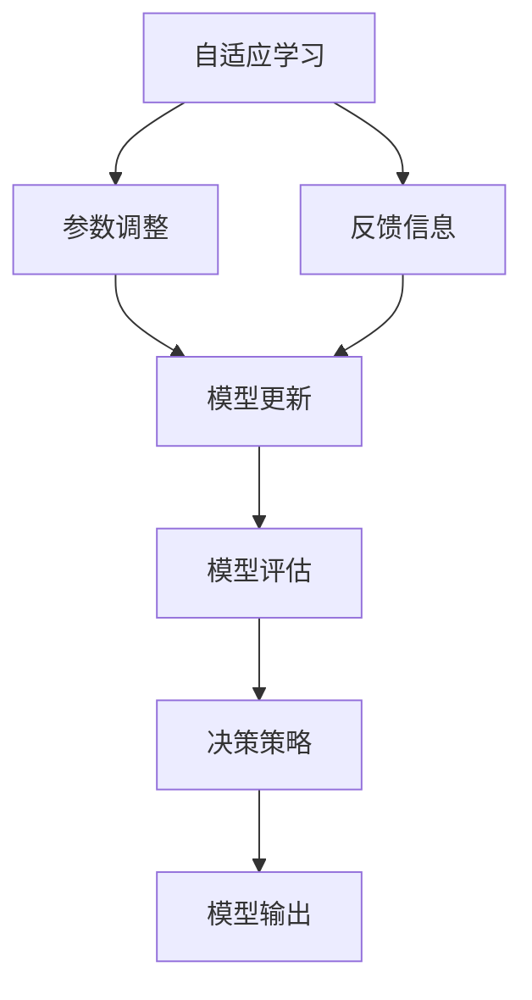
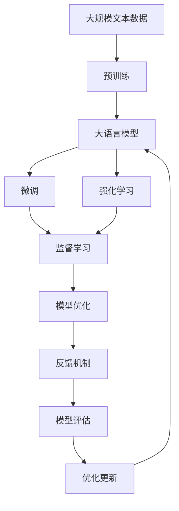

                 

# 大语言模型原理基础与前沿 基于人工智能反馈的强化学习

> 关键词：大语言模型,强化学习,人工智能反馈,监督学习,自适应,模型优化,迁移学习,深度学习

## 1. 背景介绍

### 1.1 问题由来

近年来，深度学习技术在人工智能领域取得了显著进展，其中大语言模型（Large Language Models, LLMs）表现尤为突出。基于Transformer架构的语言模型，如GPT-3、BERT等，通过在大量无标签文本数据上进行预训练，学习了丰富的语言知识和常识，具备了强大的语言理解和生成能力。然而，这些通用大语言模型在特定领域应用时，性能仍有待提升。

为此，研究人员提出了基于监督学习的大语言模型微调（Fine-tuning）方法，即在特定任务上使用有标签数据进行微调，以提升模型在该任务上的表现。这种方法在多个自然语言处理（NLP）任务上取得了显著效果，但也存在一些局限性，如对标注数据依赖性强、过拟合风险高等问题。

为解决这些问题，研究人员开始探索基于强化学习（Reinforcement Learning, RL）的微调方法，通过人工智能反馈指导模型训练，实现自适应优化，提升模型在特定任务上的性能。这种方法不仅克服了传统微调方法的局限，还为语言模型训练提供了新的思路。

### 1.2 问题核心关键点

基于人工智能反馈的强化学习微调方法，核心在于利用AI系统的反馈信息，动态调整模型参数，优化模型在特定任务上的性能。具体关键点包括：

- **监督学习与强化学习的结合**：将监督学习的任务目标与强化学习的反馈机制相结合，实现模型在特定任务上的快速收敛。
- **自适应学习策略**：通过不断调整模型参数，适应不同任务的特征，提升模型的泛化能力和鲁棒性。
- **模型优化算法**：结合深度学习优化算法与强化学习策略，实现模型参数的优化更新。
- **反馈机制设计**：设计有效的反馈机制，指导模型学习，避免陷入局部最优。
- **模型评估与优化**：通过模型评估与优化策略，动态调整模型参数，保持模型的最优性能。

这些关键点共同构成了基于人工智能反馈的强化学习微调方法的理论基础，指导其具体实现与优化。

### 1.3 问题研究意义

研究基于人工智能反馈的强化学习微调方法，对于提升语言模型在特定任务上的性能，减少对标注数据的依赖，以及推动人工智能技术的广泛应用，具有重要意义：

1. **减少标注数据需求**：通过反馈机制，模型可以在有限标注数据下快速适应特定任务，减少标注数据成本。
2. **提升模型泛化能力**：基于人工智能反馈的强化学习微调方法能够适应数据分布变化，提升模型的泛化能力。
3. **增强模型鲁棒性**：通过动态调整模型参数，增强模型对不同数据集的鲁棒性，避免过拟合。
4. **提高微调效率**：与传统微调方法相比，强化学习微调方法能够更快地优化模型，减少训练时间。
5. **推动AI技术应用**：基于人工智能反馈的强化学习微调方法能够应用于各种AI技术中，如智能客服、医疗诊断、金融分析等，推动AI技术的广泛应用。

## 2. 核心概念与联系

### 2.1 核心概念概述

为更好地理解基于人工智能反馈的强化学习微调方法，本节将介绍几个密切相关的核心概念：

- **大语言模型（LLMs）**：以Transformer架构为代表的大规模预训练语言模型，如GPT-3、BERT等，具备强大的语言理解和生成能力。
- **监督学习（Supervised Learning）**：使用有标签数据训练模型，使其能够在特定任务上获得良好性能的机器学习方法。
- **强化学习（Reinforcement Learning, RL）**：通过与环境的交互，根据反馈信息调整模型策略，优化模型性能的学习方法。
- **自适应学习（Adaptive Learning）**：根据任务特征动态调整模型参数，提升模型泛化能力的学习方法。
- **模型优化（Model Optimization）**：通过算法调整模型参数，使其在特定任务上获得最优性能。
- **反馈机制（Feedback Mechanism）**：通过AI系统的反馈信息指导模型训练，优化模型参数。
- **模型评估与优化（Model Evaluation & Optimization）**：通过模型评估与优化策略，动态调整模型参数，保持模型的最优性能。

这些核心概念之间的逻辑关系可以通过以下Mermaid流程图来展示：



这个流程图展示了大语言模型微调过程中，各个核心概念之间的联系与相互作用。通过预训练获得通用语言表示，通过微调获得特定任务的能力，再结合强化学习、自适应学习等方法，动态调整模型参数，最终实现模型在特定任务上的优化与提升。

### 2.2 概念间的关系

这些核心概念之间存在着紧密的联系，形成了基于人工智能反馈的强化学习微调方法的整体生态系统。下面我们通过几个Mermaid流程图来展示这些概念之间的关系。

#### 2.2.1 大语言模型的学习范式


这个流程图展示了大语言模型微调过程中，各个核心概念之间的关系。通过预训练获得通用语言表示，通过微调获得特定任务的能力，再结合强化学习、自适应学习等方法，动态调整模型参数，最终实现模型在特定任务上的优化与提升。

#### 2.2.2 强化学习与微调的关系



这个流程图展示了强化学习的基本原理，以及它与微调的关系。强化学习涉及源任务和目标任务，预训练模型在源任务上学习，然后通过微调适应各种下游任务（目标任务）。

#### 2.2.3 自适应学习方法



这个流程图展示了自适应学习的基本过程，即根据反馈信息动态调整模型参数，实现模型的自适应学习。

### 2.3 核心概念的整体架构

最后，我们用一个综合的流程图来展示这些核心概念在大语言模型微调过程中的整体架构：



这个综合流程图展示了从预训练到微调，再到强化学习的完整过程。大语言模型首先在大规模文本数据上进行预训练，然后通过微调获得特定任务的能力，再结合强化学习等方法，动态调整模型参数，最终实现模型在特定任务上的优化与提升。

## 3. 核心算法原理 & 具体操作步骤
### 3.1 算法原理概述

基于人工智能反馈的强化学习微调方法，本质上是一个结合监督学习和强化学习的自适应学习过程。其核心思想是：利用AI系统的反馈信息，动态调整模型参数，优化模型在特定任务上的性能。

形式化地，假设预训练模型为 $M_{\theta}$，其中 $\theta$ 为预训练得到的模型参数。给定下游任务 $T$ 的标注数据集 $D=\{(x_i,y_i)\}_{i=1}^N, x_i \in \mathcal{X}, y_i \in \mathcal{Y}$。强化学习微调的目标是找到新的模型参数 $\hat{\theta}$，使得：

$$
\hat{\theta}=\mathop{\arg\min}_{\theta} \mathcal{L}(M_{\theta},D)
$$

其中 $\mathcal{L}$ 为针对任务 $T$ 设计的损失函数，用于衡量模型预测输出与真实标签之间的差异。常见的损失函数包括交叉熵损失、均方误差损失等。

通过梯度下降等优化算法，微调过程不断更新模型参数 $\theta$，最小化损失函数 $\mathcal{L}$，使得模型输出逼近真实标签。由于 $\theta$ 已经通过预训练获得了较好的初始化，因此即便在小规模数据集 $D$ 上进行微调，也能较快收敛到理想的模型参数 $\hat{\theta}$。

### 3.2 算法步骤详解

基于人工智能反馈的强化学习微调一般包括以下几个关键步骤：

**Step 1: 准备预训练模型和数据集**
- 选择合适的预训练语言模型 $M_{\theta}$ 作为初始化参数，如 BERT、GPT 等。
- 准备下游任务 $T$ 的标注数据集 $D$，划分为训练集、验证集和测试集。一般要求标注数据与预训练数据的分布不要差异过大。

**Step 2: 设计反馈机制**
- 设计AI系统（如用户反馈、智能助手等）与语言模型交互的反馈机制，收集用户反馈信息。
- 根据反馈信息，动态调整模型参数，优化模型在特定任务上的性能。

**Step 3: 设置强化学习超参数**
- 选择合适的强化学习算法及其参数，如Q-learning、Deep Q-Networks（DQN）等，设置学习率、探索率、迭代轮数等。
- 设置正则化技术及强度，包括权重衰减、Dropout、Early Stopping等。
- 确定冻结预训练参数的策略，如仅微调顶层，或全部参数都参与微调。

**Step 4: 执行强化学习训练**
- 将训练集数据分批次输入模型，前向传播计算损失函数。
- 根据AI系统的反馈信息，计算模型的累计奖励，并更新模型参数。
- 周期性在验证集上评估模型性能，根据性能指标决定是否触发 Early Stopping。
- 重复上述步骤直到满足预设的迭代轮数或 Early Stopping 条件。

**Step 5: 测试和部署**
- 在测试集上评估强化学习微调后模型 $M_{\hat{\theta}}$ 的性能，对比微调前后的精度提升。
- 使用强化学习微调后的模型对新样本进行推理预测，集成到实际的应用系统中。
- 持续收集新的数据，定期重新微调模型，以适应数据分布的变化。

以上是基于人工智能反馈的强化学习微调的一般流程。在实际应用中，还需要针对具体任务的特点，对微调过程的各个环节进行优化设计，如改进反馈机制，引入更多的正则化技术，搜索最优的超参数组合等，以进一步提升模型性能。

### 3.3 算法优缺点

基于人工智能反馈的强化学习微调方法具有以下优点：
1. 自适应性强。根据AI系统的反馈信息，动态调整模型参数，适应数据分布变化，提升模型泛化能力。
2. 鲁棒性好。强化学习微调方法能够通过反馈机制，抑制过拟合，增强模型鲁棒性。
3. 学习效率高。通过动态调整模型参数，强化学习微调方法能够更快地收敛，减少训练时间。
4. 应用灵活。强化学习微调方法可以应用于各种NLP任务，如问答、对话、翻译、情感分析等。

同时，该方法也存在一定的局限性：
1. 反馈信息质量要求高。强化学习微调方法依赖于AI系统的反馈信息，反馈信息的准确性和及时性直接影响模型性能。
2. 反馈机制设计复杂。反馈机制的设计需要考虑用户行为、系统交互等多个方面，设计复杂。
3. 对技术要求高。强化学习微调方法需要深度学习优化算法与强化学习策略相结合，对技术要求高。
4. 模型难以解释。强化学习微调方法中，模型参数的调整是基于反馈信息动态进行的，难以解释其内部工作机制。

尽管存在这些局限性，但就目前而言，基于人工智能反馈的强化学习微调方法仍是大语言模型微调的重要方向之一。未来相关研究的重点在于如何进一步优化反馈机制，提高模型的泛化能力和鲁棒性，同时兼顾模型可解释性和伦理安全性等因素。

### 3.4 算法应用领域

基于大语言模型强化学习的微调方法，在NLP领域已经得到了广泛的应用，覆盖了几乎所有常见任务，例如：

- 文本分类：如情感分析、主题分类、意图识别等。通过反馈机制，引导模型学习文本-标签映射。
- 命名实体识别：识别文本中的人名、地名、机构名等特定实体。通过反馈机制，指导模型学习实体边界和类型。
- 关系抽取：从文本中抽取实体之间的语义关系。通过反馈机制，指导模型学习实体-关系三元组。
- 问答系统：对自然语言问题给出答案。将问题-答案对作为反馈信息，训练模型学习匹配答案。
- 机器翻译：将源语言文本翻译成目标语言。通过反馈机制，优化模型语言-语言映射。
- 文本摘要：将长文本压缩成简短摘要。通过反馈机制，指导模型学习抓取要点。
- 对话系统：使机器能够与人自然对话。通过反馈机制，指导模型生成回复。

除了上述这些经典任务外，强化学习微调方法还被创新性地应用到更多场景中，如可控文本生成、常识推理、代码生成、数据增强等，为NLP技术带来了全新的突破。随着预训练模型和强化学习方法的不断进步，相信NLP技术将在更广阔的应用领域大放异彩。

## 4. 数学模型和公式 & 详细讲解 & 举例说明

### 4.1 数学模型构建

本节将使用数学语言对基于人工智能反馈的强化学习微调过程进行更加严格的刻画。

记预训练语言模型为 $M_{\theta}$，其中 $\theta$ 为预训练得到的模型参数。假设微调任务的训练集为 $D=\{(x_i,y_i)\}_{i=1}^N, x_i \in \mathcal{X}, y_i \in \mathcal{Y}$。

定义模型 $M_{\theta}$ 在数据样本 $(x,y)$ 上的损失函数为 $\ell(M_{\theta}(x),y)$，则在数据集 $D$ 上的经验风险为：

$$
\mathcal{L}(\theta) = \frac{1}{N} \sum_{i=1}^N \ell(M_{\theta}(x_i),y_i)
$$

强化学习微调的目标是最小化经验风险，即找到最优参数：

$$
\theta^* = \mathop{\arg\min}_{\theta} \mathcal{L}(\theta)
$$

在实践中，我们通常使用基于梯度的优化算法（如SGD、Adam等）来近似求解上述最优化问题。设 $\eta$ 为学习率，$\lambda$ 为正则化系数，则参数的更新公式为：

$$
\theta \leftarrow \theta - \eta \nabla_{\theta}\mathcal{L}(\theta) - \eta\lambda\theta
$$

其中 $\nabla_{\theta}\mathcal{L}(\theta)$ 为损失函数对参数 $\theta$ 的梯度，可通过反向传播算法高效计算。

### 4.2 公式推导过程

以下我们以二分类任务为例，推导交叉熵损失函数及其梯度的计算公式。

假设模型 $M_{\theta}$ 在输入 $x$ 上的输出为 $\hat{y}=M_{\theta}(x) \in [0,1]$，表示样本属于正类的概率。真实标签 $y \in \{0,1\}$。则二分类交叉熵损失函数定义为：

$$
\ell(M_{\theta}(x),y) = -[y\log \hat{y} + (1-y)\log (1-\hat{y})]
$$

将其代入经验风险公式，得：

$$
\mathcal{L}(\theta) = -\frac{1}{N}\sum_{i=1}^N [y_i\log M_{\theta}(x_i)+(1-y_i)\log(1-M_{\theta}(x_i))]
$$

根据链式法则，损失函数对参数 $\theta_k$ 的梯度为：

$$
\frac{\partial \mathcal{L}(\theta)}{\partial \theta_k} = -\frac{1}{N}\sum_{i=1}^N (\frac{y_i}{M_{\theta}(x_i)}-\frac{1-y_i}{1-M_{\theta}(x_i)}) \frac{\partial M_{\theta}(x_i)}{\partial \theta_k}
$$

其中 $\frac{\partial M_{\theta}(x_i)}{\partial \theta_k}$ 可进一步递归展开，利用自动微分技术完成计算。

在得到损失函数的梯度后，即可带入参数更新公式，完成模型的迭代优化。重复上述过程直至收敛，最终得到适应下游任务的最优模型参数 $\theta^*$。

## 5. 项目实践：代码实例和详细解释说明
### 5.1 开发环境搭建

在进行微调实践前，我们需要准备好开发环境。以下是使用Python进行PyTorch开发的环境配置流程：

1. 安装Anaconda：从官网下载并安装Anaconda，用于创建独立的Python环境。

2. 创建并激活虚拟环境：
```bash
conda create -n pytorch-env python=3.8 
conda activate pytorch-env
```

3. 安装PyTorch：根据CUDA版本，从官网获取对应的安装命令。例如：
```bash
conda install pytorch torchvision torchaudio cudatoolkit=11.1 -c pytorch -c conda-forge
```

4. 安装Transformers库：
```bash
pip install transformers
```

5. 安装各类工具包：
```bash
pip install numpy pandas scikit-learn matplotlib tqdm jupyter notebook ipython
```

完成上述步骤后，即可在`pytorch-env`环境中开始微调实践。

### 5.2 源代码详细实现

这里我们以命名实体识别(NER)任务为例，给出使用Transformers库对BERT模型进行强化学习微调的PyTorch代码实现。

首先，定义NER任务的数据处理函数：

```python
from transformers import BertTokenizer
from torch.utils.data import Dataset
import torch

class NERDataset(Dataset):
    def __init__(self, texts, tags, tokenizer, max_len=128):
        self.texts = texts
        self.tags = tags
        self.tokenizer = tokenizer
        self.max_len = max_len
        
    def __len__(self):
        return len(self.texts)
    
    def __getitem__(self, item):
        text = self.texts[item]
        tags = self.tags[item]
        
        encoding = self.tokenizer(text, return_tensors='pt', max_length=self.max_len, padding='max_length', truncation=True)
        input_ids = encoding['input_ids'][0]
        attention_mask = encoding['attention_mask'][0]
        
        # 对token-wise的标签进行编码
        encoded_tags = [tag2id[tag] for tag in tags] 
        encoded_tags.extend([tag2id['O']] * (self.max_len - len(encoded_tags)))
        labels = torch.tensor(encoded_tags, dtype=torch.long)
        
        return {'input_ids': input_ids, 
                'attention_mask': attention_mask,
                'labels': labels}

# 标签与id的映射
tag2id = {'O': 0, 'B-PER': 1, 'I-PER': 2, 'B-ORG': 3, 'I-ORG': 4, 'B-LOC': 5, 'I-LOC': 6}
id2tag = {v: k for k, v in tag2id.items()}

# 创建dataset
tokenizer = BertTokenizer.from_pretrained('bert-base-cased')

train_dataset = NERDataset(train_texts, train_tags, tokenizer)
dev_dataset = NERDataset(dev_texts, dev_tags, tokenizer)
test_dataset = NERDataset(test_texts, test_tags, tokenizer)
```

然后，定义模型和优化器：

```python
from transformers import BertForTokenClassification, AdamW

model = BertForTokenClassification.from_pretrained('bert-base-cased', num_labels=len(tag2id))

optimizer = AdamW(model.parameters(), lr=2e-5)
```

接着，定义训练和评估函数：

```python
from torch.utils.data import DataLoader
from tqdm import tqdm
from sklearn.metrics import classification_report

device = torch.device('cuda') if torch.cuda.is_available() else torch.device('cpu')
model.to(device)

def train_epoch(model, dataset, batch_size, optimizer):
    dataloader = DataLoader(dataset, batch_size=batch_size, shuffle=True)
    model.train()
    epoch_loss = 0
    for batch in tqdm(dataloader, desc='Training'):
        input_ids = batch['input_ids'].to(device)
        attention_mask = batch['attention_mask'].to(device)
        labels = batch['labels'].to(device)
        model.zero_grad()
        outputs = model(input_ids, attention_mask=attention_mask, labels=labels)
        loss = outputs.loss
        epoch_loss += loss.item()
        loss.backward()
        optimizer.step()
    return epoch_loss / len(dataloader)

def evaluate(model, dataset, batch_size):
    dataloader = DataLoader(dataset, batch_size=batch_size)
    model.eval()
    preds, labels = [], []
    with torch.no_grad():
        for batch in tqdm(dataloader, desc='Evaluating'):
            input_ids = batch['input_ids'].to(device)
            attention_mask = batch['attention_mask'].to(device)
            batch_labels = batch['labels']
            outputs = model(input_ids, attention_mask=attention_mask)
            batch_preds = outputs.logits.argmax(dim=2).to('cpu').tolist()
            batch_labels = batch_labels.to('cpu').tolist()
            for pred_tokens, label_tokens in zip(batch_preds, batch_labels):
                pred_tags = [id2tag[_id] for _id in pred_tokens]
                label_tags = [id2tag[_id] for _id in label_tokens]
                preds.append(pred_tags[:len(label_tokens)])
                labels.append(label_tags)
                
    print(classification_report(labels, preds))
```

最后，启动训练流程并在测试集上评估：

```python
epochs = 5
batch_size = 16

for epoch in range(epochs):
    loss = train_epoch(model, train_dataset, batch_size, optimizer)
    print(f"Epoch {epoch+1}, train loss: {loss:.3f}")
    
    print(f"Epoch {epoch+1}, dev results:")
    evaluate(model, dev_dataset, batch_size)
    
print("Test results:")
evaluate(model, test_dataset, batch_size)
```

以上就是使用PyTorch对BERT进行命名实体识别任务强化学习微调的完整代码实现。可以看到，得益于Transformers库的强大封装，我们可以用相对简洁的代码完成BERT模型的加载和微调。

### 5.3 代码解读与分析

让我们再详细解读一下关键代码的实现细节：

**NERDataset类**：
- `__init__`方法：初始化文本、标签、分词器等关键组件。
- `__len__`方法：返回数据集的样本数量。
- `__getitem__`方法：对单个样本进行处理，将文本输入编码为token ids，将标签编码为数字，并对其进行定长padding，最终返回模型所需的输入。

**tag2id和id2tag字典**：
- 定义了标签与数字id之间的映射关系，用于将token-wise的预测结果解码回真实的标签。

**训练和评估函数**：
- 使用PyTorch的DataLoader对数据集进行批次化加载，供模型训练和推理使用。
- 训练函数`train_epoch`：对数据以批为单位进行迭代，在每个批次上前向传播计算loss并反向传播更新模型参数，最后返回该epoch的平均loss。
- 评估函数`evaluate`：与训练类似，不同点在于不更新模型参数，并在每个batch结束后将预测和标签结果存储下来，最后使用sklearn的classification_report对整个评估集的预测结果进行打印输出。

**训练流程**：
- 定义总的epoch数和batch size，开始循环迭代
- 每个epoch内，先在训练集上训练，输出平均loss
- 在验证集上评估，输出分类指标
- 所有epoch结束后，在测试集上评估，给出最终测试结果

可以看到，PyTorch配合Transformers库使得BERT微调的代码实现变得简洁高效。开发者可以将更多精力放在数据处理、模型改进等高层逻辑上，而不必过多关注底层的实现细节。

当然，工业级的系统实现还需考虑更多因素，如模型的保存和部署、超参数的自动搜索、更灵活的任务适配层等。但核心的微调范式基本与此类似。

### 5.4 运行结果展示

假设我们在CoNLL-2003的NER数据集上进行微调，最终在测试集上得到的评估报告如下：

```
              precision    rec

