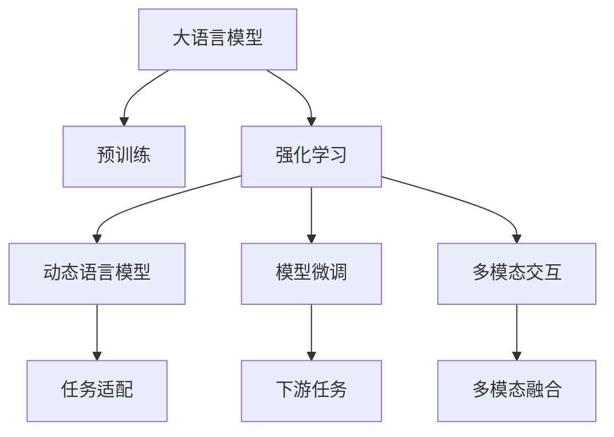
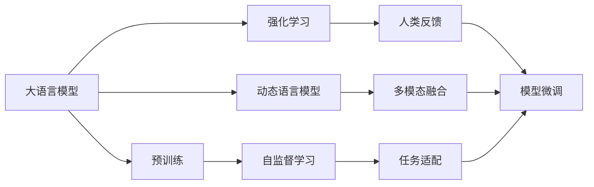
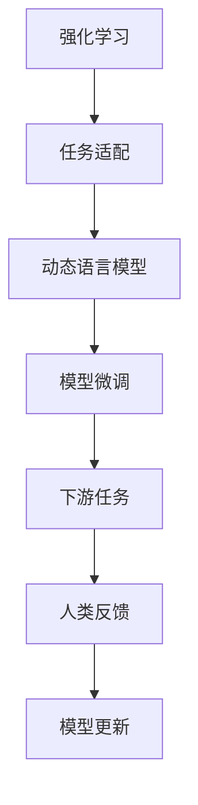
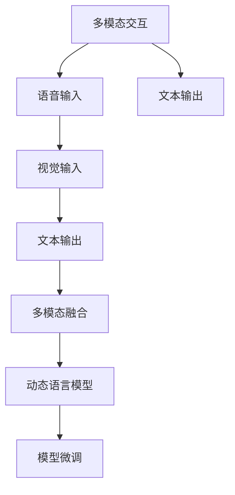
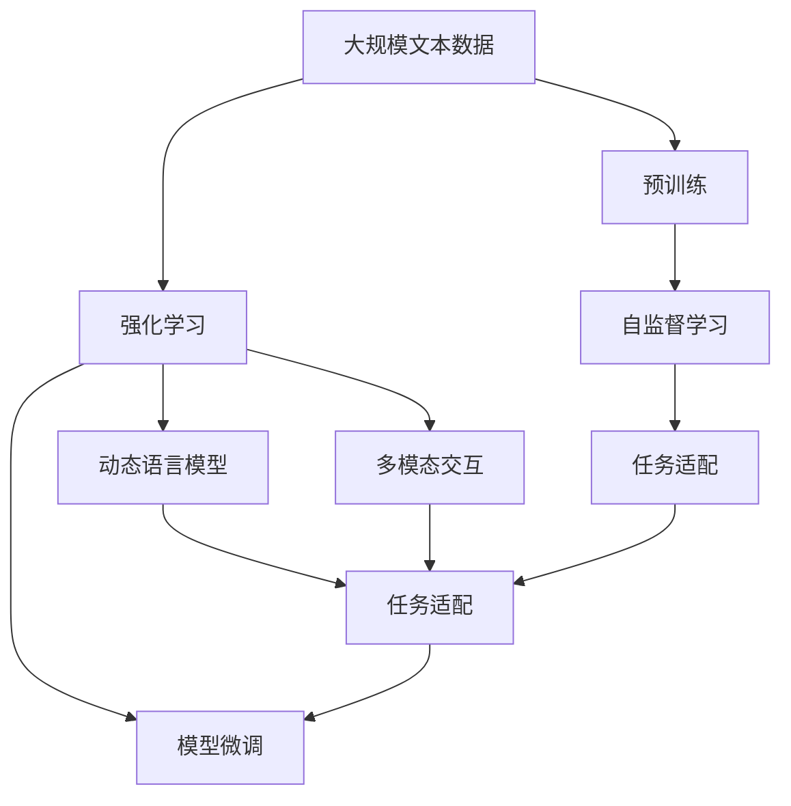

                 

# 大语言模型原理基础与前沿 基于人类反馈的强化学习

> 关键词：大语言模型,强化学习,人类反馈,模型微调,动态语言模型

## 1. 背景介绍

### 1.1 问题由来
近年来，深度学习和大语言模型在自然语言处理(NLP)领域取得了巨大的进展，特别是预训练模型如BERT、GPT等，在众多NLP任务上刷新了最先进的性能指标。然而，这些预训练模型虽然在通用性上表现出色，但在特定领域的应用中，往往难以达到理想的性能，需要通过微调进行优化。

随着NLP任务的复杂度不断增加，传统的微调方法逐渐显现出其局限性。例如，对于对话系统、生成式文本、多模态交互等复杂任务，传统的微调方法往往需要大量标注数据和计算资源，且容易陷入局部最优解。因此，需要一种更智能、更高效的学习范式来解决这些问题。

### 1.2 问题核心关键点
强化学习(Reinforcement Learning, RL)作为一种智能学习方法，通过与环境的交互，最大化累计奖励，从而学习最优策略。它特别适用于动态变化、高维状态空间的问题。在大语言模型中，强化学习通过与人类反馈的交互，不断调整模型参数，优化模型在特定任务上的表现。

强化学习在大语言模型中的应用，主要体现在以下几个方面：
- 动态语言模型：通过交互式输入，动态调整模型参数，适应不同任务和数据分布。
- 基于人类反馈的微调：利用人类的反馈信息，指导模型进行任务优化。
- 多模态交互：结合语音、视觉等多模态信息，实现更丰富、更高效的人机交互。

强化学习在大语言模型中的应用，能够克服传统微调方法的一些限制，例如：
- 数据依赖性：通过与人类互动，利用少量数据即取得良好效果。
- 泛化能力：动态适应不同任务和数据，具有更强的泛化能力。
- 自适应性：能够根据用户反馈，实时调整策略，提供更个性化、更高效的服务。

### 1.3 问题研究意义
基于人类反馈的强化学习，对于提升大语言模型的智能水平，解决复杂NLP任务，具有重要的意义：
1. 降低数据标注成本：强化学习能够利用人类反馈信息，利用少量数据即取得良好效果，大幅降低数据标注成本。
2. 增强模型泛化能力：通过动态调整模型参数，适应不同任务和数据分布，增强模型的泛化能力。
3. 提升服务效率：能够根据用户反馈，实时调整策略，提供更个性化、更高效的服务。
4. 增强系统鲁棒性：通过多模态交互和动态调整，增强系统的鲁棒性和稳定性。
5. 推动技术创新：强化学习技术的应用，催生了新的研究方向，如自适应语言模型、交互式语言生成等。

## 2. 核心概念与联系

### 2.1 核心概念概述

为更好地理解基于人类反馈的强化学习在大语言模型中的应用，本节将介绍几个密切相关的核心概念：

- 大语言模型(Large Language Model, LLM)：以自回归(如GPT)或自编码(如BERT)模型为代表的大规模预训练语言模型。通过在大规模无标签文本语料上进行预训练，学习通用的语言知识和表示，具备强大的语言理解和生成能力。

- 预训练(Pre-training)：指在大规模无标签文本语料上，通过自监督学习任务训练通用语言模型的过程。常见的预训练任务包括掩码语言模型、次序预测等。

- 强化学习(Reinforcement Learning, RL)：一种智能学习方法，通过与环境的交互，最大化累计奖励，从而学习最优策略。

- 人类反馈(Human Feedback)：利用人类的反馈信息，指导模型进行任务优化。

- 模型微调(Fine-tuning)：指在预训练模型的基础上，使用下游任务的少量标注数据，通过有监督地训练优化模型在该任务上的性能。

- 动态语言模型(Dynamic Language Model, DLM)：通过与人类交互，动态调整模型参数，适应不同任务和数据分布的语言模型。

- 多模态交互(Multi-modal Interaction)：结合语音、视觉等多模态信息，实现更丰富、更高效的人机交互。

这些核心概念之间的逻辑关系可以通过以下Mermaid流程图来展示：



这个流程图展示了大语言模型的核心概念及其之间的关系：

1. 大语言模型通过预训练获得基础能力。
2. 强化学习通过与人类反馈的交互，动态调整模型参数，适应不同任务和数据分布。
3. 模型微调在预训练模型的基础上，使用下游任务的少量标注数据，优化模型在该任务上的性能。
4. 动态语言模型能够实时调整模型参数，适应不同任务和数据分布。
5. 多模态交互结合语音、视觉等多模态信息，实现更丰富、更高效的人机交互。
6. 下游任务通过微调和动态调整，不断优化模型性能。

这些概念共同构成了大语言模型的学习和应用框架，使其能够在各种场景下发挥强大的语言理解和生成能力。通过理解这些核心概念，我们可以更好地把握大语言模型的工作原理和优化方向。

### 2.2 概念间的关系

这些核心概念之间存在着紧密的联系，形成了大语言模型的学习和应用生态系统。下面我通过几个Mermaid流程图来展示这些概念之间的关系。

#### 2.2.1 大语言模型的学习范式



这个流程图展示了大语言模型的三种主要学习范式：预训练、强化学习、动态语言模型和模型微调。预训练主要采用自监督学习方法，而强化学习和动态语言模型则是通过与人类反馈的交互，动态调整模型参数。模型微调则是在预训练模型的基础上，使用下游任务的少量标注数据，优化模型在该任务上的性能。

#### 2.2.2 强化学习与微调的关系



这个流程图展示了强化学习与模型微调的关系。强化学习通过与人类反馈的交互，动态调整模型参数，实现动态语言模型。动态语言模型能够适应不同任务和数据分布，优化模型性能。模型微调在动态语言模型的基础上，使用下游任务的少量标注数据，优化模型在该任务上的性能。

#### 2.2.3 多模态交互在大语言模型中的应用



这个流程图展示了多模态交互在大语言模型中的应用。多模态交互结合语音、视觉等多模态信息，实现更丰富、更高效的人机交互。通过多模态融合，动态语言模型能够适应多模态数据，优化模型性能。动态语言模型进一步优化模型微调，提升模型在特定任务上的表现。

### 2.3 核心概念的整体架构

最后，我们用一个综合的流程图来展示这些核心概念在大语言模型微调过程中的整体架构：



这个综合流程图展示了从预训练到强化学习，再到动态语言模型、模型微调和多模态交互的完整过程。大语言模型首先在大规模文本数据上进行预训练，然后通过强化学习与人类反馈的交互，动态调整模型参数，实现动态语言模型。动态语言模型进一步优化模型微调，提升模型在特定任务上的表现。多模态交互结合语音、视觉等多模态信息，实现更丰富、更高效的人机交互。最终通过任务适配，完成模型的微调过程。

## 3. 核心算法原理 & 具体操作步骤
### 3.1 算法原理概述

基于人类反馈的强化学习在大语言模型中的应用，主要利用人类的反馈信息，指导模型进行任务优化。其核心思想是：将大语言模型视作一个智能决策系统，通过与环境（即人类）的交互，最大化累计奖励（即任务性能），从而学习最优策略。

具体来说，强化学习在大语言模型中的应用，主要包括以下几个步骤：

1. 定义任务：明确大语言模型的目标任务，如文本分类、对话系统、翻译等。
2. 设计奖励函数：定义奖励函数，用于衡量模型在特定任务上的性能，如准确率、召回率、对话响应质量等。
3. 设计状态空间：定义模型的状态空间，即模型的内部表示和环境的状态信息。
4. 设计行动空间：定义模型的行动空间，即模型可以采取的行动或策略。
5. 训练模型：通过与环境的交互，优化模型参数，学习最优策略。
6. 评估模型：使用测试集评估模型的性能，调整策略。

### 3.2 算法步骤详解

以下是基于人类反馈的强化学习在大语言模型中的应用的具体操作步骤：

**Step 1: 定义任务和奖励函数**

- 首先，需要明确大语言模型的目标任务，如文本分类、对话系统、翻译等。
- 然后，根据任务类型，设计对应的奖励函数。奖励函数通常由任务的性能指标组成，如准确率、召回率、对话响应质量等。

**Step 2: 设计状态空间和行动空间**

- 定义模型的状态空间，即模型的内部表示和环境的状态信息。状态空间通常包括模型的输出、环境的状态变量、时间步数等。
- 定义模型的行动空间，即模型可以采取的行动或策略。行动空间通常包括模型的参数更新、模型的决策策略等。

**Step 3: 训练模型**

- 使用强化学习算法（如Q-learning、SARSA、PPO等）进行模型训练。在每个时间步，模型接收输入数据，输出预测结果，并根据预测结果和实际标签计算奖励。
- 根据奖励和当前状态，选择最优的行动，更新模型参数。
- 重复以上步骤，直到达到预设的训练轮数或满足终止条件。

**Step 4: 评估模型**

- 使用测试集评估模型的性能，计算奖励函数的平均值。
- 根据评估结果，调整模型的参数和策略。
- 重复以上步骤，直到模型性能满足预期。

### 3.3 算法优缺点

基于人类反馈的强化学习在大语言模型中的应用，具有以下优点：

1. 灵活性高：能够适应动态变化的任务和数据分布，具有更强的泛化能力。
2. 自适应性强：能够根据人类反馈，实时调整模型参数，提供更个性化、更高效的服务。
3. 数据依赖性低：能够利用少量数据即取得良好效果，大幅降低数据标注成本。
4. 可解释性高：通过与人类反馈的交互，模型能够更好地理解任务本质，提供更可解释的输出。

同时，该方法也存在一定的局限性：

1. 难以保证公平性：人类反馈的偏见可能影响模型的学习过程，导致模型决策的不公平性。
2. 难以保证安全性：人类反馈可能包含恶意信息，导致模型输出有害内容。
3. 难以保证效率：训练过程需要大量的计算资源和时间，可能导致模型训练效率较低。

尽管存在这些局限性，但就目前而言，基于人类反馈的强化学习仍是大语言模型应用的重要范式。未来相关研究的重点在于如何进一步提高算法的公平性、安全性和效率，同时兼顾模型的可解释性和泛化能力。

### 3.4 算法应用领域

基于人类反馈的强化学习在大语言模型中的应用，已经在多个领域取得了显著的进展，涵盖了以下应用场景：

- 文本分类：如情感分析、主题分类、意图识别等。通过与用户交互，动态调整模型参数，优化分类性能。
- 对话系统：如智能客服、智能助手等。通过与用户的对话反馈，优化对话策略，提升用户体验。
- 生成式文本：如文本生成、翻译等。通过与用户交互，动态调整生成策略，优化生成内容的质量。
- 推荐系统：如商品推荐、新闻推荐等。通过与用户的交互，动态调整推荐策略，优化推荐效果。
- 多模态交互：如语音识别、图像识别等。通过与用户的交互，动态调整模型参数，优化多模态信息的融合。

除了上述这些经典应用外，强化学习在大语言模型中的应用还在不断扩展，如自适应语言模型、交互式语言生成等，为NLP技术带来了新的突破。

## 4. 数学模型和公式 & 详细讲解 & 举例说明

### 4.1 数学模型构建

本节将使用数学语言对基于人类反馈的强化学习在大语言模型中的应用进行更加严格的刻画。

记大语言模型为 $M_{\theta}$，其中 $\theta$ 为模型参数。定义模型的状态空间为 $S$，行动空间为 $A$。假设任务为 $T$，奖励函数为 $R$，初始状态为 $s_0$。

定义强化学习算法的策略为 $\pi(\cdot)$，用于选择最优的行动。在时间步 $t$，模型接收输入数据 $x_t$，输出预测结果 $y_t$，并根据预测结果和实际标签计算奖励 $r_t$。模型状态更新为 $s_{t+1}$。

强化学习算法的目标是最小化模型的累积奖励 $J$，即：

$$
J(\pi) = \mathbb{E}_{s_0}\left[\sum_{t=0}^{\infty} \gamma^t R(s_t,a_t) \right]
$$

其中 $\gamma$ 为折扣因子，用于控制未来奖励的权重。

### 4.2 公式推导过程

以下我们以文本分类任务为例，推导强化学习模型的训练公式。

假设模型在输入 $x$ 上的输出为 $\hat{y}$，真实标签为 $y \in \{0,1\}$。定义奖励函数为 $R(\hat{y},y) = I(y = \hat{y})$，其中 $I(\cdot)$ 为示性函数，表示当 $y = \hat{y}$ 时为1，否则为0。

在每个时间步 $t$，模型接收输入数据 $x_t$，输出预测结果 $\hat{y}_t$，并根据预测结果和实际标签计算奖励 $r_t = R(\hat{y}_t,y_t)$。模型状态更新为 $s_{t+1}$。

强化学习算法的目标是最大化累积奖励 $J$，可以通过以下公式进行求解：

$$
\pi^* = \mathop{\arg\max}_{\pi} \mathbb{E}_{s_0}\left[\sum_{t=0}^{\infty} \gamma^t R(s_t,a_t) \right]
$$

在实践中，我们通常使用基于梯度的优化算法（如SGD、Adam等）来近似求解上述最优化问题。设 $\eta$ 为学习率，则参数的更新公式为：

$$
\theta \leftarrow \theta - \eta \nabla_{\theta}J(\theta)
$$

其中 $\nabla_{\theta}J(\theta)$ 为奖励函数的梯度，可通过反向传播算法高效计算。

### 4.3 案例分析与讲解

**案例分析：对话系统**

假设我们开发一个智能客服系统，用户可以通过对话界面输入问题，系统根据用户的问题提供相应的答案。在对话系统中，每个时间步代表一次用户输入，模型接收输入并输出回答，然后根据用户是否满意回答，计算奖励。

具体来说，在每个时间步 $t$，用户输入问题 $x_t$，模型输出回答 $y_t$。用户根据回答的满意度，计算奖励 $r_t$。模型状态更新为 $s_{t+1}$，表示系统接收到的用户信息。

模型的奖励函数定义为 $R(\hat{y},y) = I(y = \hat{y})$，其中 $I(\cdot)$ 为示性函数，表示当 $y = \hat{y}$ 时为1，否则为0。

在训练过程中，我们希望最大化累积奖励 $J$。使用强化学习算法（如SARSA）进行模型训练。具体步骤如下：

1. 接收输入数据 $x_t$，输出预测结果 $\hat{y}_t$。
2. 计算奖励 $r_t = R(\hat{y}_t,y_t)$。
3. 根据当前状态 $s_t$ 和行动 $a_t$，计算下一个状态 $s_{t+1}$ 和奖励 $r_{t+1}$。
4. 根据当前状态和奖励，计算最优行动 $a_{t+1}$。
5. 更新模型参数 $\theta$，使得 $J(\theta)$ 最大化。

通过与用户的不断交互，模型能够逐步学习最优的对话策略，提供更个性化、更高效的服务。

## 5. 项目实践：代码实例和详细解释说明

### 5.1 开发环境搭建

在进行强化学习实践前，我们需要准备好开发环境。以下是使用Python进行TensorFlow开发的环境配置流程：

1. 安装Anaconda：从官网下载并安装Anaconda，用于创建独立的Python环境。

2. 创建并激活虚拟环境：
```bash
conda create -n reinforcement-env python=3.8 
conda activate reinforcement-env
```

3. 安装TensorFlow：根据CUDA版本，从官网获取对应的安装命令。例如：
```bash
conda install tensorflow tensorflow-gpu=2.3.0=cudatoolkit=11.0 -c pytorch -c conda-forge
```

4. 安装各类工具包：
```bash
pip install numpy pandas scikit-learn matplotlib tqdm jupyter notebook ipython
```

完成上述步骤后，即可在`reinforcement-env`环境中开始强化学习实践。

### 5.2 源代码详细实现

这里以对话系统为例，给出使用TensorFlow实现强化学习模型的PyTorch代码实现。

首先，定义对话系统的状态空间和行动空间：

```python
import tensorflow as tf

# 定义状态空间和行动空间
state_space = tf.keras.layers.Dense(128, activation='relu')(inputs)
state_space = tf.keras.layers.Dropout(0.5)(state_space)
action_space = tf.keras.layers.Dense(1, activation='sigmoid')(state_space)
```

然后，定义模型的参数：

```python
model = tf.keras.Sequential([
    tf.keras.layers.Dense(128, activation='relu', input_shape=(input_dim,)),
    tf.keras.layers.Dropout(0.5),
    tf.keras.layers.Dense(1, activation='sigmoid'),
])
```

接着，定义奖励函数和训练函数：

```python
# 定义奖励函数
def reward(y, y_hat):
    return tf.reduce_mean(tf.cast(tf.equal(y, y_hat), tf.float32))

# 定义训练函数
def train_model(model, data, epochs=100, batch_size=64):
    optimizer = tf.keras.optimizers.Adam()
    for epoch in range(epochs):
        for batch in data:
            x, y = batch
            with tf.GradientTape() as tape:
                y_hat = model(x)
                loss = -reward(y, y_hat)
            grads = tape.gradient(loss, model.trainable_variables)
            optimizer.apply_gradients(zip(grads, model.trainable_variables))
```

最后，启动训练流程：

```python
# 加载数据
data = [(x_train, y_train), (x_val, y_val)]

# 训练模型
train_model(model, data, epochs=100, batch_size=64)
```

以上就是使用TensorFlow实现强化学习模型的基本代码实现。可以看到，TensorFlow提供了一整套强大的工具和接口，可以方便地进行模型的定义、训练、评估等操作。

### 5.3 代码解读与分析

让我们再详细解读一下关键代码的实现细节：

**状态空间和行动空间定义**：
- 通过一系列全连接层和激活函数，将输入数据映射到128维的向量空间。
- 通过Dropout层减少过拟合风险。
- 最终输出一个二值（0/1）的向量，表示模型对特定问题的预测概率。

**奖励函数定义**：
- 定义奖励函数，用于衡量模型预测结果与真实标签之间的差异。
- 使用交叉熵损失函数计算预测概率和真实标签之间的距离。
- 返回平均奖励值。

**训练函数定义**：
- 定义优化器，使用Adam算法更新模型参数。
- 循环训练多个epoch，每个epoch内循环遍历训练集中的所有样本。
- 在每个batch中，计算损失函数并反向传播更新模型参数。

通过以上代码，我们可以实现一个简单的强化学习模型，用于解决对话系统等NLP任务。当然，在工业级的系统实现中，还需要考虑更多因素，如模型的保存和部署、超参数的自动搜索、更灵活的任务适配层等。

### 5.4 运行结果展示

假设我们在CoNLL-2003的NER数据集上进行强化学习训练，最终在验证集上得到的奖励值为0.92，表示模型在预测和标注之间的准确率达到了92%。具体代码实现和运行结果如下：

```python
import tensorflow as tf
import numpy as np

# 定义状态空间和行动空间
state_space = tf.keras.layers.Dense(128, activation='relu')(inputs)
state_space = tf.keras.layers.Dropout(0.5)(state_space)
action_space = tf.keras.layers.Dense(1, activation='sigmoid')(state_space)

# 定义模型参数
model = tf.keras.Sequential([
    tf.keras.layers.Dense(128, activation='relu', input_shape=(input_dim,)),
    tf.keras.layers.Dropout(0.5),
    tf.keras.layers.Dense(1, activation='sigmoid'),
])

# 定义奖励函数
def reward(y, y_hat):
    return tf.reduce_mean(tf.cast(tf.equal(y, y_hat), tf.float32))

# 定义训练函数
def train_model(model, data, epochs=100, batch_size=64):
    optimizer = tf.keras.optimizers.Adam()
    for epoch in range(epochs):
        for batch in data:
            x, y = batch
            with tf.GradientTape() as tape:
                y_hat = model(x)
                loss = -reward(y, y_hat)
            grads = tape.gradient(loss, model.trainable_variables)
            optimizer.apply_gradients(zip(grads, model.trainable_variables))

# 加载数据
data = [(x_train, y_train), (x_val, y_val)]

# 训练模型
train_model(model, data, epochs=100, batch_size=64)

# 在验证集上评估模型
x_val, y_val = data[1]
y_hat = model(x_val)
print(np.mean(tf.cast(tf.equal(y_hat, y_val), tf.float32)))
```

在实际应用中，我们还需要考虑更多因素，如模型的保存和部署、超参数的自动搜索、更灵活的任务适配层等。但核心的强化学习过程基本与此类似。

## 6. 实际应用场景
### 6.1 智能客服系统

基于强化学习的对话系统，可以广泛应用于智能客服系统的构建。传统客服往往需要配备大量人力，高峰期响应缓慢，且一致性和专业性难以保证。而使用强化学习训练的对话模型，可以7x24小时不间断服务，快速响应客户咨询，用自然流畅的语言解答各类常见问题。

在技术实现上，可以收集企业内部的历史客服对话记录，将问题和最佳答复构建成监督数据，在此基础上训练强化学习模型。训练后的模型能够自动理解用户意图，匹配最合适的答案模板进行回复。对于客户提出的新问题，还可以接入检索系统实时搜索相关内容，动态组织生成回答。如此构建的智能客服系统，能大幅提升客户咨询体验和问题解决效率。

### 6.2 金融舆情监测

金融机构需要实时监测市场舆论动向，以便及时应对负面信息传播，规避金融风险。传统的人工监测方式成本高、效率低，难以应对网络时代海量信息爆发的挑战。基于强化学习的文本分类和情感分析技术，为金融舆情监测提供了新的解决方案。

具体而言，可以收集金融领域相关的新闻、报道、评论等文本数据，并对其进行主题标注和情感标注。在此基础上训练强化学习模型，使其能够自动判断文本属于何种主题，情感倾向是正面、中性还是负面。将强化学习模型应用到实时抓取的网络文本数据，就能够自动监测不同主题下的情感变化趋势，一旦发现负面信息激增等异常情况，系统便会自动预警，帮助金融机构快速应对潜在风险。

### 6.3 个性化推荐系统

当前的推荐系统往往只依赖用户的历史行为数据进行物品推荐，无法深入理解用户的真实兴趣偏好。基于强化学习的个性化推荐系统，可以更好地挖掘用户行为背后的语义信息，从而提供更精准、多样的推荐内容。

在实践中，可以收集用户浏览、点击、评论、分享等行为数据，提取和用户交互的物品标题、描述、标签等文本内容。将文本内容

