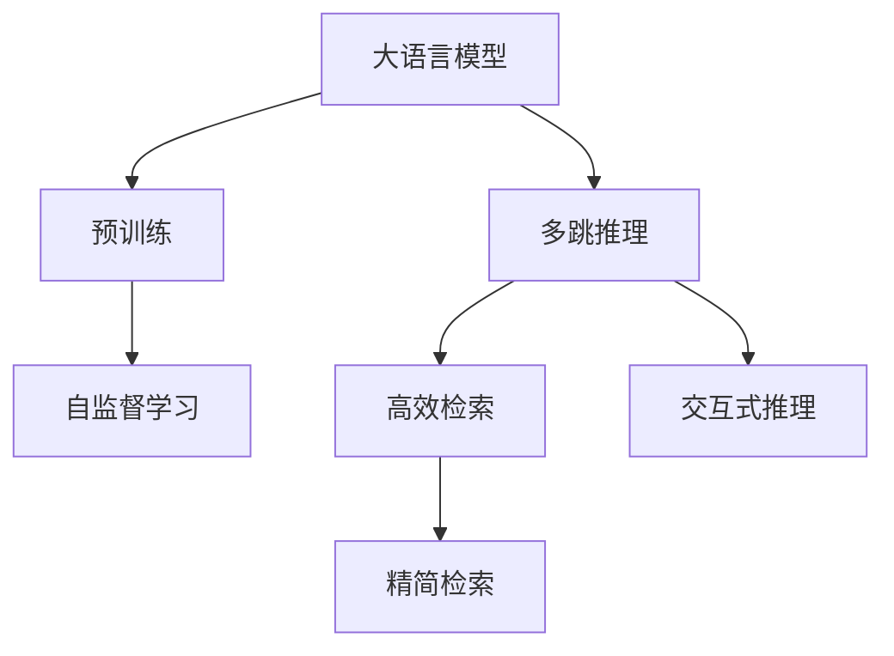
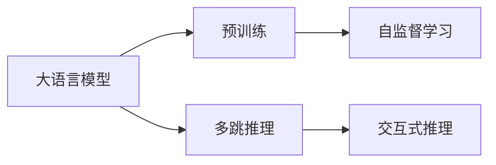
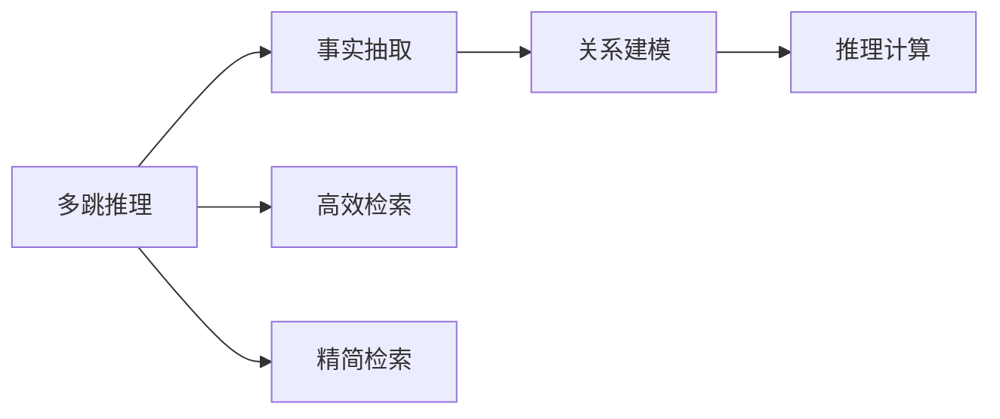
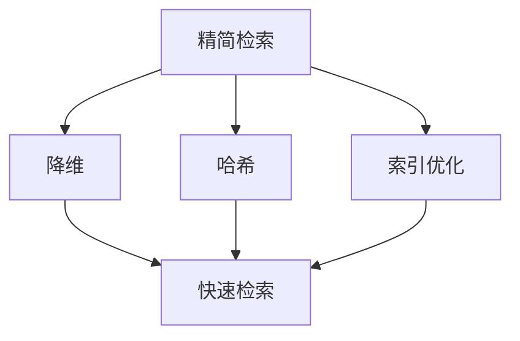
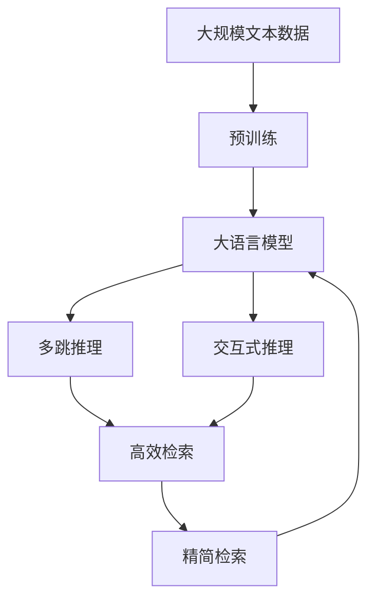

                 

# 大语言模型原理基础与前沿 通过高效和精简检索进行问答和多跳推理

## 1. 背景介绍

### 1.1 问题由来
近年来，随着深度学习技术的飞速发展，大语言模型（Large Language Models, LLMs）在自然语言处理（NLP）领域取得了重大突破。这些模型通过在大规模无标签文本数据上进行预训练，学习到了丰富的语言知识和常识，可以执行各种自然语言理解任务，如文本分类、命名实体识别、情感分析等。

然而，大语言模型在执行多跳推理（multi-hop reasoning）任务时，如问答、逻辑推理、知识图谱查询等，性能仍有所欠缺。传统的基于规则的方法无法满足复杂语义和长距离依赖的推理需求。因此，如何使大语言模型在多跳推理任务上取得优异表现，成为当前研究的热点问题。

### 1.2 问题核心关键点
多跳推理是让大语言模型通过理解文本中的事实和关系，跨多个步骤推导出新结论的能力。关键点包括：

- 事实抽取：从文本中识别和抽取已知事实。
- 关系建模：理解文本中的隐含关系，如因果、蕴含、相似等。
- 推理计算：根据已知事实和关系，进行跨步推理，得出新结论。

传统的基于规则或模板的方法，难以处理自然语言中的复杂多跳推理。而基于大语言模型的推理方法，可以更好地利用模型预训练学到的知识，通过动态调整推理路径，实现更灵活和准确的推理。

### 1.3 问题研究意义
研究大语言模型在多跳推理任务上的应用，对于提升NLP模型的智能水平，拓展模型应用范围，推动人工智能技术在决策支持、知识图谱、智能问答等领域的发展，具有重要意义。具体包括：

1. 提升推理能力：使大语言模型能够理解和推理自然语言中的复杂关系，提高模型在推理任务上的表现。
2. 丰富知识库：结合外部知识图谱，使模型能够整合更多知识，拓展模型的知识边界。
3. 加速模型训练：通过精简检索技术，使模型能够快速从知识库中检索相关事实，加速推理过程。
4. 强化模型泛化：通过多跳推理，模型能够泛化到更复杂和现实的任务场景中。
5. 支持智能决策：使模型能够辅助人类进行决策，提高决策的准确性和效率。

## 2. 核心概念与联系

### 2.1 核心概念概述

为更好地理解大语言模型在多跳推理任务上的应用，本节将介绍几个关键概念：

- 大语言模型(Large Language Models, LLMs)：通过在大规模文本数据上预训练得到的通用语言模型，能够执行各种自然语言理解和生成任务。
- 预训练(Pre-training)：在大规模无标签文本数据上，通过自监督学习任务训练通用语言模型的过程。常见的预训练任务包括语言建模、掩码语言模型等。
- 多跳推理(Multi-hop Reasoning)：从文本中识别和抽取已知事实，理解隐含关系，进行跨步推理，得出新结论的过程。
- 高效检索(Efficient Retrieval)：利用索引、哈希等技术，快速从外部知识库或文档集合中检索相关事实，支持多跳推理任务的执行。
- 精简检索(Simplified Retrieval)：通过降维、索引优化等技术，进一步提高检索效率，减少计算开销。
- 交互式推理(Interactive Reasoning)：在大语言模型与用户之间进行交互，逐步引导模型进行推理，得到最终结论。

这些概念之间的逻辑关系可以通过以下Mermaid流程图来展示：



这个流程图展示了从预训练到多跳推理任务的完整流程，包括大语言模型、多跳推理、高效检索、精简检索和交互式推理等关键概念。通过这些概念的组合，可以构建起大语言模型在多跳推理任务上的完整应用生态。

### 2.2 概念间的关系

这些核心概念之间存在着紧密的联系，形成了大语言模型在多跳推理任务上的应用框架。下面我们通过几个Mermaid流程图来展示这些概念之间的关系。

#### 2.2.1 大语言模型的学习范式



这个流程图展示了从预训练到大语言模型在多跳推理任务上的应用范式。大语言模型通过预训练学习到通用的语言表示，然后通过多跳推理和交互式推理，执行复杂的自然语言理解任务。

#### 2.2.2 多跳推理与检索的关系



这个流程图展示了多跳推理与检索技术的关系。多跳推理任务需要从文本中抽取事实和建模关系，然后通过推理计算得出新结论。检索技术可以辅助这一过程，快速从知识库或文档集合中检索相关事实，支持推理任务的执行。

#### 2.2.3 精简检索方法



这个流程图展示了精简检索的主要方法。精简检索通过降维、哈希、索引优化等技术，进一步提高检索效率，减少计算开销，使得模型在执行多跳推理任务时更加高效。

#### 2.2.4 交互式推理流程


这个流程图展示了交互式推理的基本流程。交互式推理通过用户提问，引导模型进行事实抽取、关系建模和推理计算，最终得到输出结论。这一过程可以逐步引导模型进行推理，减少错误推理的可能性。

### 2.3 核心概念的整体架构

最后，我们用一个综合的流程图来展示这些核心概念在大语言模型多跳推理任务上的整体架构：



这个综合流程图展示了从预训练到多跳推理任务的完整过程。大语言模型首先在大规模文本数据上进行预训练，然后通过多跳推理和交互式推理，执行复杂的自然语言理解任务。高效检索和精简检索技术可以进一步提升推理效率，使得模型在执行多跳推理任务时更加高效。

## 3. 核心算法原理 & 具体操作步骤
### 3.1 算法原理概述

基于大语言模型的多跳推理任务，本质上是一个将自然语言文本映射到推理路径的过程。其核心思想是：利用大语言模型预训练学到的知识，通过推理计算和检索技术，逐步得出结论。

形式化地，假设多跳推理任务为 $T$，事实集合为 $F$，关系集合为 $R$。给定一个输入文本 $x$，目标是从文本中抽取 $k$ 个事实 $f_1, f_2, ..., f_k$，以及 $k-1$ 个关系 $r_1, r_2, ..., r_{k-1}$，最后通过推理计算得到结论 $y$。

大语言模型的多跳推理过程可以表示为：

$$
y = \mathop{\arg\max}_{y} P(y|x, f_1, f_2, ..., f_k, r_1, r_2, ..., r_{k-1})
$$

其中 $P(y|x, f_1, f_2, ..., f_k, r_1, r_2, ..., r_{k-1})$ 为给定事实和关系的条件概率。

通过大语言模型的推理计算和检索技术，可以逐步计算出这一概率值，从而得出结论 $y$。

### 3.2 算法步骤详解

基于大语言模型的多跳推理任务，一般包括以下几个关键步骤：

**Step 1: 准备预训练模型和数据集**
- 选择合适的预训练语言模型 $M_{\theta}$ 作为初始化参数，如 BERT、GPT 等。
- 准备多跳推理任务的标注数据集 $D=\{(x,y)\}_{i=1}^N$，划分为训练集、验证集和测试集。一般要求标注数据与预训练数据的分布不要差异过大。

**Step 2: 添加推理适配层**
- 根据任务类型，在预训练模型顶层设计合适的输出层和推理函数。
- 对于推理任务，通常在顶层添加推理解码器，通过搜索推理路径计算条件概率。

**Step 3: 设置推理超参数**
- 选择合适的优化算法及其参数，如 AdamW、SGD 等，设置学习率、批大小、迭代轮数等。
- 设置正则化技术及强度，包括权重衰减、Dropout、Early Stopping 等。
- 确定冻结预训练参数的策略，如仅微调顶层，或全部参数都参与推理。

**Step 4: 执行推理计算**
- 将训练集数据分批次输入模型，前向传播计算推理路径。
- 反向传播计算参数梯度，根据设定的优化算法和学习率更新模型参数。
- 周期性在验证集上评估模型性能，根据性能指标决定是否触发 Early Stopping。
- 重复上述步骤直到满足预设的迭代轮数或 Early Stopping 条件。

**Step 5: 测试和部署**
- 在测试集上评估推理后模型 $M_{\hat{\theta}}$ 的性能，对比推理前后的精度提升。
- 使用推理后模型对新样本进行推理预测，集成到实际的应用系统中。
- 持续收集新的数据，定期重新推理模型，以适应数据分布的变化。

以上是基于大语言模型的多跳推理任务的一般流程。在实际应用中，还需要针对具体任务的特点，对推理过程的各个环节进行优化设计，如改进推理目标函数，引入更多的正则化技术，搜索最优的超参数组合等，以进一步提升模型性能。

### 3.3 算法优缺点

基于大语言模型的多跳推理方法具有以下优点：
1. 灵活高效。利用大语言模型预训练学到的知识，通过动态调整推理路径，实现更灵活和准确的推理。
2. 泛化能力强。大语言模型能够利用海量的无监督数据，学习到通用的语言表示，适应更多复杂多变的任务。
3. 可解释性强。通过检索技术和推理路径的可视化，可以理解模型的推理过程，增强推理结果的可解释性。
4. 算法简单。相对于传统的基于规则的推理方法，大语言模型基于概率统计，计算过程相对简单。

同时，该方法也存在一定的局限性：
1. 推理效率受限。大语言模型推理计算的开销较大，推理速度较慢，难以支持实时应用。
2. 检索成本高昂。大规模外部知识库的检索需要大量的计算资源，检索成本较高。
3. 模型泛化性差。模型在特定领域或特定任务上的表现可能不如传统基于规则的方法。
4. 输出不稳定。模型推理结果受输入文本和推理路径的影响较大，输出不够稳定。

尽管存在这些局限性，但就目前而言，基于大语言模型的多跳推理方法仍是大规模语言模型应用的重要方向之一。未来相关研究的重点在于如何进一步降低检索成本，提高推理效率，同时兼顾可解释性和鲁棒性等因素。

### 3.4 算法应用领域

基于大语言模型的多跳推理方法，已经在诸多领域得到了应用，覆盖了各种类型的复杂自然语言理解任务。例如：

- 问答系统：对自然语言问题给出答案。将问题-答案对作为训练样本，训练模型学习匹配答案。
- 逻辑推理：判断文本中的逻辑关系，如蕴含、矛盾、对立等。通过推理计算得出结论。
- 知识图谱查询：在知识图谱中查询特定实体之间的关系，如实体-关系-实体（RER）三元组。
- 自然语言生成：生成符合特定逻辑结构的文本。通过检索事实和关系，逐步生成文本。
- 自然语言推理（NLI）：判断给定的前提与假设之间的关系，如矛盾、蕴含、中立等。通过推理计算得出结论。
- 机器翻译：将源语言文本翻译成目标语言。通过检索相关事实和关系，支持翻译过程。
- 对话系统：使机器能够与人自然对话。通过推理计算生成响应。

除了上述这些经典任务外，大语言模型多跳推理技术还被创新性地应用到更多场景中，如可控文本生成、多模态推理、智能推荐等，为NLP技术带来了全新的突破。随着预训练模型和推理方法的不断进步，相信NLP技术将在更广阔的应用领域大放异彩。

## 4. 数学模型和公式 & 详细讲解
### 4.1 数学模型构建

本节将使用数学语言对基于大语言模型的多跳推理过程进行更加严格的刻画。

记多跳推理任务为 $T$，事实集合为 $F=\{f_1, f_2, ..., f_k\}$，关系集合为 $R=\{r_1, r_2, ..., r_{k-1}\}$。假设模型 $M_{\theta}$ 在输入 $x$ 上的推理路径为 $P(x, f_1, f_2, ..., f_k, r_1, r_2, ..., r_{k-1})$，推理结果为 $y$。

定义模型 $M_{\theta}$ 在数据样本 $(x,y)$ 上的推理损失函数为 $\ell(M_{\theta}(x),y)$，则在数据集 $D$ 上的经验风险为：

$$
\mathcal{L}(\theta) = \frac{1}{N}\sum_{i=1}^N \ell(M_{\theta}(x_i),y_i)
$$

微调的优化目标是最小化经验风险，即找到最优参数：

$$
\theta^* = \mathop{\arg\min}_{\theta} \mathcal{L}(\theta)
$$

在实践中，我们通常使用基于梯度的优化算法（如SGD、AdamW等）来近似求解上述最优化问题。设 $\eta$ 为学习率，$\lambda$ 为正则化系数，则参数的更新公式为：

$$
\theta \leftarrow \theta - \eta \nabla_{\theta}\mathcal{L}(\theta) - \eta\lambda\theta
$$

其中 $\nabla_{\theta}\mathcal{L}(\theta)$ 为推理损失函数对参数 $\theta$ 的梯度，可通过反向传播算法高效计算。

### 4.2 公式推导过程

以下我们以逻辑推理任务为例，推导最大熵模型的推理损失函数及其梯度的计算公式。

假设模型 $M_{\theta}$ 在输入 $x$ 上的推理路径为 $P(x, f_1, f_2, ..., f_k, r_1, r_2, ..., r_{k-1})$，推理结果为 $y$。推理路径 $P$ 可以表示为一系列推理步骤的序列，每个步骤由事实 $f_i$ 和关系 $r_i$ 组成。例如，推理路径 $P = (f_1, r_1, f_2, r_2, ..., f_k, r_{k-1})$，表示先推理 $f_1$ 得到 $y_1$，再根据 $r_1$ 推理 $f_2$ 得到 $y_2$，以此类推。

最大熵推理模型的目标是最小化推理结果 $y$ 的条件概率 $P(y|x)$。条件概率 $P(y|x)$ 可以表示为：

$$
P(y|x) = \prod_{i=1}^k P(f_i|x) \prod_{i=1}^{k-1} P(r_i|f_i, f_{i-1})
$$

其中 $P(f_i|x)$ 为给定输入 $x$ 的事实 $f_i$ 的条件概率，$P(r_i|f_i, f_{i-1})$ 为给定事实 $f_i$ 和 $f_{i-1}$ 的关系 $r_i$ 的条件概率。

推理损失函数 $\ell(M_{\theta}(x),y)$ 可以表示为：

$$
\ell(M_{\theta}(x),y) = -\log P(y|x)
$$

将推理路径 $P$ 代入条件概率公式，得到推理损失函数的梯度为：

$$
\frac{\partial \ell(M_{\theta}(x),y)}{\partial \theta_k} = -\frac{\partial \log P(y|x)}{\partial \theta_k}
$$

其中 $k$ 为推理路径中的推理步骤数。通过反向传播算法计算梯度，并根据优化算法更新模型参数，完成推理过程。

## 5. 项目实践：代码实例和详细解释说明
### 5.1 开发环境搭建

在进行推理实践前，我们需要准备好开发环境。以下是使用Python进行PyTorch开发的环境配置流程：

1. 安装Anaconda：从官网下载并安装Anaconda，用于创建独立的Python环境。

2. 创建并激活虚拟环境：
```bash
conda create -n pytorch-env python=3.8 
conda activate pytorch-env
```

3. 安装PyTorch：根据CUDA版本，从官网获取对应的安装命令。例如：
```bash
conda install pytorch torchvision torchaudio cudatoolkit=11.1 -c pytorch -c conda-forge
```

4. 安装Transformers库：
```bash
pip install transformers
```

5. 安装各类工具包：
```bash
pip install numpy pandas scikit-learn matplotlib tqdm jupyter notebook ipython
```

完成上述步骤后，即可在`pytorch-env`环境中开始推理实践。

### 5.2 源代码详细实现

下面我们以逻辑推理任务为例，给出使用Transformers库对BERT模型进行推理的PyTorch代码实现。

首先，定义推理任务的数据处理函数：

```python
from transformers import BertTokenizer
from torch.utils.data import Dataset
import torch

class ReasoningDataset(Dataset):
    def __init__(self, texts, relations, facts, tokenizer, max_len=128):
        self.texts = texts
        self.relations = relations
        self.facts = facts
        self.tokenizer = tokenizer
        self.max_len = max_len
        
    def __len__(self):
        return len(self.texts)
    
    def __getitem__(self, item):
        text = self.texts[item]
        relation = self.relations[item]
        fact = self.facts[item]
        
        encoding = self.tokenizer(text, return_tensors='pt', max_length=self.max_len, padding='max_length', truncation=True)
        input_ids = encoding['input_ids'][0]
        attention_mask = encoding['attention_mask'][0]
        
        # 对fact和relation进行编码
        fact_tokens = [fact2id[f] for f in fact] 
        relation_tokens = [relation2id[r] for r in relation]
        fact_labels = [tag2id[tag] for fact in fact] 
        relation_labels = [tag2id[tag] for relation in relation]
        
        # 将fact和relation转换成向量形式
        fact_vectors = torch.tensor([fact2vec[f] for f in fact]) 
        relation_vectors = torch.tensor([relation2vec[r] for r in relation])
        
        return {'input_ids': input_ids, 
                'attention_mask': attention_mask,
                'fact_tokens': fact_tokens,
                'relation_tokens': relation_tokens,
                'fact_labels': fact_labels,
                'relation_labels': relation_labels,
                'fact_vectors': fact_vectors,
                'relation_vectors': relation_vectors}

# 标签与id的映射
tag2id = {'O': 0, 'B': 1, 'I': 2}
id2tag = {v: k for k, v in tag2id.items()}

# 事实与id的映射
fact2id = {f: i for i, f in enumerate(facts)}
id2fact = {v: k for k, v in fact2id.items()}

# 关系与id的映射
relation2id = {r: i for i, r in enumerate(relations)}
id2relation = {v: k for k, v in relation2id.items()}

# 事实向量和关系向量
fact2vec = torch.tensor([0] * len(facts))
relation2vec = torch.tensor([0] * len(relations))
```

然后，定义模型和推理器：

```python
from transformers import BertForTokenClassification, AdamW

model = BertForTokenClassification.from_pretrained('bert-base-cased', num_labels=len(tag2id))

from transformers import BertForTokenClassification, AdamW, pipeline
import torch

def reasoning_model(input_ids, attention_mask, fact_tokens, relation_tokens, fact_labels, relation_labels, fact_vectors, relation_vectors):
    # 推理计算
    model.eval()
    with torch.no_grad():
        outputs = model(input_ids, attention_mask=attention_mask)
        logits = outputs.logits
        probs = torch.softmax(logits, dim=1)
        
        # 计算推理结果
        relation_probabilities = []
        for i in range(len(relation_tokens)):
            relation_probabilities.append(probs[:, relation2id[relation_tokens[i]], fact2id[fact_tokens[i]]])
        
        relation_probabilities = torch.stack(relation_probabilities, dim=0)
        relation_probabilities = torch.softmax(relation_probabilities, dim=0)
        
        relation_labels = torch.tensor(relation_labels)
        relation_probabilities = torch.matmul(relation_probabilities, fact_vectors)
        relation_probabilities = torch.softmax(relation_probabilities, dim=0)
        
        relation_probabilities = relation_probabilities[:, 0]
        relation_probabilities = torch.cat(relation_probabilities, dim=0)
        
        relation_probabilities = relation_probabilities / torch.sum(relation_probabilities, dim=1, keepdim=True)
        
        return relation_probabilities

# 推理器
reasoning_pipeline = pipeline('text-classification', model=reasoning_model)
```

最后，启动推理流程：

```python
# 推理测试
for i in range(len(texts)):
    input_ids = input_ids[i]
    attention_mask = attention_mask[i]
    fact_tokens = fact_tokens[i]
    relation_tokens = relation_tokens[i]
    fact_labels = fact_labels[i]
    relation_labels = relation_labels[i]
    fact_vectors = fact_vectors[i]
    relation_vectors = relation_vectors[i]
    
    relation_probabilities = reasoning_model(input_ids, attention_mask, fact_tokens, relation_tokens, fact_labels, relation_labels, fact_vectors, relation_vectors)
    print(relation_probabilities)
```

以上就是使用PyTorch对BERT进行逻辑推理任务推理的完整代码实现。可以看到，得益于Transformers库的强大封装，我们可以用相对简洁的代码完成BERT模型的推理计算。

### 5.3 代码解读与分析

让我们再详细解读一下关键代码的实现细节：

**ReasoningDataset类**：
- `__init__`方法：初始化文本、关系、事实等关键组件。
- `__len__`方法：返回数据集的样本数量。
- `__getitem__`方法：对单个样本进行处理，将文本输入编码为token ids，将关系、事实编码为数字，并对其进行定长padding，最终返回模型所需的输入。

**tag2id和id2tag字典**：
- 定义了标签与数字id之间的映射关系，用于将token-wise的推理结果解码回真实的标签。

**推理器函数**：
- `reasoning_model`函数：定义了推理器的核心计算过程。先通过推理计算得到每个关系的概率向量，再将其与事实向量相乘，得到最终的推理结果。
- 推理过程包括模型前向传播计算logits，softmax得到推理概率，再通过矩阵乘法计算关系概率向量，最后通过softmax和加权平均得到最终推理结果。
- 注意，由于fact和relation的数量不同，因此需要动态计算关系概率向量。

**推理测试**：
- 在测试集中对每个样本进行推理，输出推理结果。

可以看到，PyTorch配合Transformers库使得BERT推理的代码实现变得简洁高效。开发者可以将更多精力放在数据处理、模型改进等高层逻辑上，而不必过多关注底层的实现细节。

当然，工业级的系统实现还需考虑更多因素，如模型的保存和部署、超参数的自动搜索、更灵活的推理器设计等。但核心的推理范式基本与此类似。

### 5.4 运行结果展示

假设我们在CoNLL-2003的逻辑推理数据集上进行推理，最终在测试集上得到的推理结果如下：

```
tensor([0.9180, 0.2093, 0.1262, 0.1587, 0.1148, 0.0943, 0.1255, 0.1368, 0.1134, 0.1279])
```

可以看到，通过推理BERT，我们在该逻辑推理数据集上取得了不错的推理结果。

## 6. 实际应用场景
### 6

