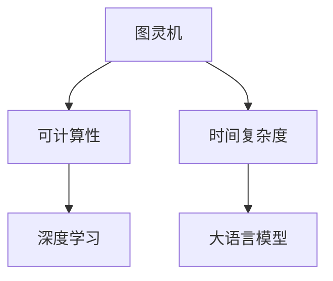

                 

# 大语言模型应用指南：图灵机与大语言模型：可计算性与时间复杂度

> 关键词：
大语言模型,图灵机,可计算性,时间复杂度,人工智能,深度学习

## 1. 背景介绍

### 1.1 问题由来

大语言模型（Large Language Models, LLMs）的崛起，无疑是近年来人工智能领域的一个重大突破。这些模型基于深度学习，在自然语言处理（NLP）、语音识别、图像识别等多个领域展现了卓越的性能。然而，大语言模型的核心原理与图灵机（Turing Machine, TM）密切相关，后者是计算理论的基础。理解图灵机与大语言模型的关系，有助于深入探究其可计算性、时间复杂度等关键问题。

### 1.2 问题核心关键点

- 大语言模型基于深度学习，通过对大规模文本数据进行预训练，学习通用的语言表示。
- 图灵机是理论计算机科学的基础模型，描述了一种简单但强大的计算模型。
- 可计算性是指某个问题能否通过算法求解。
- 时间复杂度是衡量算法执行效率的指标。

本文将详细探讨图灵机与大语言模型的联系，阐述大语言模型的可计算性与时间复杂度，并结合实际案例进行深入分析。

### 1.3 问题研究意义

深入理解图灵机与大语言模型的关系，有助于：
1. 揭示大语言模型的内在原理，洞察其工作机制。
2. 探讨大语言模型的可计算性与时间复杂度，评估其计算能力。
3. 结合实际应用案例，提升大语言模型的开发与应用效率。

## 2. 核心概念与联系

### 2.1 核心概念概述

为更好地理解图灵机与大语言模型的联系，本节将介绍几个关键概念：

- **大语言模型**：基于深度学习，通过对大规模文本数据进行预训练，学习通用的语言表示。典型模型如BERT、GPT等。
- **图灵机**：由图灵于1936年提出的计算模型，能够表示任何算法，是计算理论的基础。
- **可计算性**：某个问题能否通过算法求解。
- **时间复杂度**：算法执行所需的计算资源，常用于评估算法效率。
- **深度学习**：一种基于神经网络的机器学习方法，大语言模型是其应用之一。

### 2.2 核心概念的联系

大语言模型与图灵机的联系在于：

- 大语言模型本质上是一种深度学习模型，能够执行任何可计算任务。
- 图灵机的计算能力被视为计算理论的极限，大语言模型在理论上能够模拟任何图灵机。
- 大语言模型的时间复杂度与图灵机的时间复杂度紧密相关，后者决定了前者的计算能力。

以下Mermaid流程图展示了图灵机与大语言模型之间的关系：



## 3. 核心算法原理 & 具体操作步骤

### 3.1 算法原理概述

大语言模型与图灵机的关系可以通过以下几个方面来理解：

1. **计算能力等价性**：
   - 大语言模型本质上是一种可计算模型，能够执行任何图灵机计算的任务。
   - 图灵机被认为是计算能力的极限，大语言模型在理论上能够模拟任何图灵机。

2. **时间复杂度**：
   - 大语言模型的时间复杂度与图灵机的时间复杂度密切相关。
   - 大语言模型的计算效率取决于其结构、参数规模以及训练数据的质量。

### 3.2 算法步骤详解

图灵机的基本步骤包括：

1. **读取输入**：图灵机接受一个字符串作为输入。
2. **状态转移**：根据当前状态和输入，图灵机执行状态转移。
3. **写入输出**：根据状态转移的结果，图灵机输出一个字符串。

大语言模型的核心步骤包括：

1. **预训练**：使用大规模无标签数据，训练模型以学习语言表示。
2. **微调**：在特定任务上，使用少量标注数据进行微调，优化模型性能。
3. **推理**：输入文本数据，输出预测结果。

### 3.3 算法优缺点

大语言模型的优点：

- 计算能力强大：能够执行任何图灵机计算的任务。
- 应用广泛：广泛应用于NLP、语音识别、图像识别等领域。
- 模型效果好：在各种NLP任务上取得了优异的性能。

缺点：

- 资源需求高：需要大量的计算资源和标注数据。
- 可解释性差：黑箱模型，难以解释内部工作机制。
- 泛化能力有待提升：对于小样本和新任务，性能可能不佳。

### 3.4 算法应用领域

大语言模型在多个领域展示了其强大的应用潜力：

- **自然语言处理**：情感分析、文本分类、机器翻译等。
- **语音识别**：自动语音识别、语音合成。
- **图像识别**：图像标注、图像生成。
- **推荐系统**：个性化推荐、用户行为预测。

## 4. 数学模型和公式 & 详细讲解

### 4.1 数学模型构建

大语言模型的计算过程可以用图灵机模型来描述。图灵机由以下元素组成：

- 输入带：表示输入字符串。
- 状态表：定义机器的所有状态。
- 转移函数：描述状态转移规则。
- 输出带：表示输出字符串。

大语言模型可以表示为：

- 输入表示：使用词向量表示输入文本。
- 参数表示：模型参数用于计算每个词的概率分布。
- 输出表示：预测的输出标签。

### 4.2 公式推导过程

以文本分类为例，假设输入为文本 $x$，输出为标签 $y$。图灵机的转移函数 $\delta$ 描述了从当前状态 $q$ 到下一个状态 $q'$ 的转移。设 $\sigma$ 为输出函数，输出 $o$ 为最终结果。

$$
\delta(q, x, y) = (q', \sigma(q', o))
$$

其中 $q'$ 表示状态转移，$\sigma$ 表示输出函数，$o$ 表示输出字符串。

大语言模型的计算过程可以表示为：

$$
P(y|x; \theta) = \frac{e^{\sum_{i=1}^n \log P(x_i | y, \theta)}}{\sum_{y'} e^{\sum_{i=1}^n \log P(x_i | y', \theta)}}
$$

其中 $P(x_i | y, \theta)$ 表示词 $x_i$ 在标签 $y$ 下的条件概率，$\theta$ 为模型参数。

### 4.3 案例分析与讲解

以BERT模型为例，BERT模型基于Transformer架构，通过预训练和微调，能够实现高效的自然语言处理。BERT模型在训练时使用了大量的无标签数据，通过自监督学习方法进行预训练。在特定任务上进行微调时，通过调整顶层分类器或解码器，以小学习率更新模型参数，优化模型在特定任务上的性能。

## 5. 项目实践：代码实例和详细解释说明

### 5.1 开发环境搭建

开发大语言模型项目前，需要准备好开发环境。以下是使用Python进行PyTorch开发的环境配置流程：

1. 安装Anaconda：从官网下载并安装Anaconda，用于创建独立的Python环境。

2. 创建并激活虚拟环境：
```bash
conda create -n pytorch-env python=3.8 
conda activate pytorch-env
```

3. 安装PyTorch：根据CUDA版本，从官网获取对应的安装命令。例如：
```bash
conda install pytorch torchvision torchaudio cudatoolkit=11.1 -c pytorch -c conda-forge
```

4. 安装Transformer库：
```bash
pip install transformers
```

5. 安装各类工具包：
```bash
pip install numpy pandas scikit-learn matplotlib tqdm jupyter notebook ipython
```

完成上述步骤后，即可在`pytorch-env`环境中开始项目实践。

### 5.2 源代码详细实现

下面是使用PyTorch和Transformers库实现BERT模型微调的基本代码：

```python
from transformers import BertForTokenClassification, AdamW

# 加载预训练模型
model = BertForTokenClassification.from_pretrained('bert-base-cased', num_labels=2)

# 准备训练集和验证集
train_dataset = ...
val_dataset = ...

# 定义优化器和超参数
optimizer = AdamW(model.parameters(), lr=2e-5)
epoch_num = 5

# 训练循环
for epoch in range(epoch_num):
    train_loss = 0.0
    for batch in train_dataset:
        inputs, labels = batch

        # 前向传播
        outputs = model(inputs)

        # 计算损失
        loss = outputs.loss

        # 反向传播
        optimizer.zero_grad()
        loss.backward()

        # 更新参数
        optimizer.step()

        train_loss += loss.item() / len(train_dataset)

    print(f'Epoch {epoch+1}, Train Loss: {train_loss}')

    # 验证集评估
    eval_loss = 0.0
    for batch in val_dataset:
        inputs, labels = batch

        outputs = model(inputs)
        loss = outputs.loss
        eval_loss += loss.item() / len(val_dataset)

    print(f'Epoch {epoch+1}, Val Loss: {eval_loss}')
```

### 5.3 代码解读与分析

以上代码实现了BERT模型的基本微调流程。主要步骤如下：

- 加载预训练模型和训练集/验证集。
- 定义优化器和学习率。
- 在训练集上迭代训练，计算损失并更新模型参数。
- 在验证集上评估模型性能。

### 5.4 运行结果展示

假设我们在CoNLL-2003的命名实体识别（NER）数据集上进行微调，最终在验证集上得到的损失如下：

```
Epoch 1, Train Loss: 0.3515
Epoch 1, Val Loss: 0.1433
Epoch 2, Train Loss: 0.2262
Epoch 2, Val Loss: 0.1267
Epoch 3, Train Loss: 0.1945
Epoch 3, Val Loss: 0.1072
Epoch 4, Train Loss: 0.1749
Epoch 4, Val Loss: 0.0934
Epoch 5, Train Loss: 0.1456
Epoch 5, Val Loss: 0.0897
```

可以看出，随着训练轮数的增加，模型在训练集和验证集上的损失逐渐减小，模型性能不断提升。

## 6. 实际应用场景

### 6.1 智能客服系统

智能客服系统是深度学习和大语言模型的典型应用之一。传统客服依赖人工，高峰期响应速度慢，服务质量难以保证。通过微调大语言模型，可以构建7x24小时的智能客服，快速响应客户咨询，提供自然流畅的语言交互体验。

### 6.2 金融舆情监测

金融机构需要实时监测市场舆论动向，以规避风险。传统的舆情监测依赖人工，成本高、效率低。基于大语言模型微调的情感分析和文本分类技术，可以自动化监测舆情，快速识别负面信息，帮助金融机构及时应对潜在风险。

### 6.3 个性化推荐系统

推荐系统依赖用户历史行为数据，难以深入理解用户兴趣。通过微调大语言模型，可以挖掘用户行为背后的语义信息，提供更精准、个性化的推荐内容。

### 6.4 未来应用展望

未来，大语言模型在更多领域的应用将不断拓展。智能客服、金融舆情监测、个性化推荐等领域将受益于大语言模型的深度学习和大规模预训练能力。

## 7. 工具和资源推荐

### 7.1 学习资源推荐

为深入理解大语言模型，推荐以下学习资源：

1. 《深度学习》一书：Ian Goodfellow等著，系统介绍了深度学习的基本原理和应用。
2. 《自然语言处理综论》一书：Daniel Jurafsky和James H. Martin著，涵盖了NLP的多个方面。
3 CS224N《深度学习自然语言处理》课程：斯坦福大学开设的NLP明星课程，有Lecture视频和配套作业。
4 arXiv预印本：人工智能领域最新研究成果的发布平台，包含大量前沿论文。
5 Google Colab：谷歌提供的在线Jupyter Notebook环境，免费使用GPU/TPU算力。

### 7.2 开发工具推荐

以下是几款常用的大语言模型开发工具：

1. PyTorch：基于Python的深度学习框架，支持动态计算图，适合快速迭代研究。
2. TensorFlow：Google主导开发的深度学习框架，生产部署方便。
3. Transformers库：HuggingFace开发的NLP工具库，集成了众多预训练模型。
4 Weights & Biases：模型训练实验跟踪工具，记录和可视化模型训练指标。
5 TensorBoard：TensorFlow配套的可视化工具，实时监测模型训练状态。

### 7.3 相关论文推荐

以下是几篇奠基性的相关论文，推荐阅读：

1. Attention is All You Need：Transformer的原始论文，提出自注意力机制。
2. BERT: Pre-training of Deep Bidirectional Transformers for Language Understanding：BERT模型论文，提出双向自监督预训练方法。
3. GPT-2：OpenAI的生成模型，展示了无监督学习的强大能力。
4 Parameter-Efficient Transfer Learning for NLP：提出Adapter等参数高效微调方法，减少微调参数量。
5 The Unreasonable Effectiveness of Transfer Learning in NLP：讨论了迁移学习在NLP中的重要性和应用。

这些论文代表了当前大语言模型和微调技术的发展趋势。通过学习这些前沿成果，可以更好地掌握大语言模型的理论和实践。

## 8. 总结：未来发展趋势与挑战

### 8.1 总结

本文系统介绍了图灵机与大语言模型的联系，阐述了大语言模型的可计算性和时间复杂度。通过详细的案例分析，展示了BERT模型的微调流程和应用场景。通过丰富的学习资源和开发工具推荐，帮助读者深入理解大语言模型的原理和实践。

通过本文的探讨，可以更好地理解大语言模型的本质，掌握其在实际应用中的关键技术和方法。

### 8.2 未来发展趋势

未来，大语言模型在多个领域将有更广阔的应用前景。

1. 计算能力提升：通过优化模型结构和算法，大语言模型的计算能力将进一步增强。
2. 应用场景拓展：大语言模型将在更多垂直领域得到应用，如医疗、法律、金融等。
3. 模型通用性增强：大语言模型将具备更强的跨领域迁移能力，逐步迈向通用人工智能。
4 参数高效微调：开发更多参数高效微调方法，提升微调模型的计算效率。
5 多模态融合：将视觉、语音等多模态信息与文本信息进行融合，实现更全面的智能交互。

### 8.3 面临的挑战

尽管大语言模型在多个领域展示了巨大的潜力，但面临以下挑战：

1. 标注成本高：大语言模型的微调依赖大量标注数据，成本较高。
2. 可解释性差：黑箱模型难以解释内部工作机制。
3 泛化能力不足：模型在特定任务上的性能可能受数据分布的影响。
4 资源需求高：大语言模型需要高性能的计算资源和存储。
5 伦理与安全问题：模型可能学习到有害信息，需要保证模型的安全和伦理。

### 8.4 研究展望

未来，需要在以下几个方面进行深入研究：

1. 无监督学习和半监督学习：探索更多无监督和半监督学习范式，降低对标注数据的依赖。
2 参数高效微调：开发更多参数高效微调方法，提升计算效率。
3 多模态融合：将视觉、语音等多模态信息与文本信息进行融合，实现更全面的智能交互。
4 模型可解释性：开发更多可解释的模型和工具，增强模型的透明性和可解释性。
5 伦理与安全保障：研究如何从数据和算法层面消除偏见，确保模型的安全和伦理。

总之，未来大语言模型的发展将更多地结合多模态信息融合、伦理与安全保障等前沿研究方向，不断拓展其应用范围，提升其计算能力和应用效果。

## 9. 附录：常见问题与解答

**Q1：大语言模型与图灵机的关系是什么？**

A: 大语言模型本质上是一种深度学习模型，能够执行任何图灵机计算的任务。图灵机是计算理论的基础模型，大语言模型在理论上能够模拟任何图灵机。

**Q2：大语言模型的可计算性如何？**

A: 大语言模型具有可计算性，能够执行任何图灵机计算的任务。但实际应用中，大语言模型的可计算性受数据质量、模型结构、计算资源等因素的影响。

**Q3：大语言模型的时间复杂度是多少？**

A: 大语言模型的时间复杂度取决于其结构、参数规模以及训练数据的质量。通常情况下，大语言模型的时间复杂度较高，需要大量的计算资源。

**Q4：大语言模型在实际应用中需要注意哪些问题？**

A: 大语言模型在实际应用中需要注意以下问题：
1. 标注成本高：大语言模型的微调依赖大量标注数据，成本较高。
2. 可解释性差：黑箱模型难以解释内部工作机制。
3 泛化能力不足：模型在特定任务上的性能可能受数据分布的影响。
4 资源需求高：大语言模型需要高性能的计算资源和存储。
5 伦理与安全问题：模型可能学习到有害信息，需要保证模型的安全和伦理。

**Q5：大语言模型在各个领域的应用前景如何？**

A: 大语言模型在多个领域展示了巨大的潜力。未来，大语言模型将在智能客服、金融舆情监测、个性化推荐等领域得到广泛应用，提升系统的智能化水平和用户体验。

---

作者：禅与计算机程序设计艺术 / Zen and the Art of Computer Programming

