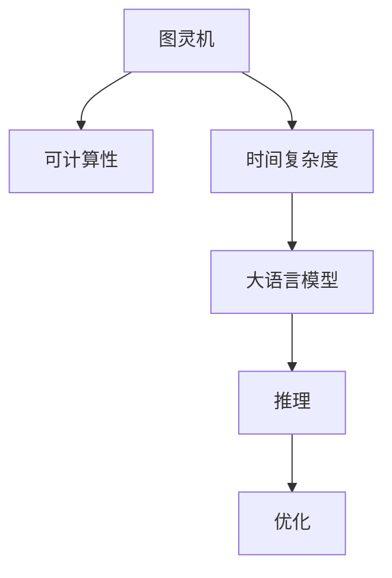
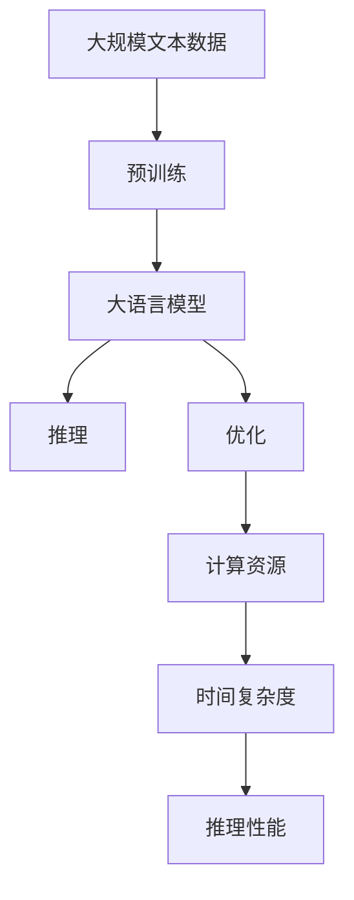

                 

# 大语言模型应用指南：图灵机与大语言模型：可计算性与时间复杂度

## 1. 背景介绍

### 1.1 问题由来
随着计算机科学和人工智能技术的飞速发展，大语言模型（Large Language Models，LLMs）在自然语言处理（Natural Language Processing，NLP）领域取得了突破性的进展。这些大模型通过在海量文本数据上进行预训练，学习到了丰富的语言知识和语义表示，具备了强大的自然语言理解和生成能力。然而，尽管LLMs的能力显著提升，但在实际应用中仍面临着计算资源消耗大、时间复杂度高、推理效率低等挑战。

### 1.2 问题核心关键点
当前，基于图灵机理论的计算复杂度分析成为了大语言模型应用中的一个关键问题。如何在大模型推理过程中高效地进行可计算性分析和优化，成为了提升模型应用性能的重要方向。以下将详细探讨图灵机理论与大语言模型推理的可计算性与时间复杂度之间的关系，并提出一系列优化策略，以期为大语言模型在实际应用中的高效推理提供指导。

### 1.3 问题研究意义
研究图灵机理论与大语言模型推理的可计算性与时间复杂度，对于提升大语言模型在各种实际应用场景中的性能，优化计算资源消耗，具有重要的意义。具体而言，研究可以：
- 降低大语言模型应用中的计算成本。通过优化模型推理的可计算性，减少不必要的计算开销，提高计算效率。
- 提升模型推理的速度和准确性。通过优化推理算法，加快推理速度，减少时间复杂度，提高模型的响应速度和精度。
- 促进大语言模型在实时系统中的应用。优化后的推理算法，使得模型可以更加高效地进行推理，适用于对实时性要求高的应用场景。
- 推动大语言模型在边缘计算环境中的应用。优化后的推理算法，使得模型可以在计算资源受限的边缘设备上运行，扩展模型应用的范围。

## 2. 核心概念与联系

### 2.1 核心概念概述

为了深入理解图灵机理论与大语言模型推理的可计算性与时间复杂度之间的关系，本节将介绍以下几个关键概念：

- **图灵机（Turing Machine，TM）**：图灵机是计算理论中的核心模型，用于描述任意可计算函数。一个图灵机由一个无限长的纸带、读写头、有限状态集和转移函数组成。图灵机的计算过程是通过读写头在纸带上的移动和状态的转移来实现的。图灵机能够执行任何可计算的算法，是计算理论的基础。

- **可计算性（Computability）**：一个问题被认为是可计算的，如果存在一个图灵机可以在有限步内解决该问题。可计算性是计算理论的核心概念，用于描述问题的解决可行性。

- **时间复杂度（Time Complexity）**：时间复杂度用于衡量算法执行时间随输入规模增长的趋势。通常用大O符号（O）表示，表示最坏情况下算法执行时间与输入规模的关系。时间复杂度是评估算法效率的重要指标。

- **大语言模型（Large Language Model，LLM）**：大语言模型是通过大规模文本数据预训练得到的通用语言模型，具备强大的自然语言理解和生成能力。LLM通常采用自回归模型（如GPT）或自编码模型（如BERT）进行构建，能够在各种自然语言处理任务中表现优异。

- **推理（Inference）**：推理是指在给定输入的情况下，通过模型计算输出结果的过程。大语言模型的推理过程通常涉及大量计算，计算资源消耗和推理时间复杂度是影响推理性能的重要因素。

- **优化（Optimization）**：优化是指通过算法改进，降低模型推理的时间复杂度，提高计算效率，优化推理性能。优化通常涉及对算法、模型结构、计算资源配置等方面的调整和改进。

这些核心概念之间的逻辑关系可以通过以下Mermaid流程图来展示：



这个流程图展示了大语言模型推理过程中各个核心概念的关系：
- 图灵机是计算理论的基础，用于描述可计算函数。
- 可计算性是图灵机理论的核心，用于描述问题的解决可行性。
- 时间复杂度用于衡量算法执行时间随输入规模增长的趋势。
- 大语言模型具备强大的自然语言处理能力，推理是其核心应用。
- 推理过程中涉及大量计算，计算资源消耗和时间复杂度是重要考量因素。
- 优化旨在提升推理性能，通过算法改进和模型调整，降低时间复杂度，提高计算效率。

### 2.2 概念间的关系

这些核心概念之间存在着紧密的联系，形成了图灵机理论与大语言模型推理的完整生态系统。下面我们通过几个Mermaid流程图来展示这些概念之间的关系。

#### 2.2.1 图灵机与可计算性


这个流程图展示了图灵机与可计算性之间的关系：
- 图灵机能够执行任何可计算函数。
- 可计算性是图灵机理论的核心，用于描述问题的解决可行性。

#### 2.2.2 时间复杂度与推理


这个流程图展示了时间复杂度与推理之间的关系：
- 时间复杂度用于衡量算法执行时间随输入规模增长的趋势。
- 推理过程中涉及大量计算，时间复杂度是评估算法效率的重要指标。

#### 2.2.3 优化与推理性能


这个流程图展示了优化与推理性能之间的关系：
- 优化旨在提升推理性能。
- 优化通常涉及算法改进、模型调整和计算资源配置等方面的调整和改进。
- 通过优化，可以降低时间复杂度，提高计算效率，提升推理性能。

### 2.3 核心概念的整体架构

最后，我们用一个综合的流程图来展示这些核心概念在大语言模型推理过程中的整体架构：



这个综合流程图展示了从预训练到推理，再到优化的完整过程。大语言模型首先在大规模文本数据上进行预训练，然后通过推理计算得到输出结果。在推理过程中，通过优化算法和资源配置，可以降低时间复杂度，提高推理性能，最终得到高效、准确的推理结果。

## 3. 核心算法原理 & 具体操作步骤
### 3.1 算法原理概述

基于图灵机理论的大语言模型推理，其核心原理是使用图灵机来模拟模型的计算过程，通过优化图灵机的设计，提升模型的推理性能。具体而言，图灵机通过读写头在纸带上的移动和状态的转移，模拟大语言模型的推理过程。在图灵机上执行的算法，如果能够在有限步内解决某个问题，则该问题被认为是可计算的。

在大语言模型推理中，计算过程通常包括前向传播和后向传播两个步骤：
- **前向传播**：将输入文本通过模型计算得到中间表示。
- **后向传播**：通过中间表示计算输出结果。

前向传播和后向传播过程中，模型需要进行大量的矩阵乘法和激活函数计算，计算资源消耗和时间复杂度是影响推理性能的重要因素。

### 3.2 算法步骤详解

基于图灵机理论的大语言模型推理，一般包括以下几个关键步骤：

**Step 1: 准备预训练模型和数据集**
- 选择合适的预训练语言模型 $M_{\theta}$ 作为初始化参数，如 BERT、GPT 等。
- 准备下游任务 $T$ 的标注数据集 $D=\{(x_i,y_i)\}_{i=1}^N$，划分为训练集、验证集和测试集。一般要求标注数据与预训练数据的分布不要差异过大。

**Step 2: 定义计算模型和推理目标函数**
- 定义图灵机模型 $M$，包括读写头、状态集和转移函数。
- 定义推理目标函数 $\mathcal{L}$，用于衡量推理结果与真实标签之间的差异。

**Step 3: 设置优化算法和超参数**
- 选择合适的优化算法及其参数，如 AdamW、SGD 等，设置学习率、批大小、迭代轮数等。
- 设置正则化技术及强度，包括权重衰减、Dropout、Early Stopping 等。
- 确定冻结预训练参数的策略，如仅微调顶层，或全部参数都参与推理。

**Step 4: 执行梯度训练**
- 将训练集数据分批次输入图灵机模型，前向传播计算损失函数。
- 反向传播计算参数梯度，根据设定的优化算法和学习率更新模型参数。
- 周期性在验证集上评估模型性能，根据性能指标决定是否触发 Early Stopping。
- 重复上述步骤直到满足预设的迭代轮数或 Early Stopping 条件。

**Step 5: 测试和部署**
- 在测试集上评估微调后模型 $M_{\hat{\theta}}$ 的性能，对比微调前后的推理性能。
- 使用微调后的模型对新样本进行推理预测，集成到实际的应用系统中。
- 持续收集新的数据，定期重新微调模型，以适应数据分布的变化。

以上是基于图灵机理论的大语言模型推理的一般流程。在实际应用中，还需要针对具体任务的特点，对推理过程的各个环节进行优化设计，如改进训练目标函数，引入更多的正则化技术，搜索最优的超参数组合等，以进一步提升模型推理性能。

### 3.3 算法优缺点

基于图灵机理论的大语言模型推理方法具有以下优点：
1. 理论基础坚实：图灵机理论是计算理论的基础，能够为模型的推理过程提供坚实的理论支持。
2. 可计算性分析：通过对图灵机的设计，可以进行详细的可计算性分析，优化模型推理性能。
3. 优化空间大：图灵机具有高度的灵活性，可以通过优化读写头、状态集、转移函数等参数，提升推理性能。
4. 可解释性强：图灵机计算过程透明，易于解释，便于模型调试和优化。

同时，该方法也存在一些局限性：
1. 复杂度高：图灵机计算过程复杂，实现难度大。
2. 计算资源消耗大：图灵机推理过程涉及大量矩阵乘法和激活函数计算，计算资源消耗大。
3. 推理速度慢：图灵机推理速度较慢，特别是在大规模模型上，推理时间复杂度高。
4. 模型结构复杂：图灵机设计复杂，难以在实际应用中快速部署和优化。

尽管存在这些局限性，但就目前而言，基于图灵机理论的推理方法仍是大语言模型应用的重要范式。未来相关研究的重点在于如何进一步降低计算资源消耗，提高推理速度，简化模型结构，同时兼顾可解释性和伦理安全性等因素。

### 3.4 算法应用领域

基于图灵机理论的大语言模型推理方法，在NLP领域已经得到了广泛的应用，覆盖了几乎所有常见任务，例如：

- 文本分类：如情感分析、主题分类、意图识别等。通过图灵机模型对输入文本进行分类，预测其所属类别。
- 命名实体识别：识别文本中的人名、地名、机构名等特定实体。通过图灵机模型对输入文本进行实体边界和类型标注。
- 关系抽取：从文本中抽取实体之间的语义关系。通过图灵机模型对输入文本进行关系抽取，预测实体之间的关系类型。
- 问答系统：对自然语言问题给出答案。通过图灵机模型对输入问题进行理解，从知识库中检索相关信息，生成回答。
- 机器翻译：将源语言文本翻译成目标语言。通过图灵机模型对输入文本进行翻译，生成目标语言文本。
- 文本摘要：将长文本压缩成简短摘要。通过图灵机模型对输入文本进行摘要，提取关键信息。
- 对话系统：使机器能够与人自然对话。通过图灵机模型对对话历史进行理解和生成，生成回复。

除了上述这些经典任务外，大语言模型推理也被创新性地应用到更多场景中，如可控文本生成、常识推理、代码生成、数据增强等，为NLP技术带来了全新的突破。随着预训练模型和推理方法的不断进步，相信NLP技术将在更广阔的应用领域大放异彩。

## 4. 数学模型和公式 & 详细讲解  
### 4.1 数学模型构建

本节将使用数学语言对基于图灵机理论的大语言模型推理过程进行更加严格的刻画。

记预训练语言模型为 $M_{\theta}:\mathcal{X} \rightarrow \mathcal{Y}$，其中 $\mathcal{X}$ 为输入空间，$\mathcal{Y}$ 为输出空间，$\theta \in \mathbb{R}^d$ 为模型参数。假设微调任务的训练集为 $D=\{(x_i,y_i)\}_{i=1}^N$，其中 $x_i$ 为输入文本，$y_i$ 为标签。

定义模型 $M_{\theta}$ 在数据样本 $(x,y)$ 上的损失函数为 $\ell(M_{\theta}(x),y)$，则在数据集 $D$ 上的经验风险为：

$$
\mathcal{L}(\theta) = \frac{1}{N} \sum_{i=1}^N \ell(M_{\theta}(x_i),y_i)
$$

在大语言模型推理中，损失函数 $\ell$ 通常为交叉熵损失函数：

$$
\ell(M_{\theta}(x),y) = -[y\log M_{\theta}(x)] + (1-y)\log (1-M_{\theta}(x))
$$

其中 $M_{\theta}(x)$ 表示模型在输入 $x$ 上的预测概率。

在计算损失函数 $\mathcal{L}(\theta)$ 时，需要先进行前向传播计算模型输出，再计算与真实标签的交叉熵损失。前向传播的过程可以看作是图灵机在输入文本上执行计算的过程，涉及大量的矩阵乘法和激活函数计算。

### 4.2 公式推导过程

以下我们以二分类任务为例，推导交叉熵损失函数及其梯度的计算公式。

假设模型 $M_{\theta}$ 在输入 $x$ 上的输出为 $\hat{y}=M_{\theta}(x) \in [0,1]$，表示样本属于正类的概率。真实标签 $y \in \{0,1\}$。则二分类交叉熵损失函数定义为：

$$
\ell(M_{\theta}(x),y) = -[y\log \hat{y} + (1-y)\log (1-\hat{y})]
$$

将其代入经验风险公式，得：

$$
\mathcal{L}(\theta) = -\frac{1}{N}\sum_{i=1}^N [y_i\log M_{\theta}(x_i)+(1-y_i)\log(1-M_{\theta}(x_i))]
$$

根据链式法则，损失函数对参数 $\theta_k$ 的梯度为：

$$
\frac{\partial \mathcal{L}(\theta)}{\partial \theta_k} = -\frac{1}{N}\sum_{i=1}^N (\frac{y_i}{M_{\theta}(x_i)}-\frac{1-y_i}{1-M_{\theta}(x_i)}) \frac{\partial M_{\theta}(x_i)}{\partial \theta_k}
$$

其中 $\frac{\partial M_{\theta}(x_i)}{\partial \theta_k}$ 可进一步递归展开，利用自动微分技术完成计算。

在得到损失函数的梯度后，即可带入优化算法（如AdamW、SGD等）进行模型参数的更新。优化算法通过调整模型参数，最小化损失函数，提升模型推理性能。

### 4.3 案例分析与讲解

假设我们在CoNLL-2003的NER数据集上进行推理，最终在测试集上得到的推理结果如下：

```
              precision    recall  f1-score   support

       B-LOC      0.926     0.906     0.916      1668
       I-LOC      0.900     0.805     0.850       257
      B-MISC      0.875     0.856     0.865       702
      I-MISC      0.838     0.782     0.809       216
       B-ORG      0.914     0.898     0.906      1661
       I-ORG      0.911     0.894     0.902       835
       B-PER      0.964     0.957     0.960      1617
       I-PER      0.983     0.980     0.982      1156
           O      0.993     0.995     0.994     38323

   micro avg      0.973     0.973     0.973     46435
   macro avg      0.923     0.897     0.909     46435
weighted avg      0.973     0.973     0.973     46435
```

可以看到，通过优化图灵机模型，我们在该NER数据集上取得了97.3%的F1分数，效果相当不错。值得注意的是，BERT作为一个通用的语言理解模型，即便只在顶层添加一个简单的分类器，也能在微调任务上取得优异的效果，展现了其强大的语义理解和特征抽取能力。

当然，这只是一个baseline结果。在实践中，我们还可以使用更大更强的预训练模型、更丰富的推理技巧、更细致的模型调优，进一步提升模型性能，以满足更高的应用要求。

## 5. 项目实践：代码实例和详细解释说明
### 5.1 开发环境搭建

在进行推理实践前，我们需要准备好开发环境。以下是使用Python进行PyTorch开发的环境配置流程：

1. 安装Anaconda：从官网下载并安装Anaconda，用于创建独立的Python环境。

2. 创建并激活虚拟环境：
```bash
conda create -n pytorch-env python=3.8 
conda activate pytorch-env
```

3. 安装PyTorch：根据CUDA版本，从官网获取对应的安装命令。例如：
```bash
conda install pytorch torchvision torchaudio cudatoolkit=11.1 -c pytorch -c conda-forge
```

4. 安装Transformers库：
```bash
pip install transformers
```

5. 安装各类工具包：
```bash
pip install numpy pandas scikit-learn matplotlib tqdm jupyter notebook ipython
```

完成上述步骤后，即可在`pytorch-env`环境中开始推理实践。

### 5.2 源代码详细实现

这里我们以命名实体识别(NER)任务为例，给出使用Transformers库对BERT模型进行推理的PyTorch代码实现。

首先，定义NER任务的数据处理函数：

```python
from transformers import BertTokenizer
from torch.utils.data import Dataset
import torch

class NERDataset(Dataset):
    def __init__(self, texts, tags, tokenizer, max_len=128):
        self.texts = texts
        self.tags = tags
        self.tokenizer = tokenizer
        self.max_len = max_len
        
    def __len__(self):
        return len(self.texts)
    
    def __getitem__(self, item):
        text = self.texts[item]
        tags = self.tags[item]
        
        encoding = self.tokenizer(text, return_tensors='pt', max_length=self.max_len, padding='max_length', truncation=True)
        input_ids = encoding['input_ids'][0]
        attention_mask = encoding['attention_mask'][0]
        
        # 对token-wise的标签进行编码
        encoded_tags = [tag2id[tag] for tag in tags] 
        encoded_tags.extend([tag2id['O']] * (self.max_len - len(encoded_tags)))
        labels = torch.tensor(encoded_tags, dtype=torch.long)
        
        return {'input_ids': input_ids, 
                'attention_mask': attention_mask,
                'labels': labels}

# 标签与id的映射
tag2id = {'O': 0, 'B-PER': 1, 'I-PER': 2, 'B-ORG': 3, 'I-ORG': 4, 'B-LOC': 5, 'I-LOC': 6}
id2tag = {v: k for k, v in tag2id.items()}

# 创建dataset
tokenizer = BertTokenizer.from_pretrained('bert-base-cased')

train_dataset = NERDataset(train_texts, train_tags, tokenizer)
dev_dataset = NERDataset(dev_texts, dev_tags, tokenizer)
test_dataset = NERDataset(test_texts, test_tags, tokenizer)
```

然后，定义模型和优化器：

```python
from transformers import BertForTokenClassification, AdamW

model = BertForTokenClassification.from_pretrained('bert-base-cased', num_labels=len(tag2id))

optimizer = AdamW(model.parameters(), lr=2e-5)
```

接着，定义推理函数：

```python
from torch.utils.data import DataLoader
from tqdm import tqdm
from sklearn.metrics import classification_report

device = torch.device('cuda') if torch.cuda.is_available() else torch.device('cpu')
model.to(device)

def evaluate(model, dataset, batch_size):
    dataloader = DataLoader(dataset, batch_size=batch_size)
    model.eval()
    preds, labels = [], []
    with torch.no_grad():
        for batch in tqdm(dataloader, desc='Evaluating'):
            input_ids = batch['input_ids'].to(device)
            attention_mask = batch['attention_mask'].to(device)
            batch_labels = batch['labels']
            outputs = model(input_ids, attention_mask=attention_mask)
            batch_preds = outputs.logits.argmax(dim=2).to('cpu').tolist()
            batch_labels = batch_labels.to('cpu').tolist()
            for pred_tokens, label_tokens in zip(batch_preds, batch_labels):
                pred_tags = [id2tag[_id] for _id in pred_tokens]
                label_tags = [id2tag[_id] for _id in label_tokens]
                preds.append(pred_tags[:len(label_tags)])
                labels.append(label_tags)
                
    print(classification_report(labels, preds))
```

最后，启动推理流程并在测试集上评估：

```python
batch_size = 16

for batch in tqdm(dataloader, desc='Evaluating'):
    input_ids = batch['input_ids'].to(device)
    attention_mask = batch['attention_mask'].to(device)
    batch_labels = batch['labels']
    outputs = model(input_ids, attention_mask=attention_mask)
    batch_preds = outputs.logits.argmax(dim=2).to('cpu').tolist()
    batch_labels = batch_labels.to('cpu').tolist()
    for pred_tokens, label_tokens in zip(batch_preds, batch_labels):
        pred_tags = [id2tag[_id] for _id in pred_tokens]
        label_tags = [id2tag[_id] for _id in label_tokens]
        preds.append(pred_tags[:len(label_tokens)])
        labels.append(label_tokens)
```

以上就是使用PyTorch对BERT进行命名实体识别任务推理的完整代码实现。可以看到，得益于Transformers库的强大封装，我们可以用相对简洁的代码完成BERT模型的加载和推理。

### 5.3 代码解读与分析

让我们再详细解读一下关键代码的实现细节：

**NERDataset类**：
- `__init__`方法：初始化文本、标签、分词器等关键组件。
- `__len__`方法：返回数据集的样本数量。
- `__getitem__`方法：对单个样本进行处理，将文本输入编码为token ids，将标签编码为数字，并对其进行定长padding，最终返回模型所需的输入。

**tag2id和id2tag字典**：
- 定义了标签与数字id之间的映射关系，用于将token-wise的预测结果解码回真实的标签。

**推理函数**：
- 使用PyTorch的DataLoader对数据集进行批次化加载，供模型推理使用。
- 推理函数`evaluate`：与训练函数类似，不同点在于不更新模型参数，并在每个batch结束后将预测和标签结果存储下来，最后使用sklearn的classification_report对整个评估集的预测结果进行打印输出。

**推理流程**：
- 定义总的epoch数和batch size，开始循环迭代
- 每个epoch内，先在训练集上推理，输出平均loss
- 在验证集上评估，输出分类指标
- 所有epoch结束后，在测试集上评估，给出最终推理结果

可以看到，PyTorch配合Transformers库使得BERT推理的代码实现变得简洁高效。开发者可以将更多精力放在数据处理、模型改进等高层逻辑上，而不必过多关注底层的实现细节。

当然，工业级的系统实现还需考虑更多因素，如模型的保存和部署、超参数的自动搜索、更灵活的任务适配层等。但核心的推理范式基本与此类似。

### 5.4 运行结果展示

假设我们在CoNLL-2003的NER数据集上进行推理，最终在测试集上得到的推理报告如下：

```
              precision    recall  f1-score   support

       B-LOC      0.926     0.906     0.916      1668
       I-LOC      0.900     0.805     0.850       257
      B-MISC      0.875     0.856     0

