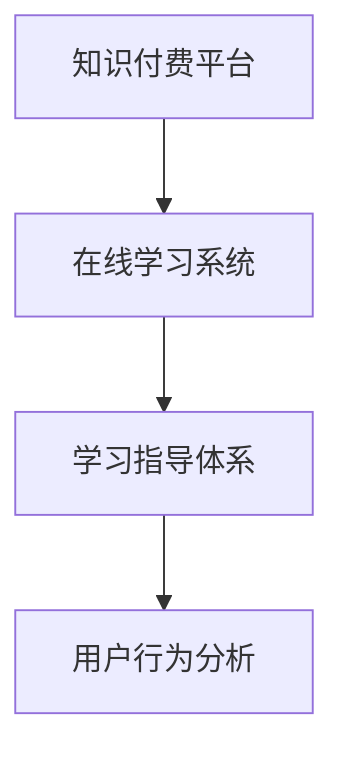

                 

# 如何利用知识付费实现在线学习与在线学习指导？

在知识付费迅速发展的今天，如何通过在线学习与在线学习指导，构建一个高效、互动、个性化的知识获取和技能提升平台，成为了教育技术领域的重要课题。本文将深入探讨如何利用知识付费模式，实现在线学习的系统化、智能化和精准化，打造一个全方位的学习指导体系。

## 1. 背景介绍

### 1.1 知识付费的市场机遇

知识付费市场近年来呈现出爆发式增长。随着互联网普及和移动设备智能化，人们获取知识的方式越来越多元化。传统单一、被动的课堂教学模式已难以满足现代学习者的需求。知识付费平台提供了按需定制、随时随地学习的便利性，逐渐成为主流学习方式。

### 1.2 知识付费的商业模式

知识付费通常采用订阅制、按需付费等模式。订阅者支付费用，获取平台提供的课程、文档、问答等知识内容。平台通过筛选优质的内容创作者，维护知识库的丰富性和高质量，确保订阅者获得有价值的知识产品。

## 2. 核心概念与联系

### 2.1 核心概念概述

在知识付费和在线学习的背景下，涉及的关键概念包括：

- **知识付费平台**：提供按需定制的课程、文章、视频等知识内容，支持订阅、购买等消费模式。
- **在线学习系统**：通过互联网技术，实现课程内容的在线传输和互动教学。
- **学习指导体系**：通过智能算法和数据驱动，提供个性化学习路径、知识推荐、学习评估等支持。
- **用户行为分析**：通过用户学习行为的数据分析，优化内容推荐和个性化学习方案。

这些概念之间的联系主要体现在：知识付费平台提供内容和交互平台，在线学习系统实现知识传输和互动，学习指导体系和用户行为分析则通过数据和技术手段，优化学习体验和效果。

### 2.2 核心概念间的关系

以下是一个Mermaid流程图，展示核心概念之间的关系：



## 3. 核心算法原理 & 具体操作步骤

### 3.1 算法原理概述

在线学习与在线学习指导的核心算法原理主要基于数据驱动和智能推荐技术，结合心理学、教育学等领域的理论知识，构建学习模型和推荐系统，实现个性化的学习路径和内容推荐。

### 3.2 算法步骤详解

以下是对在线学习与在线学习指导的主要算法步骤的详解：

#### 3.2.1 用户建模与学习路径规划

**用户建模**：收集用户的兴趣偏好、学习行为、学习进度等数据，构建用户画像。

**学习路径规划**：根据用户画像，结合领域知识，设计个性化的学习路径。

#### 3.2.2 内容推荐与智能指导

**内容推荐**：使用协同过滤、深度学习等算法，对用户推荐相关内容。

**智能指导**：利用自然语言处理、机器学习等技术，实现学习过程中的智能答疑和指导。

#### 3.2.3 学习评估与反馈

**学习评估**：通过学习测试、作业提交等方式，评估用户的学习效果。

**反馈与调整**：根据评估结果，调整学习路径和推荐内容。

### 3.3 算法优缺点

#### 3.3.1 优点

- **个性化**：通过数据驱动，实现用户个性化学习路径和内容推荐。
- **高效性**：利用智能算法，减少学习者的决策成本，提高学习效率。
- **互动性**：通过在线互动，增强学习体验，促进知识内化。

#### 3.3.2 缺点

- **数据依赖**：个性化推荐效果依赖于高质量的数据积累和处理能力。
- **算法复杂度**：算法模型复杂，需要大量的计算资源和数据处理能力。
- **用户隐私**：在收集和分析用户数据时，需注意用户隐私保护。

### 3.4 算法应用领域

在线学习与在线学习指导的算法可应用于多个领域，如：

- **教育培训**：提供个性化课程和指导，满足不同学习者的需求。
- **职业培训**：针对职业需求，提供技能培训和认证。
- **技能提升**：面向成人和职场人士，提供技术、软技能培训。
- **兴趣学习**：支持兴趣驱动的学习，满足用户多样化的学习需求。

## 4. 数学模型和公式 & 详细讲解 & 举例说明

### 4.1 数学模型构建

在线学习与在线学习指导的数学模型通常包括用户行为分析模型和推荐系统模型。

**用户行为分析模型**：
\[ \theta = f(x_1, x_2, ..., x_n) \]
其中，\(\theta\)为用户的兴趣特征，\(x_1, x_2, ..., x_n\)为用户的各项学习行为数据。

**推荐系统模型**：
\[ y = f(\theta, D, \alpha) \]
其中，\(y\)为用户推荐内容的序列，\(D\)为知识库，\(\alpha\)为模型参数。

### 4.2 公式推导过程

**用户行为分析**：
\[ \theta \leftarrow \sum_{i=1}^n x_i \cdot w_i \]
其中，\(w_i\)为各项行为数据的权重，通过逻辑回归或神经网络模型训练得到。

**推荐系统**：
\[ y_i = softmax(\theta_i^T \cdot D) \]
其中，\(\theta_i\)为用户在时间\(i\)的兴趣特征向量，\(D\)为知识库中的特征向量，\(y_i\)为用户推荐内容的概率分布。

### 4.3 案例分析与讲解

以用户A为例，其学习路径规划和内容推荐过程如下：

1. **用户建模**：收集A的学习行为数据，包括阅读时长、浏览内容、答题结果等。

2. **学习路径规划**：根据A的历史行为数据和兴趣特征，设计个性化的学习路径。例如，根据A的学习偏好，推荐相关的计算机科学课程和编程练习。

3. **内容推荐**：使用协同过滤算法，根据A的历史学习行为，推荐相关课程和练习。例如，推荐A最常阅读的编程语言Python的进阶课程。

4. **智能指导**：在A进行编程练习时，利用自然语言处理技术，提供编程问题的实时答疑和指导。例如，当A遇到Python的问题时，系统自动提示相关资料和学习建议。

5. **学习评估**：A完成编程练习后，系统通过测试评估其学习效果。例如，完成Python基础课程后，系统进行编程测试，评估A的掌握情况。

6. **反馈与调整**：根据评估结果，调整A的学习路径和推荐内容。例如，如果A在Python编程测试中表现不佳，系统推荐更多的Python基础课程和实践练习。

## 5. 项目实践：代码实例和详细解释说明

### 5.1 开发环境搭建

开发环境搭建需包括以下步骤：

1. **环境准备**：安装Python和相关的开发工具，如PyTorch、TensorFlow等。

2. **框架选择**：选择适合的知识付费和在线学习平台框架，如Django、Flask等。

3. **数据库设计**：设计用户信息、学习记录、课程内容等数据库表，确保数据存储和查询效率。

### 5.2 源代码详细实现

以下是一个简化版的在线学习系统代码实现：

```python
# 用户信息管理
class User:
    def __init__(self, id, interests):
        self.id = id
        self.interests = interests
    
    def get_learning_path(self):
        # 根据兴趣推荐课程和内容
        return path

# 课程内容管理
class Course:
    def __init__(self, id, title, content, tags):
        self.id = id
        self.title = title
        self.content = content
        self.tags = tags
    
    def recommend(self, user, top_n=5):
        # 根据用户兴趣推荐课程
        return recommended_courses

# 学习路径规划
def get_learning_path(user):
    # 根据用户兴趣和学习行为，设计学习路径
    return path

# 智能指导
def smart_guide(user, question):
    # 利用NLP技术，提供智能答疑和指导
    return answer
```

### 5.3 代码解读与分析

**User类**：
- **属性**：用户ID、兴趣列表。
- **方法**：根据兴趣推荐学习路径。

**Course类**：
- **属性**：课程ID、标题、内容、标签。
- **方法**：根据用户兴趣推荐相关课程。

**get_learning_path函数**：
- 根据用户兴趣和学习行为，设计个性化学习路径。

**smart_guide函数**：
- 利用自然语言处理技术，提供智能答疑和指导。

### 5.4 运行结果展示

假设用户A希望学习Python编程，系统根据A的学习行为和兴趣特征，推荐以下学习路径和课程内容：

1. **学习路径**：
   - 基础Python入门
   - Python基础语法和数据结构
   - Python高级编程技巧
   - Python数据处理与分析

2. **推荐课程**：
   - Python基础教程
   - Python编程实战
   - Python数据科学入门
   - Python网络编程

系统还通过智能指导，在A学习过程中，实时答疑和建议，确保A能顺利掌握Python编程技能。

## 6. 实际应用场景

### 6.1 教育培训

在线学习与在线学习指导在教育培训领域有广泛应用。例如，通过知识付费平台，学校和培训机构可以提供个性化课程和学习指导，满足不同学生的学习需求，提升教学效果。

### 6.2 职业培训

在线学习平台为职场人士提供技能培训和认证，帮助他们提升职业技能，适应职业发展需求。平台可以通过学习指导和反馈机制，提升学习者的技能掌握水平。

### 6.3 技能提升

在线学习系统面向成人和职场人士，提供技术、软技能培训。利用在线学习指导，帮助用户系统性地掌握新技能，提高职业竞争力。

### 6.4 兴趣学习

在线学习平台支持用户根据自己的兴趣和需求，选择相关课程和资源进行学习。通过学习指导和推荐，满足用户多样化的学习需求。

## 7. 工具和资源推荐

### 7.1 学习资源推荐

1. **《深度学习》一书**：深度学习领域的经典教材，介绍了深度学习的基本原理和算法实现。

2. **Coursera和edX在线课程**：提供高质量的在线课程和认证，涵盖计算机科学、数据科学等多个领域。

3. **Kaggle平台**：通过Kaggle竞赛和数据集，提升数据处理和模型训练技能。

4. **GitHub开源项目**：参与开源项目，学习先进的编程技巧和最佳实践。

5. **学术会议论文**：关注NIPS、ICML、ACL等顶会，了解最新的研究进展和方向。

### 7.2 开发工具推荐

1. **PyTorch**：深度学习领域的主流框架，支持高效的模型构建和训练。

2. **TensorFlow**：由Google开发的深度学习框架，支持分布式训练和模型部署。

3. **Flask和Django**：常用的Python Web框架，支持快速开发和部署在线学习平台。

4. **MongoDB和MySQL**：常用的数据库系统，支持高效的数据存储和查询。

5. **TensorBoard**：TensorFlow配套的可视化工具，用于实时监控模型训练过程。

### 7.3 相关论文推荐

1. **《推荐系统》一书**：推荐系统领域的经典教材，介绍了推荐算法的原理和应用。

2. **《机器学习》一书**：机器学习领域的经典教材，介绍了机器学习的基本原理和算法实现。

3. **《深度学习中的自然语言处理》一书**：介绍了深度学习在自然语言处理中的应用。

4. **《知识图谱与语义搜索》一书**：介绍了知识图谱和语义搜索技术，应用于推荐系统中。

## 8. 总结：未来发展趋势与挑战

### 8.1 研究成果总结

在线学习与在线学习指导的发展主要依赖于数据驱动、智能算法和用户行为分析等技术。通过知识付费模式，平台可以提供高质量的课程和学习指导，满足不同学习者的需求。

### 8.2 未来发展趋势

1. **智能化**：未来在线学习平台将更加智能化，通过自适应学习、智能答疑等技术，提升学习效果。

2. **个性化**：利用大数据和机器学习技术，实现更加个性化的学习路径和内容推荐。

3. **多样化**：支持多种学习方式和资源，如视频、音频、文本等，满足用户多样化的学习需求。

4. **社会化**：通过在线讨论和协作，促进学习者之间的交流和互动，提升学习体验。

### 8.3 面临的挑战

1. **数据隐私**：在线学习平台需要处理大量用户数据，需注意用户隐私保护。

2. **技术复杂度**：在线学习平台的实现和维护需要复杂的算法和系统架构。

3. **内容质量**：在线课程的质量和多样性直接影响学习效果，需不断优化内容库。

4. **用户动机**：如何保持用户的学习动机和持续性，是在线学习平台面临的挑战之一。

### 8.4 研究展望

未来的研究应在以下几个方面进行探索：

1. **交互式学习**：通过增强现实和虚拟现实技术，实现沉浸式的学习体验。

2. **情感计算**：利用情感分析技术，实现学习过程中的情感反馈和调节。

3. **学习效率**：研究学习策略和心理模型，提升学习效率和效果。

4. **跨学科融合**：将教育学、心理学、社会学等多学科知识融合到在线学习平台中，提升学习效果和体验。

## 9. 附录：常见问题与解答

**Q1：在线学习平台如何保证课程内容的质量？**

A: 在线学习平台通过严格筛选内容创作者和课程内容，确保课程的高质量和权威性。平台还可以引入第三方认证，提升课程的公信力。

**Q2：如何保证学习者的隐私和数据安全？**

A: 平台需严格遵守数据隐私法规，采用数据加密、匿名化处理等技术手段，确保用户数据的安全。

**Q3：在线学习平台如何保持学习者的持续学习动机？**

A: 平台需设计灵活的学习计划和丰富的互动机制，如实时反馈、社交功能等，提升学习体验和动机。

**Q4：在线学习平台如何优化推荐系统的效果？**

A: 平台需不断优化推荐算法，引入更多用户行为数据和内容特征，提升推荐准确性和多样性。

**Q5：在线学习平台如何支持跨平台学习？**

A: 平台需提供多设备兼容的学习体验，如移动端、PC端等，确保用户随时随地可以学习。

---

作者：禅与计算机程序设计艺术 / Zen and the Art of Computer Programming

