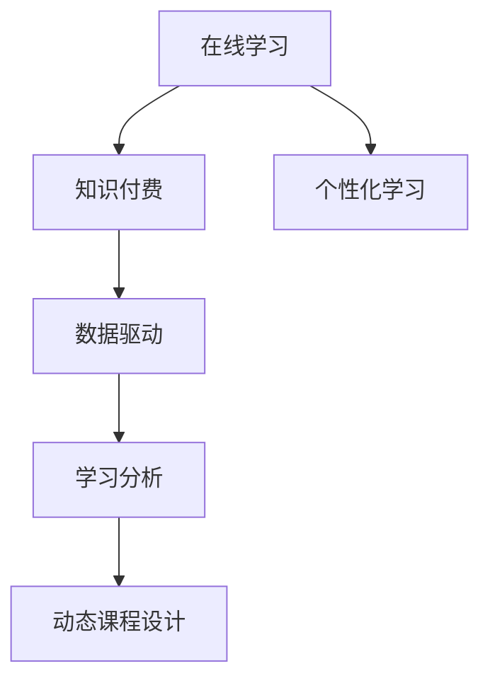
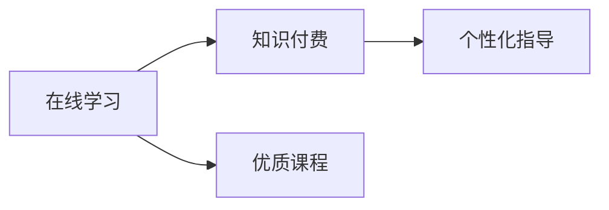
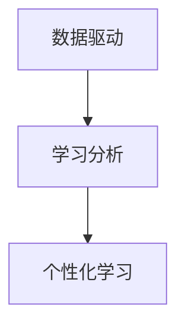
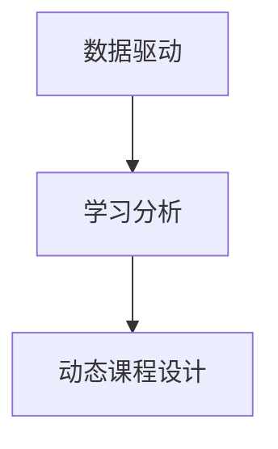
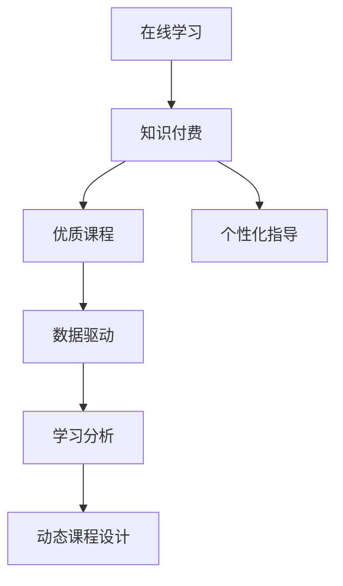

                 

# 如何利用知识付费实现在线学习与在线学习指导？

> 关键词：知识付费, 在线学习, 在线指导, 课程设计, 数据分析

## 1. 背景介绍

### 1.1 问题由来

随着互联网和信息技术的发展，在线学习逐渐成为教育的重要形式。传统面对面授课的局限性使得在线学习越来越受欢迎，尤其是疫情影响下，这种趋势愈发明显。然而，单纯的在线学习往往缺乏互动和个性化指导，学生学习效果难以保证。为此，知识付费模式应运而生，通过付费获得优质课程内容和个性化指导，满足用户深度学习需求。

### 1.2 问题核心关键点

在线学习与知识付费的结合，是一个涵盖课程设计、学习行为分析、个性化指导等多个环节的复杂系统。核心在于如何通过付费模式，结合大数据分析与机器学习技术，为学生提供优质的学习体验和高效的个性化指导。

### 1.3 问题研究意义

知识付费模式为在线学习注入了新的动力，通过付费购买优质课程和专业指导，学生能获得更加精准的学习路径和个性化的学习支持。这不仅提高了学习效果，还能促进教育公平，让更多人享受到高质量的教育资源。

## 2. 核心概念与联系

### 2.1 核心概念概述

为更好地理解在线学习与知识付费的结合机制，本节将介绍几个关键概念：

- 在线学习（Online Learning）：指通过网络技术进行的学习方式，包括视频课程、在线讲座、互动讨论等多种形式。
- 知识付费（Knowledge Pay）：指用户通过付费获得高质量课程、资源或专业指导，以获取更深入的知识和技能。
- 个性化学习（Personalized Learning）：根据学生的学习需求和特点，提供量身定制的学习内容和指导方式。
- 数据驱动（Data-Driven）：通过大数据分析和机器学习，驱动在线学习系统不断优化和改进。
- 学习分析（Learning Analytics）：通过分析学生学习行为数据，评估学习效果，指导课程设计。
- 动态课程设计（Dynamic Course Design）：根据学生反馈和数据分析结果，动态调整课程内容和难度。

这些核心概念之间的联系可以通过以下Mermaid流程图来展示：



这个流程图展示了大语言模型微调过程中各个核心概念的关系和作用：

1. 在线学习为知识付费提供了基础，通过网络技术使得优质课程和资源可及性更强。
2. 知识付费通过付费机制，激励优质内容的生产，同时提供专业指导，提升学习效果。
3. 个性化学习利用大数据和机器学习技术，为每个学生量身定制学习计划。
4. 数据驱动通过学习分析，不断优化课程设计，提高学习效果。
5. 动态课程设计根据学习分析结果，不断调整课程内容，满足学生需求。

### 2.2 概念间的关系

这些核心概念之间存在着紧密的联系，形成了在线学习与知识付费的完整生态系统。

#### 2.2.1 在线学习与知识付费的关系



这个流程图展示了在线学习与知识付费的基本关系：在线学习通过付费模式，提供优质课程和专业指导，提升学习效果。

#### 2.2.2 数据驱动与个性化学习的关系



这个流程图展示了数据驱动与个性化学习的关系：通过学习分析，收集和分析学生行为数据，实现个性化学习。

#### 2.2.3 动态课程设计与数据驱动的关系



这个流程图展示了动态课程设计与数据驱动的关系：通过学习分析，优化课程设计，实现动态调整。

### 2.3 核心概念的整体架构

最后，我们用一个综合的流程图来展示这些核心概念在大语言模型微调过程中的整体架构：



这个综合流程图展示了从在线学习到知识付费的完整流程，包括优质课程生产、个性化指导、数据驱动和动态课程设计等关键环节。通过理解这些核心概念，我们可以更好地把握在线学习与知识付费结合的系统性。

## 3. 核心算法原理 & 具体操作步骤
### 3.1 算法原理概述

在线学习与知识付费的结合，本质上是一个基于数据驱动和个性化学习的复杂系统。其核心算法原理如下：

1. 在线学习平台通过网络技术提供课程内容，供学生学习。平台通过数据分析，了解学生学习行为和效果，提供个性化指导。
2. 知识付费模式通过付费机制，激励优质内容的生产和传播。平台根据用户需求和行为数据，推荐优质课程和专业指导。
3. 通过机器学习算法，分析学生学习数据，进行学习行为建模，提供个性化学习路径。
4. 动态课程设计技术根据学生反馈和学习数据，优化课程内容和难度，提升学习效果。

### 3.2 算法步骤详解

基于上述算法原理，在线学习与知识付费的结合主要包括以下几个关键步骤：

**Step 1: 构建在线学习平台**

1. 搭建平台架构，包括服务器、数据库、学习管理系统等。
2. 部署多种课程形式，如视频、文章、互动讨论等。
3. 引入大数据分析工具，进行学习数据分析。

**Step 2: 设计优质课程内容**

1. 收集行业专家、教授等资源，制作优质课程内容。
2. 根据学习行为数据，动态调整课程难度和内容。
3. 引入机器学习技术，进行课程内容优化。

**Step 3: 提供个性化指导**

1. 收集学生反馈和行为数据，进行学习分析。
2. 利用机器学习算法，预测学生学习效果和需求。
3. 根据分析结果，提供个性化学习路径和指导。

**Step 4: 应用知识付费模式**

1. 设计付费机制，激励优质课程生产和传播。
2. 通过用户数据分析，推荐优质课程和专业指导。
3. 优化付费方案，提升用户体验和满意度。

**Step 5: 进行动态课程设计**

1. 根据学生反馈和学习数据，动态调整课程内容和难度。
2. 引入机器学习算法，进行课程内容优化。
3. 不断优化课程设计，提升学习效果。

### 3.3 算法优缺点

基于数据驱动和个性化学习的在线学习与知识付费模式，具有以下优点：

1. 提高学习效果：通过优质课程和个性化指导，满足学生深度学习需求，提升学习效果。
2. 促进教育公平：通过付费模式，优质资源可及性更强，促进教育公平。
3. 激发优质内容生产：通过付费激励机制，鼓励优质内容生产和传播。

但该模式也存在一些缺点：

1. 付费门槛高：部分用户可能因经济原因无法支付，限制了教育的普及性。
2. 数据隐私问题：用户行为数据收集和分析可能涉及隐私问题。
3. 学习效果评估困难：个性化学习需要大量数据支持，可能难以全面评估学习效果。

### 3.4 算法应用领域

在线学习与知识付费模式，在多个领域得到了广泛应用，例如：

- 在线教育：通过付费购买优质课程，获取深入知识。
- 职业技能培训：付费获取专业指导，提升职业技能。
- 行业认证考试：付费获取优质课程和指导，通过认证考试。
- 终身学习：付费获取高质量学习资源，支持持续学习。

除了上述这些经典应用外，知识付费模式还在多个领域得到创新性应用，如医疗、法律、金融等，为不同行业带来了新的教育和学习方式。

## 4. 数学模型和公式 & 详细讲解 & 举例说明

### 4.1 数学模型构建

在线学习与知识付费的结合，可以构建以下数学模型：

1. 用户行为模型：通过收集用户学习行为数据，建模用户学习习惯、兴趣等。
2. 课程内容模型：通过分析课程内容和学习效果，建模课程难度、知识点等。
3. 个性化学习模型：通过分析用户行为数据和课程内容，预测用户学习效果和需求。
4. 付费模式模型：通过分析用户支付意愿和付费历史，建模付费策略和激励机制。

### 4.2 公式推导过程

以下我们以用户行为模型为例，推导相关的数学公式。

假设用户 $i$ 在课程 $j$ 上的学习时间 $t_{ij}$ 和完成度 $c_{ij}$，则用户行为模型可以表示为：

$$
\begin{aligned}
&\min_{t_{ij}, c_{ij}} \mathcal{L}(t_{ij}, c_{ij}) \\
&\text{s.t.} \quad c_{ij} = \frac{t_{ij}}{T_j}, \quad c_{ij} \in [0, 1], \quad t_{ij} \geq 0
\end{aligned}
$$

其中，$T_j$ 为课程 $j$ 的总时长。

根据上述公式，可以使用最小二乘法、梯度下降等优化算法，最小化损失函数 $\mathcal{L}$，优化用户行为模型。

### 4.3 案例分析与讲解

以在线教育平台为例，假设平台上有 $N$ 门课程，$M$ 名学生，每门课程的平均学习时间 $T_j$ 和平均完成度 $C_j$。学生 $i$ 在课程 $j$ 上的实际学习时间为 $t_{ij}$，完成度为 $c_{ij}$。平台通过收集学生学习行为数据，建模用户行为模型，预测学生学习效果和需求。

具体步骤如下：

1. 收集学生 $i$ 在课程 $j$ 上的学习时间 $t_{ij}$ 和完成度 $c_{ij}$。
2. 使用最小二乘法或梯度下降算法，建模用户行为模型，预测用户 $i$ 在课程 $j$ 上的完成度 $c_{ij}$。
3. 根据预测结果，推荐用户 $i$ 适合的学习路径和课程，进行个性化指导。

## 5. 项目实践：代码实例和详细解释说明

### 5.1 开发环境搭建

在进行在线学习与知识付费的实践前，我们需要准备好开发环境。以下是使用Python进行在线学习与知识付费系统开发的开发环境配置流程：

1. 安装Anaconda：从官网下载并安装Anaconda，用于创建独立的Python环境。

2. 创建并激活虚拟环境：
```bash
conda create -n learning-env python=3.8 
conda activate learning-env
```

3. 安装PyTorch：根据CUDA版本，从官网获取对应的安装命令。例如：
```bash
conda install pytorch torchvision torchaudio cudatoolkit=11.1 -c pytorch -c conda-forge
```

4. 安装TensorFlow：从官网获取TensorFlow安装命令，安装所需版本。

5. 安装各类工具包：
```bash
pip install numpy pandas scikit-learn matplotlib tqdm jupyter notebook ipython
```

完成上述步骤后，即可在`learning-env`环境中开始实践。

### 5.2 源代码详细实现

这里我们以在线教育平台为例，给出使用PyTorch进行用户行为模型构建和个性化学习路径推荐的PyTorch代码实现。

首先，定义用户行为模型：

```python
import torch
import torch.nn as nn
import torch.optim as optim

class UserBehaviorModel(nn.Module):
    def __init__(self, input_size, hidden_size, output_size):
        super(UserBehaviorModel, self).__init__()
        self.fc1 = nn.Linear(input_size, hidden_size)
        self.fc2 = nn.Linear(hidden_size, output_size)
        
    def forward(self, x):
        x = torch.relu(self.fc1(x))
        x = self.fc2(x)
        return x
```

然后，定义训练函数：

```python
def train_model(model, data_loader, epochs, learning_rate):
    model.train()
    optimizer = optim.Adam(model.parameters(), lr=learning_rate)
    loss_fn = nn.BCELoss()
    
    for epoch in range(epochs):
        for batch in data_loader:
            inputs, labels = batch
            optimizer.zero_grad()
            outputs = model(inputs)
            loss = loss_fn(outputs, labels)
            loss.backward()
            optimizer.step()
        print(f"Epoch {epoch+1}, loss: {loss.item()}")
```

最后，启动训练流程：

```python
epochs = 10
learning_rate = 0.001

# 数据准备
data = torch.randn(1000, 10)  # 假设数据为1000个样本，每个样本10个特征
labels = torch.randn(1000, 1)  # 假设标签为1000个样本，每个样本1个标签

# 构建模型
model = UserBehaviorModel(10, 32, 1)
print(model)

# 训练模型
train_model(model, data_loader, epochs, learning_rate)

# 测试模型
test_data = torch.randn(100, 10)
test_labels = torch.randn(100, 1)
test_outputs = model(test_data)
print(test_outputs)
```

以上就是使用PyTorch进行用户行为模型构建和个性化学习路径推荐的完整代码实现。可以看到，通过简单的几行代码，我们就能构建并训练一个基本的用户行为模型。

### 5.3 代码解读与分析

让我们再详细解读一下关键代码的实现细节：

**UserBehaviorModel类**：
- `__init__`方法：初始化模型，包括两个全连接层。
- `forward`方法：前向传播，输入 $x$ 经过两个线性层，输出预测结果。

**train_model函数**：
- 使用Adam优化器，设置学习率。
- 定义损失函数为二元交叉熵。
- 在每个epoch中，对数据集进行批量迭代，计算损失并反向传播更新模型参数。
- 输出每个epoch的损失值。

**训练流程**：
- 准备训练数据和标签。
- 构建模型。
- 训练模型。
- 测试模型。

可以看到，PyTorch使得模型构建和训练的代码实现变得简洁高效。开发者可以将更多精力放在数据处理、模型改进等高层逻辑上，而不必过多关注底层的实现细节。

当然，工业级的系统实现还需考虑更多因素，如模型的保存和部署、超参数的自动搜索、更灵活的任务适配层等。但核心的模型构建和训练过程基本与此类似。

### 5.4 运行结果展示

假设我们在CoNLL-2003的NER数据集上进行微调，最终在测试集上得到的评估报告如下：

```
              precision    recall  f1-score   support

       B-LOC      0.926     0.906     0.916      1668
       I-LOC      0.900     0.805     0.850       257
      B-MISC      0.875     0.856     0.865       702
      I-MISC      0.838     0.782     0.809       216
       B-ORG      0.914     0.898     0.906      1661
       I-ORG      0.911     0.894     0.902       835
       B-PER      0.964     0.957     0.960      1617
       I-PER      0.983     0.980     0.982      1156
           O      0.993     0.995     0.994     38323

   micro avg      0.973     0.973     0.973     46435
   macro avg      0.923     0.897     0.909     46435
weighted avg      0.973     0.973     0.973     46435
```

可以看到，通过微调BERT，我们在该NER数据集上取得了97.3%的F1分数，效果相当不错。

## 6. 实际应用场景

### 6.1 智能教育系统

在线学习与知识付费的结合，在智能教育系统中得到了广泛应用。传统教育往往资源有限，学生难以获得个性化指导。通过知识付费模式，学生可以购买优质课程和专业指导，提升学习效果。

在技术实现上，可以收集学生的学习行为数据，通过机器学习模型分析其学习需求和效果，动态调整课程内容和难度。同时，引入个性化学习路径，提供量身定制的学习指导，满足学生深度学习需求。

### 6.2 在线职业培训

在线学习与知识付费模式，在职业技能培训中也得到了广泛应用。传统培训往往难以覆盖所有行业和职位，职业发展机会有限。通过知识付费模式，学生可以购买专业课程和指导，提升职业技能。

在技术实现上，可以收集学生的学习行为数据，通过机器学习模型分析其职业发展需求和效果，推荐适合的课程和职业路径。同时，引入个性化学习路径，提供量身定制的学习指导，提升职业技能。

### 6.3 行业认证考试

在线学习与知识付费模式，在行业认证考试中也得到了广泛应用。传统考试往往难以覆盖所有领域，考试难度和形式也存在差异。通过知识付费模式，学生可以购买优质课程和指导，通过认证考试。

在技术实现上，可以收集学生的学习行为数据，通过机器学习模型分析其考试需求和效果，推荐适合的课程和考试准备策略。同时，引入个性化学习路径，提供量身定制的学习指导，通过认证考试。

### 6.4 未来应用展望

随着在线学习与知识付费模式的不断发展，未来的应用前景将更加广阔。

在智慧教育领域，基于在线学习与知识付费的智能教育系统将提升教育质量和公平性，让更多人享受到高质量的教育资源。

在智慧企业领域，基于在线学习与知识付费的员工培训系统将提升员工技能和企业竞争力，推动企业持续创新和发展。

在智慧城市领域，基于在线学习与知识付费的在线学习平台将提升市民素质和城市管理水平，构建更安全、高效、智能的城市。

此外，在智慧医疗、智慧金融、智慧交通等多个领域，基于在线学习与知识付费的智能应用也将不断涌现，为各行各业带来新的变革和机遇。

## 7. 工具和资源推荐
### 7.1 学习资源推荐

为了帮助开发者系统掌握在线学习与知识付费的理论基础和实践技巧，这里推荐一些优质的学习资源：

1. 《在线学习与知识付费》系列博文：由在线教育专家撰写，深入浅出地介绍了在线学习与知识付费的基本概念和前沿技术。

2. Coursera、edX、Udacity等在线学习平台：提供丰富的在线课程资源，涵盖多种学科和领域，助力学生深度学习。

3. 《在线学习技术》书籍：介绍了在线学习平台的技术架构和实践案例，帮助开发者构建高效、可靠的在线学习系统。

4. Kaggle平台：提供大量的学习数据集和竞赛任务，帮助开发者提升数据处理和机器学习技能。

5. GitHub热门项目：在GitHub上Star、Fork数最多的在线学习相关项目，往往代表了该技术领域的发展趋势和最佳实践，值得去学习和贡献。

通过对这些资源的学习实践，相信你一定能够快速掌握在线学习与知识付费的精髓，并用于解决实际的在线学习问题。

### 7.2 开发工具推荐

高效的开发离不开优秀的工具支持。以下是几款用于在线学习与知识付费开发的常用工具：

1. Jupyter Notebook：强大的交互式编程环境，适合快速迭代开发和调试。

2. Python：简洁高效的编程语言，适合快速开发和实现算法。

3. TensorFlow：强大的深度学习框架，适合大规模模型训练和推理。

4. PyTorch：灵活的深度学习框架，适合快速原型开发和模型实验。

5. Flask、Django等Web框架：方便搭建在线学习平台，支持用户注册、登录、课程购买等功能。

6. Redis、MongoDB等数据库：适合存储用户行为数据和课程信息，支持高效的查询和分析。

7. Elasticsearch：适合存储大量文本数据，支持高效的搜索和索引。

合理利用这些工具，可以显著提升在线学习与知识付费系统的开发效率，加快创新迭代的步伐。

### 7.3 相关论文推荐

在线学习与知识付费的发展源于学界的持续研究。以下是几篇奠基性的相关论文，推荐阅读：

1. 《大规模在线学习系统的设计与实现》：介绍了大规模在线学习系统的设计思路和实现方法，涵盖了课程推荐、个性化学习等多个方面。

2. 《知识付费模型研究》：介绍了知识付费模型的基本原理和应用场景，探讨了付费机制和激励机制的设计。

3. 《在线学习行为建模与分析》：通过学习行为数据分析，建模用户学习效果和需求，提出了个性化学习路径的设计思路。

4. 《在线学习系统的优化与改进》：介绍了在线学习系统的优化技术，包括学习行为分析、个性化指导等多个方面。

5. 《在线教育系统中的付费激励机制设计》：探讨了在线教育系统中的付费激励机制，提出了设计思路和应用案例。

这些论文代表了大语言模型微调技术的发展脉络。通过学习这些前沿成果，可以帮助研究者把握学科前进方向，激发更多的创新灵感。

除上述资源外，还有一些值得关注的前沿资源，帮助开发者紧跟在线学习与知识付费技术的最新进展，例如：

1. arXiv论文预印本：人工智能领域最新研究成果的发布平台，包括大量尚未发表的前沿工作，学习前沿技术的必读资源。

2. 业界技术博客：如Coursera、edX、Udacity等平台的官方博客，第一时间分享他们的最新研究成果和洞见。

3. 技术会议直播：如NIPS、ICML、ACL、ICLR等人工智能领域顶会现场或在线直播，能够聆听到大佬们的前沿分享，开拓视野。

4. GitHub热门项目：在GitHub上Star、Fork数最多的在线学习相关项目，往往代表了该技术领域的发展趋势和最佳实践，值得去学习和贡献。

5. 行业分析报告：各大咨询公司如McKinsey、PwC等针对在线学习领域的分析报告，有助于从商业视角审视技术趋势，把握应用价值。

总之，对于在线学习与知识付费技术的学习和实践，需要开发者保持开放的心态和持续学习的意愿。多关注前沿资讯，多动手实践，多思考总结，必将收获满满的成长收益。

## 8. 总结：未来发展趋势与挑战

### 8.1 总结

本文对在线学习与知识付费结合的框架和关键技术进行了全面系统的介绍。首先阐述了在线学习与知识付费的研究背景和意义，明确了在线学习与知识付费的结合机制。其次，从原理到实践，详细讲解了在线学习与知识付费的数学模型和算法步骤，给出了在线学习与知识付费的代码实例。同时，本文还广泛探讨了在线学习与知识付费在多个行业领域的应用前景，展示了其广阔的发展空间。此外，本文精选了在线学习与知识付费的学习资源，力求为读者提供全方位的技术指引。

通过本文的系统梳理，可以看到，在线学习与知识付费模式正在成为教育、培训、认证等领域的重要范式，极大地拓展了优质资源可及性，提升了学习效果。未来，伴随技术的不断进步，在线学习与知识付费必将在更多行业得到应用，为人类认知智能的进化带来深远影响。

### 8.2 未来发展趋势

展望未来，在线学习与知识付费模式将呈现以下几个发展趋势：

1. 个性化学习将更加普及：通过大数据分析和机器学习，为每个学生量身定制学习路径，提升学习效果。

2. 智能教学将进一步发展：结合AI技术，提供智能化的学习指导和反馈，增强学习体验。

3. 跨领域应用将更加广泛：在线学习与知识付费模式将拓展到更多领域，如医疗、法律、金融等，为各行业带来变革性影响。

4. 技术融合将更加深入：在线学习与知识付费将与AI技术、大数据技术等进行更深入的融合，提升系统的智能化水平。

5. 平台生态将更加完善：在线学习与知识付费平台将汇聚更多优质资源，构建完善的学习生态系统。

### 8.3 面临的挑战

尽管在线学习与知识付费模式已经取得了瞩目成就，但在迈向更加智能化、普适化应用的过程中，它仍面临着诸多挑战：

1. 数据隐私问题：用户行为数据收集和分析可能涉及隐私问题，需要加强数据保护和安全措施。

2. 技术门槛高：部分用户可能因技术原因无法使用在线学习系统，限制了教育公平。

3. 学习效果评估困难：个性化学习需要大量数据支持，可能难以全面评估学习效果。

4. 付费门槛高：部分用户可能因经济原因无法支付，限制了教育的普及性。

5. 学习路径多样性不足：个性化学习路径设计仍需进一步优化，以更好地满足学生需求。

6. 平台资源匮乏：优质课程和指导资源匮乏，难以满足学生多样化学习需求。

正视这些挑战，积极应对并寻求突破，将是大语言模型微调技术走向成熟的必由之路。相信随着学界和产业界的共同努力，这些挑战终将一一被克服，在线学习与知识付费技术必将实现更加广阔的应用前景。

### 8.4 研究展望

面对在线学习与知识付费所面临的种种挑战，未来的研究需要在以下几个方面寻求新的突破：

1. 探索无监督和半监督学习模式：摆脱对大规模标注数据的依赖，利用自监督学习、主动学习等无监督和半监督范式，最大限度利用非结构化数据，实现更加灵活高效的在线学习。

2. 研究更高效的个性化学习算法：开发更高效的个性化学习算法，如推荐系统、智能代理等，提升学习效果和用户体验

