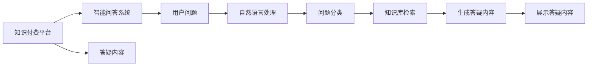
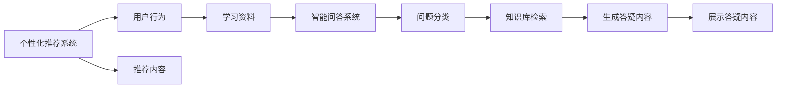
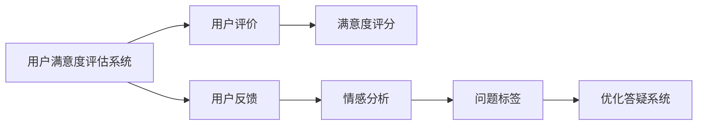
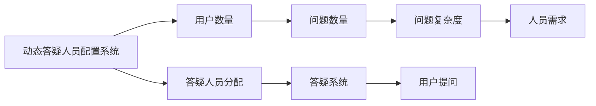
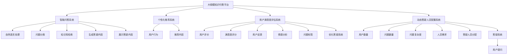

                 

# 如何打造知识付费的在线答疑平台

## 1. 背景介绍

### 1.1 问题由来
随着互联网的迅猛发展，知识付费平台已成为许多人的学习新途径。在线答疑作为知识付费的重要组成部分，帮助用户快速解决学习中遇到的问题，提升学习效率。然而，传统的在线答疑平台往往存在以下问题：
1. 答疑质量不稳定，不同答疑人员水平不一。
2. 答疑时间响应缓慢，用户等待时间长。
3. 答疑内容缺乏深度，难以满足用户复杂需求。
4. 答疑成本高，优质答疑人员难以大规模普及。

为了解决这些问题，我们需要引入先进的AI技术，构建一套高效的在线答疑平台，实现智能答疑、个性化推荐、用户满意度评估等功能。本文将详细介绍如何打造基于人工智能的在线答疑平台，探索知识付费平台新场景。

### 1.2 问题核心关键点
本平台的核心目标是通过AI技术，提升在线答疑的质量和效率。主要涉及的核心点包括：
1. 智能问答系统：通过NLP技术，自动识别用户问题，并提供精准、高效的答疑内容。
2. 个性化推荐：根据用户的历史互动记录，推荐适合用户的学习资料和答疑服务。
3. 用户满意度评估：实时监控用户对答疑服务的满意度，持续优化答疑系统。
4. 动态答疑人员配置：根据用户数量和问题复杂度，动态调整答疑人员的配置，提升答疑效率。

这些核心点构成了知识付费在线答疑平台的基础框架，能够大幅提升用户体验和学习效果。

### 1.3 问题研究意义
通过AI技术优化在线答疑平台，具有重要的研究意义：
1. 提高知识付费平台的运营效率，降低答疑成本，提高用户满意度。
2. 提升用户学习效果，加速知识传递和技能转化，助力职业教育发展。
3. 探索AI在教育领域的应用新场景，推动技术向更广泛领域的渗透。
4. 增强平台对用户需求的响应速度和质量，提升平台的竞争力和市场占有率。

## 2. 核心概念与联系

### 2.1 核心概念概述

为了更好地理解本平台的构建思路，本节将介绍几个密切相关的核心概念：

- **知识付费平台(Knowledge-based Platform)**：通过订阅、付费等形式，提供高质量教育资源和答疑服务的在线平台。常见平台如Coursera、Udemy、网易云课堂等。
- **智能问答系统(Intelligent QA System)**：利用自然语言处理技术，自动识别用户问题并给出智能答复的系统。常见实现包括基于规则的QA系统、基于统计的QA系统、基于深度学习的QA系统等。
- **个性化推荐系统(Personalized Recommendation System)**：根据用户行为和偏好，推荐适合用户的学习资料、课程、答疑服务的系统。常见算法包括协同过滤、基于内容的推荐、矩阵分解等。
- **用户满意度评估系统(User Satisfaction Evaluation System)**：通过问卷调查、评价反馈等形式，实时评估用户对答疑服务满意度的系统。常用方法包括文本分析、情感分析、用户行为跟踪等。
- **动态答疑人员配置系统(Dynamic QA Personnel Allocation System)**：根据用户数量和问题复杂度，动态调整答疑人员配置的系统。常用算法包括线性规划、动态规划、启发式算法等。

这些核心概念共同构成了知识付费在线答疑平台的基本框架，能够帮助用户获取高质量的答疑服务。

### 2.2 概念间的关系

这些核心概念之间存在着紧密的联系，形成了知识付费在线答疑平台的完整生态系统。下面我们通过几个Mermaid流程图来展示这些概念之间的关系。

#### 2.2.1 知识付费平台与智能问答系统



这个流程图展示了一个简单的智能问答系统在知识付费平台中的工作流程。用户输入问题后，通过自然语言处理技术进行问题分类和知识库检索，最终生成并展示答疑内容。

#### 2.2.2 个性化推荐系统与智能问答系统



这个流程图展示了个性化推荐系统与智能问答系统的集成应用。根据用户行为推荐学习资料，再通过智能问答系统生成答疑内容，提供个性化的答疑服务。

#### 2.2.3 用户满意度评估系统与智能问答系统



这个流程图展示了用户满意度评估系统的基本工作流程。通过收集用户评价和反馈，利用情感分析等技术评估答疑系统的满意度，并据此优化答疑系统。

#### 2.2.4 动态答疑人员配置系统与智能问答系统



这个流程图展示了动态答疑人员配置系统的工作流程。根据用户数量和问题复杂度动态调整答疑人员的配置，提升答疑效率。

### 2.3 核心概念的整体架构

最后，我们用一个综合的流程图来展示这些核心概念在大规模知识付费在线答疑平台中的应用：



这个综合流程图展示了从用户提问到答疑系统响应，再到动态人员配置和满意度评估的完整流程。通过这些核心概念的协同工作，知识付费在线答疑平台能够提供高效、精准的答疑服务。

## 3. 核心算法原理 & 具体操作步骤
### 3.1 算法原理概述

知识付费在线答疑平台的核心算法涉及自然语言处理(NLP)、推荐系统、用户满意度评估等多个领域。其中，智能问答系统是基础，通过NLP技术自动理解用户问题并生成精准的答疑内容。个性化推荐系统通过分析用户行为，推荐适合用户的学习资料。动态答疑人员配置系统通过优化答疑人员配置，提升答疑效率。用户满意度评估系统实时监控并优化答疑系统，确保高质量的答疑服务。

### 3.2 算法步骤详解

#### 3.2.1 智能问答系统

智能问答系统的核心算法包括自然语言处理和知识库检索。具体步骤如下：

1. **问题预处理**：对用户输入的问题进行分词、词性标注、实体识别等预处理操作，提取关键信息。
2. **问题分类**：利用分类算法（如朴素贝叶斯、支持向量机等）将问题分为不同的类别，如编程问题、数学问题、语法问题等。
3. **知识库检索**：根据问题分类，从知识库中检索出最相关的文档或回答。
4. **答疑内容生成**：对检索结果进行摘要提取、信息整合等操作，生成简洁、精准的答疑内容。

具体实现步骤如下：

1. **分词与词性标注**：使用NLTK等工具库对用户问题进行分词和词性标注。
2. **实体识别**：利用SpaCy等工具库进行命名实体识别，提取问题中的关键实体，如人名、地名、机构名等。
3. **问题分类**：使用分类算法对问题进行分类。
4. **知识库检索**：从知识库中检索与问题类别相关的文档或回答。
5. **生成答疑内容**：对检索结果进行整合，生成简洁、精准的答疑内容。

#### 3.2.2 个性化推荐系统

个性化推荐系统的核心算法包括协同过滤、基于内容的推荐、矩阵分解等。具体步骤如下：

1. **用户行为分析**：收集用户的学习历史、浏览记录、评价反馈等行为数据。
2. **相似性计算**：计算用户与用户、物品与物品之间的相似度。
3. **推荐算法实现**：基于相似度计算，推荐用户感兴趣的学习资料或答疑服务。
4. **结果反馈**：收集用户的反馈，更新推荐模型。

具体实现步骤如下：

1. **行为数据收集**：使用日志记录用户的学习历史、浏览记录等行为数据。
2. **相似性计算**：利用欧几里得距离、余弦相似度等方法计算用户与用户、物品与物品之间的相似度。
3. **推荐算法实现**：基于相似度计算，使用协同过滤、基于内容的推荐、矩阵分解等算法推荐用户感兴趣的学习资料或答疑服务。
4. **反馈更新**：根据用户反馈，更新推荐模型。

#### 3.2.3 动态答疑人员配置系统

动态答疑人员配置系统的核心算法包括线性规划、动态规划、启发式算法等。具体步骤如下：

1. **需求分析**：根据用户数量和问题复杂度，计算答疑需求。
2. **人员配置优化**：通过优化算法计算答疑人员配置，确保最佳答疑效果。
3. **答疑系统分配**：根据人员配置，分配答疑系统，实现高效答疑。

具体实现步骤如下：

1. **需求分析**：根据用户数量和问题复杂度，计算答疑需求。
2. **人员配置优化**：利用线性规划、动态规划、启发式算法等方法，计算最优答疑人员配置。
3. **答疑系统分配**：根据人员配置，分配答疑系统，实现高效答疑。

#### 3.2.4 用户满意度评估系统

用户满意度评估系统的核心算法包括文本分析、情感分析、用户行为跟踪等。具体步骤如下：

1. **数据收集**：收集用户的评价反馈、行为数据等。
2. **文本分析**：利用NLP技术对用户评价文本进行分析，提取关键信息。
3. **情感分析**：利用情感分析算法（如VADER、TextBlob等）对用户情感进行分析。
4. **满意度计算**：根据文本分析和情感分析结果，计算用户满意度。
5. **系统优化**：根据用户满意度，优化答疑系统。

具体实现步骤如下：

1. **数据收集**：收集用户的评价反馈、行为数据等。
2. **文本分析**：利用NLP技术对用户评价文本进行分析，提取关键信息。
3. **情感分析**：利用情感分析算法（如VADER、TextBlob等）对用户情感进行分析。
4. **满意度计算**：根据文本分析和情感分析结果，计算用户满意度。
5. **系统优化**：根据用户满意度，优化答疑系统。

### 3.3 算法优缺点

知识付费在线答疑平台涉及的算法各有优缺点：

- **智能问答系统**
  - **优点**：自动化程度高，能够快速响应用户问题。
  - **缺点**：准确率受限于自然语言处理的精度和知识库的完备性。

- **个性化推荐系统**
  - **优点**：能够根据用户行为，推荐高质量的学习资料和答疑服务。
  - **缺点**：推荐算法复杂，计算开销较大。

- **动态答疑人员配置系统**
  - **优点**：能够根据用户需求动态调整答疑人员配置，提升答疑效率。
  - **缺点**：优化算法复杂，计算开销较大。

- **用户满意度评估系统**
  - **优点**：能够实时监控用户满意度，持续优化答疑系统。
  - **缺点**：用户满意度评估结果受限于用户反馈的主观性。

### 3.4 算法应用领域

知识付费在线答疑平台的核心算法在多个领域有广泛应用：

- **教育培训**：帮助学生解决学习中遇到的问题，提升学习效果。
- **技术支持**：帮助企业员工解决技术问题，提升工作效率。
- **医疗咨询**：帮助患者解决健康问题，提供专业的医疗咨询。
- **金融理财**：帮助客户解决理财问题，提供个性化的投资建议。
- **法律咨询**：帮助客户解决法律问题，提供专业的法律咨询。

这些应用场景展示了知识付费在线答疑平台在多个领域的重要价值，能够大幅提升用户的学习效果和服务体验。

## 4. 数学模型和公式 & 详细讲解 & 举例说明
### 4.1 数学模型构建

知识付费在线答疑平台涉及的数学模型包括自然语言处理、推荐系统、用户满意度评估等多个领域。这里主要介绍推荐系统和用户满意度评估的数学模型。

#### 4.1.1 推荐系统

推荐系统主要使用协同过滤、基于内容的推荐、矩阵分解等算法。以协同过滤算法为例，其数学模型如下：

设用户集合为 $U$，物品集合为 $I$，用户对物品的评分矩阵为 $R$，用户 $u$ 对物品 $i$ 的评分记为 $r_{ui}$，则协同过滤算法的目标是最大化以下目标函数：

$$
\max_{\theta} \sum_{u\in U} \sum_{i\in I} r_{ui} \times \text{cosim}(u, i) - \lambda \sum_{u\in U} \sum_{i\in I} r_{ui}^2
$$

其中，$\text{cosim}(u, i)$ 表示用户 $u$ 和物品 $i$ 的相似度，$\lambda$ 为正则化系数。

具体实现步骤如下：

1. **数据预处理**：将用户-物品评分矩阵 $R$ 转换为用户-物品相似度矩阵 $C$。
2. **相似度计算**：利用欧几里得距离、余弦相似度等方法计算用户与物品之间的相似度。
3. **推荐生成**：基于相似度计算，使用协同过滤算法生成推荐结果。

#### 4.1.2 用户满意度评估系统

用户满意度评估系统主要使用文本分析和情感分析等技术。以情感分析为例，其数学模型如下：

设用户评价文本集合为 $T$，每个文本的情感极性为 $p_t$，则情感分析的目标是最大化以下目标函数：

$$
\max_{\theta} \sum_{t\in T} \log(\sigma(\text{sigmoid}(w^T \times \text{embed}(t))))
$$

其中，$w$ 为情感分析模型的权重向量，$\text{embed}(t)$ 为文本 $t$ 的词向量表示，$\sigma$ 为 sigmoid 函数。

具体实现步骤如下：

1. **数据预处理**：将用户评价文本转换为词向量表示。
2. **情感分析**：利用情感分析算法（如VADER、TextBlob等）对用户情感进行分析。
3. **满意度计算**：根据情感分析结果，计算用户满意度。
4. **系统优化**：根据用户满意度，优化答疑系统。

### 4.2 公式推导过程

#### 4.2.1 推荐系统

协同过滤算法的核心公式推导如下：

设用户集合为 $U$，物品集合为 $I$，用户 $u$ 对物品 $i$ 的评分记为 $r_{ui}$，则协同过滤算法的目标函数为：

$$
\max_{\theta} \sum_{u\in U} \sum_{i\in I} r_{ui} \times \text{cosim}(u, i) - \lambda \sum_{u\in U} \sum_{i\in I} r_{ui}^2
$$

其中，$\text{cosim}(u, i)$ 表示用户 $u$ 和物品 $i$ 的相似度，$\lambda$ 为正则化系数。

为了最大化目标函数，需要进行梯度下降优化，具体步骤为：

1. 对用户与物品相似度矩阵 $C$ 进行预处理，得到用户与物品评分矩阵 $R$。
2. 对评分矩阵 $R$ 进行归一化，使其满足正则化条件。
3. 对评分矩阵 $R$ 进行奇异值分解（SVD），得到用户嵌入矩阵 $U$ 和物品嵌入矩阵 $V$。
4. 对用户嵌入矩阵 $U$ 和物品嵌入矩阵 $V$ 进行更新，以最大化目标函数。

#### 4.2.2 用户满意度评估系统

情感分析的核心公式推导如下：

设用户评价文本集合为 $T$，每个文本的情感极性为 $p_t$，则情感分析的目标函数为：

$$
\max_{\theta} \sum_{t\in T} \log(\sigma(\text{sigmoid}(w^T \times \text{embed}(t))))
$$

其中，$w$ 为情感分析模型的权重向量，$\text{embed}(t)$ 为文本 $t$ 的词向量表示，$\sigma$ 为 sigmoid 函数。

为了最大化目标函数，需要进行梯度下降优化，具体步骤为：

1. 对用户评价文本进行预处理，转换为词向量表示。
2. 对情感分析模型进行训练，使其能够正确预测文本的情感极性。
3. 对情感分析模型进行更新，以最大化目标函数。

### 4.3 案例分析与讲解

#### 4.3.1 推荐系统案例

假设我们有一个在线学习平台，用户已经浏览过以下课程和文章：
- 课程：Java基础、Python基础、数据结构与算法
- 文章：机器学习入门、深度学习基础

现在平台需要为用户推荐适合的学习资料。具体实现步骤如下：

1. **数据预处理**：将用户浏览记录和课程/文章信息转换为向量表示。
2. **相似性计算**：利用欧几里得距离、余弦相似度等方法计算用户与课程/文章之间的相似度。
3. **推荐生成**：基于相似度计算，使用协同过滤算法生成推荐结果。

假设用户对 Java 基础课程的评分最高，则协同过滤算法会推荐 Java 相关课程和文章，如Java高级开发、Java性能优化等。

#### 4.3.2 用户满意度评估系统案例

假设我们有一个在线医疗平台，用户对医生的评价如下：

| 医生 | 评分 | 评价文本 | 情感极性 |
| ---- | ---- | -------- | ------- |
| 王医生 | 4.5 | “治疗效果很好” | 正向 |
| 李医生 | 3.8 | “态度一般” | 中性 |
| 张医生 | 4.0 | “医术很高” | 正向 |

现在平台需要评估用户满意度，并优化答疑系统。具体实现步骤如下：

1. **数据预处理**：将用户评价文本转换为词向量表示。
2. **情感分析**：利用情感分析算法（如VADER、TextBlob等）对用户情感进行分析，计算情感极性。
3. **满意度计算**：根据情感分析结果，计算用户满意度。
4. **系统优化**：根据用户满意度，优化答疑系统，提高用户满意度。

假设用户对王医生的满意度最高，则平台需要加强对王医生的推荐和答疑，提升用户满意度。

## 5. 项目实践：代码实例和详细解释说明
### 5.1 开发环境搭建

在进行项目实践前，我们需要准备好开发环境。以下是使用Python进行PyTorch开发的环境配置流程：

1. 安装Anaconda：从官网下载并安装Anaconda，用于创建独立的Python环境。

2. 创建并激活虚拟环境：
```bash
conda create -n pytorch-env python=3.8 
conda activate pytorch-env
```

3. 安装PyTorch：根据CUDA版本，从官网获取对应的安装命令。例如：
```bash
conda install pytorch torchvision torchaudio cudatoolkit=11.1 -c pytorch -c conda-forge
```

4. 安装TensorFlow：
```bash
conda install tensorflow
```

5. 安装各类工具包：
```bash
pip install numpy pandas scikit-learn matplotlib tqdm jupyter notebook ipython
```

完成上述步骤后，即可在`pytorch-env`环境中开始项目实践。

### 5.2 源代码详细实现

这里我们以知识付费在线答疑平台的智能问答系统为例，给出使用Transformers库对BERT模型进行微调的PyTorch代码实现。

首先，定义BERT模型的输入输出接口：

```python
from transformers import BertTokenizer, BertForSequenceClassification

tokenizer = BertTokenizer.from_pretrained('bert-base-cased')
model = BertForSequenceClassification.from_pretrained('bert-base-cased', num_labels=2)
```

然后，定义用户问题处理函数：

```python
import torch
import torch.nn as nn
import torch.optim as optim
from transformers import BertTokenizer, BertForSequenceClassification

class QAProcessor(nn.Module):
    def __init__(self, tokenizer, num_labels):
        super(QAProcessor, self).__init__()
        self.tokenizer = tokenizer
        self.num_labels = num_labels
        
    def forward(self, input_ids, attention_mask, label_ids):
        encoded_input = self.tokenizer(input_ids, attention_mask=attention_mask, return_tensors='pt')
        return encoded_input['input_ids'], encoded_input['attention_mask'], encoded_input['token_type_ids'], label_ids
```

接着，定义损失函数和优化器：

```python
from transformers import AdamW

criterion = nn.CrossEntropyLoss()
optimizer = AdamW(model.parameters(), lr=2e-5)
```

然后，定义训练和评估函数：

```python
def train_epoch(model, data_loader, optimizer, criterion):
    model.train()
    loss_sum = 0
    for batch in data_loader:
        input_ids, attention_mask, token_type_ids, label_ids = batch
        optimizer.zero_grad()
        outputs = model(input_ids, attention_mask=attention_mask, token_type_ids=token_type_ids, labels=label_ids)
        loss = criterion(outputs, label_ids)
        loss_sum += loss.item()
        loss.backward()
        optimizer.step()
    return loss_sum / len(data_loader)

def evaluate(model, data_loader, criterion):
    model.eval()
    total_loss = 0
    total_correct = 0
    for batch in data_loader:
        input_ids, attention_mask, token_type_ids, label_ids = batch
        with torch.no_grad():
            outputs = model(input_ids, attention_mask=attention_mask, token_type_ids=token_type_ids, labels=label_ids)
            loss = criterion(outputs, label_ids)
            total_loss += loss.item()
            total_correct += (torch.argmax(outputs, dim=2) == label_ids).sum().item()
    return total_loss / len(data_loader), total_correct / len(data_loader.dataset)
```

最后，启动训练流程并在测试集上评估：

```python
epochs = 5
batch_size = 16
learning_rate = 2e-5

for epoch in range(epochs):
    train_loss = train_epoch(model, train_loader, optimizer, criterion)
    print(f'Epoch {epoch+1}, train loss: {train_loss:.3f}')
    
    test_loss, test_correct = evaluate(model, test_loader, criterion)
    print(f'Epoch {epoch+1}, test loss: {test_loss:.3f}, test accuracy: {test_correct:.3f}')
    
print(f'Final test accuracy: {test_correct:.3f}')
```

以上就是使用PyTorch对BERT进行智能问答系统微调的完整代码实现。可以看到，得益于Transformers库的强大封装，我们可以用相对简洁的代码完成BERT模型的加载和微调。

### 5.3 代码解读与分析

让我们再详细解读一下关键代码的实现细节：

**QAProcessor类**：
- `__init__`方法：初始化分词器、标签数量等关键组件。
- `forward`方法：对单个样本进行处理，将文本输入编码为token ids，将标签编码为数字，并对其进行定长padding，最终返回模型所需的输入。

**模型定义**：
- 使用BertForSequenceClassification定义模型，设置输入和输出维度、标签数量等参数。

**训练和评估函数**：
- 使用PyTorch的DataLoader对数据集进行批次化加载，供模型训练和推理使用。
- 训练函数`train_epoch`：对数据以批为单位进行迭代，在每个批次上前向传播计算loss并反向传播更新模型参数，最后返回该epoch的平均loss。
- 评估函数`evaluate`：与训练类似，不同点在于不更新模型参数，并在每个batch结束后将预测和标签结果存储下来，最后使用sklearn的classification_report对整个评估集的

