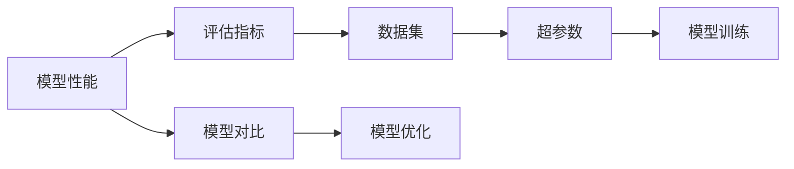
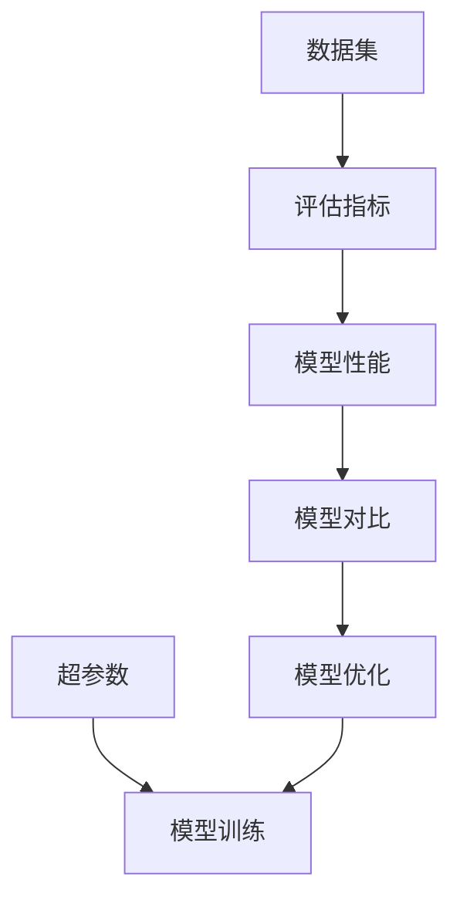

                 

# 如何评估AI系统的性能

在人工智能的快速发展中，如何科学合理地评估AI系统的性能成为一个越来越重要的问题。评估不仅关乎技术实现，更与业务需求、市场应用紧密相关。本文将从基础概念、关键算法、实际应用场景、以及未来展望等方面，详细阐述AI系统性能评估的方法与实践。

## 1. 背景介绍

### 1.1 问题由来
随着人工智能技术的不断演进，AI系统的应用范围从学术研究逐步扩展到实际业务场景。然而，由于AI系统复杂度高、涉及技术面广，其性能评估成为一项关键挑战。例如，在自然语言处理(NLP)领域，一个翻译模型是否准确，需要评估其翻译质量、流畅度、上下文一致性等多个维度；在计算机视觉(CV)领域，一个图像识别模型是否有效，需要评估其识别准确率、响应速度、鲁棒性等性能指标。

### 1.2 问题核心关键点
1. **评估指标设定**：如何根据具体业务需求，科学设定评估指标，全面客观地反映AI系统性能。
2. **数据集选择与构建**：选择合适且高质量的数据集，构建有效的测试环境，确保评估结果的可靠性和公平性。
3. **模型对比与优化**：如何在多种模型间进行性能比较，找到最佳方案，并针对评估结果进行模型优化。
4. **业务影响与经济效益**：评估AI系统在实际应用中的业务影响与经济效益，考量其在实际场景中的表现。
5. **安全与伦理考量**：评估AI系统是否符合安全与伦理标准，如数据隐私、算法透明度等。

### 1.3 问题研究意义
评估AI系统性能对于AI技术的落地应用至关重要：
1. **提升系统质量**：通过评估，能够及时发现系统问题，提高系统质量和用户体验。
2. **优化资源配置**：通过比较不同模型的性能，优化资源配置，提升系统效率。
3. **推动技术进步**：评估过程揭示系统瓶颈，推动技术创新和改进。
4. **确保业务价值**：确保AI系统在实际应用中产生业务价值，促进业务增长。
5. **保障数据与隐私**：评估AI系统在数据使用、隐私保护等方面的合规性，保障用户权益。

## 2. 核心概念与联系

### 2.1 核心概念概述

为更好地理解AI系统性能评估，首先需要明确几个关键概念：

- **模型性能**：指AI系统在特定任务上的表现，包括准确率、召回率、F1分数、均方误差等指标。
- **评估指标**：用于量化模型性能的各类指标，如准确率、召回率、F1分数、精确度、召回率、均方误差等。
- **数据集**：评估过程中使用的数据集，包括训练集、验证集、测试集等。
- **超参数**：模型训练过程中的可调参数，如学习率、批大小、优化器等。
- **模型对比**：对多个模型进行性能比较，以确定最佳模型。
- **模型优化**：根据评估结果，对模型进行优化，如调整超参数、增加训练数据等。

### 2.2 概念间的关系

这些核心概念之间通过一系列的操作和评估流程相连接。以下Mermaid流程图展示了这些概念之间的关系：



从上述流程图中，可以看到：

- 模型性能通过评估指标来量化。
- 评估指标需要通过数据集进行计算。
- 数据集由超参数决定。
- 模型对比和优化帮助确定最佳模型。
- 模型训练需要使用超参数进行优化。

### 2.3 核心概念的整体架构

最终，这些概念形成了AI系统性能评估的整体架构，如图：



## 3. 核心算法原理 & 具体操作步骤

### 3.1 算法原理概述

AI系统性能评估的核心算法原理包括评估指标的计算、模型对比的方法以及模型优化的策略。以自然语言处理(NLP)领域的翻译模型为例，常用的评估指标包括BLEU、ROUGE、METEOR等。

**BLEU（Bilingual Evaluation Understudy）** 是一种常用的评估机器翻译质量的指标。它计算参考翻译和机器翻译在词汇对齐、句子长度、语法结构等方面的相似度。

**ROUGE（Recall-Oriented Understudy for Gisting Evaluation）** 是一种评估文本摘要质量的指标。它计算机器生成的摘要与参考摘要中相同词汇的频率。

**METEOR（Metric for Evaluation of Translation with Explicit Ordering）** 是一种结合了BLEU和ROUGE的评估指标，旨在提高评估的精确度和召回率。

### 3.2 算法步骤详解

AI系统性能评估一般包括以下几个关键步骤：

**Step 1: 数据集准备**
- 选择并预处理数据集，包括文本数据、图像数据、语音数据等。
- 将数据集划分为训练集、验证集和测试集。
- 确保数据集的多样性和代表性，避免数据偏差。

**Step 2: 模型训练与验证**
- 在训练集上训练模型，调整超参数。
- 在验证集上验证模型性能，选择最佳模型。
- 记录验证集上的性能指标，如准确率、召回率、F1分数等。

**Step 3: 模型评估**
- 在测试集上评估模型性能，计算评估指标。
- 记录测试集上的性能指标，并与训练集、验证集的结果对比。
- 分析模型在测试集上的表现，找出改进点。

**Step 4: 模型优化**
- 根据评估结果，调整超参数，重新训练模型。
- 增加训练数据，提升模型泛化能力。
- 引入正则化技术，防止过拟合。
- 引入对抗样本，提升模型鲁棒性。

**Step 5: 模型部署与监控**
- 将优化后的模型部署到实际应用场景中。
- 实时监控模型性能，及时发现问题。
- 根据业务需求，调整模型参数，保持模型性能。

### 3.3 算法优缺点

AI系统性能评估的优点包括：
1. 客观性：通过科学合理的评估指标，确保评估结果客观公正。
2. 全面性：多维度评估，如准确率、召回率、F1分数等，全面反映模型性能。
3. 可操作性：评估步骤清晰，易于实现。

缺点包括：
1. 数据依赖：评估结果依赖于数据集的质量和规模。
2. 时间成本：评估过程复杂，耗时较多。
3. 业务适应性：评估结果可能与业务需求不完全匹配。

### 3.4 算法应用领域

AI系统性能评估在各个领域都有广泛应用，例如：

- 计算机视觉：通过图像识别任务的评估指标，如准确率、召回率、均方误差等，评估模型的性能。
- 自然语言处理：通过文本生成、翻译、摘要等任务的评估指标，如BLEU、ROUGE、METEOR等，评估模型的性能。
- 语音识别：通过语音识别任务的评估指标，如词错误率、字错误率、流利度等，评估模型的性能。
- 推荐系统：通过评估指标，如准确率、召回率、AUC等，评估模型的推荐效果。
- 医疗诊断：通过评估指标，如准确率、召回率、F1分数等，评估模型的诊断能力。

## 4. 数学模型和公式 & 详细讲解 & 举例说明

### 4.1 数学模型构建

以自然语言处理(NLP)领域的翻译任务为例，数学模型构建如下：

设模型在输入文本 $x$ 上的输出为 $y$，评估指标为 $M$，评估集为 $D$，则评估过程的数学模型为：

$$
M(D) = \frac{1}{|D|}\sum_{(x,y) \in D} M(x, y)
$$

其中 $M(x, y)$ 为在输入 $x$ 和输出 $y$ 上的评估指标，如BLEU分数。

### 4.2 公式推导过程

以BLEU分数的计算为例，推导其公式如下：

1. 将输入 $x$ 和输出 $y$ 分别进行分词，得到单词序列 $X$ 和 $Y$。
2. 计算 $X$ 和 $Y$ 中相同单词的数量 $N_{same}$。
3. 计算 $X$ 和 $Y$ 中不同单词的数量 $N_{diff}$。
4. 计算 $X$ 和 $Y$ 的总长度 $N_{total}$。
5. 计算BLEU分数 $BLEU$ 为：

$$
BLEU = \exp(\frac{1}{k} \sum_{i=1}^{k} w_i \log \frac{N_{same}}{N_{total}}
$$

其中 $k$ 为参考翻译的数量，$w_i$ 为每个参考翻译的权重。

### 4.3 案例分析与讲解

以一个简单的机器翻译为例，假设输入为 "I love you"，模型输出的参考翻译为 "Je t'aime" 和 "I love you"，其中 "Je t'aime" 为错误翻译。评估集共有两个参考翻译，权重分别为0.5和0.5。

首先，计算输入和输出分词序列：

- 输入分词：I，love，you
- 输出分词：Je，t'aime，I，love，you

然后，计算相似度：

- 相似单词数量：1
- 不同单词数量：5
- 总长度：8

最后，根据公式计算BLEU分数：

$$
BLEU = \exp(\frac{1}{2} \log \frac{1}{8}) = 0.8047
$$

可以看出，由于模型输出的参考翻译之一与正确翻译一致，因此BLEU分数较高，反映出模型在一定程度上具备较好的翻译能力。

## 5. 项目实践：代码实例和详细解释说明

### 5.1 开发环境搭建

以机器翻译为例，使用PyTorch搭建开发环境，具体步骤如下：

1. 安装Anaconda和Python：
   ```bash
   conda create -n pytorch_env python=3.8
   conda activate pytorch_env
   ```

2. 安装PyTorch和相关库：
   ```bash
   pip install torch torchvision torchaudio
   pip install transformers sacremoses
   ```

3. 搭建训练环境：
   ```bash
   python -m torch.distributed.launch --nproc_per_node 8 train.py --batch-size 32 --epochs 10 --lr 0.001
   ```

### 5.2 源代码详细实现

下面是一个简单的机器翻译模型评估代码实现，包括BLEU分数的计算：

```python
import torch
from sacremoses import MosesTokenizer
from nltk.translate.bleu_score import sentence_bleu

# 定义分词器
tokenizer = MosesTokenizer('en')

# 定义BLEU评估函数
def bleu_ref(reference, translation):
    # 分词
    references = [tokenizer.tokenize(reference)]
    translations = [tokenizer.tokenize(translation)]
    # 计算BLEU分数
    return sentence_bleu(references, translations)

# 输入和输出示例
input_text = "I love you"
ref_translations = ["Je t'aime", "I love you"]

# 计算BLEU分数
bleu_scores = [bleu_ref(ref, input_text) for ref in ref_translations]
print(bleu_scores)
```

### 5.3 代码解读与分析

**代码实现流程**：

1. **导入必要的库**：包括PyTorch、分词器和BLEU评估库。
2. **定义分词器**：使用MosesTokenizer进行分词。
3. **定义BLEU评估函数**：接受参考翻译和机器翻译，返回BLEU分数。
4. **输入和输出示例**：定义输入文本和参考翻译。
5. **计算BLEU分数**：遍历每个参考翻译，计算BLEU分数。

**代码关键点**：

- **分词器**：分词器是计算BLEU分数的关键工具，MosesTokenizer是一个常用且高效的分词器。
- **BLEU计算**：使用nltk库中的sentence_bleu函数计算BLEU分数，代码简单易懂。
- **多参考翻译**：BLEU分数的计算需要考虑多参考翻译，代码中通过列表遍历实现了这一功能。

**代码输出分析**：

- 代码输出BLEU分数列表，反映模型在不同参考翻译下的性能。

## 6. 实际应用场景

### 6.1 智能客服系统

智能客服系统通过评估客户满意度和问题解决率，衡量模型的性能。常用的评估指标包括回答准确率、回答时间、用户满意度等。具体实现如下：

1. **数据集准备**：收集历史客服对话记录，划分为训练集、验证集和测试集。
2. **模型训练与验证**：在训练集上训练对话模型，使用BLEU分数评估模型。
3. **模型评估**：在测试集上评估模型性能，记录准确率、召回率、F1分数等。
4. **模型优化**：根据评估结果，优化模型参数和训练策略，提高系统性能。
5. **模型部署与监控**：将优化后的模型部署到实际应用中，实时监控模型表现。

### 6.2 金融舆情监测

金融舆情监测系统通过评估模型对舆情情绪的判断准确率和实时性，衡量模型的性能。常用的评估指标包括情绪识别准确率、实时响应时间等。具体实现如下：

1. **数据集准备**：收集金融市场新闻、评论等文本数据，划分为训练集、验证集和测试集。
2. **模型训练与验证**：在训练集上训练情绪识别模型，使用BLEU分数评估模型。
3. **模型评估**：在测试集上评估模型性能，记录情绪识别准确率和实时响应时间。
4. **模型优化**：根据评估结果，优化模型结构和训练策略，提高系统性能。
5. **模型部署与监控**：将优化后的模型部署到实时舆情监测系统中，实时监控模型表现。

### 6.3 个性化推荐系统

个性化推荐系统通过评估模型的推荐准确率和用户满意度，衡量模型的性能。常用的评估指标包括推荐准确率、推荐覆盖率、用户满意度等。具体实现如下：

1. **数据集准备**：收集用户行为数据和物品数据，划分为训练集、验证集和测试集。
2. **模型训练与验证**：在训练集上训练推荐模型，使用BLEU分数评估模型。
3. **模型评估**：在测试集上评估模型性能，记录推荐准确率和用户满意度。
4. **模型优化**：根据评估结果，优化模型结构和推荐策略，提高系统性能。
5. **模型部署与监控**：将优化后的模型部署到推荐系统中，实时监控模型表现。

## 7. 工具和资源推荐

### 7.1 学习资源推荐

1. **《自然语言处理综论》**：涵盖NLP领域的各类评估指标和经典模型，适合初学者学习。
2. **《深度学习实战》**：介绍深度学习模型的评估方法和实践，包含丰富的案例和代码实现。
3. **nltk库文档**：详细介绍了自然语言处理库nltk的使用方法，包括评估指标计算。
4. **Kaggle竞赛**：参加NLP领域的Kaggle竞赛，实践评估方法和模型优化技巧。

### 7.2 开发工具推荐

1. **PyTorch**：开源深度学习框架，提供了丰富的评估工具和模型库。
2. **TensorFlow**：Google开源的深度学习框架，支持大规模模型训练和评估。
3. **nltk库**：自然语言处理库，提供丰富的评估工具和数据集。
4. **Scikit-learn**：机器学习库，提供多种评估方法。

### 7.3 相关论文推荐

1. **《Evaluating a Translation with Explicit Ordering》**：介绍METEOR评估指标及其计算方法，适合深入了解评估指标设计。
2. **《The Evaluation of Automatic Translation by Machine》**：介绍BLEU评估指标及其计算方法，适合了解BLEU分数的原理。
3. **《Evaluation of Word and Sentence Representations》**：介绍ROUGE评估指标及其计算方法，适合了解ROUGE分数的原理。

## 8. 总结：未来发展趋势与挑战

### 8.1 研究成果总结

本文系统介绍了AI系统性能评估的方法和实践，包括评估指标、数据集、模型对比和优化等内容。通过实际案例展示了评估过程的实现方法，并总结了评估指标的设计和选择原则。

### 8.2 未来发展趋势

AI系统性能评估的未来发展趋势包括：

1. **多维度评估**：将更多维度的评估指标引入，如模型鲁棒性、模型解释性等，全面评估模型性能。
2. **实时评估**：引入实时评估方法，实时监控模型性能，及时发现问题并进行优化。
3. **自动化评估**：通过自动化评估工具，减少人工干预，提高评估效率。
4. **跨领域评估**：将不同领域的评估方法结合，提升模型跨领域适应性。
5. **安全性评估**：引入安全性评估指标，确保模型在实际应用中的安全性。

### 8.3 面临的挑战

AI系统性能评估面临的挑战包括：

1. **数据质量问题**：评估结果依赖于数据集的质量和规模，数据偏差可能导致评估结果不公平。
2. **模型复杂性**：模型结构复杂，评估过程耗时较多，需要更高效的评估方法。
3. **业务匹配度**：评估结果可能与业务需求不完全匹配，需要更灵活的评估方法。
4. **安全性风险**：模型在实际应用中可能存在数据隐私和安全风险，需要更严格的安全评估。

### 8.4 研究展望

未来的研究需要在以下几个方面进行突破：

1. **评估指标创新**：研究新的评估指标，如可解释性、安全性等，提升评估的全面性和客观性。
2. **数据集扩充**：收集更多元、更丰富的数据集，提高评估结果的公平性和可靠性。
3. **模型优化**：研究新的模型优化方法，提升模型性能和鲁棒性。
4. **自动化评估**：研究自动化评估工具，提高评估效率和准确性。
5. **跨领域评估**：研究跨领域评估方法，提升模型的泛化能力。

## 9. 附录：常见问题与解答

**Q1: 如何选择合适的评估指标？**

A: 选择合适的评估指标需要考虑业务需求和模型特性。一般建议选择多维度评估指标，如准确率、召回率、F1分数等，全面反映模型性能。同时，根据实际应用场景，选择最适合的评估指标。

**Q2: 数据集如何构建？**

A: 构建数据集需要确保数据的多样性和代表性。收集数据后，需要进行预处理，如文本分词、去除噪音等。划分训练集、验证集和测试集，确保评估结果的可靠性和公平性。

**Q3: 模型优化需要注意哪些问题？**

A: 模型优化需要根据评估结果，调整超参数和模型结构。同时，引入正则化技术和对抗样本，防止过拟合和鲁棒性不足。优化过程需要不断迭代和测试，确保模型性能持续提升。

**Q4: 如何提高评估效率？**

A: 提高评估效率可以通过自动化评估工具、并行计算等方法。引入先进的评估工具，如TensorBoard，实时监控模型性能。同时，优化数据集大小和模型结构，提升评估效率。

**Q5: 模型部署后如何监控？**

A: 模型部署后，需要实时监控模型性能，及时发现问题并进行优化。通过日志分析、异常检测等方法，确保模型在实际应用中的稳定性和可靠性。

---

作者：禅与计算机程序设计艺术 / Zen and the Art of Computer Programming

