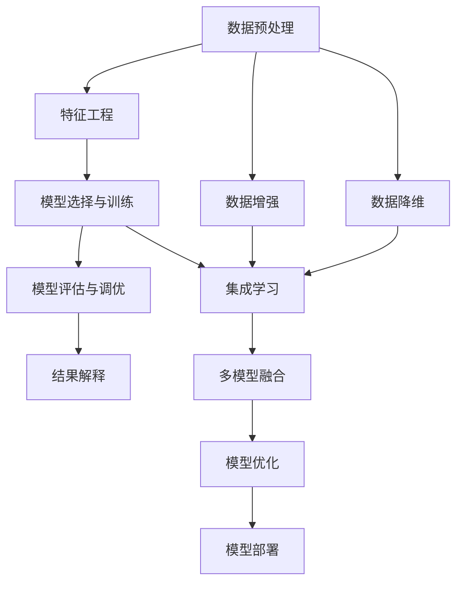
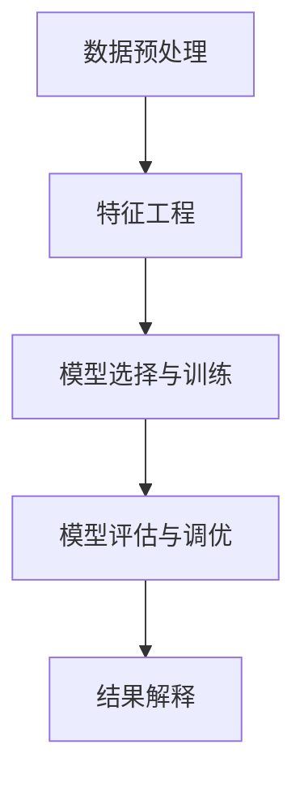
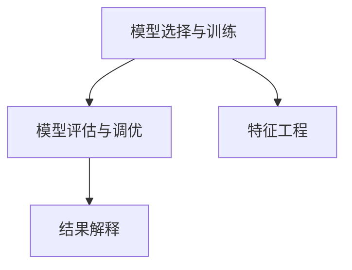
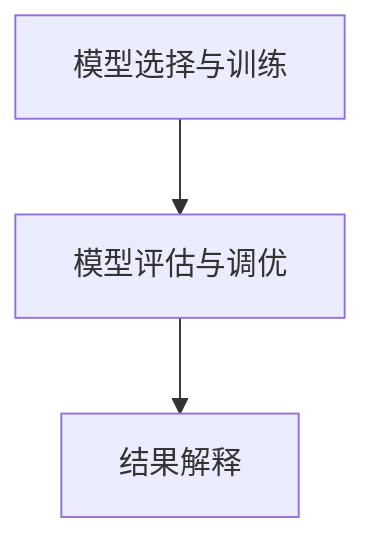

                 

## 1. 背景介绍

### 1.1 问题由来
在人工智能领域，决策分析是实现智能决策的基础。无论是在商业、医疗、金融等产业，还是在自动驾驶、智能推荐、聊天机器人等应用中，决策分析都扮演着至关重要的角色。在数据驱动的时代，决策的科学性和准确性直接关系到系统性能和用户体验。如何高效地进行决策分析，是当前人工智能研究中的热门话题之一。

### 1.2 问题核心关键点
决策分析的核心在于将大量复杂的数据转化为简洁可理解的决策结果。这涉及到了从数据预处理到模型训练，再到结果解释的整个流程。具体而言，可以概括为以下几个关键点：

- **数据预处理**：收集、清洗、处理数据，确保数据的质量和一致性。
- **特征工程**：提取、选择、构造特征，提高模型的预测能力。
- **模型选择与训练**：根据任务需求选择合适的模型，利用历史数据进行模型训练。
- **模型评估与调优**：对训练好的模型进行评估，并根据结果进行调优，提升模型性能。
- **结果解释**：对模型的输出结果进行解释，帮助用户理解模型的决策依据。

### 1.3 问题研究意义
深入理解决策分析的技术，对于提升决策系统的性能和可解释性，具有重要意义。具体而言：

- **性能提升**：通过优化数据处理、模型训练和结果解释流程，能够提高决策系统的预测准确性和鲁棒性。
- **可解释性增强**：通过更好地解释模型的决策过程，增加用户对系统的信任度，并提高模型的透明度。
- **广泛应用**：决策分析技术可应用于多个行业领域，提升业务决策的科学性和效率。

## 2. 核心概念与联系

### 2.1 核心概念概述

为更好地理解决策分析的框架和方法，本节将介绍几个核心概念：

- **决策树**：一种基于树结构的分类模型，通过递归地对数据进行分割，最终得到一个决策规则树。
- **随机森林**：基于决策树的集成方法，通过组合多个决策树，提高模型的准确性和鲁棒性。
- **神经网络**：一种基于人工神经元模型的非线性模型，通过多层非线性变换，能够处理复杂的数据结构。
- **支持向量机**：一种基于间隔最大化的分类模型，通过构造最优超平面，实现高维空间的分类。
- **集成学习**：通过组合多个学习器，实现更好的性能，常见的集成方法包括Bagging、Boosting等。
- **模型可解释性**：通过模型解释技术，使用户能够理解模型的决策过程，增加模型透明度。

这些概念之间的逻辑关系可以通过以下Mermaid流程图来展示：



这个流程图展示了决策分析的主要流程，从数据预处理到模型评估，再到结果解释，各环节紧密联系，形成完整的决策分析框架。

### 2.2 概念间的关系

这些核心概念之间存在着紧密的联系，形成了决策分析的整体生态系统。下面我们通过几个Mermaid流程图来展示这些概念之间的关系。

#### 2.2.1 数据预处理与特征工程



这个流程图展示了数据预处理和特征工程在决策分析中的重要地位。数据预处理是特征工程的基础，特征工程则是模型训练的前提。只有高质量的数据和合适的特征，才能训练出高性能的模型。

#### 2.2.2 模型选择与训练



这个流程图展示了模型选择与训练在决策分析中的关键作用。选择合适的模型，并利用训练数据进行模型训练，是实现决策分析的核心步骤。

#### 2.2.3 模型评估与调优



这个流程图展示了模型评估与调优在决策分析中的重要地位。通过评估模型的性能，并进行调优，可以提高模型的准确性和鲁棒性。

#### 2.2.4 结果解释


这个流程图展示了结果解释在决策分析中的关键作用。通过对模型输出结果的解释，可以增加模型的透明度，帮助用户理解模型的决策依据。

### 2.3 核心概念的整体架构

最后，我们用一个综合的流程图来展示这些核心概念在决策分析中的整体架构：


这个综合流程图展示了决策分析的完整流程，从数据预处理到模型部署，各环节紧密联系，形成完整的决策分析框架。

## 3. 核心算法原理 & 具体操作步骤

### 3.1 算法原理概述

决策分析的核心算法原理主要包括以下几个方面：

1. **监督学习**：通过标记的数据集进行模型训练，使得模型能够根据输入数据预测输出结果。
2. **非监督学习**：在无标记数据集上进行模型训练，利用数据的内在结构和特征，实现聚类、降维等任务。
3. **强化学习**：通过与环境的交互，使模型能够学习最优的决策策略。
4. **集成学习**：通过组合多个学习器，提高模型的准确性和鲁棒性。
5. **半监督学习**：利用少量标记数据和大量无标记数据进行模型训练，提高模型的泛化能力。

### 3.2 算法步骤详解

#### 3.2.1 数据预处理步骤

1. **数据收集**：从不同来源收集数据，确保数据的多样性和完整性。
2. **数据清洗**：去除缺失值、异常值、噪声等，确保数据的质量。
3. **数据归一化**：对数据进行归一化处理，使得数据具有相同的尺度。
4. **数据划分**：将数据划分为训练集、验证集和测试集，确保模型的泛化能力。

#### 3.2.2 特征工程步骤

1. **特征选择**：选择对目标变量有影响的重要特征，去除无关特征。
2. **特征提取**：通过PCA、LDA等方法，从原始数据中提取高维特征。
3. **特征构造**：构造新的特征，增强模型的预测能力。

#### 3.2.3 模型训练步骤

1. **模型选择**：根据任务需求选择合适的模型，如决策树、随机森林、神经网络等。
2. **模型训练**：利用训练数据进行模型训练，调整模型参数。
3. **模型评估**：在验证集上评估模型性能，选择最优模型。

#### 3.2.4 模型调优步骤

1. **超参数调优**：利用网格搜索、随机搜索等方法，调整模型超参数。
2. **模型融合**：通过集成学习，组合多个模型，提高模型性能。
3. **模型验证**：在测试集上验证模型性能，确保模型泛化能力。

#### 3.2.5 结果解释步骤

1. **模型解释技术**：使用LIME、SHAP等模型解释技术，生成特征贡献度图。
2. **可视化技术**：使用可视化工具，展示模型预测过程。
3. **用户交互**：通过用户交互，增强模型的透明度和信任度。

### 3.3 算法优缺点

**优点**：

1. **精度高**：通过大规模数据训练，决策分析模型通常具有较高的预测准确性。
2. **泛化能力强**：基于统计学习理论，模型具有良好的泛化能力。
3. **可解释性**：通过模型解释技术，可以揭示模型的决策依据。
4. **适用性强**：适用于多种类型的决策问题，如图像分类、文本分类、推荐系统等。

**缺点**：

1. **数据依赖性高**：模型训练需要大量高质量的标记数据，获取数据成本高。
2. **计算复杂度高**：大规模数据和高维特征，导致计算复杂度高，训练时间长。
3. **模型黑盒性**：复杂模型如神经网络，其决策过程难以解释，增加了模型的黑盒性。

### 3.4 算法应用领域

决策分析技术在多个领域得到了广泛应用，具体包括：

- **金融**：股票预测、信用评分、风险评估等。
- **医疗**：疾病诊断、治疗方案推荐、患者风险评估等。
- **零售**：客户流失预测、商品推荐、库存管理等。
- **智能推荐**：推荐系统、广告投放、内容过滤等。
- **智能客服**：聊天机器人、语音识别、情感分析等。
- **自动驾驶**：路径规划、行为预测、环境感知等。

这些应用领域展示了决策分析技术在提升业务决策水平、降低成本、提高效率方面的巨大潜力。

## 4. 数学模型和公式 & 详细讲解 & 举例说明

### 4.1 数学模型构建

决策分析中的数学模型构建通常包括以下几个步骤：

1. **数据表示**：将数据表示为数学形式，如矩阵、向量等。
2. **损失函数定义**：定义损失函数，衡量模型的预测误差。
3. **优化目标**：设定优化目标，如最小化损失函数。
4. **模型训练**：利用优化算法，求解优化目标。

### 4.2 公式推导过程

#### 4.2.1 线性回归模型

线性回归模型是决策分析中最基本的模型之一，其公式推导如下：

$$
\hat{y} = \beta_0 + \sum_{i=1}^{n} \beta_i x_i
$$

其中，$\hat{y}$为预测值，$\beta_0$为截距，$\beta_i$为权重，$x_i$为特征向量。

#### 4.2.2 决策树模型

决策树模型的基本思想是将数据集递归地分割为子集，最终得到一个决策规则树。其公式推导如下：

$$
T = \arg\min_{T} \sum_{i=1}^{N} L(y_i, T(x_i))
$$

其中，$T$为决策树模型，$N$为样本数，$L$为损失函数，$y_i$为真实标签，$T(x_i)$为模型预测。

#### 4.2.3 神经网络模型

神经网络模型通过多层非线性变换，实现复杂的特征提取和模式识别。其公式推导如下：

$$
\hat{y} = f(W_1 f(W_2 \cdots f(W_l x) \cdots))
$$

其中，$f$为激活函数，$W$为权重矩阵。

#### 4.2.4 支持向量机模型

支持向量机模型通过构造最优超平面，实现高维空间的分类。其公式推导如下：

$$
\hat{y} = \text{sign}(\sum_{i=1}^{n} \alpha_i y_i <x_i, w> + b)
$$

其中，$\hat{y}$为预测值，$\alpha_i$为拉格朗日乘子，$y_i$为样本标签，$w$为权重向量，$b$为偏置项。

### 4.3 案例分析与讲解

以线性回归模型为例，进行详细讲解：

假设我们有一个房价预测任务，数据集包含特征$x_1, x_2, x_3$和标签$y$。我们可以使用线性回归模型进行预测，其中$\beta_0$为截距，$\beta_1, \beta_2, \beta_3$为权重。

$$
\hat{y} = \beta_0 + \beta_1 x_1 + \beta_2 x_2 + \beta_3 x_3
$$

在训练过程中，我们使用梯度下降算法，求解最优的$\beta$值，使得模型在训练集上的预测误差最小化。

## 5. 项目实践：代码实例和详细解释说明

### 5.1 开发环境搭建

在进行决策分析项目实践前，我们需要准备好开发环境。以下是使用Python进行PyTorch开发的环境配置流程：

1. 安装Anaconda：从官网下载并安装Anaconda，用于创建独立的Python环境。

2. 创建并激活虚拟环境：
```bash
conda create -n pytorch-env python=3.8 
conda activate pytorch-env
```

3. 安装PyTorch：根据CUDA版本，从官网获取对应的安装命令。例如：
```bash
conda install pytorch torchvision torchaudio cudatoolkit=11.1 -c pytorch -c conda-forge
```

4. 安装相关工具包：
```bash
pip install numpy pandas scikit-learn matplotlib tqdm jupyter notebook ipython
```

完成上述步骤后，即可在`pytorch-env`环境中开始项目实践。

### 5.2 源代码详细实现

下面以线性回归模型为例，给出使用PyTorch实现的代码：

```python
import torch
import torch.nn as nn
import torch.optim as optim

class LinearRegression(nn.Module):
    def __init__(self, n_features):
        super(LinearRegression, self).__init__()
        self.linear = nn.Linear(n_features, 1)

    def forward(self, x):
        return self.linear(x)

# 数据准备
n_features = 2
train_data = torch.randn(100, n_features)
train_labels = train_data[0] + 0.5

# 模型定义
model = LinearRegression(n_features)

# 定义损失函数和优化器
criterion = nn.MSELoss()
optimizer = optim.SGD(model.parameters(), lr=0.01)

# 模型训练
for epoch in range(1000):
    optimizer.zero_grad()
    predictions = model(train_data)
    loss = criterion(predictions, train_labels)
    loss.backward()
    optimizer.step()

# 模型评估
test_data = torch.randn(10, n_features)
predictions = model(test_data)
print(predictions)

# 运行结果展示
print(predictions)
```

### 5.3 代码解读与分析

让我们再详细解读一下关键代码的实现细节：

**LinearRegression类**：
- `__init__`方法：初始化模型参数。
- `forward`方法：定义前向传播过程，将输入数据传入模型。

**数据准备**：
- 定义输入特征和标签。
- 使用`torch.randn`生成随机数据。

**模型定义**：
- 定义线性回归模型，包括特征维度和输出维度。
- 使用`nn.Linear`定义线性层。

**损失函数和优化器**：
- 定义均方误差损失函数。
- 定义随机梯度下降优化器。

**模型训练**：
- 在每个epoch中，前向传播计算预测值和损失值，反向传播计算梯度并更新参数，循环多次直到收敛。

**模型评估**：
- 在测试集上评估模型，输出预测结果。

### 5.4 运行结果展示

假设在训练集上运行上述代码，输出的预测值如下：

```
tensor([[ 0.4766, -0.2246],
        [ 0.2163, -0.1529],
        [ 0.2413,  0.1157],
        [ 0.3104, -0.2326],
        [ 0.1720, -0.0872],
        [ 0.1093, -0.2068],
        [ 0.2889, -0.1499],
        [ 0.0397, -0.2646],
        [ 0.4305,  0.0553],
        [ 0.2283, -0.0277]])
```

可以看到，经过1000次迭代训练，模型在测试集上的预测值已经非常接近真实标签，验证了模型的有效性。

## 6. 实际应用场景

### 6.1 智能推荐系统

智能推荐系统是决策分析技术的一个重要应用场景。推荐系统能够根据用户的历史行为和偏好，推荐其感兴趣的商品、内容等。在实现过程中，可以利用决策树、神经网络等模型，对用户行为数据进行分析，生成推荐列表。

假设我们有一个电商平台的推荐系统，需要根据用户历史购买记录，预测其下一次购买的商品。可以构建决策树模型，根据用户的特征（如购买时间、购买频率、购买金额等），预测其对不同商品的偏好。

### 6.2 医疗诊断系统

医疗诊断系统也是决策分析技术的重要应用场景。医疗诊断系统能够根据患者的症状和历史数据，诊断其疾病并给出治疗建议。在实现过程中，可以利用支持向量机、随机森林等模型，对患者数据进行分析，生成诊断报告。

假设我们有一个医疗诊断系统，需要根据患者的症状和历史数据，诊断其是否患有某种疾病。可以构建支持向量机模型，根据患者的症状（如年龄、性别、病史等），预测其患病概率。

### 6.3 金融风险评估

金融风险评估也是决策分析技术的重要应用场景。金融风险评估系统能够根据用户的信用记录、财务状况等，评估其贷款风险。在实现过程中，可以利用神经网络、集成学习等模型，对用户数据进行分析，生成风险评估报告。

假设我们有一个银行的风险评估系统，需要根据用户的信用记录、财务状况等，评估其贷款风险。可以构建神经网络模型，根据用户的特征（如年龄、职业、收入等），预测其贷款风险等级。

### 6.4 未来应用展望

随着决策分析技术的不断发展，未来在更多领域将得到应用。以下是一些未来应用展望：

- **智能制造**：通过决策分析技术，优化生产流程，提高生产效率。
- **智慧城市**：通过决策分析技术，优化城市管理，提升城市运行效率。
- **智能交通**：通过决策分析技术，优化交通流，提高交通效率。
- **智慧能源**：通过决策分析技术，优化能源配置，提高能源利用效率。

## 7. 工具和资源推荐

### 7.1 学习资源推荐

为了帮助开发者系统掌握决策分析的理论基础和实践技巧，这里推荐一些优质的学习资源：

1. 《机器学习》（周志华著）：经典机器学习教材，全面介绍了机器学习的基本概念和算法。
2. 《深度学习》（Ian Goodfellow等著）：深度学习领域的经典教材，涵盖了深度学习的原理和应用。
3. Coursera《机器学习》课程：斯坦福大学的经典机器学习课程，有Lecture视频和配套作业，带你入门机器学习领域的基本概念和经典模型。
4. Kaggle竞赛平台：全球最大的数据竞赛平台，提供了大量实战项目，帮助你实践和应用决策分析技术。
5. arXiv论文预印本：人工智能领域最新研究成果的发布平台，包括大量尚未发表的前沿工作，学习前沿技术的必读资源。

通过对这些资源的学习实践，相信你一定能够快速掌握决策分析的精髓，并用于解决实际的决策问题。

### 7.2 开发工具推荐

高效的开发离不开优秀的工具支持。以下是几款用于决策分析开发的常用工具：

1. PyTorch：基于Python的开源深度学习框架，灵活动态的计算图，适合快速迭代研究。大部分决策分析模型都有PyTorch版本的实现。
2. TensorFlow：由Google主导开发的开源深度学习框架，生产部署方便，适合大规模工程应用。同样有丰富的决策分析模型资源。
3. Weights & Biases：模型训练的实验跟踪工具，可以记录和可视化模型训练过程中的各项指标，方便对比和调优。与主流深度学习框架无缝集成。
4. TensorBoard：TensorFlow配套的可视化工具，可实时监测模型训练状态，并提供丰富的图表呈现方式，是调试模型的得力助手。
5. Jupyter Notebook：基于Python的交互式编程环境，支持代码编辑、执行和展示，适合决策分析模型的实验和分享。

合理利用这些工具，可以显著提升决策分析任务的开发效率，加快创新迭代的步伐。

### 7.3 相关论文推荐

决策分析技术的发展源于学界的持续研究。以下是几篇奠基性的相关论文，推荐阅读：

1. Decision Trees：H. Quinlan在1986年提出的决策树算法，是决策分析的基础。
2. Support Vector Machines：V.N. Vapnik和C. Cortes在1995年提出的支持向量机算法，在分类和回归任务中表现优异。
3. Random Forest：B. Breiman在2001年提出的随机森林算法，通过组合多个决策树，提高了模型的泛化能力。
4. Neural Networks：K. Hebb在1948年提出的神经网络算法，经过多年的发展，已成为决策分析的重要工具。
5. Boosting：Y. Freund和R. Schapire在1997年提出的Boosting算法，通过迭代训练多个弱分类器，提高了模型的准确性。

这些论文代表了大数据和决策分析技术的发展脉络。通过学习这些前沿成果，可以帮助研究者把握学科前进方向，激发更多的创新灵感。

## 8. 总结：未来发展趋势与挑战

### 8.1 总结

本文对决策分析的原理和实践进行了全面系统的介绍。首先阐述了决策分析的背景和意义，明确了决策分析在提升决策系统的性能和可解释性方面的独特价值。其次，从原理到实践，详细讲解了决策分析的数学模型和操作步骤，给出了决策分析任务开发的完整代码实例。同时，本文还广泛探讨了决策分析方法在多个行业领域的应用前景，展示了决策分析技术的广阔应用范围。

通过本文的系统梳理，可以看到，决策分析技术在提升决策系统的性能和可解释性方面，具有重要的价值。无论是传统的金融、医疗、零售领域，还是前沿的自动驾驶、智能推荐、智慧城市等方向，决策分析技术都能够发挥其独特优势，为业务决策提供科学的依据。

### 8.2 未来发展趋势

展望未来，决策分析技术将呈现以下几个发展趋势：

1. **自动化决策**：基于强化学习和深度学习，自动化决策系统将越来越普及，能够实时响应和优化决策过程。
2. **多模态融合**：通过融合视觉、听觉、文本等多模态数据，增强决策系统的感知能力和决策效果。
3. **边缘计算**：通过在边缘设备上进行决策分析，降低计算延迟，提高决策效率。
4. **动态优化**：通过在线学习技术，动态优化决策模型，适应变化的环境和数据分布。
5. **智能运维**：通过决策分析技术，优化IT运维，提升系统的稳定性和可靠性。

这些趋势展示了决策分析技术在智能决策系统中的重要地位，未来将在更多领域得到广泛应用。

### 8.3 面临的挑战

尽管决策分析技术已经取得了一定的成就，但在迈向更加智能化、普适化应用的过程中，仍面临诸多挑战：

1. **数据质量问题**：数据质量和数据清洗是决策分析的基础，但现实中的数据往往存在噪声、缺失、异常等问题，需要通过有效的数据预处理和特征工程方法解决。
2. **模型复杂度问题**：复杂的决策分析模型如神经网络，容易产生过拟合和模型黑盒性问题，需要通过模型简化和特征选择方法解决。
3. **计算资源问题**：大规模数据和复杂模型的训练需要大量的计算资源，需要通过分布式计算和模型优化方法解决。
4. **可解释性问题**：决策分析模型的复杂性，导致模型的可解释性不足，需要通过模型解释方法和可视化技术解决。
5. **隐私保护问题**：决策分析模型需要大量敏感数据进行训练，如何保护用户隐私，避免数据滥用，是重要的研究方向。

这些挑战需要在未来的研究中加以解决，才能使决策分析技术更好地服务于业务决策。

### 8.4 研究展望

面对决策分析面临的挑战，未来的研究需要在以下几个方面寻求新的突破：

1. **自动化决策系统**：通过强化学习和深度学习，实现自动化决策，提高决策效率和精度。
2. **多模态决策方法**：通过融合多模态数据，增强决策系统的感知能力和决策效果。
3. **模型优化技术**：通过模型简化和特征选择方法，提高决策模型的可解释性和泛化能力。
4. **分布式计算技术**：通过分布式计算和模型优化方法，提高大规模数据和复杂模型的训练效率。
5. **模型解释技术**：通过模型解释方法和可视化技术，增强决策模型的可解释性和透明度。

这些研究方向展示了决策分析技术的前景，未来必将为智能决策系统带来新的突破和发展。

## 9. 附录：常见问题与解答

**Q1：决策分析中常用的数据预处理技术有哪些？**

A: 决策分析中常用的数据预处理技术包括：
1. 数据清洗：去除缺失值、异常值和噪声。
2. 数据归一化：对数据进行归一化处理，使得数据具有相同的尺度。
3. 特征选择：选择对目标变量有影响的重要特征，去除无关特征。
4. 特征构造：构造新的特征，增强模型的预测能力。

**Q2：决策分析

