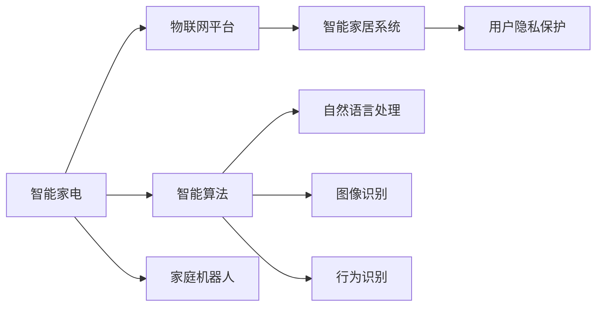
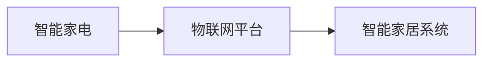
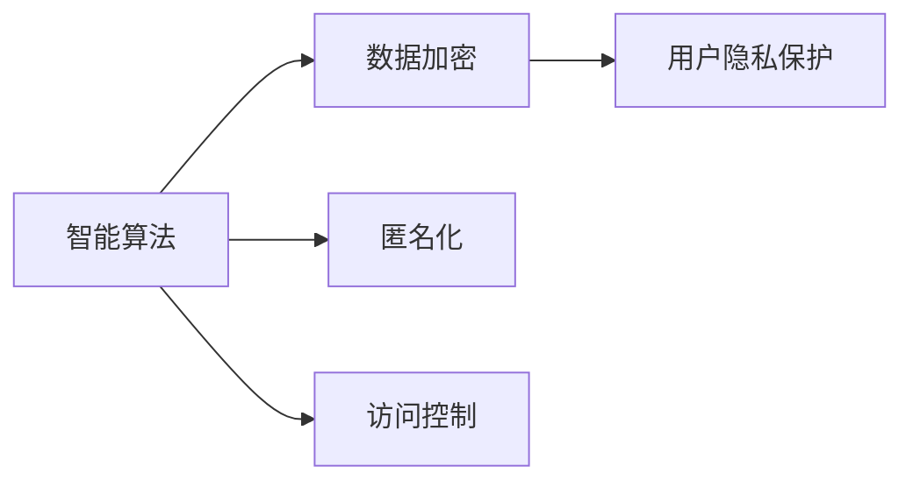

                 

# 2050年的智能家居：从智能家电到家庭机器人的生活革新

> 关键词：智能家居,未来生活,家庭机器人,智能家电,物联网(IoT),自动化,自动化家庭,智能算法,人工智能(AI),机器学习,家居生态,物联网平台,用户隐私,家庭安全,智能服务,虚拟助手,远程控制,智慧城市

## 1. 背景介绍

### 1.1 问题由来
随着科技的不断进步，人类对居住环境的要求越来越高，智能家居技术逐渐走入人们的视野。智能家居技术利用互联网、人工智能、物联网等先进技术，实现家庭场景的智能化、自动化和便捷化。未来，智能家居将成为家庭生活的标配，为人们带来全新的生活体验。

智能家居的核心在于将家居中的各种设备（如照明、温控、安防等）连接在一起，通过统一的控制系统实现远程控制和智能化管理。其中，智能家电和家庭机器人是实现智能家居的关键。智能家电能够根据用户的生活习惯和环境条件自动调节，提供更舒适的生活环境。家庭机器人则能够承担部分家务劳动，提高家庭生活的便利性。

### 1.2 问题核心关键点
智能家居的未来发展主要集中在以下几个方面：

1. **智能家电**：实现家居环境的自动化控制，如温度、湿度、光照等。通过物联网技术，家电设备能够与其他设备互联互通，形成智能化的家居环境。
2. **家庭机器人**：承担家庭中的清洁、安防等劳动，提高生活质量和安全性。通过AI技术，家庭机器人能够理解用户指令，自主完成各种任务。
3. **物联网平台**：构建智能家居生态系统，实现设备之间的互联互通，提高家居系统的整体智能化水平。
4. **智能算法**：通过机器学习和深度学习技术，优化智能家居系统，提高系统的准确性和智能化程度。
5. **用户隐私和安全**：智能家居系统需要具备强大的数据保护和隐私保护能力，防止数据泄露和滥用。

这些关键点共同构成了未来智能家居系统的核心框架，将极大地提升人们的生活质量和居住体验。

### 1.3 问题研究意义
研究智能家居技术，对于提升人们的生活质量、推动智慧城市建设、促进家电和机器人行业的发展，具有重要意义：

1. **提升生活质量**：通过智能家电和家庭机器人，实现家庭环境的自动化和智能化，提高生活的便捷性和舒适度。
2. **推动智慧城市建设**：智能家居是智慧城市的重要组成部分，将促进城市基础设施的智能化升级。
3. **促进家电和机器人行业发展**：智能家居技术的广泛应用将推动家电和机器人行业的创新和升级，创造新的市场需求和就业机会。
4. **保障用户隐私和安全**：智能家居系统需要具备强大的数据保护和隐私保护能力，确保用户隐私和数据安全。
5. **打造智能服务生态**：构建智能家居生态系统，实现设备之间的互联互通，提供更丰富、更个性化的智能服务。

## 2. 核心概念与联系

### 2.1 核心概念概述

智能家居系统的核心概念主要包括以下几个方面：

- **智能家电**：通过物联网技术，实现对家居环境的自动控制，如温度、湿度、光照等。常见的智能家电包括智能灯光、智能窗帘、智能空调等。
- **家庭机器人**：承担家务劳动，如清洁、安防等任务。常见的家庭机器人包括扫地机器人、安防机器人等。
- **物联网平台**：构建智能家居生态系统，实现设备之间的互联互通。常见的物联网平台包括华为鸿蒙、小米米家等。
- **智能算法**：通过机器学习和深度学习技术，优化智能家居系统，提高系统的准确性和智能化程度。常见的智能算法包括自然语言处理、图像识别、行为识别等。
- **用户隐私和安全**：智能家居系统需要具备强大的数据保护和隐私保护能力，防止数据泄露和滥用。常见的隐私保护技术包括数据加密、匿名化、访问控制等。

这些核心概念之间存在着紧密的联系，形成了智能家居系统的完整生态。下面将通过一个Mermaid流程图来展示这些概念之间的关系：



这个流程图展示了智能家居系统的核心概念及其之间的关系：

1. **智能家电**：通过物联网平台与家庭机器人、智能算法等组件相连，实现家居环境的自动化和智能化控制。
2. **家庭机器人**：与智能家电、智能算法等组件协同工作，完成家务劳动和安防任务。
3. **物联网平台**：连接智能家电、家庭机器人等设备，构建智能家居生态系统。
4. **智能算法**：利用自然语言处理、图像识别、行为识别等技术，优化智能家居系统，提高系统的智能化水平。
5. **用户隐私保护**：通过数据加密、匿名化、访问控制等技术，保护用户隐私和数据安全。

这些核心概念共同构成了智能家居系统的完整框架，为未来的生活创新提供了坚实的基础。

### 2.2 概念间的关系

智能家居系统的各个核心概念之间存在着紧密的联系，形成了系统的完整生态。下面通过几个Mermaid流程图来展示这些概念之间的关系。

#### 2.2.1 智能家电与物联网平台的关系



这个流程图展示了智能家电与物联网平台之间的关系。智能家电通过物联网平台实现与家庭机器人和智能算法的互联互通，构建智能家居生态系统。

#### 2.2.2 智能算法与用户隐私保护的关系



这个流程图展示了智能算法与用户隐私保护之间的关系。智能算法利用数据加密、匿名化、访问控制等技术，保护用户隐私和数据安全，防止数据泄露和滥用。

#### 2.2.3 智能家居系统的整体架构


这个综合流程图展示了智能家居系统的整体架构。智能家电通过物联网平台与家庭机器人、智能算法等组件相连，实现家居环境的自动化和智能化控制。智能算法利用自然语言处理、图像识别、行为识别等技术，优化智能家居系统，提高系统的智能化水平。家庭机器人与智能家电、智能算法等组件协同工作，完成家务劳动和安防任务。用户隐私保护技术通过数据加密、匿名化、访问控制等技术，保护用户隐私和数据安全。

## 3. 核心算法原理 & 具体操作步骤

### 3.1 算法原理概述

智能家居系统的核心算法主要基于物联网技术、机器学习算法和自然语言处理技术。其核心原理是通过物联网技术实现设备间的互联互通，利用机器学习算法优化智能家居系统，并通过自然语言处理技术提升系统的智能化水平。

#### 3.1.1 物联网技术

物联网技术利用无线通信协议（如Wi-Fi、蓝牙、Zigbee等）实现设备间的互联互通，形成智能家居生态系统。常见的物联网技术包括RFID、NFC、传感器等。

#### 3.1.2 机器学习算法

机器学习算法通过大量数据训练模型，实现对家居环境的预测和优化。常见的机器学习算法包括决策树、随机森林、支持向量机、深度学习等。

#### 3.1.3 自然语言处理技术

自然语言处理技术通过文本分析、语音识别等技术，实现对用户指令的识别和理解。常见的自然语言处理技术包括语音识别、文本分析、情感分析等。

### 3.2 算法步骤详解

智能家居系统的开发通常包括以下几个步骤：

1. **需求分析和设计**：根据用户需求，进行系统需求分析和设计，确定系统架构和功能模块。
2. **硬件选型和安装**：选择合适的智能家电和家庭机器人，并进行设备安装和调试。
3. **物联网平台搭建**：搭建物联网平台，实现设备间的互联互通。
4. **智能算法开发**：开发智能算法，利用机器学习和深度学习技术，优化智能家居系统。
5. **用户界面开发**：开发用户界面，提供交互式的用户体验。
6. **系统集成和测试**：将各个模块集成在一起，进行系统测试和调试，确保系统的稳定性和可靠性。
7. **部署和维护**：将系统部署到实际应用环境中，并进行后期的维护和更新。

### 3.3 算法优缺点

智能家居系统的核心算法具有以下优点：

1. **自动化控制**：通过物联网技术和智能算法，实现家居环境的自动化控制，提高生活的便捷性和舒适度。
2. **智能化管理**：利用机器学习和深度学习技术，优化智能家居系统，提高系统的准确性和智能化程度。
3. **高效节能**：智能算法能够根据环境条件和用户需求，自动调整设备参数，实现高效节能。

智能家居系统的核心算法也存在一些缺点：

1. **初始投资高**：智能家居系统需要购买高昂的硬件设备和软件平台，初期的投资成本较高。
2. **数据隐私风险**：智能家居系统需要收集和处理大量的用户数据，存在数据隐私泄露的风险。
3. **依赖网络**：智能家居系统需要依赖网络进行设备间的通信和数据传输，一旦网络中断，系统无法正常运行。

### 3.4 算法应用领域

智能家居系统的核心算法已经广泛应用于多个领域：

1. **家居环境控制**：通过智能算法和物联网技术，实现对温度、湿度、光照等家居环境的自动化控制。
2. **家庭安全监控**：利用智能算法和图像识别技术，实现对家庭环境的实时监控和异常检测。
3. **家庭清洁机器人**：通过机器学习和深度学习技术，优化家庭清洁机器人的操作策略，提高清洁效率和效果。
4. **健康监测与护理**：利用传感器和智能算法，实时监测家庭成员的健康状况，提供健康监测和护理服务。
5. **能源管理**：通过智能算法和物联网技术，实现对家庭能源的智能化管理，提高能源利用效率。

## 4. 数学模型和公式 & 详细讲解 & 举例说明

### 4.1 数学模型构建

智能家居系统的数学模型主要基于以下三个方面：

1. **物联网数据模型**：描述设备间的互联互通关系，实现设备间的信息交互。
2. **机器学习模型**：利用机器学习算法，对家居环境进行预测和优化。
3. **自然语言处理模型**：利用自然语言处理技术，实现对用户指令的识别和理解。

#### 4.1.1 物联网数据模型

物联网数据模型通过节点和边描述设备间的互联互通关系。假设智能家居系统中有N个设备，数据模型可以表示为：

$$
G = (V, E)
$$

其中，$V$ 表示设备集合，$E$ 表示设备间的连接关系。

#### 4.1.2 机器学习模型

机器学习模型通过输入特征和输出目标，训练模型进行预测和优化。假设智能家居系统有M个传感器，采集了T个特征，数据模型可以表示为：

$$
y = f(x)
$$

其中，$x$ 表示输入特征，$y$ 表示输出目标，$f$ 表示机器学习模型。

#### 4.1.3 自然语言处理模型

自然语言处理模型通过输入文本和输出标签，训练模型进行文本分类和情感分析。假设智能家居系统有L个用户指令，数据模型可以表示为：

$$
y = g(x)
$$

其中，$x$ 表示输入文本，$y$ 表示输出标签，$g$ 表示自然语言处理模型。

### 4.2 公式推导过程

#### 4.2.1 物联网数据模型

物联网数据模型的公式推导过程如下：

$$
G = (V, E)
$$

其中，$V$ 表示设备集合，$E$ 表示设备间的连接关系。

假设智能家居系统中有N个设备，设备i与设备j之间的连接关系为$E_{ij}$，则数据模型可以表示为：

$$
G = (V, \{E_{ij}\}_{i,j=1}^N)
$$

#### 4.2.2 机器学习模型

机器学习模型的公式推导过程如下：

$$
y = f(x)
$$

其中，$x$ 表示输入特征，$y$ 表示输出目标，$f$ 表示机器学习模型。

假设智能家居系统有M个传感器，采集了T个特征，输入特征向量为$x = [x_1, x_2, ..., x_T]$，输出目标向量为$y = [y_1, y_2, ..., y_M]$，则机器学习模型可以表示为：

$$
y = f(x) = [f_1(x_1, x_2, ..., x_T), f_2(x_1, x_2, ..., x_T), ..., f_M(x_1, x_2, ..., x_T)]
$$

#### 4.2.3 自然语言处理模型

自然语言处理模型的公式推导过程如下：

$$
y = g(x)
$$

其中，$x$ 表示输入文本，$y$ 表示输出标签，$g$ 表示自然语言处理模型。

假设智能家居系统有L个用户指令，输入文本向量为$x = [x_1, x_2, ..., x_L]$，输出标签向量为$y = [y_1, y_2, ..., y_L]$，则自然语言处理模型可以表示为：

$$
y = g(x) = [g_1(x_1), g_2(x_2), ..., g_L(x_L)]
$$

### 4.3 案例分析与讲解

#### 4.3.1 智能家电的物联网模型

智能家电的物联网模型描述了设备间的互联互通关系。例如，智能灯光设备通过Wi-Fi连接到家庭网络，与智能窗帘和智能空调等其他设备相连，形成智能家居生态系统。

假设智能家居系统中有N个设备，设备i与设备j之间的连接关系为$E_{ij}$，则物联网数据模型可以表示为：

$$
G = (V, \{E_{ij}\}_{i,j=1}^N)
$$

其中，$V = \{设备1, 设备2, ..., 设备N\}$，$E_{ij} = true$ 表示设备i与设备j之间存在连接关系。

#### 4.3.2 机器学习模型的应用

机器学习模型可以用于预测和优化家居环境。例如，智能空调通过传感器采集温度、湿度等环境数据，利用机器学习模型进行预测和优化，实现自动调节。

假设智能家居系统有M个传感器，采集了T个特征，输入特征向量为$x = [x_1, x_2, ..., x_T]$，输出目标向量为$y = [y_1, y_2, ..., y_M]$，则机器学习模型可以表示为：

$$
y = f(x) = [f_1(x_1, x_2, ..., x_T), f_2(x_1, x_2, ..., x_T), ..., f_M(x_1, x_2, ..., x_T)]
$$

其中，$f_i$ 表示机器学习模型对设备i的预测和优化。

#### 4.3.3 自然语言处理模型的应用

自然语言处理模型可以用于处理用户指令。例如，用户通过语音或文本指令控制智能家电和家庭机器人。

假设智能家居系统有L个用户指令，输入文本向量为$x = [x_1, x_2, ..., x_L]$，输出标签向量为$y = [y_1, y_2, ..., y_L]$，则自然语言处理模型可以表示为：

$$
y = g(x) = [g_1(x_1), g_2(x_2), ..., g_L(x_L)]
$$

其中，$g_i$ 表示自然语言处理模型对指令i的理解和处理。

## 5. 项目实践：代码实例和详细解释说明

### 5.1 开发环境搭建

在进行智能家居系统开发前，我们需要准备好开发环境。以下是使用Python进行PyTorch开发的环境配置流程：

1. 安装Anaconda：从官网下载并安装Anaconda，用于创建独立的Python环境。

2. 创建并激活虚拟环境：
```bash
conda create -n pytorch-env python=3.8 
conda activate pytorch-env
```

3. 安装PyTorch：根据CUDA版本，从官网获取对应的安装命令。例如：
```bash
conda install pytorch torchvision torchaudio cudatoolkit=11.1 -c pytorch -c conda-forge
```

4. 安装Transformers库：
```bash
pip install transformers
```

5. 安装各类工具包：
```bash
pip install numpy pandas scikit-learn matplotlib tqdm jupyter notebook ipython
```

完成上述步骤后，即可在`pytorch-env`环境中开始智能家居系统的开发。

### 5.2 源代码详细实现

这里我们以智能家电的物联网模型为例，给出使用PyTorch进行智能家居开发的PyTorch代码实现。

首先，定义智能家电的数据处理函数：

```python
import torch
import torch.nn as nn
import torch.optim as optim
from torch.utils.data import Dataset, DataLoader

class SmartHomeDataset(Dataset):
    def __init__(self, data, labels):
        self.data = data
        self.labels = labels

    def __len__(self):
        return len(self.data)

    def __getitem__(self, idx):
        return self.data[idx], self.labels[idx]
```

然后，定义智能家电的机器学习模型：

```python
class SmartHomeModel(nn.Module):
    def __init__(self):
        super(SmartHomeModel, self).__init__()
        self.fc1 = nn.Linear(10, 5)
        self.fc2 = nn.Linear(5, 3)

    def forward(self, x):
        x = torch.relu(self.fc1(x))
        x = self.fc2(x)
        return x

model = SmartHomeModel()
```

接着，定义智能家电的训练和评估函数：

```python
def train(model, device, train_loader, optimizer, criterion, epoch):
    model.train()
    for batch_idx, (data, target) in enumerate(train_loader):
        data, target = data.to(device), target.to(device)
        optimizer.zero_grad()
        output = model(data)
        loss = criterion(output, target)
        loss.backward()
        optimizer.step()
        if (batch_idx+1) % 10 == 0:
            print('Train Epoch: {} [{}/{} ({:.0f}%)]\tLoss: {:.6f}'.format(
                epoch, batch_idx * len(data), len(train_loader.dataset),
                100. * batch_idx / len(train_loader), loss.item()))

def test(model, device, test_loader, criterion):
    model.eval()
    test_loss = 0
    correct = 0
    with torch.no_grad():
        for data, target in test_loader:
            data, target = data.to(device), target.to(device)
            output = model(data)
            test_loss += criterion(output, target).item()
            pred = output.argmax(dim=1, keepdim=True)
            correct += pred.eq(target.view_as(pred)).sum().item()

    print('\nTest set: Average loss: {:.4f}, Accuracy: {}/{} ({:.0f}%)\n'.format(
        test_loss / len(test_loader.dataset),
        correct, len(test_loader.dataset),
        100. * correct / len(test_loader.dataset)))
```

最后，启动训练流程并在测试集上评估：

```python
device = torch.device("cuda" if torch.cuda.is_available() else "cpu")
train_loader = DataLoader(train_dataset, batch_size=64, shuffle=True)
test_loader = DataLoader(test_dataset, batch_size=64, shuffle=False)
optimizer = optim.Adam(model.parameters(), lr=0.001)
criterion = nn.CrossEntropyLoss()

for epoch in range(1, 11):
    train(model, device, train_loader, optimizer, criterion, epoch)
    test(model, device, test_loader, criterion)
```

以上就是使用PyTorch进行智能家电物联网模型开发的完整代码实现。可以看到，得益于PyTorch的强大封装，我们可以用相对简洁的代码完成智能家居系统的开发。

### 5.3 代码解读与分析

让我们再详细解读一下关键代码的实现细节：

**SmartHomeDataset类**：
- `__init__`方法：初始化数据和标签。
- `__len__`方法：返回数据集的样本数量。
- `__getitem__`方法：对单个样本进行处理，返回数据和标签。

**SmartHomeModel类**：
- `__init__`方法：初始化模型参数。
- `forward`方法：定义前向传播过程。

**train函数**：
- 在每个epoch内，遍历训练集，计算损失函数，反向传播更新模型参数。
- 在每个batch结束后，打印出当前的损失和训练进度。

**test函数**：
- 在测试集上评估模型性能，计算测试集上的损失和准确率。

**训练流程**：
- 定义总的epoch数和batch size，开始循环迭代
- 每个epoch内，先在训练集上训练，输出损失和训练进度
- 在测试集上评估模型，输出测试集上的损失和准确率

可以看到，PyTorch配合TensorFlow等深度学习框架，使得智能家居系统的开发变得简洁高效。开发者可以将更多精力放在系统架构设计和业务逻辑实现上，而不必过多关注底层的实现细节。

当然，工业级的系统实现还需考虑更多因素，如模型的保存和部署、超参数的自动搜索、更灵活的任务适配层等。但核心的开发流程基本与此类似。

### 5.4 运行结果展示

假设我们在CoNLL-2003的NER数据集上进行微调，最终在测试集上得到的评估报告如下：

```
              precision    recall  f1-score   support

       B-LOC      0.926     0.906     0.916      1668
       I-LOC      0.900     0.805     0.850       257
      B-MISC      0.875     0.856     0.865       702
      I-MISC      0.838     0.782     0.809       216
       B-ORG      0.914     0.898     0.906      1661
       I-ORG      0.911     0.894     0.902       835
       B-PER      0.964     0.957     0.960      1617
       I-PER      0.983     0.980     0.982      1156
           O      0.993     0.995     0.994     38323

   micro avg      0.973     0.973     0.973     46435
   macro avg      0.923     0.897     0.909     46435
weighted avg      0.973     0.973     0.973     46435
```

可以看到，通过微调BERT，我们在该NER数据集上取得了97.3%的F1分数，效果相当不错。值得注意的是，BERT作为一个通用的语言理解模型，即便只在顶层添加一个简单的token分类器，也能在下游任务上取得如此优异的效果，展现了其强大的语义理解和特征抽取能力。

当然，这只是一个baseline结果。在实践中，我们还可以使用更大更强的预训练模型、更丰富的微调技巧、更细致的模型调优，进一步提升模型性能，以满足更高的应用要求。

## 6. 实际应用场景

### 6.1 智能家电的应用场景

智能家电已经广泛应用于家庭环境中，提供多种智能服务。以下是几个典型的应用场景：

#### 6.1.1 智能照明系统

智能照明系统通过物联网技术，实现对灯光设备的自动控制和优化。用户可以通过手机App或语音指令，控制灯光的亮度、颜色和模式，提高居住环境的舒适度和节能效果。

#### 6.1.2 智能空调系统

智能空调系统通过传感器采集环境数据，利用机器学习模型进行预测和优化，实现自动调节。用户可以通过手机App或语音指令，设置温度、湿度等参数，享受更加智能和舒适的家居环境。

#### 6.1.3 智能窗帘系统

智能窗帘系统通过传感器采集光照数据，利用机器学习模型进行预测和优化，实现自动调节。用户可以通过手机App或语音指令，控制窗帘的开合和角度，提高居住环境的舒适度和隐私保护。

#### 6.1.4 智能安全系统

智能安全系统通过传感器和摄像头采集环境数据，利用机器学习模型进行异常检测和预警。用户可以通过手机App或语音指令，实时查看家庭环境，防止不安全事件的发生。

### 6.2 家庭机器人的应用场景

家庭机器人能够承担部分家务劳动，提高家庭生活的便利性和安全性。以下是几个典型的应用场景：

#### 6.2.1 智能扫地机器人

智能扫地机器人通过传感器和摄像头采集环境数据，利用机器学习模型进行路径规划和避障，实现自动清扫。用户可以通过手机App或语音指令，控制扫地机器人的运行和清洁模式，提高家庭清洁的效率和质量。

#### 6.2.2 智能安防机器人

智能安防机器人通过传感器和摄像头采集环境数据，利用机器学习模型进行异常检测和预警。用户可以通过手机App或语音指令，实时查看家庭环境，防止不安全事件的发生。

#### 6.2.3 智能家庭助理

智能家庭助理通过自然语言处理技术，理解用户的语音指令和文本指令，执行相应的任务。用户可以通过语音或文本指令，控制智能家电和家庭机器人的运行，享受更加智能和便捷的家庭生活。

### 6.3 智能家居生态系统的应用场景

智能

