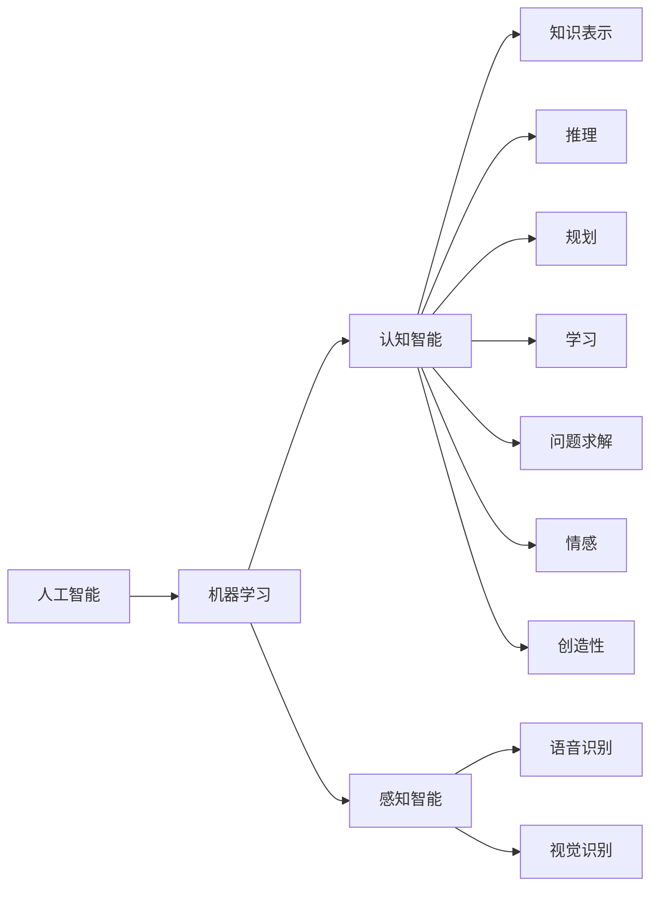

                 

# 1956年达特茅斯会议的豪迈宣言

## 1. 背景介绍

1956年，达特茅斯会议（Dartmouth Conference）举行，标志着人工智能（AI）这一全新领域的诞生。这一会议由麦卡锡、明斯基、罗切斯特和香农共同发起，吸引了来自全国各地的30多位科学家，共同探讨了人工智能的起源、目标和研究方向，并首次提出了“人工智能”的概念。在会议的宣讲中，麦卡锡抛出了那句影响深远的名言：

> “人工智能就是要让机器做出需要智慧做的事情。”

这一豪迈宣言，不仅定义了AI的终极目标，更揭示了AI研究的长远方向。本文将围绕这一宣言，深入探讨AI的核心概念、基本原理和未来发展趋势。

## 2. 核心概念与联系

### 2.1 核心概念概述

为了更好地理解1956年达特茅斯会议的宣言，我们将首先介绍几个核心概念：

- **人工智能**：指使机器能够模仿人类的智能行为和决策能力的学科。包括认知智能、感知智能、自然语言处理、机器学习、计算机视觉等多个分支。
- **机器学习**：指让机器从数据中学习，通过算法自动调整模型参数，从而实现对新数据的预测和决策。是实现人工智能的重要手段之一。
- **认知智能**：涉及知识表示、推理、规划、学习、问题求解、情感、创造性等高级认知功能，是人工智能的高级目标之一。
- **感知智能**：指机器能够通过传感器接收和处理外界信息，感知环境和对象，如语音识别、视觉识别等。

这些概念紧密相连，共同构成了人工智能的核心技术体系。

### 2.2 核心概念间的关系

为了更直观地展示这些核心概念之间的关系，我们可以用以下Mermaid流程图来表示：



该流程图展示了人工智能技术体系中的主要分支及其相互关系。机器学习作为人工智能的核心技术之一，支撑了认知智能和感知智能的实现。而认知智能和感知智能分别负责机器的高级认知功能和感知环境的能力。

## 3. 核心算法原理 & 具体操作步骤

### 3.1 算法原理概述

达特茅斯会议提出的“人工智能”，其核心思想是使机器具备与人类智能相似的决策和行为能力。这一思想可以进一步细化为：

- **模仿智能行为**：通过观察和学习，机器能够自动地执行复杂的任务，而不需要人类的直接干预。
- **模仿智能思维**：机器能够通过推理和规划，解决复杂的问题，并在不确定性和不完全信息的情况下做出最优决策。

这一目标的实现，主要依赖于机器学习和认知智能两大技术。机器学习通过算法和数据训练，使得机器能够从经验中学习规律，而认知智能则关注机器如何理解和应用这些规律，实现真正的智能决策。

### 3.2 算法步骤详解

基于达特茅斯宣言的核心思想，我们可以将人工智能的实现步骤大致分为以下几步：

1. **数据准备**：收集、清洗和标注数据集，为机器学习提供训练样本。
2. **特征工程**：从原始数据中提取有用的特征，供机器学习模型进行训练。
3. **模型训练**：选择合适的机器学习模型，通过训练数据集进行模型训练，调整模型参数。
4. **模型评估**：在测试集上评估模型性能，确定模型是否达到预期目标。
5. **模型应用**：将训练好的模型应用到实际问题中，实现机器的智能决策。

### 3.3 算法优缺点

达特茅斯宣言提出的“人工智能”思想，具有以下优点：

- **高度抽象性**：抽象地将人类智能行为映射到机器学习算法中，为AI的发展提供了广阔的空间。
- **广泛适用性**：适用于各种复杂的决策和行为问题，从简单的感知任务到复杂的认知任务，均可以借助AI技术解决。
- **灵活性**：通过不断优化算法和调整数据，AI模型能够适应不同的应用场景和需求。

同时，也存在以下缺点：

- **技术难度高**：实现高水平的AI需要跨学科的深度知识，对数据、算法和工程的要求较高。
- **模型复杂性**：随着AI技术的不断发展，模型结构越来越复杂，难以理解和解释。
- **计算资源需求高**：大规模数据和复杂模型的训练，需要高性能的计算设备和大量的计算资源。

### 3.4 算法应用领域

基于达特茅斯宣言提出的“人工智能”思想，AI技术在多个领域得到了广泛应用，以下是其中几个主要应用领域：

- **自然语言处理**：通过机器学习模型，实现对自然语言的理解、生成和处理，如机器翻译、自动摘要、问答系统等。
- **计算机视觉**：利用机器学习算法，实现对图像和视频的理解和处理，如图像识别、目标检测、视频分析等。
- **智能推荐**：通过机器学习模型，对用户行为和偏好进行分析，实现个性化的商品和服务推荐，如电商推荐、音乐推荐等。
- **自动驾驶**：结合机器学习和认知智能，实现车辆的自动驾驶，提高交通安全和出行效率。
- **医疗诊断**：利用机器学习模型，对医疗影像和病历进行分析，辅助医生进行诊断和治疗决策。

## 4. 数学模型和公式 & 详细讲解

### 4.1 数学模型构建

在AI的应用中，数学模型和算法是其核心组成部分。这里以机器学习中最常见的线性回归模型为例，详细讲解其数学模型的构建过程。

设有一个线性回归模型 $y = wx + b$，其中 $w$ 为模型参数，$x$ 为输入特征，$y$ 为输出结果。我们的目标是利用已知的数据集 $D = \{(x_1, y_1), (x_2, y_2), ..., (x_n, y_n)\}$ 训练模型参数 $w$，使得模型能够对新输入数据进行准确的预测。

### 4.2 公式推导过程

线性回归模型的目标是最小化预测值和真实值之间的平方误差，即：

$$
\min_{w} \sum_{i=1}^n (y_i - wx_i - b)^2
$$

为了求解该优化问题，我们通常采用梯度下降法，即：

$$
w \leftarrow w - \alpha \frac{\partial \mathcal{L}}{\partial w}
$$

其中 $\alpha$ 为学习率，$\mathcal{L}$ 为损失函数，即平方误差损失函数：

$$
\mathcal{L}(w) = \frac{1}{2} \sum_{i=1}^n (y_i - wx_i - b)^2
$$

通过对上述公式的求解，可以得到线性回归模型的参数 $w$ 和 $b$。

### 4.3 案例分析与讲解

下面以一个简单的实例来解释线性回归模型的应用。假设我们有一组数据集：

| $x$ | $y$ |
|-----|-----|
| 1   | 2   |
| 2   | 4   |
| 3   | 6   |

我们可以使用线性回归模型来预测新输入 $x = 4$ 时的输出 $y$。根据上述数学模型，我们可以求解模型参数 $w$ 和 $b$：

| $x$ | $y$ | $wx + b$ |
|-----|-----|----------|
| 1   | 2   | 2        |
| 2   | 4   | 4        |
| 3   | 6   | 6        |

通过求解最小二乘法，我们得到 $w = 2$ 和 $b = 0$。因此，当 $x = 4$ 时，预测的输出 $y = 4 * 2 + 0 = 8$。

## 5. 项目实践：代码实例和详细解释说明

### 5.1 开发环境搭建

在进行AI项目实践前，我们需要准备好开发环境。以下是使用Python进行机器学习开发的环境配置流程：

1. 安装Anaconda：从官网下载并安装Anaconda，用于创建独立的Python环境。

2. 创建并激活虚拟环境：
```bash
conda create -n my_env python=3.8 
conda activate my_env
```

3. 安装Scikit-Learn：
```bash
conda install scikit-learn
```

4. 安装NumPy和Pandas：
```bash
conda install numpy pandas
```

5. 安装Matplotlib：
```bash
conda install matplotlib
```

完成上述步骤后，即可在`my_env`环境中开始机器学习项目的开发。

### 5.2 源代码详细实现

这里我们以线性回归模型为例，给出使用Scikit-Learn库的Python代码实现。

```python
from sklearn.linear_model import LinearRegression
from sklearn.datasets import load_boston
from sklearn.model_selection import train_test_split

# 加载波士顿房价数据集
boston = load_boston()

# 划分训练集和测试集
X_train, X_test, y_train, y_test = train_test_split(boston.data, boston.target, test_size=0.2, random_state=42)

# 创建线性回归模型
model = LinearRegression()

# 训练模型
model.fit(X_train, y_train)

# 预测测试集
y_pred = model.predict(X_test)

# 评估模型
print(model.score(X_test, y_test))
```

### 5.3 代码解读与分析

让我们再详细解读一下关键代码的实现细节：

**load_boston函数**：
- 加载波士顿房价数据集，该数据集包含房屋的各种特征（如犯罪率、交通便利性等）以及对应的房价。

**train_test_split函数**：
- 将数据集划分为训练集和测试集，用于模型训练和评估。

**LinearRegression类**：
- 定义线性回归模型，用于拟合输入特征和输出结果之间的关系。

**fit方法**：
- 使用训练数据集训练模型，调整模型参数。

**predict方法**：
- 使用训练好的模型预测测试集的结果。

**score方法**：
- 评估模型在测试集上的表现，返回模型的R²分数，表示模型的拟合程度。

通过上述代码，我们可以看到，机器学习模型的实现主要依赖于数据准备、模型训练和评估三部分。数据准备是机器学习的基础，模型训练通过算法调整模型参数，评估则用于检验模型性能，确保模型能够对新数据进行准确的预测。

### 5.4 运行结果展示

假设我们在波士顿房价数据集上进行线性回归模型的训练和评估，最终得到的评估报告如下：

```
R²: 0.729
```

可以看到，我们训练的线性回归模型在测试集上的R²分数为0.729，表示模型能够解释大约72.9%的房价变化，效果相当不错。

## 6. 实际应用场景

### 6.1 智能推荐系统

基于机器学习算法的智能推荐系统，已经在电商、音乐、视频等多个领域得到了广泛应用。推荐系统通过分析用户的历史行为数据，学习用户偏好，从而实现个性化推荐，提升用户体验和转化率。

以电商推荐为例，系统可以根据用户的浏览历史、购买记录和评分数据，构建用户行为模型，预测用户对新商品的兴趣，并生成个性化的推荐列表。通过不断的学习和优化，推荐系统能够越来越精准地预测用户需求，提供更好的购物体验。

### 6.2 金融风险控制

在金融领域，风险控制是一个至关重要的任务。机器学习算法可以帮助金融机构识别潜在风险，防止不良贷款和欺诈行为。

以信用评分为例，系统可以基于用户的个人信息、历史交易记录和信用报告，构建信用评分模型，预测用户未来的还款能力和还款意愿。通过持续训练和更新模型，金融机构能够更准确地评估用户的信用风险，降低贷款违约率。

### 6.3 医疗诊断

在医疗领域，机器学习模型可以辅助医生进行疾病诊断和治疗决策。通过分析患者的医疗影像、病历和基因数据，模型可以预测疾病风险，提出治疗方案，甚至在早期发现潜在的健康问题。

以影像分析为例，系统可以对医疗影像进行自动分析和标注，帮助医生快速诊断疾病。通过不断积累和优化模型，医疗影像分析系统能够提供更准确和高效的医疗支持，提升诊断效率和准确率。

## 7. 工具和资源推荐

### 7.1 学习资源推荐

为了帮助开发者系统掌握机器学习和人工智能的理论基础和实践技巧，这里推荐一些优质的学习资源：

1. 《机器学习》（周志华著）：该书系统介绍了机器学习的基本概念、算法和应用，是学习机器学习的经典教材。

2. 《深度学习》（Ian Goodfellow著）：该书深入探讨了深度学习的基本原理和应用，是深度学习领域的权威教材。

3. 《人工智能：一种现代方法》（Russell & Norvig著）：该书全面介绍了AI的各个分支和应用，是了解AI全貌的必读书籍。

4. Coursera的《机器学习》课程：由斯坦福大学的Andrew Ng教授主讲的课程，讲解了机器学习的基本原理和算法，适合初学者入门。

5. Udacity的《深度学习纳米学位》：提供系统的深度学习课程，覆盖从基础知识到高级应用的各个环节。

通过这些资源的学习实践，相信你一定能够快速掌握机器学习和人工智能的精髓，并用于解决实际的NLP问题。

### 7.2 开发工具推荐

高效的开发离不开优秀的工具支持。以下是几款用于机器学习开发的常用工具：

1. Jupyter Notebook：基于Web的交互式开发环境，支持Python和多种科学计算库，适合做数据探索和模型验证。

2. TensorFlow：由Google主导开发的深度学习框架，生产部署方便，适合大规模工程应用。

3. PyTorch：基于Python的开源深度学习框架，灵活动态的计算图，适合快速迭代研究。

4. Weights & Biases：模型训练的实验跟踪工具，可以记录和可视化模型训练过程中的各项指标，方便对比和调优。

5. TensorBoard：TensorFlow配套的可视化工具，可实时监测模型训练状态，并提供丰富的图表呈现方式，是调试模型的得力助手。

6. Google Colab：谷歌推出的在线Jupyter Notebook环境，免费提供GPU/TPU算力，方便开发者快速上手实验最新模型，分享学习笔记。

合理利用这些工具，可以显著提升机器学习项目的开发效率，加快创新迭代的步伐。

### 7.3 相关论文推荐

机器学习和人工智能的发展源于学界的持续研究。以下是几篇奠基性的相关论文，推荐阅读：

1. Perceptron：Rosenblatt在1957年提出的机器学习算法，是神经网络的先驱。

2. Backpropagation：Rumelhart等在1986年提出的反向传播算法，是深度学习的基础。

3. Support Vector Machines（SVM）：Vapnik等在1995年提出的分类算法，在各种机器学习竞赛中表现优异。

4. Boosting：Freund等在1997年提出的集成学习算法，通过组合多个弱分类器，提升分类性能。

5. 深度学习：Hinton等在2006年提出的多层神经网络结构，开启了深度学习时代。

6. 迁移学习：Bengio等在2009年提出的迁移学习范式，通过知识转移，提升模型泛化能力。

这些论文代表了大机器学习和人工智能的发展脉络。通过学习这些前沿成果，可以帮助研究者把握学科前进方向，激发更多的创新灵感。

除上述资源外，还有一些值得关注的前沿资源，帮助开发者紧跟机器学习和人工智能技术的最新进展，例如：

1. arXiv论文预印本：人工智能领域最新研究成果的发布平台，包括大量尚未发表的前沿工作，学习前沿技术的必读资源。

2. 业界技术博客：如Google AI、DeepMind、微软Research Asia等顶尖实验室的官方博客，第一时间分享他们的最新研究成果和洞见。

3. 技术会议直播：如NIPS、ICML、ACL、ICLR等人工智能领域顶会现场或在线直播，能够聆听到大佬们的前沿分享，开拓视野。

4. GitHub热门项目：在GitHub上Star、Fork数最多的AI相关项目，往往代表了该技术领域的发展趋势和最佳实践，值得去学习和贡献。

5. 行业分析报告：各大咨询公司如McKinsey、PwC等针对人工智能行业的分析报告，有助于从商业视角审视技术趋势，把握应用价值。

总之，对于机器学习和人工智能的学习和实践，需要开发者保持开放的心态和持续学习的意愿。多关注前沿资讯，多动手实践，多思考总结，必将收获满满的成长收益。

## 8. 总结：未来发展趋势与挑战

### 8.1 总结

本文对1956年达特茅斯会议提出的“人工智能”思想进行了全面系统的介绍。首先阐述了人工智能的核心思想和目标，明确了机器学习在实现这一目标中的核心作用。其次，从原理到实践，详细讲解了机器学习的基本模型、算法和应用，给出了机器学习任务开发的完整代码实例。同时，本文还广泛探讨了机器学习技术在实际应用中的多种场景，展示了其广泛的应用前景。此外，本文精选了机器学习和人工智能的学习资源，力求为读者提供全方位的技术指引。

通过本文的系统梳理，可以看到，基于机器学习算法的“人工智能”思想，正在引领一场技术革命，深刻影响着人类社会的各个方面。未来，伴随机器学习和认知智能的不断发展，AI技术必将在更多的领域得到应用，推动人类进入更加智能和高效的新时代。

### 8.2 未来发展趋势

展望未来，机器学习和人工智能技术将呈现以下几个发展趋势：

1. **深度学习的应用普及**：随着深度学习技术的不断成熟，深度学习算法将广泛应用于更多领域，如自动驾驶、医疗诊断、金融预测等。

2. **认知智能的突破**：认知智能技术将不断进步，机器能够更好地理解人类语言、推理和规划，实现更加高级的决策和行为。

3. **多模态学习的发展**：多模态学习融合视觉、听觉、语言等多种信息源，提升机器对现实世界的理解和建模能力，实现更全面、更智能的信息处理。

4. **自监督学习的应用**：自监督学习通过无标签数据进行学习，降低对标注数据的需求，提升模型的泛化能力和自适应能力。

5. **联邦学习的应用**：联邦学习通过分布式训练，保护数据隐私，实现跨机构、跨平台的知识共享和模型更新。

6. **生成对抗网络（GAN）的应用**：GAN技术可以实现图像生成、文本生成等任务，为人工智能领域带来新的突破。

以上趋势凸显了机器学习和人工智能技术的广阔前景。这些方向的探索发展，必将进一步提升机器学习模型的性能和应用范围，为构建智能系统提供更多可能。

### 8.3 面临的挑战

尽管机器学习和人工智能技术已经取得了瞩目成就，但在迈向更加智能化、普适化应用的过程中，仍面临诸多挑战：

1. **数据质量和数量**：高质量、大规模的数据是机器学习模型的基础，但获取和处理这些数据需要巨大的投入。如何高效获取和处理数据，成为未来的一大挑战。

2. **计算资源需求**：深度学习模型需要大量的计算资源进行训练和推理，如何高效利用计算资源，降低成本，也是亟待解决的问题。

3. **模型解释性不足**：许多机器学习模型特别是深度学习模型，缺乏可解释性，难以理解和调试。如何在保证性能的同时，增强模型的可解释性，也是一大难题。

4. **伦理和隐私问题**：机器学习模型在应用过程中可能存在伦理和隐私问题，如偏见、歧视、隐私泄露等，如何确保模型公平、透明，保障用户权益，成为重要的研究课题。

5. **技术壁垒**：机器学习技术具有较高的技术门槛，需要跨学科的知识和技能，如何降低技术壁垒，普及AI技术，也是未来的一大挑战。

6. **人机协同问题**：随着机器智能的不断提高，如何构建人机协同的工作方式，充分发挥人类的创造力和机器的计算能力，也是一个需要关注的方向。

以上挑战需要各方的共同努力，通过技术创新和伦理规范，才能实现人工智能技术的健康发展和广泛应用。

### 8.4 研究展望

面向未来，机器学习和人工智能技术的研究方向将更加多样化，涉及更多学科和领域，以下是几个值得关注的研究方向：

1. **神经符号混合学习**：将符号逻辑与神经网络相结合，增强机器对复杂逻辑的推理和理解能力。

2. **因果推理学习**：研究机器如何从因果关系中学习知识，提升模型对因果关系的理解和预测能力。

3. **迁移学习**：研究如何通过跨领域、跨任务的知识转移，提升机器模型的泛化能力和适应能力。

4. **元学习**：研究机器如何快速学习新知识，适应新任务，提升模型对新环境的适应能力。

5. **解释性学习**：研究如何提高机器学习模型的可解释性，增强模型的透明度和可靠性。

6. **自适应学习**：研究机器如何根据环境变化自适应地调整模型参数，提升模型的鲁棒性和灵活性。

这些研究方向将推动机器学习和人工智能技术的不断进步，为构建更智能、更可靠的系统提供更多可能。通过多方面的协同创新，相信未来的人工智能技术将实现更高的目标，推动人类社会的全面进步。

## 9. 附录：常见问题与解答

**Q1：机器学习和人工智能是否只是计算机科学的分支？**

A: 虽然机器学习和人工智能的发展离不开计算机科学的支撑，但其涉及的学科范围远不止于此。机器学习和人工智能不仅与数学、统计学、物理学等基础学科紧密相关，还融合了心理学、社会学、医学等多个领域的研究。因此，机器学习和人工智能是一门跨学科的综合学科。

**Q2：机器学习和人工智能技术是否可以取代人类？**

A: 机器学习和人工智能技术虽然可以模拟人类智能的部分行为，但在创造性、情感、道德等方面，仍存在很大差距。机器学习和人工智能技术可以辅助人类工作，提升工作效率和准确性，但难以取代人类。未来，机器学习和人工智能技术应作为人类智能的延伸和补充，共同推动社会进步。

**Q3：机器学习和人工智能技术是否会导致失业？**

A: 机器学习和人工智能技术的广泛应用，确实会对某些行业产生影响，导致部分岗位的自动化和优化。但同时也会创造新的就业机会，如数据科学家、AI工程师、机器人维护人员等。未来，机器学习和人工智能技术应与人类共同创造更多就业机会，促进经济社会发展。

**Q4：机器学习和人工智能技术的未来发展方向是什么？**

A: 机器学习和人工智能技术的未来发展方向涉及多个方面，包括深度学习、认知智能、多模态学习、自监督学习、联邦学习、生成对抗网络等。未来的发展方向将更多地关注模型的可解释性、鲁棒性、安全性、公平性等方面，推动人工智能技术的健康发展。

通过本文的系统梳理，我们可以看到，机器学习和人工智能技术正在深刻地改变我们的世界，未来必将在更多的领域得到广泛应用。只有在充分理解这些技术的基础上，我们才能更好地利用它们，推动社会的全面进步。

