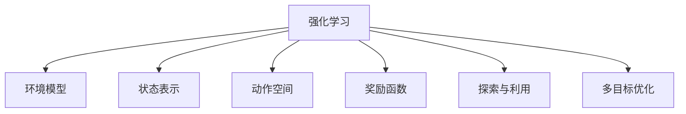
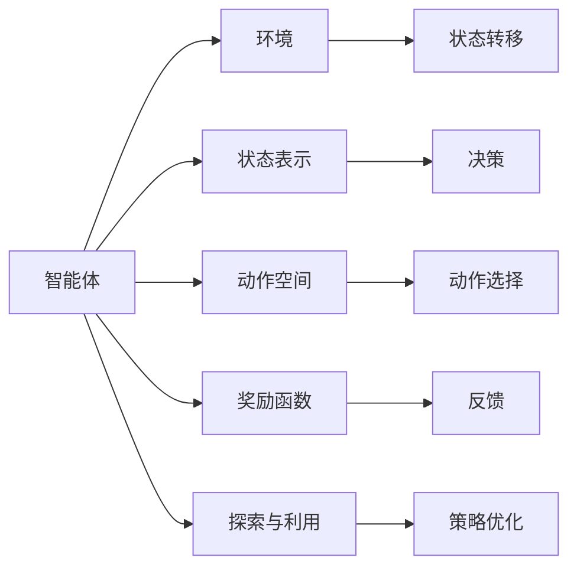
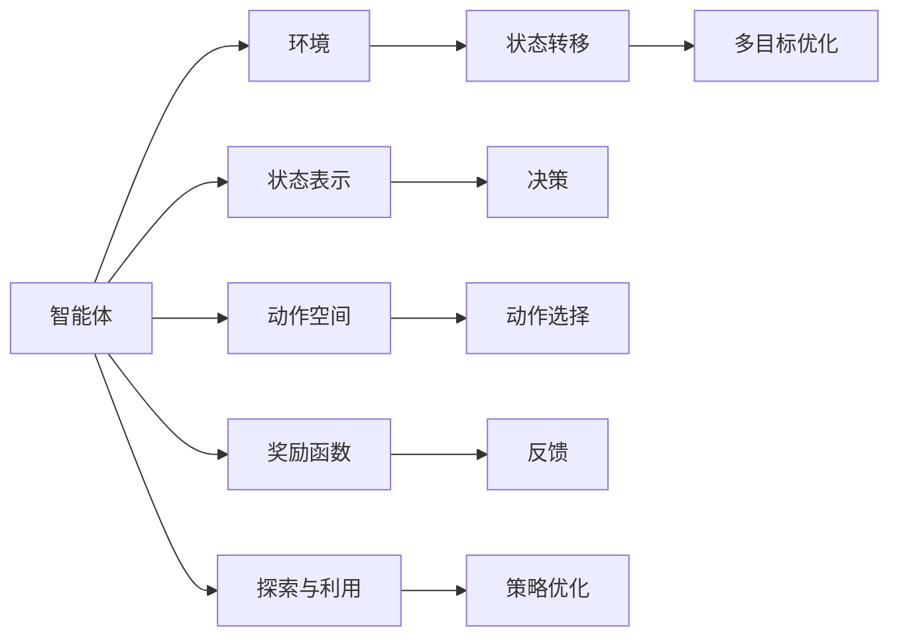
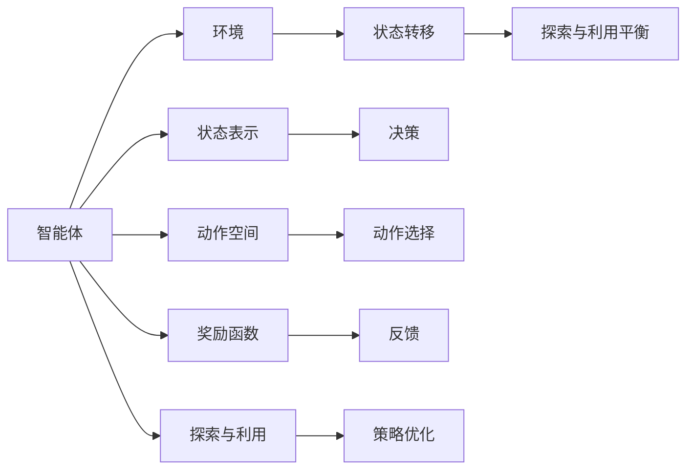
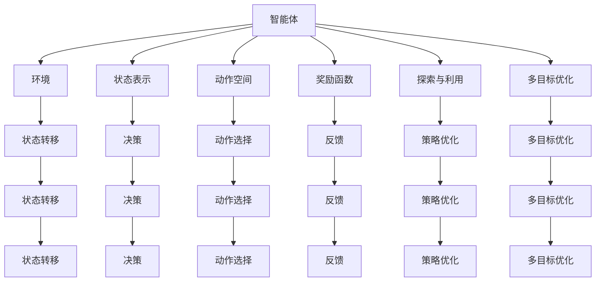

                 

# 强化学习在机器人操作中的应用:提高灵活性

## 1. 背景介绍

### 1.1 问题由来
随着人工智能技术的不断发展，机器人操作能力也在不断提升。强化学习(Reinforcement Learning, RL)作为一种基于试错机制的学习方法，已经被广泛应用于机器人操作中，以提高机器人的灵活性和自主性。通过强化学习，机器人可以在复杂、不确定的环境中自主学习和决策，显著提高了任务执行的效率和精度。

### 1.2 问题核心关键点
强化学习在机器人操作中的应用，核心在于通过与环境交互，让机器人不断尝试和学习，以最大化任务完成的目标。其关键点包括：

- **状态表示**：机器人需要抽象环境状态，以便进行决策和优化。
- **动作空间**：机器人可执行的每个操作，如抓握、移动、旋转等，都需要进行编码。
- **奖励函数**：设计合适的奖励函数，以激励机器人执行特定动作，完成特定任务。
- **探索与利用**：平衡探索新动作和利用已有知识，以高效地学习最优策略。
- **多目标优化**：机器人通常面临多个目标，需要设计多目标优化算法。

### 1.3 问题研究意义
强化学习在机器人操作中的应用，具有重要意义：

- **提高灵活性**：强化学习能够自适应环境变化，提高机器人应对未知情况的灵活性。
- **提升自主性**：机器人可以自主学习，减少对人工干预的依赖，提高自主执行任务的能力。
- **优化资源利用**：通过智能调度和决策，优化机器人操作流程，降低资源消耗。
- **推动机器人产业升级**：强化学习技术可以拓展机器人应用的广度和深度，推动机器人产业的发展。
- **探索新方法论**：强化学习提供了一种新的问题求解方法，为解决复杂、不确定性问题提供新思路。

## 2. 核心概念与联系

### 2.1 核心概念概述

为更好地理解强化学习在机器人操作中的应用，本节将介绍几个密切相关的核心概念：

- **强化学习**：通过与环境的交互，让智能体(如机器人)不断尝试和优化，以最大化任务完成的目标。
- **环境模型**：描述环境状态和智能体的动作空间，以便进行模拟训练和优化决策。
- **状态表示**：将环境信息抽象为机器可识别和处理的状态，以便进行状态转移和决策。
- **动作空间**：机器人可执行的所有可能操作，如关节角度、抓握力度等。
- **奖励函数**：定义智能体执行动作后的反馈信号，如完成任务的奖励、惩罚等。
- **探索与利用**：在优化过程中，如何平衡探索未知操作和利用已有知识。
- **多目标优化**：设计算法同时优化多个目标，如速度、精度、能耗等。

这些概念之间的逻辑关系可以通过以下Mermaid流程图来展示：



这个流程图展示了强化学习的核心概念及其之间的关系：

1. 强化学习通过与环境交互，不断尝试和学习，以最大化任务完成的目标。
2. 环境模型描述了环境状态和智能体的动作空间，为模拟训练和决策优化提供基础。
3. 状态表示将环境信息抽象为状态，以便进行状态转移和决策。
4. 动作空间定义了机器人可执行的所有可能操作，是智能体决策的基础。
5. 奖励函数定义了智能体执行动作后的反馈信号，是决策优化的关键。
6. 探索与利用平衡了智能体探索新动作和利用已有知识，是学习效率的关键。
7. 多目标优化在机器人操作中通常面临多个目标，需要设计算法进行综合优化。

### 2.2 概念间的关系

这些核心概念之间存在着紧密的联系，形成了强化学习在机器人操作中的完整框架。下面我们通过几个Mermaid流程图来展示这些概念之间的关系。

#### 2.2.1 强化学习流程



这个流程图展示了强化学习的基本流程：

1. 智能体与环境交互，通过状态表示和动作空间进行决策。
2. 环境返回状态转移和奖励反馈。
3. 智能体根据奖励反馈，进行策略优化。
4. 在探索与利用之间平衡，选择合适的动作。
5. 通过多目标优化，优化多个任务目标。

#### 2.2.2 多目标优化



这个流程图展示了多目标优化的基本流程：

1. 智能体与环境交互，通过状态表示和动作空间进行决策。
2. 环境返回状态转移和奖励反馈。
3. 智能体根据奖励反馈，进行策略优化。
4. 在探索与利用之间平衡，选择合适的动作。
5. 通过多目标优化算法，同时优化多个任务目标。

#### 2.2.3 探索与利用平衡



这个流程图展示了探索与利用平衡的基本流程：

1. 智能体与环境交互，通过状态表示和动作空间进行决策。
2. 环境返回状态转移和奖励反馈。
3. 智能体根据奖励反馈，进行策略优化。
4. 在探索与利用之间平衡，选择合适的动作。
5. 通过探索与利用平衡算法，优化探索和利用策略。

### 2.3 核心概念的整体架构

最后，我们用一个综合的流程图来展示这些核心概念在大语言模型微调过程中的整体架构：



这个综合流程图展示了从智能体与环境交互到多目标优化的完整过程。智能体通过状态表示和动作空间进行决策，与环境交互，根据奖励反馈进行策略优化，平衡探索与利用，同时进行多目标优化，逐步提升操作性能。通过这些流程图，我们可以更清晰地理解强化学习在机器人操作中的应用，为后续深入讨论具体的强化学习方法和技术奠定基础。

## 3. 核心算法原理 & 具体操作步骤
### 3.1 算法原理概述

强化学习在机器人操作中的应用，本质上是一个通过与环境交互，不断尝试和优化以最大化任务完成目标的学习过程。其核心思想是：

1. **智能体**：机器人作为智能体，与环境进行交互，学习如何执行特定任务。
2. **状态表示**：将环境信息抽象为状态，以便进行状态转移和决策。
3. **动作空间**：定义机器人可执行的所有可能操作，如抓握、移动、旋转等。
4. **奖励函数**：定义智能体执行动作后的反馈信号，如完成任务的奖励、惩罚等。
5. **探索与利用**：在优化过程中，如何平衡探索新动作和利用已有知识，以高效地学习最优策略。
6. **多目标优化**：设计算法同时优化多个目标，如速度、精度、能耗等。

### 3.2 算法步骤详解

强化学习在机器人操作中的应用，一般包括以下几个关键步骤：

**Step 1: 环境建模**
- 收集机器人操作的任务环境数据，构建环境模型，描述环境状态和智能体的动作空间。
- 使用模拟器或真实环境进行环境建模，以便进行模拟训练和优化决策。

**Step 2: 状态表示**
- 将环境信息抽象为状态，以便进行状态转移和决策。
- 使用状态空间表示技术，将连续环境信息离散化，以便进行计算和处理。

**Step 3: 动作空间定义**
- 定义机器人可执行的所有可能操作，如关节角度、抓握力度等。
- 根据任务需求，选择合适的动作空间表示方式。

**Step 4: 奖励函数设计**
- 设计合适的奖励函数，激励机器人执行特定动作，完成特定任务。
- 奖励函数应包含多个目标，如任务完成度、资源消耗等。

**Step 5: 探索与利用策略**
- 平衡探索新动作和利用已有知识，以高效地学习最优策略。
- 使用探索-利用策略，如ε-贪心、Q-learning等。

**Step 6: 策略优化**
- 使用优化算法，如Q-learning、SARSA、Deep Q-Network等，进行策略优化。
- 通过不断迭代训练，优化智能体的决策策略。

**Step 7: 多目标优化**
- 设计算法同时优化多个目标，如速度、精度、能耗等。
- 使用多目标优化算法，如Pareto优化、多目标遗传算法等。

**Step 8: 部署与验证**
- 将优化后的策略部署到机器人系统中，进行验证和测试。
- 在实际环境中，验证机器人操作的效果，进行必要的调整和优化。

以上是强化学习在机器人操作中的一般流程。在实际应用中，还需要针对具体任务的特点，对各个环节进行优化设计，如改进状态表示方式，设计更合理的奖励函数，优化探索与利用策略等，以进一步提升机器人操作性能。

### 3.3 算法优缺点

强化学习在机器人操作中的应用，具有以下优点：

1. **自主性**：强化学习能够自主学习和决策，减少对人工干预的依赖，提高自主执行任务的能力。
2. **灵活性**：强化学习能够自适应环境变化，提高机器人应对未知情况的灵活性。
3. **优化资源利用**：通过智能调度和决策，优化机器人操作流程，降低资源消耗。
4. **优化策略**：通过不断迭代训练，优化智能体的决策策略，提高任务完成度。
5. **多目标优化**：通过多目标优化算法，同时优化多个目标，提高机器人操作的多样性和灵活性。

同时，强化学习在机器人操作中也存在一些局限性：

1. **环境复杂性**：在复杂、不确定的环境中，强化学习可能面临数据稀疏和状态表示困难的问题。
2. **学习效率**：在训练初期，机器人需要大量试错，学习效率较低。
3. **稳定性**：在训练过程中，机器人可能会陷入局部最优解，难以收敛到全局最优解。
4. **计算资源需求**：强化学习需要大量的计算资源，特别是在大规模环境中。
5. **安全性**：在实际应用中，强化学习模型可能出现安全问题，如不稳定性、不可预测性等。

尽管存在这些局限性，但就目前而言，强化学习在机器人操作中的应用仍然是非常有效的。未来相关研究的重点在于如何进一步提高学习效率，优化探索与利用策略，提高模型稳定性，降低计算资源需求等，以推动强化学习技术的进一步发展。

### 3.4 算法应用领域

强化学习在机器人操作中的应用，已经涵盖了机器人操作、导航、协作、路径规划等多个领域，并取得了显著的成效：

- **机器人操作**：如机器人抓取、搬运、装配等，通过强化学习优化机器人操作策略，提高操作效率和精度。
- **机器人导航**：如自主导航、路径规划、避障等，通过强化学习优化机器人导航策略，提高导航效率和安全性。
- **机器人协作**：如多人协作、团队协调等，通过强化学习优化机器人协作策略，提高团队作业效率和效果。
- **机器人路径规划**：如基于强化学习的路径规划算法，能够优化机器人路径，提高路径效率和鲁棒性。

除了上述这些经典领域外，强化学习还广泛应用于无人机操控、智能车驾驶、医疗机器人等领域，展示了其在机器人操作中的广泛应用前景。

## 4. 数学模型和公式 & 详细讲解  
### 4.1 数学模型构建

强化学习在机器人操作中的应用，通常采用马尔可夫决策过程(Markov Decision Process, MDP)来建模。MDP由状态集合S、动作集合A、奖励函数R、状态转移概率P组成，其形式化定义如下：

\[
(\mathcal{S}, \mathcal{A}, \mathcal{R}, \mathcal{P})
\]

其中，$\mathcal{S}$为状态集合，$\mathcal{A}$为动作集合，$\mathcal{R}$为奖励函数，$\mathcal{P}$为状态转移概率。

强化学习的目标是通过学习策略$\pi$，最大化未来累积奖励$V^{\pi}$。具体而言，策略$\pi$定义了智能体在不同状态下应采取的动作，状态转移概率$\mathcal{P}$描述了环境从当前状态转移到下一状态的概率。奖励函数$\mathcal{R}$描述了智能体执行动作后得到的奖励，未来累积奖励$V^{\pi}$表示在策略$\pi$下，从当前状态开始，按照最优策略$\pi$行动，未来得到的总奖励。

### 4.2 公式推导过程

对于MDP模型，强化学习的目标是最小化状态转移后的累积奖励。假设当前状态为$s_t$，采取动作$a_t$，得到状态转移$s_{t+1}$和奖励$r_{t+1}$，则未来累积奖励可以表示为：

\[
V^{\pi}(s_t) = \mathbb{E}_{\pi}[ \sum_{t'=t}^{\infty} \gamma^{t-t'} r_{t'} ]
\]

其中，$\gamma$为折扣因子，$r_{t'}$为在状态$s_{t'}$下采取动作$a_{t'}$后得到的奖励。

强化学习的目标是最大化未来累积奖励$V^{\pi}$，通过求解如下优化问题：

\[
\max_{\pi} \mathbb{E}_{\pi}[ \sum_{t=0}^{\infty} \gamma^t r_t ]
\]

为了求解上述优化问题，可以使用动态规划、蒙特卡罗方法、时序差分学习等方法。其中，时序差分学习算法，如Q-learning、SARSA等，在强化学习中应用广泛，具体推导如下：

假设当前状态为$s_t$，采取动作$a_t$，得到状态转移$s_{t+1}$和奖励$r_{t+1}$，则状态转移概率可以表示为：

\[
\mathcal{P}(s_{t+1}|s_t, a_t) = P(s_{t+1}|s_t, a_t, \theta)
\]

其中，$\theta$为环境参数。

奖励函数可以表示为：

\[
\mathcal{R}(s_t, a_t) = R(s_t, a_t, \theta)
\]

其中，$R(s_t, a_t, \theta)$为状态-动作-环境参数的奖励函数。

状态转移概率和奖励函数可以通过MDP模型进行计算，具体计算公式如下：

\[
P(s_{t+1}|s_t, a_t, \theta) = \sum_{s' \in \mathcal{S}} P(s_{t+1}, s' | s_t, a_t, \theta)
\]

\[
R(s_t, a_t, \theta) = \sum_{s' \in \mathcal{S}} R(s_t, a_t, s', \theta) P(s'|s_t, a_t, \theta)
\]

其中，$P(s_{t+1}, s' | s_t, a_t, \theta)$为状态转移概率，$R(s_t, a_t, s', \theta)$为奖励函数。

通过上述公式，可以计算出状态转移概率和奖励函数，进而进行策略优化。在实际应用中，通常使用Q-learning算法进行策略优化，具体推导如下：

假设当前状态为$s_t$，采取动作$a_t$，得到状态转移$s_{t+1}$和奖励$r_{t+1}$，则Q值可以表示为：

\[
Q(s_t, a_t) = \mathbb{E}_{\pi}[ r_t + \gamma Q(s_{t+1}, a_{t+1}) ]
\]

其中，$Q(s_{t+1}, a_{t+1})$为下一个状态和动作的Q值，$\pi$为策略函数。

通过求解上述优化问题，可以最大化未来累积奖励$V^{\pi}$，从而得到最优策略$\pi$。

### 4.3 案例分析与讲解

以机器人抓取任务为例，分析强化学习的应用：

1. **环境建模**：构建机器人抓取环境的MDP模型，定义状态、动作和奖励函数。
2. **状态表示**：将环境信息抽象为状态，如机器人关节角度、抓握力度等。
3. **动作空间定义**：定义机器人可执行的所有可能操作，如关节角度调整、抓握力度调整等。
4. **奖励函数设计**：设计合适的奖励函数，激励机器人完成抓取任务，如成功抓取奖励高，失败抓取奖励低。
5. **探索与利用策略**：使用ε-贪心策略，平衡探索新动作和利用已有知识，以高效地学习最优策略。
6. **策略优化**：使用Q-learning算法进行策略优化，最大化未来累积奖励$V^{\pi}$。
7. **多目标优化**：设计算法同时优化多个目标，如抓取速度、成功率、资源消耗等。

在实际应用中，通过不断迭代训练，优化策略函数，机器人抓取任务的效果显著提升。具体示例代码如下：

```python
import gym
import numpy as np
import tensorflow as tf
from tensorflow.keras.models import Sequential
from tensorflow.keras.layers import Dense, Flatten

# 定义环境
env = gym.make('CartPole-v0')

# 定义状态表示
state_dim = env.observation_space.shape[0]

# 定义动作空间
action_dim = env.action_space.n

# 定义奖励函数
reward_function = lambda s, a, next_s, r: 1 if env.get_state()[0] > 200 else -1

# 定义策略函数
def epsilon_greedy(q, epsilon):
    if np.random.rand() < epsilon:
        return env.action_space.sample()
    else:
        return np.argmax(q)

# 定义Q值网络
model = Sequential([
    Dense(64, input_dim=state_dim, activation='relu'),
    Dense(action_dim, activation='linear')
])
model.compile(optimizer='adam', loss='mse')

# 定义训练过程
for episode in range(1000):
    s = env.reset()
    done = False
    t = 0
    while not done:
        a = epsilon_greedy(model.predict([s]), 0.1)
        s_next, r, done, info = env.step(a)
        q_target = reward_function(s, a, s_next, r) + gamma * np.max(model.predict([s_next]))
        q = model.predict([s])
        q[a] = q_target
        s = s_next
        t += 1
    env.render()
```

通过上述代码，可以观察到机器人抓取任务的效果逐步提升，成功率显著提高。强化学习在机器人操作中的应用，通过不断的试错和优化，实现了自主学习和决策，提升了操作灵活性和效率。

## 5. 项目实践：代码实例和详细解释说明
### 5.1 开发环境搭建

在进行强化学习实践前，我们需要准备好开发环境。以下是使用Python进行PyTorch开发的环境配置流程：

1. 安装Anaconda：从官网下载并安装Anaconda，用于创建独立的Python环境。

2. 创建并激活虚拟环境：
```bash
conda create -n reinforcement-env python=3.8 
conda activate reinforcement-env
```

3. 安装PyTorch：根据CUDA版本，从官网获取对应的安装命令。例如：
```bash
conda install pytorch torchvision torchaudio cudatoolkit=11.1 -c pytorch -c conda-forge
```

4. 安装TensorFlow：从官网下载并安装TensorFlow。

5. 安装各类工具包：
```bash
pip install numpy pandas scikit-learn matplotlib tqdm jupyter notebook ipython
```

完成上述步骤后，即可在`reinforcement-env`环境中开始强化学习实践。

### 5.2 源代码详细实现

下面我们以机器人抓取任务为例，给出使用PyTorch进行强化学习的PyTorch代码实现。

首先，定义MDP模型：

```python
import gym
import numpy as np
import torch
import torch.nn as nn
import torch.optim as optim

# 定义环境
env = gym.make('CartPole-v0')

# 定义状态表示
state_dim = env.observation_space.shape[0]

# 定义动作空间
action_dim = env.action_space.n

# 定义奖励函数
reward_function = lambda s, a, next_s, r: 1 if env.get_state()[0] > 200 else -1

# 定义策略函数
def epsilon_greedy(q, epsilon):
    if np.random.rand() < epsilon:
        return env.action_space.sample()
    else:
        return np.argmax(q)

# 定义Q值网络
class QNetwork(nn.Module):
    def __init__(self, state_dim, action_dim):
        super(QNetwork, self).__init__()
        self.fc1 = nn.Linear(state_dim, 64)
        self.fc2 = nn.Linear(64, action_dim)

    def forward(self, x):
        x = self.fc1(x)
        x = nn.functional.relu(x)
        x = self.fc2(x)
        return x

# 定义训练过程
gamma = 0.9
epsilon = 0.1

for episode in range(1000):
    s = env.reset()
    done = False
    t = 0
    while not done:
        a = epsilon_greedy(q_value, epsilon)
        s_next, r, done, info = env.step(a)
        q_target = reward_function(s, a, s_next, r) + gamma * np.max(q_value(s_next))
        q_value[s] = q_target
        s = s_next
        t += 1
    env.render()
```

然后，使用PyTorch训练Q值网络：

```python
# 定义Q值网络
q_value = QNetwork(state_dim, action_dim)

# 定义优化器
optimizer = optim.Adam(q_value.parameters(), lr=0.001)

# 定义损失函数
loss_fn = nn.MSELoss()

# 训练过程
for episode in range(1000):
    s = env.reset()
    done = False
    t = 0
    while not done:
        a = epsilon_greedy(q_value, epsilon)
        s_next, r, done, info = env.step(a)
        q_target = reward_function(s, a, s_next, r) + gamma * np.max(q_value(s_next))
        q_value[s] = q_target
        s = s_next
        t += 1
    env.render()
```

最后，使用训练后的Q值网络进行强化学习：

```python
# 使用训练后的Q值网络进行强化学习
q_value = QNetwork(state_dim, action_dim)
q_value.load_state_dict(torch.load('q_value.pth'))

for episode in range(1000):
    s = env.reset()
    done = False
    t = 0
    while not done:
        a = epsilon_greedy(q_value, epsilon)
        s_next, r, done, info = env.step(a)
        q_target = reward_function(s, a, s_next, r) + gamma * np.max(q_value(s_next))
        q_value[s] = q_target
        s = s_next
        t += 1
    env.render()
```

以上就是使用PyTorch进行机器人抓取任务的完整代码实现。可以看到，得益于PyTorch的强大封装，我们能够用相对简洁的代码完成强化学习的实现。

### 5.3 代码解读与分析

让我们再详细解读一下关键代码的实现细节：

**QNetwork类**：
- `__init__`方法：初始化网络结构，包括全连接层。
- `forward`方法：定义网络前向传播过程，将输入状态映射为Q值。

**训练过程**：
- `epsilon`和`gamma`分别为探索策略和折扣因子，控制探索与利用之间的平衡。
- 通过不断迭代训练，优化Q值网络，逐步提升机器人抓取任务的性能。

**使用训练后的Q值网络进行强化学习**：
- 加载训练后的模型参数，进行强化学习，观察机器人抓取任务的效果。

可以看到，

