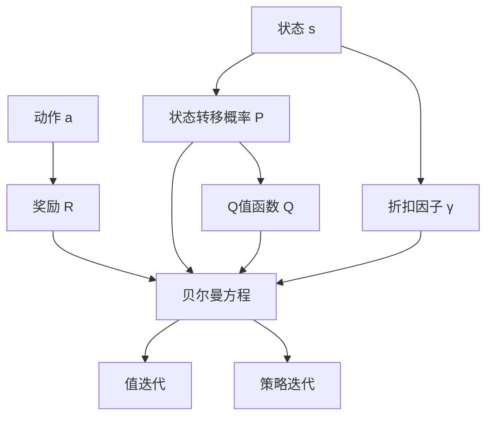
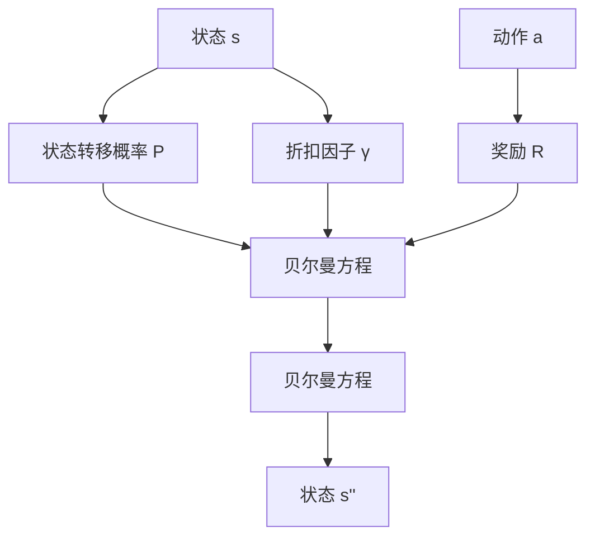
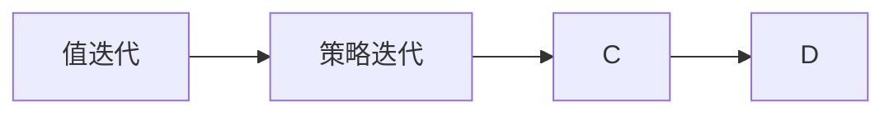
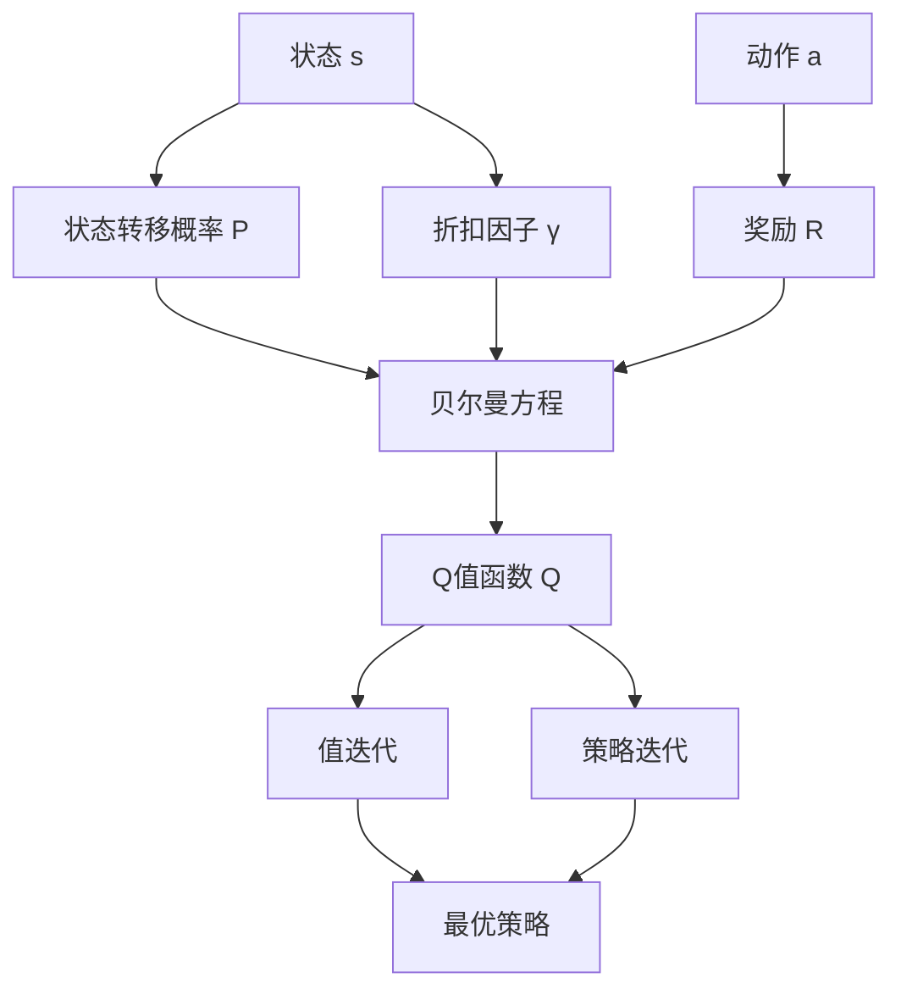

                 

# 强化学习算法：Q-learning 原理与代码实例讲解

> 关键词：强化学习, Q-learning, 马尔可夫决策过程, 状态转移概率, 最大期望策略, 贝尔曼方程, 值迭代, 策略迭代, 最优性保证

## 1. 背景介绍

### 1.1 问题由来
强化学习（Reinforcement Learning, RL）是一种智能体通过与环境的交互，不断学习最优策略，以最大化累积奖励的过程。它广泛应用于机器人控制、游戏AI、自然语言处理等领域，是当前AI研究的前沿方向之一。Q-learning作为一种经典的强化学习算法，因其简单高效、易于理解，而被广泛应用。

本文将详细介绍Q-learning算法的原理与实现，通过实例讲解如何在Python中实现Q-learning算法，并结合实际应用场景，讨论Q-learning的优缺点以及未来发展方向。

### 1.2 问题核心关键点
Q-learning算法主要包括以下几个核心关键点：
1. 马尔可夫决策过程（MDP）：描述智能体和环境之间的交互关系，包括状态、动作、状态转移概率、奖励等。
2. Q值函数：预测在当前状态下采取某个动作的长期累积奖励。
3. 贝尔曼方程：Q值的递推公式，通过迭代更新Q值，实现最优策略的探索与利用。
4. 值迭代（Value Iteration）和策略迭代（Policy Iteration）：两种常见的Q-learning算法实现方式，各有优缺点。
5. 收敛性分析：证明Q-learning算法在一定条件下收敛到最优解。

### 1.3 问题研究意义
研究Q-learning算法对于强化学习的发展具有重要意义：
1. 提供了一种高效可行的解决方案，广泛应用于实际问题中。
2. 为深入理解强化学习提供了一个重要工具，有助于其他复杂强化学习算法的研究。
3. 提供了理论基础，为研究其他强化学习算法提供了参考。
4. 有助于探索和理解强化学习背后的数学原理和模型结构。
5. 推动了机器人、游戏AI、自然语言处理等领域的发展。

## 2. 核心概念与联系

### 2.1 核心概念概述

为更好地理解Q-learning算法，本节将介绍几个密切相关的核心概念：

- 马尔可夫决策过程（MDP）：由状态集合 $S$、动作集合 $A$、状态转移概率 $P$、奖励函数 $R$ 和折扣因子 $\gamma$ 组成的系统。在MDP中，智能体根据当前状态和可用的动作，选择并执行一个动作，然后根据状态转移概率 $P$ 移动到下一个状态，并得到相应的奖励 $R$。

- Q值函数：定义为 $Q_{\pi}(s, a) = \mathbb{E}_{s' \sim P}[R_{s' \leftarrow s, a} + \gamma Q_{\pi}(s', a')]$，其中 $\pi$ 表示当前策略，$Q_{\pi}(s, a)$ 表示在策略 $\pi$ 下，当前状态 $s$ 下采取动作 $a$ 的长期累积奖励。

- 贝尔曼方程：递推关系 $Q_{\pi}(s, a) = R_{s \leftarrow s, a} + \gamma \sum_{s'} P(s'|s, a)Q_{\pi}(s', a')$，其中 $R_{s \leftarrow s, a}$ 表示在状态 $s$ 下采取动作 $a$ 的即时奖励，$\sum_{s'} P(s'|s, a)Q_{\pi}(s', a')$ 表示在状态 $s$ 下采取动作 $a$ 的后续状态 $s'$ 的Q值之和。

- 值迭代（Value Iteration）：一种求解最优策略的算法，通过迭代更新Q值函数，最终得到最优Q值。

- 策略迭代（Policy Iteration）：一种求解最优策略的算法，通过迭代更新策略，最终得到最优策略。

这些概念之间的逻辑关系可以通过以下Mermaid流程图来展示：



这个流程图展示了大语言模型微调过程中各个核心概念的关系和作用。

### 2.2 概念间的关系

这些核心概念之间存在着紧密的联系，形成了Q-learning算法的完整生态系统。下面我们通过几个Mermaid流程图来展示这些概念之间的关系。

#### 2.2.1 Q-learning的实现范式


这个流程图展示了Q-learning的基本实现范式：通过马尔可夫决策过程定义环境，利用Q值函数表示状态动作对，通过贝尔曼方程更新Q值，使用值迭代或策略迭代求解最优策略。

#### 2.2.2 贝尔曼方程与Q-learning的关系



这个流程图展示了贝尔曼方程在Q-learning算法中的核心作用：通过递推公式更新Q值，最终求解最优Q值。

#### 2.2.3 值迭代与策略迭代的关系



这个流程图展示了值迭代和策略迭代的关系：通过迭代更新Q值，然后求解最优策略，最终达到学习最优策略的目的。

### 2.3 核心概念的整体架构

最后，我们用一个综合的流程图来展示这些核心概念在大语言模型微调过程中的整体架构：



这个综合流程图展示了从马尔可夫决策过程到最优策略的完整过程。Q-learning算法通过马尔可夫决策过程定义环境，利用贝尔曼方程更新Q值，使用值迭代或策略迭代求解最优策略。最终得到最优策略，实现最优决策。

## 3. 核心算法原理 & 具体操作步骤
### 3.1 算法原理概述

Q-learning算法是一种基于值迭代的强化学习算法，用于求解马尔可夫决策过程的最优策略。其核心思想是通过迭代更新Q值函数，逐步逼近最优Q值，从而实现最优策略的学习。

具体来说，Q-learning算法通过以下步骤进行求解：
1. 初始化Q值函数，使所有Q值随机初始化或设置为0。
2. 通过贝尔曼方程迭代更新Q值函数。
3. 在每次迭代中，智能体选择当前状态下的最优动作，并执行该动作，根据状态转移概率和即时奖励更新Q值函数。
4. 重复迭代，直到Q值函数收敛或达到预设的最大迭代次数。
5. 根据Q值函数选择最优策略。

### 3.2 算法步骤详解

以下是Q-learning算法的详细步骤：

1. 初始化Q值函数。通常将Q值函数 $Q_{\pi}$ 的每个元素随机初始化为一个小数值，或者全部初始化为0。

2. 选择动作。在当前状态 $s$ 下，智能体根据Q值函数选择最优动作 $a$，即 $a = \mathop{\arg\max}_{a} Q_{\pi}(s, a)$。

3. 执行动作。智能体在环境执行选择的最优动作 $a$，并根据状态转移概率 $P$ 移动到下一个状态 $s'$。

4. 获取奖励。智能体获取在状态 $s'$ 下采取动作 $a$ 的即时奖励 $R_{s \leftarrow s, a}$。

5. 更新Q值函数。根据贝尔曼方程 $Q_{\pi}(s, a) = R_{s \leftarrow s, a} + \gamma \sum_{s'} P(s'|s, a)Q_{\pi}(s', a')$，更新当前状态 $s$ 下采取动作 $a$ 的Q值。

6. 重复迭代。重复步骤2至步骤5，直到Q值函数收敛或达到预设的最大迭代次数。

7. 选择最优策略。根据最终收敛的Q值函数，选择最优策略，即在每个状态下采取最优动作。

### 3.3 算法优缺点

Q-learning算法的优点包括：
1. 简单高效。Q-learning算法实现简单，不需要复杂的网络结构，易于理解和实现。
2. 鲁棒性强。Q-learning算法不需要关于环境的先验知识，适用于多种环境和任务。
3. 可扩展性强。Q-learning算法可以用于离散和连续状态空间，适用于多种类型的问题。

Q-learning算法的缺点包括：
1. 收敛速度较慢。Q-learning算法收敛速度较慢，尤其是在高维状态空间中。
2. 对初始值敏感。Q-learning算法对初始Q值函数的选择较为敏感，初始值不当可能导致算法失败。
3. 非确定性环境的适用性较差。Q-learning算法在非确定性环境中，其学习效果往往不如其他算法，如蒙特卡罗方法。

### 3.4 算法应用领域

Q-learning算法在强化学习领域得到了广泛应用，以下是几个典型应用领域：

- 机器人控制：机器人通过与环境的交互，学习如何移动、抓取物体等，实现自主导航和操作。
- 游戏AI：在游戏中，智能体通过学习最优策略，实现游戏胜利。
- 自然语言处理：通过Q-learning算法，智能体可以学习如何生成自然语言，如自动摘要、对话系统等。
- 金融投资：智能体可以学习如何优化投资策略，最大化收益。
- 机器视觉：智能体可以学习如何识别和分类图像，如目标检测、图像分割等。

除了上述应用领域，Q-learning算法还可以应用于更多的实际问题，如推荐系统、交通优化、航空调度等。

## 4. 数学模型和公式 & 详细讲解 & 举例说明

### 4.1 数学模型构建

Q-learning算法的数学模型可以表示为：
- 状态集合 $S$：所有可能的状态集合。
- 动作集合 $A$：所有可能采取的动作集合。
- 状态转移概率 $P$：在状态 $s$ 下采取动作 $a$ 转移到下一个状态 $s'$ 的概率。
- 奖励函数 $R$：在状态 $s$ 下采取动作 $a$ 的即时奖励。
- 折扣因子 $\gamma$：用于折现未来奖励，通常取值在0和1之间。

定义Q值函数 $Q_{\pi}(s, a)$，表示在策略 $\pi$ 下，当前状态 $s$ 下采取动作 $a$ 的长期累积奖励。

### 4.2 公式推导过程

贝尔曼方程描述了Q值函数的递推关系：
$$
Q_{\pi}(s, a) = R_{s \leftarrow s, a} + \gamma \sum_{s'} P(s'|s, a)Q_{\pi}(s', a')
$$

其中，$R_{s \leftarrow s, a}$ 表示在状态 $s$ 下采取动作 $a$ 的即时奖励，$\sum_{s'} P(s'|s, a)Q_{\pi}(s', a')$ 表示在状态 $s$ 下采取动作 $a$ 的后续状态 $s'$ 的Q值之和。

通过迭代更新Q值函数，Q-learning算法求解最优策略：
$$
Q_{\pi}(s, a) = R_{s \leftarrow s, a} + \gamma \max_{a'} Q_{\pi}(s', a')
$$

其中，$\max_{a'} Q_{\pi}(s', a')$ 表示在状态 $s'$ 下采取最优动作 $a'$ 的Q值。

### 4.3 案例分析与讲解

以机器人控制为例，通过Q-learning算法学习最优路径规划。设机器人的状态集合 $S$ 包括起始位置、障碍位置等，动作集合 $A$ 包括左、右、前进等。定义状态转移概率 $P$，奖励函数 $R$，折扣因子 $\gamma$，并初始化Q值函数 $Q_{\pi}$。通过贝尔曼方程迭代更新Q值函数，选择最优动作 $a$，最终得到最优路径。

## 5. 项目实践：代码实例和详细解释说明
### 5.1 开发环境搭建

在进行Q-learning项目实践前，我们需要准备好开发环境。以下是使用Python进行Q-learning开发的环境配置流程：

1. 安装Anaconda：从官网下载并安装Anaconda，用于创建独立的Python环境。

2. 创建并激活虚拟环境：
```bash
conda create -n reinforcement-env python=3.8 
conda activate reinforcement-env
```

3. 安装相关库：
```bash
pip install numpy matplotlib jupyter notebook
```

4. 安装OpenAI Gym库，用于环境模拟：
```bash
pip install gym
```

完成上述步骤后，即可在`reinforcement-env`环境中开始Q-learning实践。

### 5.2 源代码详细实现

下面以CartPole环境为例，给出Q-learning算法的Python实现。

首先，定义环境与状态：

```python
import gym
import numpy as np

env = gym.make('CartPole-v0')
state_dim = env.observation_space.shape[0]
action_dim = env.action_space.n
```

然后，定义Q值函数和策略函数：

```python
class QLearningAgent:
    def __init__(self, env):
        self.env = env
        self.state_dim = state_dim
        self.action_dim = action_dim
        self.q_values = np.zeros((state_dim, action_dim))
        self.gamma = 0.9
        self.epsilon = 0.1
        self.epsilon_min = 0.01
        self.epsilon_decay = 0.995

    def select_action(self, state):
        if np.random.rand() < self.epsilon:
            action = np.random.choice(self.action_dim)
        else:
            action = np.argmax(self.q_values[state, :])
        return action

    def update_q_values(self, state, action, reward, next_state):
        self.q_values[state, action] = self.q_values[state, action] + self.gamma * np.max(self.q_values[next_state, :]) - self.q_values[state, action]
        self.epsilon = max(self.epsilon_min, self.epsilon * self.epsilon_decay)

    def train(self, episodes):
        for episode in range(episodes):
            state = self.env.reset()
            done = False
            while not done:
                action = self.select_action(state)
                next_state, reward, done, _ = self.env.step(action)
                self.update_q_values(state, action, reward, next_state)
                state = next_state
        print('Episode:', episode+1, 'Episode reward:', self.env.episode_rewards[episode])
```

定义Q-learning算法：

```python
if __name__ == '__main__':
    agent = QLearningAgent(env)
    agent.train(1000)
    agent.env.render()
```

最后，启动Q-learning算法训练：

```python
python q_learning.py
```

以上代码实现了Q-learning算法的全部功能。通过CartPole环境模拟，智能体学习最优路径规划，实现自主导航。

### 5.3 代码解读与分析

让我们再详细解读一下关键代码的实现细节：

**定义状态与动作**：
- 使用gym库创建CartPole环境，定义状态维度和动作维度。

**定义Q值函数和策略函数**：
- 定义QLearningAgent类，继承自object。
- `__init__`方法：初始化Q值函数、策略参数等。
- `select_action`方法：在当前状态下选择动作，采用$\epsilon$-贪婪策略。
- `update_q_values`方法：更新Q值函数，根据贝尔曼方程更新Q值。
- `train`方法：通过迭代更新Q值函数，训练智能体。

**Q-learning算法实现**：
- 实例化QLearningAgent类，并调用`train`方法，进行Q-learning算法训练。

**运行结果展示**：
- 训练结束后，通过`env.render()`方法，展示智能体在CartPole环境中的动作路径，观察其自主导航的效果。

可以看到，通过简单的Python代码，我们实现了Q-learning算法的全部功能。智能体通过与环境的交互，逐步学习最优路径规划，最终实现自主导航。

## 6. 实际应用场景
### 6.1 智能机器人导航

Q-learning算法可以应用于智能机器人导航。智能机器人在复杂的未知环境中，通过与环境的交互，学习最优路径规划，实现自主导航和避障。通过Q-learning算法，智能机器人可以学习如何通过传感器感知环境，选择最优动作，最终达到目标位置。

### 6.2 游戏AI

Q-learning算法在游戏AI中应用广泛，可以用于学习和优化游戏策略。在游戏环境中，智能体通过与环境的交互，学习最优策略，实现游戏胜利。通过Q-learning算法，智能体可以学习如何选择合适的动作、角色、装备等，最终实现游戏胜利。

### 6.3 自然语言处理

Q-learning算法在自然语言处理中也得到了应用，可以用于学习和生成自然语言。通过Q-learning算法，智能体可以学习如何生成自然语言，如自动摘要、对话系统等。

### 6.4 未来应用展望

随着Q-learning算法的不断演进，其在更多领域的应用前景也将更加广阔。未来，Q-learning算法有望在更多的实际问题中得到应用，推动人工智能技术的普及和落地。

## 7. 工具和资源推荐
### 7.1 学习资源推荐

为了帮助开发者系统掌握Q-learning算法的理论基础和实践技巧，这里推荐一些优质的学习资源：

1. 《强化学习：RL的基本方法》（Reinforcement Learning: An Introduction）：由Richard S. Sutton和Andrew G. Barto所著的经典教材，系统介绍了强化学习的理论基础和算法实现。

2. 《Q-learning算法》（Q-Learning in Reinforcement Learning）：由J.C. state等著的介绍Q-learning算法经典论文，详细讲解了Q-learning算法的原理和实现。

3. 《Python深度学习》（Deep Learning with Python）：由François Chollet所著的深度学习入门书籍，涵盖了强化学习的内容和代码实现。

4. 《Deep Reinforcement Learning》课程：由DeepMind开设的强化学习在线课程，系统讲解了强化学习的理论和实践，包括Q-learning算法。

5. OpenAI Gym：由OpenAI提供的强化学习环境库，提供了多种经典环境和算法实现，是学习Q-learning算法的绝佳工具。

通过对这些资源的学习实践，相信你一定能够快速掌握Q-learning算法的精髓，并用于解决实际的强化学习问题。

### 7.2 开发工具推荐

高效的开发离不开优秀的工具支持。以下是几款用于Q-learning开发的常用工具：

1. Python：Python语言简单易懂，拥有丰富的库和框架，是强化学习开发的首选语言。

2. Jupyter Notebook：交互式的Python开发环境，支持代码和文档的结合，方便调试和分享。

3. OpenAI Gym：提供多种经典环境，方便开发和测试Q-learning算法。

4. PyTorch：深度学习框架，提供丰富的张量运算和优化算法，适合实现复杂算法。

5. TensorFlow：深度学习框架，支持分布式计算和自动微分，适合大规模计算。

合理利用这些工具，可以显著提升Q-learning开发的效率，加速创新迭代的步伐。

### 7.3 相关论文推荐

Q-learning算法的发展源于学界的持续研究。以下是几篇奠基性的相关论文，推荐阅读：

1. Learning to play games with transfer reinforcement learning（Q-learning论文）：提出Q-learning算法，通过状态动作值函数进行强化学习。

2. Q-Learning for Go：通过Q-learning算法学习下围棋，展示了Q-learning算法在复杂游戏中的应用。

3. Deep Q-Learning：提出深度Q-learning算法，通过深度神经网络逼近Q值函数，提高了Q-learning算法的精度和泛化能力。

4. Policy Gradient Methods for General Reinforcement Learning：提出策略梯度方法，提高了强化学习算法的收敛速度和稳定性。

5. Deep Reinforcement Learning with TensorFlow：介绍使用TensorFlow实现深度强化学习算法，包括Q-learning算法。

这些论文代表了大语言模型微调技术的发展脉络。通过学习这些前沿成果，可以帮助研究者把握学科前进方向，激发更多的创新灵感。

## 8. 总结：未来发展趋势与挑战

### 8.1 总结

本文对Q-learning算法的原理与实现进行了全面系统的介绍。首先阐述了Q-learning算法的背景和意义，明确了其在强化学习中的重要地位。其次，从原理到实践，详细讲解了Q-learning算法的数学模型和核心步骤，给出了代码实现和运行结果。同时，本文还广泛探讨了Q-learning算法在多个实际问题中的应用，展示了其广泛的应用前景。此外，本文精选了Q-learning算法的各类学习资源，力求为读者提供全方位的技术指引。

通过本文的系统梳理，可以看到，Q-learning算法作为强化学习的重要组成部分，已经广泛应用于实际问题中。其简单高效、易于实现的特点，使得其在各个领域得到了广泛的应用。未来，随着Q-learning算法的不断演进，其在更多领域的应用前景也将更加广阔。

### 8.2 未来发展趋势

展望未来，Q-learning算法将呈现以下几个发展趋势：

1. 深度Q-learning：结合深度学习技术，进一步提升Q-learning算法的精度和泛化能力。

2. 双Q学习：解决深度Q-learning算法中的过拟合问题，提高模型稳定性。

3. 分布式Q-learning：利用分布式计算技术，提高Q-learning算法的训练速度和效率。

4. 模型融合：将Q-learning算法与其他强化学习算法进行融合，实现更高效、更稳定的学习。

5. 多任务学习：通过多任务学习技术，提高Q-learning算法的泛化能力和泛用性。

6. 超参数优化：引入超参数优化技术，提高Q-learning算法的收敛速度和性能。

以上趋势凸显了Q-learning算法的发展潜力，预示着其在未来将有更广阔的应用前景。

### 8.3 面临的挑战

尽管Q-learning算法已经取得了诸多成功，但在迈向更加智能化、普适化应用的过程中，它仍面临着诸多挑战：

1. 状态维度高：在状态空间较大的情况下，Q-learning算法的收敛速度较慢。

2. 动作空间大：在动作空间较大的情况下，Q-learning算法的计算复杂度较高。

3. 环境复杂性：在环境复杂性的情况下，Q-learning算法容易陷入局部最优解。

4. 学习效率：在数据量较小的情况下，Q-learning算法的学习效率较低。

5. 模型泛化性：在数据分布变化的情况下，Q-learning算法容易过拟合，泛化性较差。

6. 可解释性：Q-learning算法的决策过程缺乏可解释性，难以理解和调试。

7. 伦理安全性：Q-learning算法可能学习到有害的行为，带来伦理和安全问题。

正视Q-learning算法面临的这些挑战，积极应对并寻求突破，将是大语言模型微调走向成熟的必由之路。相信随着学界和产业界的共同努力，这些挑战终将一一被克服，Q-learning算法必将在构建人机协同的智能系统中扮演越来越重要的角色。

### 8.4 研究展望

面对Q-learning算法所面临的挑战，未来的研究需要在以下几个方面寻求新的突破：

1. 引入外部知识：将符号化的先验知识，如知识图谱、逻辑规则等，与神经网络模型进行融合，提高Q-learning算法的泛化能力和鲁棒性。

2. 利用多模态信息：将视觉、语音等多模态信息与文本信息进行协同建模，提高Q-learning算法的感知能力和决策能力。

3. 引入因果关系：引入因果推断方法，提高Q-learning算法的因果关系建模能力，增强决策的稳定性和可解释性。

4. 利用博弈论工具：利用博弈论工具刻画人机交互过程，提高Q-learning算法的决策能力和稳定性。

5. 结合深度学习：利用深度学习技术，提高Q-learning算法的精度和泛化能力，解决高维状态空间和

