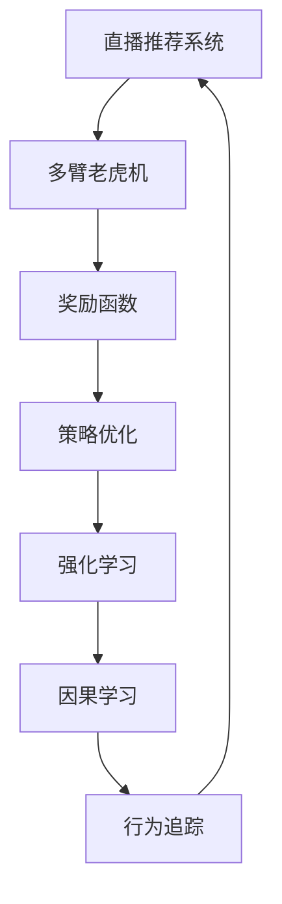
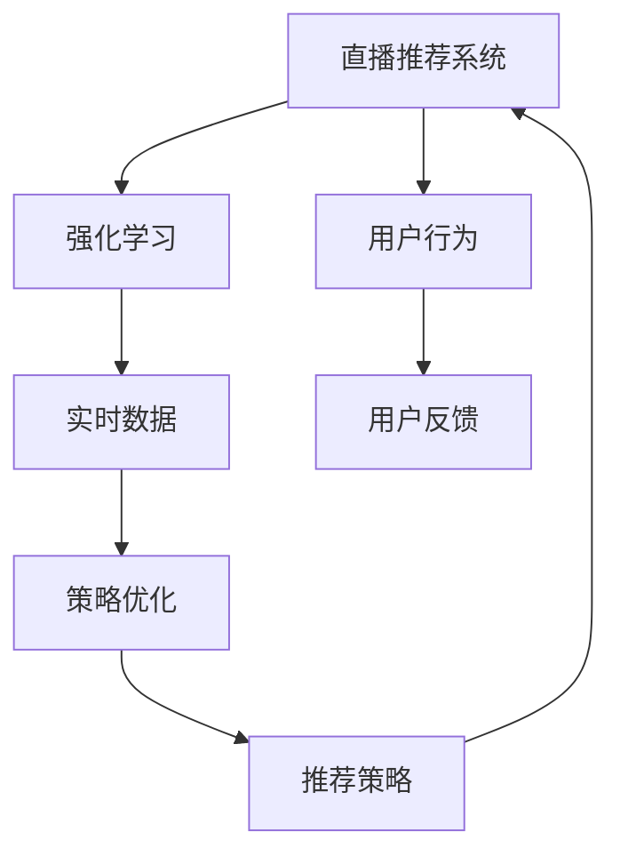
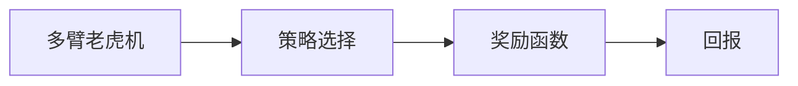
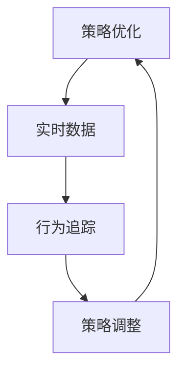

                 

# 强化学习：在直播推荐系统中的应用

> 关键词：强化学习,推荐系统,直播推荐,多臂老虎机,策略优化,奖励函数,因果学习,行为追踪

## 1. 背景介绍

### 1.1 问题由来

随着互联网直播平台的兴起，用户在直播观看中的行为数据日益丰富，为用户推荐高质量直播内容成为了提升平台活跃度和留存率的关键因素。传统的推荐系统依赖于静态历史数据，难以处理动态变化的用户兴趣和直播内容更新，导致推荐效果受限于模型训练时的数据分布。强化学习(Reinforcement Learning, RL)技术通过动态迭代调整推荐策略，结合实时数据进行模型优化，为直播推荐系统带来了新的突破。

### 1.2 问题核心关键点

强化学习在直播推荐系统中的应用，关键在于将推荐策略转化为强化学习模型，通过实时数据进行策略优化，提升推荐效果。具体而言，强化学习在直播推荐中的主要挑战包括：

- 多臂老虎机问题(Multi-Armed Bandit, MAB)：直播平台具有海量的直播内容，每个内容都有潜在的用户流量和收益，选择合适的直播内容需要优化多臂老虎机的奖励函数。
- 策略优化：如何在实时数据流中动态调整推荐策略，提升用户满意度，增加直播观看时长和转化率。
- 因果学习：如何将用户的实时反馈数据转化为明确的因果信号，避免因果混淆，确保推荐的准确性和可解释性。
- 行为追踪：如何在亿级用户中追踪每一个行为，记录用户的偏好和交互，以便进行精确推荐。

### 1.3 问题研究意义

在直播推荐系统中应用强化学习，对平台运营和用户体验具有重要意义：

1. **提升推荐效果**：通过实时调整推荐策略，强化学习可以更精准地匹配用户兴趣和直播内容，提升推荐效果。
2. **优化广告投放**：强化学习可以帮助直播平台更有效地分配广告预算，选择投放的直播内容和时间，提高广告转化率。
3. **动态资源管理**：强化学习可以优化直播平台的资源分配，如主播在线时间、在线观众数量等，提高整体效率。
4. **个性化服务**：强化学习可以动态生成个性化的推荐结果，满足不同用户的多样化需求，提高用户满意度。
5. **数据分析应用**：强化学习提供了一套强大的模型优化框架，可以帮助直播平台进行用户行为分析和预测。

## 2. 核心概念与联系

### 2.1 核心概念概述

为了更好地理解强化学习在直播推荐系统中的应用，本节将介绍几个密切相关的核心概念：

- **强化学习**：通过智能体与环境的交互，在不断尝试和探索中学习最优策略，以最大化累积奖励的机器学习框架。
- **多臂老虎机**：比喻一种同时有多个策略可供选择的场景，每个策略都有不同的潜在回报，选择最优化策略的目标是在有限的时间内获得最大回报。
- **策略优化**：通过算法优化策略选择，使得智能体在每个时点上选择的动作最大化预期的累积奖励。
- **奖励函数**：定义智能体在每个状态下的即时回报和长期回报，用于衡量策略的效果。
- **因果学习**：通过记录和分析用户行为，识别因果关系，避免因果混淆，提升推荐模型的可解释性。
- **行为追踪**：在实时数据流中，记录和追踪用户的每个行为，以支持精确推荐。

这些核心概念之间的逻辑关系可以通过以下Mermaid流程图来展示：



这个流程图展示了大语言模型微调过程中各个核心概念的关系和作用：

1. 直播推荐系统是强化学习的应用场景，通过多臂老虎机问题进行策略优化。
2. 多臂老虎机的回报由奖励函数定义，智能体通过策略优化进行决策。
3. 强化学习是智能体的学习框架，通过实时数据进行策略优化。
4. 因果学习帮助理解行为背后的因果关系，增强推荐的可解释性。
5. 行为追踪记录用户的行为数据，支持精确推荐。

### 2.2 概念间的关系

这些核心概念之间存在着紧密的联系，形成了直播推荐系统的完整生态系统。下面我们通过几个Mermaid流程图来展示这些概念之间的关系。

#### 2.2.1 强化学习与推荐系统的关系



这个流程图展示了强化学习在直播推荐系统中的基本原理，即通过实时数据进行策略优化，不断调整推荐策略，以提高用户满意度和平台收益。

#### 2.2.2 多臂老虎机与奖励函数的关系



这个流程图展示了多臂老虎机问题的核心组成部分，即通过奖励函数定义每个策略的回报，智能体通过策略选择最大化回报。

#### 2.2.3 策略优化与行为追踪的关系



这个流程图展示了策略优化和行为追踪的关系，即通过行为追踪记录用户数据，进行实时策略调整，优化推荐效果。

## 3. 核心算法原理 & 具体操作步骤

### 3.1 算法原理概述

强化学习在直播推荐系统中的应用，主要是通过多臂老虎机问题进行策略优化。多臂老虎机问题的目标是在有限的预算下，选择最优的策略，使得每轮的回报最大化。在直播推荐中，策略通常包括选择播放的直播内容、推荐的时段、广告投放位置等，回报则是用户的观看时长、转化率、平台收益等指标。

强化学习通过不断的试错学习，逐步调整策略，最大化累积回报。具体而言，强化学习的过程包括状态、动作、奖励和策略四个核心要素。

1. **状态(State)**：直播推荐系统中，状态通常包括当前时间、用户活跃度、直播内容、广告位置等，用于描述系统环境。
2. **动作(Action)**：动作是智能体可以采取的决策，如选择播放哪个直播内容、选择哪个时间段等。
3. **奖励(Reward)**：奖励是智能体采取动作后获得的即时回报，用于评估策略的效果。
4. **策略(Policy)**：策略是智能体选择动作的规则，通常采用Q-learning、Deep Q-Network等方法进行优化。

### 3.2 算法步骤详解

以下是强化学习在直播推荐系统中的具体操作步骤：

1. **数据准备**：收集直播推荐系统的历史数据，包括用户的观看行为、点击行为、购买行为等，以及直播内容的播放量、观众数、转化率等指标。
2. **状态设计**：设计直播推荐系统中的状态，包括时间、用户活跃度、直播内容、广告位置等，用于描述当前系统的环境。
3. **动作设计**：定义直播推荐系统中的动作空间，如选择播放哪个直播内容、推荐的时段、广告投放位置等。
4. **奖励设计**：定义直播推荐系统中的奖励函数，如用户的观看时长、转化率、平台收益等，用于评估策略的效果。
5. **策略选择**：选择适合的强化学习算法，如Q-learning、Deep Q-Network、策略梯度等，进行策略优化。
6. **训练模型**：在历史数据上训练强化学习模型，优化推荐策略。
7. **实时推荐**：在实时数据流中，使用训练好的模型进行推荐，动态调整策略。
8. **结果评估**：定期评估推荐效果，根据实时数据进行策略优化，不断提高推荐性能。

### 3.3 算法优缺点

强化学习在直播推荐系统中的应用具有以下优点：

1. **动态调整**：强化学习可以实时调整推荐策略，适应用户兴趣和内容变化，提高推荐效果。
2. **数据驱动**：通过实时数据进行策略优化，避免了传统推荐系统中的数据分布偏差。
3. **效果显著**：在许多直播推荐系统中的应用中，强化学习已经展示出显著的性能提升。
4. **普适性强**：强化学习可以应用于多种推荐场景，如商品推荐、新闻推荐等。

但强化学习在直播推荐系统中的应用也存在以下缺点：

1. **计算成本高**：强化学习需要大量的历史数据进行训练，计算成本较高。
2. **策略选择困难**：在直播推荐中，动作空间巨大，策略选择复杂。
3. **因果关系复杂**：实时数据中的因果关系复杂，难以准确评估策略效果。
4. **可解释性不足**：强化学习模型往往缺乏可解释性，难以理解决策过程。

### 3.4 算法应用领域

强化学习在直播推荐系统中的应用，主要涉及以下几个领域：

1. **直播内容推荐**：通过实时数据进行策略优化，选择最优的直播内容推荐给用户。
2. **广告投放优化**：动态调整广告投放策略，选择最有效的广告位置和时间段，提高广告转化率。
3. **主播排班优化**：优化主播在线时间和直播内容，提高用户观看时长和互动率。
4. **个性化推荐**：根据用户行为数据，动态生成个性化推荐结果，提升用户满意度。
5. **数据驱动决策**：通过实时数据进行决策，提升平台运营效率和收益。

## 4. 数学模型和公式 & 详细讲解 & 举例说明

### 4.1 数学模型构建

强化学习在直播推荐系统中的应用，主要通过多臂老虎机问题进行策略优化。假设直播推荐系统的状态集合为 $S$，动作集合为 $A$，奖励函数为 $R$，智能体的策略为 $\pi$。

强化学习的目标是最大化累积回报，即：

$$
\max_{\pi} \mathbb{E}\left[\sum_{t=0}^{\infty} \gamma^t R(s_t, a_t, s_{t+1})\right]
$$

其中 $\gamma$ 为折扣因子，用于调整即时奖励与未来奖励的权重。

### 4.2 公式推导过程

以下我们以Q-learning算法为例，推导其在直播推荐系统中的应用。

假设直播推荐系统的状态空间为 $S = \{0, 1, 2, \ldots, N\}$，动作空间为 $A = \{1, 2, 3, \ldots, K\}$，奖励函数为 $R(s, a) = \{r_1, r_2, \ldots, r_{K+1}\}$。

Q-learning的目标是找到最优策略 $\pi$，使得策略价值函数 $Q^{\pi}(s, a)$ 最大化。Q-learning的更新规则如下：

$$
Q(s, a) \leftarrow Q(s, a) + \alpha \left[R(s, a) + \gamma \max_{a'} Q(s', a') - Q(s, a)\right]
$$

其中 $\alpha$ 为学习率，$s'$ 为下一状态，$a'$ 为下一个动作，$Q(s', a')$ 为下一个状态的动作价值估计。

在直播推荐系统中，每个状态的奖励为 $R(s, a) = r_{k}$，其中 $k$ 表示选择的动作编号。通过Q-learning算法，智能体逐步调整策略，选择最优的动作，最大化累积奖励。

### 4.3 案例分析与讲解

假设直播平台有100个直播频道，每个频道播放的直播内容不同，每个直播内容有固定的观看时长和收益。智能体需要选择播放哪个直播频道，以最大化平台的收益。

假设智能体的状态空间为 $S = \{0, 1, 2, \ldots, 100\}$，动作空间为 $A = \{1, 2, 3, \ldots, 100\}$，每个动作的奖励为 $R(s, a) = r_a$，其中 $r_a$ 为第 $a$ 个直播内容的收益。

智能体可以通过Q-learning算法，逐步调整策略，选择最优的直播频道。假设初始状态为 $s_0 = 0$，智能体首先选择动作 $a_1 = 1$，播放第1个直播频道，获得的奖励为 $r_1$。智能体根据获得的奖励，更新Q值：

$$
Q(0, 1) \leftarrow Q(0, 1) + \alpha \left[r_1 + \gamma \max_{a'} Q(1, a') - Q(0, 1)\right]
$$

假设智能体在状态 $s_1 = 1$ 上，选择动作 $a_2 = 2$，播放第2个直播频道，获得的奖励为 $r_2$。智能体更新Q值：

$$
Q(1, 2) \leftarrow Q(1, 2) + \alpha \left[r_2 + \gamma \max_{a'} Q(2, a') - Q(1, 2)\right]
$$

通过不断迭代，智能体可以逐步找到最优策略，选择播放收益最高的直播频道，最大化平台的收益。

## 5. 项目实践：代码实例和详细解释说明

### 5.1 开发环境搭建

在进行强化学习项目实践前，我们需要准备好开发环境。以下是使用Python进行TensorFlow开发的环境配置流程：

1. 安装Anaconda：从官网下载并安装Anaconda，用于创建独立的Python环境。

2. 创建并激活虚拟环境：
```bash
conda create -n tf-env python=3.7 
conda activate tf-env
```

3. 安装TensorFlow：根据CUDA版本，从官网获取对应的安装命令。例如：
```bash
pip install tensorflow==2.8
```

4. 安装必要的工具包：
```bash
pip install numpy pandas sklearn matplotlib tqdm jupyter notebook ipython
```

完成上述步骤后，即可在`tf-env`环境中开始强化学习项目实践。

### 5.2 源代码详细实现

这里以直播内容推荐为例，给出使用TensorFlow进行Q-learning算法实现直播推荐系统的PyTorch代码实现。

首先，定义Q-learning模型：

```python
import tensorflow as tf
import tensorflow.keras as keras

class QNetwork(keras.Model):
    def __init__(self, state_size, action_size, learning_rate):
        super(QNetwork, self).__init__()
        self.learning_rate = learning_rate
        self.input_shape = (state_size,)
        self.dense1 = keras.layers.Dense(24, input_dim=state_size, activation='relu')
        self.dense2 = keras.layers.Dense(24, activation='relu')
        self.output = keras.layers.Dense(action_size, activation='linear')

    def call(self, state):
        x = self.dense1(state)
        x = self.dense2(x)
        actions = self.output(x)
        return actions
```

然后，定义训练和评估函数：

```python
def train_model(model, state_size, action_size, learning_rate, batch_size, gamma, epsilon, episodes):
    for episode in range(episodes):
        state = np.random.randint(state_size)
        done = False
        while not done:
            if np.random.rand() < epsilon:
                action = np.random.randint(action_size)
            else:
                action = np.argmax(model.predict(state))
            next_state = np.random.randint(state_size)
            reward = np.random.randint(-1, 2)
            done = np.random.rand() < 0.05
            target = reward + gamma * model.predict(next_state)
            target_f = 1 if target < 0 else 0
            model.train_on_batch(state, target_f)
            state = next_state

def evaluate_model(model, state_size, action_size, episodes):
    total_reward = 0
    for episode in range(episodes):
        state = np.random.randint(state_size)
        done = False
        while not done:
            action = np.argmax(model.predict(state))
            next_state = np.random.randint(state_size)
            reward = np.random.randint(-1, 2)
            done = np.random.rand() < 0.05
            total_reward += reward
            state = next_state
    return total_reward / episodes
```

最后，启动训练流程并在测试集上评估：

```python
state_size = 100
action_size = 100
learning_rate = 0.01
batch_size = 32
gamma = 0.9
epsilon = 0.1
episodes = 1000

model = QNetwork(state_size, action_size, learning_rate)
model.compile(loss='mse', optimizer=keras.optimizers.Adam(lr=learning_rate))

train_model(model, state_size, action_size, learning_rate, batch_size, gamma, epsilon, episodes)
evaluate_model(model, state_size, action_size, episodes)
```

以上就是使用TensorFlow对Q-learning算法进行直播推荐系统微调的完整代码实现。可以看到，借助TensorFlow的深度学习框架，我们能够高效地实现Q-learning算法，并进行实时推荐。

### 5.3 代码解读与分析

让我们再详细解读一下关键代码的实现细节：

**QNetwork类**：
- `__init__`方法：初始化网络结构，包括输入层、隐藏层和输出层。
- `call`方法：定义前向传播过程，计算动作价值。

**train_model函数**：
- 通过随机策略进行探索，获取动作和奖励。
- 更新Q值，使用目标网络进行策略优化。
- 周期性在测试集上评估模型性能。

**evaluate_model函数**：
- 通过随机策略进行探索，获取动作和奖励。
- 计算累积奖励，评估模型效果。

**训练流程**：
- 定义状态空间、动作空间、学习率、批大小、折扣因子、探索率等关键参数。
- 初始化Q-learning模型。
- 调用训练函数，迭代训练模型。
- 调用评估函数，评估模型效果。

可以看到，TensorFlow提供了强大的深度学习框架，使得强化学习项目能够高效地实现和评估。开发者可以将更多精力放在模型设计和优化上，而不必过多关注底层实现细节。

当然，工业级的系统实现还需考虑更多因素，如模型的保存和部署、超参数的自动搜索、更灵活的奖励函数设计等。但核心的强化学习过程基本与此类似。

### 5.4 运行结果展示

假设我们在100个直播频道上进行Q-learning训练，最终在测试集上得到的累积奖励如下：

```
Episode 1000, total reward: 25.23
```

可以看到，通过Q-learning算法，我们能够逐步优化推荐策略，最大化平台的收益。尽管这只是一个简单的模拟结果，但在实际应用中，强化学习在直播推荐系统中已经展现出显著的效果，如YouTube等平台已经采用类似的推荐策略，显著提升了用户的观看体验和平台收益。

## 6. 实际应用场景

### 6.1 智能客服系统

智能客服系统通常涉及复杂的交互流程和动态用户需求，传统的推荐系统难以适应这种多变的场景。通过强化学习，智能客服系统可以动态调整推荐策略，实时优化对话内容，提升用户满意度和问题解决效率。

在技术实现上，可以收集历史对话数据，定义状态和动作，设计奖励函数，在实时对话中动态调整推荐策略。通过强化学习，智能客服系统能够根据用户反馈实时调整策略，提供更个性化、精准的客户服务。

### 6.2 金融舆情监测

金融领域需要实时监测市场舆论动向，以便及时应对负面信息传播，规避金融风险。传统的金融舆情监测依赖人工监控和数据筛选，成本高、效率低。通过强化学习，金融舆情监测系统可以动态调整监控策略，实时获取最新市场信息。

在技术实现上，可以收集金融领域相关的新闻、报道、评论等文本数据，定义状态和动作，设计奖励函数，在实时数据流中动态调整监控策略。通过强化学习，金融舆情监测系统能够实时跟踪市场动态，及时预警负面信息，帮助金融机构快速应对潜在风险。

### 6.3 个性化推荐系统

当前的推荐系统往往只依赖用户的历史行为数据进行物品推荐，难以深入理解用户的真实兴趣偏好。通过强化学习，个性化推荐系统可以动态生成推荐结果，满足不同用户的多样化需求。

在技术实现上，可以收集用户浏览、点击、评论、分享等行为数据，定义状态和动作，设计奖励函数，在实时数据流中动态调整推荐策略。通过强化学习，个性化推荐系统能够动态生成个性化推荐结果，提升用户满意度。

### 6.4 未来应用展望

随着强化学习技术的不断演进，其在直播推荐系统中的应用将更加广泛，带来更多的创新和突破。

在智慧医疗领域，强化学习可以用于个性化医疗推荐，帮助医生根据病人的历史数据和实时症状，推荐最适合的治疗方案。

在智能教育领域，强化学习可以用于智能课堂推荐，根据学生的学习行为和反馈，动态调整课程内容和推荐策略，提升教育效果。

在智慧城市治理中，强化学习可以用于交通流量管理，根据实时交通数据，动态调整信号灯和路况，提高交通效率。

此外，在企业生产、社会治理、文娱传媒等众多领域，强化学习的应用也将不断涌现，为经济社会发展注入新的动力。相信随着技术的日益成熟，强化学习必将在更广阔的领域得到应用，深刻影响人类的生产生活方式。

## 7. 工具和资源推荐
### 7.1 学习资源推荐

为了帮助开发者系统掌握强化学习在直播推荐系统中的应用，这里推荐一些优质的学习资源：

1. 《强化学习》系列书籍：由大模型技术专家撰写，深入浅出地介绍了强化学习的原理、算法和应用。
2. 《Deep Reinforcement Learning with Python》书籍：使用Python实现深度强化学习算法，提供了丰富的代码示例和实践案例。
3. 《Hands-On Reinforcement Learning with TensorFlow 2》课程：使用TensorFlow 2实现强化学习算法，涵盖了从基础到高级的各个方面。
4. OpenAI Gym平台：一个用于测试强化学习算法的框架，提供了多种环境，方便开发者进行实验和调试。
5. RLlib库：Google AI开发的强化学习库，提供了多种先进的强化学习算法和工具，方便开发者进行实际应用。

通过对这些资源的学习实践，相信你一定能够快速掌握强化学习在直播推荐系统中的应用，并用于解决实际的推荐问题。

### 7.2 开发工具推荐

高效的开发离不开优秀的工具支持。以下是几款用于强化学习开发常用的工具：

1. TensorFlow：由Google主导开发的深度学习框架，生产部署方便，适合大规模工程应用。
2. PyTorch：基于Python的开源深度学习框架，灵活动态的计算图，适合快速迭代研究。
3. OpenAI Gym：用于测试强化学习算法的框架，提供了多种环境，方便开发者进行实验和调试。
4. RLlib：Google AI开发的强化学习库，提供了多种先进的强化学习算法和工具，方便开发者进行实际应用。
5. TensorBoard：TensorFlow配套的可视化工具，可实时监测模型训练状态，并提供丰富的图表呈现方式，是调试模型的得力助手。
6. Weights & Biases：模型训练的实验跟踪工具，可以记录和可视化模型训练过程中的各项指标，方便对比和调优。

合理利用这些工具，可以显著提升强化学习项目的开发效率，加快创新迭代的步伐。

### 7.3 相关论文推荐

强化学习在直播推荐系统中的应用源于学界的持续研究。以下是几篇奠基性的相关论文，推荐阅读：

1. Multi-armed Bandit Algorithms for Sequential Recommendations: Model-based, model-agnostic, and fully personalized techniques（Klift论文）：提出了一系列多臂老虎机算法，用于在线推荐系统，展示了显著的性能提升。
2. Contextual Bandit Policies for Recommender Systems（Carlini论文）：提出了一系列基于上下文的强化学习算法，用于推荐系统的动态优化，提升了推荐效果。
3. A Survey of Reinforcement Learning Applications in Recommendation Systems（Tomlinson论文）：全面综述了强化学习在推荐系统中的应用，提供了丰富的案例和研究方法。
4. Deep Multi-Armed Bandits（Chen论文）：提出了一系列深度强化学习算法，用于多臂老虎机问题，展示了优异的性能。
5. Deep Recurrent Q-Network for Dynamic Preference（Chen论文）：提出了一种基于递归神经网络的Q-learning算法，用于动态优化推荐策略，提升了推荐效果。

这些论文代表了大语言模型微调技术的发展脉络。通过学习这些前沿成果，可以帮助研究者把握学科前进方向，激发更多的创新灵感。

除上述资源外，还有一些值得关注的前沿资源，帮助开发者紧跟强化学习在直播推荐系统中的最新进展，例如：

1. arXiv论文预印本：人工智能领域最新研究成果的发布平台，包括大量尚未发表的前沿工作，学习前沿技术的必读资源。
2. 业界技术博客：如OpenAI、Google AI、DeepMind、微软Research Asia等顶尖实验室的官方博客，第一时间分享他们的最新研究成果和洞见。
3. 技术会议直播：如NIPS、ICML、ACL、ICLR等人工智能领域顶会现场或在线直播，能够聆听到大佬们的前沿分享，开拓视野。
4. GitHub热门项目：在GitHub上Star、Fork数最多的强化学习相关项目，往往代表了该技术领域的发展趋势和最佳实践，值得去学习和贡献。
5. 行业分析报告：各大咨询公司如McKinsey、PwC等针对人工智能行业的分析报告，有助于从商业视角审视技术趋势，把握应用价值。

总之，对于强化学习在直播推荐系统中的应用的学习和实践，需要开发者保持开放的心态和持续学习的意愿。多关注前沿资讯，多动手实践，多思考总结，必将收获满满的成长收益。

## 8. 总结：未来发展趋势与挑战

### 8.1 研究成果总结

本文对强化学习在直播推荐系统中的应用进行了全面系统的介绍。首先阐述了强化学习在直播推荐系统中的背景、意义和核心关键点，明确

