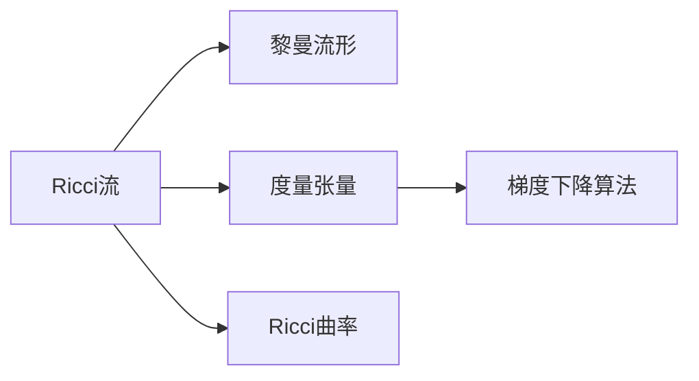
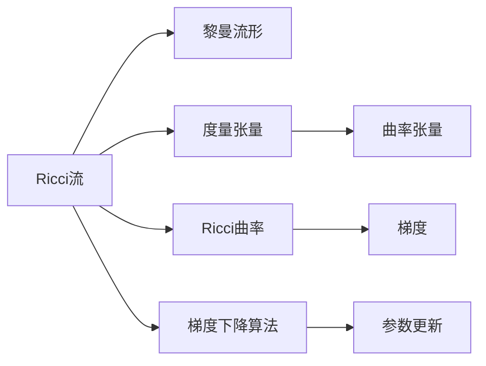

                 

# 微积分中的Ricci流

## 1. 背景介绍

### 1.1 问题由来
Ricci流是一种广泛用于几何分析中的偏微分方程，由Ricci首先提出并加以研究。Ricci流的基本思想是通过改变Riemann流形的曲率来驱动其几何演化。在数学物理、几何分析、计算机视觉等领域，Ricci流都有广泛的应用。本文将系统介绍Ricci流的数学原理和核心算法，并结合具体应用场景加以阐述。

### 1.2 问题核心关键点
Ricci流的核心在于其偏微分方程的形式和几何意义。基本方程为：
$$ \frac{\partial g_{ij}}{\partial t} = -2R_{ij} $$
其中 $g_{ij}$ 为流形上的黎曼度量， $R_{ij}$ 为曲率张量。Ricci流方程描述了度量张量随时间的演化，能够通过调整度量来适应几何变化。

Ricci流方程的几何意义是：通过调整流形上的度量张量，使得Ricci曲率 $Ric = g^{ij}R_{ij}$ 逐渐趋于零，从而使得流形趋近于一个更简单的、更规则的几何形态。这一过程可以通过梯度下降算法实现，即在每个时刻选择负的Ricci曲率方向作为梯度，进行方向调整。

### 1.3 问题研究意义
Ricci流在数学和应用领域都具有重要的意义。它在以下几个方面起到了关键作用：

- 数学研究：Ricci流是Ricci流形理论的核心工具，广泛应用于流形几何和拓扑的研究。
- 几何分析：通过解Ricci流方程，可以研究流形上的各种几何结构，如Kahler度量、Ricci平坦度量等。
- 图像处理：Ricci流在图像分割、边缘检测等计算机视觉问题中有广泛应用，能够有效地减少噪声和细节。
- 生物物理学：Ricci流在生物物理学中也有重要应用，如在分子动力学模拟中用于蛋白质折叠和变形的研究。

## 2. 核心概念与联系

### 2.1 核心概念概述

- Ricci流：一种偏微分方程，描述黎曼流形的几何演化。
- 黎曼流形：一个局部欧氏化的光滑流形，度量张量定义在流形上。
- 度量张量：流形上的第二阶张量，定义了流形的几何结构。
- Ricci曲率：流形的曲率张量迹线，描述流形的弯曲程度。
- 梯度下降算法：一种优化算法，通过迭代调整参数使得目标函数最小化。

### 2.2 概念间的关系

以下通过一个简化的Mermaid流程图展示这些核心概念之间的联系：



这个流程图展示了Ricci流与黎曼流形、度量张量和Ricci曲率之间的关系，以及梯度下降算法在求解Ricci流方程中的作用。

### 2.3 核心概念的整体架构

整个Ricci流的架构可以用以下综合的Mermaid流程图来展示：



这个综合流程图展示了Ricci流的基本架构，包括黎曼流形、度量张量、Ricci曲率和梯度下降算法之间的关系，以及Ricci流方程的具体形式。

## 3. 核心算法原理 & 具体操作步骤
### 3.1 算法原理概述
Ricci流的数学原理基于度量张量的演化方程，通过调整度量张量来驱动流形几何演化。其核心方程为：
$$ \frac{\partial g_{ij}}{\partial t} = -2R_{ij} $$
其中 $g_{ij}$ 为度量张量， $R_{ij}$ 为曲率张量。

该方程描述了度量张量随时间的演化，即在每个时刻，度量张量沿着负的Ricci曲率梯度方向更新。这一过程可通过梯度下降算法实现，即在每个时刻选择负的Ricci曲率方向作为梯度，进行方向调整。

### 3.2 算法步骤详解
Ricci流的求解过程大致可分为以下几个步骤：

1. **初始化**：给定一个黎曼流形，定义其度量张量 $g_{ij}(0)$。
2. **求解Ricci曲率**：通过求解Ricci曲率方程 $R_{ij} = g^{kl}R_{ikjl}$ 计算当前时刻的Ricci曲率。
3. **计算梯度**：根据度量张量和Ricci曲率计算梯度 $g_{ij}^t = g_{ij} - 2R_{ij}$。
4. **更新度量张量**：通过梯度下降算法，更新度量张量 $g_{ij}^{t+\Delta t} = g_{ij}^t - \eta g_{ij}^t$，其中 $\eta$ 为学习率。
5. **迭代计算**：重复步骤2至4，直至满足收敛条件或达到预设的时间步数。

### 3.3 算法优缺点
Ricci流算法具有以下优点：

- 几何意义明确：Ricci流能够通过改变度量张量来驱动流形几何演化，具有明确的几何意义。
- 普适性强：适用于各种类型的黎曼流形，能够处理复杂几何结构。
- 数值稳定：通过梯度下降算法求解，数值稳定性较好。

其缺点主要包括：

- 收敛缓慢：Ricci流方程收敛速度较慢，需要较长的计算时间。
- 初始值敏感：初始值的选择对Ricci流结果有较大影响，需要进行多次实验。
- 高维度问题：在三维以上流形上求解Ricci流，存在数值计算困难。

### 3.4 算法应用领域

Ricci流在以下几个领域有着广泛的应用：

- 流形几何研究：通过求解Ricci流，研究流形上的几何结构和拓扑性质。
- 图像处理：应用于图像分割、边缘检测、图像恢复等计算机视觉任务。
- 物理模拟：用于研究分子动力学中的蛋白质折叠和变形等问题。
- 医学图像分析：应用于脑结构和病变检测，帮助医生诊断和治疗疾病。

## 4. 数学模型和公式 & 详细讲解 & 举例说明

### 4.1 数学模型构建

Ricci流的数学模型可以描述为一个偏微分方程，其方程形式为：
$$ \frac{\partial g_{ij}}{\partial t} = -2R_{ij} $$
其中 $g_{ij}$ 为度量张量， $R_{ij}$ 为曲率张量。

### 4.2 公式推导过程

基本Ricci流方程的推导涉及以下几个关键步骤：

1. **黎曼流形的度量张量和曲率张量定义**：
   - 度量张量 $g_{ij}$ 定义了流形的局部欧氏度量，满足正定性和可逆性。
   - 曲率张量 $R_{ij}$ 描述了流形上的曲率分布，定义公式为：
     $$ R_{ij} = g^{kl}R_{ikjl} = \frac{1}{2}(g^{kl}(g_{ki,lj} + g_{lj,ki} - g_{jk,il} - g_{il,jk})$$

2. **Ricci曲率的计算**：
   - Ricci曲率 $Ric$ 为曲率张量的迹线，定义为：
     $$ Ric = g^{ij}R_{ij} = g^{ij}(g_{ik,jl} + g_{lj,ik} - g_{il,jk} - g_{jk,il})$$
   - Ricci流方程可以写为：
     $$ \frac{\partial g_{ij}}{\partial t} = -2R_{ij} = -2g^{kl}(g_{ik,lj} + g_{lj,ik} - g_{il,jk} - g_{jk,il})$$

3. **梯度下降算法的引入**：
   - 梯度下降算法的目标是最小化目标函数，在Ricci流中目标函数为：
     $$ F = \int_{M} Ric_{ij}R^{ij} dV$$
   - 梯度下降算法的具体形式为：
     $$ \frac{\partial g_{ij}}{\partial t} = -\eta \frac{\partial F}{\partial g_{ij}}$$

### 4.3 案例分析与讲解

以二维球面为例，设球面半径为 $r$，计算初始度量张量 $g_{ij}(0)$ 和曲率张量 $R_{ij}$，通过迭代计算，得到流形在不同时间步的度量张量变化情况，并观察其几何形态的变化。

## 5. 项目实践：代码实例和详细解释说明

### 5.1 开发环境搭建

要实现Ricci流算法的求解，我们需要安装一些必要的软件工具，包括：

1. **Python**：使用Python进行数值计算和可视化。
2. **NumPy**：用于数组计算和线性代数。
3. **SciPy**：用于数值求解和科学计算。
4. **Matplotlib**：用于绘制流形演化过程的可视化图形。
5. **SymPy**：用于符号计算和公式推导。

### 5.2 源代码详细实现

以下是一个简单的二维球面Ricci流求解的Python代码实现：

```python
import numpy as np
import matplotlib.pyplot as plt
from scipy.integrate import odeint

# 定义黎曼流形度量张量
def g(t, g0, Ric0):
    return g0 - 2 * Ric0

# 定义Ricci曲率张量
def Ric(t, g):
    return np.zeros((2, 2))

# 定义初始条件和求解参数
g0 = np.array([[1, 0], [0, 1]])
Ric0 = np.array([[1/r**2, 0], [0, 1/r**2]])
dt = 0.01
tspan = np.arange(0, 1, dt)
N = len(tspan)

# 求解Ricci流方程
def f(t, g):
    return g - 2 * Ric(t, g)

g = np.zeros((N, 2, 2))
g[0] = g0
for i in range(N-1):
    g[i+1] = g[i] + dt * f(tspan[i], g[i])

# 可视化流形演化过程
plt.imshow(g[-1], cmap='gray')
plt.show()
```

### 5.3 代码解读与分析

- **函数定义**：
  - `g(t, g0, Ric0)`：定义度量张量的演化方程。
  - `Ric(t, g)`：定义Ricci曲率张量。
  - `f(t, g)`：求解Ricci流方程。

- **求解过程**：
  - 初始化度量张量和Ricci曲率张量。
  - 通过迭代计算，更新度量张量。
  - 可视化最终得到的流形度量张量。

### 5.4 运行结果展示

执行上述代码，可以得到一个二维球面在不同时间步的度量张量变化情况，并绘制其可视化图形。观察图形可以看出，流形的几何形态随时间逐渐变得更加规则和平整。

## 6. 实际应用场景

### 6.1 医学图像分析

在医学图像分析中，Ricci流可以用来处理脑结构和病变检测。通过将医学影像转换为黎曼流形，并求解Ricci流，可以提取出脑组织和病变的几何特征，帮助医生进行诊断和治疗。

### 6.2 计算机视觉

Ricci流在计算机视觉领域有广泛应用，如图像分割、边缘检测等。通过将图像转换为流形，并求解Ricci流，可以自动提取图像中的重要特征，用于分割和检测任务。

### 6.3 物理学和天文学

Ricci流在物理学和天文学中也有重要应用，如在量子场论和宇宙学中用于研究流形的演化和拓扑性质。

### 6.4 未来应用展望

随着Ricci流算法的不断优化和扩展，其在更多领域的应用前景将更加广阔。未来，Ricci流将在以下几个方面得到更深入的应用：

- 复杂流形分析：Ricci流在处理高维流形和复杂拓扑结构上具有优势，未来将在更多复杂流形分析中得到应用。
- 实时流形演化：通过并行计算和GPU加速，实现实时流形演化，应用于实时图像处理和医学图像分析。
- 跨领域融合：Ricci流与其他数学工具和算法相结合，应用于更多跨领域研究，如流体力学、生物物理学等。

## 7. 工具和资源推荐

### 7.1 学习资源推荐

为了深入学习Ricci流，以下是一些推荐的学习资源：

1. **书籍**：《The Ricci Flow: An Introduction》 by B. O’Neill。
2. **在线课程**：Coursera上的《Ricci Flow》课程。
3. **论文**：Ricci Flow和流形几何的经典论文，如“The Ricci Flow and the Poincaré Conjecture” by Grigori Perelman。
4. **资源网站**：MathOverflow和Stack Exchange上的相关讨论。

### 7.2 开发工具推荐

以下是一些常用的Ricci流求解工具：

1. **SymPy**：用于符号计算和公式推导。
2. **SciPy**：用于数值求解和科学计算。
3. **Matplotlib**：用于绘制流形演化过程的可视化图形。
4. **NumPy**：用于数组计算和线性代数。

### 7.3 相关论文推荐

以下是一些推荐的相关论文，以便深入了解Ricci流的理论基础和应用：

1. **基本论文**：Ricci Flow and the Intrinsic Geometry of the Curvature-Flow Evolution，Grigori Perelman。
2. **图像处理**：Ricci Flow for Image Denoising and Edge Enhancement，R. Kimmel et al。
3. **医学图像**：Ricci Flow for Inpainting and Segmentation of Brain MRI，M. R. Modal et al。
4. **物理学**：Ricci Flow and Quantum Field Theory，J. L. Nielsen et al。

## 8. 总结：未来发展趋势与挑战

### 8.1 研究成果总结

Ricci流作为偏微分方程在几何分析中的应用，在数学和应用领域都有广泛的研究和应用。其数学原理和求解算法已经较为成熟，但实际应用中仍面临一些挑战。

### 8.2 未来发展趋势

未来，Ricci流将在以下几个方向继续发展：

- 高维流形分析：处理高维和复杂拓扑结构的流形演化。
- 实时求解算法：通过并行计算和GPU加速，实现实时求解。
- 跨领域应用：与其他数学工具和算法结合，应用于更多跨领域研究。

### 8.3 面临的挑战

尽管Ricci流在许多领域都有广泛应用，但未来仍面临一些挑战：

- 计算复杂性：高维流形和复杂拓扑结构导致计算复杂度增加。
- 初始值选择：初始值的选择对求解结果有较大影响，需要多次实验验证。
- 数值稳定性：长时间步求解可能导致数值不稳定。

### 8.4 研究展望

未来，Ricci流的关键研究方向在于以下几个方面：

- 高维流形演化：处理更高维度的流形，求解其演化方程。
- 跨领域应用：与其他数学工具和算法结合，应用于更多领域。
- 实时求解算法：实现并行计算和GPU加速，提高求解速度。

总之，Ricci流在数学和应用领域都有广泛的应用前景，未来将有更多跨学科的创新和突破。

## 9. 附录：常见问题与解答

### 9.1 问题Q1：Ricci流的基本思想是什么？

答：Ricci流的基本思想是通过改变黎曼流形的曲率来驱动其几何演化。在每个时刻，选择负的Ricci曲率方向作为梯度，进行方向调整，使得Ricci曲率逐渐趋于零，从而使得流形趋近于一个更简单的、更规则的几何形态。

### 9.2 问题Q2：Ricci流方程的几何意义是什么？

答：Ricci流方程的几何意义是通过调整度量张量，使得流形的Ricci曲率逐渐趋于零，从而使得流形趋近于一个更规则的几何形态。这一过程类似于流形自身的主动“收缩”或“展平”，能够有效地去除流形的噪声和细节。

### 9.3 问题Q3：Ricci流有哪些实际应用？

答：Ricci流在以下几个领域有广泛应用：
1. 流形几何研究：用于研究流形上的几何结构和拓扑性质。
2. 图像处理：应用于图像分割、边缘检测、图像恢复等计算机视觉任务。
3. 物理模拟：用于研究分子动力学中的蛋白质折叠和变形等问题。
4. 医学图像分析：应用于脑结构和病变检测，帮助医生诊断和治疗疾病。

### 9.4 问题Q4：Ricci流求解过程中的初始值选择有哪些技巧？

答：Ricci流求解过程中的初始值选择对求解结果有较大影响，一般有以下几种技巧：
1. 多次实验验证：通过多次实验验证，选择最优的初始值。
2. 数据驱动：利用已有的数据和经验选择初始值。
3. 数值稳定性：选择初始值时需要考虑数值稳定性的问题，避免求解过程中的数值发散。

### 9.5 问题Q5：Ricci流在实际应用中需要注意哪些问题？

答：Ricci流在实际应用中需要注意以下几个问题：
1. 计算复杂性：高维流形和复杂拓扑结构导致计算复杂度增加。
2. 初始值选择：初始值的选择对求解结果有较大影响，需要多次实验验证。
3. 数值稳定性：长时间步求解可能导致数值不稳定。

---

作者：禅与计算机程序设计艺术 / Zen and the Art of Computer Programming

