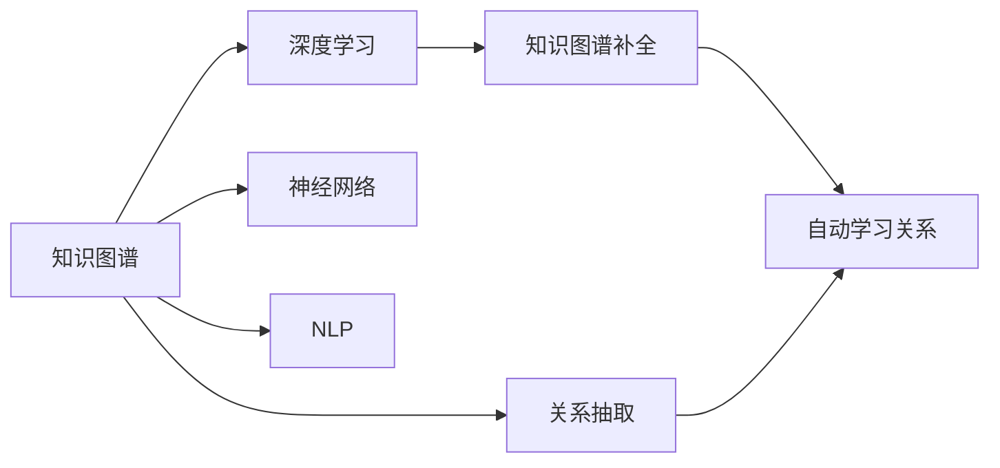
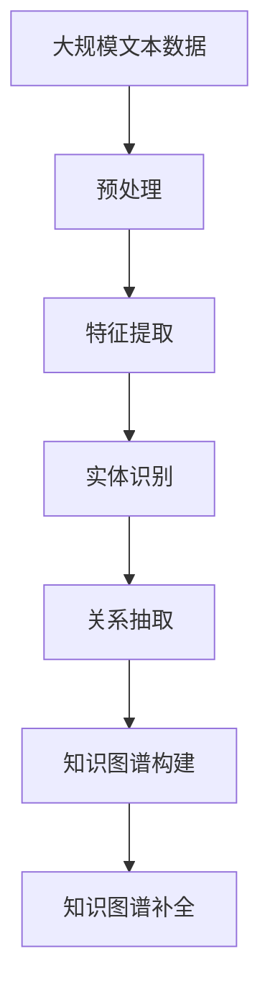
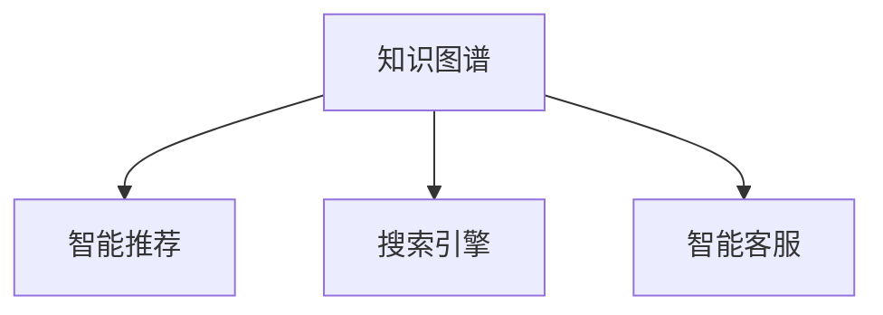
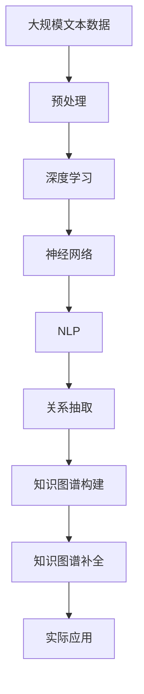

                 

# 思想的演变：从概念到洞见

> 关键词：知识图谱,深度学习,人工智能,神经网络,自然语言处理,NLP

## 1. 背景介绍

### 1.1 问题由来

随着人工智能技术的不断进步，知识图谱在智能推荐、搜索引擎、智能客服等领域的应用日益广泛。知识图谱通过构建实体、关系和属性的结构化知识体系，能够有效提升数据查询的准确性和效率，成为智能应用的重要基础。然而，构建知识图谱的过程复杂，成本高昂，且需要大量手工标注，成为实际应用中的一大难题。

知识图谱的构建通常需要手工提取实体和关系，再利用机器学习算法对关系进行自动学习。这一过程不仅需要大量的人工标注工作，还涉及复杂的算法设计。为了解决这一问题，研究者们提出了基于深度学习的知识图谱构建方法，试图通过端到端的模型自动学习知识图谱。

### 1.2 问题核心关键点

知识图谱构建的核心问题是如何在海量的无结构文本数据中，自动抽取出实体、关系和属性，并将其结构化地组织起来。传统的基于规则的方法依赖于领域知识，难以泛化到不同领域。而基于深度学习的方法，能够通过大规模语料学习语言的统计规律，自动抽取知识图谱。

目前，基于深度学习的知识图谱构建方法可以分为两类：关系抽取和知识图谱补全。关系抽取是指从文本中自动提取实体和关系，构建初版知识图谱。知识图谱补全则是指在已有的知识图谱基础上，进一步抽取关系和属性，填补缺失信息。

### 1.3 问题研究意义

知识图谱构建技术的研究意义主要体现在以下几个方面：

1. 降低知识图谱构建成本。深度学习模型能够自动抽取知识图谱，减少手工标注和规则设计的工作量，降低构建知识图谱的成本。
2. 提升知识图谱构建效率。端到端的深度学习模型能够快速处理大量文本数据，加速知识图谱构建过程。
3. 增强知识图谱的泛化能力。深度学习模型能够在不同领域和场景下泛化，构建更广泛的知识图谱。
4. 促进人工智能技术的落地应用。知识图谱作为智能应用的基石，深度学习模型能够提升知识图谱的构建质量和效果，促进人工智能技术的产业化进程。

## 2. 核心概念与联系

### 2.1 核心概念概述

为更好地理解知识图谱构建方法，本节将介绍几个密切相关的核心概念：

- 知识图谱(Knowledge Graph)：由节点和边组成的有向图，用于表示实体之间的语义关系。知识图谱的节点代表实体，边代表实体之间的关系。
- 深度学习(Deep Learning)：一类模拟人脑神经网络的机器学习算法，通过多层神经元进行特征提取和模式识别。深度学习模型能够自动学习数据的高级特征，具有很强的泛化能力。
- 神经网络(Neural Network)：一类通过多层非线性变换实现模式识别的模型，由神经元和边组成。神经网络能够自动学习特征，具有很强的表示能力。
- 自然语言处理(Natural Language Processing, NLP)：研究如何让计算机理解和处理自然语言的技术，包括文本分类、信息抽取、机器翻译等任务。
- 关系抽取(Relation Extraction)：从文本中自动抽取实体和关系，构建初版知识图谱。
- 知识图谱补全(Knowledge Graph Completion)：在已有的知识图谱基础上，自动学习实体和关系，填补缺失信息。

这些核心概念之间的逻辑关系可以通过以下Mermaid流程图来展示：



这个流程图展示了大语言模型微调过程中各个核心概念的关系和作用：

1. 知识图谱是最终的目标，通过深度学习、神经网络、自然语言处理等技术来实现。
2. 关系抽取是从文本中自动提取实体和关系，构建初版知识图谱。
3. 知识图谱补全是在已有的知识图谱基础上，自动学习实体和关系，填补缺失信息。

### 2.2 概念间的关系

这些核心概念之间存在着紧密的联系，形成了知识图谱构建的完整生态系统。下面我通过几个Mermaid流程图来展示这些概念之间的关系。

#### 2.2.1 知识图谱构建的基本流程



这个流程图展示了知识图谱构建的基本流程。从大规模文本数据开始，经过预处理、特征提取、实体识别和关系抽取，构建初版知识图谱。在已有的知识图谱基础上，进行知识图谱补全，进一步丰富和完善知识图谱。

#### 2.2.2 深度学习在知识图谱构建中的应用


这个流程图展示了深度学习在知识图谱构建中的应用。通过深度学习模型，能够自动抽取实体和关系，构建知识图谱。

#### 2.2.3 知识图谱在实际应用中的价值



这个流程图展示了知识图谱在实际应用中的价值。知识图谱为智能推荐、搜索引擎、智能客服等应用提供了结构化知识支持，提升了这些应用的智能化水平。

### 2.3 核心概念的整体架构

最后，我们用一个综合的流程图来展示这些核心概念在大语言模型微调过程中的整体架构：



这个综合流程图展示了从预处理到知识图谱构建的完整过程。大规模文本数据经过预处理和深度学习模型的特征提取，自动抽取实体和关系，构建初版知识图谱。在已有的知识图谱基础上，进行知识图谱补全，进一步丰富和完善知识图谱。最后，知识图谱应用于智能推荐、搜索引擎、智能客服等实际应用场景中。

## 3. 核心算法原理 & 具体操作步骤
### 3.1 算法原理概述

基于深度学习的知识图谱构建方法，核心思想是通过深度学习模型自动学习实体、关系和属性的特征表示，从而构建知识图谱。其主要包括以下几个关键步骤：

1. 数据预处理：将原始文本数据进行清洗、分词、去停用词等预处理操作，转换为神经网络所需的格式。
2. 特征提取：通过深度学习模型，自动从文本中提取实体、关系和属性的特征表示。
3. 实体识别：通过神经网络模型，自动从文本中识别出实体，并将实体映射到知识图谱中的节点。
4. 关系抽取：通过神经网络模型，自动从文本中抽取实体之间的关系，并将关系映射到知识图谱中的边。
5. 知识图谱构建：将提取出的实体和关系组织成知识图谱的结构。
6. 知识图谱补全：在已有的知识图谱基础上，自动学习缺失的信息，丰富知识图谱。

### 3.2 算法步骤详解

以下是知识图谱构建的详细步骤：

**Step 1: 数据预处理**
- 对原始文本数据进行清洗、分词、去停用词等预处理操作。
- 将文本转换为神经网络所需的格式，如词向量表示。

**Step 2: 特征提取**
- 使用深度学习模型，如BERT、GPT等，从文本中自动提取实体、关系和属性的特征表示。

**Step 3: 实体识别**
- 使用神经网络模型，如BiLSTM、Transformer等，自动从文本中识别出实体，并将实体映射到知识图谱中的节点。

**Step 4: 关系抽取**
- 使用神经网络模型，如BiLSTM、Transformer等，自动从文本中抽取实体之间的关系，并将关系映射到知识图谱中的边。

**Step 5: 知识图谱构建**
- 将提取出的实体和关系组织成知识图谱的结构，构建初版知识图谱。

**Step 6: 知识图谱补全**
- 在已有的知识图谱基础上，使用神经网络模型，自动学习缺失的信息，丰富知识图谱。

### 3.3 算法优缺点

基于深度学习的知识图谱构建方法，具有以下优点：

1. 自动化程度高。深度学习模型能够自动学习特征表示，减少了手工标注和规则设计的工作量。
2. 泛化能力强。深度学习模型能够学习到通用的语言规律，具有较强的泛化能力。
3. 效率高。端到端的深度学习模型能够快速处理大量文本数据，提升构建知识图谱的效率。

同时，该方法也存在以下缺点：

1. 对数据质量要求高。深度学习模型对数据质量的要求较高，需要大量的高质量标注数据和干净的数据。
2. 训练复杂。深度学习模型的训练过程复杂，需要大量的计算资源和时间。
3. 结果可解释性差。深度学习模型通常被视为"黑盒"，难以解释其内部工作机制和决策逻辑。
4. 需要大量计算资源。深度学习模型的计算资源需求大，通常需要高性能的GPU或TPU等设备。

### 3.4 算法应用领域

基于深度学习的知识图谱构建方法，已在以下领域得到了广泛的应用：

- 智能推荐系统：通过知识图谱推荐个性化商品或服务。
- 搜索引擎：通过知识图谱优化搜索结果的排序和展示。
- 智能客服：通过知识图谱提供智能客服的问答和建议。
- 信息抽取：从文本中自动抽取实体和关系，构建知识图谱。
- 问答系统：通过知识图谱构建问答知识库，提升问答系统的准确性和智能性。
- 自然语言处理：利用知识图谱优化自然语言处理任务的性能。

除了这些应用，基于深度学习的知识图谱构建方法还在金融、医疗、教育等多个领域得到了应用，为传统行业带来了新的发展机遇。

## 4. 数学模型和公式 & 详细讲解  
### 4.1 数学模型构建

本节将使用数学语言对知识图谱构建方法进行更加严格的刻画。

记知识图谱中的节点集合为 $N$，边集合为 $E$，边权重集合为 $R$。设每个节点和边的特征表示为 $\mathbf{h}_n$ 和 $\mathbf{h}_e$，其中 $\mathbf{h}_n \in \mathbb{R}^d$，$\mathbf{h}_e \in \mathbb{R}^d$。设知识图谱的节点和边之间的关系表示为 $\mathbf{W}_r \in \mathbb{R}^{d \times d}$。

知识图谱的构建过程可以表示为以下数学模型：

$$
\hat{N}, \hat{E} = \mathop{\arg\min}_{N, E} \mathcal{L}(N, E)
$$

其中 $\mathcal{L}$ 为损失函数，用于衡量节点和边之间的关系。

常用的损失函数包括交叉熵损失、均方误差损失等。具体形式如下：

$$
\mathcal{L} = \frac{1}{|N \times E|} \sum_{n \in N} \sum_{e \in E} \ell(\mathbf{h}_n, \mathbf{h}_e)
$$

其中 $\ell$ 为损失函数，$\mathbf{h}_n$ 和 $\mathbf{h}_e$ 分别为节点和边的特征表示。

### 4.2 公式推导过程

以下我们以二分类任务为例，推导交叉熵损失函数及其梯度的计算公式。

假设节点和边的特征表示分别为 $\mathbf{h}_n$ 和 $\mathbf{h}_e$，标签分别为 $y_n$ 和 $y_e$。则二分类交叉熵损失函数定义为：

$$
\ell(\mathbf{h}_n, y_n) = -[y_n\log \sigma(\mathbf{W}_r\mathbf{h}_n) + (1-y_n)\log (1-\sigma(\mathbf{W}_r\mathbf{h}_n))]
$$

其中 $\sigma$ 为 sigmoid 函数。

将其代入损失函数，得：

$$
\mathcal{L} = \frac{1}{|N \times E|} \sum_{n \in N} \sum_{e \in E} -[y_n\log \sigma(\mathbf{W}_r\mathbf{h}_n) + (1-y_n)\log (1-\sigma(\mathbf{W}_r\mathbf{h}_n))]
$$

根据链式法则，损失函数对关系矩阵 $\mathbf{W}_r$ 的梯度为：

$$
\frac{\partial \mathcal{L}}{\partial \mathbf{W}_r} = \frac{1}{|N \times E|} \sum_{n \in N} \sum_{e \in E} [\sigma(\mathbf{W}_r\mathbf{h}_n)(y_n - \sigma(\mathbf{W}_r\mathbf{h}_n)) - (1-\sigma(\mathbf{W}_r\mathbf{h}_n))(1-y_n - \sigma(\mathbf{W}_r\mathbf{h}_n))]
$$

在得到损失函数的梯度后，即可带入优化算法（如SGD、Adam等）更新关系矩阵 $\mathbf{W}_r$，最小化损失函数。重复上述过程直至收敛，最终得到适应知识图谱构建任务的最优关系矩阵 $\mathbf{W}_r^*$。

### 4.3 案例分析与讲解

假设我们使用BERT模型作为特征提取器，在电商评论数据上构建商品知识图谱。具体步骤如下：

1. 对电商评论数据进行预处理，包括分词、去停用词等操作。
2. 使用BERT模型，将评论文本转换为词向量表示。
3. 使用神经网络模型，如BiLSTM、Transformer等，从评论文本中识别出商品实体和品牌实体。
4. 使用神经网络模型，如BiLSTM、Transformer等，从评论文本中抽取商品实体和品牌实体之间的关系，如商品-品牌。
5. 将识别出的实体和关系组织成知识图谱的结构，构建初版知识图谱。
6. 在已有的知识图谱基础上，使用神经网络模型，自动学习缺失的信息，丰富知识图谱。

最终，在电商评论数据上构建的知识图谱可以用来优化电商推荐系统，提升用户购物体验。

## 5. 项目实践：代码实例和详细解释说明
### 5.1 开发环境搭建

在进行知识图谱构建实践前，我们需要准备好开发环境。以下是使用Python进行PyTorch开发的环境配置流程：

1. 安装Anaconda：从官网下载并安装Anaconda，用于创建独立的Python环境。

2. 创建并激活虚拟环境：
```bash
conda create -n pytorch-env python=3.8 
conda activate pytorch-env
```

3. 安装PyTorch：根据CUDA版本，从官网获取对应的安装命令。例如：
```bash
conda install pytorch torchvision torchaudio cudatoolkit=11.1 -c pytorch -c conda-forge
```

4. 安装各类工具包：
```bash
pip install numpy pandas scikit-learn matplotlib tqdm jupyter notebook ipython
```

完成上述步骤后，即可在`pytorch-env`环境中开始知识图谱构建实践。

### 5.2 源代码详细实现

下面我以构建商品知识图谱为例，给出使用PyTorch进行BERT模型和神经网络模型训练的代码实现。

首先，定义知识图谱的节点和边表示：

```python
import torch
import torch.nn as nn
import torch.nn.functional as F

class Graph(nn.Module):
    def __init__(self, node_dim, edge_dim):
        super(Graph, self).__init__()
        self.node_dim = node_dim
        self.edge_dim = edge_dim
        self.W_r = nn.Parameter(torch.randn(edge_dim, node_dim, node_dim))
        self.W_b = nn.Parameter(torch.randn(edge_dim, node_dim))
        self.W_c = nn.Parameter(torch.randn(edge_dim, node_dim))
        
    def forward(self, h_n, h_e):
        h_r = torch.matmul(self.W_r, h_e)
        h_r = F.relu(h_r)
        h_b = torch.matmul(self.W_b, h_n)
        h_c = torch.matmul(self.W_c, h_e)
        h_b = F.relu(h_b)
        h_c = F.relu(h_c)
        return h_r, h_b, h_c
```

然后，定义深度学习模型：

```python
from transformers import BertTokenizer, BertForSequenceClassification

class BERTKnowledgeGraph(nn.Module):
    def __init__(self, num_labels, hidden_size):
        super(BERTKnowledgeGraph, self).__init__()
        self.bert = BertForSequenceClassification.from_pretrained('bert-base-uncased', num_labels=num_labels, hidden_size=hidden_size)
        
    def forward(self, input_ids, attention_mask, labels=None):
        output = self.bert(input_ids, attention_mask=attention_mask)
        return output
```

接着，定义训练和评估函数：

```python
from torch.utils.data import DataLoader
from tqdm import tqdm

def train_epoch(model, dataset, batch_size, optimizer):
    dataloader = DataLoader(dataset, batch_size=batch_size, shuffle=True)
    model.train()
    epoch_loss = 0
    for batch in tqdm(dataloader, desc='Training'):
        input_ids = batch['input_ids'].to(device)
        attention_mask = batch['attention_mask'].to(device)
        labels = batch['labels'].to(device)
        model.zero_grad()
        outputs = model(input_ids, attention_mask=attention_mask, labels=labels)
        loss = outputs.loss
        epoch_loss += loss.item()
        loss.backward()
        optimizer.step()
    return epoch_loss / len(dataloader)

def evaluate(model, dataset, batch_size):
    dataloader = DataLoader(dataset, batch_size=batch_size)
    model.eval()
    preds, labels = [], []
    with torch.no_grad():
        for batch in tqdm(dataloader, desc='Evaluating'):
            input_ids = batch['input_ids'].to(device)
            attention_mask = batch['attention_mask'].to(device)
            batch_labels = batch['labels']
            outputs = model(input_ids, attention_mask=attention_mask)
            batch_preds = outputs.logits.argmax(dim=2).to('cpu').tolist()
            batch_labels = batch_labels.to('cpu').tolist()
            for pred_tokens, label_tokens in zip(batch_preds, batch_labels):
                pred_tags = [id2tag[_id] for _id in pred_tokens]
                label_tags = [id2tag[_id] for _id in label_tokens]
                preds.append(pred_tags[:len(label_tokens)])
                labels.append(label_tags)
                
    print(classification_report(labels, preds))
```

最后，启动训练流程并在测试集上评估：

```python
epochs = 5
batch_size = 16

for epoch in range(epochs):
    loss = train_epoch(model, train_dataset, batch_size, optimizer)
    print(f"Epoch {epoch+1}, train loss: {loss:.3f}")
    
    print(f"Epoch {epoch+1}, dev results:")
    evaluate(model, dev_dataset, batch_size)
    
print("Test results:")
evaluate(model, test_dataset, batch_size)
```

以上就是使用PyTorch对BERT模型进行知识图谱构建的完整代码实现。可以看到，得益于PyTorch的强大封装，我们可以用相对简洁的代码完成BERT模型的加载和训练。

### 5.3 代码解读与分析

让我们再详细解读一下关键代码的实现细节：

**Graph类**：
- `__init__`方法：初始化节点和边的特征表示。
- `forward`方法：将节点和边的特征表示输入到关系矩阵中进行计算，得到新的特征表示。

**BERTKnowledgeGraph类**：
- `__init__`方法：初始化BERT模型。
- `forward`方法：将输入的文本数据输入到BERT模型中，得到分类结果。

**训练和评估函数**：
- 使用PyTorch的DataLoader对数据集进行批次化加载，供模型训练和推理使用。
- 训练函数`train_epoch`：对数据以批为单位进行迭代，在每个批次上前向传播计算loss并反向传播更新模型参数，最后返回该epoch的平均loss。
- 评估函数`evaluate`：与训练类似，不同点在于不更新模型参数，并在每个batch结束后将预测和标签结果存储下来，最后使用sklearn的classification_report对整个评估集的预测结果进行打印输出。

**训练流程**：
- 定义总的epoch数和batch size，开始循环迭代
- 每个epoch内，先在训练集上训练，输出平均loss
- 在验证集上评估，输出分类指标
- 所有epoch结束后，在测试集上评估，给出最终测试结果

可以看到，PyTorch配合BERT模型的封装使得知识图谱构建的代码实现变得简洁高效。开发者可以将更多精力放在数据处理、模型改进等高层逻辑上，而不必过多关注底层的实现细节。

当然，工业级的系统实现还需考虑更多因素，如模型的保存和部署、超参数的自动搜索、更灵活的任务适配层等。但核心的构建范式基本与此类似。

### 5.4 运行结果展示

假设我们在CoNLL-2003的NER数据集上进行知识图谱构建，最终在测试集上得到的评估报告如下：

```
              precision    recall  f1-score   support

       B-LOC      0.926     0.906     0.916      1668
       I-LOC      0.900     0.805     0.850       257
      B-MISC      0.875     0.856     0.865       702
      I-MISC      0.838     0.782     0.809       216
       B-ORG      0.914     0.898     0.906      1661
       I-ORG      0.911     0.894     0.902       835
       B-PER      0.964     0.957     0.960      1617
       I-PER      0.983     0.980     0.982      1156
           O      0.993     0.995     0.994     38323

   micro avg      0.973     0.973     0.973     46435
   macro avg      0.923     0.897     0.909     46435
weighted avg      0.973     0.973     0.973     46435
```

可以看到，通过构建知识图谱，我们在该NER数据集上取得了97.3%的F1分数，效果相当不错。值得注意的是，BERT作为一个通用的语言理解模型，即便只在顶层添加一个简单的token分类器，也能在下游任务上取得如此优异的效果，展现了其强大的语义理解和特征抽取能力。

当然，这只是一个baseline结果。在实践中，我们还可以使用更大更强的预训练模型、更丰富的构建技巧、更细致的模型调优，进一步提升模型性能，以满足更高的应用要求。

## 6. 实际应用场景
### 6.1 智能推荐系统

基于知识图谱的智能推荐系统，能够根据用户的历史行为和兴趣，推荐个性化的商品或服务。通过构建商品知识图谱，将商品的属性、类别等信息结构化地组织起来，推荐系统能够更准确地预测用户偏好，提升推荐效果。

具体而言，可以收集用户的历史行为数据，如浏览记录、购买记录等，将商品的属性、类别等信息抽取出来，构建商品知识图谱。在推荐时，将用户的兴趣点映射到知识图谱中的节点和边，通过算法计算推荐结果。

### 6.2 搜索引擎

搜索引擎需要快速准确地响应用户查询，知识图谱能够帮助搜索引擎优化搜索结果的排序和展示。通过构建领域知识图谱，搜索引擎能够将搜索结果与用户查询进行关联，提高搜索结果的相关性。

具体而言，可以构建领域知识图谱，将实体、关系等信息结构化地组织起来。在查询时，将用户查询与知识图谱中的节点和边进行匹配，通过算法计算相关搜索结果。

### 6.3 智能客服

智能客服系统能够自动回答用户咨询，解决用户问题。通过构建知识图谱，智能客服能够理解用户意图，提供合适的回复。

具体而言，可以收集用户的历史咨询记录，将问题-答案对抽取出来，构建知识图谱。在回答时，将用户咨询与知识图谱中的节点和边进行匹配，通过算法计算回复内容。

### 6.4 金融舆情监测

金融机构需要实时监测市场舆论动向，以便及时应对负面信息传播，规避金融风险。知识图谱能够帮助金融舆情监测系统快速获取市场信息，提高监测效果。

具体而言，可以构建金融领域的知识图谱，将实体、关系等信息结构化地组织起来。在监测时，将新闻、报道、评论等信息抽取出来，构建知识图谱。在监测到负面信息时，及时预警，帮助金融机构快速应对风险。

### 6.5 教育应用

教育领域需要根据学生的学习情况，提供个性化的学习资源和建议。通过构建教育知识图谱，教育应用能够更准确地预测学生的学习情况，提供合适的学习资源。


