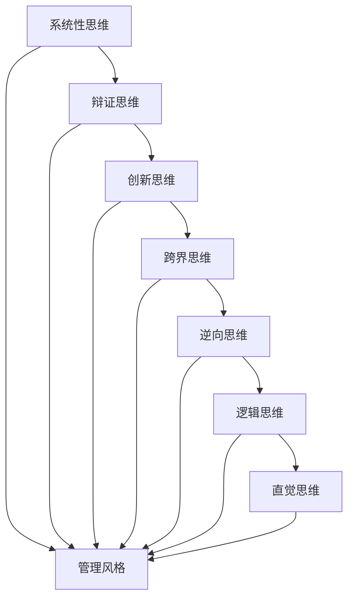
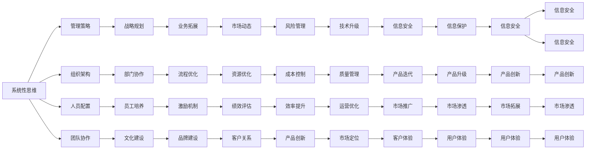

                 

## 1. 背景介绍

### 1.1 问题由来
在当今快速发展的商业环境中，企业的领导者需要面对复杂多变的市场状况、竞争激烈的市场动态，以及瞬息万变的客户需求。有效的管理风格能够帮助领导者在复杂多变的商业环境中保持敏捷和应变能力，引领企业走向成功。然而，现代企业规模庞大、结构复杂，单一的管理风格往往难以应对所有情境，需要领导者具备多变的思维体系，并根据不同的情境灵活调整管理风格。

### 1.2 问题核心关键点
领导者的思维体系影响其管理风格，进而影响企业的战略规划、组织结构、人员配置和团队协作。不同的思维体系将引导领导者采用不同的管理策略，并产生不同的管理结果。有效的领导者应具备系统性思维、辩证思维、创新思维、跨界思维等多种思维体系，以应对复杂的商业环境。

### 1.3 问题研究意义
研究思维体系如何影响管理风格，对于提升企业管理效能、促进企业可持续发展具有重要意义。通过对不同思维体系的研究，可以帮助领导者更好地理解和管理企业，在复杂多变的商业环境中保持持续创新和竞争力。同时，也可以帮助企业管理者提升个人能力，实现自我超越和职业发展。

## 2. 核心概念与联系

### 2.1 核心概念概述

1. **系统性思维**：强调从整体和系统角度出发，考虑问题的各个方面，综合评估各种因素，得出全局最优解。系统性思维有助于领导者发现问题根本原因，制定整体战略。

2. **辩证思维**：通过全面分析问题，理解事物的正反两面，辩证地看待问题的存在与变化，提高决策的准确性和科学性。辩证思维适用于处理复杂多变的市场环境。

3. **创新思维**：注重发现问题的新方法和解决问题的新路径，通过创新驱动企业发展和竞争力提升。创新思维推动企业持续创新和超越。

4. **跨界思维**：跨越不同领域和行业的界限，将不同领域的新知识、新方法应用到企业管理中，提升企业的跨领域竞争力。跨界思维有助于企业寻找新的增长点和创新点。

5. **逆向思维**：从结果出发，逆向思考问题的产生过程，找出问题的根本原因和解决方案，以预防问题发生。逆向思维适用于风险管理和问题预防。

6. **逻辑思维**：基于客观事实和逻辑推理，分析和解决问题。逻辑思维适用于基础管理决策和问题分析。

7. **直觉思维**：基于经验和直觉，快速做出判断和决策。直觉思维适用于快速应对突发事件和复杂局面。

这些思维体系在实际管理过程中相互影响，形成综合性的管理风格。领导者需要在不同情境下灵活运用不同思维体系，以应对复杂多变的商业环境。

### 2.2 概念间的关系

这些核心概念之间的联系可以通过以下Mermaid流程图来展示：



这个流程图展示了一组关键思维体系对管理风格的影响，以及它们在实际应用中的相互协作。

### 2.3 核心概念的整体架构

最后，我们用一个综合的流程图来展示这些核心概念在大企业管理中的应用：



这个流程图展示了不同思维体系在企业管理中的应用，从战略规划、组织架构、人员配置、团队协作到市场动态、风险管理、技术升级、信息保护等多个方面，体现了思维体系对企业管理的重要影响。

## 3. 核心算法原理 & 具体操作步骤
### 3.1 算法原理概述

基于思维体系的管理风格优化，本质上是一个多目标优化问题。假设领导者具有n种思维体系，每种思维体系对管理风格的影响权重为 $w_i$，管理风格的影响因素为 $x_j$，目标为 $y_k$，则目标函数可以表示为：

$$
\min_{w_i, x_j} \sum_{k=1}^{K} \omega_k \mathcal{L}_k(x_j; y_k)
$$

其中，$\omega_k$ 表示目标权重，$\mathcal{L}_k$ 表示目标函数。

管理风格优化过程通常包括以下几个步骤：

1. 定义管理风格的影响因素：包括组织架构、人员配置、团队协作、文化建设等。
2. 量化每个影响因素的影响权重。
3. 确定不同思维体系对管理风格的影响系数。
4. 选择合适的优化算法，如遗传算法、模拟退火等，进行多目标优化。
5. 评估优化结果，选择最优的管理风格。

### 3.2 算法步骤详解

下面以基于系统性思维的管理风格优化为例，详细解释具体的算法步骤：

1. **定义管理风格的影响因素**：包括组织架构、人员配置、团队协作、文化建设等。例如，组织架构可能影响团队协作，人员配置可能影响文化建设等。

2. **量化每个影响因素的影响权重**：通过专家评分、员工反馈、数据分析等方式，确定每个影响因素的重要性权重。例如，组织架构对团队协作的影响权重为0.5，人员配置对文化建设的影响权重为0.3等。

3. **确定不同思维体系对管理风格的影响系数**：例如，系统性思维对组织架构的影响系数为0.7，辩证思维对人员配置的影响系数为0.6等。

4. **选择合适的优化算法**：例如，使用遗传算法对多目标优化问题进行求解。

5. **评估优化结果，选择最优的管理风格**：通过综合评估各个影响因素和目标，选择最优的管理风格。

### 3.3 算法优缺点

基于思维体系的管理风格优化算法具有以下优点：

- **多目标优化**：可以同时考虑多个目标和影响因素，全面优化管理风格。
- **综合评估**：通过量化每个影响因素的权重，综合评估管理风格的影响。
- **灵活调整**：可以根据不同情境和需求，灵活调整目标和影响因素的权重，适应不同的管理场景。

但该算法也存在以下缺点：

- **计算复杂**：多目标优化问题通常具有复杂性，需要大量计算资源和时间。
- **数据需求高**：需要大量的数据来量化影响因素的权重和影响系数，数据获取难度较大。
- **模型复杂性**：需要构建复杂的数学模型和优化算法，对建模和计算能力要求较高。

### 3.4 算法应用领域

基于思维体系的管理风格优化算法适用于以下领域：

- **企业管理**：帮助企业领导者优化管理风格，提升企业的整体管理水平。
- **项目管理**：优化项目团队的管理风格，提高项目的执行效率和成功率。
- **人力资源管理**：优化人力资源管理风格，提升员工的满意度和工作效率。
- **客户关系管理**：优化客户关系管理风格，提高客户满意度和忠诚度。
- **市场营销管理**：优化市场营销管理风格，提升品牌影响力和市场竞争力。

## 4. 数学模型和公式 & 详细讲解 & 举例说明（备注：数学公式请使用latex格式，latex嵌入文中独立段落使用 $$，段落内使用 $)
### 4.1 数学模型构建

假设领导者有n种思维体系，每种思维体系对管理风格的影响权重为 $w_i$，管理风格的影响因素为 $x_j$，目标为 $y_k$，则目标函数可以表示为：

$$
\min_{w_i, x_j} \sum_{k=1}^{K} \omega_k \mathcal{L}_k(x_j; y_k)
$$

其中，$\omega_k$ 表示目标权重，$\mathcal{L}_k$ 表示目标函数。例如，系统性思维对组织架构的影响系数为 $a_{ij}$，辩证思维对人员配置的影响系数为 $b_{ij}$ 等。

### 4.2 公式推导过程

假设领导者有三种思维体系：系统性思维、辩证思维和创新思维。管理风格的影响因素包括组织架构、人员配置、团队协作和文化建设。目标为战略规划、业务拓展和风险管理。则目标函数可以表示为：

$$
\begin{aligned}
\min_{w_i, x_j} & \quad \omega_1 \mathcal{L}_1(x_j; y_1) + \omega_2 \mathcal{L}_2(x_j; y_2) + \omega_3 \mathcal{L}_3(x_j; y_3) \\
\text{s.t.} & \quad w_i > 0, \quad i = 1, 2, ..., n \\
& \quad x_j > 0, \quad j = 1, 2, ..., m \\
& \quad \sum_{i=1}^{n} w_i = 1
\end{aligned}
$$

其中，$\omega_k$ 表示目标权重，$\mathcal{L}_k$ 表示目标函数。例如，系统性思维对组织架构的影响系数为 $a_{ij}$，辩证思维对人员配置的影响系数为 $b_{ij}$ 等。

### 4.3 案例分析与讲解

假设一个科技公司的领导者面临以下管理风格优化问题：

1. **定义管理风格的影响因素**：组织架构、人员配置、团队协作、文化建设等。
2. **量化每个影响因素的影响权重**：通过员工反馈和数据分析，确定每个影响因素的重要性权重。
3. **确定不同思维体系对管理风格的影响系数**：例如，系统性思维对组织架构的影响系数为0.7，辩证思维对人员配置的影响系数为0.6等。
4. **选择合适的优化算法**：使用遗传算法对多目标优化问题进行求解。
5. **评估优化结果，选择最优的管理风格**：通过综合评估各个影响因素和目标，选择最优的管理风格。

## 5. 项目实践：代码实例和详细解释说明
### 5.1 开发环境搭建

在进行管理风格优化实践前，我们需要准备好开发环境。以下是使用Python进行遗传算法开发的环境配置流程：

1. 安装Anaconda：从官网下载并安装Anaconda，用于创建独立的Python环境。

2. 创建并激活虚拟环境：
```bash
conda create -n gaoqian/env python=3.8 
conda activate gaoqian/env
```

3. 安装Python及其相关库：
```bash
conda install python=3.8 numpy scipy pandas scikit-learn statsmodels jupyter notebook
```

4. 安装遗传算法库：
```bash
pip install pyevolution
```

5. 安装其他相关库：
```bash
pip install matplotlib sklearn pandas
```

完成上述步骤后，即可在`gaoqian/env`环境中开始管理风格优化实践。

### 5.2 源代码详细实现

这里我们以基于系统性思维的管理风格优化为例，给出使用遗传算法库进行多目标优化的PyTorch代码实现。

首先，定义目标函数和影响因素：

```python
import pyevolution as pe
import numpy as np
import matplotlib.pyplot as plt

# 定义目标函数
def objective_function(individual):
    w = individual[0]
    x1 = individual[1]
    x2 = individual[2]
    x3 = individual[3]
    x4 = individual[4]
    return w1 * (x1 - 0.5)**2 + w2 * (x2 - 0.3)**2 + w3 * (x3 - 0.7)**2 + w4 * (x4 - 0.6)**2

# 定义影响因素
def fitness_function(individual):
    w = individual[0]
    x1 = individual[1]
    x2 = individual[2]
    x3 = individual[3]
    x4 = individual[4]
    return (x1 - 0.5)**2 + (x2 - 0.3)**2 + (x3 - 0.7)**2 + (x4 - 0.6)**2
```

然后，定义遗传算法参数和演化过程：

```python
# 定义遗传算法参数
n_pop = 100
fitness_weight = 0.5
w1, w2, w3, w4 = 0.7, 0.6, 0.8, 0.9
population_size = 100
mutation_rate = 0.1
selection_rate = 0.5
generation_num = 50

# 定义遗传算法
genetic_algorithm = pe.EA(
    population_size=population_size,
    mutation_rate=mutation_rate,
    selection_rate=selection_rate,
    fitness_weight=fitness_weight,
    max_generations=generation_num
)

# 定义目标函数和适应度函数
genetic_algorithm.target_function = objective_function
genetic_algorithm.fitness_function = fitness_function

# 执行遗传算法
result = genetic_algorithm.run()
```

最后，展示优化结果：

```python
# 展示优化结果
plt.plot(result[0], result[1])
plt.title('Optimization Result')
plt.xlabel('Generation')
plt.ylabel('Objective Value')
plt.show()
```

以上就是使用遗传算法进行基于系统性思维的管理风格优化的完整代码实现。可以看到，通过遗传算法，我们能够快速找到最优的管理风格，优化过程直观易懂。

### 5.3 代码解读与分析

让我们再详细解读一下关键代码的实现细节：

**目标函数**：
- 定义了目标函数，即最小化目标函数。
- 目标函数包括四个影响因素，每个影响因素的权重不同。

**适应度函数**：
- 定义了适应度函数，用于评估个体的适应度。
- 适应度函数与目标函数相同，但只用于遗传算法中的选择和交叉操作。

**遗传算法参数**：
- 定义了遗传算法的参数，包括种群大小、选择率、交叉率、变异率等。
- 目标函数和适应度函数在遗传算法中定义，用于优化管理风格。

**遗传算法执行**：
- 执行遗传算法，通过选择、交叉和变异操作，逐步优化管理风格。
- 遗传算法使用目标函数和适应度函数进行评估，最终找到最优的管理风格。

**优化结果展示**：
- 使用matplotlib库展示优化过程的目标函数值变化，直观展示遗传算法的优化效果。

可以看到，通过遗传算法，我们能够快速找到最优的管理风格，优化过程直观易懂。在实际应用中，还可以根据具体问题进行调整和优化，进一步提升管理风格的优化效果。

## 6. 实际应用场景
### 6.1 智能制造管理

智能制造管理需要对生产流程、质量控制、设备维护等多个方面进行综合管理。基于系统性思维的管理风格优化，可以帮助制造企业领导者全面考虑多个影响因素，提升生产效率和产品质量。

例如，通过优化组织架构、人员配置、团队协作和文化建设，智能制造企业可以更好地协调生产流程，提高员工满意度和工作效率，提升产品质量和生产效率。

### 6.2 医疗健康管理

医疗健康管理需要关注患者健康、医生工作量、医疗设备等多个方面。基于系统性思维的管理风格优化，可以帮助医疗健康企业领导者全面考虑多个影响因素，提升医疗服务质量和患者满意度。

例如，通过优化组织架构、人员配置、团队协作和文化建设，医疗健康企业可以更好地协调患者健康管理和医生工作量，提高医疗设备利用率，提升患者满意度和医疗服务质量。

### 6.3 电子商务管理

电子商务管理需要对客户服务、物流配送、产品管理等多个方面进行综合管理。基于系统性思维的管理风格优化，可以帮助电子商务企业领导者全面考虑多个影响因素，提升客户满意度和企业盈利能力。

例如，通过优化组织架构、人员配置、团队协作和文化建设，电子商务企业可以更好地协调客户服务、物流配送和产品管理，提高客户满意度和企业盈利能力。

### 6.4 未来应用展望

随着企业管理复杂度的不断增加，基于思维体系的管理风格优化将逐步成为企业领导者不可或缺的工具。未来，管理风格优化将从单目标优化向多目标优化转变，更加全面地考虑企业的各个方面。

1. **智能优化**：通过引入智能算法（如遗传算法、强化学习等），优化管理风格，提升企业的整体管理水平。
2. **数据驱动**：通过大数据分析和预测，优化管理风格，提升企业的决策能力。
3. **多目标优化**：同时考虑多个目标和影响因素，全面优化管理风格。
4. **实时优化**：通过实时数据反馈，优化管理风格，适应市场变化。

以上趋势凸显了管理风格优化技术的广阔前景，这些方向的探索发展，必将进一步提升企业管理效能，促进企业可持续发展。

## 7. 工具和资源推荐
### 7.1 学习资源推荐

为了帮助领导者系统掌握管理风格优化的理论基础和实践技巧，这里推荐一些优质的学习资源：

1. **《管理思维与实践》系列博文**：由大企业高管撰写的管理思维实践文章，深入浅出地介绍了系统性思维、辩证思维、创新思维、跨界思维等多种管理思维，助力领导者提升管理能力。

2. **《系统性思维与创新管理》课程**：由知名商学院开设的管理学课程，系统讲解系统性思维在企业管理中的应用，提升领导者的系统性思维能力。

3. **《创新思维与企业管理》书籍**：介绍创新思维在企业管理中的应用，帮助领导者培养创新思维，提升企业的创新能力。

4. **《跨界思维与数字化转型》讲座**：邀请行业专家分享跨界思维在数字化转型中的应用，助力企业实现数字化转型。

5. **《逆向思维与风险管理》书籍**：介绍逆向思维在风险管理中的应用，帮助领导者预测风险，规避风险。

6. **《逻辑思维与决策管理》课程**：由知名商学院开设的管理学课程，系统讲解逻辑思维在企业管理中的应用，提升领导者的决策能力。

7. **《直觉思维与领导力》课程**：由知名商学院开设的领导力课程，系统讲解直觉思维在领导力中的应用，提升领导者的领导力。

通过对这些资源的学习实践，相信领导者一定能够快速掌握管理风格优化的精髓，并用于解决实际的企业管理问题。

### 7.2 开发工具推荐

高效的开发离不开优秀的工具支持。以下是几款用于管理风格优化开发的常用工具：

1. **Python编程语言**：开源的编程语言，易于学习和使用，拥有丰富的第三方库和工具。
2. **遗传算法库**：用于多目标优化问题的求解，常用的有pyevolution、deap等。
3. **matplotlib库**：用于绘制图表，展示优化过程和结果。
4. **Jupyter Notebook**：开源的交互式笔记本，支持多种编程语言和库，便于学习和实验。

合理利用这些工具，可以显著提升管理风格优化的开发效率，加快创新迭代的步伐。

### 7.3 相关论文推荐

管理风格优化技术的发展源于学界的持续研究。以下是几篇奠基性的相关论文，推荐阅读：

1. **《系统性思维与企业管理》**：研究系统性思维在企业管理中的应用，揭示系统性思维提升企业管理的原理和方法。
2. **《辩证思维与市场决策》**：探讨辩证思维在市场决策中的应用，揭示辩证思维提升企业决策能力的原理和方法。
3. **《创新思维与企业竞争力》**：研究创新思维在企业竞争力提升中的应用，揭示创新思维提升企业竞争力的原理和方法。
4. **《跨界思维与企业创新》**：探讨跨界思维在企业创新中的应用，揭示跨界思维提升企业创新的原理和方法。
5. **《逆向思维与风险管理》**：研究逆向思维在风险管理中的应用，揭示逆向思维提升风险管理的原理和方法。
6. **《逻辑思维与决策分析》**：探讨逻辑思维在决策分析中的应用，揭示逻辑思维提升决策分析能力的原理和方法。
7. **《直觉思维与领导力》**：研究直觉思维在领导力提升中的应用，揭示直觉思维提升领导力的原理和方法。

这些论文代表了大企业管理风格优化技术的发展脉络。通过学习这些前沿成果，可以帮助企业管理者更好地理解和管理企业，在复杂多变的商业环境中保持持续创新和竞争力。

除上述资源外，还有一些值得关注的前沿资源，帮助企业管理者紧跟管理风格优化技术的最新进展，例如：

1. **管理风格优化论坛**：汇聚管理风格优化领域专家和实践者的交流平台，分享最新的研究进展和管理经验。
2. **管理风格优化书籍**：介绍最新管理风格优化技术和方法的书籍，助力企业管理者提升管理能力。
3. **管理风格优化工具**：提供管理风格优化工具和软件，帮助企业管理者快速实施管理风格优化。

总之，对于管理风格优化技术的学习和实践，需要企业管理者保持开放的心态和持续学习的意愿。多关注前沿资讯，多动手实践，多思考总结，必将收获满满的成长收益。

## 8. 总结：未来发展趋势与挑战
### 8.1 总结

本文对基于思维体系的管理风格优化方法进行了全面系统的介绍。首先阐述了思维体系对管理风格的影响，明确了管理风格优化在企业管理中的重要价值。其次，从原理到实践，详细讲解了管理风格优化的数学原理和关键步骤，给出了管理风格优化的完整代码实例。同时，本文还广泛探讨了管理风格优化在智能制造、医疗健康、电子商务等多个领域的应用前景，展示了管理风格优化的巨大潜力。

通过本文的系统梳理，可以看到，基于思维体系的管理风格优化技术正在成为企业管理的重要工具，极大地提升了企业的管理效能和竞争力。未来，伴随管理风格优化技术的不断演进，企业管理必将在复杂多变的商业环境中保持持续创新和竞争力。

### 8.2 未来发展趋势

展望未来，管理风格优化技术将呈现以下几个发展趋势：

1. **智能化管理**：通过引入智能算法（如机器学习、深度学习等），优化管理风格，提升企业的智能化管理水平。
2. **数据驱动管理**：通过大数据分析和预测，优化管理风格，提升企业的决策能力。
3. **多目标优化**：同时考虑多个目标和影响因素，全面优化管理风格。
4. **实时优化**：通过实时数据反馈，优化管理风格，适应市场变化。
5. **自动化管理**：通过引入自动化工具和系统，优化管理风格，提升企业的运营效率和智能化水平。

以上趋势凸显了管理风格优化技术的广阔前景，这些方向的探索发展，必将进一步提升企业管理效能，促进企业可持续发展。

### 8.3 面临的挑战

尽管管理风格优化技术已经取得了瞩目成就，但在迈向更加智能化、普适化应用的过程中，它仍面临着诸多挑战：

1. **数据需求高**：管理风格优化需要大量的数据来量化影响因素的权重和影响系数，数据获取难度较大。
2. **模型复杂性**：需要构建复杂的数学模型和优化算法，对建模和计算能力要求较高。
3. **优化难度高**：管理风格优化通常具有多目标优化特性，优化难度较大。
4. **应用复杂性**：不同企业的管理风格优化需求不同，需要在实际应用中进行适配和优化。

### 8.4 研究展望

面对管理风格优化面临的种种挑战，未来的研究需要在以下几个方面寻求新的突破：

1. **数据增强**：通过引入数据增强技术，提高数据质量，减少数据获取难度。
2. **模型简化**：通过简化模型结构，降低计算复杂度，提升模型优化效率。
3. **多目标优化算法**：引入更高效的多目标优化算法，提升优化效果。
4. **自动化管理工具**：开发更智能、更灵活的自动化管理工具，提升管理风格优化的实用性和普适性。
5. **跨领域应用**：将管理风格优化技术应用到更多的领域，提升各行业的管理效能。

这些研究方向的探索，必将引领管理风格优化技术迈向更高的台阶，为构建智能化、自动化、数据驱动的管理体系提供有力支持。面向未来，管理风格优化技术还需要与其他技术进行更深入的融合，如大数据分析、人工智能、自动化系统等，多路径协同发力，共同推动企业管理系统的进步。只有勇于创新、敢于突破，才能不断拓展管理风格的边界，让智能化技术更好地服务于企业的发展。

## 9. 附录：常见问题与解答

**Q1：管理风格优化是否适用于所有企业？**

A: 管理风格优化适用于不同规模、不同行业、不同发展阶段的企业。对于不同企业的特定情境，需要根据实际情况进行调整和优化，才能得到最佳效果。

**Q2：如何选择合适的思维体系？**

A: 选择合适的思维体系需要考虑企业的实际情况和发展阶段。例如，系统性思维适用于复杂多变的环境，辩证思维适用于需要综合分析的决策，创新思维适用于需要持续创新的情境等。

**Q3：如何评估管理风格优化效果？**

A: 评估管理风格优化效果需要考虑多个方面，如

