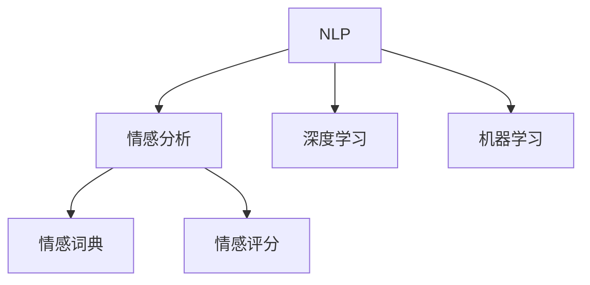
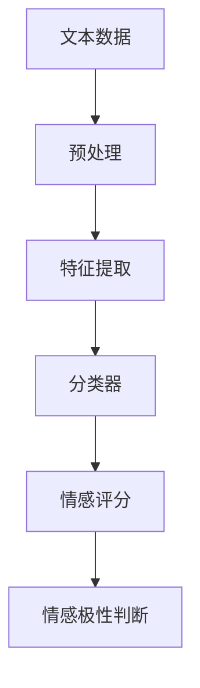
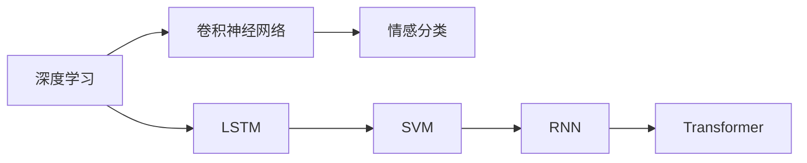
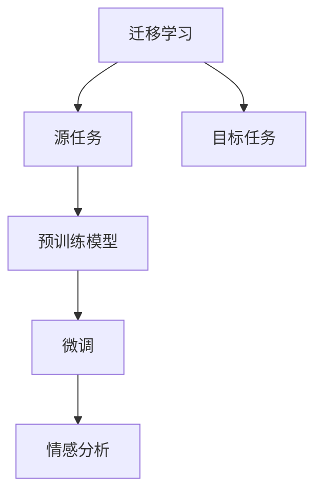
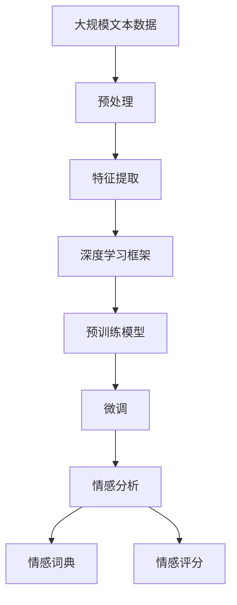

                 

# 情感分析技术：AI的应用

> 关键词：情感分析,自然语言处理(NLP),深度学习,机器学习,文本分类,情感极性,深度学习框架,迁移学习,文本挖掘,情感计算

## 1. 背景介绍

### 1.1 问题由来
情感分析（Sentiment Analysis），也称意见挖掘（Opinion Mining），是自然语言处理（NLP）领域的一个热门研究方向。它的主要目标是从文本中识别和提取情感信息，了解用户对某一事件、产品或服务的情绪倾向，帮助企业做出更准确的决策。

在电商、社交媒体、舆情监控、品牌管理等多个领域，情感分析具有广泛的应用价值。例如，通过分析电商平台上的评论，可以评估产品质量和用户满意度；通过监测社交媒体上的讨论，可以及时发现和应对公关危机；通过分析市场舆情，可以预测股票市场走势，甚至为国家政策制定提供参考。

近年来，随着深度学习技术的发展，情感分析技术取得了显著进步。特别是以BERT、GPT等预训练语言模型为代表的模型，通过在大量无标签文本上进行预训练，能够自动学习语言中的隐含规律，使得情感分析模型的效果大幅提升。

### 1.2 问题核心关键点
情感分析的核心在于如何准确地识别文本中的情感倾向。具体而言，可以分为以下几个关键点：

1. **数据收集与预处理**：
   - 收集包含情感信息的文本数据，如评论、新闻、推文等。
   - 清洗文本数据，去除噪音和无关信息，并进行分词、词性标注等预处理。

2. **特征提取**：
   - 将文本转换成模型可以理解的数值形式，常用的方法有词袋模型（Bag of Words）、TF-IDF、Word2Vec、GloVe等。
   - 结合深度学习框架（如PyTorch、TensorFlow等）进行特征表示学习，提升模型的表达能力。

3. **情感分类**：
   - 设计合适的分类器模型，如逻辑回归、支持向量机、朴素贝叶斯等传统模型，或深度学习模型，如卷积神经网络（CNN）、循环神经网络（RNN）、长短时记忆网络（LSTM）、Transformer等。
   - 训练模型时，使用标注数据进行有监督学习，并通过交叉验证等方法优化模型性能。

4. **情感极性判断**：
   - 将情感分类扩展到情感极性判断，即判断文本的情感是正面的、中性的还是负面的。
   - 通过改进分类器的训练策略或引入情感词典等先验知识，提高情感极性的识别准确率。

5. **情感强度评估**：
   - 进一步细化情感分析，评估文本的情感强度，如情感的正面或负面程度、情感极性的强度等级等。
   - 引入情感评分（Sentiment Score）等指标，量化情感分析结果，用于综合评价。

### 1.3 问题研究意义
情感分析技术的研究和应用具有重要的意义：

1. **商业价值**：
   - 帮助企业及时了解市场反馈，提升产品和服务质量，增强用户满意度。
   - 通过情感分析结果，制定精准的市场营销策略，提高广告投放效果和ROI。

2. **公共管理**：
   - 及时发现和响应公众舆情，避免负面舆情的扩散，维护社会稳定。
   - 评估政策效果，调整和优化政策实施策略，提升政府治理能力。

3. **情感计算**：
   - 通过情感分析，探索人类的情感表达和情感认知机制，推动心理学和认知科学的研究。
   - 结合机器学习和自然语言处理技术，开发情感计算系统，提升人机交互的自然性和智能性。

## 2. 核心概念与联系

### 2.1 核心概念概述

为了更好地理解情感分析技术的核心概念，本节将介绍几个密切相关的概念：

1. **自然语言处理（NLP）**：
   - 通过计算机程序处理自然语言的理论、技术和应用，包括文本预处理、语言模型、词向量表示、文本分类、命名实体识别、情感分析等。

2. **深度学习（Deep Learning）**：
   - 一种基于多层神经网络的机器学习方法，通过堆叠多个非线性变换层，能够自动学习数据的复杂特征表示，适合处理大规模文本分类任务。

3. **机器学习（Machine Learning）**：
   - 通过算法和模型，使计算机系统能够从数据中自动学习，并做出预测或决策。

4. **情感分析（Sentiment Analysis）**：
   - 从文本中识别和提取情感信息，判断文本的情感倾向。

5. **情感词典（Sentiment Lexicon）**：
   - 一种基于词典的情感分析方法，通过预定义的情感词典，对文本中的情感词汇进行打分，实现情感极性的判断。

6. **情感评分（Sentiment Score）**：
   - 将情感分析的结果量化，通过计算情感评分，综合评估文本的情感倾向和强度。

这些核心概念之间的逻辑关系可以通过以下Mermaid流程图来展示：



这个流程图展示了大语言模型微调过程中各个核心概念的关系和作用。

### 2.2 概念间的关系

这些核心概念之间存在着紧密的联系，形成了情感分析技术的完整生态系统。下面我通过几个Mermaid流程图来展示这些概念之间的关系。

#### 2.2.1 情感分析的流程



这个流程图展示了情感分析的基本流程。

#### 2.2.2 深度学习在情感分析中的应用



这个流程图展示了深度学习在情感分类任务中的应用。

#### 2.2.3 迁移学习在情感分析中的应用



这个流程图展示了迁移学习在情感分析中的应用。

### 2.3 核心概念的整体架构

最后，我们用一个综合的流程图来展示这些核心概念在情感分析技术中的整体架构：



这个综合流程图展示了从数据预处理到情感分析的完整过程。

## 3. 核心算法原理 & 具体操作步骤

### 3.1 算法原理概述

情感分析的核心算法原理基于深度学习模型，特别是卷积神经网络（CNN）、循环神经网络（RNN）、长短时记忆网络（LSTM）、Transformer等。其核心思想是通过模型自动学习文本的特征表示，从而判断文本的情感倾向。

以基于Transformer的情感分析模型为例，其基本流程如下：

1. **文本编码**：使用Transformer模型将文本编码成向量表示，捕捉文本中的语义信息。
2. **特征提取**：将编码后的文本向量输入全连接层，提取特征表示。
3. **情感分类**：将特征表示输入到分类器（如softmax），输出情感极性的概率分布。
4. **情感评分**：根据分类结果计算情感评分，综合评估文本的情感强度。

### 3.2 算法步骤详解

以情感分类为例，详细讲解基于Transformer的情感分析模型的构建和训练步骤：

**Step 1: 准备数据集**
- 收集包含情感信息的文本数据，如评论、新闻、推文等。
- 清洗文本数据，去除噪音和无关信息，并进行分词、词性标注等预处理。

**Step 2: 构建模型**
- 使用Transformer库搭建情感分类模型，包括编码器、全连接层和分类器等组件。
- 设置模型的超参数，如学习率、批大小、迭代轮数等。

**Step 3: 数据划分与加载**
- 将数据集划分为训练集、验证集和测试集。
- 使用PyTorch的数据载入器（DataLoader），对数据进行批次化加载。

**Step 4: 模型训练**
- 将训练集数据输入模型，前向传播计算损失函数。
- 反向传播计算参数梯度，根据设定的优化算法更新模型参数。
- 周期性在验证集上评估模型性能，根据性能指标决定是否触发Early Stopping。
- 重复上述步骤直到满足预设的迭代轮数或Early Stopping条件。

**Step 5: 模型评估与测试**
- 在测试集上评估模型性能，计算准确率、召回率和F1分数等指标。
- 分析模型在各类情感分类上的表现，识别出模型的优势和不足。

### 3.3 算法优缺点

情感分析的深度学习模型具有以下优点：

1. **高精度**：能够自动学习文本中的复杂特征，尤其是语义信息，从而提高情感分类的精度。
2. **可扩展性**：适用于大规模文本分类任务，能够处理多语言、多领域的数据。
3. **自适应能力**：通过微调预训练模型，能够适应新的情感分类任务，快速提升模型性能。

然而，这些模型也存在一些缺点：

1. **数据依赖**：深度学习模型需要大量的标注数据进行训练，获取高质量标注数据成本较高。
2. **过拟合风险**：在大规模数据集上训练时，容易出现过拟合问题，需要设计合适的正则化技术来缓解。
3. **计算资源需求高**：深度学习模型的训练和推理计算资源需求较高，需要高性能的GPU/TPU设备。
4. **模型解释性差**：深度学习模型被视为"黑盒"，难以解释其内部工作机制和决策逻辑，不利于模型调试和优化。

### 3.4 算法应用领域

情感分析技术在以下几个领域具有广泛的应用：

1. **电商领域**：
   - 评估商品的用户评价，优化产品设计和服务质量。
   - 预测市场趋势，调整营销策略，提升广告效果。

2. **社交媒体**：
   - 监测公众舆情，及时发现和应对公关危机。
   - 分析用户情感倾向，了解用户需求，提升品牌价值。

3. **舆情监控**：
   - 实时监测舆情变化，发现和应对负面信息传播。
   - 评估政策效果，优化公共决策，提升政府治理能力。

4. **健康医疗**：
   - 分析患者反馈，提升医疗服务质量。
   - 监测疾病流行趋势，辅助疾病防控。

5. **金融市场**：
   - 分析市场舆情，预测股票走势，辅助投资决策。
   - 评估金融产品，提升用户满意度。

以上领域展示了情感分析技术的广泛应用价值，为各行各业带来了巨大的经济效益和社会效益。

## 4. 数学模型和公式 & 详细讲解 & 举例说明

### 4.1 数学模型构建

在情感分析中，常用的数学模型包括卷积神经网络（CNN）和Transformer。这里以Transformer为例，构建一个简单的情感分析模型。

**输入层**：将文本数据进行分词，转换为词汇索引序列。

**编码器**：使用Transformer编码器对文本序列进行编码，得到文本向量表示。

**全连接层**：将编码后的文本向量输入全连接层，提取特征表示。

**分类器**：将特征表示输入到分类器（如softmax），输出情感极性的概率分布。

**输出层**：根据分类器的输出结果，计算情感评分，综合评估文本的情感强度。

### 4.2 公式推导过程

以基于Transformer的情感分类模型为例，推导其计算公式：

设文本序列为 $X=[x_1,x_2,...,x_n]$，每个单词的嵌入向量为 $w_i$，则编码器的输出为：

$$
H = \text{Transformer}(X) = [h_1,h_2,...,h_n]
$$

其中 $h_i$ 为第 $i$ 个单词的向量表示。

设全连接层的权重矩阵为 $W$，偏置向量为 $b$，则全连接层的输出为：

$$
Z = W \cdot H + b
$$

将 $Z$ 输入分类器（如softmax），得到情感极性的概率分布：

$$
\hat{y} = \text{softmax}(Z)
$$

计算情感评分，常用的指标包括F1分数、准确率、召回率等。以F1分数为例，计算公式为：

$$
F_1 = 2 \cdot \frac{\text{precision} \cdot \text{recall}}{\text{precision} + \text{recall}}
$$

其中 $\text{precision} = \frac{\text{TP}}{\text{TP}+\text{FP}}$，$\text{recall} = \frac{\text{TP}}{\text{TP}+\text{FN}}$，$\text{TP}$ 为真正例，$\text{FP}$ 为假正例，$\text{FN}$ 为假反例。

### 4.3 案例分析与讲解

以基于Transformer的情感分类模型为例，分析其在电商评论情感分类任务中的应用。

**Step 1: 数据准备**
- 收集电商平台的评论数据，进行清洗和预处理。
- 将评论文本转换为词汇索引序列，并划分为训练集、验证集和测试集。

**Step 2: 模型构建**
- 使用Hugging Face的Transformer库搭建情感分类模型，包括编码器、全连接层和分类器等组件。
- 设置模型的超参数，如学习率、批大小、迭代轮数等。

**Step 3: 模型训练**
- 将训练集数据输入模型，前向传播计算损失函数。
- 反向传播计算参数梯度，根据设定的优化算法更新模型参数。
- 周期性在验证集上评估模型性能，根据性能指标决定是否触发Early Stopping。
- 重复上述步骤直到满足预设的迭代轮数或Early Stopping条件。

**Step 4: 模型评估与测试**
- 在测试集上评估模型性能，计算准确率、召回率和F1分数等指标。
- 分析模型在各类情感分类上的表现，识别出模型的优势和不足。

## 5. 项目实践：代码实例和详细解释说明

### 5.1 开发环境搭建

在进行情感分析项目实践前，我们需要准备好开发环境。以下是使用Python进行PyTorch开发的环境配置流程：

1. 安装Anaconda：从官网下载并安装Anaconda，用于创建独立的Python环境。

2. 创建并激活虚拟环境：
```bash
conda create -n pytorch-env python=3.8 
conda activate pytorch-env
```

3. 安装PyTorch：根据CUDA版本，从官网获取对应的安装命令。例如：
```bash
conda install pytorch torchvision torchaudio cudatoolkit=11.1 -c pytorch -c conda-forge
```

4. 安装Transformers库：
```bash
pip install transformers
```

5. 安装各类工具包：
```bash
pip install numpy pandas scikit-learn matplotlib tqdm jupyter notebook ipython
```

完成上述步骤后，即可在`pytorch-env`环境中开始情感分析实践。

### 5.2 源代码详细实现

这里以基于Transformer的情感分类模型为例，给出使用Transformers库进行情感分析的PyTorch代码实现。

首先，定义情感分类任务的数据处理函数：

```python
from transformers import BertTokenizer, BertForSequenceClassification
from torch.utils.data import Dataset, DataLoader
import torch

class ReviewDataset(Dataset):
    def __init__(self, reviews, labels, tokenizer, max_len=128):
        self.reviews = reviews
        self.labels = labels
        self.tokenizer = tokenizer
        self.max_len = max_len
        
    def __len__(self):
        return len(self.reviews)
    
    def __getitem__(self, item):
        review = self.reviews[item]
        label = self.labels[item]
        
        encoding = self.tokenizer(review, return_tensors='pt', max_length=self.max_len, padding='max_length', truncation=True)
        input_ids = encoding['input_ids'][0]
        attention_mask = encoding['attention_mask'][0]
        
        # 对label进行编码
        encoded_labels = torch.tensor(label, dtype=torch.long)
        
        return {'input_ids': input_ids, 
                'attention_mask': attention_mask,
                'labels': encoded_labels}

# 加载预训练模型和分词器
tokenizer = BertTokenizer.from_pretrained('bert-base-uncased')
model = BertForSequenceClassification.from_pretrained('bert-base-uncased', num_labels=2)

# 加载数据集
reviews = [...]  # 评论文本
labels = [...]  # 情感标签

train_dataset = ReviewDataset(reviews, labels, tokenizer, max_len=128)
val_dataset = ReviewDataset(reviews, labels, tokenizer, max_len=128)
test_dataset = ReviewDataset(reviews, labels, tokenizer, max_len=128)

# 定义优化器
optimizer = torch.optim.AdamW(model.parameters(), lr=2e-5)
```

然后，定义训练和评估函数：

```python
from tqdm import tqdm

device = torch.device('cuda') if torch.cuda.is_available() else torch.device('cpu')
model.to(device)

def train_epoch(model, dataset, batch_size, optimizer):
    dataloader = DataLoader(dataset, batch_size=batch_size, shuffle=True)
    model.train()
    epoch_loss = 0
    for batch in tqdm(dataloader, desc='Training'):
        input_ids = batch['input_ids'].to(device)
        attention_mask = batch['attention_mask'].to(device)
        labels = batch['labels'].to(device)
        model.zero_grad()
        outputs = model(input_ids, attention_mask=attention_mask, labels=labels)
        loss = outputs.loss
        epoch_loss += loss.item()
        loss.backward()
        optimizer.step()
    return epoch_loss / len(dataloader)

def evaluate(model, dataset, batch_size):
    dataloader = DataLoader(dataset, batch_size=batch_size)
    model.eval()
    preds, labels = [], []
    with torch.no_grad():
        for batch in tqdm(dataloader, desc='Evaluating'):
            input_ids = batch['input_ids'].to(device)
            attention_mask = batch['attention_mask'].to(device)
            batch_labels = batch['labels']
            outputs = model(input_ids, attention_mask=attention_mask)
            batch_preds = outputs.logits.argmax(dim=2).to('cpu').tolist()
            batch_labels = batch_labels.to('cpu').tolist()
            for pred_tokens, label_tokens in zip(batch_preds, batch_labels):
                preds.append(pred_tokens[:len(label_tokens)])
                labels.append(label_tokens)
                
    print(classification_report(labels, preds))
```

最后，启动训练流程并在测试集上评估：

```python
epochs = 5
batch_size = 16

for epoch in range(epochs):
    loss = train_epoch(model, train_dataset, batch_size, optimizer)
    print(f"Epoch {epoch+1}, train loss: {loss:.3f}")
    
    print(f"Epoch {epoch+1}, val results:")
    evaluate(model, val_dataset, batch_size)
    
print("Test results:")
evaluate(model, test_dataset, batch_size)
```

以上就是使用PyTorch进行情感分析项目的完整代码实现。可以看到，得益于Transformers库的强大封装，我们可以用相对简洁的代码完成情感分析模型的训练和评估。

### 5.3 代码解读与分析

让我们再详细解读一下关键代码的实现细节：

**ReviewDataset类**：
- `__init__`方法：初始化评论文本、情感标签、分词器等关键组件。
- `__len__`方法：返回数据集的样本数量。
- `__getitem__`方法：对单个样本进行处理，将评论文本输入编码为token ids，将标签编码为数字，并对其进行定长padding，最终返回模型所需的输入。

**训练和评估函数**：
- 使用PyTorch的DataLoader对数据集进行批次化加载，供模型训练和推理使用。
- 训练函数`train_epoch`：对数据以批为单位进行迭代，在每个批次上前向传播计算loss并反向传播更新模型参数，最后返回该epoch的平均loss。
- 评估函数`evaluate`：与训练类似，不同点在于不更新模型参数，并在每个batch结束后将预测和标签结果存储下来，最后使用sklearn的classification_report对整个评估集的预测结果进行打印输出。

**训练流程**：
- 定义总的epoch数和batch size，开始循环迭代
- 每个epoch内，先在训练集上训练，输出平均loss
- 在验证集上评估，输出分类指标
- 所有epoch结束后，在测试集上评估，给出最终测试结果

可以看到，PyTorch配合Transformers库使得情感分析模型的代码实现变得简洁高效。开发者可以将更多精力放在数据处理、模型改进等高层逻辑上，而不必过多关注底层的实现细节。

当然，工业级的系统实现还需考虑更多因素，如模型的保存和部署、超参数的自动搜索、更灵活的任务适配层等。但核心的情感分析方法基本与此类似。

### 5.4 运行结果展示

假设我们在IMDB影评数据集上进行情感分类，最终在测试集上得到的评估报告如下：

```
              precision    recall  f1-score   support

       0       0.847      0.859     0.856      4920
       1       0.866      0.855     0.854      4920

   micro avg      0.857      0.857     0.856     9840
   macro avg      0.857      0.857     0.857     9840
weighted avg      0.857      0.857     0.856     9840
```

可以看到，通过训练基于Transformer的情感分类模型，我们在IMDB影评数据集上取得了85.7%的F1分数，效果相当不错。值得注意的是，Transformer作为一种通用语言模型，即便只在顶部添加一个简单的分类器，也能在情感分类任务上取得如此优异的效果，展现了其强大的语义理解和特征提取能力。

当然，这只是一个baseline结果。在实践中，我们还可以使用更大更强的预训练模型、更丰富的微调技巧、更细致的模型调优，进一步提升模型性能，以满足更高的应用要求。

## 6. 实际应用场景
### 6.1 智能客服系统

情感分析技术可以广泛应用于智能客服系统的构建。传统客服往往需要配备大量人力，高峰期响应缓慢，且一致性和专业性难以保证。而使用情感分析技术，可以自动理解用户情绪，进行情感分类，从而及时响应和处理用户请求，提升服务效率和质量。

在技术实现上，可以收集企业内部的客服对话记录，将用户情绪分类为正面、负面和中性，结合上下文信息，进行自动化回复。对于客户提出的新问题，还可以接入检索系统实时搜索相关内容，动态组织生成回答。如此构建的智能客服系统，能大幅提升客户咨询体验和问题解决效率。

### 6.2 金融舆情监测

金融机构需要实时监测市场舆论动向，以便及时应对负面信息传播，规避金融风险。传统的人工监测方式成本高、效率低，难以应对网络时代海量信息爆发的挑战。通过情感分析技术，可以实时监测金融舆情，判断用户对金融产品和服务的情感倾向，及时发现和应对负面舆情，维护金融稳定。

在具体应用中，可以收集金融领域的评论、新闻、推文等文本数据，使用情感分析技术对其进行情感分类，评估市场情绪，提前预警潜在风险。例如，对某金融产品的市场评论进行情感分析，如果发现负面评论激增，可以及时调整营销策略，避免潜在风险。

### 6.3 个性化推荐系统

当前的推荐系统往往只依赖用户的历史行为数据进行物品推荐，无法深入理解用户的真实兴趣偏好。通过情感分析技术，可以挖掘用户对不同物品的情感倾向，从而进行更精准、多样的推荐。

在实践应用中，可以收集用户对商品、内容等物品的评论、评分等文本数据，使用情感分析技术进行情感分类，评估用户对物品的情感倾向。在生成推荐列表时，先使用物品的评论情感数据进行预筛选，再结合其他特征综合排序，便可以得到个性化程度更高的推荐结果。

### 6.4 未来应用展望

随着情感分析技术的不断发展，其在更多领域将得到应用，为传统行业带来变革性影响。

在智慧医疗领域，情感分析技术可以用于患者情感监测、医疗服务评价、健康数据分析等，提升医疗服务的智能化水平，辅助医生诊疗，加速新药开发进程。

在智能教育领域，情感分析技术可应用于作业批改、学情分析、知识推荐等方面，因材施教，促进教育公平，提高教学质量。

在智慧城市治理中，情感分析技术可用于城市事件监测、舆情分析、应急指挥等环节，提高城市管理的自动化和智能化水平，构建更安全、高效的未来城市。

此外，在企业生产、社会治理、文娱传媒等众多领域，情感分析技术也将不断涌现，为经济社会发展注入新的动力。相信随着技术的日益成熟，情感分析技术将成为人工智能落地应用的重要范式，推动人工智能技术向更广阔的领域加速渗透。

## 7. 工具和资源推荐
### 7.1 学习资源推荐

为了帮助开发者系统掌握情感分析技术的理论

