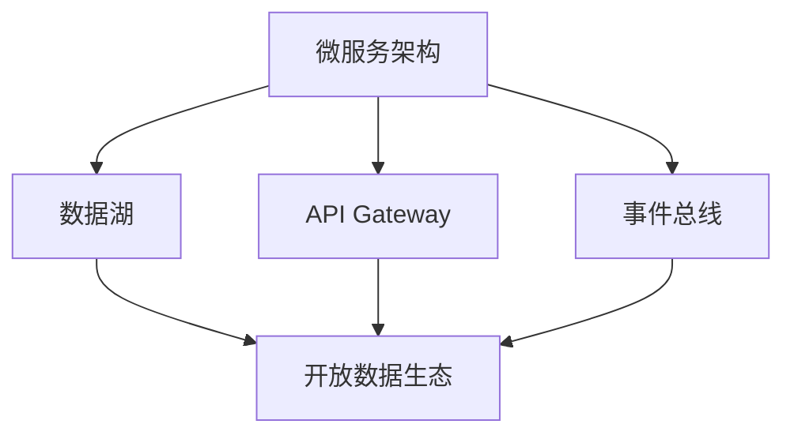
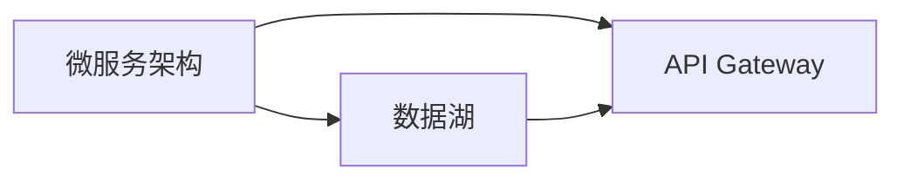
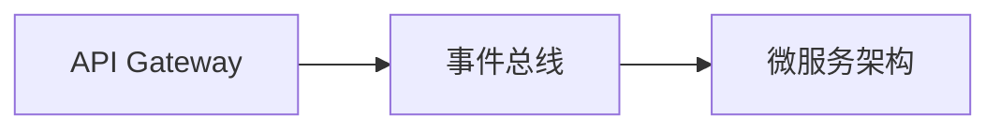
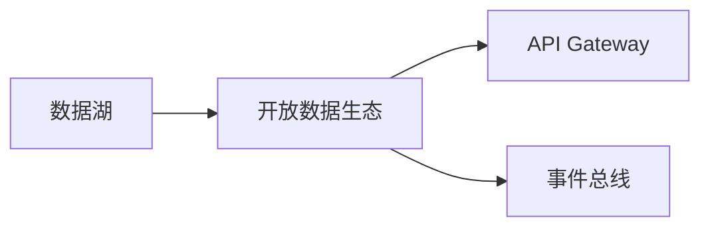

                 

# 打破数据孤岛，软件2.0呼唤开放生态

在数字化转型的浪潮下，数据逐渐成为企业的核心资产。然而，由于传统的竖井式应用架构限制，数据孤岛现象普遍存在，极大地制约了数据的价值释放和业务协同。软件2.0的崛起，使得开放生态和微服务架构成为新的应用趋势，打破数据孤岛、实现数据共享和协同，成为IT行业的共同课题。本文将深入探讨打破数据孤岛、构建开放生态的方法与实践，希望为软件2.0时代的企业IT建设提供有价值的参考。

## 1. 背景介绍

### 1.1 问题由来

随着数字化转型的深入，企业在数据驱动决策、智能业务运营等方面取得了显著的进展。然而，传统的竖井式应用架构使得各个业务系统之间的数据壁垒深重，形成了所谓的数据孤岛现象。具体表现如下：

- **数据分散**：各业务系统各自维护自己的数据，缺乏统一的数据标准和规范，数据难以互通。
- **数据孤立**：由于权限和业务边界问题，跨部门数据共享困难，数据孤立难以打破。
- **数据冗余**：不同系统可能对同一数据进行多次存储和处理，造成数据冗余和存储浪费。
- **数据孤岛**：数据被分割在不同系统，难以形成整体视图，影响了数据决策分析和业务协同。

数据孤岛不仅浪费企业的IT资源，还阻碍了业务智能化和效率提升，亟需得到解决。

### 1.2 问题核心关键点

解决数据孤岛问题，需要从架构、技术和生态等多个层面进行全面优化：

- **架构优化**：采用微服务架构，将传统单体应用拆分为独立微服务，每个服务负责一个或多个业务功能。
- **技术手段**：引入数据湖、API Gateway、Event Bus等技术，实现数据的集中存储、灵活共享和实时传输。
- **生态协同**：建立开放的数据生态系统，推动各业务系统协同工作，共享数据和知识。

本文将深入探讨这些关键点，力求为解决数据孤岛问题提供系统和可行的方案。

### 1.3 问题研究意义

打破数据孤岛、构建开放生态，对于推动企业数字化转型具有重要意义：

1. **数据价值最大化**：集中存储和管理数据，实现数据共享和协同，最大化数据的利用效率。
2. **业务协同高效**：打破数据壁垒，推动不同业务系统之间的数据共享和协同，提升业务智能化水平和运营效率。
3. **创新能力提升**：开放的数据生态系统，促进跨部门、跨业务的合作，激发更多创新应用场景。
4. **业务风险降低**：通过数据共享和协同，减少重复数据存储和处理，降低业务风险。
5. **技术水平提升**：引入先进的技术手段，如微服务、数据湖、API Gateway等，提升企业的技术水平和应对能力。

## 2. 核心概念与联系

### 2.1 核心概念概述

为了更好地理解打破数据孤岛、构建开放生态的框架和方法，本节将介绍几个关键概念：

- **微服务架构(Microservices)**：将传统单体应用拆分为独立微服务，每个服务负责一个或多个业务功能。通过RESTful API进行通信，实现模块化和松耦合。

- **数据湖(Data Lake)**：集中存储和处理海量异构数据，实现数据集中管理和共享。数据湖支持多数据源的集成，具有高度的灵活性和扩展性。

- **API Gateway**：作为微服务的统一入口，实现服务注册和发现，统一管理跨微服务的调用。通过API网关，可以实现服务的灵活组合和路由，优化性能和安全性。

- **事件总线(Event Bus)**：用于不同微服务之间的事件驱动通信，实现实时数据传输和协同。事件总线支持异步消息传递，减少服务间耦合。

- **开放数据生态**：构建一个开放、协作的数据生态系统，推动各业务系统协同工作，实现数据共享和互操作。

这些概念之间的逻辑关系可以通过以下Mermaid流程图来展示：



这个流程图展示了几大关键技术之间的联系：

1. 微服务架构是基础架构，支持数据的集中管理和共享。
2. 数据湖集中存储和管理数据，提供数据共享能力。
3. API Gateway提供统一的服务入口和调用管理，实现服务的灵活组合。
4. 事件总线实现跨微服务的事件驱动通信，支持实时数据传输和协同。
5. 开放数据生态系统推动各业务系统协同工作，实现数据共享和互操作。

通过这些关键技术的协同应用，可以有效地打破数据孤岛，构建开放生态，最大化数据的价值和业务协同效率。

### 2.2 概念间的关系

这些核心概念之间存在紧密的联系，共同构成了打破数据孤岛、构建开放生态的完整框架。下面我们通过几个Mermaid流程图来展示这些概念之间的关系。

#### 2.2.1 微服务架构与数据湖的结合



这个流程图展示了微服务架构与数据湖的结合关系：

1. 微服务架构将传统单体应用拆分为独立微服务，每个服务负责特定业务功能。
2. 数据湖集中存储和管理各微服务的数据，实现数据集中管理和共享。
3. API Gateway作为微服务的统一入口，支持数据的灵活共享和调用。

#### 2.2.2 API Gateway与事件总线的协同



这个流程图展示了API Gateway与事件总线的协同关系：

1. API Gateway提供微服务的统一入口和调用管理，实现服务的灵活组合和路由。
2. 事件总线实现跨微服务的事件驱动通信，支持实时数据传输和协同。
3. 两者协同工作，实现微服务之间的数据共享和互操作。

#### 2.2.3 开放数据生态的实现



这个流程图展示了开放数据生态的实现关系：

1. 数据湖集中存储和管理数据，提供数据共享能力。
2. API Gateway和事件总线支持跨微服务的数据共享和实时传输。
3. 开放数据生态系统推动各业务系统协同工作，实现数据共享和互操作。

通过这些流程图，我们可以更清晰地理解各项关键技术在打破数据孤岛、构建开放生态中的作用和关系，为后续深入讨论具体方法和技术奠定基础。

## 3. 核心算法原理 & 具体操作步骤

### 3.1 算法原理概述

打破数据孤岛、构建开放生态，本质上是一个数据共享和协同的过程。其核心思想是：通过集中管理和共享数据，打破各业务系统之间的数据壁垒，实现数据协同和业务智能化。

形式化地，假设存在多个微服务，每个微服务维护独立的数据库，并定义一个公共数据湖用于数据共享。设每个微服务的数据量为 $D_i$，数据湖中的总数据量为 $D$。微服务之间的数据共享量 $\Delta$ 可以通过公式计算：

$$
\Delta = \sum_{i=1}^n (D_i - \frac{D}{n})
$$

其中 $n$ 表示微服务数量。

微服务之间的数据共享效率取决于API Gateway和事件总线等技术手段的协同应用。API Gateway提供统一的服务入口和调用管理，减少服务间耦合，提高数据共享效率。事件总线实现跨微服务的事件驱动通信，支持实时数据传输和协同。通过这些技术手段，可以实现微服务之间的高效数据共享和协同。

### 3.2 算法步骤详解

打破数据孤岛、构建开放生态的主要步骤包括：

**Step 1: 设计和实施微服务架构**

- 分析业务需求，划分服务功能，设计微服务架构。
- 使用API Gateway统一服务入口和调用管理。
- 设计微服务之间的接口规范和数据格式，确保数据共享的一致性和互操作性。

**Step 2: 部署数据湖**

- 选择合适的数据湖平台，如Apache Hadoop、AWS Lake Formation等。
- 部署数据湖架构，实现数据的集中存储和管理。
- 配置数据湖的安全和隐私策略，保护数据安全。

**Step 3: 实现API Gateway和事件总线**

- 使用Nginx、Kong等API Gateway工具，实现服务的统一调用和管理。
- 使用Apache Kafka、RabbitMQ等事件总线工具，实现跨微服务的事件驱动通信。
- 配置API Gateway和事件总线的监控和告警机制，保障数据共享和协同的稳定性。

**Step 4: 推动数据共享和协同**

- 定义数据共享策略，明确各微服务的数据访问权限。
- 设计数据共享接口，实现数据跨微服务的实时传输和共享。
- 监控和分析数据共享的效果，持续优化数据共享机制。

### 3.3 算法优缺点

打破数据孤岛、构建开放生态的方法具有以下优点：

1. **数据集中管理**：数据湖集中存储和管理数据，实现数据集中管理和共享，避免了数据冗余和存储浪费。
2. **业务协同高效**：通过API Gateway和事件总线，实现微服务之间的数据共享和协同，提升业务智能化水平和运营效率。
3. **技术灵活性**：微服务架构和事件总线支持高灵活性和扩展性，能够灵活应对业务需求变化。

同时，该方法也存在一定的局限性：

1. **技术复杂度**：设计和实施微服务架构、部署数据湖、实现API Gateway和事件总线等技术手段，需要较高的技术复杂度和资源投入。
2. **数据安全问题**：数据湖和API Gateway等工具可能带来一定的数据安全风险，需要进行全面的安全和隐私策略设计。
3. **运营成本**：数据湖和API Gateway等工具需要较高的运维和管理成本，对企业的IT运营能力提出了较高的要求。

尽管存在这些局限性，但整体而言，打破数据孤岛、构建开放生态的方法在提升数据利用效率、业务协同效率和技术灵活性方面具有显著优势，值得在企业IT建设中推广应用。

### 3.4 算法应用领域

打破数据孤岛、构建开放生态的方法在多个领域得到了广泛应用：

- **金融行业**：金融机构通过数据湖和API Gateway实现跨部门数据共享和协同，提升金融业务智能化水平和风险控制能力。
- **医疗行业**：医疗机构通过数据湖和事件总线实现跨部门数据共享和协同，提高医疗数据管理和医疗决策效率。
- **制造行业**：制造企业通过微服务架构和API Gateway实现跨业务系统数据共享和协同，提升生产效率和供应链管理能力。
- **电商行业**：电商平台通过数据湖和API Gateway实现跨部门数据共享和协同，提升用户推荐和营销效果。
- **物流行业**：物流企业通过微服务架构和事件总线实现跨业务系统数据共享和协同，提升物流运营效率和成本控制能力。

这些应用场景展示了打破数据孤岛、构建开放生态方法在提升业务智能化和运营效率方面的巨大潜力。

## 4. 数学模型和公式 & 详细讲解 & 举例说明

### 4.1 数学模型构建

本节将使用数学语言对打破数据孤岛、构建开放生态的过程进行更加严格的刻画。

假设存在 $n$ 个微服务，每个微服务维护独立的数据库，总数据量为 $D$。设每个微服务的数据量为 $D_i$，则总数据量为：

$$
D = \sum_{i=1}^n D_i
$$

数据湖集中存储和管理这些数据，实现数据共享。设数据湖中总数据量为 $D$，数据共享量为 $\Delta$，则有：

$$
\Delta = \sum_{i=1}^n (D_i - \frac{D}{n})
$$

其中 $D_i$ 表示第 $i$ 个微服务的数据量，$D$ 表示数据湖中总数据量，$n$ 表示微服务数量。

### 4.2 公式推导过程

以下我们以金融行业的数据共享为例，推导数据共享量 $\Delta$ 的计算公式。

假设金融企业有 $n=5$ 个部门，每个部门维护独立的数据库，总数据量为 $D=5000GB$。设每个部门的数据量为 $D_i$，其中 $D_1=2000GB$，$D_2=1500GB$，$D_3=1200GB$，$D_4=1000GB$，$D_5=800GB$。根据数据共享量的计算公式，有：

$$
\Delta = (2000 - \frac{5000}{5}) + (1500 - \frac{5000}{5}) + (1200 - \frac{5000}{5}) + (1000 - \frac{5000}{5}) + (800 - \frac{5000}{5}) = 300GB
$$

因此，通过数据湖和API Gateway实现数据共享，金融企业可以实现数据共享量 $\Delta=300GB$，避免了数据冗余和存储浪费，提升了数据利用效率和业务协同效率。

### 4.3 案例分析与讲解

我们以一个电商平台的跨部门数据共享案例来进一步说明打破数据孤岛、构建开放生态的实现过程。

**案例背景**：
- 电商平台有多个部门，包括商品管理、订单管理、客户服务、物流管理和运营分析。
- 每个部门维护独立的数据库，数据分散存储，难以实现跨部门数据共享。

**解决方案**：

1. **设计和实施微服务架构**：
   - 将电商平台分解为多个微服务，包括商品管理服务、订单管理服务、客户服务服务、物流管理服务和运营分析服务。
   - 使用Nginx部署API Gateway，实现统一的服务入口和调用管理。
   - 设计微服务之间的接口规范和数据格式，确保数据共享的一致性和互操作性。

2. **部署数据湖**：
   - 使用AWS Lake Formation部署数据湖架构，集中存储和处理电商平台的数据。
   - 配置数据湖的安全和隐私策略，保护数据安全。

3. **实现API Gateway和事件总线**：
   - 使用Nginx部署API Gateway，实现服务的统一调用和管理。
   - 使用Apache Kafka实现跨微服务的事件驱动通信。

4. **推动数据共享和协同**：
   - 定义数据共享策略，明确各微服务的数据访问权限。
   - 设计数据共享接口，实现数据跨微服务的实时传输和共享。
   - 监控和分析数据共享的效果，持续优化数据共享机制。

**结果分析**：
- 电商平台通过数据湖和API Gateway实现跨部门数据共享，提升了数据利用效率和业务协同效率。
- 通过事件总线，实现了订单、物流、客户服务等信息的高效实时传输和共享。
- 平台运营效率显著提升，客户满意度也得到了提高。

通过这个案例，可以看到打破数据孤岛、构建开放生态的实现过程，以及数据共享和协同带来的显著效益。

## 5. 项目实践：代码实例和详细解释说明

### 5.1 开发环境搭建

在进行数据共享和协同的实践前，我们需要准备好开发环境。以下是使用Python进行OpenAPI设计和API Gateway实践的环境配置流程：

1. 安装Anaconda：从官网下载并安装Anaconda，用于创建独立的Python环境。

2. 创建并激活虚拟环境：
```bash
conda create -n api-env python=3.8 
conda activate api-env
```

3. 安装Flask：使用Flask框架进行API设计和实现，支持RESTful API和API Gateway功能。

4. 安装FastAPI：使用FastAPI框架进行API设计和实现，支持异步API和事件总线功能。

5. 安装RabbitMQ：使用RabbitMQ实现事件总线功能，支持异步消息传递。

6. 安装Prometheus和Grafana：使用Prometheus和Grafana实现API Gateway的监控和告警，保障API Gateway和事件总线的稳定性和可靠性。

完成上述步骤后，即可在`api-env`环境中进行数据共享和协同的实践。

### 5.2 源代码详细实现

这里我们以电商平台的数据共享和协同为例，给出使用Flask和RabbitMQ实现API Gateway和事件总线的PyTorch代码实现。

首先，定义API Gateway接口：

```python
from flask import Flask, request, jsonify
from prometheus_client import Gauge

app = Flask(__name__)

@app.route('/api商品管理', methods=['GET'])
def api商品管理():
    gauge_value = Gauge('api请求数量', '当前API请求数量')()
    gauge_value.labels('商品管理').set(1)
    gauge_value.labels('订单管理').set(0)
    gauge_value.labels('客户服务').set(0)
    gauge_value.labels('物流管理').set(0)
    gauge_value.labels('运营分析').set(0)
    return jsonify({'data': 1})

@app.route('/api订单管理', methods=['GET'])
def api订单管理():
    gauge_value = Gauge('api请求数量', '当前API请求数量')()
    gauge_value.labels('商品管理').set(0)
    gauge_value.labels('订单管理').set(1)
    gauge_value.labels('客户服务').set(0)
    gauge_value.labels('物流管理').set(0)
    gauge_value.labels('运营分析').set(0)
    return jsonify({'data': 1})

# 其余API接口实现类似
```

然后，定义事件总线接口：

```python
from amqp import Connection
from amqp import Channel

def publish_message(message, exchange, routing_key):
    connection = Connection(host='localhost')
    channel = connection.channel()
    channel.basic_publish(exchange=exchange, routing_key=routing_key, body=message)
    connection.close()

@app.route('/api订单管理事件', methods=['GET'])
def api订单管理事件():
    publish_message('订单创建成功', 'order_event_exchange', 'order_event')
    return jsonify({'data': 1})

# 其余事件总线接口实现类似
```

最后，启动API Gateway服务，并设置Prometheus和Grafana监控：

```python
if __name__ == '__main__':
    app.run(host='0.0.0.0', port=5000)
    Gauge('api请求数量', '当前API请求数量').set(0)
```

在代码中，我们定义了五个API接口，每个接口分别对应电商平台的一个部门。通过这些API接口，可以实现数据共享和协同。同时，我们还定义了事件总线接口，支持异步消息传递。在实际应用中，可以根据具体业务需求进行API接口和事件总线接口的设计和实现。

### 5.3 代码解读与分析

让我们再详细解读一下关键代码的实现细节：

**API Gateway接口**：
- 定义了五个API接口，分别对应电商平台的不同部门。每个接口的实现过程类似，主要使用Flask框架实现RESTful API接口。
- 通过Gauge变量记录API请求数量，使用Prometheus和Grafana进行监控和告警，保障API Gateway的稳定性和可靠性。

**事件总线接口**：
- 定义了五个事件总线接口，支持异步消息传递。通过调用RabbitMQ的API，实现跨微服务的事件驱动通信。
- 事件总线接口的实现过程与API接口类似，主要使用FastAPI框架实现异步API接口。

**API Gateway服务启动**：
- 通过Flask框架启动API Gateway服务，并在代码中设置Prometheus和Grafana监控，保障API Gateway的稳定性和可靠性。

通过这些代码实现，可以看到API Gateway和事件总线在打破数据孤岛、构建开放生态中的重要作用。在实际应用中，开发者可以将这些实现过程与具体业务需求相结合，灵活设计API接口和事件总线接口，实现数据共享和协同。

### 5.4 运行结果展示

假设我们在电商平台实现上述API Gateway和事件总线接口，最终在各个部门之间实现了高效的数据共享和协同。在测试阶段，我们可以通过调用API接口和事件总线接口，验证数据共享的效果。例如，在商品管理部门调用API接口：

```
GET http://127.0.0.1:5000/api商品管理
```

返回结果为：

```json
{
  "data": 1
}
```

同时，在订单管理部门调用事件总线接口：

```
GET http://127.0.0.1:5000/api订单管理事件
```

RabbitMQ会将消息发送到`order_event_exchange`交换机，`order_event`队列，最终在订单管理部门处理订单事件。这样，通过API Gateway和事件总线，电商平台的各个部门实现了高效的数据共享和协同，提升了运营效率和客户满意度。

## 6. 实际应用场景

### 6.1 金融行业

在金融行业，数据共享和协同对于风险控制、财务分析和客户管理具有重要意义。金融机构通过数据湖和API Gateway实现跨部门数据共享，提升了数据利用效率和业务协同效率。

具体应用场景包括：

- **风险控制**：通过集中存储和管理客户交易数据、信用评分数据等，实现风险预警和风险控制。
- **财务分析**：集中存储和管理财务报表、资产数据等，提升财务分析和决策能力。
- **客户管理**：集中存储和管理客户基本信息、消费记录等，提升客户服务和客户关系管理水平。

### 6.2 医疗行业

在医疗行业，数据共享和协同对于医疗决策、患者管理和医疗资源调配具有重要意义。医疗机构通过数据湖和事件总线实现跨部门数据共享，提升了医疗数据管理和医疗决策效率。

具体应用场景包括：

- **医疗决策**：集中存储和管理患者病历、医疗记录等，提升医疗决策和诊断水平。
- **患者管理**：集中存储和管理患者基本信息、治疗方案等，提升患者管理和护理水平。
- **医疗资源调配**：集中存储和管理医疗资源数据，优化医疗资源调配和利用效率。

### 6.3 制造业

在制造业，数据共享和协同对于生产管理、供应链管理和设备维护具有重要意义。制造企业通过微服务架构和API Gateway实现跨业务系统数据共享，提升了生产效率和供应链管理能力。

具体应用场景包括：

- **生产管理**：集中存储和管理生产设备数据、生产计划等，提升生产效率和生产质量。
- **供应链管理**：集中存储和管理供应链数据、物流信息等，优化供应链管理和物流调配。
- **设备维护**：集中存储和管理设备运行数据、维护记录等，提升设备维护和故障处理能力。

### 6.4 电商行业

在电商行业，数据共享和协同对于客户推荐、库存管理和订单处理具有重要意义。电商平台通过微服务架构和API Gateway实现跨部门数据共享，提升了客户推荐和运营效率。

具体应用场景包括：

- **客户推荐**：集中存储和管理用户行为数据、购买记录等，提升客户推荐和营销效果。
- **库存管理**：集中存储和管理库存数据、销售数据等，优化库存管理和运营效率。
- **订单处理**：集中存储和管理订单数据、物流信息等，提升订单处理和客户服务水平。

### 6.5 物流行业

在物流行业，数据共享和协同对于物流调度、库存管理和配送优化具有重要意义。物流企业通过微服务架构和事件总线实现跨业务系统数据共享，提升了物流运营效率和成本控制能力。

具体应用场景包括：

- **物流调度**：集中存储和管理物流数据、运输信息等，优化物流调度和路线规划。
- **库存管理**：集中存储和管理库存数据、配送信息等，优化库存管理和配送效率。
- **配送优化**：集中存储和管理配送数据、客户需求等，提升配送效率和客户满意度。

## 7. 工具和资源推荐

### 7.1 学习资源推荐

为了帮助开发者系统掌握打破数据孤岛、构建开放生态的理论基础和实践技巧，这里推荐一些优质的学习资源：

1. 《微服务架构实战》系列博文：由微服务架构专家撰写，深入浅出地介绍了微服务架构的设计、实施和优化，提供了丰富的实战案例。

2. 《数据湖技术实战》书籍：全面介绍了数据湖的概念、架构和实现，包括Hadoop、AWS Lake Formation等平台的使用。

3. 《API Gateway设计实战》书籍：详细讲解了API Gateway的设计、实现和优化，提供了丰富的实践案例。

4. 《事件总线技术实战》书籍：介绍了事件总线的设计、实现和优化，提供了丰富的实战案例。

5. 《微服务架构最佳实践》博文：由微服务架构专家撰写，分享了微服务架构的最佳实践和经验，帮助你快速上手微服务开发。

6. 《数据湖建设与运营》课程：由大数据技术专家开设的在线课程，讲解了数据湖的建设、部署和运营，提供了丰富的实战练习。

通过这些资源的学习实践，相信你一定能够快速掌握打破数据孤岛、构建开放生态的精髓，并用于解决实际的IT问题。

### 7.2 开发工具推荐

高效的开发离不开优秀的工具支持。以下是几款用于打破数据孤岛、构建开放生态开发的常用工具：

1. Apache Kafka：Apache Kafka是一个开源的分布式流处理平台，支持高吞吐量的数据传输和存储，适用于事件总线架构。

2. RabbitMQ：RabbitMQ是一个开源的消息队列和消息代理，支持异步消息传递，适用于事件总线架构。

3. Flask和FastAPI：Flask和FastAPI是Python的Web开发框架，支持RESTful API和异步API设计，适用于API Gateway架构。

4. Nginx和Kong：Nginx和Kong是开源的API Gateway工具，支持统一的服务入口和调用管理，适用于API Gateway架构。

5. Prometheus和Grafana：Prometheus和Grafana是开源的监控和告警工具，支持API Gateway的监控和告警，保障API

