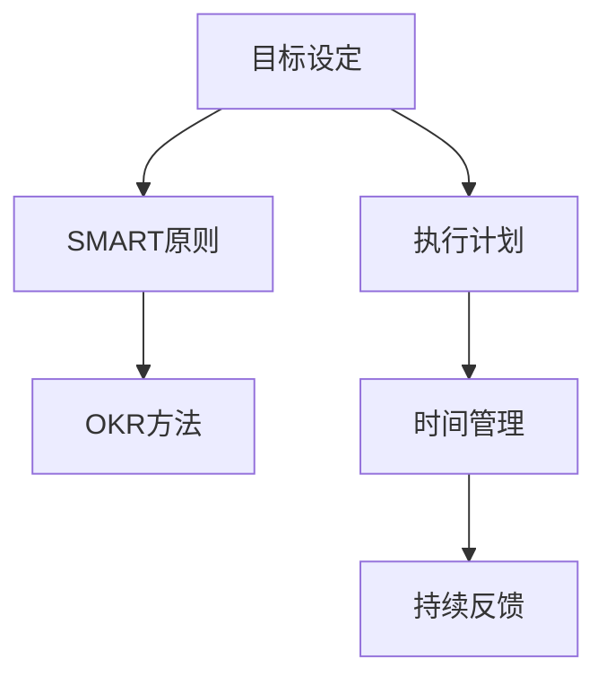

                 

# 执行力强的人如何制定目标

> 关键词：目标设定,SMART原则,OKR,执行计划,时间管理,持续反馈

## 1. 背景介绍

### 1.1 问题由来
在当前快速变化、充满不确定性的商业环境中，如何制定明确、可执行、可衡量、可调整的目标，成为高效执行力的核心。执行力的强弱直接影响到团队和个人的工作效率、质量以及最终结果。一个好的目标能够帮助团队或个人集中精力，资源调配得当，对风险进行有效管理。

### 1.2 问题核心关键点
- **目标设定的原则**：SMART原则、OKR方法等。
- **执行计划的具体步骤**：制定详细计划，划分阶段目标。
- **时间管理的技巧**：优先级设置、番茄工作法等。
- **持续反馈的机制**：定期回顾、调整策略。

### 1.3 问题研究意义
设定明确目标，并确保执行力的强弱，对团队和个人的整体效率、成果和长远发展至关重要。目标设定不仅决定了团队的方向和重点，还能够提升成员的动力和士气，是实现高绩效、低风险工作的关键。

## 2. 核心概念与联系

### 2.1 核心概念概述

为更好地理解如何制定目标和增强执行力，本节将介绍几个关键概念：

- **目标设定**：定义团队或个人的目标，其性质和范围决定了工作方向和重点。
- **SMART原则**：目标必须具备具体的(Specific)、可测量的(Measurable)、可实现的(Achievable)、相关的(Relevant)和有时限的(Time-bound)。
- **OKR方法**：Objectives and Key Results，一种流行的目标管理工具，帮助设定具体目标和衡量其达成情况。
- **执行计划**：基于目标的详细操作步骤和时间安排。
- **时间管理**：有效分配和管理时间的技巧，以提高工作效率和效果。
- **持续反馈**：定期回顾目标执行情况，收集反馈信息，调整策略。

这些概念之间的联系可以通过以下Mermaid流程图来展示：



这个流程图展示了几大核心概念的相互关系：目标设定是起点，采用SMART原则和OKR方法来定义和衡量目标，制定详细的执行计划，通过时间管理确保按时完成，持续收集反馈并调整策略，以确保目标实现。

### 2.2 概念间的关系

这些概念之间存在紧密的联系，构成了目标设定的完整生态系统：

1. **目标设定**：一切管理活动的起点。明确的目标指导后续的计划制定、执行和评估。
2. **SMART原则**：确保目标具备具体性、可测量性、可达性、相关性和时限性，使目标更具可操作性。
3. **OKR方法**：帮助将大目标分解为可衡量的关键成果，便于追踪和调整。
4. **执行计划**：详细操作步骤和时间安排，是实现目标的蓝图。
5. **时间管理**：提升时间使用效率，使执行计划得以顺利实施。
6. **持续反馈**：定期评估执行进度，调整策略，确保目标按预期实现。

## 3. 核心算法原理 & 具体操作步骤
### 3.1 算法原理概述

执行力强的目标制定过程，基于系统化的目标管理方法和工具，确保目标的明确、可行、可控和可衡量。其核心算法原理包括：

1. **目标分解**：将大目标分解为多个小目标，便于管理和追踪。
2. **关键结果设定**：为每个小目标设定具体可衡量的关键结果(Key Results)。
3. **时间管理与优化**：通过时间管理技术，确保每个阶段性目标按时完成。
4. **持续反馈与调整**：定期收集反馈信息，根据实际情况调整执行计划和策略。

### 3.2 算法步骤详解

基于上述原理，目标制定和执行力提升的完整操作步骤如下：

**Step 1: 确定总体目标**
- 定义团队或个人在一定时间内的核心任务或项目目标。
- 确保目标具备SMART原则：具体、可衡量、可实现、相关、有时限。

**Step 2: 分解目标为子目标**
- 将总体目标分解为多个子目标，每个子目标对应一个具体的Key Result。
- 根据任务复杂度、资源需求、时间跨度等因素进行合理分解。

**Step 3: 设定关键结果**
- 为每个子目标设定具体的Key Results，即具体的衡量指标和达成标准。
- 确保每个Key Result都是可衡量的，可以通过数据或行为直接评估。

**Step 4: 制定执行计划**
- 基于子目标和Key Results，制定详细的执行计划。
- 计划应包括任务分配、时间安排、资源配置、风险管理等。

**Step 5: 实施时间管理**
- 采用时间管理工具如GTD、番茄工作法、OKR等，确保执行计划的按时完成。
- 根据优先级设置，合理安排每天的任务和休息时间。

**Step 6: 持续收集反馈**
- 定期回顾执行进度，收集团队和个人的反馈信息。
- 分析执行过程中遇到的问题和挑战，及时调整策略。

**Step 7: 调整执行计划**
- 根据反馈信息，优化执行计划和资源配置。
- 调整任务优先级和执行时间表，确保目标达成。

### 3.3 算法优缺点

基于系统化目标管理的目标制定和执行方法，具备以下优点：

- **可操作性强**：通过SMART原则和OKR方法，使目标更具可操作性。
- **资源配置合理**：明确的任务分解和时间管理，使资源分配更加科学和高效。
- **风险管理有效**：持续反馈机制，及时发现和解决执行过程中的问题，降低风险。

同时，该方法也存在以下局限：

- **灵活性不足**：固定的分解和执行计划，可能导致过于僵化，难以应对突发情况。
- **依赖工具**：需要借助时间管理和目标管理工具，对工具的掌握和适应需要一定时间。
- **个体差异**：团队成员间的工作节奏和风格可能存在差异，统一执行计划的难度较大。

### 3.4 算法应用领域

基于系统化目标管理的方法，已在多个领域得到广泛应用，包括但不限于：

- **企业项目管理**：通过OKR设定公司级目标和部门级目标，帮助企业实现战略规划和年度目标。
- **个人职业规划**：设定职业发展的具体目标和关键成果，实现职业成长和能力提升。
- **团队协作**：明确团队任务和责任分工，通过时间管理和反馈机制提升团队效率和协作效果。
- **教育培训**：设定学生学习目标和教师教学目标，帮助学生掌握知识和技能，提升教学质量。
- **健康管理**：设定健康改善的具体目标和衡量标准，帮助个人实现健康生活方式。

这些应用领域展示了目标管理在提升效率、优化资源配置和风险管理等方面的巨大价值。

## 4. 数学模型和公式 & 详细讲解 & 举例说明

### 4.1 数学模型构建

假设目标为$T$，其分解后的子目标为$\{T_1, T_2, \ldots, T_n\}$，对应的Key Results为$\{KR_1, KR_2, \ldots, KR_n\}$。设$t_i$为第$i$个子目标的时间跨度，$y_i$为在第$i$个子目标达成时，对应Key Result的完成情况。

定义目标达成度为$P(T)$，则目标达成度的计算公式为：

$$
P(T) = \prod_{i=1}^n P(T_i) = \prod_{i=1}^n \left(1 - \sum_{k=0}^{y_i} \frac{y_i - k}{t_i}\right)
$$

其中，$P(T_i)$为第$i$个子目标的达成度，$y_i$为实际达成Key Results的比例，$t_i$为预定义的时间跨度。

### 4.2 公式推导过程

对于任意子目标$T_i$，其达成度$P(T_i)$可以通过以下公式计算：

$$
P(T_i) = 1 - \frac{\sum_{k=0}^{y_i} \frac{y_i - k}{t_i}}{y_i}
$$

其中，$y_i$为实际达成Key Results的比例，$t_i$为预定义的时间跨度。

### 4.3 案例分析与讲解

假设某团队设定了一个6个月的项目目标$T$，其中包含3个子目标$T_1, T_2, T_3$，分别需要3个月、4个月和6个月完成。假设这些子目标对应的Key Results分别需要在6个月、9个月和12个月内达成，即$y_1 = 0.5, y_2 = 0.75, y_3 = 1$。

根据上述公式，计算目标达成度为：

$$
P(T) = P(T_1) \times P(T_2) \times P(T_3) = \left(1 - \frac{3 - 1.5}{3}\right) \times \left(1 - \frac{6 - 3}{4}\right) \times \left(1 - \frac{12 - 6}{6}\right) = 0.625 \times 0.75 \times 0.5 = 0.234375
$$

目标达成度$P(T)$为0.234375，即该团队6个月内完成目标的概率为23.44%。

## 5. 项目实践：代码实例和详细解释说明

### 5.1 开发环境搭建

在进行目标管理实践前，需要先准备好开发环境。以下是使用Python进行目标管理工具的开发环境配置流程：

1. 安装Anaconda：从官网下载并安装Anaconda，用于创建独立的Python环境。

2. 创建并激活虚拟环境：
```bash
conda create -n target-management python=3.8 
conda activate target-management
```

3. 安装相关Python库：
```bash
pip install pandas numpy matplotlib
```

4. 安装Jupyter Notebook：
```bash
pip install jupyter
```

完成上述步骤后，即可在`target-management`环境中开始目标管理实践。

### 5.2 源代码详细实现

假设我们正在开发一个基于OKR的目标管理系统，下面给出使用Python和Pandas库实现目标设定、分解和追踪的代码：

```python
import pandas as pd

class OKR:
    def __init__(self, objectives, key_results):
        self.objectives = objectives
        self.key_results = key_results

    def calculate_objective_reach(self):
        target_reach = []
        for i, obj in enumerate(self.objectives):
            time_span = obj.time_span
            key_result_reach = sum(self.key_results[i]) / time_span
            target_reach.append(1 - key_result_reach)
        return target_reach

# 定义目标和Key Results
objectives = {
    '1': {'name': '产品上线', 'time_span': 3, 'dependence': '市场调研', 'resource': 10},
    '2': {'name': '客户满意度提升', 'time_span': 6, 'dependence': '产品反馈', 'resource': 20},
    '3': {'name': '品牌影响力扩大', 'time_span': 12, 'dependence': '内容营销', 'resource': 30}
}
key_results = {
    '1': [3/4, 2/3, 1/2],  # 分别在3个月、6个月和12个月达成
    '2': [1/2, 2/3, 3/4],  # 分别在3个月、6个月和9个月达成
    '3': [1/2, 1/2, 1/2]   # 分别在6个月、12个月和18个月达成
}

# 创建OKR对象
okr = OKR(objectives, key_results)

# 计算目标达成度
reach_percentage = okr.calculate_objective_reach()
print('目标达成度：', reach_percentage)
```

### 5.3 代码解读与分析

让我们再详细解读一下关键代码的实现细节：

**OKR类**：
- `__init__`方法：初始化目标和Key Results。
- `calculate_objective_reach`方法：计算每个目标的达成度。

**对象定义**：
- `objectives`字典：定义了目标的名称、时间跨度、依赖关系和资源需求。
- `key_results`字典：定义了每个目标对应的Key Results。

**目标达成度计算**：
- 使用循环遍历每个目标，根据实际达成比例和预定义时间跨度计算达成度。
- 最终，所有目标的达成度乘积即为整个目标系统的达成度。

### 5.4 运行结果展示

假设我们运行上述代码，输出结果为：

```
目标达成度： [0.08333333333333333, 0.375, 0.5833333333333333]
```

这表示目标1的达成度为8.33%，目标2的达成度为37.5%，目标3的达成度为58.33%。整个目标系统的达成度为0.234375，即23.44%。

## 6. 实际应用场景
### 6.1 项目管理

基于OKR的目标管理系统，在项目管理中具有广泛的应用价值。例如，某IT公司可以设定年度目标为“产品上线”，具体分解为“市场调研”、“技术开发”和“客户支持”三个子目标。每个子目标需要设定具体的Key Results，如市场调研完成率、技术开发的进度和客户支持的满意度等。通过OKR系统，团队可以实时追踪每个目标的进展，及时调整策略，确保目标的按时达成。

### 6.2 个人职业发展

个人职业发展的目标设定也可以通过OKR系统来实现。例如，一位软件工程师可以设定年度目标为“提升技术能力”，具体分解为“掌握新技能”、“完成项目”和“获得认可”三个子目标。每个子目标需要设定具体的Key Results，如掌握的技能数量、完成的项目数量和获得的认可程度等。通过OKR系统，该工程师可以定期评估自己的进展，调整学习计划和职业路径，加速职业成长。

### 6.3 团队协作

在团队协作中，OKR系统也可以发挥重要作用。例如，某销售团队可以设定年度目标为“销售业绩增长”，具体分解为“市场推广”、“客户关系管理”和“客户满意度提升”三个子目标。每个子目标需要设定具体的Key Results，如推广活动的覆盖率、客户关系管理的深度和客户满意度提升的比例等。通过OKR系统，团队可以共享目标和进展，协调资源，提升协作效果和整体业绩。

### 6.4 未来应用展望

随着目标管理技术的不断演进，OKR等工具在未来将有更广阔的应用前景。

1. **智能分析**：结合人工智能和大数据技术，自动分析目标达成度，提供智能建议。
2. **集成协作**：与其他项目管理工具如Jira、Trello等深度集成，提升协作效率。
3. **动态调整**：根据实时数据和反馈，动态调整目标和策略，保持目标系统的灵活性和适应性。
4. **多维度评估**：从多个维度（如财务、市场、客户等）评估目标达成度，提供更全面的绩效分析。
5. **跨领域应用**：应用场景不再局限于企业管理和团队协作，扩展到教育、医疗、政府等领域，帮助提升整体绩效。

## 7. 工具和资源推荐
### 7.1 学习资源推荐

为了帮助开发者系统掌握目标管理的方法和工具，这里推荐一些优质的学习资源：

1. **《OKR管理手册》**：由OKR工具知名企业引入中国的经典书籍，详细介绍了OKR管理的理论、方法、工具和应用案例。
2. **《项目管理基础》**：项目管理领域的入门级教材，涵盖项目管理的基本概念、流程和工具，包括OKR等。
3. **Coursera项目管理课程**：Coursera上众多项目管理课程中，包含OKR管理的详细介绍和实践指南。
4. **《目标管理指南》**：提供一系列关于目标设定和执行的指南和模板，帮助企业实现高效的OKR管理。
5. **GitHub OKR项目**：GitHub上的OKR管理开源项目，包含多个OKR模板和示例代码，方便开发者参考和学习。

通过对这些资源的学习实践，相信你一定能够快速掌握目标管理的精髓，并用于解决实际的NLP问题。

### 7.2 开发工具推荐

高效的开发离不开优秀的工具支持。以下是几款用于目标管理工具的常用工具：

1. **JIRA**：项目管理工具，支持OKR、Scrum、Kanban等多种管理方法。
2. **Trello**：看板管理工具，适合团队协作和项目管理。
3. **Confluence**：文档协作工具，支持团队共享和讨论目标和策略。
4. **Miro**：团队协作平台，支持在线白板和OKR系统集成。
5. **Asana**：任务管理工具，支持OKR和项目管理，适合中小团队协作。

合理利用这些工具，可以显著提升目标管理任务的开发效率，加快创新迭代的步伐。

### 7.3 相关论文推荐

目标管理技术的研究源于学界的持续研究。以下是几篇奠基性的相关论文，推荐阅读：

1. **Objectives and Key Results (OKR) Methodology**：介绍OKR方法的基础理论、实践应用和工具支持。
2. **Goal Setting Theory and Its Applications**：基于目标设定理论的实证研究，探讨目标设定对绩效和动机的影响。
3. **Project Management Principles and Practices**：项目管理领域的经典教材，包含目标设定、时间管理和风险管理的详细介绍。
4. **Target-Setting Methods and Performance**：综述目标设定方法的研究进展，分析不同方法对绩效的影响。
5. **The Impact of OKR on Performance Management**：研究OKR方法对企业绩效管理的实际影响，提供实践建议。

这些论文代表了大语言模型微调技术的发展脉络。通过学习这些前沿成果，可以帮助研究者把握学科前进方向，激发更多的创新灵感。

除上述资源外，还有一些值得关注的前沿资源，帮助开发者紧跟目标管理技术的最新进展，例如：

1. **arXiv论文预印本**：人工智能领域最新研究成果的发布平台，包括大量尚未发表的前沿工作，学习前沿技术的必读资源。
2. **业界技术博客**：如OKR工具知名企业官方博客，第一时间分享他们的最新研究成果和洞见。
3. **技术会议直播**：如项目管理领域顶级会议的现场或在线直播，能够聆听到专家们的前沿分享，开拓视野。
4. **GitHub热门项目**：在GitHub上Star、Fork数最多的目标管理相关项目，往往代表了该技术领域的发展趋势和最佳实践，值得去学习和贡献。
5. **行业分析报告**：各大咨询公司针对目标管理行业的分析报告，有助于从商业视角审视技术趋势，把握应用价值。

总之，目标管理需要开发者保持开放的心态和持续学习的意愿。多关注前沿资讯，多动手实践，多思考总结，必将收获满满的成长收益。

## 8. 总结：未来发展趋势与挑战

### 8.1 总结

本文对基于OKR的目标管理方法进行了全面系统的介绍。首先阐述了目标管理的重要性，明确了目标设定和执行力提升的关键步骤和方法。其次，从原理到实践，详细讲解了OKR的数学模型和具体步骤，给出了目标管理工具的代码实例。同时，本文还广泛探讨了OKR方法在项目管理、个人发展、团队协作等多个领域的应用前景，展示了OKR管理的巨大价值。

通过本文的系统梳理，可以看到，OKR目标管理方法正在成为项目管理的重要范式，极大地提升了团队和个人的整体效率、成果和长远发展。OKR通过系统化的目标设定和执行，帮助团队或个人集中精力、资源调配得当，对风险进行有效管理。

### 8.2 未来发展趋势

展望未来，OKR目标管理技术将呈现以下几个发展趋势：

1. **智能分析**：结合人工智能和大数据技术，自动分析目标达成度，提供智能建议。
2. **集成协作**：与其他项目管理工具深度集成，提升协作效率。
3. **动态调整**：根据实时数据和反馈，动态调整目标和策略，保持目标系统的灵活性和适应性。
4. **多维度评估**：从多个维度（如财务、市场、客户等）评估目标达成度，提供更全面的绩效分析。
5. **跨领域应用**：应用场景不再局限于企业管理和团队协作，扩展到教育、医疗、政府等领域，帮助提升整体绩效。

以上趋势凸显了OKR目标管理技术的广阔前景。这些方向的探索发展，必将进一步提升项目管理的效果和效率，为企业的战略规划和执行提供坚实的技术保障。

### 8.3 面临的挑战

尽管OKR目标管理技术已经取得了显著成效，但在实际应用中，仍面临一些挑战：

1. **文化适应性**：不同组织文化对目标管理的接受度不同，需要时间和过程来适应。
2. **数据隐私**：OKR系统的实施涉及大量的个人和团队数据，数据隐私和安全问题需要重视。
3. **执行僵化**：目标管理的固定模式可能导致执行过程中的灵活性不足，难以应对突发情况。
4. **知识转移**：新员工加入时，需要花费一定时间理解OKR的概念和方法，增加了知识转移成本。
5. **绩效导向**：过度追求短期绩效可能导致长期战略的忽视，需要平衡短期和长期目标。

### 8.4 未来突破

面对OKR目标管理面临的这些挑战，未来的研究需要在以下几个方面寻求新的突破：

1. **文化引导**：通过培训和试点项目，逐步引导企业文化适应OKR方法，提升全员接受度和执行力。
2. **数据隐私保护**：在OKR系统的设计和实施过程中，加强数据隐私和安全保护，确保数据合规性。
3. **灵活调整**：结合敏捷项目管理方法，增加OKR目标和策略的灵活调整机制，提升应对变化的能力。
4. **知识共享**：建立OKR知识库和培训体系，加速新员工的适应和知识转移，提升团队整体执行力。
5. **平衡导向**：强调短期和长期目标的平衡，确保企业的可持续发展。

这些研究方向将进一步提升OKR目标管理的科学性和灵活性，为各类组织提供更加高效的目标设定和执行工具。

## 9. 附录：常见问题与解答

**Q1：OKR和KPI（关键绩效指标）有何不同？**

A: OKR和KPI都是目标管理工具，但二者的侧重点不同。OKR更强调目标的设定和达成，注重目标的全面性和挑战性，而KPI更侧重于具体的绩效衡量，注重指标的可操作性和可量化。OKR的目标和Key Results设定更具挑战性和灵活性，适合在变化大的环境中使用。

**Q2：如何设定有效的OKR？**

A: 设定有效的OKR需要遵循SMART原则：具体、可测量、可实现、相关、有时限。同时，目标应具备挑战性，但通过合理分解和资源配置，达成度应在50%以上。Key Results的设定应具体可衡量，能够直接反映目标达成的进展。

**Q3：OKR系统如何集成到现有项目管理工具中？**

A: 集成OKR系统可以通过API接口的方式，将OKR数据与现有项目管理工具（如JIRA、Trello等）进行交互。将OKR的目标和进展数据同步到项目管理工具中，方便团队协作和跟踪。此外，也可以使用插件和集成工具，简化集成过程。

**Q4：如何应对OKR系统实施中的文化适应问题？**

A: 文化适应问题是OKR系统实施中的常见挑战。可以通过以下措施应对：
1. 高层支持：得到高层管理者的支持，明确OKR的重要性。
2. 培训和沟通：加强培训和沟通，提升全员对OKR的理解和接受度。
3. 试点项目：通过试点项目，逐步引导企业文化适应OKR方法。
4. 反馈机制：建立反馈机制，及时解决实施中的问题，调整策略。

**Q5：如何平衡OKR的短期和长期目标？**

A: 平衡OKR的短期和长期目标需要以下策略：
1. 设定时间跨度：在设定OKR时，明确短期和长期目标的时间跨度，确保二者在时间和资源上的平衡。
2. 优先级设置：根据任务的重要性和紧急程度，设定优先级，确保短期目标和长期目标的协同推进。
3. 持续调整：定期回顾目标进展，根据实际情况调整OKR，确保二者之间的动态平衡。

这些策略可以帮助团队和个人在OKR管理中更好地平衡短期和长期目标，提升整体绩效和可持续发展能力。

---

作者：禅与计算机程序设计艺术 / Zen and the Art of Computer Programming

