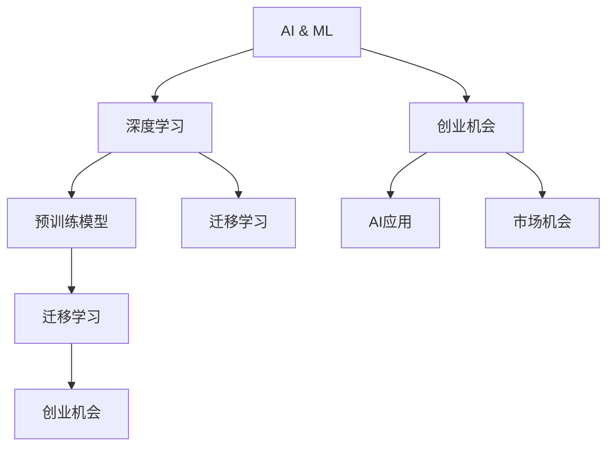

                 

# 技术大爆炸与创业者的兴奋

在过去的几年中，人工智能(AI)和机器学习(ML)技术正在以惊人的速度发展，推动了整个科技行业的革命性变革。作为创业者和AI爱好者，我们亲眼目睹了技术创新的爆发和市场需求的激增，感受到了前所未有的兴奋和机遇。本文将深入探讨这一技术大爆炸的时代背景，分析其对创业者带来的影响，并提供一些思考与见解，以助您在未来的技术风暴中乘风破浪。

## 1. 背景介绍

### 1.1 技术进步的里程碑

在AI和ML领域，最近几年见证了多个具有划时代意义的突破，标志着技术发展的新阶段。以下是几个关键里程碑：

- **深度学习框架的成熟**：TensorFlow、PyTorch等深度学习框架的持续迭代，极大降低了深度学习模型的开发难度，使得AI技术更容易被广泛应用。
- **自然语言处理(NLP)的突破**：BERT、GPT等预训练语言模型的诞生，提升了NLP任务的性能，开启了自动文本生成、情感分析、语音识别等新应用。
- **计算机视觉的飞跃**：YOLO、ResNet等模型在图像识别、物体检测、图像生成等方面的突破，推动了自动驾驶、医疗影像分析、虚拟现实等领域的发展。
- **强化学习的新进展**：AlphaGo的胜利、OpenAI的Gato等模型展示了强化学习在复杂决策问题上的潜力，推动了自动游戏、机器人控制等应用的研究。

### 1.2 创业生态的演化

这些技术进步不仅带来了算法和模型的创新，还催生了多样化的创业生态。初创公司、大型科技公司、科研机构和创业社区纷纷涌现，推动了AI技术在各行各业的应用和普及。创业生态的演化特点如下：

- **跨界融合**：AI技术与其他行业（如医疗、金融、教育）的深度融合，推动了新产品和新服务的开发。
- **开源社区的繁荣**：TensorFlow、PyTorch、HuggingFace等开源平台的发展，吸引了全球开发者共同参与，加速了技术共享和创新。
- **创业投资的热潮**：AI领域的快速发展吸引了大量风险资本的关注，创业者有机会获得更多资金支持。

## 2. 核心概念与联系

### 2.1 核心概念概述

为了更好地理解技术大爆炸对创业者的影响，本节将介绍几个关键概念：

- **AI与ML**：人工智能和机器学习技术的总称，涉及数据驱动的决策、自动化和智能化技术。
- **深度学习**：一种使用神经网络进行建模和预测的机器学习方法，广泛应用于图像识别、语音识别、自然语言处理等领域。
- **预训练模型**：在大量无标签数据上预训练，然后在特定任务上进行微调，提高模型性能的方法。
- **迁移学习**：利用一个领域学到的知识，迁移到另一个领域，提高模型在新领域的泛化能力。
- **创业机会**：指创业者基于市场需求，利用AI技术开发创新产品或服务的可能性。

这些核心概念之间的逻辑关系可以通过以下Mermaid流程图来展示：



这个流程图展示了大爆炸时代下，AI与ML技术的应用路径：

1. 深度学习技术推动了预训练模型的发展。
2. 预训练模型通过迁移学习，提升了在不同领域的泛化能力。
3. AI技术的应用创造了新的创业机会，并引领了市场需求。
4. 创业机会又进一步推动了AI技术在更多场景中的应用和创新。

### 2.2 概念间的关系

这些核心概念之间存在着紧密的联系，形成了技术创新和创业发展的完整生态。以下是几个关键关系：

- **深度学习与AI的关系**：深度学习是AI技术的重要组成部分，通过神经网络模型，实现了对大规模数据的处理和高效建模。
- **预训练与迁移学习的关系**：预训练模型在大量数据上学习通用特征，通过迁移学习，可以快速适应新任务，提升模型性能。
- **创业机会与AI应用的关系**：AI技术的应用创造新的市场机会，创业者可以利用这些机会，开发创新的产品和服务。

## 3. 核心算法原理 & 具体操作步骤

### 3.1 算法原理概述

在大爆炸时代，AI和ML算法不断创新，形成了多样化的技术栈和应用场景。以下是几个关键算法原理：

- **深度学习模型**：通过多层神经网络，实现了对复杂数据的高效处理和模式识别。
- **卷积神经网络(CNN)**：广泛应用于图像识别和视频分析，利用卷积操作提取局部特征。
- **循环神经网络(RNN)**：用于序列数据的建模，如自然语言处理和语音识别。
- **生成对抗网络(GAN)**：通过对抗训练，生成高质量的图像、音频和文本。

### 3.2 算法步骤详解

在大爆炸时代，AI和ML的开发步骤变得更加灵活和高效。以下是几个关键步骤：

1. **数据准备**：收集和标注大量数据，构建训练集和验证集。
2. **模型构建**：选择合适的深度学习框架和模型结构，进行参数初始化。
3. **模型训练**：在训练集上，通过反向传播算法，优化模型参数，最小化损失函数。
4. **模型评估**：在验证集上评估模型性能，调整超参数，避免过拟合。
5. **模型应用**：在实际应用场景中，部署和优化模型，提高性能和效率。

### 3.3 算法优缺点

AI和ML算法在快速发展和应用过程中，也存在一些缺点：

- **算法复杂度**：深度学习模型通常结构复杂，训练时间长，需要大量计算资源。
- **数据依赖**：算法需要大量高质量数据进行训练，获取和标注数据成本较高。
- **模型泛化**：模型的泛化能力可能受限于训练数据的分布，难以应对新数据和新场景。
- **可解释性**：复杂的深度学习模型往往难以解释其内部机制，缺乏透明性。
- **伦理与安全性**：AI模型的决策过程可能存在偏见和安全隐患，需要严格监管和审查。

### 3.4 算法应用领域

AI和ML算法在各个领域的应用日益广泛，包括但不限于：

- **医疗**：AI辅助诊断、个性化治疗、药物发现等。
- **金融**：风险评估、投资分析、智能投顾等。
- **教育**：智能辅导、自动评分、学习分析等。
- **零售**：推荐系统、库存管理、客户服务等。
- **制造业**：质量检测、生产调度、供应链管理等。
- **交通**：自动驾驶、智能交通管理、物流优化等。
- **安防**：人脸识别、行为分析、异常检测等。

## 4. 数学模型和公式 & 详细讲解

### 4.1 数学模型构建

在本节中，我们将使用数学语言对AI和ML模型的构建过程进行更加严格的刻画。

假设我们的目标是构建一个图像识别模型，输入为图像 $x$，输出为标签 $y$。则模型的目标是最大化对数似然函数 $L(y; \theta)$：

$$
L(y; \theta) = \log P(y|x; \theta) = \sum_{i=1}^N \log P(y_i|x_i; \theta)
$$

其中，$P(y|x; \theta)$ 为模型在输入 $x$ 下，输出为 $y$ 的概率分布，$\theta$ 为模型参数。

在实际应用中，我们通常使用反向传播算法，通过梯度下降法优化损失函数：

$$
\theta \leftarrow \theta - \eta \nabla_{\theta} L(y; \theta)
$$

其中，$\eta$ 为学习率，$\nabla_{\theta} L(y; \theta)$ 为损失函数对参数 $\theta$ 的梯度。

### 4.2 公式推导过程

下面以卷积神经网络(CNN)为例，推导其前向传播和反向传播的过程。

在CNN中，通过卷积层、池化层和全连接层，对输入图像进行特征提取和分类。假设输入图像的大小为 $H \times W \times C$，卷积层的过滤器大小为 $K \times K$，步幅为 $S$。则卷积操作可以表示为：

$$
I(x_{ij}) = \sum_{m=0}^{C-1} \sum_{k=0}^{K-1} W_{k,m} \cdot x_{i,j,k,m}
$$

其中，$I$ 为卷积输出，$x_{ij}$ 为输入像素，$W_{k,m}$ 为卷积核权重。

对于池化层，可以通过最大池化或平均池化，将特征图的大小减少一半，从而降低计算复杂度。假设池化窗口大小为 $S$，步幅为 $S$，则池化操作可以表示为：

$$
I(x_{ij}) = \max_{i' \in R} x_{i'+1,i'+2,\ldots,i'+S-1,j'+1,j'+2,\ldots,j'+S-1}
$$

其中，$R$ 为窗口在输入特征图中的位置。

对于全连接层，通过线性变换和激活函数，对池化层的输出进行分类。假设全连接层的大小为 $d$，则前向传播可以表示为：

$$
Z = XW + b
$$

$$
A = \sigma(Z)
$$

其中，$Z$ 为全连接层的输入，$X$ 为池化层的输出，$W$ 为权重矩阵，$b$ 为偏置向量，$\sigma$ 为激活函数。

对于反向传播，通过链式法则计算梯度，更新模型参数：

$$
\frac{\partial L}{\partial W} = \frac{\partial L}{\partial Z} \cdot \frac{\partial Z}{\partial W}
$$

$$
\frac{\partial L}{\partial b} = \frac{\partial L}{\partial Z} \cdot \frac{\partial Z}{\partial b}
$$

$$
\frac{\partial L}{\partial X} = \frac{\partial L}{\partial Z} \cdot \frac{\partial Z}{\partial X}
$$

$$
\frac{\partial L}{\partial x} = \frac{\partial L}{\partial Z} \cdot \frac{\partial Z}{\partial x}
$$

其中，$\frac{\partial L}{\partial Z}$ 为损失函数对输入 $Z$ 的梯度，$\frac{\partial Z}{\partial W}$、$\frac{\partial Z}{\partial b}$ 和 $\frac{\partial Z}{\partial X}$ 分别为损失函数对权重、偏置和输入的梯度。

### 4.3 案例分析与讲解

假设我们要对一组手写数字图像进行分类，构建一个简单的卷积神经网络。以下是完整的代码实现：

```python
import torch
import torch.nn as nn
import torch.optim as optim
from torchvision import datasets, transforms

# 定义CNN模型
class CNN(nn.Module):
    def __init__(self):
        super(CNN, self).__init__()
        self.conv1 = nn.Conv2d(1, 10, kernel_size=5)
        self.conv2 = nn.Conv2d(10, 20, kernel_size=5)
        self.fc1 = nn.Linear(320, 10)
        
    def forward(self, x):
        x = nn.functional.relu(nn.functional.max_pool2d(self.conv1(x), 2))
        x = nn.functional.relu(nn.functional.max_pool2d(self.conv2(x), 2))
        x = x.view(-1, 320)
        x = nn.functional.relu(self.fc1(x))
        return nn.functional.log_softmax(x, dim=1)

# 定义训练函数
def train(model, device, train_loader, optimizer, epoch):
    model.train()
    for batch_idx, (data, target) in enumerate(train_loader):
        data, target = data.to(device), target.to(device)
        optimizer.zero_grad()
        output = model(data)
        loss = nn.functional.nll_loss(output, target)
        loss.backward()
        optimizer.step()

# 加载数据集
train_dataset = datasets.MNIST(root='./data', train=True, download=True, transform=transforms.ToTensor())
test_dataset = datasets.MNIST(root='./data', train=False, download=True, transform=transforms.ToTensor())

train_loader = torch.utils.data.DataLoader(train_dataset, batch_size=64, shuffle=True)
test_loader = torch.utils.data.DataLoader(test_dataset, batch_size=64, shuffle=False)

# 初始化模型和优化器
model = CNN().to(device='cuda')
optimizer = optim.Adam(model.parameters(), lr=0.001)

# 训练模型
for epoch in range(10):
    train(model, device, train_loader, optimizer, epoch)
    test_loss = 0
    correct = 0
    with torch.no_grad():
        for data, target in test_loader:
            data, target = data.to(device), target.to(device)
            output = model(data)
            test_loss += nn.functional.nll_loss(output, target).item()
            pred = output.argmax(dim=1, keepdim=True)
            correct += pred.eq(target.view_as(pred)).sum().item()

    print('Test Loss: %.3f, Accuracy: %3d%% (%3d/%3d)' % (test_loss / len(test_loader), 100 * correct / len(test_loader.dataset), correct, len(test_loader.dataset)))

```

## 5. 项目实践：代码实例和详细解释说明

### 5.1 开发环境搭建

在进行项目实践前，我们需要准备好开发环境。以下是使用Python进行PyTorch开发的环境配置流程：

1. 安装Anaconda：从官网下载并安装Anaconda，用于创建独立的Python环境。

2. 创建并激活虚拟环境：
```bash
conda create -n pytorch-env python=3.8 
conda activate pytorch-env
```

3. 安装PyTorch：根据CUDA版本，从官网获取对应的安装命令。例如：
```bash
conda install pytorch torchvision torchaudio cudatoolkit=11.1 -c pytorch -c conda-forge
```

4. 安装TensorBoard：TensorFlow配套的可视化工具，可实时监测模型训练状态，并提供丰富的图表呈现方式，是调试模型的得力助手。
```bash
pip install tensorboard
```

5. 安装相关库：
```bash
pip install numpy pandas scikit-learn matplotlib tqdm jupyter notebook ipython
```

完成上述步骤后，即可在`pytorch-env`环境中开始项目实践。

### 5.2 源代码详细实现

下面以手写数字图像分类为例，给出使用PyTorch实现卷积神经网络(CNN)的完整代码：

```python
import torch
import torch.nn as nn
import torch.optim as optim
from torchvision import datasets, transforms

# 定义CNN模型
class CNN(nn.Module):
    def __init__(self):
        super(CNN, self).__init__()
        self.conv1 = nn.Conv2d(1, 10, kernel_size=5)
        self.conv2 = nn.Conv2d(10, 20, kernel_size=5)
        self.fc1 = nn.Linear(320, 10)
        
    def forward(self, x):
        x = nn.functional.relu(nn.functional.max_pool2d(self.conv1(x), 2))
        x = nn.functional.relu(nn.functional.max_pool2d(self.conv2(x), 2))
        x = x.view(-1, 320)
        x = nn.functional.relu(self.fc1(x))
        return nn.functional.log_softmax(x, dim=1)

# 定义训练函数
def train(model, device, train_loader, optimizer, epoch):
    model.train()
    for batch_idx, (data, target) in enumerate(train_loader):
        data, target = data.to(device), target.to(device)
        optimizer.zero_grad()
        output = model(data)
        loss = nn.functional.nll_loss(output, target)
        loss.backward()
        optimizer.step()

# 加载数据集
train_dataset = datasets.MNIST(root='./data', train=True, download=True, transform=transforms.ToTensor())
test_dataset = datasets.MNIST(root='./data', train=False, download=True, transform=transforms.ToTensor())

train_loader = torch.utils.data.DataLoader(train_dataset, batch_size=64, shuffle=True)
test_loader = torch.utils.data.DataLoader(test_dataset, batch_size=64, shuffle=False)

# 初始化模型和优化器
model = CNN().to(device='cuda')
optimizer = optim.Adam(model.parameters(), lr=0.001)

# 训练模型
for epoch in range(10):
    train(model, device, train_loader, optimizer, epoch)
    test_loss = 0
    correct = 0
    with torch.no_grad():
        for data, target in test_loader:
            data, target = data.to(device), target.to(device)
            output = model(data)
            test_loss += nn.functional.nll_loss(output, target).item()
            pred = output.argmax(dim=1, keepdim=True)
            correct += pred.eq(target.view_as(pred)).sum().item()

    print('Test Loss: %.3f, Accuracy: %3d%% (%3d/%3d)' % (test_loss / len(test_loader), 100 * correct / len(test_loader.dataset), correct, len(test_loader.dataset)))

```

### 5.3 代码解读与分析

让我们再详细解读一下关键代码的实现细节：

**CNN类**：
- `__init__`方法：初始化CNN模型，包含两个卷积层和一个全连接层。
- `forward`方法：前向传播计算，经过卷积层、池化层和全连接层的组合。

**train函数**：
- 在每个epoch内，对训练集进行迭代训练，更新模型参数。

**数据加载**：
- 使用`torchvision.datasets.MNIST`加载MNIST数据集，并进行预处理。
- 使用`torch.utils.data.DataLoader`对数据进行批次加载，供模型训练和推理使用。

**模型初始化与优化器**：
- 定义CNN模型，并将其迁移到GPU上进行加速。
- 使用Adam优化器，设置合适的学习率。

**训练与测试**：
- 在每个epoch结束后，在测试集上进行模型性能评估，输出测试损失和准确率。

这个代码实现展示了如何使用PyTorch构建和训练一个基本的卷积神经网络，帮助初学者快速上手AI项目。

## 6. 实际应用场景

### 6.1 医疗影像分析

在医疗影像分析领域，AI技术已经展示出巨大的潜力。通过深度学习和迁移学习，AI模型能够快速识别和分析X光片、CT扫描、MRI等医学影像，辅助医生进行诊断和治疗决策。

具体应用场景包括：
- **图像识别**：自动检测并标记肿瘤、结节、血肿等病变区域。
- **诊断报告**：根据影像特征生成初步诊断报告，辅助医生制定治疗方案。
- **病历分析**：从大量医疗记录中提取有用信息，进行疾病预测和风险评估。

### 6.2 金融风控

金融领域面临着复杂的数据分析任务，AI技术在风险评估、欺诈检测、智能投顾等方面展示了其独特优势。

具体应用场景包括：
- **信用评分**：通过分析客户的历史数据，预测其信用风险，优化贷款审批流程。
- **欺诈检测**：检测异常交易行为，识别潜在的欺诈风险，保障金融安全。
- **投资分析**：利用深度学习模型进行市场预测和策略优化，提升投资回报率。

### 6.3 智能客服

智能客服是AI在企业服务领域的重要应用之一，通过自然语言处理技术，智能客服能够理解和响应客户问题，提供24/7不间断服务。

具体应用场景包括：
- **问题解答**：根据客户提问，自动生成最相关和准确的答案，提高服务效率。
- **情感分析**：分析客户情绪，及时调整服务策略，提升用户体验。
- **多轮对话**：通过上下文理解，实现多轮对话管理，增强客户满意度。

### 6.4 未来应用展望

随着AI和ML技术的不断演进，未来AI应用将更加广泛和深入。以下是对未来发展趋势的展望：

1. **跨领域融合**：AI技术将与更多行业深度融合，推动各行业数字化转型。
2. **普适化应用**：AI技术将从高价值场景扩展到更多日常应用，普及化程度将进一步提升。
3. **自主学习能力**：未来的AI模型将具备更强的自主学习能力，能够自动适应环境变化，提高鲁棒性和可扩展性。
4. **伦理与隐私**：AI技术的伦理和隐私问题将得到更多关注，推动相关法律法规的制定和完善。
5. **大模型优化**：大模型将成为AI技术的重要基础设施，优化其性能和效率将是未来的重要研究方向。
6. **芯片与算法协同**：AI芯片和算法协同优化，将推动AI技术在计算密集型任务中的应用。

## 7. 工具和资源推荐

### 7.1 学习资源推荐

为了帮助开发者系统掌握AI和ML技术，这里推荐一些优质的学习资源：

1. **深度学习课程**：斯坦福大学的《CS231n: Convolutional Neural Networks for Visual Recognition》课程，涵盖了图像识别和计算机视觉的深入知识。
2. **自然语言处理教材**：《Speech and Language Processing》（第三版），详细介绍了自然语言处理的基本概念和技术。
3. **开源社区**：GitHub、Kaggle等平台，提供了大量开源项目和数据集，是学习AI技术的好去处。
4. **论文阅读**：arXiv、Google Scholar等学术搜索引擎，能够快速获取最新的AI研究成果。
5. **博客与博客平台**：AI博客平台，如Medium、Towards Data Science，汇聚了大量深度学习专家，提供丰富的学习资料和经验分享。

### 7.2 开发工具推荐

以下是几个常用的AI和ML开发工具：

1. **深度学习框架**：TensorFlow、PyTorch等框架，提供了丰富的深度学习模型和算法，是进行AI开发的基础工具。
2. **数据处理工具**：Pandas、NumPy等库，用于数据清洗、分析和可视化，帮助开发者高效处理数据。
3. **模型训练工具**：Keras、Scikit-learn等工具，提供了简单易用的API，便于模型训练和调优。
4. **可视化工具**：TensorBoard、Weights & Biases等工具，提供实时监控和可视化功能，帮助开发者调试模型和优化参数。
5. **分布式训练平台**：如Ray、Horovod等，支持大规模分布式训练，加速模型开发。

### 7.3 相关论文推荐

以下是几篇具有代表性的AI和ML论文，推荐阅读：

1. **深度学习**：《ImageNet Classification with Deep Convolutional Neural Networks》，提出了深度卷积神经网络在图像分类任务上的应用。
2. **自然语言处理**：《Attention Is All You Need》，提出了Transformer模型，显著提升了NLP任务的性能。
3. **强化学习**：《Playing Atari with Deep Reinforcement Learning》，展示了深度强化学习在游戏环境中的应用。
4. **迁移学习**：《Fine-tuning BERT for Specific Speech Recognition Tasks》，介绍了BERT模型在语音识别任务上的迁移学习应用。
5. **大模型优化**：《BigQueryMnist》，展示了通过大模型微调在NLP任务上的表现和优化策略。

这些论文代表了AI和ML领域的最新研究成果，为未来的研究和实践提供了宝贵的参考。

## 8. 总结：未来发展趋势与挑战

### 8.1 研究成果总结

本文详细介绍了大爆炸时代下，AI和ML技术的演进和应用。通过深度学习和迁移学习，AI技术在图像识别、医疗影像分析、智能客服等多个领域展示了其巨大的潜力。同时，本文也对未来的发展趋势和面临的挑战进行了探讨。

### 8.2 未来发展趋势

未来AI技术的发展趋势将更加多样化和广泛化。以下是几个关键方向：

1. **跨领域融合**：AI技术将与其他技术深度融合，如AI与物联网、区块链等，推动更多领域的数字化转型。
2. **普适化应用**：AI技术将从高价值场景扩展到更多日常应用，如智能家居、智慧城市等。
3. **自主学习能力**：未来的AI模型将具备更强的自主学习能力，能够自动适应环境变化，提高鲁棒性和可扩展性。
4. **伦理与隐私**：AI技术的伦理和隐私问题将得到更多关注，推动相关法律法规的制定和完善。
5. **大模型优化**：大模型将成为AI技术的重要基础设施，优化其性能和效率将是未来的重要研究方向。
6. **芯片与算法协同**：AI芯片和算法协同优化，将推动AI技术在计算密集型任务中的应用。

### 8.3 面临的挑战

尽管AI和ML技术发展迅速，但在实际应用中也面临着诸多挑战：

1. **数据质量**：高质量的数据是AI技术的基础，获取和标注数据成本较高。
2. **算法复杂度**：深度学习模型结构复杂，训练时间长，需要大量计算资源。
3. **模型泛化**：模型的泛化能力可能受限于训练数据的分布，难以应对新数据和新场景。
4. **伦理与隐私**：AI技术的伦理和隐私问题需得到更多关注，确保技术应用的公正性和安全性。

### 8.4 研究展望

面对AI和ML技术发展的挑战，未来的研究方向将在以下几个方面寻求突破：

1. **数据增强**：利用数据增强技术，提高模型泛化能力和鲁棒性。
2. **模型压缩**：通过模型压缩技术，降低计算资源需求，提高模型部署效率。
3. **模型优化**：开发更高效的模型结构和算法，提升模型性能和效率。
4. **伦理与隐私保护**：制定和完善AI伦理与隐私保护机制，确保技术应用的公正性和安全性。
5.

