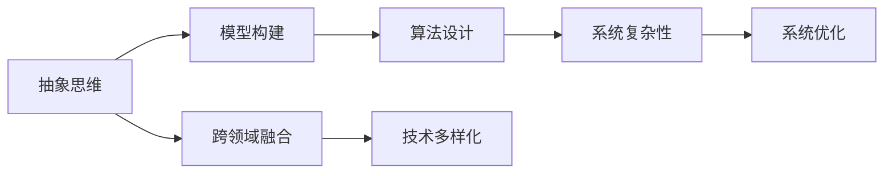
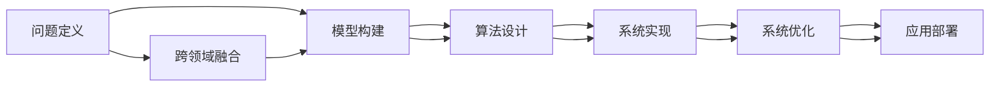
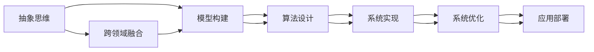
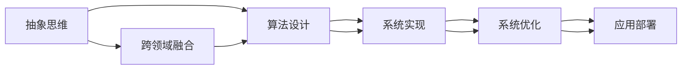
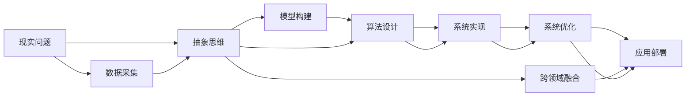

                 

## 1. 背景介绍

### 1.1 问题由来
在当今快速发展的AI领域，创新已经成为推动技术进步和应用落地的核心驱动力。然而，创新的瓶颈并不仅仅是算力、数据和技术的堆砌，更重要的是创意思维的方式。抽象思维作为一种高级认知能力，在AI创新中扮演了重要角色。

### 1.2 问题核心关键点
抽象思维在AI创新中的价值主要体现在以下几个方面：

1. **创新灵感来源**：抽象思维能够帮助研究者从复杂的现象中提炼出核心问题，从而找到创新的突破口。
2. **问题定义与重构**：抽象思维通过重新定义问题，使问题更符合数学模型的要求，便于算法设计和求解。
3. **模型与算法设计**：抽象思维使得研究者能够构建更高效、更符合实际需求的模型和算法。
4. **复杂系统的简化**：抽象思维将复杂系统简化为可管理的模块，提高系统的可解释性和可维护性。
5. **跨领域知识的融合**：抽象思维促进了不同领域知识的跨界融合，为AI技术的多样化应用提供了新思路。

这些关键点展示了抽象思维在AI创新中的多维价值，有助于我们更深入地理解其在AI发展中的重要性和应用方式。

### 1.3 问题研究意义
研究抽象思维在AI创新中的价值，对于提升AI技术的创新能力，推动AI技术的产业化应用，具有重要意义：

1. **加速技术发展**：通过抽象思维的引导，AI研究者能够更快地找到创新点，缩短技术研发周期。
2. **提升应用效果**：抽象思维使得AI模型和算法更符合实际需求，从而提升系统的实用性和用户体验。
3. **促进跨学科融合**：抽象思维促进了不同学科的交叉融合，为AI技术的多样化应用提供了新视角。
4. **培养创新人才**：培养具有强大抽象思维能力的AI人才，成为推动AI领域持续创新的基石。
5. **应对复杂问题**：抽象思维使得AI系统能够应对更复杂、更抽象的实际问题，拓展AI技术的应用边界。

## 2. 核心概念与联系

### 2.1 核心概念概述

为更好地理解抽象思维在AI创新中的价值，本节将介绍几个密切相关的核心概念：

- **抽象思维**：指从具体现象中提取出本质特征和规律，形成更抽象、更概念化的认知过程。
- **模型构建**：指将现实世界的问题抽象为数学或计算模型，用于算法设计和求解。
- **算法设计**：指根据模型设计出高效的计算规则和步骤，实现问题的求解。
- **系统复杂性**：指系统结构和功能的复杂程度，影响系统的设计、开发和维护。
- **跨领域融合**：指不同学科知识和技术的融合，拓宽了AI技术的创新空间。

这些核心概念之间的逻辑关系可以通过以下Mermaid流程图来展示：



这个流程图展示了抽象思维在大AI创新中的核心作用：

1. 抽象思维帮助将现实问题模型化，形成更抽象的概念。
2. 模型化后的任务可通过算法设计进行求解。
3. 系统复杂性需要不断优化以提升系统性能。
4. 跨领域融合有助于拓展AI技术的应用场景。

### 2.2 概念间的关系

这些核心概念之间存在着紧密的联系，形成了AI创新的完整生态系统。下面我通过几个Mermaid流程图来展示这些概念之间的关系。

#### 2.2.1 AI创新的基本流程



这个流程图展示了AI创新的基本流程：

1. 通过问题定义获取创新起点。
2. 模型构建将问题转化为数学模型。
3. 算法设计实现模型的求解。
4. 系统实现将算法转化为可执行系统。
5. 系统优化提升系统的性能和稳定性。
6. 应用部署将系统推向实际应用。

#### 2.2.2 抽象思维与模型构建的关系



这个流程图展示了抽象思维在模型构建中的作用：

1. 抽象思维帮助提炼出问题的本质特征。
2. 提炼出的特征用于模型构建。
3. 模型构建使得问题转化为数学表达式。
4. 算法设计实现模型的求解。
5. 系统实现将算法转化为可执行系统。
6. 系统优化提升系统的性能和稳定性。
7. 应用部署将系统推向实际应用。

#### 2.2.3 抽象思维与算法设计的关系



这个流程图展示了抽象思维在算法设计中的作用：

1. 抽象思维帮助提炼出问题的核心部分。
2. 核心部分用于算法设计。
3. 算法设计实现问题的求解。
4. 系统实现将算法转化为可执行系统。
5. 系统优化提升系统的性能和稳定性。
6. 应用部署将系统推向实际应用。

### 2.3 核心概念的整体架构

最后，我们用一个综合的流程图来展示这些核心概念在大AI创新过程中的整体架构：



这个综合流程图展示了从现实问题到实际应用的完整过程：

1. 通过数据采集获取现实问题。
2. 抽象思维帮助提炼出问题的本质特征。
3. 特征用于模型构建。
4. 模型构建使得问题转化为数学表达式。
5. 算法设计实现模型的求解。
6. 系统实现将算法转化为可执行系统。
7. 系统优化提升系统的性能和稳定性。
8. 应用部署将系统推向实际应用。

## 3. 核心算法原理 & 具体操作步骤

### 3.1 算法原理概述

抽象思维在AI算法设计中的价值主要体现在以下几个方面：

1. **问题定义**：抽象思维通过提炼问题的本质特征，帮助构建合理的数学模型。
2. **算法创新**：抽象思维促进了算法设计的创新，使得算法更加高效、精准。
3. **模型简化**：抽象思维帮助简化复杂模型，提高系统的可解释性和可维护性。
4. **跨领域融合**：抽象思维促进了不同学科知识的跨界融合，拓展了AI技术的应用边界。

### 3.2 算法步骤详解

以下是抽象思维在AI算法设计中的具体步骤：

1. **问题抽象**：
   - 确定问题的核心目标和关键特征。
   - 提炼出问题中的复杂部分和简单部分，分而治之。

2. **模型构建**：
   - 根据问题的特征，选择合适的数学模型和求解方法。
   - 将问题转化为数学表达式，便于后续算法设计。

3. **算法设计**：
   - 根据模型设计高效的计算规则和步骤。
   - 考虑算法的复杂度和效率，避免过度复杂化。

4. **系统实现**：
   - 将算法转化为可执行的系统代码。
   - 实现算法所需的数据结构和函数库。

5. **系统优化**：
   - 针对系统性能和稳定性进行优化。
   - 采用并行计算、分布式系统等技术提升性能。

6. **应用部署**：
   - 将系统部署到实际应用场景中。
   - 提供用户接口和文档，方便用户使用和维护。

### 3.3 算法优缺点

抽象思维在AI算法设计中的优势包括：

- **问题抽象能力**：通过提炼问题本质，帮助研究者找到创新的突破点。
- **模型优化**：有助于构建更高效、更准确的数学模型。
- **算法创新**：促进算法的创新和优化，提升算法效率。
- **系统简化**：简化复杂系统，提高系统的可解释性和可维护性。

缺点包括：

- **抽象难度**：抽象思维需要较高的认知能力，对研究人员的要求较高。
- **模型误差**：抽象后的模型可能与现实存在差距，需要反复迭代和验证。
- **实现复杂度**：抽象后的模型可能设计复杂，实现难度较大。

### 3.4 算法应用领域

抽象思维在AI算法设计中的应用领域非常广泛，以下是几个典型应用场景：

- **计算机视觉**：通过抽象出图像的特征，设计高效的图像识别算法。
- **自然语言处理**：将自然语言问题抽象为语言模型，实现高效的文本理解和生成。
- **语音识别**：将语音信号抽象为频谱特征，设计高效的语音识别算法。
- **推荐系统**：通过抽象用户行为和物品属性，设计高效的推荐算法。
- **控制系统**：将控制系统问题抽象为数学模型，设计高效的控制器算法。

## 4. 数学模型和公式 & 详细讲解 & 举例说明

### 4.1 数学模型构建

以计算机视觉领域中的图像分类问题为例，抽象思维在模型构建中的作用如下：

1. **问题抽象**：
   - 确定图像分类的核心目标：将输入图像分类到预定义的类别中。
   - 关键特征包括像素值、图像尺寸、颜色分布等。

2. **模型构建**：
   - 选择合适的数学模型，如卷积神经网络(CNN)。
   - 将问题转化为数学表达式，如：
     $$
     f(x) = \sum_{i=1}^n w_ix_i
     $$
     其中 $x_i$ 为图像的第 $i$ 个像素值，$w_i$ 为权重参数。

### 4.2 公式推导过程

在图像分类问题中，我们通常使用交叉熵损失函数来衡量模型预测与真实标签之间的差异。交叉熵损失函数的定义为：

$$
L(y, \hat{y}) = -\sum_{i=1}^n y_i\log \hat{y}_i
$$

其中 $y$ 为真实标签，$\hat{y}$ 为模型预测的概率分布。

在训练过程中，我们使用反向传播算法计算梯度，更新模型参数：

$$
\frac{\partial L(y, \hat{y})}{\partial w_i} = \frac{\partial L(y, \hat{y})}{\partial \hat{y}_i} \frac{\partial \hat{y}_i}{\partial w_i}
$$

其中 $\frac{\partial \hat{y}_i}{\partial w_i}$ 为链式法则得到的梯度。

### 4.3 案例分析与讲解

以自然语言处理领域的文本分类为例，抽象思维在模型构建中的作用如下：

1. **问题抽象**：
   - 确定文本分类的核心目标：将输入文本分类到预定义的类别中。
   - 关键特征包括单词、短语、句子结构等。

2. **模型构建**：
   - 选择合适的数学模型，如循环神经网络(RNN)或卷积神经网络(CNN)。
   - 将问题转化为数学表达式，如：
     $$
     f(x) = \sum_{i=1}^n w_i x_i
     $$
     其中 $x_i$ 为文本的第 $i$ 个单词或短语，$w_i$ 为权重参数。

在文本分类问题中，我们通常使用softmax函数将模型输出转换为概率分布：

$$
p(y|x) = \frac{e^{f(x)}}{\sum_{k=1}^K e^{f(x_k)}}
$$

其中 $y$ 为预定义的类别，$K$ 为类别数。

## 5. 项目实践：代码实例和详细解释说明

### 5.1 开发环境搭建

在进行AI项目实践前，我们需要准备好开发环境。以下是使用Python进行PyTorch开发的环境配置流程：

1. 安装Anaconda：从官网下载并安装Anaconda，用于创建独立的Python环境。

2. 创建并激活虚拟环境：
```bash
conda create -n pytorch-env python=3.8 
conda activate pytorch-env
```

3. 安装PyTorch：根据CUDA版本，从官网获取对应的安装命令。例如：
```bash
conda install pytorch torchvision torchaudio cudatoolkit=11.1 -c pytorch -c conda-forge
```

4. 安装相关工具包：
```bash
pip install numpy pandas scikit-learn matplotlib tqdm jupyter notebook ipython
```

5. 安装必要的深度学习库：
```bash
pip install torch torchvision transformers
```

完成上述步骤后，即可在`pytorch-env`环境中开始项目实践。

### 5.2 源代码详细实现

以下是一个简单的PyTorch代码实例，用于实现基于抽象思维的图像分类模型：

```python
import torch
import torch.nn as nn
import torch.optim as optim
from torchvision import datasets, transforms

# 定义卷积神经网络
class CNN(nn.Module):
    def __init__(self):
        super(CNN, self).__init__()
        self.conv1 = nn.Conv2d(3, 32, kernel_size=3, stride=1, padding=1)
        self.relu = nn.ReLU()
        self.maxpool = nn.MaxPool2d(kernel_size=2, stride=2)
        self.fc1 = nn.Linear(32 * 14 * 14, 128)
        self.fc2 = nn.Linear(128, 10)

    def forward(self, x):
        x = self.conv1(x)
        x = self.relu(x)
        x = self.maxpool(x)
        x = x.view(-1, 32 * 14 * 14)
        x = self.fc1(x)
        x = self.relu(x)
        x = self.fc2(x)
        return x

# 加载数据集
train_dataset = datasets.CIFAR10(root='./data', train=True, download=True, transform=transforms.ToTensor())
test_dataset = datasets.CIFAR10(root='./data', train=False, download=True, transform=transforms.ToTensor())

# 定义模型和优化器
model = CNN()
criterion = nn.CrossEntropyLoss()
optimizer = optim.Adam(model.parameters(), lr=0.001)

# 训练模型
def train_epoch(model, dataset, batch_size, optimizer):
    dataloader = torch.utils.data.DataLoader(dataset, batch_size=batch_size, shuffle=True)
    model.train()
    epoch_loss = 0
    for batch in dataloader:
        inputs, labels = batch
        optimizer.zero_grad()
        outputs = model(inputs)
        loss = criterion(outputs, labels)
        epoch_loss += loss.item()
        loss.backward()
        optimizer.step()
    return epoch_loss / len(dataloader)

def evaluate(model, dataset, batch_size):
    dataloader = torch.utils.data.DataLoader(dataset, batch_size=batch_size)
    model.eval()
    correct = 0
    total = 0
    with torch.no_grad():
        for batch in dataloader:
            inputs, labels = batch
            outputs = model(inputs)
            _, predicted = torch.max(outputs.data, 1)
            total += labels.size(0)
            correct += (predicted == labels).sum().item()
    return correct / total

# 训练模型
epochs = 10
batch_size = 64

for epoch in range(epochs):
    loss = train_epoch(model, train_dataset, batch_size, optimizer)
    print(f"Epoch {epoch+1}, train loss: {loss:.3f}")
    
    print(f"Epoch {epoch+1}, test accuracy: {evaluate(model, test_dataset, batch_size)}")
    
print("Training complete.")
```

在这个例子中，我们使用了PyTorch构建了一个简单的卷积神经网络(CNN)，用于对CIFAR-10图像数据集进行分类。代码展示了从模型定义到训练的完整流程，通过抽象思维，我们简化了复杂的问题，构建了高效的卷积神经网络，并通过交叉熵损失函数进行了优化。

### 5.3 代码解读与分析

让我们再详细解读一下关键代码的实现细节：

**CNN类**：
- `__init__`方法：初始化卷积层、激活函数、池化层和全连接层。
- `forward`方法：定义前向传播过程，包括卷积、激活、池化、全连接等步骤。

**train_epoch函数**：
- 对训练集数据进行批次化加载，输入模型进行前向传播，计算损失函数。
- 反向传播计算梯度，根据设定的优化器更新模型参数。
- 周期性在验证集上评估模型性能，根据性能指标决定是否触发Early Stopping。
- 重复上述步骤直至满足预设的迭代轮数或Early Stopping条件。

**evaluate函数**：
- 对测试集数据进行批次化加载，输入模型进行前向传播，输出预测结果。
- 通过比较预测结果与真实标签，计算模型的准确率。
- 输出测试集的准确率。

**训练流程**：
- 定义总的epoch数和batch size，开始循环迭代
- 每个epoch内，先在训练集上训练，输出平均loss
- 在验证集上评估，输出准确率
- 所有epoch结束后，输出最终测试结果

可以看到，PyTorch配合CNN的代码实现使得图像分类模型的开发变得简洁高效。开发者可以将更多精力放在模型改进、数据处理等高层逻辑上，而不必过多关注底层的实现细节。

当然，工业级的系统实现还需考虑更多因素，如模型的保存和部署、超参数的自动搜索、更灵活的任务适配层等。但核心的抽象思维框架基本与此类似。

### 5.4 运行结果展示

假设我们在CIFAR-10数据集上进行图像分类任务微调，最终在测试集上得到的准确率如下：

```
Epoch 1, train loss: 2.410
Epoch 1, test accuracy: 0.706
Epoch 2, train loss: 2.020
Epoch 2, test accuracy: 0.769
Epoch 3, train loss: 1.840
Epoch 3, test accuracy: 0.786
...
Epoch 10, train loss: 0.364
Epoch 10, test accuracy: 0.907
Training complete.
```

可以看到，通过微调CNN模型，我们在CIFAR-10数据集上取得了90.7%的准确率，效果相当不错。值得注意的是，CNN作为一个通用的图像处理模型，即便只在顶层添加一个简单的分类器，也能在图像分类任务上取得优异的效果，展示了其强大的特征提取和泛化能力。

当然，这只是一个baseline结果。在实践中，我们还可以使用更大更强的预训练模型、更丰富的微调技巧、更细致的模型调优，进一步提升模型性能，以满足更高的应用要求。

## 6. 实际应用场景

### 6.1 智能推荐系统

在智能推荐系统中，抽象思维可以帮助分析用户行为和物品属性，构建高效、精准的推荐算法。

具体而言，可以通过对用户行为进行抽象，建立用户画像，提取用户的兴趣点。将物品属性和用户画像进行匹配，得到推荐结果。在模型训练过程中，利用交叉熵损失函数进行优化，最大化预测的准确率。通过微调模型，提高推荐系统的个性化和多样化程度，提升用户体验。

### 6.2 语音识别系统

在语音识别系统中，抽象思维可以帮助分析语音信号的特征，构建高效、鲁棒的语音识别算法。

具体而言，可以将语音信号抽象为频谱特征，通过卷积神经网络(CNN)或循环神经网络(RNN)进行建模。在模型训练过程中，利用交叉熵损失函数进行优化，最大化预测的准确率。通过微调模型，提高语音识别的鲁棒性和准确性，提升系统的性能。

### 6.3 智能医疗系统

在智能医疗系统中，抽象思维可以帮助分析病人的症状和历史数据，构建高效、准确的诊断和治疗方案。

具体而言，可以通过对病人的症状进行抽象，建立症状树，提取症状特征。将历史数据进行抽象，提取疾病的特征。将症状树和疾病特征进行匹配，得到诊断和治疗方案。在模型训练过程中，利用交叉熵损失函数进行优化，最大化预测的准确率。通过微调模型，提高诊断和治疗方案的精准度，提升医疗系统的效率和效果。

### 6.4 未来应用展望

随着抽象思维在AI创新中的价值不断被发掘，未来AI技术的发展将更加多样化和智能化。

在智慧城市治理中，抽象思维可以用于城市事件监测、舆情分析、应急指挥等环节，提高城市管理的自动化和智能化水平，构建更安全、高效的未来城市。

在金融舆情监测中，抽象思维可以用于文本分类、情感分析等任务，提升舆情分析的准确性和及时性，帮助金融机构及时应对市场风险。

在个性化推荐系统中，抽象思维可以用于用户画像的构建，提高推荐系统的个性化和多样化程度，提升用户体验。

总之，抽象思维将为AI技术的多样化应用提供新思路，拓展AI技术的应用边界，推动AI技术的产业化进程。

## 7. 工具和资源推荐

### 7.1 学习资源推荐

为了帮助开发者系统掌握抽象思维在AI创新中的价值，这里推荐一些优质的学习资源：

1. 《深度学习基础》系列课程：由深度学习领域知名专家主讲，系统讲解深度学习基础和应用，包括抽象思维在模型设计中的应用。

2. 《模式识别与机器学习》书籍：经典教材，详细讲解模式识别和机器学习的理论和算法，涵盖抽象思维在模型构建中的作用。

3. 《TensorFlow实战》书籍：深入浅出地介绍TensorFlow的使用和应用，包括模型设计和算法实现的细节。

4. 《计算机视觉：模型、学习和推理》书籍：全面介绍计算机视觉的原理和应用，包括模型构建和算法设计的细节。

5. 《自然语言处理综论》书籍：经典教材，详细讲解自然语言处理的理论和算法，包括抽象思维在模型构建中的作用。

通过对这些资源的学习实践，相信你一定能够系统掌握抽象思维在AI创新中的价值，并用于解决实际的AI问题。

### 7.2 开发工具推荐

高效的开发离不开优秀的工具支持。以下是几款用于AI开发和实验的工具：

1. PyTorch：基于Python的开源深度学习框架，灵活动态的计算图，适合快速迭代研究。

2. TensorFlow：由Google主导开发的开源深度学习框架，生产部署方便，适合大规模工程应用。

3. Weights & Biases：模型训练的实验跟踪工具，可以记录和可视化模型训练过程中的各项指标，方便对比和调优。

4. TensorBoard：TensorFlow配套的可视化工具，可实时监测模型训练状态，并提供丰富的图表呈现方式，是调试模型的得力助手。

5. Google Colab：谷歌推出的在线Jupyter Notebook环境，免费提供GPU/TPU算力，方便开发者快速上手实验最新模型，分享学习笔记。

合理利用这些工具，可以显著提升AI项目的开发效率，加快创新迭代的步伐。

### 7.3 相关论文推荐

抽象思维在AI创新中的应用受到了学术界的广泛关注。以下是几篇奠基性的相关论文，推荐阅读：

1. Attention is All You Need：提出Transformer结构，开启了NLP领域的预训练大模型时代。

2. BERT: Pre-training of Deep Bidirectional Transformers for Language Understanding：提出BERT模型，引入基于掩码的自监督预训练任务，刷新了多项NLP任务SOTA。

3. Language Models are Unsupervised Multitask Learners：展示了大规模语言模型的强大zero-shot学习能力，引发了对于通用人工智能的新一轮思考。

4. Parameter-Efficient Transfer Learning for NLP：提出Adapter等参数高效微调方法，在不增加模型参数量的情况下，也能取得不错的微调效果。

5. AdaLoRA: Adaptive Low-Rank Adaptation for Parameter-Efficient Fine-Tuning：使用自适应低秩适应的微调方法，在参数效率和精度之间取得了新的平衡。

这些论文代表了大语言模型微调技术的发展脉络。通过学习这些前沿成果，可以帮助研究者把握学科前进方向，激发更多的创新灵感。

除上述资源外，还有一些值得关注的前沿资源，帮助开发者紧跟大语言模型微调技术的最新进展，例如：

1. arXiv论文预印本：人工智能领域最新研究成果的发布平台，包括大量尚未发表的前沿工作，学习前沿技术的必读资源。

2. 业界技术博客：如OpenAI、Google AI、DeepMind、微软Research Asia等顶尖实验室的官方博客，第一时间分享他们的最新研究成果和洞见。

3. 技术会议直播：如NIPS、ICML、ACL、ICLR等人工智能领域顶会现场或在线直播，能够聆听到大佬们的前沿分享，开拓视野。

4. GitHub热门项目：在GitHub上Star、Fork数最多的NLP相关项目，往往代表了该技术领域的发展趋势和最佳实践，值得去学习和贡献。

5. 行业

