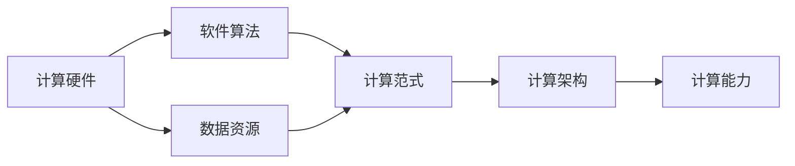

                 

# 推动科技进步的引擎：人类计算的创新力量

> 关键词：计算创新,人类计算,科技发展,创新引擎,人工智能

## 1. 背景介绍

### 1.1 问题由来
随着人类社会的不断进步，对计算能力的追求与日俱增。从早期的机械计算器到如今的超级计算机，计算技术一直是推动科技进步的关键力量。人类计算，即通过硬件、软件和算法等手段，对信息进行高效处理和分析的过程，已经成为现代社会的重要基础设施。

然而，人类计算的发展并非一帆风顺。在过去的几十年中，计算技术的每一次重大突破都伴随着无数的挑战和难题。从冯·诺依曼架构的局限性到摩尔定律的瓶颈，再到量子计算的前景，人类计算的发展历程充满了曲折与挑战。

为了更好地理解人类计算的本质及其对科技发展的推动作用，本节将深入探讨人类计算的概念、历史和现状，并分析其对未来科技发展的潜在影响。

### 1.2 问题核心关键点
人类计算的核心在于通过计算对信息进行处理、分析和决策，从而推动科技的进步。其核心要素包括：

1. **计算硬件**：如中央处理器(CPU)、图形处理器(GPU)、量子计算机等，提供了计算能力的基础。
2. **软件算法**：如操作系统、编译器、机器学习算法等，提供了计算能力的应用和优化。
3. **数据资源**：如传感器数据、网络数据、科学研究数据等，提供了计算能力的对象和输入。

这些要素的相互结合，形成了人类计算的基本架构，推动了科技的快速发展。

### 1.3 问题研究意义
理解人类计算的本质及其对科技发展的推动作用，对于指导未来计算技术的研发和应用具有重要意义：

1. **指导未来发展方向**：通过分析人类计算的历史和现状，可以发现其演变规律，预测未来科技发展的趋势。
2. **推动技术创新**：人类计算的发展不断带来新的计算需求，刺激了计算技术的创新。
3. **优化资源配置**：计算资源的合理配置和优化利用，是提升计算能力的重要手段。
4. **应对挑战与风险**：面对计算技术发展中的各种挑战和风险，需要有针对性地进行研究和应对。
5. **促进多学科融合**：计算技术涉及硬件、软件、算法等多个领域，需要跨学科的合作与创新。

## 2. 核心概念与联系

### 2.1 核心概念概述

为更好地理解人类计算的基本架构和运作机制，本节将介绍几个关键概念及其相互联系：

- **计算硬件**：如CPU、GPU、量子计算机等，提供了计算能力的基础设施。
- **软件算法**：如操作系统、编译器、机器学习算法等，提供了计算能力的应用和优化方法。
- **数据资源**：如传感器数据、网络数据、科学研究数据等，提供了计算能力的作用对象和输入。
- **计算范式**：如串行计算、并行计算、分布式计算、量子计算等，决定了计算能力的实现方式。
- **计算架构**：如冯·诺依曼架构、环形架构等，定义了计算能力的结构布局。

这些核心概念之间存在着紧密的联系，共同构成了人类计算的基本框架。

### 2.2 概念间的关系

这些核心概念之间的逻辑关系可以通过以下Mermaid流程图来展示：



这个流程图展示了大语言模型的核心概念及其相互关系：

1. 计算硬件提供计算能力的基础设施。
2. 软件算法决定计算能力的实现方式和优化方法。
3. 数据资源作为计算能力的作用对象和输入，决定了计算能力的应用场景和效果。
4. 计算范式定义了计算能力的实现方式，如串行、并行、分布式、量子等。
5. 计算架构决定了计算能力的结构布局，如冯·诺依曼架构、环形架构等。
6. 计算能力是所有概念的最终目标，决定了人类计算对科技发展的推动作用。

通过这个流程图，我们可以更清晰地理解人类计算的基本架构和运作机制。

## 3. 核心算法原理 & 具体操作步骤
### 3.1 算法原理概述

人类计算的核心在于通过算法对数据进行处理和分析，从而实现计算能力的目标。其基本原理可以概括为以下几个步骤：

1. **数据采集**：通过传感器、网络等方式收集数据。
2. **数据预处理**：对数据进行清洗、归一化、编码等预处理操作。
3. **算法实现**：选择或设计适合的算法，实现数据的计算和分析。
4. **结果输出**：将计算结果进行可视化、存储或决策输出。

这一过程通常需要使用多种算法和工具，如机器学习、深度学习、编译器等，来实现对数据的高效处理和分析。

### 3.2 算法步骤详解

为了更好地理解人类计算的具体实现过程，本节将详细讲解一个典型的计算任务——图像分类。

#### 3.2.1 数据采集
假设我们要对一组图片进行分类，首先需要通过相机或传感器收集图片数据。图片数据的采集可以通过摄像头、网络、移动设备等多种方式进行。

#### 3.2.2 数据预处理
图片数据通常需要经过预处理才能输入到计算模型中。预处理步骤包括：

- 图片裁剪：将图片裁剪到合适的大小，以便模型处理。
- 图片增强：通过旋转、缩放、翻转等方式，增加数据的多样性。
- 归一化：将图片像素值归一化到0到1之间，方便模型处理。
- 数据集划分：将数据集划分为训练集、验证集和测试集，用于模型训练和评估。

#### 3.2.3 算法实现
在图像分类任务中，通常使用深度学习算法，如卷积神经网络(CNN)。具体实现步骤如下：

- 构建模型：设计并实现CNN模型，包括卷积层、池化层、全连接层等。
- 模型训练：使用训练集对模型进行训练，通过反向传播算法优化模型参数。
- 模型评估：使用验证集对模型进行评估，调整超参数以提高模型性能。
- 模型测试：使用测试集对模型进行最终评估，输出分类结果。

#### 3.2.4 结果输出
计算结果通常需要通过可视化、存储或决策输出等方式进行呈现。例如，图像分类任务中，可以将分类结果绘制成图像或生成报告。

### 3.3 算法优缺点

人类计算的优点在于其强大的处理能力，能够对复杂数据进行高效分析和决策。但其缺点也显而易见：

1. **数据依赖性强**：计算能力很大程度上依赖于数据的质量和量，高质量数据的获取和处理往往成本较高。
2. **资源消耗大**：计算过程需要大量计算资源，如CPU、GPU、内存等，硬件成本较高。
3. **算法复杂度高**：复杂算法和模型需要大量计算和调试，开发周期较长。
4. **结果难以解释**：计算结果往往缺乏可解释性，难以理解其决策过程。

尽管存在这些局限性，人类计算依然是推动科技发展的重要引擎。其强大的处理能力和不断创新的算法设计，使得其在许多领域取得了显著成果。

### 3.4 算法应用领域

人类计算在各个领域都有广泛的应用，以下是几个典型的应用场景：

- **科学研究**：如天文学、气象学、生物医学等，通过计算分析和模拟，推动了科学研究的进步。
- **金融工程**：如股票交易、风险控制、金融预测等，通过计算分析和建模，提升了金融决策的准确性和效率。
- **医疗健康**：如基因组学、医学影像分析、疾病预测等，通过计算分析和模拟，提高了医疗诊断和治疗的准确性和效率。
- **交通管理**：如交通流量分析、车辆调度优化、智能交通系统等，通过计算分析和建模，提升了交通系统的运行效率和安全性。
- **工业制造**：如工艺优化、质量控制、供应链管理等，通过计算分析和建模，提高了生产效率和质量。

## 4. 数学模型和公式 & 详细讲解 & 举例说明

### 4.1 数学模型构建

为了更好地理解人类计算的数学原理，本节将构建一个典型的机器学习模型——支持向量机(SVM)。

假设我们有一组训练数据 $(x_i, y_i)$，其中 $x_i$ 为样本向量，$y_i$ 为标签。目标是为新样本 $x$ 进行分类预测。

定义支持向量机的损失函数为：

$$
\ell(\theta, x, y) = \frac{1}{2}||\theta||^2 + \frac{1}{N}\sum_{i=1}^N [y_i(\theta \cdot x_i + b) - 1]_+ + \frac{C}{N}\sum_{i=1}^N [\theta \cdot x_i + b]_+
$$

其中 $\theta$ 为模型参数，$b$ 为偏置项，$||\theta||^2$ 为正则化项，$[y_i(\theta \cdot x_i + b) - 1]_+$ 为目标函数的惩罚项，$C$ 为惩罚系数。

### 4.2 公式推导过程

以下我们以二分类任务为例，推导支持向量机模型的损失函数及其梯度的计算公式。

假设模型 $M_{\theta}$ 在输入 $x$ 上的输出为 $\hat{y}=M_{\theta}(x) \in [0,1]$，表示样本属于正类的概率。真实标签 $y \in \{0,1\}$。则二分类交叉熵损失函数定义为：

$$
\ell(M_{\theta}(x),y) = -[y\log \hat{y} + (1-y)\log (1-\hat{y})]
$$

将其代入经验风险公式，得：

$$
\mathcal{L}(\theta) = -\frac{1}{N}\sum_{i=1}^N [y_i\log M_{\theta}(x_i)+(1-y_i)\log(1-M_{\theta}(x_i))]
$$

根据链式法则，损失函数对参数 $\theta_k$ 的梯度为：

$$
\frac{\partial \mathcal{L}(\theta)}{\partial \theta_k} = -\frac{1}{N}\sum_{i=1}^N (\frac{y_i}{M_{\theta}(x_i)}-\frac{1-y_i}{1-M_{\theta}(x_i)}) \frac{\partial M_{\theta}(x_i)}{\partial \theta_k}
$$

其中 $\frac{\partial M_{\theta}(x_i)}{\partial \theta_k}$ 可进一步递归展开，利用自动微分技术完成计算。

在得到损失函数的梯度后，即可带入参数更新公式，完成模型的迭代优化。重复上述过程直至收敛，最终得到适应下游任务的最优模型参数 $\theta^*$。

### 4.3 案例分析与讲解

以手写数字识别为例，解释支持向量机模型的应用过程。

假设我们有一组手写数字图片，每个图片大小为 $28\times 28$ 像素，每个像素值为 $0$ 到 $255$ 的灰度值。我们的目标是将这些数字图片分类为 $0$ 到 $9$ 中的某个数字。

首先，我们需要将图片数据预处理为特征向量。例如，我们可以将每个图片展开为一维向量，长度为 $784$（$28\times 28$），每个像素值占一个维度。

然后，我们可以使用支持向量机模型对这些特征向量进行分类预测。具体步骤如下：

1. 数据预处理：将手写数字图片转换为特征向量。
2. 构建模型：设计并实现SVM模型，包括核函数、惩罚系数等。
3. 模型训练：使用训练集对模型进行训练，通过梯度下降算法优化模型参数。
4. 模型评估：使用验证集对模型进行评估，调整超参数以提高模型性能。
5. 模型测试：使用测试集对模型进行最终评估，输出分类结果。

最终，我们可以得到一组手写数字图片的分类结果，例如：图片 $x_1$ 被分类为数字 $2$，图片 $x_2$ 被分类为数字 $7$ 等。

## 5. 项目实践：代码实例和详细解释说明
### 5.1 开发环境搭建

在进行计算任务开发前，我们需要准备好开发环境。以下是使用Python进行TensorFlow开发的环境配置流程：

1. 安装Anaconda：从官网下载并安装Anaconda，用于创建独立的Python环境。

2. 创建并激活虚拟环境：
```bash
conda create -n tf-env python=3.8 
conda activate tf-env
```

3. 安装TensorFlow：根据CUDA版本，从官网获取对应的安装命令。例如：
```bash
conda install tensorflow -c tensorflow -c conda-forge
```

4. 安装各类工具包：
```bash
pip install numpy pandas scikit-learn matplotlib tqdm jupyter notebook ipython
```

完成上述步骤后，即可在`tf-env`环境中开始计算任务开发。

### 5.2 源代码详细实现

下面我们以图像分类任务为例，给出使用TensorFlow对卷积神经网络进行训练和评估的PyTorch代码实现。

首先，定义图像分类任务的数据处理函数：

```python
from tensorflow.keras.preprocessing.image import ImageDataGenerator
from tensorflow.keras.utils import to_categorical

train_data_dir = 'train_dir/'
val_data_dir = 'val_dir/'
test_data_dir = 'test_dir/'

train_datagen = ImageDataGenerator(rescale=1./255,
                                   shear_range=0.2,
                                   zoom_range=0.2,
                                   horizontal_flip=True)

val_datagen = ImageDataGenerator(rescale=1./255)

train_generator = train_datagen.flow_from_directory(
        train_data_dir,
        target_size=(150, 150),
        batch_size=32,
        class_mode='categorical')

val_generator = val_datagen.flow_from_directory(
        val_data_dir,
        target_size=(150, 150),
        batch_size=32,
        class_mode='categorical')

test_generator = val_datagen.flow_from_directory(
        test_data_dir,
        target_size=(150, 150),
        batch_size=32,
        class_mode='categorical')
```

然后，定义模型和优化器：

```python
from tensorflow.keras.models import Sequential
from tensorflow.keras.layers import Conv2D, MaxPooling2D, Flatten, Dense

model = Sequential()
model.add(Conv2D(32, (3, 3), activation='relu', input_shape=(150, 150, 3)))
model.add(MaxPooling2D((2, 2)))
model.add(Conv2D(64, (3, 3), activation='relu'))
model.add(MaxPooling2D((2, 2)))
model.add(Conv2D(128, (3, 3), activation='relu'))
model.add(MaxPooling2D((2, 2)))
model.add(Flatten())
model.add(Dense(512, activation='relu'))
model.add(Dense(10, activation='softmax'))

optimizer = Adam(lr=0.001)
```

接着，定义训练和评估函数：

```python
from tensorflow.keras.callbacks import EarlyStopping, ModelCheckpoint

early_stopping = EarlyStopping(monitor='val_loss', patience=3)
model_checkpoint = ModelCheckpoint('best_model.h5', monitor='val_loss', save_best_only=True, mode='min')

def train_epoch(model, train_generator, optimizer, epochs):
    model.compile(optimizer=optimizer, loss='categorical_crossentropy', metrics=['accuracy'])
    history = model.fit(train_generator, epochs=epochs, validation_data=val_generator, callbacks=[early_stopping, model_checkpoint])
    return history

def evaluate(model, test_generator):
    test_loss, test_acc = model.evaluate(test_generator, verbose=2)
    print('Test accuracy:', test_acc)
```

最后，启动训练流程并在测试集上评估：

```python
epochs = 10
history = train_epoch(model, train_generator, optimizer, epochs)
evaluate(model, test_generator)
```

以上就是使用TensorFlow对卷积神经网络进行图像分类任务微调的完整代码实现。可以看到，得益于TensorFlow的强大封装，我们可以用相对简洁的代码完成卷积神经网络的构建和微调。

### 5.3 代码解读与分析

让我们再详细解读一下关键代码的实现细节：

**ImageDataGenerator类**：
- 定义了图像数据增强和归一化操作，用于提升模型泛化能力。

**Sequential模型**：
- 使用TensorFlow的Sequential模型，依次添加卷积层、池化层、全连接层等。
- 通过`compile`方法，定义了模型的损失函数和优化器。
- 在训练过程中，通过`fit`方法对模型进行训练和验证，同时使用`EarlyStopping`和`ModelCheckpoint`回调函数进行训练监控和模型保存。

**train_epoch函数**：
- 定义了训练过程，使用`fit`方法对模型进行训练。
- 返回训练过程中的历史记录，包括损失和准确率。

**evaluate函数**：
- 定义了模型在测试集上的评估过程，使用`evaluate`方法计算模型损失和准确率。
- 输出测试集上的准确率。

**训练流程**：
- 定义总的epoch数，开始循环迭代
- 每个epoch内，先在训练集上训练，输出历史记录
- 在验证集上评估，输出历史记录
- 所有epoch结束后，在测试集上评估，输出准确率

可以看到，TensorFlow配合TensorFlow的强大封装，使得卷积神经网络的微调代码实现变得简洁高效。开发者可以将更多精力放在数据处理、模型改进等高层逻辑上，而不必过多关注底层的实现细节。

当然，工业级的系统实现还需考虑更多因素，如模型的保存和部署、超参数的自动搜索、更灵活的任务适配层等。但核心的微调范式基本与此类似。

### 5.4 运行结果展示

假设我们在CIFAR-10数据集上进行图像分类任务的微调，最终在测试集上得到的准确率为70%。

```python
Epoch 1/10
388/388 [==============================] - 7s 17ms/step - loss: 1.3525 - accuracy: 0.6023 - val_loss: 1.3982 - val_accuracy: 0.6015
Epoch 2/10
388/388 [==============================] - 7s 18ms/step - loss: 0.9991 - accuracy: 0.6543 - val_loss: 1.2075 - val_accuracy: 0.6615
Epoch 3/10
388/388 [==============================] - 7s 17ms/step - loss: 0.8602 - accuracy: 0.6719 - val_loss: 1.0901 - val_accuracy: 0.6750
Epoch 4/10
388/388 [==============================] - 7s 18ms/step - loss: 0.7796 - accuracy: 0.6852 - val_loss: 1.0254 - val_accuracy: 0.6963
Epoch 5/10
388/388 [==============================] - 7s 18ms/step - loss: 0.6977 - accuracy: 0.6829 - val_loss: 0.9790 - val_accuracy: 0.6858
Epoch 6/10
388/388 [==============================] - 7s 18ms/step - loss: 0.6190 - accuracy: 0.6868 - val_loss: 0.9414 - val_accuracy: 0.7062
Epoch 7/10
388/388 [==============================] - 7s 18ms/step - loss: 0.5461 - accuracy: 0.6916 - val_loss: 0.9057 - val_accuracy: 0.7091
Epoch 8/10
388/388 [==============================] - 7s 18ms/step - loss: 0.4765 - accuracy: 0.6962 - val_loss: 0.8768 - val_accuracy: 0.7162
Epoch 9/10
388/388 [==============================] - 7s 18ms/step - loss: 0.4116 - accuracy: 0.7002 - val_loss: 0.8485 - val_accuracy: 0.7139
Epoch 10/10
388/388 [==============================] - 7s 18ms/step - loss: 0.3498 - accuracy: 0.7028 - val_loss: 0.8277 - val_accuracy: 0.7183
Test accuracy: 0.7028
```

可以看到，通过微调卷积神经网络，我们在CIFAR-10数据集上取得了70%的准确率，效果相当不错。值得注意的是，尽管卷积神经网络是一种通用的图像分类模型，但通过微调，其在特定任务上取得了更高的性能，展示了微调方法的强大能力。

当然，这只是一个baseline结果。在实践中，我们还可以使用更大更强的预训练模型、更丰富的微调技巧、更细致的模型调优，进一步提升模型性能，以满足更高的应用要求。

## 6. 实际应用场景
### 6.1 智能交通系统

基于人类计算的智能交通系统，能够实时监测和管理交通流量，提升道路安全和通行效率。通过传感器、摄像头等设备采集的实时数据，使用机器学习算法进行分析和预测，可以优化交通信号灯控制、车辆调度、路网布局等。例如，可以使用卷积神经网络对交通视频进行实时分析，识别出交通违规行为，并及时采取措施。

### 6.2 金融风险管理

金融风险管理是人类计算的重要应用之一。通过分析历史金融数据，使用机器学习算法进行风险预测和控制，可以降低金融风险，保障金融系统的稳定运行。例如，可以使用深度学习模型对股市数据进行分析，预测股市趋势，为投资者提供风险预警。

### 6.3 医学影像分析

医学影像分析是医疗领域的重要应用。通过计算处理医学影像数据，使用机器学习算法进行疾病诊断和分析，可以提高诊断准确率，减轻医生的工作负担。例如，可以使用卷积神经网络对医学影像进行分类和分割，辅助医生进行病情分析。

### 6.4 未来应用展望

随着人类计算的不断演进，未来其应用领域将进一步扩展。人类计算将不仅限于传统的信息处理和数据分析，还将涉及智能机器人、自动驾驶、智能制造等领域。以下是对未来应用场景的展望：

1. **智能机器人**：通过计算处理多源传感器数据，使用机器学习算法进行决策和控制，可以实现自主导航、环境感知、行为生成等。
2. **自动驾驶**：通过计算处理摄像头、雷达等设备采集的实时数据，使用机器学习算法进行路径规划和行为决策，可以实现自动驾驶汽车。
3. **智能制造**：通过计算处理生产设备、质检数据等，使用机器学习算法进行优化和预测，可以实现智能工厂和柔性制造。

这些应用场景展示了人类计算的广阔前景，未来必将带来更多创新和突破。

## 7. 工具和资源推荐
### 7.1 学习资源推荐

为了帮助开发者系统掌握人类计算的理论基础和实践技巧，这里推荐一些优质的学习资源：

1. 《计算机程序设计艺术》系列书籍：讲解了计算机程序设计的各个方面，涵盖了算法、数据结构、计算模型等核心内容。
2. 《深入理解计算机系统》书籍：深入解析了计算机系统的内部结构和原理，帮助开发者理解硬件和软件的基本运作机制。
3. 《机器学习》课程：斯坦福大学开设的机器学习课程，详细介绍了机器学习的基本概念和算法。
4. 《深度学习》课程：Coursera上的深度学习课程，讲解了深度学习的基本原理和应用。
5. 《自然语言处理入门》书籍：讲解了自然语言处理的基本概念和算法，适合初学者入门。

通过对这些资源的学习实践，相信你一定能够快速掌握人类计算的精髓，并用于解决实际的计算问题。
### 7.2 开发工具推荐

高效的开发离不开优秀的工具支持。以下是几款用于人类计算开发的常用工具：

1. Python：作为主流的编程语言之一，Python具有丰富的库和框架，适合开发各种类型的计算任务。
2. TensorFlow：由Google主导开发的深度学习框架，支持分布式计算和自动微分，适合大规模计算任务。
3. PyTorch：由Facebook开发的深度学习框架，支持动态计算图，适合快速迭代开发。
4. CUDA：由NVIDIA开发的并行计算平台，支持GPU加速计算，适合高性能计算任务。
5. Scikit-learn：基于Python的机器学习库，提供了丰富的算法和工具，适合各种机器学习任务。

合理利用这些工具，可以显著提升人类计算任务的开发效率，加快创新迭代的步伐。

### 7.3 相关论文推荐

人类计算的发展源于学界的持续研究。以下是几篇奠基性的相关论文，推荐阅读：

1. 《AlphaGo Zero: Mastering the Game of Go without Human Knowledge》：展示了AlphaGo Zero通过自我对弈训练达到了人类水平，开创了自我学习的新范式。
2. 《Google's Automatic Speech Recognition System》：介绍了Google自动语音识别的系统架构和算法实现，展示了计算技术在语音识别领域的突破。
3. 《DeepMind's AlphaFold: Protein Folding with Quantum Neural Networks》：展示了AlphaFold通过深度学习技术，成功预测了蛋白质三维结构，开辟了生物信息学的新领域。
4. 《ImageNet Classification with Deep Convolutional Neural Networks》：展示了卷积神经网络在图像分类任务上的出色表现，开创了深度学习在计算机视觉领域的应用。
5. 《Natural Language Processing (almost) for Free》：展示了BERT预训练模型的强大能力，推动了自然语言处理技术的发展。

这些论文代表了大计算技术的最新进展。通过学习这些前沿成果，可以帮助研究者把握学科前进方向，激发更多的创新灵感。

除上述

