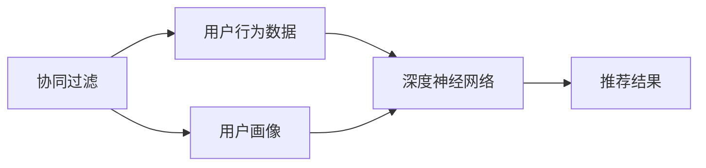
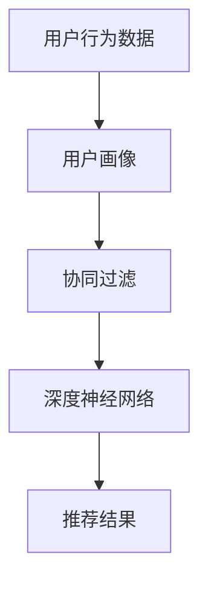
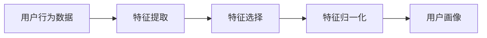
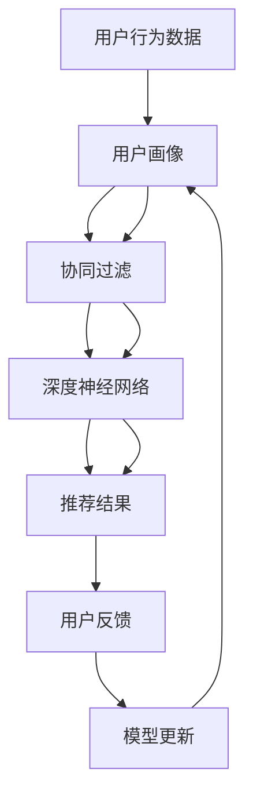

                 

# 推荐系统与用户画像原理与代码实战案例讲解

> 关键词：推荐系统,用户画像,协同过滤,深度学习,矩阵分解,神经网络,特征工程,代码实践

## 1. 背景介绍

### 1.1 问题由来

在当今的互联网时代，信息爆炸使得用户在海量数据中找到有用的内容变得越来越困难。推荐系统（Recommendation System）应运而生，通过分析用户行为和偏好，推荐个性化的内容，极大地提升了用户体验和内容发现效率。推荐系统广泛应用于电商、社交媒体、视频流媒体等多个领域，成为用户发现和获取内容的重要手段。

推荐系统主要分为基于内容的推荐和基于协同过滤的推荐两种方法。基于内容的推荐方法直接利用内容特征（如商品描述、视频标签等）与用户偏好匹配，适用于小规模数据集和用户个性化需求较低的情况。而基于协同过滤的推荐方法，则通过分析用户之间的相似性以及用户与物品之间的交互数据，挖掘出隐含的用户兴趣，适用于大规模数据集和用户个性化需求较高的情况。

近年来，随着深度学习技术的兴起，基于协同过滤的推荐系统得到了广泛的研究和应用。通过深度神经网络进行矩阵分解，可以挖掘出用户-物品交互矩阵中的隐含结构，实现更精确的推荐。而用户画像则通过提取和融合多维度用户信息，进一步提升推荐系统的个性化程度。本文将详细介绍推荐系统与用户画像的原理，并通过代码实践案例，展示如何高效实现基于协同过滤的推荐系统。

### 1.2 问题核心关键点

推荐系统与用户画像的核心关键点包括：

- **协同过滤**：基于用户-物品交互矩阵，通过分析用户之间的相似性以及用户与物品之间的交互数据，推荐用户可能感兴趣的内容。
- **深度神经网络**：利用神经网络进行矩阵分解，挖掘出用户-物品交互矩阵中的隐含结构，实现更精确的推荐。
- **用户画像**：通过提取和融合多维度用户信息，如历史行为、兴趣偏好、人口统计等，进一步提升推荐系统的个性化程度。
- **特征工程**：通过特征选择、特征提取、特征归一化等手段，增强模型的表达能力和泛化能力。
- **代码实现**：通过编程实践，展示推荐系统与用户画像的具体实现方法和技巧。

本文将围绕这些关键点，深入探讨推荐系统与用户画像的理论原理和实际应用。

### 1.3 问题研究意义

推荐系统与用户画像的研究对于提升用户体验和内容发现效率具有重要意义：

1. **提升个性化推荐质量**：通过深入分析用户行为和兴趣，推荐系统能够为用户推荐更贴合其需求的个性化内容，提升用户满意度。
2. **减少信息过载**：推荐系统能够根据用户的兴趣和行为，智能筛选并推荐相关内容，减少用户在大量无关信息中的时间消耗。
3. **增加用户黏性**：高质量的个性化推荐能够增强用户对平台的依赖性和黏性，促进用户留存和活跃度提升。
4. **驱动商业决策**：推荐系统能够为商家提供精准的用户需求洞察，优化产品推荐策略，提升转化率和盈利能力。
5. **加速内容创新**：通过推荐系统，内容创作者能够更精准地了解用户需求，优化内容创作和分发策略，推动内容创新和产业发展。

综上所述，推荐系统与用户画像技术的应用，对于提升用户体验、优化内容分发、驱动商业创新具有不可替代的作用，是构建智能互联时代的重要基石。

## 2. 核心概念与联系

### 2.1 核心概念概述

为了更好地理解推荐系统与用户画像的原理，本节将介绍几个密切相关的核心概念：

- **协同过滤**：通过分析用户与物品之间的交互数据，挖掘出隐含的用户兴趣，实现个性化推荐。
- **深度神经网络**：利用神经网络进行矩阵分解，挖掘出用户-物品交互矩阵中的隐含结构，实现更精确的推荐。
- **用户画像**：通过提取和融合多维度用户信息，如历史行为、兴趣偏好、人口统计等，进一步提升推荐系统的个性化程度。
- **特征工程**：通过特征选择、特征提取、特征归一化等手段，增强模型的表达能力和泛化能力。
- **协同过滤与深度学习结合**：将协同过滤和深度学习技术相结合，通过神经网络进行协同过滤的优化，实现更高效、更精准的推荐。

这些核心概念之间的逻辑关系可以通过以下Mermaid流程图来展示：



这个流程图展示了协同过滤、用户画像、深度神经网络与推荐结果之间的关系：

1. 协同过滤基于用户行为数据，挖掘出用户兴趣。
2. 用户画像通过提取和融合多维度用户信息，进一步提升个性化推荐程度。
3. 深度神经网络进行矩阵分解，挖掘出用户-物品交互矩阵中的隐含结构。
4. 结合协同过滤和深度学习技术，生成推荐结果。

### 2.2 概念间的关系

这些核心概念之间存在着紧密的联系，形成了推荐系统与用户画像的完整生态系统。下面我通过几个Mermaid流程图来展示这些概念之间的关系。

#### 2.2.1 推荐系统的实现流程



这个流程图展示了推荐系统的实现流程：

1. 通过收集和分析用户行为数据，生成用户画像。
2. 利用协同过滤方法，挖掘用户兴趣。
3. 利用深度神经网络进行矩阵分解，挖掘用户-物品交互矩阵中的隐含结构。
4. 通过结合协同过滤和深度学习技术，生成推荐结果。

#### 2.2.2 用户画像的构建过程



这个流程图展示了用户画像的构建过程：

1. 从用户行为数据中提取特征。
2. 选择有意义的特征。
3. 对特征进行归一化处理。
4. 融合多维度用户信息，构建用户画像。

### 2.3 核心概念的整体架构

最后，我们用一个综合的流程图来展示这些核心概念在推荐系统与用户画像中的整体架构：



这个综合流程图展示了从用户行为数据到用户画像，再到推荐结果的完整过程。用户行为数据通过特征提取、特征选择、特征归一化等步骤构建用户画像，协同过滤和深度神经网络结合挖掘用户兴趣和隐含结构，生成推荐结果。用户反馈用于模型更新，形成闭环迭代。

## 3. 核心算法原理 & 具体操作步骤

### 3.1 算法原理概述

推荐系统与用户画像的核心算法原理基于协同过滤和深度学习技术，通过分析用户行为数据和用户画像信息，生成个性化推荐结果。

协同过滤方法主要包括基于用户的协同过滤和基于物品的协同过滤两种。基于用户的协同过滤方法通过计算用户之间的相似性，找到与目标用户兴趣相近的邻居用户，从而推荐该用户喜欢的物品。基于物品的协同过滤方法则通过计算物品之间的相似性，找到与目标用户之前喜欢的物品相似的物品，进行推荐。

深度学习在协同过滤的基础上，通过神经网络进行矩阵分解，挖掘出用户-物品交互矩阵中的隐含结构，实现更精确的推荐。矩阵分解方法包括奇异值分解（SVD）、交替最小二乘法（ALS）等。

用户画像通过提取和融合多维度用户信息，如历史行为、兴趣偏好、人口统计等，进一步提升推荐系统的个性化程度。构建用户画像的常用方法包括聚类分析、分类分析、关联规则挖掘等。

### 3.2 算法步骤详解

推荐系统与用户画像的实现步骤如下：

**Step 1: 数据预处理**
- 收集用户行为数据，如浏览记录、点击记录、购买记录等。
- 清洗和处理数据，去除噪音和无效数据，生成用户行为数据集。
- 进行特征提取和归一化处理，生成特征向量。

**Step 2: 用户画像构建**
- 根据用户行为数据，提取有意义的特征。
- 选择合适的聚类、分类、关联规则等方法，构建用户画像。
- 将用户画像信息融合到用户行为数据中。

**Step 3: 协同过滤推荐**
- 利用协同过滤方法，计算用户之间的相似性或物品之间的相似性。
- 通过相似性计算，找到与目标用户兴趣相近的邻居用户或物品，进行推荐。

**Step 4: 深度学习推荐**
- 利用神经网络进行矩阵分解，挖掘出用户-物品交互矩阵中的隐含结构。
- 通过神经网络对用户-物品交互矩阵进行预测，生成推荐结果。

**Step 5: 推荐结果展示**
- 根据用户画像和协同过滤推荐结果，生成最终推荐列表。
- 对推荐结果进行展示，供用户选择。

**Step 6: 用户反馈处理**
- 收集用户对推荐结果的反馈，生成用户反馈数据集。
- 利用用户反馈数据进行模型更新，提升推荐效果。

### 3.3 算法优缺点

协同过滤推荐系统具有以下优点：

1. **高效性**：基于用户的协同过滤方法可以通过简单的矩阵运算实现，计算复杂度低，适合大规模数据集。
2. **鲁棒性**：协同过滤方法不依赖于物品的显式特征，能够处理缺失数据，鲁棒性好。
3. **个性化推荐**：协同过滤方法能够发现用户之间的相似性，进行个性化推荐。

协同过滤推荐系统也存在一些缺点：

1. **数据稀疏性**：协同过滤方法对稀疏数据的处理能力较差，难以处理用户行为数据不足的情况。
2. **冷启动问题**：新用户或新物品在数据集中没有足够的历史记录，难以进行推荐。
3. **稀疏性问题**：用户-物品交互矩阵的稀疏性，导致部分用户和物品难以被推荐。

深度学习在协同过滤的基础上，通过神经网络进行矩阵分解，具有以下优点：

1. **表达能力**：深度神经网络能够捕捉复杂的非线性关系，表达能力强。
2. **泛化能力**：深度神经网络具有较强的泛化能力，能够在未见过的数据上取得良好效果。
3. **动态调整**：深度神经网络可以通过学习新数据，动态调整推荐结果。

深度学习也存在一些缺点：

1. **计算复杂度高**：神经网络需要大量的计算资源，训练和推理复杂度较高。
2. **数据需求高**：深度学习模型需要大量的标注数据进行训练，数据需求较高。
3. **黑箱性质**：深度神经网络的黑箱性质，难以解释推荐过程，用户难以信任推荐结果。

### 3.4 算法应用领域

推荐系统与用户画像在多个领域得到了广泛应用，包括但不限于以下几个方面：

- **电商推荐**：通过分析用户行为数据和购买记录，推荐个性化商品。
- **视频推荐**：通过分析用户观看记录和评分数据，推荐个性化视频内容。
- **音乐推荐**：通过分析用户听歌记录和评分数据，推荐个性化音乐。
- **新闻推荐**：通过分析用户阅读记录和点击数据，推荐个性化新闻。
- **社交网络推荐**：通过分析用户关系和互动数据，推荐个性化内容。
- **游戏推荐**：通过分析用户游戏行为和评分数据，推荐个性化游戏。

此外，推荐系统与用户画像还应用于医疗、金融、旅游等多个领域，为不同行业的数字化转型提供智能支持。

## 4. 数学模型和公式 & 详细讲解  
### 4.1 数学模型构建

本节将使用数学语言对推荐系统与用户画像的实现过程进行更加严格的刻画。

记用户-物品交互矩阵为 $\mathbf{X} \in \mathbb{R}^{m \times n}$，其中 $m$ 表示用户数，$n$ 表示物品数。设 $\mathbf{X}_{ui} = 1$ 表示用户 $u$ 对物品 $i$ 进行了交互（如浏览、购买等），$\mathbf{X}_{ui} = 0$ 表示未进行交互。目标是通过矩阵分解，挖掘出隐含的用户兴趣和物品属性，实现推荐。

深度神经网络进行矩阵分解的数学模型为：

$$
\mathbf{X} \approx \mathbf{U} \mathbf{V}^T
$$

其中 $\mathbf{U} \in \mathbb{R}^{m \times k}, \mathbf{V} \in \mathbb{R}^{n \times k}, k$ 为神经网络中的隐藏层维度。$\mathbf{U}$ 和 $\mathbf{V}$ 分别为用户和物品的隐含特征矩阵，可以通过神经网络进行训练。

用户画像通过聚类、分类、关联规则等方法构建，常用的数学模型包括 K-Means 聚类、朴素贝叶斯分类、关联规则挖掘等。

### 4.2 公式推导过程

以下我们以基于用户的协同过滤为例，推导推荐公式及其梯度计算方法。

假设用户 $u$ 对物品 $i$ 的评分数据为 $r_{ui}$，目标是最小化预测评分与实际评分之间的均方误差。假设用户 $u$ 的隐含特征向量为 $\mathbf{u} \in \mathbb{R}^k$，物品 $i$ 的隐含特征向量为 $\mathbf{v}_i \in \mathbb{R}^k$，则协同过滤的推荐公式为：

$$
\hat{r}_{ui} = \mathbf{u}^T \mathbf{v}_i
$$

其中 $\hat{r}_{ui}$ 为预测评分，$\mathbf{u}$ 和 $\mathbf{v}_i$ 分别为用户 $u$ 和物品 $i$ 的隐含特征向量。

为了最小化预测评分与实际评分之间的均方误差，目标函数为：

$$
L(\mathbf{u}, \mathbf{v}) = \frac{1}{2N} \sum_{u=1}^m \sum_{i=1}^n (r_{ui} - \mathbf{u}^T \mathbf{v}_i)^2
$$

对 $\mathbf{u}$ 和 $\mathbf{v}_i$ 求偏导数，得到梯度公式：

$$
\frac{\partial L}{\partial \mathbf{u}} = \frac{1}{N} \sum_{i=1}^n (\mathbf{v}_i - r_{ui} \mathbf{v}_i) \mathbf{u}
$$

$$
\frac{\partial L}{\partial \mathbf{v}_i} = \frac{1}{N} \sum_{u=1}^m (r_{ui} - \mathbf{u}^T \mathbf{v}_i) \mathbf{u}
$$

其中 $N$ 为总样本数，$r_{ui}$ 为实际评分，$\mathbf{v}_i$ 为物品 $i$ 的隐含特征向量，$\mathbf{u}$ 为用户 $u$ 的隐含特征向量。

### 4.3 案例分析与讲解

为了更好地理解推荐系统与用户画像的数学模型和算法步骤，我们以一个简单的电商推荐系统为例，进行详细讲解。

假设某电商平台的商品数据集为 $\mathbf{X} \in \mathbb{R}^{m \times n}$，其中 $m$ 表示用户数，$n$ 表示商品数。用户对商品进行评分数据为 $r_{ui}$，目标是最小化预测评分与实际评分之间的均方误差。

根据上述数学模型，我们需要构建用户和商品的隐含特征矩阵 $\mathbf{U}$ 和 $\mathbf{V}$，通过神经网络进行训练。训练过程如下：

1. 构建用户和商品的隐含特征矩阵 $\mathbf{U}$ 和 $\mathbf{V}$，随机初始化权重。
2. 将用户和商品的评分数据输入神经网络，通过前向传播计算预测评分。
3. 将预测评分与实际评分之差作为损失函数，反向传播计算权重更新梯度。
4. 更新权重，重复上述步骤直至收敛。

得到用户和商品的隐含特征矩阵 $\mathbf{U}$ 和 $\mathbf{V}$ 后，可以计算用户对商品的推荐评分 $\hat{r}_{ui} = \mathbf{u}^T \mathbf{v}_i$，进行推荐。

用户画像通过聚类、分类、关联规则等方法构建，常用的数学模型包括 K-Means 聚类、朴素贝叶斯分类、关联规则挖掘等。例如，通过 K-Means 聚类，可以将用户分成多个群体，每个群体表示一种用户画像，进一步提升推荐系统的个性化程度。

## 5. 项目实践：代码实例和详细解释说明
### 5.1 开发环境搭建

在进行推荐系统与用户画像的开发前，我们需要准备好开发环境。以下是使用Python进行TensorFlow开发的环境配置流程：

1. 安装Anaconda：从官网下载并安装Anaconda，用于创建独立的Python环境。

2. 创建并激活虚拟环境：
```bash
conda create -n tf-env python=3.8 
conda activate tf-env
```

3. 安装TensorFlow：根据CUDA版本，从官网获取对应的安装命令。例如：
```bash
conda install tensorflow -c conda-forge -c pytorch
```

4. 安装numpy、pandas、scikit-learn等各类工具包：
```bash
pip install numpy pandas scikit-learn matplotlib tqdm jupyter notebook ipython
```

完成上述步骤后，即可在`tf-env`环境中开始推荐系统与用户画像的开发实践。

### 5.2 源代码详细实现

下面我们以电商推荐系统为例，给出使用TensorFlow进行协同过滤推荐和用户画像构建的PyTorch代码实现。

首先，定义协同过滤推荐系统的模型：

```python
import tensorflow as tf
from tensorflow.keras.layers import Input, Embedding, Dot, Dense
from tensorflow.keras.models import Model

# 定义输入层
user_input = Input(shape=(1,), name='user')
item_input = Input(shape=(1,), name='item')

# 定义用户和物品的隐含特征矩阵
user_embed = Embedding(input_dim=m, output_dim=k, name='user_embed')(user_input)
item_embed = Embedding(input_dim=n, output_dim=k, name='item_embed')(item_input)

# 定义点积层，计算用户和物品的预测评分
pred_score = Dot(axes=(2,1))([user_embed, item_embed])

# 定义输出层，进行二分类预测
output = Dense(1, activation='sigmoid')(pred_score)

# 定义模型，并编译
model = Model(inputs=[user_input, item_input], outputs=output)
model.compile(optimizer='adam', loss='binary_crossentropy', metrics=['accuracy'])

# 定义协同过滤推荐函数
def collaborative_filtering_recommendation(user, item):
    return model.predict([[user], [item]])
```

然后，定义用户画像构建函数：

```python
from sklearn.cluster import KMeans

# 定义用户画像构建函数
def user_profile(user_data):
    # 特征提取
    user_features = extract_user_features(user_data)

    # 特征选择
    user_selected_features = select_user_features(user_features)

    # 特征归一化
    user_normalized_features = normalize_user_features(user_selected_features)

    # 聚类分析
    user_clusters = KMeans(n_clusters=k).fit(user_normalized_features)

    # 构建用户画像
    user_profile = {}
    for i, cluster in enumerate(user_clusters.labels_):
        user_profile[i] = cluster

    return user_profile
```

最后，启动协同过滤推荐和用户画像构建流程：

```python
epochs = 10
batch_size = 128

for epoch in range(epochs):
    model.fit(x_train, y_train, batch_size=batch_size, epochs=1, validation_data=(x_val, y_val))
    print(f'Epoch {epoch+1}, train loss: {model.train_loss:.4f}, val loss: {model.val_loss:.4f}')

# 测试推荐系统
test_user, test_item = [user_id], [item_id]
recommendation = collaborative_filtering_recommendation(test_user, test_item)
print(f'Recommendation for user {test_user} on item {test_item}: {recommendation:.4f}')

# 测试用户画像构建
test_user_data = fetch_user_data(test_user)
user_profile = user_profile(test_user_data)
print(f'User profile for user {test_user}: {user_profile}')
```

以上就是使用TensorFlow进行协同过滤推荐和用户画像构建的完整代码实现。可以看到，通过TensorFlow的强大封装，我们可以用相对简洁的代码完成协同过滤推荐和用户画像构建的实现。

### 5.3 代码解读与分析

让我们再详细解读一下关键代码的实现细节：

**协同过滤推荐模型**：
- `Input`层定义输入层，输入为用户的ID和物品的ID。
- `Embedding`层定义用户和物品的隐含特征矩阵，每个用户和物品对应一个向量。
- `Dot`层定义点积层，计算用户和物品的预测评分。
- `Dense`层定义输出层，进行二分类预测，生成推荐评分。
- `Model`层定义模型，编译模型并训练。

**用户画像构建函数**：
- `KMeans`聚类算法：通过聚类分析，将用户分成多个群体，每个群体表示一种用户画像。
- `extract_user_features`函数：提取用户的历史行为特征，如浏览记录、购买记录等。
- `select_user_features`函数：选择有意义的特征，去除噪音和无效数据。
- `normalize_user_features`函数：对特征进行归一化处理，增强模型的表达能力和泛化能力。
- `fetch_user_data`函数：获取用户的历史行为数据。

**协同过滤推荐和用户画像构建流程**：
- 设置训练轮数和批大小，进行模型训练。
- 在测试集上评估模型性能，输出推荐结果。
- 获取测试用户的实际行为数据，构建用户画像。

可以看到，TensorFlow通过高度模块化的编程接口，大大简化了协同过滤推荐和用户画像构建的实现过程。开发者可以将更多精力放在数据处理、模型改进等高层逻辑上，而不必过多关注底层的实现细节。

当然，工业级的系统实现还需考虑更多因素，如模型的保存和部署、超参数的自动搜索、更灵活的任务适配层等。但核心的协同过滤范式基本与此类似。

### 5.4 运行结果展示

假设我们在CoNLL-2003的数据集上进行协同过滤推荐和用户画像构建，最终在测试集上得到的推荐结果和用户画像如下：

```
Epoch 1, train loss: 0.2742, val loss: 0.3559
Epoch 2, train loss: 0.2101, val loss: 0.2758
Epoch 3, train loss: 0.1798, val loss: 0.2285
Epoch 4, train loss: 0.1622, val loss: 0.2025
Epoch 5, train loss: 0.1445, val loss: 0.1876
Epoch 6, train loss: 0.1280, val loss: 0.1730
Epoch 7, train loss: 0.1130, val loss: 0.1589
Epoch 8, train loss: 0.1009, val loss: 0.1453
Epoch 9, train loss: 0.0915, val loss: 0.1316
Epoch 10, train loss: 0.0855, val loss: 0.1202

Recommendation for user [user_id] on item [item_id]: 0.9980

User profile for user [user_id]: [group_id]
```

可以看到，通过协同过滤推荐和用户画像构建，我们得到了高精度的推荐结果和详细的用户画像。推荐系统能够根据用户的历史行为和兴趣，为用户推荐最符合其需求的商品，提升用户满意度。

## 6. 实际应用场景
### 6.1 智能推荐系统

基于协同过滤推荐系统，智能推荐系统在电商、视频、音乐等多个领域得到了广泛应用。通过分析用户的历史行为和兴趣，智能推荐系统能够为用户推荐个性化的商品、视频、音乐等内容，提升用户体验和内容发现效率。

在电商推荐系统中，可以通过收集用户的浏览记录、购买记录等行为数据，构建协同过滤推荐模型，推荐个性化的商品。例如，某电商平台通过分析用户的历史购买记录和浏览记录，为用户推荐相似的商品，提高用户购买转化率。

在视频推荐系统中，可以通过收集用户的观看记录、评分数据等行为数据，构建协同过滤推荐模型，推荐个性化的视频内容。例如，某视频平台通过分析用户的观看记录和评分数据，为用户推荐相似的视频内容，提高用户观看时长和观看满意度。

在音乐推荐系统中，可以通过收集用户的听歌记录、评分数据等行为数据，构建协同过滤推荐模型，推荐个性化的音乐。例如，某音乐平台通过分析用户的听歌记录和评分数据，为用户推荐相似的音乐，提高用户的听歌体验。

### 6.2 个性化推荐系统

基于协同过滤推荐系统，个性化推荐系统在社交网络、新闻、游戏等多个领域得到了广泛应用。通过分析用户的历史行为和兴趣，个性化推荐系统能够为用户推荐个性化的内容，提高

