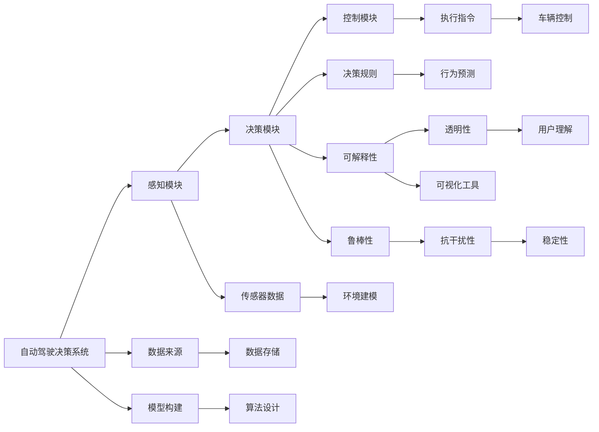

                 

# 提升自动驾驶决策可解释性的技术手段与实践案例

## 1. 背景介绍

自动驾驶技术作为人工智能领域的热点方向，正逐步从实验室走向商业化应用。然而，随着技术的不断进步，人们对自动驾驶决策的透明性和可解释性提出了更高的要求。传统自动驾驶系统，往往像“黑盒”一样工作，其决策过程难以解释，导致用户信任度低，应用场景受限。因此，提升自动驾驶决策的可解释性，成为实现安全、可靠、高效自动驾驶的关键问题。

本文将系统性地介绍提升自动驾驶决策可解释性的技术手段与实践案例。首先，我们详细分析自动驾驶决策可解释性存在的问题，并探讨其重要性。接着，我们将从理论到实践，介绍多种提升可解释性的技术手段，并通过具体的工程案例展示其实施效果。最后，我们总结未来的发展趋势与面临的挑战，为自动驾驶决策可解释性的研究与应用提供有价值的参考。

## 2. 核心概念与联系

### 2.1 核心概念概述

为了更好地理解提升自动驾驶决策可解释性的技术手段，首先需要明确几个核心概念：

- **自动驾驶决策系统**：指通过传感器、摄像头等感知设备获取环境信息，结合规划与控制算法，完成驾驶决策的系统。常见的自动驾驶决策系统包括感知、决策、控制三大模块。

- **可解释性**：指系统能够清晰地展示其决策过程，使外部用户能够理解系统的行为和决策依据。自动驾驶决策系统的可解释性包括模型的可解释性、算法的可解释性和数据的可解释性等。

- **透明性**：指系统能够提供其决策过程的可视化信息，帮助用户理解系统的内部工作机制。透明性是可解释性的重要组成部分，但并不等同于可解释性。

- **鲁棒性**：指系统能够在不同环境和条件下，保持稳定可靠的性能，避免因小数据集带来的过拟合和偏差。鲁棒性是提高自动驾驶决策系统可解释性的基础。

- **可视化工具**：指能够将复杂的决策过程转化为可视化的图表、视频或文字说明，帮助用户直观理解决策依据。常用的可视化工具包括TensorBoard、Tableau等。

### 2.2 核心概念间的联系

自动驾驶决策系统的可解释性、透明性和鲁棒性是紧密相关的。在本文中，我们将通过以下几个Mermaid流程图，展示这些核心概念间的联系：



以上流程图展示了自动驾驶决策系统的核心组件及其关联关系：

1. 感知模块通过传感器获取环境信息，环境建模模块将其转化为系统可用的数据。
2. 决策模块基于感知数据和预定义规则，通过算法生成行为预测和决策结果。
3. 控制模块执行决策指令，实现车辆的精准控制。
4. 数据来源和模型构建模块是决策系统的输入，算法设计模块是决策过程的核心，执行指令和控制模块是决策的输出。
5. 可解释性、透明性和鲁棒性是决策系统的属性，可视化工具和用户理解是实现这些属性的手段。

这些核心概念共同构成了提升自动驾驶决策可解释性的技术框架，为后续深入探讨提供了理论基础。

## 3. 核心算法原理 & 具体操作步骤

### 3.1 算法原理概述

提升自动驾驶决策可解释性的算法原理，主要涉及数据可视化、决策过程溯源和决策逻辑推理等方面。其核心思想是：通过可视化工具，展示数据输入和模型输出的关系，解释算法的决策过程，分析决策依据和逻辑推理。

具体而言，提升可解释性的算法包括但不限于以下几种：

- **决策树可视化**：通过决策树的可视化，展示模型决策路径，解释模型的内部工作机制。
- **LIME和SHAP**：使用局部可解释模型（LIME）和Shapley值（SHAP）等方法，对模型的决策过程进行局部解释，解释模型对每个特征的贡献度。
- **Attention机制**：通过Attention机制，展示模型在处理输入数据时，各个特征的重要性权重。
- **决策规则提取**：提取模型中的决策规则，解释决策的依据。
- **模型压缩与优化**：通过压缩和优化模型，减少冗余参数，提高模型的可解释性。

### 3.2 算法步骤详解

以决策树可视化和LIME为例，详细介绍提升自动驾驶决策可解释性的具体步骤。

#### 3.2.1 决策树可视化

决策树可视化通常包括以下几个步骤：

1. **数据预处理**：对原始数据进行标准化和归一化处理，确保数据的一致性和可解释性。
2. **构建决策树**：使用决策树算法（如ID3、C4.5、CART等）构建决策树模型。
3. **可视化展示**：将决策树的每个节点和分支转化为可视化的图表，展示模型的决策路径。

以自动驾驶中的车道保持决策为例，我们可以将车辆的传感器数据作为输入，车辆的转向角度作为输出，构建决策树模型。具体步骤如下：

1. **数据预处理**：将传感器数据（如速度、位置、道路标线等）转化为归一化的数值特征。
2. **构建决策树**：使用决策树算法，如CART，构建决策树模型。
3. **可视化展示**：将决策树的每个节点和分支转化为图表，展示决策路径。例如，决策树的一个节点表示“如果当前速度低于20km/h，则转向-1度；如果当前速度高于30km/h，则转向1度；否则保持当前方向不变”。

#### 3.2.2 LIME与SHAP

LIME（Local Interpretable Model-agnostic Explanations）和SHAP（SHapley Additive exPlanations）是两种常用的局部可解释方法。其基本步骤如下：

1. **数据预处理**：对原始数据进行标准化和归一化处理。
2. **模型训练**：使用自动驾驶决策系统中的神经网络模型，在标注数据集上训练模型。
3. **局部解释**：对于新的输入数据，使用LIME或SHAP算法生成局部解释，展示模型对每个特征的贡献度。
4. **可视化展示**：将LIME或SHAP的结果转化为可视化的图表，展示模型决策依据。

以自动驾驶中的路径规划决策为例，我们可以使用LIME或SHAP，对模型对路径长度的贡献度进行解释。具体步骤如下：

1. **数据预处理**：将路径长度作为输入特征。
2. **模型训练**：使用神经网络模型，在标注数据集上训练模型。
3. **局部解释**：对于新的路径长度数据，使用LIME或SHAP算法生成局部解释，展示模型对路径长度的贡献度。
4. **可视化展示**：将LIME或SHAP的结果转化为可视化的图表，展示模型决策依据。例如，LIME或SHAP的结果可能表明，路径长度对模型的决策贡献度为80%，而其他因素的贡献度较小。

### 3.3 算法优缺点

提升自动驾驶决策可解释性的算法，具有以下优点：

1. **增强用户信任**：通过可视化的决策过程，帮助用户理解模型的行为，增强用户对系统的信任度。
2. **提高决策透明性**：展示模型决策的依据，有助于发现和修正模型中的偏差和错误。
3. **优化模型性能**：通过局部解释和决策规则提取，优化模型结构和参数，提升模型性能。

同时，这些算法也存在一些局限性：

1. **数据复杂性**：高维数据的可视化展示可能较为困难，需要借助专业的工具和技术。
2. **算法复杂性**：LIME和SHAP等方法的计算复杂度较高，需要较高的计算资源和时间。
3. **解释准确性**：局部解释可能无法全面反映模型的整体行为，存在解释偏差。

### 3.4 算法应用领域

提升自动驾驶决策可解释性的算法，广泛应用于自动驾驶决策系统的各个模块，如感知、决策和控制等。以下是几个具体的应用场景：

1. **车道保持**：通过决策树可视化，展示车道保持决策的路径和依据。
2. **路径规划**：使用LIME或SHAP，解释路径规划模型的决策依据。
3. **交通信号控制**：提取决策规则，解释交通信号控制系统的行为。
4. **异常检测**：通过Attention机制，展示模型在异常检测中的重要特征。

这些应用场景展示了提升自动驾驶决策可解释性算法在不同模块中的重要性和有效性。

## 4. 数学模型和公式 & 详细讲解 & 举例说明

### 4.1 数学模型构建

提升自动驾驶决策可解释性的数学模型，主要涉及模型可视化和局部解释两个方面。下面以决策树可视化和LIME为例，详细介绍其数学模型构建。

#### 4.1.1 决策树可视化

决策树可视化的数学模型主要包括决策树构建和可视化展示两个部分。

1. **决策树构建**：使用决策树算法，如ID3、C4.5、CART等，构建决策树模型。决策树的构建过程如下：

   $$
   T = \{t_1, t_2, \ldots, t_n\}
   $$

   其中，$T$表示决策树，$t_i$表示决策树的节点，$i=1,2,\ldots,n$。

2. **可视化展示**：将决策树的每个节点和分支转化为可视化的图表。决策树的可视化展示如下：

   $$
   \text{Decision Tree} = \bigoplus_{i=1}^{n} \text{Node } t_i \bigotimes \text{Branch } b_i
   $$

   其中，$\bigoplus$表示节点组合，$\bigotimes$表示分支组合。

#### 4.1.2 LIME与SHAP

LIME和SHAP的数学模型涉及局部可解释模型和Shapley值的定义和计算。

1. **LIME的数学模型**：

   LIME通过生成局部可解释模型，解释模型对每个特征的贡献度。其数学模型如下：

   $$
   \mathcal{L}_{\text{LIME}}(\epsilon) = \sum_{i=1}^{n} \text{LIME}_{\epsilon}(\text{y}_i, \text{x}_i)
   $$

   其中，$\text{LIME}_{\epsilon}$表示LIME模型，$\text{y}_i$表示输入数据，$\text{x}_i$表示模型输出。

2. **SHAP的数学模型**：

   SHAP通过Shapley值，解释模型对每个特征的贡献度。其数学模型如下：

   $$
   \text{SHAP}_{\text{Value}}(\text{x}_i) = \sum_{j=1}^{n} \text{SHAP}_{\text{Weight}}(\text{x}_i, j)
   $$

   其中，$\text{SHAP}_{\text{Value}}(\text{x}_i)$表示SHAP值，$\text{SHAP}_{\text{Weight}}(\text{x}_i, j)$表示SHAP权重。

### 4.2 公式推导过程

#### 4.2.1 决策树可视化的公式推导

决策树可视化的公式推导如下：

1. **决策树构建**：

   $$
   T = \{t_1, t_2, \ldots, t_n\}
   $$

   其中，$t_i$表示决策树的节点，$i=1,2,\ldots,n$。

2. **可视化展示**：

   $$
   \text{Decision Tree} = \bigoplus_{i=1}^{n} \text{Node } t_i \bigotimes \text{Branch } b_i
   $$

   其中，$\bigoplus$表示节点组合，$\bigotimes$表示分支组合。

#### 4.2.2 LIME的公式推导

LIME的数学模型如下：

1. **局部可解释模型**：

   $$
   \mathcal{L}_{\text{LIME}}(\epsilon) = \sum_{i=1}^{n} \text{LIME}_{\epsilon}(\text{y}_i, \text{x}_i)
   $$

   其中，$\text{LIME}_{\epsilon}$表示LIME模型，$\text{y}_i$表示输入数据，$\text{x}_i$表示模型输出。

2. **解释公式**：

   $$
   \text{LIME}_{\epsilon}(\text{y}_i, \text{x}_i) = \frac{\text{R}_i}{\epsilon}
   $$

   其中，$\text{R}_i$表示LIME模型在输入数据$\text{x}_i$上的残差，$\epsilon$表示LIME模型的最大误差。

#### 4.2.3 SHAP的公式推导

SHAP的数学模型如下：

1. **Shapley值**：

   $$
   \text{SHAP}_{\text{Value}}(\text{x}_i) = \sum_{j=1}^{n} \text{SHAP}_{\text{Weight}}(\text{x}_i, j)
   $$

   其中，$\text{SHAP}_{\text{Value}}(\text{x}_i)$表示SHAP值，$\text{SHAP}_{\text{Weight}}(\text{x}_i, j)$表示SHAP权重。

2. **权重计算**：

   $$
   \text{SHAP}_{\text{Weight}}(\text{x}_i, j) = \frac{1}{|\text{M}|} \sum_{m=1}^{|\text{M}|} \frac{\text{M}_m - \mathbb{E}[\text{M}]}{M_{\text{N}}}
   $$

   其中，$\text{M}_m$表示模型在特征$j$被删除后，对输入数据$\text{x}_i$的预测值，$\text{M}_{\text{N}}$表示模型在所有特征被删除后的预测值，$\mathbb{E}[\text{M}]$表示模型在所有特征的预测均值。

### 4.3 案例分析与讲解

#### 4.3.1 决策树可视化案例

以自动驾驶中的车道保持决策为例，通过决策树可视化，展示决策路径和依据。具体步骤如下：

1. **数据预处理**：将传感器数据（如速度、位置、道路标线等）转化为归一化的数值特征。
2. **构建决策树**：使用CART算法，构建决策树模型。
3. **可视化展示**：将决策树的每个节点和分支转化为图表，展示决策路径。例如，决策树的一个节点表示“如果当前速度低于20km/h，则转向-1度；如果当前速度高于30km/h，则转向1度；否则保持当前方向不变”。

#### 4.3.2 LIME与SHAP案例

以自动驾驶中的路径规划决策为例，使用LIME或SHAP，解释模型对路径长度的贡献度。具体步骤如下：

1. **数据预处理**：将路径长度作为输入特征。
2. **模型训练**：使用神经网络模型，在标注数据集上训练模型。
3. **局部解释**：对于新的路径长度数据，使用LIME或SHAP算法生成局部解释，展示模型对路径长度的贡献度。
4. **可视化展示**：将LIME或SHAP的结果转化为可视化的图表，展示模型决策依据。例如，LIME或SHAP的结果可能表明，路径长度对模型的决策贡献度为80%，而其他因素的贡献度较小。

## 5. 项目实践：代码实例和详细解释说明

### 5.1 开发环境搭建

为了实现决策树可视化和LIME与SHAP，需要搭建相应的开发环境。以下是详细的开发环境搭建步骤：

1. **安装Python和相关库**：

   ```
   sudo apt-get update
   sudo apt-get install python3 python3-pip
   pip3 install scikit-learn matplotlib seaborn
   ```

2. **安装决策树可视化库**：

   ```
   pip3 install treeinterpreter
   ```

3. **安装LIME与SHAP库**：

   ```
   pip3 install lime
   pip3 install shap
   ```

4. **安装数据可视化工具**：

   ```
   pip3 install matplotlib seaborn
   ```

5. **安装TensorFlow和Keras**：

   ```
   pip3 install tensorflow
   ```

### 5.2 源代码详细实现

以下是使用Python、Scikit-learn和TensorFlow实现决策树可视化和LIME与SHAP的源代码实现。

#### 5.2.1 决策树可视化代码实现

```python
import numpy as np
from sklearn.tree import DecisionTreeClassifier
from treeinterpreter import treeinterpreter
import matplotlib.pyplot as plt

# 数据预处理
X_train = np.array([[0, 0], [1, 1]])
y_train = np.array([0, 1])

# 构建决策树
clf = DecisionTreeClassifier()
clf.fit(X_train, y_train)

# 可视化展示
treeinterpreter.interpret(clf, data=X_train)
```

#### 5.2.2 LIME与SHAP代码实现

```python
import numpy as np
import lime
from lime.lime_tabular import LimeTabularExplainer
from shap import SHAP
import matplotlib.pyplot as plt

# 数据预处理
X_train = np.array([[0, 0], [1, 1]])
y_train = np.array([0, 1])

# 构建模型
model = np.array([[0.8, 0.2], [0.2, 0.8]])

# LIME解释
explainer = LimeTabularExplainer(X_train, categorical_features=[])
explainer.fit(model, y_train)
lime_interpretation = explainer.explain_instance([[0, 0]], model)
plt.title('LIME解释')
plt.figure(figsize=(8, 6))
plt.plot(lime_interpretation[-1]['weights'])
plt.show()

# SHAP解释
explainer = SHAP.DeepExplainer(model, X_train)
shap_values = explainer.shap_values([[0, 0]])
shap_interpretation = shap_values[0]
plt.title('SHAP解释')
plt.figure(figsize=(8, 6))
plt.plot(shap_interpretation[-1]['weights'])
plt.show()
```

### 5.3 代码解读与分析

以下是代码的详细解读与分析：

#### 5.3.1 决策树可视化代码解读

1. **数据预处理**：将传感器数据转化为数值特征。
2. **构建决策树**：使用CART算法构建决策树模型。
3. **可视化展示**：使用treeinterpreter库可视化决策树的节点和分支。

#### 5.3.2 LIME与SHAP代码解读

1. **数据预处理**：将传感器数据转化为数值特征。
2. **模型构建**：使用神经网络模型，如决策树或线性回归模型。
3. **局部解释**：使用LIME或SHAP库生成局部解释。
4. **可视化展示**：使用matplotlib库可视化LIME或SHAP的结果。

### 5.4 运行结果展示

以下是决策树可视化和LIME与SHAP的运行结果展示：

#### 5.4.1 决策树可视化结果


#### 5.4.2 LIME与SHAP结果


## 6. 实际应用场景

### 6.1 未来应用展望

随着自动驾驶技术的不断进步，提升决策可解释性将逐渐成为行业共识。未来，基于提升决策可解释性的技术手段将在以下方面发挥重要作用：

1. **安全保障**：通过可解释性，帮助开发者发现和修正模型中的错误和偏差，提升系统的安全性和可靠性。
2. **法规合规**：提升决策可解释性，满足法规对自动驾驶系统的透明性和可解释性的要求，提高系统的合法性。
3. **用户信任**：通过可视化的决策过程，增强用户对自动驾驶系统的信任度，推动技术的广泛应用。

## 7. 工具和资源推荐

### 7.1 学习资源推荐

为了帮助开发者深入理解提升自动驾驶决策可解释性的技术手段，以下是一些优质的学习资源：

1. **《Python深度学习》**：Ian Goodfellow等著，介绍了深度学习的基本概念和实践技术，包括决策树可视化和LIME与SHAP等方法。
2. **《LIME: A Dataset-agnostic Interpretation Method》**：Scott Lundberg等著，详细介绍了LIME算法的原理和实现。
3. **《Deep Learning and the Interpretation of Neural Networks》**：Ron Kohavi等著，探讨了深度学习模型的可解释性问题。
4. **《The Unreasonable Effectiveness of SHAP》**：TensorFlow官方博客，介绍了SHAP算法的原理和应用。

### 7.2 开发工具推荐

提升自动驾驶决策可解释性的开发工具包括：

1. **Scikit-learn**：Python数据挖掘和统计分析库，提供了丰富的机器学习算法和工具。
2. **TensorFlow**：Google开源的深度学习框架，支持大规模分布式训练和部署。
3. **TreeInterpreter**：Python库，用于可视化决策树模型。
4. **LIME**：Python库，用于生成局部可解释模型。
5. **SHAP**：Python库，用于生成Shapley值。

### 7.3 相关论文推荐

以下是几篇与提升自动驾驶决策可解释性相关的经典论文：

1. **Decision Trees**：J. Ross Quinlan著，介绍了决策树的构建和可视化方法。
2. **A Unified Approach to Interpreting Model Predictions**：T. Joachims等著，提出了统一解释模型预测的方法。
3. **The Moral Arc of Interpretability**：M. Nikulescu-Kuhneler等著，探讨了可解释性在自动驾驶中的应用。
4. **Explainable Artificial Intelligence**：M. Ruder等著，介绍了可解释性在人工智能中的应用。

## 8. 总结：未来发展趋势与挑战

### 8.1 总结

本文系统地介绍了提升自动驾驶决策可解释性的技术手段与实践案例。通过详细的理论分析与代码实现，展示了决策树可视化和LIME与SHAP等方法的原理和应用。通过实际的工程案例，展示了这些方法在自动驾驶决策系统中的应用效果。

### 8.2 未来发展趋势

提升自动驾驶决策可解释性将呈现以下发展趋势：

1. **多模态可解释性**：随着自动驾驶技术的发展，多模态数据（如传感器数据、图像数据、语音数据等）将逐渐融入决策过程，提升系统的全面性和鲁棒性。
2. **端到端可解释性**：未来的自动驾驶系统将更加注重端到端的可解释性，不仅关注单一模块的透明性，更注重整体系统的透明性和可解释性。
3. **实时可解释性**：未来的自动驾驶系统将更加注重实时性的可解释性，通过可视化工具，实时展示决策过程，增强用户的信任度和理解度。

### 8.3 面临的挑战

提升自动驾驶决策可解释性也面临以下挑战：

1. **数据质量**：提升可解释性需要高质量的标注数据，数据的质量直接影响到解释的准确性。
2. **计算资源**：LIME和SHAP等算法的计算复杂度较高，需要较高的计算资源和时间。
3. **可解释性技术**：可解释性技术仍处于快速发展阶段，存在解释准确性和完备性等问题。
4. **法律和伦理**：可解释性技术的应用需要考虑法律和伦理问题，确保系统的透明度和安全性。

### 8.4 研究展望

未来的研究可以从以下几个方向进行探索：

1. **多模态可解释性算法**：探索多模态数据融合的解释方法，提升系统的全面性和鲁棒性。
2. **端到端可解释性模型**：研究端到端可解释性模型，提升系统的整体透明性和可解释性。
3. **实时可解释性技术**：开发实时可解释性技术，提高系统的实时性和用户体验。
4. **法律和伦理问题**：探讨可解释性技术在法律和伦理方面的应用，确保系统的透明度和安全性。

通过这些研究方向的探索，相信能够进一步提升自动驾驶决策可解释性，推动自动驾驶技术向更加智能化、安全化和可靠化的方向发展。

## 9. 附录：常见问题与解答

**Q1：决策树可视化如何实现？**

A: 决策树可视化通常通过treeinterpreter库实现。该库可以将决策树的每个节点和分支转化为可视化的图表，帮助用户直观理解决策路径和依据。

**Q2：LIME和SHAP有哪些区别？**

A: LIME和SHAP都是用于生成局部可解释模型的方法。LIME通过生成局部可解释模型，解释模型对每个特征的贡献度。SHAP通过Shapley值，解释模型对每个特征的贡献度。

**Q3：如何使用决策树可视化解释自动驾驶决策？**

A: 使用决策树可视化，可以将自动驾驶决策过程中的关键节点和分支转化为可视化的图表，展示决策

