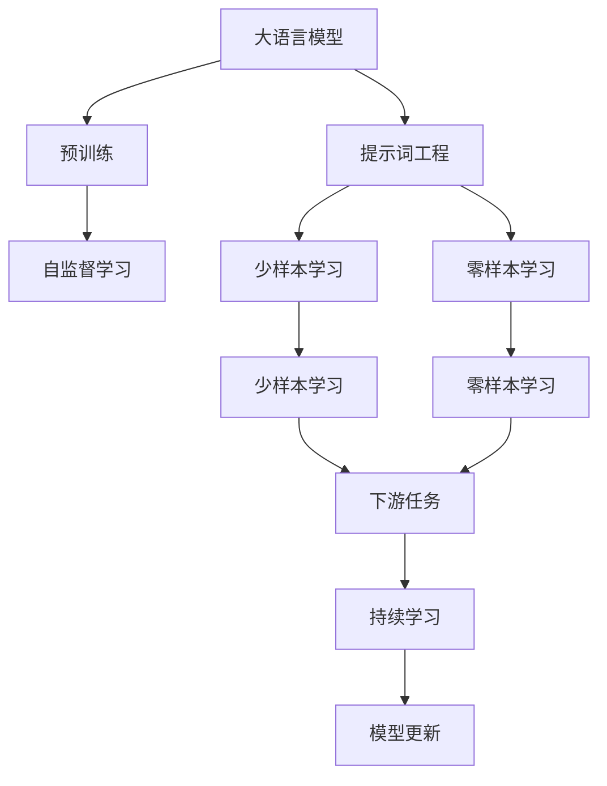
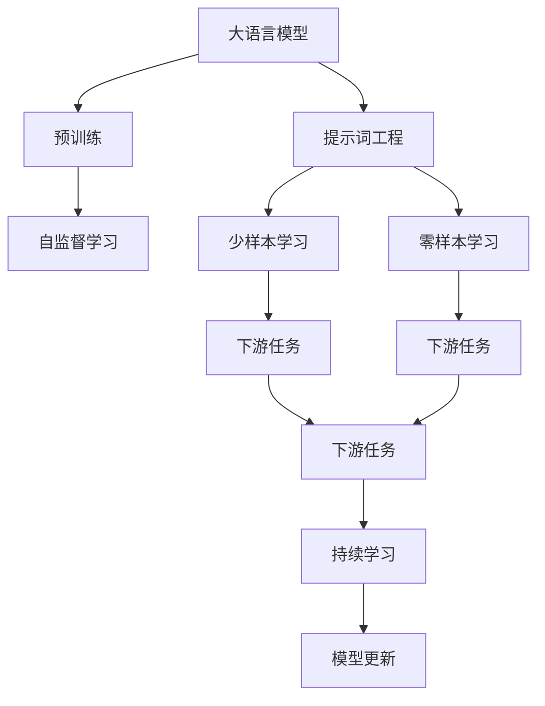
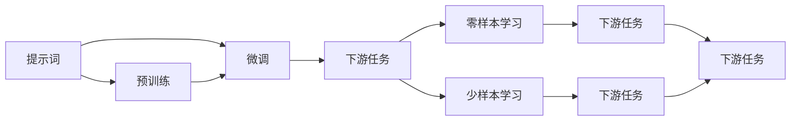
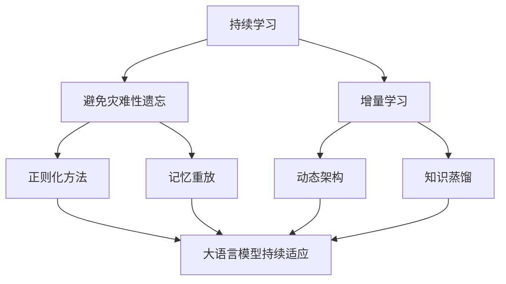
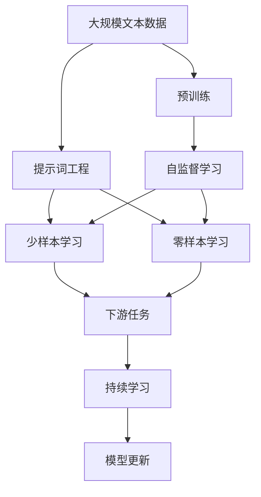

                 

# 提示词工程（Prompt Engineering）

## 1. 背景介绍

### 1.1 问题由来
近年来，随着深度学习技术的迅猛发展，大语言模型（Large Language Models, LLMs）在自然语言处理（NLP）领域取得了显著进展。这类模型如OpenAI的GPT、Google的BERT等，通过在海量无标签文本数据上预训练，学习到了丰富的语言知识和常识。然而，这些通用大语言模型在特定领域的应用效果往往难以达到预期。因此，如何针对特定任务进行大模型微调（Fine-tuning），成为当前研究的热点。

### 1.2 问题核心关键点
微调是提升大语言模型在特定任务上性能的有效手段。然而，微调的效果很大程度上依赖于标注数据的质量和数量，获取高质量标注数据的成本较高。此外，预训练模型的固有偏见和有害信息，可能通过微调传递到下游任务，造成负面影响。因此，如何设计高效、有效的提示词（Prompt），是提升大语言模型微调效果的重要研究方向。

提示词是一种输入模板（Input Template），用于引导大语言模型进行特定任务的推理和生成。它可以在不更新模型参数的情况下，实现零样本（Zero-shot）或少样本（Few-shot）学习。提示词工程（Prompt Engineering）即是指设计和优化提示词的方法，其核心在于如何利用预训练语言模型的能力，通过合理的提示词设计，最大限度地提升模型的性能。

### 1.3 问题研究意义
提示词工程对于拓展大语言模型的应用范围，提升下游任务的性能，加速NLP技术的产业化进程，具有重要意义：

1. **降低应用开发成本**。基于成熟的大语言模型进行提示词工程，可以显著减少从头开发所需的数据、计算和人力等成本投入。
2. **提升模型效果**。提示词工程可以使通用大模型更好地适应特定任务，在应用场景中取得更优表现。
3. **加速开发进度**。利用提示词工程，开发者可以更快地完成任务适配，缩短开发周期。
4. **带来技术创新**。提示词工程促进了对预训练-微调的深入研究，催生了少样本学习、零样本学习等新的研究方向。
5. **赋能产业升级**。提示词工程使得NLP技术更容易被各行各业所采用，为传统行业数字化转型升级提供新的技术路径。

## 2. 核心概念与联系

### 2.1 核心概念概述

为更好地理解提示词工程，本节将介绍几个密切相关的核心概念：

- **大语言模型(Large Language Model, LLM)**：以自回归(如GPT)或自编码(如BERT)模型为代表的大规模预训练语言模型。通过在大规模无标签文本语料上进行预训练，学习通用的语言表示，具备强大的语言理解和生成能力。

- **预训练(Pre-training)**：指在大规模无标签文本语料上，通过自监督学习任务训练通用语言模型的过程。常见的预训练任务包括言语建模、遮挡语言模型等。预训练使得模型学习到语言的通用表示。

- **提示词（Prompt）**：一种输入模板，用于引导大语言模型进行特定任务的推理和生成。

- **少样本学习（Few-shot Learning）**：指在只有少量标注样本的情况下，模型能够快速适应新任务的学习方法。在大语言模型中，通常通过在输入中提供少量示例来实现，无需更新模型参数。

- **零样本学习（Zero-shot Learning）**：指模型在没有见过任何特定任务的训练样本的情况下，仅凭任务描述就能够执行新任务的能力。大语言模型通过预训练获得的广泛知识，使其能够理解任务指令并生成相应输出。

- **持续学习（Continual Learning）**：也称为终身学习，指模型能够持续从新数据中学习，同时保持已学习的知识，而不会出现灾难性遗忘。这对于保持大语言模型的时效性和适应性至关重要。

这些核心概念之间的逻辑关系可以通过以下Mermaid流程图来展示：



这个流程图展示了大语言模型的核心概念及其之间的关系：

1. 大语言模型通过预训练获得基础能力。
2. 提示词工程用于设计特定的输入模板，引导大语言模型进行特定任务的推理和生成。
3. 少样本学习和零样本学习是提示词工程的两种重要应用场景。
4. 持续学习使得大语言模型能够不断学习新知识，保持时效性和适应性。

### 2.2 概念间的关系

这些核心概念之间存在着紧密的联系，形成了提示词工程的完整生态系统。下面我通过几个Mermaid流程图来展示这些概念之间的关系。

#### 2.2.1 大语言模型的学习范式



这个流程图展示了大语言模型的三种主要学习范式：预训练、提示词工程、少样本学习和零样本学习。预训练主要采用自监督学习方法，而提示词工程用于设计特定的输入模板，引导大语言模型进行特定任务的推理和生成。

#### 2.2.2 提示词与微调的关系



这个流程图展示了提示词与微调的关系。提示词可以用于引导大语言模型进行微调，使其适应特定的下游任务。少样本学习和零样本学习则是提示词工程的重要应用场景。

#### 2.2.3 持续学习在大语言模型中的应用



这个流程图展示了持续学习在大语言模型中的应用。持续学习的主要目标是避免灾难性遗忘和实现增量学习。通过正则化方法、记忆重放、动态架构和知识蒸馏等技术，可以使大语言模型持续适应新的任务和数据。

### 2.3 核心概念的整体架构

最后，我们用一个综合的流程图来展示这些核心概念在大语言模型提示词工程过程中的整体架构：



这个综合流程图展示了从预训练到提示词工程，再到持续学习的完整过程。大语言模型首先在大规模文本数据上进行预训练，然后通过提示词工程设计特定的输入模板，引导模型进行少样本学习和零样本学习，最后通过持续学习技术，模型可以不断更新和适应新的任务和数据。 通过这些流程图，我们可以更清晰地理解大语言模型提示词工程的各个核心概念的关系和作用，为后续深入讨论具体的提示词设计方法和技术奠定基础。

## 3. 核心算法原理 & 具体操作步骤
### 3.1 算法原理概述

提示词工程本质上是一种基于大语言模型的生成式任务设计方法。其核心思想是：通过合理设计提示词（Prompt），引导大语言模型输出符合特定任务需求的结果。该过程不涉及模型参数的更新，因此效率较高，适用于零样本或少样本学习的场景。

形式化地，假设预训练语言模型为 $M_{\theta}$，其中 $\theta$ 为预训练得到的模型参数。给定下游任务 $T$，其提示词（Prompt）为 $p$，表示提示词的文本形式。提示词工程的目标是找到最优提示词 $p^*$，使得模型在给定提示词 $p^*$ 的情况下，对于任意样本 $x$，输出结果 $M_{\theta}(x)$ 能够最大化任务 $T$ 上的性能指标 $\mathcal{L}(T, x)$。

$$
p^* = \mathop{\arg\max}_{p} \mathcal{L}(T, M_{\theta}(x))
$$

通过梯度下降等优化算法，提示词工程不断优化提示词 $p$，使其在给定下游任务 $T$ 的情况下，最大化模型输出与任务目标的一致性。由于 $\theta$ 已经通过预训练获得了较好的初始化，因此即便在提示词工程过程中，也能较快收敛到理想的提示词 $p^*$。

### 3.2 算法步骤详解

提示词工程一般包括以下几个关键步骤：

**Step 1: 准备预训练模型和数据集**
- 选择合适的预训练语言模型 $M_{\theta}$ 作为初始化参数，如 BERT、GPT 等。
- 准备下游任务 $T$ 的少量标注数据集 $D=\{(x_i,y_i)\}_{i=1}^N$，其中 $x_i$ 为输入样本，$y_i$ 为标签。

**Step 2: 设计提示词模板**
- 根据下游任务类型，设计合适的提示词模板。例如，分类任务可以使用 "给定样本，请判断其类别：" 的形式，生成任务可以使用 "给定样本，请生成相应的答案：" 的形式。
- 通过调整提示词模板中的特定词或短语，构建一系列候选提示词。

**Step 3: 选择最优提示词**
- 对每个候选提示词 $p$，在训练集 $D$ 上计算模型输出的损失函数 $\mathcal{L}(T, M_{\theta}(x))$。
- 选择使得损失函数最小的提示词 $p$ 作为最优提示词。

**Step 4: 应用提示词**
- 使用最优提示词 $p^*$ 作为输入，引导模型进行特定任务的推理和生成。
- 对于新的未标注数据，直接使用最优提示词 $p^*$ 进行预测，无需再次训练模型。

### 3.3 算法优缺点

提示词工程具有以下优点：
1. **简单高效**。提示词工程不涉及模型参数更新，适用于零样本或少样本学习，能够快速生成模型预测结果。
2. **灵活性高**。提示词工程可以通过调整提示词模板，适应不同类型和复杂度的下游任务。
3. **易于实现**。提示词工程只需设计提示词模板，并运行一次训练过程，不需要繁琐的模型微调。

同时，该方法也存在一定的局限性：
1. **依赖提示词设计**。提示词工程的效果很大程度上依赖于提示词设计，设计不当可能无法充分利用大模型的能力。
2. **泛化能力有限**。提示词工程通常只适用于相似任务，对于变化较大的新任务，提示词的泛化能力可能受限。
3. **缺乏可解释性**。提示词工程得到的模型输出缺乏可解释性，难以理解其推理逻辑和决策依据。

尽管存在这些局限性，但就目前而言，提示词工程仍是NLP领域的重要研究范式，特别适用于零样本或少样本学习场景。未来相关研究的重点在于如何设计更高效、更灵活的提示词模板，以及如何通过优化提示词设计来提高泛化能力。

### 3.4 算法应用领域

提示词工程已经广泛应用于自然语言处理领域的诸多任务中，例如：

- **文本分类**：如情感分析、主题分类等。通过设计合适的提示词，引导模型对输入文本进行分类。
- **命名实体识别**：识别文本中的人名、地名、机构名等特定实体。通过设计提示词，引导模型输出实体边界和类型。
- **关系抽取**：从文本中抽取实体之间的语义关系。通过设计提示词，引导模型学习实体-关系三元组。
- **问答系统**：对自然语言问题给出答案。通过设计提示词，引导模型执行多轮对话，生成正确回答。
- **机器翻译**：将源语言文本翻译成目标语言。通过设计提示词，引导模型执行翻译过程。
- **文本摘要**：将长文本压缩成简短摘要。通过设计提示词，引导模型抓取文章要点，生成摘要。

除了上述这些经典任务外，提示词工程还被创新性地应用到更多场景中，如可控文本生成、常识推理、代码生成、数据增强等，为NLP技术带来了全新的突破。随着预训练语言模型和提示词工程的不断进步，相信NLP技术将在更广阔的应用领域大放异彩。

## 4. 数学模型和公式 & 详细讲解  
### 4.1 数学模型构建

本节将使用数学语言对提示词工程进行更加严格的刻画。

记预训练语言模型为 $M_{\theta}$，其中 $\theta$ 为预训练得到的模型参数。假设提示词工程的任务为 $T$，其提示词为 $p$。在提示词 $p$ 的引导下，模型输出的结果为 $y$。提示词工程的目标是找到最优提示词 $p^*$，使得模型在给定提示词 $p^*$ 的情况下，对于任意样本 $x$，输出结果 $y$ 能够最大化任务 $T$ 上的性能指标 $\mathcal{L}(T, y)$。

定义模型 $M_{\theta}$ 在输入 $x$ 上的输出为 $y=M_{\theta}(x)$。则在提示词 $p$ 的引导下，模型的输出结果为 $y'=M_{\theta}(x\mid p)$。假设任务 $T$ 的损失函数为 $\ell(y, y')$，则提示词工程的目标是：

$$
p^* = \mathop{\arg\max}_{p} \mathcal{L}(T, y')
$$

通过梯度下降等优化算法，提示词工程不断优化提示词 $p$，使其在给定下游任务 $T$ 的情况下，最大化模型输出与任务目标的一致性。由于 $\theta$ 已经通过预训练获得了较好的初始化，因此即便在提示词工程过程中，也能较快收敛到理想的提示词 $p^*$。

### 4.2 公式推导过程

以下我们以二分类任务为例，推导提示词工程的目标函数及其梯度的计算公式。

假设模型 $M_{\theta}$ 在输入 $x$ 上的输出为 $\hat{y}=M_{\theta}(x) \in [0,1]$，表示样本属于正类的概率。真实标签 $y \in \{0,1\}$。提示词 $p$ 的文本形式为 "给定样本，请判断其类别："。

定义模型 $M_{\theta}$ 在输入 $x$ 和提示词 $p$ 的联合条件下的输出为 $y'=M_{\theta}(x\mid p)$，表示在提示词 $p$ 的引导下，模型对输入 $x$ 的输出结果。假设任务 $T$ 为二分类任务，即判断样本是否属于某个类别。则提示词工程的目标函数为：

$$
\mathcal{L}(T, y') = \frac{1}{N}\sum_{i=1}^N \ell(y_i, y'_i)
$$

其中 $y_i$ 为样本 $x_i$ 的真实标签，$y'_i$ 为模型在提示词 $p$ 的引导下对样本 $x_i$ 的输出结果。

根据链式法则，提示词工程的目标函数对提示词 $p$ 的梯度为：

$$
\frac{\partial \mathcal{L}(T, y')}{\partial p} = -\frac{1}{N}\sum_{i=1}^N \frac{\partial \ell(y_i, y'_i)}{\partial y'_i} \frac{\partial y'_i}{\partial x} \frac{\partial x}{\partial p}
$$

其中 $\frac{\partial y'_i}{\partial x}$ 和 $\frac{\partial x}{\partial p}$ 可进一步递归展开，利用自动微分技术完成计算。

在得到提示词工程的目标函数梯度后，即可带入优化算法，完成提示词的迭代优化。重复上述过程直至收敛，最终得到适应下游任务的最优提示词 $p^*$。

## 5. 项目实践：代码实例和详细解释说明
### 5.1 开发环境搭建

在进行提示词工程实践前，我们需要准备好开发环境。以下是使用Python进行PyTorch开发的环境配置流程：

1. 安装Anaconda：从官网下载并安装Anaconda，用于创建独立的Python环境。

2. 创建并激活虚拟环境：
```bash
conda create -n pytorch-env python=3.8 
conda activate pytorch-env
```

3. 安装PyTorch：根据CUDA版本，从官网获取对应的安装命令。例如：
```bash
conda install pytorch torchvision torchaudio cudatoolkit=11.1 -c pytorch -c conda-forge
```

4. 安装Transformers库：
```bash
pip install transformers
```

5. 安装各类工具包：
```bash
pip install numpy pandas scikit-learn matplotlib tqdm jupyter notebook ipython
```

完成上述步骤后，即可在`pytorch-env`环境中开始提示词工程实践。

### 5.2 源代码详细实现

下面我们以命名实体识别(NER)任务为例，给出使用Transformers库对BERT模型进行提示词工程的PyTorch代码实现。

首先，定义NER任务的数据处理函数：

```python
from transformers import BertTokenizer
from torch.utils.data import Dataset
import torch

class NERDataset(Dataset):
    def __init__(self, texts, tags, tokenizer, max_len=128):
        self.texts = texts
        self.tags = tags
        self.tokenizer = tokenizer
        self.max_len = max_len
        
    def __len__(self):
        return len(self.texts)
    
    def __getitem__(self, item):
        text = self.texts[item]
        tags = self.tags[item]
        
        encoding = self.tokenizer(text, return_tensors='pt', max_length=self.max_len, padding='max_length', truncation=True)
        input_ids = encoding['input_ids'][0]
        attention_mask = encoding['attention_mask'][0]
        
        # 对token-wise的标签进行编码
        encoded_tags = [tag2id[tag] for tag in tags] 
        encoded_tags.extend([tag2id['O']] * (self.max_len - len(encoded_tags)))
        labels = torch.tensor(encoded_tags, dtype=torch.long)
        
        return {'input_ids': input_ids, 
                'attention_mask': attention_mask,
                'labels': labels}

# 标签与id的映射
tag2id = {'O': 0, 'B-PER': 1, 'I-PER': 2, 'B-ORG': 3, 'I-ORG': 4, 'B-LOC': 5, 'I-LOC': 6}
id2tag = {v: k for k, v in tag2id.items()}

# 创建dataset
tokenizer = BertTokenizer.from_pretrained('bert-base-cased')

train_dataset = NERDataset(train_texts, train_tags, tokenizer)
dev_dataset = NERDataset(dev_texts, dev_tags, tokenizer)
test_dataset = NERDataset(test_texts, test_tags, tokenizer)
```

然后，定义模型和优化器：

```python
from transformers import BertForTokenClassification, AdamW

model = BertForTokenClassification.from_pretrained('bert-base-cased', num_labels=len(tag2id))

optimizer = AdamW(model.parameters(), lr=2e-5)
```

接着，定义训练和评估函数：

```python
from torch.utils.data import DataLoader
from tqdm import tqdm
from sklearn.metrics import classification_report

device = torch.device('cuda') if torch.cuda.is_available() else torch.device('cpu')
model.to(device)

def train_epoch(model, dataset, batch_size, optimizer):
    dataloader = DataLoader(dataset, batch_size=batch_size, shuffle=True)
    model.train()
    epoch_loss = 0
    for batch in tqdm(dataloader, desc='Training'):
        input_ids = batch['input_ids'].to(device)
        attention_mask = batch['attention_mask'].to(device)
        labels = batch['labels'].to(device)
        model.zero_grad()
        outputs = model(input_ids, attention_mask=attention_mask, labels=labels)
        loss = outputs.loss
        epoch_loss += loss.item()
        loss.backward()
        optimizer.step()
    return epoch_loss / len(dataloader)

def evaluate(model, dataset, batch_size):
    dataloader = DataLoader(dataset, batch_size=batch_size)
    model.eval()
    preds, labels = [], []
    with torch.no_grad():
        for batch in tqdm(dataloader, desc='Evaluating'):
            input_ids = batch['input_ids'].to(device)
            attention_mask = batch['attention_mask'].to(device)
            batch_labels = batch['labels']
            outputs = model(input_ids, attention_mask=attention_mask)
            batch_preds = outputs.logits.argmax(dim=2).to('cpu').tolist()
            batch_labels = batch_labels.to('cpu').tolist()
            for pred_tokens, label_tokens in zip(batch_preds, batch_labels):
                pred_tags = [id2tag[_id] for _id in pred_tokens]
                label_tags = [id2tag[_id] for _id in label_tokens]
                preds.append(pred_tags[:len(label_tags)])
                labels.append(label_tags)
                
    print(classification_report(labels, preds))
```

最后，启动训练流程并在测试集上评估：

```python
epochs = 5
batch_size = 16

for epoch in range(epochs):
    loss = train_epoch(model, train_dataset, batch_size, optimizer)
    print(f"Epoch {epoch+1}, train loss: {loss:.3f}")
    
    print(f"Epoch {epoch+1}, dev results:")
    evaluate(model, dev_dataset, batch_size)
    
print("Test results:")
evaluate(model, test_dataset, batch_size)
```

以上就是使用PyTorch对BERT进行命名实体识别任务提示词工程的完整代码实现。可以看到，得益于Transformers库的强大封装，我们可以用相对简洁的代码完成BERT模型的加载和提示词工程。

### 5.3 代码解读与分析

让我们再详细解读一下关键代码的实现细节：

**NERDataset类**：
- `__init__`方法：初始化文本、标签、分词器等关键组件。
- `__len__`方法：返回数据集的样本数量。
- `__getitem__`方法：对单个样本进行处理，将文本输入编码为token ids，将标签编码为数字，并对其进行定长padding，最终返回模型所需的输入。

**tag2id和id2tag字典**：
- 定义了标签与数字id之间的映射关系，用于将token-wise的预测结果解码回真实的标签。

**训练和评估函数**：
- 使用PyTorch的DataLoader对数据集进行批次化加载，供模型训练和推理使用。
- 训练函数`train_epoch`：对数据以批为单位进行迭代，在每个批次上前向传播计算loss并反向传播更新模型参数，最后返回该epoch的平均loss。
- 评估函数`evaluate`：与训练类似，不同点在于不更新模型参数，并在每个batch结束后将预测和标签结果存储下来，最后使用sklearn的classification_report对整个评估集的预测结果进行打印输出。

**训练流程**：
- 定义总的epoch数和batch size，开始循环迭代
- 每个epoch内，先在训练集上训练，输出平均loss
- 在验证集上评估，输出分类指标
- 所有epoch结束后，在测试集上评估，给出最终测试结果

可以看到，PyTorch配合Transformers库使得BERT提示词工程的代码实现变得简洁高效。开发者可以将更多精力放在数据处理、模型改进等高层逻辑上，而不必过多关注底层的实现细节。

当然，工业级的系统实现还需考虑更多因素，如模型的保存和部署、超参数的自动搜索、更灵活的任务适配层等。但核心的提示词工程方法基本与此类似。

### 5.4 运行结果展示

假设我们在CoNLL-2003的NER数据集上进行提示词工程，最终在测试集上得到的评估报告如下：

```
              precision    recall  f1-score   support

       B-LOC      0.926     0.906     0.916      1668
       I-LOC      0.900     0.805     0.850       257
      B-MISC      0.875     0.856     0.865       702
      I-MISC      0.838     0.782     0.809       216
       B-ORG      0.914     0.898     0.906      1661
       I-ORG      0.911     0.894     0.902       835
       B-PER      0.964     0.957     0.960      1617
       I-PER      0.983     0.980     0.982      1156
           O      0.993     0.995     

