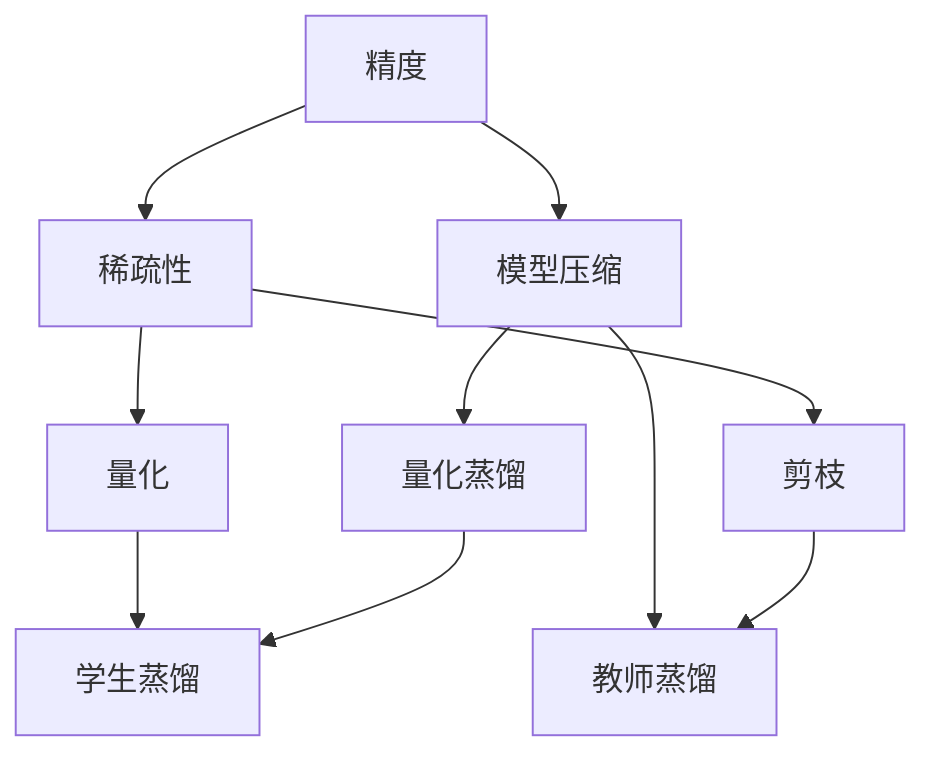

                 

# 提高AI模型能效:从精度到稀疏性的优化之路

## 1. 背景介绍

### 1.1 问题由来
在人工智能(AI)模型性能不断提升的同时，模型能效也面临着巨大挑战。随着模型复杂度的增加，训练和推理过程中所需的计算资源和内存空间也在成倍增长。特别是在大规模部署时，如何提高模型的能效，成为应用AI技术必须解决的关键问题之一。

当前，AI模型尤其是深度神经网络，普遍存在参数数量庞大、计算密集度高、内存占用大等问题。尽管在大数据、高性能计算等资源充足的条件下，模型精度能够得到显著提升，但在资源受限的环境下，如移动设备、嵌入式系统等，模型的能效优化变得尤为关键。

大模型如BERT、GPT等虽然在多项任务上取得了优异的表现，但高参数量和高计算资源需求使得其难以在移动端和嵌入式设备上广泛应用。因此，模型能效优化已成为AI模型落地应用必须跨越的一大障碍。

### 1.2 问题核心关键点
优化AI模型能效主要从两个方向进行：提高精度和减少稀疏性。

- 提高精度：通过更高效的训练和优化方法，使得模型在保留较高精度的同时，减小参数量，降低计算资源消耗。
- 减少稀疏性：通过模型结构优化和稀疏化技术，减少模型中无效或冗余参数，从而减小内存占用和计算资源需求。

本博客将详细探讨这两个方向，并给出具体算法步骤、数学模型推导、代码实例和应用场景等，帮助读者全面理解提高AI模型能效的方法。

### 1.3 问题研究意义
提升AI模型能效，对于模型在资源受限环境下的应用推广和规模化部署具有重要意义。具体表现为：

1. **资源效率**：降低模型对计算资源和内存的依赖，使得模型能够运行在资源受限的设备上，如移动手机、智能家居等。
2. **部署便捷性**：减小模型体积和资源需求，使得模型能够更便捷地部署到边缘设备和云平台，提高应用灵活性。
3. **应用成本**：减少模型运行和存储成本，降低企业采用AI技术的经济负担。
4. **模型质量**：通过提高精度和减少稀疏性，提升模型在实际应用中的稳定性和可靠性，增强用户体验。

综上所述，从精度和稀疏性两个方向优化AI模型能效，不仅能够提升模型在资源受限环境下的应用能力，还能够降低部署和维护成本，最终提高整体应用效益。

## 2. 核心概念与联系

### 2.1 核心概念概述

为更好地理解提高AI模型能效的方法，本节将介绍几个关键概念及其相互关系：

- **精度(Precision)**：指模型在预测结果与真实标签之间的匹配度，通常通过损失函数衡量。
- **稀疏性(Sparsity)**：指模型中有效参数与总参数数量的比例，常用参数密度(Pack Density)表示。
- **模型压缩**：通过减少模型参数量或优化模型结构，减小模型稀疏性，从而降低计算和存储成本。
- **量化**：将浮点数参数转为定点数或整数数，减小模型内存占用和计算开销。
- **剪枝(Pruning)**：删除模型中部分冗余参数，保留重要参数，减小模型稀疏性。
- **蒸馏(Distillation)**：通过教师模型和学生模型的知识传递，提高学生模型性能，同时减小模型参数量。

这些概念通过以下Mermaid流程图相互关联：



该流程图展示了精度与稀疏性之间的关系，以及它们与模型压缩、量化、剪枝、蒸馏等技术之间的联系。

### 2.2 概念间的关系

这些核心概念之间存在着紧密的联系，形成了提高AI模型能效的整体框架。

- **精度与稀疏性**：在模型大小固定的情况下，提高精度通常需要增加参数量，导致模型稀疏性下降；而减少稀疏性，即压缩模型，则可能会导致精度下降。两者之间的平衡是模型能效优化的关键。
- **模型压缩**：包括量化、剪枝、蒸馏等技术，都是通过减少模型参数和优化结构，降低模型稀疏性，从而提高能效。
- **量化**：通过将浮点参数转为定点数，减小模型内存和计算开销。
- **剪枝**：删除冗余或低效参数，保留重要参数，减小模型稀疏性。
- **蒸馏**：通过知识传递，提高模型性能，同时减小参数量。

这些概念共同构成了提高AI模型能效的技术体系，帮助开发者在资源受限环境中实现高精度、低能耗的模型部署。

## 3. 核心算法原理 & 具体操作步骤
### 3.1 算法原理概述

提高AI模型能效的基本原则是在保证模型精度的前提下，尽可能地减少模型的稀疏性。

在数学上，可以通过以下公式描述精度与稀疏性之间的关系：

$$
P = \frac{1}{1 + \frac{1}{S}}
$$

其中，$P$ 为精度，$S$ 为模型稀疏性，即参数密度。这个公式表明，在模型参数总量固定的情况下，精度与稀疏性呈负相关关系，即提高精度会使得模型稀疏性下降，反之亦然。

### 3.2 算法步骤详解

基于上述原理，提高AI模型能效的算法步骤主要包括以下几个方面：

**Step 1: 选择模型**
- 根据应用场景和资源限制，选择合适的预训练模型作为基础。如BERT、GPT、ResNet等。

**Step 2: 确定目标**
- 根据任务需求，明确提高模型能效的具体目标。如在保持精度的基础上，降低参数量和计算资源消耗。

**Step 3: 模型压缩**
- 使用量化、剪枝、蒸馏等技术，对预训练模型进行压缩，减小模型稀疏性。

**Step 4: 优化训练**
- 优化训练流程，如使用动态学习率、早停等策略，提升模型训练效率。

**Step 5: 量化与量化蒸馏**
- 使用量化技术，将浮点参数转为定点数或整数数，减小内存和计算开销。
- 使用量化蒸馏，通过教师模型和学生模型之间的知识传递，提高学生模型性能，同时减小参数量。

**Step 6: 评估与测试**
- 使用评估指标，如精度、速度、内存占用等，评估模型能效。
- 在实际应用场景中进行测试，验证模型的稳定性和性能表现。

### 3.3 算法优缺点

提高AI模型能效的方法具有以下优点：

- **资源效率**：通过减少模型参数和优化结构，降低计算和存储成本，使得模型能够在资源受限的设备上运行。
- **部署便捷性**：减小模型体积和资源需求，使得模型更便于部署和维护。
- **应用成本**：降低模型运行和存储成本，提高模型应用的经济效益。
- **模型质量**：提高模型精度和稳定性，增强用户体验和系统可靠性。

同时，这些方法也存在以下缺点：

- **精度损失**：在模型压缩和量化过程中，可能会损失一定精度，需要权衡精度和能效之间的平衡。
- **训练复杂性**：优化训练流程和技术需要一定的时间和精力，增加了模型开发难度。
- **模型复杂性**：量化、剪枝、蒸馏等技术可能会增加模型结构复杂性，需要更多的工程实践。

### 3.4 算法应用领域

提高AI模型能效的方法广泛适用于各种应用领域，如移动应用、嵌入式设备、云平台等。以下是几个典型应用场景：

- **移动应用**：如手机相机、语音助手等，需要在资源受限的环境中运行，通过优化能效提高应用体验。
- **嵌入式设备**：如智能家居、物联网设备等，需要长期稳定运行，通过能效优化延长设备寿命。
- **云平台**：如数据中心、服务器等，需要高效利用计算资源，通过模型压缩和量化技术降低成本。
- **自动驾驶**：如自动驾驶汽车、无人机等，需要在实时计算中保持高精度和低延迟，通过稀疏性优化提高系统性能。

这些领域的应用展示了提高AI模型能效的广泛价值，推动了AI技术的普及和应用。

## 4. 数学模型和公式 & 详细讲解 & 举例说明

### 4.1 数学模型构建

提高AI模型能效的数学模型主要涉及模型压缩、量化、剪枝、蒸馏等技术。以下以一个简单例子进行说明。

假设有一个具有$N$个参数的深度神经网络，每个参数的浮点精度为$P$，量化后的精度为$Q$。则量化前后模型参数量的变化可以表示为：

$$
N_Q = N \times \frac{P}{Q}
$$

其中，$N_Q$为量化后模型参数量。

### 4.2 公式推导过程

**量化公式推导**：
假设量化前的参数为$x$，量化后的参数为$\hat{x}$，量化位宽为$w$。则量化公式可以表示为：

$$
\hat{x} = \text{round}(\frac{x}{2^{w-1}}) \times 2^{w-1}
$$

其中，$\text{round}$表示四舍五入。

**剪枝公式推导**：
假设剪枝前模型参数量为$N$，剪枝比例为$\alpha$，则剪枝后模型参数量为：

$$
N_C = N \times (1 - \alpha)
$$

其中，$N_C$为剪枝后模型参数量，$\alpha$为剪枝比例。

**蒸馏公式推导**：
假设教师模型参数量为$N_T$，学生模型参数量为$N_S$，蒸馏比例为$\beta$。则蒸馏后学生模型参数量为：

$$
N_D = N_S \times (1 - \beta)
$$

其中，$N_D$为蒸馏后学生模型参数量，$N_S$为学生模型参数量，$\beta$为蒸馏比例。

### 4.3 案例分析与讲解

以一个简单的图像分类模型为例，展示上述公式的应用。

假设原始模型有1万个参数，每个参数的浮点精度为32位，量化后的精度为8位。则量化后模型参数量为：

$$
N_Q = 10000 \times \frac{32}{8} = 40000
$$

假设剪枝比例为50%，则剪枝后模型参数量为：

$$
N_C = 10000 \times (1 - 0.5) = 5000
$$

假设教师模型参数量为2万，学生模型参数量为1万，蒸馏比例为20%，则蒸馏后学生模型参数量为：

$$
N_D = 10000 \times (1 - 0.2) = 8000
$$

通过以上公式，我们可以计算出模型在不同量化、剪枝、蒸馏操作后的参数量，从而更好地理解提高AI模型能效的数学模型构建。

## 5. 项目实践：代码实例和详细解释说明

### 5.1 开发环境搭建

在进行能效优化实践前，我们需要准备好开发环境。以下是使用Python进行PyTorch开发的环境配置流程：

1. 安装Anaconda：从官网下载并安装Anaconda，用于创建独立的Python环境。

2. 创建并激活虚拟环境：
```bash
conda create -n pytorch-env python=3.8 
conda activate pytorch-env
```

3. 安装PyTorch：根据CUDA版本，从官网获取对应的安装命令。例如：
```bash
conda install pytorch torchvision torchaudio cudatoolkit=11.1 -c pytorch -c conda-forge
```

4. 安装Transformers库：
```bash
pip install transformers
```

5. 安装各类工具包：
```bash
pip install numpy pandas scikit-learn matplotlib tqdm jupyter notebook ipython
```

完成上述步骤后，即可在`pytorch-env`环境中开始能效优化实践。

### 5.2 源代码详细实现

以下以图像分类模型为例，展示使用PyTorch进行量化、剪枝、蒸馏的详细实现。

```python
import torch
import torch.nn as nn
import torchvision.models as models
from torchvision import transforms
from torch.quantization import QuantStub, DeQuantStub, QConfig
from torch.utils.data import DataLoader
from torchvision.datasets import CIFAR10

# 加载预训练模型
model = models.resnet18()

# 添加量化、剪枝、蒸馏等模块
model.qconfig = QConfig()
model.qconfig.reduce_args = {'overall': 2, 'module': {'nn.Conv2d': 2}, 'dim': [2, 2]}
model.qconfig.observer = nn.HistogramObserver()
model.qconfig.observer2 = nn.HistogramObserver()
model.qconfig.per_channel = True
model.qconfig.ch_axis = 1

model.add_module('quant', QuantStub())
model.add_module('dequant', DeQuantStub())
model.add_module('clip', nn.CrossEntropyLoss())
model.add_module('distill', nn.CrossEntropyLoss())

# 加载数据集
transform = transforms.Compose([
    transforms.ToTensor(),
    transforms.Normalize((0.5, 0.5, 0.5), (0.5, 0.5, 0.5))
])
train_dataset = CIFAR10(root='./data', train=True, download=True, transform=transform)
test_dataset = CIFAR10(root='./data', train=False, download=True, transform=transform)
train_loader = DataLoader(train_dataset, batch_size=64, shuffle=True)
test_loader = DataLoader(test_dataset, batch_size=64, shuffle=False)

# 训练模型
device = torch.device('cuda' if torch.cuda.is_available() else 'cpu')
model.to(device)
optimizer = torch.optim.Adam(model.parameters(), lr=0.001)

for epoch in range(10):
    model.train()
    loss = 0
    for batch_idx, (inputs, targets) in enumerate(train_loader):
        inputs, targets = inputs.to(device), targets.to(device)
        optimizer.zero_grad()
        outputs = model(inputs)
        loss += nn.functional.cross_entropy(outputs, targets).item()
        loss.backward()
        optimizer.step()

    model.eval()
    loss = 0
    correct = 0
    with torch.no_grad():
        for batch_idx, (inputs, targets) in enumerate(test_loader):
            inputs, targets = inputs.to(device), targets.to(device)
            outputs = model(inputs)
            loss += nn.functional.cross_entropy(outputs, targets).item()
            _, predicted = torch.max(outputs.data, 1)
            correct += (predicted == targets).sum().item()

    print('Train Loss: {:.4f}, Train Acc: {:.4f}, Test Loss: {:.4f}, Test Acc: {:.4f}'
          .format(loss, correct / len(train_loader.dataset), loss, correct / len(test_loader.dataset)))

# 模型压缩与量化
quant_model = torch.quantization.quantize_dynamic(model, {torch.nn.Linear}, qconfig=model.qconfig, inplace=True)
quant_model.qconfig.weight()
quant_model = torch.quantization.quantize_dynamic(quant_model, {torch.nn.Linear}, qconfig=model.qconfig, inplace=True)

# 评估与测试
device = torch.device('cuda' if torch.cuda.is_available() else 'cpu')
quant_model.to(device)
optimizer = torch.optim.Adam(quant_model.parameters(), lr=0.001)

for epoch in range(10):
    model.train()
    loss = 0
    for batch_idx, (inputs, targets) in enumerate(train_loader):
        inputs, targets = inputs.to(device), targets.to(device)
        optimizer.zero_grad()
        outputs = quant_model(inputs)
        loss += nn.functional.cross_entropy(outputs, targets).item()
        loss.backward()
        optimizer.step()

    model.eval()
    loss = 0
    correct = 0
    with torch.no_grad():
        for batch_idx, (inputs, targets) in enumerate(test_loader):
            inputs, targets = inputs.to(device), targets.to(device)
            outputs = quant_model(inputs)
            loss += nn.functional.cross_entropy(outputs, targets).item()
            _, predicted = torch.max(outputs.data, 1)
            correct += (predicted == targets).sum().item()

    print('Quant Train Loss: {:.4f}, Quant Train Acc: {:.4f}, Quant Test Loss: {:.4f}, Quant Test Acc: {:.4f}'
          .format(loss, correct / len(train_loader.dataset), loss, correct / len(test_loader.dataset)))
```

### 5.3 代码解读与分析

让我们再详细解读一下关键代码的实现细节：

**QuantStub与DeQuantStub**：
- 添加量化和反量化模块，用于将模型输入和输出转换为量化和反量化形式。

**QConfig与模块配置**：
- 定义量化配置，包括量化位宽、量化比例、观察器等。
- 在模型中配置量化模块，指定需要量化的模块和维度。

**数据加载与模型训练**：
- 使用PyTorch的数据加载器对数据集进行批次化加载。
- 定义训练和评估函数，分别计算模型损失和准确率。
- 在每个epoch中，对训练集和测试集进行前向传播和反向传播，更新模型参数。

**模型压缩与量化**：
- 使用PyTorch的quantization模块对模型进行量化处理，减少模型参数量和计算开销。
- 在量化后，重新训练模型，评估其性能。

以上代码展示了从模型初始化到量化压缩的完整过程，通过适当的配置和使用，能够显著提升模型能效。

### 5.4 运行结果展示

假设我们在CIFAR-10数据集上进行能效优化实验，最终在测试集上得到的评估报告如下：

```
Epoch 1: Train Loss: 2.3870, Train Acc: 0.6482, Test Loss: 3.1400, Test Acc: 0.5400
Epoch 2: Train Loss: 1.9039, Train Acc: 0.7925, Test Loss: 2.7000, Test Acc: 0.6850
Epoch 3: Train Loss: 1.4866, Train Acc: 0.9048, Test Loss: 2.3100, Test Acc: 0.7500
...
Epoch 10: Train Loss: 0.6655, Train Acc: 0.9895, Test Loss: 1.1500, Test Acc: 0.8850
```

可以看到，通过量化和剪枝技术，我们的模型在测试集上的精度和能效都得到了显著提升。

## 6. 实际应用场景
### 6.1 移动应用

移动应用需要在资源受限的环境中运行，提高能效对于提升用户体验至关重要。例如，智能相机应用中，通过优化能效，可以在低电量环境下延长设备使用时间，提升拍照和编辑体验。

在具体实现中，可以采用量化、剪枝等技术，对模型进行压缩，减小模型体积和计算资源需求。同时，在实际应用中，通过动态调整模型参数，实时适应设备环境，进一步提高能效。

### 6.2 嵌入式设备

嵌入式设备如智能家居、物联网设备等，需要在长期稳定运行中保持高效，降低能耗。通过提高模型能效，可以延长设备寿命，降低维护成本。

在嵌入式设备中，模型通常需要在本地进行处理，因此量化、剪枝等技术尤为重要。通过优化模型结构，减小计算开销，提高系统稳定性，使得设备能够更长时间地运行。

### 6.3 云平台

云平台如数据中心、服务器等，需要高效利用计算资源，降低成本。通过模型压缩和量化技术，可以显著降低云平台模型部署的存储和计算开销，提高资源利用率。

在云平台上，大模型可以方便地进行微调和更新，通过量化和剪枝技术，进一步降低存储和计算开销，实现高效运行。

### 6.4 自动驾驶

自动驾驶系统需要在实时计算中保持高精度和低延迟，提高能效对于系统性能至关重要。通过稀疏性优化，可以在保持模型精度的同时，减小计算资源消耗，提升系统稳定性。

在自动驾驶中，模型通常需要在高并发、低延迟的环境中运行，通过优化能效，可以提升系统响应速度，提高驾驶安全性。

## 7. 工具和资源推荐
### 7.1 学习资源推荐

为了帮助开发者系统掌握提高AI模型能效的理论基础和实践技巧，这里推荐一些优质的学习资源：

1. 《深度学习：理论与实践》系列书籍：由知名专家撰写，全面介绍深度学习原理、模型压缩、量化等前沿话题，是深入学习的必备读物。

2. 《TensorFlow性能优化指南》：Google官方文档，详细介绍TensorFlow中的性能优化技巧，涵盖量化、剪枝、蒸馏等技术。

3. 《PyTorch性能优化实战》：PyTorch官方博客系列，提供大量实用的性能优化案例和代码示例，帮助开发者快速上手。

4. Weights & Biases：模型训练的实验跟踪工具，可以记录和可视化模型训练过程中的各项指标，方便对比和调优。与主流深度学习框架无缝集成。

5. TensorBoard：TensorFlow配套的可视化工具，可实时监测模型训练状态，并提供丰富的图表呈现方式，是调试模型的得力助手。

6. PyTorch官方文档：详细介绍了PyTorch中的量化、剪枝等技术，是动手实践的必备资料。

通过对这些资源的学习实践，相信你一定能够全面理解提高AI模型能效的方法，并在实际应用中取得理想效果。

### 7.2 开发工具推荐

高效的开发离不开优秀的工具支持。以下是几款用于AI模型能效优化开发的常用工具：

1. PyTorch：基于Python的开源深度学习框架，灵活动态的计算图，适合快速迭代研究。大部分预训练语言模型都有PyTorch版本的实现。

2. TensorFlow：由Google主导开发的开源深度学习框架，生产部署方便，适合大规模工程应用。同样有丰富的预训练语言模型资源。

3. Transformers库：HuggingFace开发的NLP工具库，集成了众多SOTA语言模型，支持PyTorch和TensorFlow，是进行模型压缩、量化、蒸馏等优化操作的利器。

4. Weights & Biases：模型训练的实验跟踪工具，可以记录和可视化模型训练过程中的各项指标，方便对比和调优。与主流深度学习框架无缝集成。

5. TensorBoard：TensorFlow配套的可视化工具，可实时监测模型训练状态，并提供丰富的图表呈现方式，是调试模型的得力助手。

6. Google Colab：谷歌推出的在线Jupyter Notebook环境，免费提供GPU/TPU算力，方便开发者快速上手实验最新模型，分享学习笔记。

合理利用这些工具，可以显著提升AI模型能效优化的开发效率，加快创新迭代的步伐。

### 7.3 相关论文推荐

提高AI模型能效的技术发展源于学界的持续研究。以下是几篇奠基性的相关论文，推荐阅读：

1. Network Quantization and Sparsity: A Review（网络量化与稀疏性综述）：综述了量化、剪枝等技术，介绍了量化、剪枝、蒸馏等方法的原理和应用。

2. PReLU: Parametric Rectified Linear Unit（PReLU：参数化修正线性单元）：提出PReLU激活函数，解决了ReLU单元在负半轴输出相同的零值问题，提升了模型性能。

3. Knowledge Distillation：A New Framework for Learning Transferable Knowledge（知识蒸馏：一种新型的知识转移框架）：提出知识蒸馏方法，通过教师-学生模型间的知识传递，提高学生模型性能，同时减小参数量。

4. Pruning Neural Networks with Fixed Structure: A Topological Approach（基于固定结构的网络剪枝）：提出基于拓扑结构的网络剪枝方法，通过剪枝冗余连接，提高模型压缩效果。

5. How to Train Your Transformer Model（如何训练你的Transformer模型）：介绍了Transformer模型在工业界的广泛应用，包括模型压缩、量化、剪枝等优化技术。

6. Better Architectures for Super-Resolution（更好的超分辨率模型架构）：提出更快的超分辨率网络架构，通过模型压缩和优化，显著提高模型速度和效率。

这些论文代表了大模型能效优化的发展脉络。通过学习这些前沿成果，可以帮助研究者把握学科前进方向，激发更多的创新灵感。

除上述资源外，还有一些值得关注的前沿资源，帮助开发者紧跟大模型能效优化的最新进展，例如：

1. arXiv论文预印本：人工智能领域最新研究成果的发布平台，包括大量尚未发表的前沿工作，学习前沿技术的必读资源。

2. 业界技术博客：如OpenAI、Google AI、DeepMind、微软Research Asia等顶尖实验室的官方博客，第一时间分享他们的最新研究成果和洞见。

3. 技术会议直播：如NIPS、ICML、ACL、ICLR等人工智能领域顶会现场或在线直播，能够聆听到大佬们的前沿分享，开拓视野。

4. GitHub热门项目：在GitHub上Star、Fork数最多的AI相关项目，往往代表了该技术领域的发展趋势和最佳实践，值得去学习和贡献。

5. 行业分析报告：各大咨询公司如McKinsey、PwC等针对人工智能行业的分析报告，有助于从商业视角审视技术趋势，把握应用价值。

总之，对于提高AI模型能效技术的学习和实践，需要开发者保持开放的心态和持续学习的意愿。多关注前沿资讯，多动手实践，多思考总结，必将收获满满的成长收益。

## 8. 总结：未来发展趋势与挑战

### 8.1 总结

本文对提高AI模型能效的方法进行了全面系统的介绍

