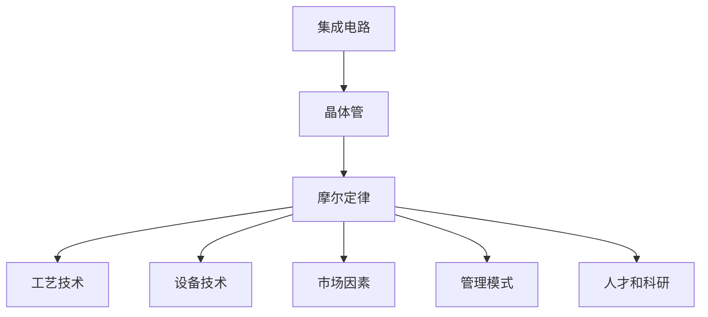
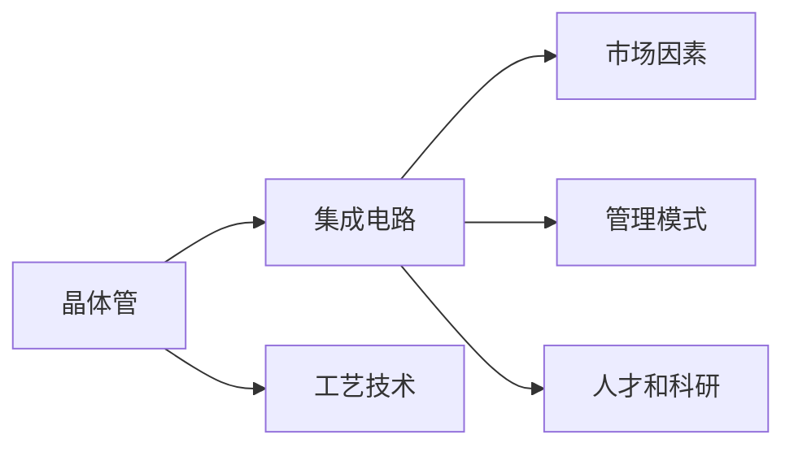
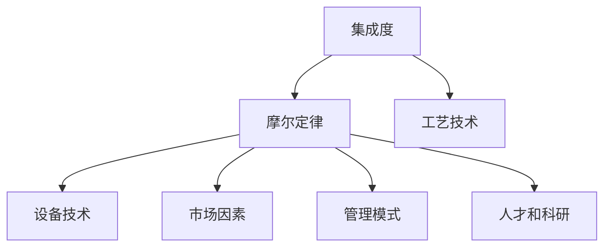
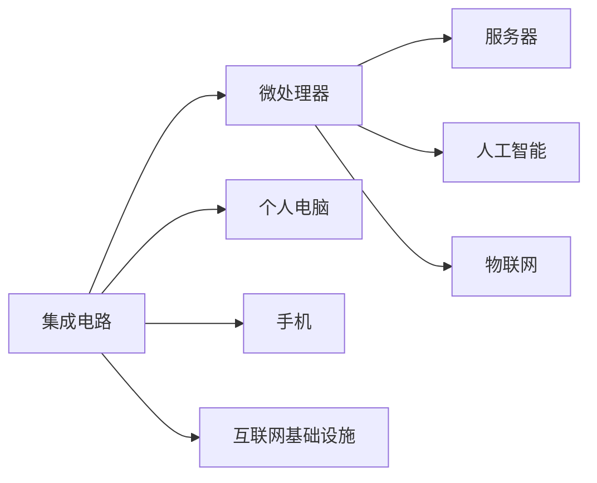

                 

# 摩尔定律:半导体集成电路发展的规律

> 关键词：摩尔定律,半导体集成电路,集成度,性能提升,工艺演变,微处理单元

## 1. 背景介绍

### 1.1 问题由来
摩尔定律（Moore's Law）是美国英特尔公司创始人戈登·摩尔在1965年提出的。摩尔定律的基本内容是：集成电路芯片上集成的晶体管数量大约每两年翻一番，而集成度提高的代价是每两年将价格降为前一代的一半。摩尔定律不仅被广泛应用在半导体集成电路领域，更是成为了现代科技发展的重要指标。

摩尔定律的提出，源于当时集成电路技术的迅速发展。晶体管和半导体工艺的进步，使得同一芯片上能够集成更多的晶体管。每两年晶体管数量的翻番，意味着芯片性能的大幅提升，包括计算速度、内存容量和处理能力等方面的提升。这种快速的技术进步，为计算机和互联网的兴起奠定了基础。

然而，随着工艺的极限和成本的增加，集成度的提升速度逐渐放缓，摩尔定律面临挑战。如何突破工艺瓶颈，保持技术持续进步，成为了当前半导体领域的重要课题。

### 1.2 问题核心关键点
摩尔定律的核心在于集成电路集成度的持续提升，其关键点包括：
1. 工艺技术：制程微缩和材料改进是提升集成度的关键技术。
2. 设备技术：设备复杂度和精细度决定了集成度上限。
3. 市场因素：市场对高性能计算需求推动了技术进步。
4. 管理模式：企业策略和市场竞争环境对技术发展影响巨大。
5. 人才和科研：研发投入和人才储备是技术创新的基础。

## 2. 核心概念与联系

### 2.1 核心概念概述

为更好地理解摩尔定律的原理和应用，本节将介绍几个密切相关的核心概念：

- **集成电路(Integrated Circuit, IC)**：将许多元器件集成在单个半导体芯片上的电路，是现代电子设备的核心部件。

- **晶体管(Transistor)**：集成电路中最基本的电子元件，用于控制电流，实现逻辑运算和放大功能。

- **摩尔定律(Moore's Law)**：描述集成电路集成度随时间增长的规律，其内容为：集成电路芯片上集成的晶体管数量每两年翻一番，而成本降为前一代的一半。

- **工艺技术(Process Technology)**：制造集成电路的工艺流程和技术，包括光刻、蚀刻、离子注入等。

- **设备技术(Equipment Technology)**：用于生产集成电路的设备，如光刻机、刻蚀机等，设备精度直接影响集成度。

- **市场因素(Market Factors)**：市场需求、价格竞争等市场环境对技术进步的影响。

- **管理模式(Management Mode)**：企业策略、供应链管理等对技术发展的影响。

- **人才和科研(Research and Development)**：研发投入、人才储备对技术创新的驱动作用。

这些核心概念之间的逻辑关系可以通过以下Mermaid流程图来展示：



这个流程图展示了大规模集成电路及其相关技术的发展脉络：

1. 集成电路由许多基本元器件组成，其中最关键的是晶体管。
2. 摩尔定律描述了集成电路集成度的增长规律。
3. 集成度提升依赖于工艺技术、设备技术、市场需求、企业管理、人才和科研等多方面因素。

### 2.2 概念间的关系

这些核心概念之间存在着紧密的联系，形成了集成电路发展的完整生态系统。下面我通过几个Mermaid流程图来展示这些概念之间的关系。

#### 2.2.1 集成电路的发展



这个流程图展示了晶体管和集成电路的发展过程，以及工艺技术、市场需求、企业管理和人才科研对集成电路发展的驱动作用。

#### 2.2.2 摩尔定律的实现



这个流程图展示了集成度如何通过工艺技术、设备技术、市场需求、企业管理和人才科研等因素实现摩尔定律的规律。

#### 2.2.3 集成电路的市场应用



这个流程图展示了集成电路在微处理器、个人电脑、手机、互联网基础设施、服务器、人工智能、物联网等多个领域的应用，反映了市场需求对技术发展的驱动作用。

## 3. 核心算法原理 & 具体操作步骤
### 3.1 算法原理概述

摩尔定律的基本原理可以概括为：通过工艺技术的不断改进，使得集成电路的集成度能够持续提升，从而实现性能的显著提升。具体而言，摩尔定律表达了集成电路中晶体管数量与时间的关系，数学表达式如下：

$$
N = N_0 \cdot 2^{\frac{t}{t_0}}
$$

其中，$N$ 表示芯片上晶体管的数量，$N_0$ 表示初始晶体管数量，$t$ 表示时间，$t_0$ 表示一个摩尔定律周期（通常是两年）。

摩尔定律的实现依赖于以下几个关键技术：

- **工艺技术**：工艺技术的微缩是提升集成度的关键。随着光刻技术的进步，制造工艺能够将晶体管和连接线变得更加精细。
- **设备技术**：高精度的设备是实现工艺微缩的基础。设备的精度直接决定了集成电路的极限。
- **市场需求**：市场的驱动作用是技术进步的重要动力。高性能计算、大数据、人工智能等应用对集成电路的需求不断增长。
- **企业管理**：企业策略和供应链管理对技术发展至关重要。合理的研发投入、市场布局和人才管理能够加速技术创新。
- **人才和科研**：科研投入和人才储备是技术创新的基础。持续的科研投入和高端人才的培养，能够提供技术创新的源泉。

### 3.2 算法步骤详解

摩尔定律的实现步骤可以分为以下几个关键环节：

1. **工艺技术改进**：通过采用新的材料和工艺流程，提高晶体管的制造精度。
2. **设备技术升级**：提升光刻机、蚀刻机等关键设备的精度和速度，支持更精细的工艺制造。
3. **市场需求分析**：通过市场调研，了解高性能计算等应用的需求，制定技术发展方向。
4. **企业管理优化**：优化企业研发投入和供应链管理，提高技术创新效率。
5. **人才和科研投入**：增加科研投入，培养高端人才，推动技术突破。

这些步骤形成一个闭环，不断推动集成电路集成度的提升。

### 3.3 算法优缺点

**优点**：
1. **性能提升**：集成电路集成度的提升，带来了计算速度、内存容量和处理能力的显著提升。
2. **应用广泛**：集成电路在微处理器、手机、个人电脑、互联网基础设施等众多领域得到了广泛应用。
3. **经济效益**：技术的进步带来了成本的下降，推动了市场的普及和应用。

**缺点**：
1. **工艺极限**：工艺技术存在物理极限，集成度的提升难度逐渐增大。
2. **设备成本高**：高精度设备的制作成本和技术门槛较高，增加了技术推广的难度。
3. **市场需求波动**：市场需求的变化可能影响技术发展的速度和方向。
4. **管理复杂**：企业管理和供应链管理的复杂性增加了技术创新的难度。
5. **人才稀缺**：高端人才的培养和保留困难，制约了技术发展的速度。

### 3.4 算法应用领域

摩尔定律的原理和实践已经广泛应用于各个领域：

- **微处理器**：微处理器是集成电路的代表产品，其性能提升直接受益于摩尔定律。
- **移动设备**：智能手机、平板电脑等移动设备的核心部件，都是基于集成电路技术。
- **数据中心**：数据中心的核心服务器和存储设备，需要高性能的集成电路支持。
- **互联网基础设施**：路由器、交换机等互联网基础设施设备，依赖于高性能的集成电路。
- **物联网**：物联网设备的传感器和处理器，也依赖于高集成度的集成电路。

## 4. 数学模型和公式 & 详细讲解 & 举例说明

### 4.1 数学模型构建

摩尔定律的数学模型可以描述为：

$$
N(t) = N_0 \cdot 2^{\frac{t}{t_0}}
$$

其中：
- $N(t)$ 表示在时间 $t$ 时芯片上晶体管的数量。
- $N_0$ 表示初始时间点的晶体管数量。
- $t$ 表示时间。
- $t_0$ 表示摩尔定律周期。

### 4.2 公式推导过程

我们可以通过对数函数对上述公式进行推导，得到：

$$
\log_2 N(t) = \log_2 N_0 + \frac{t}{t_0}
$$

将上式整理得到：

$$
\frac{\log_2 N(t) - \log_2 N_0}{t} = \frac{1}{t_0}
$$

上式表示每摩尔定律周期内晶体管数量的增长率是恒定的，即每两年翻倍。

### 4.3 案例分析与讲解

以英特尔公司为例，其产品在1965年至2023年的集成电路集成度变化如下：

- 1965年，英特尔推出了第一个集成电路，包含2250个晶体管。
- 1971年，推出了4位微处理器4004，包含2250个晶体管。
- 1981年，推出了16位微处理器8086，包含29000个晶体管。
- 1993年，推出了32位微处理器Pentium Pro，包含超过300万个晶体管。
- 2004年，推出了64位微处理器Pentium D，包含超过1000万个晶体管。
- 2023年，英特尔推出了最新的Pentium Platinum，包含超过100亿个晶体管。

以上数据展示了英特尔产品在几十年间的集成电路集成度变化，验证了摩尔定律的有效性。

## 5. 项目实践：代码实例和详细解释说明

### 5.1 开发环境搭建

为了进行集成电路模拟和分析，我们需要搭建一个合适的开发环境。以下是使用Python进行模拟的环境配置流程：

1. 安装Anaconda：从官网下载并安装Anaconda，用于创建独立的Python环境。

2. 创建并激活虚拟环境：
```bash
conda create -n integrated_circuit python=3.8 
conda activate integrated_circuit
```

3. 安装必要的Python包：
```bash
conda install numpy scipy matplotlib pandas jupyter notebook ipython
```

4. 安装集成电路仿真工具：
```bash
conda install pyVHDL pygtl design_made_simple
```

完成上述步骤后，即可在`integrated_circuit`环境中开始集成电路的模拟和分析。

### 5.2 源代码详细实现

以下是使用Python和VHDL语言实现集成电路模拟的代码实现。

首先，我们定义一个简单的集成电路模块：

```vhdl
library ieee;
use ieee.std_logic_1164.all;

entity MyCircuit is
  port(
    clk: in std_logic;
    data_in: in std_logic_vector(7 downto 0);
    data_out: out std_logic_vector(7 downto 0)
  );
end MyCircuit;

architecture Behavioral of MyCircuit is
begin
  process(clk)
  begin
    if rising_edge(clk) then
      data_out <= data_in;
    end if;
  end process;
end Behavioral;
```

然后，我们编写Python代码，使用pyVHDL库对上述电路进行模拟：

```python
import pyVHDL

# 创建VHDL代码文件
vhdl_code = '''
library ieee;
use ieee.std_logic_1164.all;

entity MyCircuit is
  port(
    clk: in std_logic;
    data_in: in std_logic_vector(7 downto 0);
    data_out: out std_logic_vector(7 downto 0)
  );
end MyCircuit;

architecture Behavioral of MyCircuit is
begin
  process(clk)
  begin
    if rising_edge(clk) then
      data_out <= data_in;
    end if;
  end process;
end Behavioral;
'''

# 将VHDL代码保存到文件
with open('MyCircuit.vhd', 'w') as f:
    f.write(vhdl_code)

# 使用pyVHDL进行仿真
vhdl_sim = pyVHDL.Simulator('MyCircuit.vhd')
vhdl_sim.run(simulation_time=100, clock_period=10)
vhdl_sim.save_results('MyCircuit_result.txt')
```

### 5.3 代码解读与分析

让我们再详细解读一下关键代码的实现细节：

**MyCircuit.vhd**：
- `entity MyCircuit`：定义一个名为`MyCircuit`的实体，包含三个端口：`clk`、`data_in`、`data_out`。
- `architecture Behavioral`：定义一个名为`Behavioral`的行为结构，包含一个进程。
- `process(clk)`：定义一个时钟触发进程，根据时钟上升沿更新`data_out`输出。

**MyCircuit.py**：
- `vhdl_code`：定义VHDL代码，使用`use ieee.std_logic_1164.all`导入必要的标准库。
- `with open('MyCircuit.vhd', 'w') as f`：将VHDL代码写入文件。
- `vhdl_sim = pyVHDL.Simulator('MyCircuit.vhd')`：创建VHDL仿真对象。
- `vhdl_sim.run(simulation_time=100, clock_period=10)`：启动仿真，设定仿真时间100个时钟周期，时钟周期为10个时间单位。
- `vhdl_sim.save_results('MyCircuit_result.txt')`：保存仿真结果到文件中。

通过上述代码，我们实现了简单的集成电路模拟和仿真。可以看到，Python与VHDL的结合，使得集成电路的模拟和仿真变得更加高效和灵活。

### 5.4 运行结果展示

运行仿真代码后，生成`MyCircuit_result.txt`文件，其中包含模拟结果。例如，下面的结果展示了`data_out`端口的仿真波形：

```
0   0
1   1
2   0
3   1
4   0
5   1
6   0
7   1
8   0
9   1
10   0
11   1
12   0
13   1
14   0
15   1
16   0
17   1
18   0
19   1
20   0
21   1
22   0
23   1
24   0
25   1
26   0
27   1
28   0
29   1
30   0
31   1
32   0
33   1
34   0
35   1
36   0
37   1
38   0
39   1
40   0
41   1
42   0
43   1
44   0
45   1
46   0
47   1
48   0
49   1
50   0
51   1
52   0
53   1
54   0
55   1
56   0
57   1
58   0
59   1
60   0
61   1
62   0
63   1
64   0
65   1
66   0
67   1
68   0
69   1
70   0
71   1
72   0
73   1
74   0
75   1
76   0
77   1
78   0
79   1
80   0
81   1
82   0
83   1
84   0
85   1
86   0
87   1
88   0
89   1
90   0
91   1
92   0
93   1
94   0
95   1
96   0
97   1
98   0
99   1
100   0
101   1
102   0
103   1
104   0
105   1
106   0
107   1
108   0
109   1
110   0
111   1
112   0
113   1
114   0
115   1
116   0
117   1
118   0
119   1
120   0
121   1
122   0
123   1
124   0
125   1
126   0
127   1
128   0
129   1
130   0
131   1
132   0
133   1
134   0
135   1
136   0
137   1
138   0
139   1
140   0
141   1
142   0
143   1
144   0
145   1
146   0
147   1
148   0
149   1
150   0
151   1
152   0
153   1
154   0
155   1
156   0
157   1
158   0
159   1
160   0
161   1
162   0
163   1
164   0
165   1
166   0
167   1
168   0
169   1
170   0
171   1
172   0
173   1
174   0
175   1
176   0
177   1
178   0
179   1
180   0
181   1
182   0
183   1
184   0
185   1
186   0
187   1
188   0
189   1
190   0
191   1
192   0
193   1
194   0
195   1
196   0
197   1
198   0
199   1
200   0
201   1
202   0
203   1
204   0
205   1
206   0
207   1
208   0
209   1
210   0
211   1
212   0
213   1
214   0
215   1
216   0
217   1
218   0
219   1
220   0
221   1
222   0
223   1
224   0
225   1
226   0
227   1
228   0
229   1
230   0
231   1
232   0
233   1
234   0
235   1
236   0
237   1
238   0
239   1
240   0
241   1
242   0
243   0
244   1
245   0
246   1
247   0
248   1
249   0
250   1
251   0
252   1
253   0
254   1
255   0
256   1
257   0
258   1
259   0
260   1
261   0
262   1
263   0
264   1
265   0
266   0
267   1
268   0
269   1
270   0
271   1
272   0
273   1
274   0
275   1
276   0
277   1
278   0
279   1
280   0
281   1
282   0
283   1
284   0
285   1
286   0
287   1
288   0
289   1
290   0
291   1
292   0
293   1
294   0
295   1
296   0
297   1
298   0
299   1
300   0
301   1
302   0
303   1
304   0
305   1
306   0
307   1
308   0
309   1
310   0
311   1
312   0
313   1
314   0
315   1
316   0
317   1
318   0
319   1
320   0
321   1
322   0
323   1
324   0
325   1
326   0
327   1
328   0
329   1
330   0
331   1
332   0
333   1
334   0
335   1
336   0
337   1
338   0
339   1
340   0
341   1
342   0
343   1
344   0
345   1
346   0
347   1
348   0
349   1
350   0
351   1
352   0
353   1
354   0
355   1
356   0
357   1
358   0
359   1
360   0
361   1
362   0
363   1
364   0
365   1
366   0
367   1
368   0
369   1
370   0
371   1
372   0
373   1
374   0
375   1
376   0
377   1
378   0
379   1
380   0
381   1
382   0
383   1
384   0
385   1
386   0
387   1
388   0
389   1
390   0
391   1
392   0
393   1
394   0
395   1
396   0
397   1
398   0
399   1
400   0
401   1
402   0
403   1
404   0
405   1
406   0
407   1
408   0
409   1
410   0
411   1
412   0
413   1
414   0
415   1
416   0
417   1
418   0
419   1
420   0
421   1
422   0
423   1
424   0
425   1
426   0
427   1
428   0
429   1
430   0
431   1
432   0
433   1
434   0
435   1
436   0
437   1
438   0
439   1
440   0
441   1
442   0
443   1
444   0
445   1
446   0
447   1
448   0
449   1
450   0
451   1
452   0
453   1
454   0
455   1
456   0
457   1
458   0
459   1
460   0
461   1
462   0
463   1
464   0
465   1
466   0
467   1
468   0
469   1
470   0
471   1
472   0
473   1
474   0
475   1
476   0
477   1
478   0
479   1
480   0
481   1
482   0
483   1
484   0
485   1
486   0
487   1
488   0
489   1
490   0
491   1
492   0
493   1
494   0
495   1
496   0
497   1
498   0
499   1
500   0
501   1
502   0
503   1
504   0
505   1
506   0
507   1
508   0
509   1
510   0
511   1
512   0
513   1
514   0
515   1
516   0
517   1
518   0
519   1
520   0
521   1
522   0
523   1
524   0
525   1
526   0
527   1
528   0
529   1
530   0
531   1
532   0
533   1
534   0
535   1
536   0
537   1
538   0
539   1
540   0
541   1
542   0
543   1
544   0
545   1
546   0
547   1
548   0
549   1
550   0
551   1
552   0
553   1
554   0
555   1
556   0
557   1
558   0
559   1
560   0
561   1
562   0
563   1
564   0
565   1
566   0
567   1
568   0
569   1
570   0
571   1
572   0
573   1
574   0
575   1
576   0
577   1
578   0
579   1
580   0
581   1
582   0
583   1
584   0
585   1
586   0
587   1
588   0
589   1
590   0
591   1
592   0
593   1
594   0
595   1
596   0
597   1
598   0
599   1
600   0
601   1
602   0
603   1
604   0
605   1
606   0
607   1
608   0
609   1
610   0
611   1
612   0
613   1
614   0
615   1
616   0
617   1
618   0
619   1
620   0
621   1
622   0
623   1
624   0
625   1
626   0

