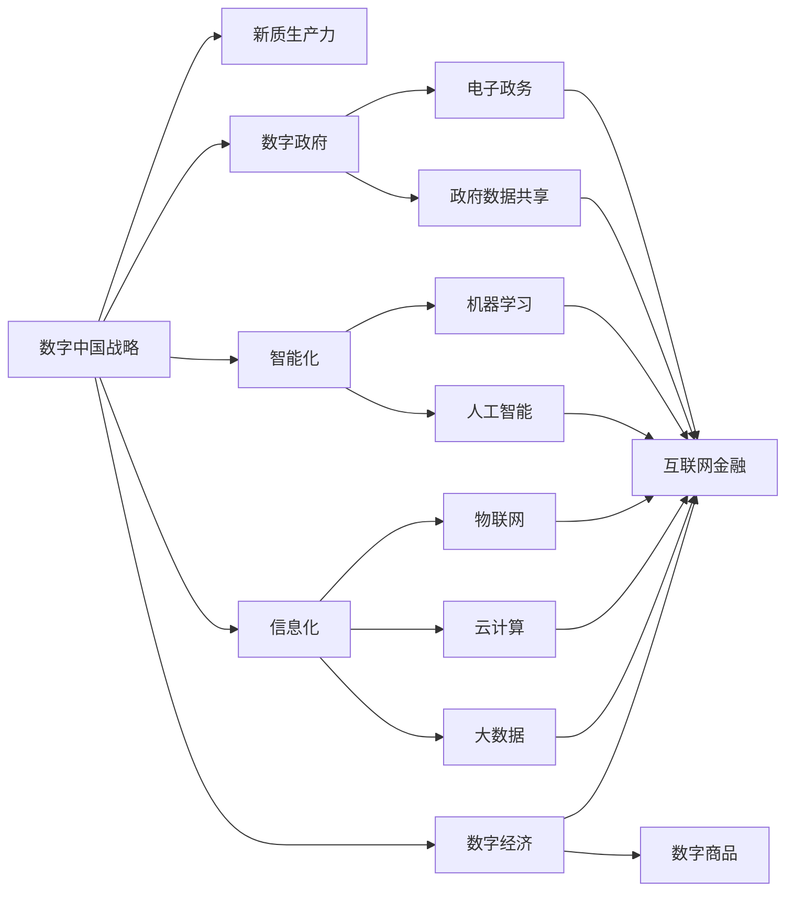

                 

# 数字中国战略与新质生产力

> 关键词：数字中国战略, 新质生产力, 人工智能, 大数据, 云计算, 工业互联网, 数字经济

## 1. 背景介绍

### 1.1 问题由来
进入21世纪以来，随着信息技术的飞速发展，全球经济社会发展加速向数字化、网络化、智能化转型。数字经济正在重塑世界经济版图，成为全球竞争的制高点。在此背景下，中国提出数字中国战略，旨在构建数字经济、数字社会、数字政府一体化的新型国家治理体系，推动社会生产力质的飞跃。

数字中国战略的核心理念是充分利用数字技术，驱动各行业领域的智能化升级，实现社会全面数字化转型。这包括推动数字技术与实体经济深度融合，促进传统产业数字化、网络化、智能化发展；推进政府数字化转型，提升公共服务和社会治理水平；建设智慧社会，满足人民对美好生活的向往等目标。

### 1.2 问题核心关键点
数字中国战略的核心在于：

- **信息化深度推进**：通过数字化转型，实现数据全面流通，打通信息孤岛，构建一体化数字生态。
- **智能化能力提升**：推动大数据、人工智能、云计算等新一代信息技术与实体经济深度融合，提升全要素生产率。
- **数字政府建设**：优化政府决策体系，提升公共服务效率，实现政务数据共享和开放。
- **数字社会构建**：促进信息消费，提高数字素养，构建数字生活新模式。
- **数字经济发展**：推动数字技术与实体经济结合，形成新业态、新模式、新动能，推动高质量发展。

这些关键点构成了数字中国战略的整体框架，其核心在于利用数字技术驱动社会生产力和生产关系的变革，实现社会全面数字化、智能化转型。

## 2. 核心概念与联系

### 2.1 核心概念概述

为了更深入地理解数字中国战略及其核心概念，本文将介绍以下关键概念及其相互联系：

- **数字中国战略**：国家层面的战略，旨在通过数字化手段全面提升社会生产力和国家治理能力。
- **新质生产力**：利用数字技术，推动生产力从以体力劳动和经验为主的传统模式，向以信息、知识和智能为主的现代模式转变。
- **信息化**：指利用信息技术，实现数据的收集、处理、传输、存储、应用等全流程的数字化管理。
- **智能化**：指利用人工智能、大数据等技术，提升信息系统的决策、控制、优化能力，实现智能化运营。
- **数字政府**：利用数字技术，优化政府职能，提升治理效率，实现政务数据共享和开放。
- **数字经济**：指以数据为关键要素，利用数字技术，形成新的经济形态和商业模式。

这些概念之间存在紧密的联系，共同构成了数字中国战略的实施框架。

### 2.2 概念间的关系

这些核心概念之间存在着复杂的相互作用和影响，通过以下合法的流程图来展示它们的关系：



### 2.3 核心概念的整体架构

从整体架构来看，数字中国战略的实施过程可以分为四个层次：

1. **基础建设层**：包括大数据、云计算、物联网等基础设施的建设。这些基础设施为数字化转型提供了必要的技术支撑。
2. **数据管理层**：通过信息化手段，实现数据的全面采集、存储、管理，为智能化运营提供数据支撑。
3. **智能应用层**：利用人工智能、大数据等技术，提升信息系统的决策、控制、优化能力，实现智能化运营。
4. **治理与社会层**：通过数字政府建设，优化政府职能，提升治理效率；通过数字社会构建，提高数字素养，满足人民对美好生活的向往；通过数字经济，推动高质量发展。

## 3. 核心算法原理 & 具体操作步骤
### 3.1 算法原理概述

数字中国战略的实施离不开核心技术的支撑，其中人工智能、大数据、云计算等新一代信息技术是实现新质生产力的关键。

基于数字中国战略的核心技术框架，本文将重点介绍人工智能和机器学习在实现新质生产力中的作用，具体包括算法原理和操作步骤。

### 3.2 算法步骤详解

#### 3.2.1 数据预处理
- **数据采集**：从不同来源（如传感器、网络、文件等）采集数据。
- **数据清洗**：对采集的数据进行去重、去噪、填充缺失值等处理。
- **数据标注**：对数据进行标注，以便于后续模型的训练。

#### 3.2.2 模型训练
- **选择模型**：根据任务需求选择合适的模型，如线性回归、逻辑回归、决策树、随机森林、神经网络等。
- **模型训练**：使用采集和清洗后的数据，对模型进行训练，优化模型参数。
- **模型评估**：使用测试集对模型进行评估，调整模型参数，提高模型性能。

#### 3.2.3 模型应用
- **模型集成**：将训练好的模型集成到应用系统中，实现智能化功能。
- **模型优化**：根据应用场景，对模型进行优化，提高模型性能。

#### 3.2.4 模型部署
- **模型部署**：将模型部署到服务器、云平台等环境中，供用户调用。
- **模型监控**：对模型运行进行监控，及时发现和解决问题。

### 3.3 算法优缺点

人工智能和大数据技术在实现新质生产力方面具有以下优点：

- **提升生产效率**：通过智能化生产，提高生产效率，降低生产成本。
- **优化资源配置**：通过数据分析，优化资源配置，提高资源利用率。
- **增强决策能力**：通过智能化决策，提高决策准确性和效率。

同时，这些技术也存在一些局限性：

- **数据质量要求高**：模型的性能很大程度上取决于数据质量，数据采集和清洗需要较高的技术水平。
- **模型复杂度高**：复杂模型需要更多的计算资源和时间，模型优化和部署需要较高的技术门槛。
- **隐私和安全风险**：大量数据的收集和处理，可能带来隐私和安全风险，需要加强数据保护措施。

### 3.4 算法应用领域

人工智能和大数据技术的应用领域非常广泛，主要包括以下几个方面：

- **智能制造**：利用智能设备和系统，实现生产过程的智能化管理。
- **智能交通**：通过数据分析和预测，优化交通流量，提高出行效率。
- **智能医疗**：利用大数据和人工智能，提高医疗诊断和治疗的准确性和效率。
- **智能金融**：通过数据分析和机器学习，优化风险控制和投资策略。
- **智能物流**：利用大数据和人工智能，实现物流配送的智能化管理。
- **智慧城市**：通过大数据和人工智能，优化城市管理和服务，提高城市治理水平。

## 4. 数学模型和公式 & 详细讲解 & 举例说明

### 4.1 数学模型构建

在人工智能和大数据技术的实施过程中，数学模型和公式起着至关重要的作用。以下将以线性回归模型为例，展示其数学模型构建和公式推导过程。

设有一个线性回归问题，已知样本集 $(x_1,y_1),(x_2,y_2),\ldots,(x_n,y_n)$，其中 $x_i$ 为自变量，$y_i$ 为因变量。线性回归模型可表示为：

$$
y_i = \beta_0 + \beta_1x_i + \epsilon_i
$$

其中 $\beta_0$ 为截距，$\beta_1$ 为斜率，$\epsilon_i$ 为误差项。

### 4.2 公式推导过程

线性回归模型的最小二乘法解为：

$$
\hat{\beta} = (X^TX)^{-1}X^Ty
$$

其中 $X$ 为自变量的矩阵，$\hat{\beta}$ 为最小二乘法估计的参数。

最小二乘法的推导过程如下：

- **目标函数**：最小化误差平方和 $SSE = \sum_{i=1}^n(y_i - \hat{y}_i)^2$。
- **求导**：对 $\hat{\beta}$ 求偏导，得到 $\frac{\partial SSE}{\partial \hat{\beta}} = 2X^T(y - X\hat{\beta})$。
- **解方程**：令 $\frac{\partial SSE}{\partial \hat{\beta}} = 0$，解得 $\hat{\beta} = (X^TX)^{-1}X^Ty$。

### 4.3 案例分析与讲解

以智能制造为例，利用线性回归模型实现生产效率的预测和优化：

- **数据采集**：采集生产过程中的关键参数（如温度、湿度、压力等），以及对应的生产效率。
- **数据清洗**：对采集的数据进行去重、去噪、填充缺失值等处理。
- **模型训练**：利用清洗后的数据，对线性回归模型进行训练，得到生产效率的预测模型。
- **模型应用**：根据预测模型，对生产参数进行调整，优化生产效率。
- **模型评估**：对调整后的生产参数进行评估，验证模型效果。

## 5. 项目实践：代码实例和详细解释说明

### 5.1 开发环境搭建

要实施数字中国战略中的新质生产力，需要搭建完善的开发环境。以下是Python环境搭建的详细步骤：

1. 安装Anaconda：从官网下载并安装Anaconda，用于创建独立的Python环境。
2. 创建并激活虚拟环境：
```bash
conda create -n pytorch-env python=3.8 
conda activate pytorch-env
```

3. 安装PyTorch：根据CUDA版本，从官网获取对应的安装命令。例如：
```bash
conda install pytorch torchvision torchaudio cudatoolkit=11.1 -c pytorch -c conda-forge
```

4. 安装TensorFlow：
```bash
conda install tensorflow
```

5. 安装机器学习库：
```bash
pip install scikit-learn pandas numpy matplotlib
```

6. 安装GitHub和Jupyter Notebook：
```bash
conda install anaconda-client
conda install jupyterlab
```

### 5.2 源代码详细实现

以下是一个基于Python的线性回归模型实现示例，展示了如何使用PyTorch进行模型训练和应用：

```python
import torch
from torch import nn
from torch.optim import SGD
import numpy as np

# 定义数据集
x = np.array([[1, 2], [3, 4], [5, 6]])
y = np.array([3, 7, 11])

# 定义模型
class LinearRegression(nn.Module):
    def __init__(self, input_dim, output_dim):
        super(LinearRegression, self).__init__()
        self.linear = nn.Linear(input_dim, output_dim)
        
    def forward(self, x):
        return self.linear(x)

# 定义损失函数
loss_func = nn.MSELoss()

# 定义优化器
optimizer = SGD(model.parameters(), lr=0.01)

# 训练模型
for epoch in range(100):
    inputs = torch.from_numpy(x).float()
    targets = torch.from_numpy(y).float()
    optimizer.zero_grad()
    outputs = model(inputs)
    loss = loss_func(outputs, targets)
    loss.backward()
    optimizer.step()
    print("Epoch {}/{} - Loss: {:.4f}".format(epoch+1, 100, loss.item()))

# 应用模型
x_test = np.array([[1.5, 3.5]])
x_test = torch.from_numpy(x_test).float()
outputs = model(x_test)
print("Predicted Output: ", outputs)
```

### 5.3 代码解读与分析

上述代码实现了基于PyTorch的线性回归模型，展示了数据集定义、模型定义、损失函数定义、优化器定义、模型训练和模型应用等关键步骤。

- **数据集定义**：使用NumPy库定义输入和输出数据。
- **模型定义**：定义一个线性回归模型，使用PyTorch的nn.Module进行继承。
- **损失函数定义**：使用PyTorch的nn.MSELoss定义均方误差损失函数。
- **优化器定义**：使用PyTorch的SGD定义优化器。
- **模型训练**：使用优化器和损失函数进行模型训练。
- **模型应用**：使用训练好的模型对新的测试数据进行预测。

## 6. 实际应用场景

### 6.1 智能制造

智能制造是数字中国战略中的重要应用领域。通过数字化和智能化手段，提升生产效率和产品质量，降低生产成本，实现智能制造。

智能制造的实施步骤包括：

1. **数据采集**：通过传感器、监控设备等手段，采集生产过程中的关键参数。
2. **数据清洗**：对采集的数据进行去重、去噪、填充缺失值等处理。
3. **模型训练**：利用清洗后的数据，对机器学习模型进行训练，得到生产效率的预测模型。
4. **模型应用**：根据预测模型，对生产参数进行调整，优化生产效率。
5. **模型评估**：对调整后的生产参数进行评估，验证模型效果。

### 6.2 智能交通

智能交通是数字中国战略中的另一个重要应用领域。通过数据分析和预测，优化交通流量，提高出行效率，缓解交通拥堵。

智能交通的实施步骤包括：

1. **数据采集**：通过摄像头、雷达、GPS等手段，采集交通流量、路况等信息。
2. **数据清洗**：对采集的数据进行去重、去噪、填充缺失值等处理。
3. **模型训练**：利用清洗后的数据，对机器学习模型进行训练，得到交通流量的预测模型。
4. **模型应用**：根据预测模型，对交通信号进行优化，调整交通流量。
5. **模型评估**：对调整后的交通信号进行评估，验证模型效果。

### 6.3 智能医疗

智能医疗是数字中国战略中的又一重要应用领域。通过大数据和人工智能，提高医疗诊断和治疗的准确性和效率。

智能医疗的实施步骤包括：

1. **数据采集**：通过医疗设备、电子病历等手段，采集医疗数据。
2. **数据清洗**：对采集的数据进行去重、去噪、填充缺失值等处理。
3. **模型训练**：利用清洗后的数据，对机器学习模型进行训练，得到疾病预测模型。
4. **模型应用**：根据预测模型，辅助医生进行诊断和治疗。
5. **模型评估**：对诊断和治疗结果进行评估，验证模型效果。

## 7. 工具和资源推荐

### 7.1 学习资源推荐

为了帮助开发者深入理解数字中国战略中的新质生产力，以下是一些优质的学习资源：

1. 《机器学习》（周志华著）：深入浅出地介绍了机器学习的基本原理和应用。
2. 《深度学习》（Ian Goodfellow等著）：全面介绍了深度学习的理论和实践。
3. 《Python机器学习》（Sebastian Raschka著）：详细介绍了Python在机器学习中的应用。
4. 《TensorFlow实战》（刘洋著）：深入浅出地介绍了TensorFlow的用法和实践。
5. 《PyTorch深度学习》（Mehta等著）：详细介绍了PyTorch的用法和实践。

### 7.2 开发工具推荐

高质量的开发工具是实现新质生产力的必备条件。以下是一些推荐的开发工具：

1. PyTorch：基于Python的开源深度学习框架，灵活动态的计算图，适合快速迭代研究。
2. TensorFlow：由Google主导开发的开源深度学习框架，生产部署方便，适合大规模工程应用。
3. Jupyter Notebook：互动式的数据分析和机器学习工具，支持Python、R、JavaScript等多种语言。
4. GitHub：全球最大的代码托管平台，支持版本控制、协作开发、问题跟踪等。
5. Anaconda：Python环境管理系统，方便创建和管理Python虚拟环境。

### 7.3 相关论文推荐

为了深入理解数字中国战略中的新质生产力，以下是一些值得关注的相关论文：

1. "Deep Learning"（Ian Goodfellow等著）：全面介绍了深度学习的理论和实践。
2. "Machine Learning Yearning"（Andrew Ng著）：深入浅出地介绍了机器学习的应用和实践。
3. "Artificial Intelligence: A Modern Approach"（Russell等著）：全面介绍了人工智能的理论和应用。
4. "Building Machine Learning Powered Applications"（Google AI著）：介绍了机器学习在实际应用中的实践和经验。

## 8. 总结：未来发展趋势与挑战

### 8.1 研究成果总结

通过本文的系统梳理，可以看到，数字中国战略中的新质生产力具有以下特点：

- **跨学科融合**：新质生产力涉及信息技术、工业制造、交通运输、医疗健康等多个学科的交叉融合。
- **数据驱动**：新质生产力的实现离不开大数据的支撑，数据采集、处理和应用贯穿全过程。
- **智能化应用**：新质生产力通过智能化手段，实现生产效率和资源利用率的提升。

### 8.2 未来发展趋势

展望未来，数字中国战略中的新质生产力将呈现以下发展趋势：

1. **技术融合加速**：随着5G、物联网等技术的发展，数字化和智能化融合加速，新质生产力的应用场景将更加广泛。
2. **智能化能力提升**：通过人工智能和大数据技术的深入应用，新质生产力的智能化能力将进一步提升，推动生产力质的飞跃。
3. **跨行业应用扩展**：新质生产力将在更多行业得到应用，推动社会全面数字化转型。
4. **产业链协同发展**：新质生产力将促进产业链上下游协同发展，形成更紧密的合作关系。

### 8.3 面临的挑战

尽管新质生产力在数字中国战略中具有广阔前景，但在实施过程中仍面临诸多挑战：

1. **技术门槛高**：大数据、人工智能等技术需要较高的技术水平，对人才和资金的需求较大。
2. **数据隐私风险**：大规模数据的采集和应用，可能带来数据隐私和安全风险。
3. **数据质量要求高**：模型的性能很大程度上取决于数据质量，数据采集和清洗需要较高的技术水平。
4. **模型复杂度高**：复杂模型需要更多的计算资源和时间，模型优化和部署需要较高的技术门槛。

### 8.4 研究展望

未来的研究需要在以下几个方面寻求新的突破：

1. **数据隐私保护**：研究数据隐私保护技术，确保数据的合法使用和保护。
2. **模型简化和优化**：研究模型简化和优化技术，提高模型的可解释性和实用性。
3. **跨领域知识融合**：研究跨领域知识的融合技术，提高模型的泛化能力和应用范围。
4. **智能化决策支持**：研究智能化决策支持技术，提高模型的决策能力和效率。

## 9. 附录：常见问题与解答

**Q1：数字中国战略中的新质生产力具体指什么？**

A: 数字中国战略中的新质生产力，指的是利用数字技术和信息技术，推动社会生产力质的飞跃。它强调通过数字化、网络化、智能化手段，实现生产效率的提升、资源配置的优化、决策能力的增强等目标。

**Q2：如何提高数据质量，保障数据隐私？**

A: 提高数据质量，需要从数据采集、存储、处理、应用等各个环节进行严格控制，确保数据的准确性、完整性和一致性。同时，保障数据隐私，需要制定完善的数据隐私保护政策，采用加密、匿名化、访问控制等技术手段，确保数据的安全性和合法性。

**Q3：如何应对技术门槛高的问题？**

A: 应对技术门槛高的问题，需要加强人才培训和团队建设，提高团队的技术水平和创新能力。同时，可以引入开源技术和工具，降低技术实现门槛。

**Q4：如何提高模型的可解释性？**

A: 提高模型的可解释性，需要采用模型简化和优化技术，提高模型的可解释性。同时，可以引入可视化工具，对模型进行可视化展示，帮助用户理解模型的决策过程。

**Q5：如何应对跨领域知识融合的挑战？**

A: 应对跨领域知识融合的挑战，需要加强跨学科合作，引入跨领域专家，进行知识共享和交流。同时，可以采用跨领域知识图谱、知识库等技术手段，提高模型的泛化能力和应用范围。

总之，数字中国战略中的新质生产力是大势所趋，未来的研究需要从数据、技术、应用等多个层面进行全面优化，才能实现社会的全面数字化转型和高质量发展。

