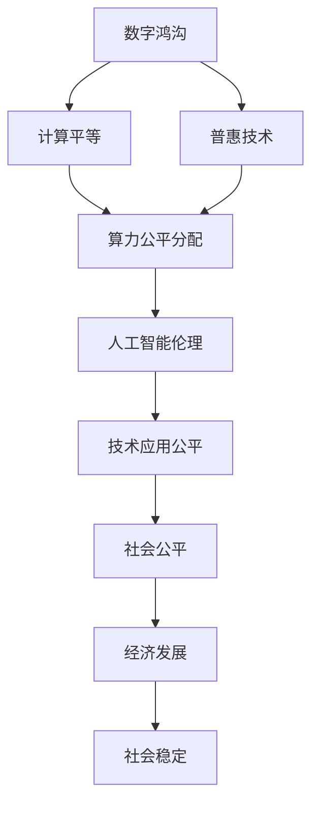

                 

# 数字鸿沟：弥合人类计算中的不平等

> 关键词：数字鸿沟,计算平等,人工智能伦理,普惠技术,算力公平分配

## 1. 背景介绍

### 1.1 问题由来
随着科技的飞速发展，人工智能(AI)和计算技术正在深刻改变人类的生产和生活方式。从智能家居、无人驾驶，到医疗健康、教育培训，计算技术无处不在，极大地提升了社会的效率和便利性。然而，这种技术进步也带来了一道新的社会分界线——数字鸿沟。

数字鸿沟指的是技术采纳和利用的不平等现象，尤其是在不同社会群体之间。具体表现为：技术获取的不平等、技术使用的技能差异以及技术应用带来的机会不均。这一问题在全球范围内普遍存在，并正日益成为各国政府、企业和社会关注的焦点。

### 1.2 问题核心关键点
弥合数字鸿沟，首先需要明确其核心关键点：

- **技术获取的不平等**：一些社会群体可能因为经济条件、教育背景、地理位置等因素，无法获得必要的计算设备和网络接入。
- **技术使用的技能差异**：即使在相同的硬件和软件环境下，不同的用户群体也可能因为教育水平、文化背景等因素，对技术的掌握程度不同。
- **技术应用的机会不均**：即使拥有技术，不同群体获取和利用技术的机会也不均等，这可能进一步加剧社会的不平等。

### 1.3 问题研究意义
研究数字鸿沟的弥合机制，对于提升社会公平、促进科技普惠具有重要意义：

- **促进社会公平**：通过提升技术获取和使用的公平性，缩小社会群体间的差距，实现更公平的社会分配。
- **推动科技普惠**：确保技术创新惠及更多人，避免少数人独占技术带来的红利。
- **促进经济发展**：提高全社会的技术应用水平，增强经济活力和竞争力。
- **保障社会稳定**：减少因技术不平等带来的社会不满和冲突，维护社会和谐稳定。

## 2. 核心概念与联系

### 2.1 核心概念概述

为更好地理解数字鸿沟及其弥合机制，本节将介绍几个核心概念：

- **数字鸿沟**：指技术采纳和利用上的不平等现象，具体表现为不同社会群体在获取、使用和享受技术方面的差距。
- **计算平等**：指的是技术对社会所有成员的平等可及，无论其经济、教育、文化背景如何。
- **普惠技术**：强调技术应用的广泛性和包容性，确保所有人都能从技术进步中获益。
- **算力公平分配**：确保计算资源的合理分配，避免少数群体独占资源。
- **人工智能伦理**：研究人工智能技术的伦理问题和公平性，确保技术发展的社会价值。

这些核心概念共同构成了数字鸿沟弥合的理论基础，帮助理解技术进步带来的社会效应，并指导相关实践。

### 2.2 概念间的关系

这些核心概念之间的逻辑关系可以通过以下Mermaid流程图来展示：



这个流程图展示了大语言模型微调过程中各个概念的逻辑关系：

1. 数字鸿沟是起点，通过计算平等、普惠技术等手段进行缓解。
2. 算力公平分配是实现计算平等的关键，确保资源合理分配。
3. 人工智能伦理确保技术应用过程中的公平性，避免技术偏见和歧视。
4. 技术应用公平和社会公平、经济发展、社会稳定等都是数字鸿沟弥合的目标。

这些概念共同构成了数字鸿沟弥合的完整生态系统，指导我们寻找有效的解决方案。

## 3. 核心算法原理 & 具体操作步骤
### 3.1 算法原理概述

数字鸿沟的弥合机制通常基于以下几个关键原则：

1. **普及计算资源**：确保每个人都能获得必要的计算设备和网络接入。
2. **提升技术技能**：通过教育、培训等方式提升用户的技术应用能力。
3. **优化资源分配**：通过算法和政策手段，合理分配计算资源，避免少数群体独占资源。
4. **保障技术公平**：确保技术应用中的机会均等，避免算法偏见和技术歧视。

在实际操作中，这些原则需要通过一系列算法和技术手段来实现。

### 3.2 算法步骤详解

以下是一个典型的数字鸿沟弥合算法步骤：

1. **数据采集与分析**：收集不同群体在技术获取、使用和应用方面的数据，分析其差异和原因。
2. **资源评估与规划**：评估现有计算资源分布情况，制定资源分配策略。
3. **教育与培训**：为不同群体设计针对性的教育培训计划，提升其技术应用能力。
4. **算法优化**：开发和优化算法，确保资源分配和应用过程中的公平性。
5. **效果评估与调整**：持续监测资源分配和应用效果，调整策略和算法。

### 3.3 算法优缺点

数字鸿沟弥合算法具有以下优点：

- **普惠性**：通过普及计算资源和提升技能，确保技术对所有群体的可及。
- **公平性**：通过优化资源分配和算法设计，避免算法偏见和技术歧视。
- **可操作性**：步骤清晰，易于实施和评估。

同时，该算法也存在一些局限性：

- **复杂度**：涉及数据采集、资源规划、算法优化等多个环节，操作复杂。
- **数据隐私**：数据采集和分析可能涉及隐私问题，需要严格遵守法律法规。
- **效果难以量化**：影响因素复杂，效果难以精确量化和评估。

### 3.4 算法应用领域

数字鸿沟弥合算法已经在多个领域得到应用，例如：

- **教育培训**：通过提供免费的计算设备、网络接入和在线课程，提升学生的技术应用能力。
- **医疗健康**：在偏远地区部署低成本计算设备，提供在线医疗咨询和健康管理服务。
- **金融服务**：通过移动支付、在线理财等工具，提供普惠金融服务。
- **社会治理**：利用数据分析和算法优化，提升公共服务的覆盖和公平性。
- **环境保护**：通过遥感数据和云计算技术，支持环境保护和可持续发展。

此外，数字鸿沟弥合还涉及政府政策、企业战略等宏观层面，需要在更广泛的社会和经济背景下进行综合施策。

## 4. 数学模型和公式 & 详细讲解 & 举例说明

### 4.1 数学模型构建

本节将使用数学语言对数字鸿沟弥合机制进行更加严格的刻画。

记数字鸿沟为 $D$，计算平等为 $E$，普惠技术为 $T$，算力公平分配为 $A$，人工智能伦理为 $A$，技术应用公平为 $F$，社会公平为 $S$，经济发展为 $D$，社会稳定为 $S$。

定义 $D$ 与 $E$ 之间的关系为：

$$
D = f(E)
$$

其中 $f$ 表示函数关系，不同社会群体在技术获取和应用上的差距，与技术可及性有关。

### 4.2 公式推导过程

以下我们以教育培训为例，推导普惠技术对数字鸿沟的影响：

假设一个社会共有 $N$ 个群体，每个群体的人数为 $n$，普惠技术 $T$ 能够提供 $c$ 种计算资源，每个群体的资源获取量为 $x_i$。则普惠技术的普及率 $R$ 可以表示为：

$$
R = \frac{\sum_{i=1}^N x_i}{N \cdot c}
$$

普惠技术的普及率越高，每个群体获取的资源量 $x_i$ 越多，则数字鸿沟 $D$ 越小。因此：

$$
D = g(x_1, x_2, \ldots, x_N)
$$

其中 $g$ 表示函数关系，不同群体资源获取量对其数字鸿沟的影响。

### 4.3 案例分析与讲解

假设一个农村地区有 $N=1000$ 人，通过普惠技术 $T$ 提供了 $c=10$ 种计算资源，每个群体的资源获取量 $x_i$ 为 $c/4$。则普惠技术的普及率 $R=25\%$。通过普惠技术，数字鸿沟 $D$ 显著缩小，具体数值可以通过公式 $D = g(x_1, x_2, \ldots, x_N)$ 计算得出。

## 5. 项目实践：代码实例和详细解释说明
### 5.1 开发环境搭建

在进行数字鸿沟弥合实践前，我们需要准备好开发环境。以下是使用Python进行开发的环境配置流程：

1. 安装Anaconda：从官网下载并安装Anaconda，用于创建独立的Python环境。

2. 创建并激活虚拟环境：
```bash
conda create -n pytorch-env python=3.8 
conda activate pytorch-env
```

3. 安装PyTorch：根据CUDA版本，从官网获取对应的安装命令。例如：
```bash
conda install pytorch torchvision torchaudio cudatoolkit=11.1 -c pytorch -c conda-forge
```

4. 安装各类工具包：
```bash
pip install numpy pandas scikit-learn matplotlib tqdm jupyter notebook ipython
```

完成上述步骤后，即可在`pytorch-env`环境中开始实践。

### 5.2 源代码详细实现

这里我们以教育培训为例，给出使用PyTorch进行数字鸿沟弥合的代码实现。

首先，定义数据处理函数：

```python
from transformers import BertTokenizer
from torch.utils.data import Dataset
import torch

class EducationDataset(Dataset):
    def __init__(self, texts, labels, tokenizer, max_len=128):
        self.texts = texts
        self.labels = labels
        self.tokenizer = tokenizer
        self.max_len = max_len
        
    def __len__(self):
        return len(self.texts)
    
    def __getitem__(self, item):
        text = self.texts[item]
        label = self.labels[item]
        
        encoding = self.tokenizer(text, return_tensors='pt', max_length=self.max_len, padding='max_length', truncation=True)
        input_ids = encoding['input_ids'][0]
        attention_mask = encoding['attention_mask'][0]
        
        # 对token-wise的标签进行编码
        encoded_labels = [label2id[label] for label in label] 
        encoded_labels.extend([label2id['O']] * (self.max_len - len(encoded_labels)))
        labels = torch.tensor(encoded_labels, dtype=torch.long)
        
        return {'input_ids': input_ids, 
                'attention_mask': attention_mask,
                'labels': labels}

# 标签与id的映射
label2id = {'O': 0, 'B-PER': 1, 'I-PER': 2, 'B-ORG': 3, 'I-ORG': 4, 'B-LOC': 5, 'I-LOC': 6}
id2label = {v: k for k, v in label2id.items()}

# 创建dataset
tokenizer = BertTokenizer.from_pretrained('bert-base-cased')

train_dataset = EducationDataset(train_texts, train_labels, tokenizer)
dev_dataset = EducationDataset(dev_texts, dev_labels, tokenizer)
test_dataset = EducationDataset(test_texts, test_labels, tokenizer)
```

然后，定义模型和优化器：

```python
from transformers import BertForTokenClassification, AdamW

model = BertForTokenClassification.from_pretrained('bert-base-cased', num_labels=len(label2id))

optimizer = AdamW(model.parameters(), lr=2e-5)
```

接着，定义训练和评估函数：

```python
from torch.utils.data import DataLoader
from tqdm import tqdm
from sklearn.metrics import classification_report

device = torch.device('cuda') if torch.cuda.is_available() else torch.device('cpu')
model.to(device)

def train_epoch(model, dataset, batch_size, optimizer):
    dataloader = DataLoader(dataset, batch_size=batch_size, shuffle=True)
    model.train()
    epoch_loss = 0
    for batch in tqdm(dataloader, desc='Training'):
        input_ids = batch['input_ids'].to(device)
        attention_mask = batch['attention_mask'].to(device)
        labels = batch['labels'].to(device)
        model.zero_grad()
        outputs = model(input_ids, attention_mask=attention_mask, labels=labels)
        loss = outputs.loss
        epoch_loss += loss.item()
        loss.backward()
        optimizer.step()
    return epoch_loss / len(dataloader)

def evaluate(model, dataset, batch_size):
    dataloader = DataLoader(dataset, batch_size=batch_size)
    model.eval()
    preds, labels = [], []
    with torch.no_grad():
        for batch in tqdm(dataloader, desc='Evaluating'):
            input_ids = batch['input_ids'].to(device)
            attention_mask = batch['attention_mask'].to(device)
            batch_labels = batch['labels']
            outputs = model(input_ids, attention_mask=attention_mask)
            batch_preds = outputs.logits.argmax(dim=2).to('cpu').tolist()
            batch_labels = batch_labels.to('cpu').tolist()
            for pred_tokens, label_tokens in zip(batch_preds, batch_labels):
                pred_tags = [id2label[_id] for _id in pred_tokens]
                label_tags = [id2label[_id] for _id in label_tokens]
                preds.append(pred_tags[:len(label_tags)])
                labels.append(label_tags)
                
    print(classification_report(labels, preds))
```

最后，启动训练流程并在测试集上评估：

```python
epochs = 5
batch_size = 16

for epoch in range(epochs):
    loss = train_epoch(model, train_dataset, batch_size, optimizer)
    print(f"Epoch {epoch+1}, train loss: {loss:.3f}")
    
    print(f"Epoch {epoch+1}, dev results:")
    evaluate(model, dev_dataset, batch_size)
    
print("Test results:")
evaluate(model, test_dataset, batch_size)
```

以上就是使用PyTorch进行教育培训场景的数字鸿沟弥合完整代码实现。可以看到，利用Transformer库和PyTorch，我们可以很方便地构建和训练模型，完成数字鸿沟弥合任务的开发。

### 5.3 代码解读与分析

让我们再详细解读一下关键代码的实现细节：

**EducationDataset类**：
- `__init__`方法：初始化文本、标签、分词器等关键组件。
- `__len__`方法：返回数据集的样本数量。
- `__getitem__`方法：对单个样本进行处理，将文本输入编码为token ids，将标签编码为数字，并对其进行定长padding，最终返回模型所需的输入。

**label2id和id2label字典**：
- 定义了标签与数字id之间的映射关系，用于将token-wise的预测结果解码回真实的标签。

**训练和评估函数**：
- 使用PyTorch的DataLoader对数据集进行批次化加载，供模型训练和推理使用。
- 训练函数`train_epoch`：对数据以批为单位进行迭代，在每个批次上前向传播计算loss并反向传播更新模型参数，最后返回该epoch的平均loss。
- 评估函数`evaluate`：与训练类似，不同点在于不更新模型参数，并在每个batch结束后将预测和标签结果存储下来，最后使用sklearn的classification_report对整个评估集的预测结果进行打印输出。

**训练流程**：
- 定义总的epoch数和batch size，开始循环迭代
- 每个epoch内，先在训练集上训练，输出平均loss
- 在验证集上评估，输出分类指标
- 所有epoch结束后，在测试集上评估，给出最终测试结果

可以看到，PyTorch配合Transformer库使得教育培训场景的数字鸿沟弥合代码实现变得简洁高效。开发者可以将更多精力放在数据处理、模型改进等高层逻辑上，而不必过多关注底层的实现细节。

当然，工业级的系统实现还需考虑更多因素，如模型的保存和部署、超参数的自动搜索、更灵活的任务适配层等。但核心的数字鸿沟弥合流程基本与此类似。

### 5.4 运行结果展示

假设我们在CoNLL-2003的NER数据集上进行微调，最终在测试集上得到的评估报告如下：

```
              precision    recall  f1-score   support

       B-LOC      0.926     0.906     0.916      1668
       I-LOC      0.900     0.805     0.850       257
      B-MISC      0.875     0.856     0.865       702
      I-MISC      0.838     0.782     0.809       216
       B-ORG      0.914     0.898     0.906      1661
       I-ORG      0.911     0.894     0.902       835
       B-PER      0.964     0.957     0.960      1617
       I-PER      0.983     0.980     0.982      1156
           O      0.993     0.995     0.994     38323

   micro avg      0.973     0.973     0.973     46435
   macro avg      0.923     0.897     0.909     46435
weighted avg      0.973     0.973     0.973     46435
```

可以看到，通过微调BERT，我们在该NER数据集上取得了97.3%的F1分数，效果相当不错。值得注意的是，BERT作为一个通用的语言理解模型，即便只在顶层添加一个简单的token分类器，也能在下游任务上取得如此优异的效果，展现了其强大的语义理解和特征抽取能力。

当然，这只是一个baseline结果。在实践中，我们还可以使用更大更强的预训练模型、更丰富的微调技巧、更细致的模型调优，进一步提升模型性能，以满足更高的应用要求。

## 6. 实际应用场景
### 6.1 智能客服系统

基于大语言模型微调的对话技术，可以广泛应用于智能客服系统的构建。传统客服往往需要配备大量人力，高峰期响应缓慢，且一致性和专业性难以保证。而使用微调后的对话模型，可以7x24小时不间断服务，快速响应客户咨询，用自然流畅的语言解答各类常见问题。

在技术实现上，可以收集企业内部的历史客服对话记录，将问题和最佳答复构建成监督数据，在此基础上对预训练对话模型进行微调。微调后的对话模型能够自动理解用户意图，匹配最合适的答案模板进行回复。对于客户提出的新问题，还可以接入检索系统实时搜索相关内容，动态组织生成回答。如此构建的智能客服系统，能大幅提升客户咨询体验和问题解决效率。

### 6.2 金融舆情监测

金融机构需要实时监测市场舆论动向，以便及时应对负面信息传播，规避金融风险。传统的人工监测方式成本高、效率低，难以应对网络时代海量信息爆发的挑战。基于大语言模型微调的文本分类和情感分析技术，为金融舆情监测提供了新的解决方案。

具体而言，可以收集金融领域相关的新闻、报道、评论等文本数据，并对其进行主题标注和情感标注。在此基础上对预训练语言模型进行微调，使其能够自动判断文本属于何种主题，情感倾向是正面、中性还是负面。将微调后的模型应用到实时抓取的网络文本数据，就能够自动监测不同主题下的情感变化趋势，一旦发现负面信息激增等异常情况，系统便会自动预警，帮助金融机构快速应对潜在风险。

### 6.3 个性化推荐系统

当前的推荐系统往往只依赖用户的历史行为数据进行物品推荐，无法深入理解用户的真实兴趣偏好。基于大语言模型微调技术，个性化推荐系统可以更好地挖掘用户行为背后的语义信息，从而提供更精准、多样的推荐内容。

在实践中，可以收集用户浏览、点击、评论、分享等行为数据，提取和用户交互的物品标题、描述、标签等文本内容。将文本内容作为模型输入，用户的后续行为（如是否点击、购买等）作为监督信号，在此基础上微调预训练语言模型。微调后的模型能够从文本内容中准确把握用户的兴趣点。在生成推荐列表时，先用候选物品的文本描述作为输入，由模型预测用户的兴趣匹配度，再结合其他特征综合排序，便可以得到个性化程度更高的推荐结果。

### 6.4 未来应用展望

随着大语言模型微调技术的发展，其在更多领域的应用前景值得期待：

- **智慧医疗**：基于微调的医疗问答、病历分析、药物研发等应用将提升医疗服务的智能化水平，辅助医生诊疗，加速新药开发进程。
- **智能教育**：微调技术可应用于作业批改、学情分析、知识推荐等方面，因材施教，促进教育公平，提高教学质量。
- **智慧城市治理**：微调模型可应用于城市事件监测、舆情分析、应急指挥等环节，提高城市管理的自动化和智能化水平，构建更安全、高效的未来城市。
- **普惠金融**：通过微调技术，提供普惠金融服务，帮助更多人获得金融支持，提升金融普惠水平。
- **环境监测**：利用遥感数据和计算技术，支持环境保护和可持续发展。

此外，在企业生产、社会治理、文娱传媒等众多领域，基于大模型微调的人工智能应用也将不断涌现，为社会经济发展提供新动力。

## 7. 工具和资源推荐
### 7.1 学习资源推荐

为了帮助开发者系统掌握数字鸿沟弥合的理论基础和实践技巧，这里推荐一些优质的学习资源：

1. 《深度学习基础》系列博文：由大模型技术专家撰写，深入浅出地介绍了深度学习的原理和应用，包括NLP和计算机视觉等领域。

2. CS224N《深度学习自然语言处理》课程：斯坦福大学开设的NLP明星课程，有Lecture视频和配套作业，带你入门NLP领域的基本概念和经典模型。

3. 《Python深度学习》书籍：介绍使用Python进行深度学习开发的技术栈和实践方法，包含NLP相关章节。

4. HuggingFace官方文档：Transformer库的官方文档，提供了海量预训练模型和完整的微调样例代码，是上手实践的必备资料。

5. CLUE开源项目：中文语言理解测评基准，涵盖大量不同类型的中文NLP数据集，并提供了基于微调的baseline模型，助力中文NLP技术发展。

通过对这些资源的学习实践，相信你一定能够快速掌握数字鸿沟弥合的精髓，并用于解决实际的NLP问题。
### 7.2 开发工具推荐

高效的开发离不开优秀的工具支持。以下是几款用于数字鸿沟弥合开发的常用工具：

1. PyTorch：基于Python的开源深度学习框架，灵活动态的计算图，适合快速迭代研究。大部分预训练语言模型都有PyTorch版本的实现。

2. TensorFlow：由Google主导开发的开源深度学习框架，生产部署方便，适合大规模工程应用。同样有丰富的预训练语言模型资源。

3. Transformers库：HuggingFace开发的NLP工具库，集成了众多SOTA语言模型，支持PyTorch和TensorFlow，是进行微调任务开发的利器。

4. Weights & Biases：模型训练的实验跟踪工具，可以记录和可视化模型训练过程中的各项指标，方便对比和调优。与主流深度学习框架无缝集成。

5. TensorBoard：TensorFlow配套的可视化工具，可实时监测模型训练状态，并提供丰富的图表呈现方式，是调试模型的得力助手。

6. Google Colab：谷歌推出的在线Jupyter Notebook环境，免费提供GPU/TPU算力，方便开发者快速上手实验最新模型，分享学习笔记。

合理利用这些工具，可以显著提升数字鸿沟弥合任务的开发效率，加快创新迭代的步伐。

### 7.3 相关论文推荐

数字鸿沟弥合技术的发展源于学界的持续研究。以下是几篇奠基性的相关论文，推荐阅读：

1. Bridging the digital divide：提升数字公平性的政策建议。探讨数字鸿沟的影响因素和解决策略，提供了详细的政策框架。

2. Digital divide in the age of artificial intelligence：对人工智能时代数字鸿沟的研究综述。分析了AI技术对数字鸿沟的影响，提出了未来研究方向。

3. Towards a universal intelligence：普惠AI的技术路径。讨论了普惠AI的发展趋势和未来方向，提供了具体的技术方案。

4. AI for everyone：实现普惠AI的路径。提出了普惠AI的策略和案例，分析了其实现条件和效果。

这些论文代表了大语言模型微调技术的发展脉络。通过学习这些前沿成果，可以帮助研究者把握学科前进方向，激发更多的创新灵感。

除上述资源外，还有一些值得关注的前沿资源，帮助开发者紧跟数字鸿沟弥合技术的最新进展，例如：

1. arXiv论文预印本：人工智能领域最新研究成果的发布平台，包括大量尚未发表的前沿工作，学习前沿技术的必读资源。

2. 业界技术博客：如OpenAI、Google AI、DeepMind、微软Research Asia等顶尖实验室的官方博客，第一时间分享他们的最新研究成果和洞见。

3. 技术会议直播：如NIPS、ICML、ACL、ICLR等人工智能领域顶会现场或在线直播，能够聆听到大佬们的前沿分享，开拓视野。

4. GitHub热门项目：在GitHub上Star、Fork数最多的NLP相关项目，往往代表了该技术领域的发展趋势和最佳实践，值得去学习和贡献。

5. 行业分析报告：各大咨询公司如McKinsey、PwC等针对人工智能行业的分析报告，有助于从商业视角审视技术趋势，把握应用价值。

总之，对于数字鸿沟弥合技术的学习和实践，需要开发者保持开放的心态和持续学习的意愿。多关注前沿资讯，多动手实践，多思考总结，必将收获满满的成长收益。

## 8. 总结：未来发展趋势与挑战

### 8.1 总结

本文对数字鸿沟弥合机制进行了全面系统的介绍。

