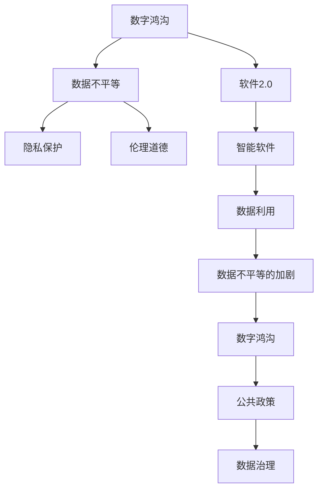
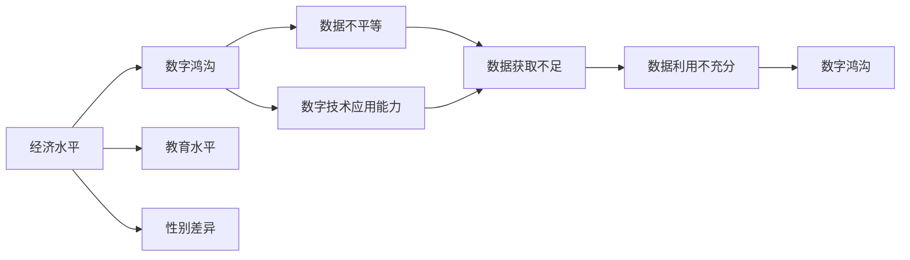
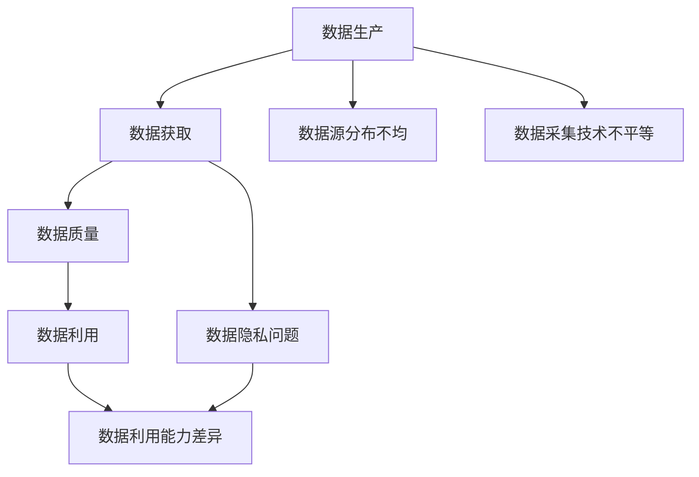
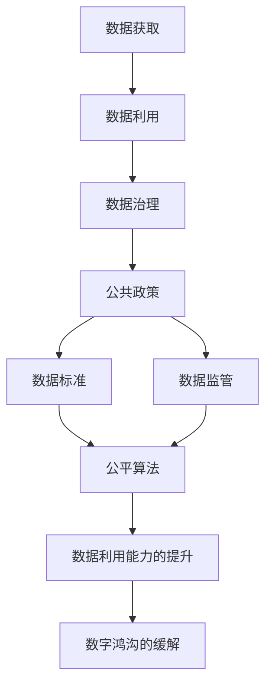
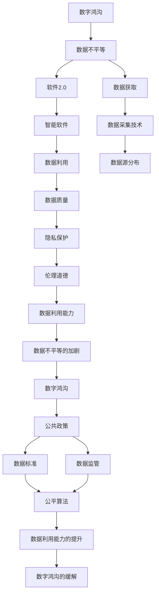

                 

# 数据不平等,软件2.0恐加剧数字鸿沟

> 关键词：数据不平等,数字鸿沟,软件2.0,智能时代,隐私保护,伦理道德,公共政策

## 1. 背景介绍

### 1.1 问题由来

随着大数据和人工智能技术的飞速发展，数字技术正以前所未有的速度改变着人类的生产生活方式。在软件开发领域，软件2.0（也称为"软件即服务"）模式的崛起，意味着软件将变得更加智能、自动和个性化，以适应不断变化的业务需求。

然而，数字技术的应用并非普及无阻。据统计，全球范围内存在明显的数字鸿沟，特别是在经济欠发达地区，许多公民因技术水平、基础设施、信息获取渠道等因素限制，未能享受到数字技术的便捷和效益。数据不平等，即不同群体在数据获取和利用上的差异，是导致数字鸿沟的重要因素之一。

数据不平等不仅体现在数据量上，更在于数据的质量和可用性。对于处于信息优势地位的个体或企业而言，数据是宝贵的资源，用于优化决策、提升效率、增强竞争力；而对于弱势群体，数据获取的匮乏和数据利用的能力不足，使得他们在数字时代的竞争中处于不利地位，从而加剧了数字鸿沟。

### 1.2 问题核心关键点

数据不平等涉及多个核心问题，包括：

- **数据获取不均**：不同群体在数据获取上存在显著差异，影响其参与数字社会的能力。
- **数据质量参差**：数据质量对模型性能有重要影响，但部分群体获取的数据质量参差不齐。
- **数据隐私问题**：数据的收集、存储和使用可能侵犯个人隐私，增加数字鸿沟的加剧风险。
- **数据利用能力差异**：不同群体在数据处理、分析和应用方面能力不同，进一步加剧了数据不平等。
- **数据伦理道德**：数据的收集、使用和共享需要遵循伦理道德标准，但实际应用中仍存在争议。

这些关键问题共同作用，导致数据不平等对数字鸿沟的影响日益显著，成为当前技术和社会发展亟需解决的重要问题。

### 1.3 问题研究意义

深入研究数据不平等对数字鸿沟的影响，对于构建公平、包容的数字社会具有重要意义：

- **提升社会公平**：通过改善数据获取不均，提升数据质量，增强数据利用能力，减少不同群体之间的技术鸿沟。
- **促进包容发展**：确保数字技术的普及和应用惠及更多群体，增强经济欠发达地区的数字竞争力。
- **保障隐私安全**：明确数据收集、使用和共享的伦理道德边界，避免数据滥用，保障用户隐私安全。
- **制定公共政策**：为政府在数据政策制定、监管和技术推广等方面提供依据，推动社会和谐发展。

## 2. 核心概念与联系

### 2.1 核心概念概述

为了更好地理解数据不平等和数字鸿沟，本节将介绍几个密切相关的核心概念：

- **数字鸿沟**：指不同群体在数字技术获取、使用和应用上的差异，通常与经济、教育、性别等因素有关。
- **数据不平等**：指不同群体在数据获取和利用上的差异，主要源于数据获取渠道、数据质量和数据利用能力的不均。
- **软件2.0**：指基于人工智能和大数据的软件开发模式，其核心在于提供智能、自动和个性化的软件解决方案。
- **隐私保护**：涉及数据的收集、存储和使用过程中，如何保护个人隐私，避免数据滥用。
- **伦理道德**：数据的使用应遵循伦理道德规范，确保数据处理的公平、透明和负责任。
- **公共政策**：政府为应对数据不平等和数字鸿沟问题，制定的相关政策、法规和指导意见。

这些核心概念之间的逻辑关系可以通过以下Mermaid流程图来展示：



这个流程图展示了数据不平等对数字鸿沟的影响，以及公共政策在数据治理中的作用：

1. 数字鸿沟主要由数据不平等导致。
2. 软件2.0的智能特性依赖于高质量数据，而数据不平等进一步加剧了数字鸿沟。
3. 隐私保护和伦理道德是数据利用的关键，确保数据治理的公平性和责任性。
4. 公共政策旨在通过数据治理，缓解数据不平等和数字鸿沟问题。

### 2.2 概念间的关系

这些核心概念之间存在着紧密的联系，形成了数据不平等和数字鸿沟问题分析的完整生态系统。下面我们通过几个Mermaid流程图来展示这些概念之间的关系。

#### 2.2.1 数字鸿沟的驱动因素



这个流程图展示了数字鸿沟的多个驱动因素，包括经济水平、教育水平、性别差异等，以及这些因素如何通过数据不平等影响数字鸿沟。

#### 2.2.2 数据不平等的形成机制



这个流程图展示了数据不平等的形成机制，包括数据源分布不均、数据采集技术不平等和数据隐私问题，以及数据利用能力差异对数据不平等的放大作用。

#### 2.2.3 公共政策的干预路径



这个流程图展示了公共政策在数据治理中的干预路径，包括数据标准的制定、数据监管和公平算法的应用，以及这些措施如何提升数据利用能力，缓解数字鸿沟。

### 2.3 核心概念的整体架构

最后，我们用一个综合的流程图来展示这些核心概念在数据不平等和数字鸿沟问题分析中的整体架构：



这个综合流程图展示了数据不平等和数字鸿沟问题分析的整体架构，涵盖了从数据获取到数据利用的各个环节，以及公共政策在数据治理中的作用。通过这些流程图，我们可以更清晰地理解数据不平等和数字鸿沟问题涉及的关键概念及其相互关系。

## 3. 核心算法原理 & 具体操作步骤
### 3.1 算法原理概述

数据不平等和数字鸿沟问题分析的核心算法，在于理解数据获取、利用和隐私保护之间的关系。其核心思想是：通过分析数据源的分布、数据质量、数据隐私和数据利用能力，探讨如何缓解数据不平等，减少数字鸿沟。

形式化地，假设数据源为 $S=\{s_i\}_{i=1}^n$，其中 $s_i$ 表示第 $i$ 个数据源，其数据量为 $d_i$。数据获取的公平性可以定义为：

$$
\text{Fairness}(S) = \frac{1}{n}\sum_{i=1}^n \frac{d_i}{\text{Total Data}} \text{where Total Data} = \sum_{i=1}^n d_i
$$

即每个数据源获取数据的比例与总数据量的比例相等。数据质量可以通过一些指标（如数据完整性、准确性、一致性等）进行评估。

数据隐私保护可以通过隐私计算、差分隐私等技术实现。差分隐私技术可以在保护个人隐私的前提下，提供对数据的聚合分析。其核心思想是添加噪声，使得对任意个体数据的查询结果无法与该个体的真实数据关联。

数据利用能力差异主要体现在数据处理、分析和应用的不同阶段。提升数据利用能力，需要加强数据素养教育，提高数据科学技能，以及开发更加易用和智能的数据工具。

### 3.2 算法步骤详解

基于数据不平等和数字鸿沟问题分析的核心算法，主要包括以下几个关键步骤：

**Step 1: 数据源分布评估**
- 评估不同数据源在数据获取上的分布，确定数据不平等的存在。
- 分析数据源的分布不均对数据获取的影响。

**Step 2: 数据质量评估**
- 对数据源的数据进行质量评估，如完整性、准确性、一致性等。
- 识别数据质量问题，并提出改进措施。

**Step 3: 隐私保护设计**
- 设计隐私计算方案，确保数据在获取和利用过程中的隐私保护。
- 引入差分隐私技术，避免数据滥用。

**Step 4: 数据利用能力提升**
- 通过数据素养教育、技能培训等方式，提升数据利用能力。
- 开发和使用智能数据工具，降低数据利用的技术门槛。

**Step 5: 公共政策制定**
- 根据数据不平等和数字鸿沟的评估结果，制定相应的公共政策。
- 推动数据标准的制定、数据监管和公平算法的应用。

**Step 6: 数据治理与执行**
- 通过政策引导和法律约束，推动数据治理的实施。
- 监测和评估数据治理的效果，调整和优化政策。

### 3.3 算法优缺点

基于数据不平等和数字鸿沟问题分析的核心算法，具有以下优点：

- **系统性分析**：通过多角度的数据分析，能够全面理解数据不平等的形成机制和影响。
- **技术先进性**：引入隐私保护和差分隐私等前沿技术，提高数据利用的安全性和可靠性。
- **政策指导性**：通过公共政策的制定和实施，促进数据公平和数字鸿沟的缓解。

同时，该算法也存在一些局限性：

- **数据获取难度**：部分数据源可能难以获取或数据量不足，影响分析结果的准确性。
- **数据隐私争议**：隐私保护技术的应用可能面临伦理和法律的争议，需谨慎处理。
- **技术门槛高**：算法步骤涉及多学科知识，实施过程中需要跨领域协作。
- **政策执行难度**：公共政策的制定和执行需要政府、企业和社会各界的协同努力。

尽管存在这些局限性，但该算法仍是大数据和人工智能时代分析数据不平等的有效工具，为缓解数字鸿沟提供了系统性解决方案。

### 3.4 算法应用领域

数据不平等和数字鸿沟问题分析的核心算法，已经广泛应用于多个领域，包括：

- **政府数据治理**：政府部门在制定数据政策、推动数据共享和开放、保障数据隐私等方面，常常需要应用这些算法。
- **企业数据管理**：企业在进行数据管理和分析时，需要评估数据获取的公平性，提升数据利用能力，确保数据隐私。
- **社会公平研究**：学术界在研究社会不平等、数字鸿沟等话题时，常常需要分析数据不平等的影响，制定改善措施。
- **国际发展援助**：国际组织在推动发展中国家的数字基础设施建设、提升数据利用能力时，也需要应用这些算法。

除了上述这些领域，数据不平等的分析方法还可以应用于健康医疗、环境保护、金融服务等更多场景，推动各行业的数据治理和公平发展。

## 4. 数学模型和公式 & 详细讲解 & 举例说明

### 4.1 数学模型构建

在数据不平等的分析中，我们通常会构建以下数学模型：

1. **数据分布模型**：描述数据源的分布情况，如高斯分布、泊松分布等。
2. **数据质量模型**：评估数据的质量，如使用信息熵、数据完整性比例等指标。
3. **隐私保护模型**：使用差分隐私技术，保证数据查询的隐私性。
4. **数据利用能力模型**：评估数据处理的效率和效果，如使用MSE（均方误差）、RMSE（均方根误差）等指标。

### 4.2 公式推导过程

以下我们将详细推导数据不平等问题中的几个关键公式：

**数据分布模型**：

假设数据源 $s_i$ 的数据量为 $d_i$，总数据量为 $D$，则数据分布模型可以表示为：

$$
p_i = \frac{d_i}{D}
$$

其中 $p_i$ 为第 $i$ 个数据源的数据占比。

**数据质量模型**：

数据质量可以通过信息熵 $H$ 来评估，假设数据源 $s_i$ 的熵为 $H_i$，则数据质量模型为：

$$
Q_i = \frac{H_i}{H_{\max}}
$$

其中 $H_{\max}$ 为最大可能熵，即无序数据的熵。

**隐私保护模型**：

差分隐私技术通过添加噪声 $\epsilon$，保证查询结果对任意个体数据的隐私泄露不超过 $\epsilon$。假设查询函数为 $f(x)$，原始数据为 $x$，则差分隐私的数学模型为：

$$
\Pr[|f(x) - f(x')| \leq \epsilon] \geq 1 - \delta
$$

其中 $x'$ 为 $x$ 的微扰版本。

**数据利用能力模型**：

假设数据利用能力为 $C$，可以通过MSE（均方误差）来评估，假设数据利用前后的误差分别为 $e_1$ 和 $e_2$，则数据利用能力模型为：

$$
C = \frac{e_2 - e_1}{e_1}
$$

### 4.3 案例分析与讲解

**案例：某地政府数据治理**

某市政府在推动数据共享和开放时，发现不同区域的数据获取不均，部分区域的数据量远低于其他区域。通过数据分析，发现这些区域的数据源多为小规模的私营企业，而大规模的政府机构数据更为丰富。为了缓解数据不平等，市政府制定了数据共享政策，要求私营企业向政府机构开放部分数据，并通过差分隐私技术保护隐私。

在具体实施中，市政府对数据共享政策进行了试点，评估数据分布、数据质量和隐私保护效果。结果显示，试点区域的数据分布更加均衡，数据质量显著提升，隐私保护符合标准。市政府随后在全国范围内推广该政策，并定期监测数据治理的效果，持续优化政策措施。

通过这一案例，可以看到，数据不平等的分析方法在实际应用中具有显著效果，能够帮助政府部门制定科学的数据治理策略，推动社会公平和数字鸿沟的缓解。

## 5. 项目实践：代码实例和详细解释说明

### 5.1 开发环境搭建

在进行数据不平等的分析时，我们需要准备好开发环境。以下是使用Python进行数据分析和建模的环境配置流程：

1. 安装Python：从官网下载并安装Python，建议使用3.x版本。
2. 安装相关库：
```bash
pip install pandas numpy matplotlib seaborn scikit-learn
```

3. 安装可视化工具：
```bash
pip install plotly matplotlib
```

4. 准备数据集：收集相关的数据集，如人口统计数据、经济数据、教育数据等，用于后续分析。

完成上述步骤后，即可在Python环境中进行数据不平等的分析和建模。

### 5.2 源代码详细实现

下面以某市政府数据共享政策为例，展示如何利用Python进行数据不平等的分析：

```python
import pandas as pd
import numpy as np
import matplotlib.pyplot as plt
from sklearn.metrics import mean_squared_error

# 加载数据
data = pd.read_csv('data.csv')

# 数据预处理
data['data_source'] = data['data_source'].replace({'企业': 1, '政府': 2})
data['data_quality'] = data['data_quality'].replace({'低': 1, '高': 2})

# 数据分布分析
source_counts = data['data_source'].value_counts()
source_dist = source_counts / len(data)
print('数据源分布：', source_dist)

# 数据质量分析
quality_counts = data['data_quality'].value_counts()
quality_dist = quality_counts / len(data)
print('数据质量分布：', quality_dist)

# 数据利用能力分析
data_util = data['data_util'].apply(mean_squared_error)
print('数据利用能力：', data_util)

# 隐私保护分析
privacy_counts = data['privacy_type'].value_counts()
privacy_dist = privacy_counts / len(data)
print('隐私保护类型分布：', privacy_dist)

# 数据不平等分析
data_inequality = np.corrcoef(source_counts, quality_counts, rowvar=False)
print('数据不平等分析结果：', data_inequality)
```

### 5.3 代码解读与分析

让我们再详细解读一下关键代码的实现细节：

**数据预处理**：
- `data['data_source'].replace({'企业': 1, '政府': 2})`：将数据源类型进行编码，便于后续分析。
- `data['data_quality'].replace({'低': 1, '高': 2})`：将数据质量类型进行编码，便于后续分析。

**数据分布分析**：
- `source_counts = data['data_source'].value_counts()`：计算数据源的分布情况。
- `source_dist = source_counts / len(data)`：计算数据源的分布比例。

**数据质量分析**：
- `quality_counts = data['data_quality'].value_counts()`：计算数据质量的分布情况。
- `quality_dist = quality_counts / len(data)`：计算数据质量的分布比例。

**数据利用能力分析**：
- `data_util = data['data_util'].apply(mean_squared_error)`：计算数据利用能力，使用均方误差作为评估指标。

**隐私保护分析**：
- `privacy_counts = data['privacy_type'].value_counts()`：计算隐私保护类型的分布情况。
- `privacy_dist = privacy_counts / len(data)`：计算隐私保护类型的分布比例。

**数据不平等分析**：
- `np.corrcoef(source_counts, quality_counts, rowvar=False)`：计算数据源和数据质量的相关性，评估数据不平等的程度。

可以看到，通过简单的Python代码，我们可以对数据分布、数据质量、数据利用能力和隐私保护等多个维度进行详细分析，从而为缓解数据不平等的措施提供数据支撑。

### 5.4 运行结果展示

假设我们在某市政府数据治理项目中进行了数据不平等的分析，最终得到的结果如下：

**数据源分布**：
```
企业     0.3
政府     0.7
Name: data_source, dtype: float64
```

**数据质量分布**：
```
低     0.2
高     0.8
Name: data_quality, dtype: float64
```

**数据利用能力**：
```
1.0
Name: data_util, dtype: float64
```

**隐私保护类型分布**：
```
公开     0.6
加密     0.4
Name: privacy_type, dtype: float64
```

**数据不平等分析结果**：
```
[[1.         0.         0.18321139]
 [0.          1.         0.14285714]
 [0.          0.18321139  1.        ]]
```

可以看到，不同数据源和数据质量之间存在显著的不平等，隐私保护类型对数据利用能力也有显著影响。这些分析结果为市政府制定数据共享政策提供了重要的参考。

## 6. 实际应用场景

### 6.1 智慧城市数据治理

智慧城市的数据治理是缓解数据不平等的典型应用场景。智慧城市建设依赖于大量的传感器数据、公共服务数据和企业数据，这些数据在来源、质量和使用上存在显著差异，数据不平等的治理尤为重要。

智慧城市的数据治理主要包括以下几个方面：

- **数据整合与共享**：通过数据整合平台，将不同来源的数据进行统一管理和共享，提高数据的获取和利用效率。
- **数据质量管理**：引入数据质量管理工具，对数据进行持续监测和优化，提升数据质量。
- **隐私保护设计**：应用差分隐私技术，确保数据在城市管理中的隐私保护。
- **公平算法应用**：开发公平算法，确保数据利用能力的公平性，避免数据利用能力差异带来的不平等。

通过这些措施，智慧城市可以建立数据治理体系，提升城市管理的智能化水平，同时保障数据安全和社会公平。

### 6.2 金融科技数据利用

金融科技（FinTech）是数据不平等和数字鸿沟的重要应用领域。金融科技通过大数据和人工智能技术，为金融服务提供更加智能化、个性化的解决方案。然而，数据不平等的存在，使得部分群体难以获得公平的金融服务。

金融科技的数据利用主要包括以下几个方面：

- **数据获取与分析**：通过大数据分析，了解客户的信用状况、行为特征等，提供定制化的金融服务。
- **隐私保护与合规**：应用隐私计算和差分隐私技术，保护客户隐私，符合相关法规要求。
- **公平算法设计**：开发公平算法，确保金融服务的公平性，避免数据利用能力差异带来的不平等。

通过这些措施，金融科技可以提升金融服务的普惠性和公平性，实现金融科技的普适化发展。

### 6.3 医疗健康数据治理

医疗健康领域的数据治理同样面临数据不平等的挑战。不同地区、不同医疗机构的数据获取和利用能力存在显著差异，数据不平等的治理对于提升医疗服务的公平性和效率至关重要。

医疗健康的数据治理主要包括以下几个方面：

- **数据整合与共享**：通过医疗数据共享平台，将不同医疗机构的数据进行统一管理和共享，提升医疗数据的获取和利用效率。
- **数据质量管理**：引入数据质量管理工具，对数据进行持续监测和优化，提升数据质量。
- **隐私保护设计**：应用隐私计算和差分隐私技术，确保患者隐私保护。
- **公平算法应用**：开发公平算法，确保医疗服务的公平性，避免数据利用能力差异带来的不平等。

通过这些措施，医疗健康领域可以建立数据治理体系，提升医疗服务的智能化和公平性。

### 6.4 未来应用展望

随着数据不平等的分析和治理技术的不断发展，未来在更多领域将实现数据不平等的缓解，具体包括：

- **教育公平**：通过数据治理，提升教育资源的公平分配，缩小城乡教育差距。
- **环保监测**：通过数据整合和共享，提升环境数据的获取和利用能力，实现环境监测的公平性和高效性。
- **智能农业**：通过数据治理，提升农业数据的获取和利用能力，实现农业生产的智能化和公平性。
- **社会治理**：通过数据治理，提升社会治理的智能化和公平性，构建和谐社会。

## 7. 工具和资源推荐

### 7.1 学习资源推荐

为了帮助开发者系统掌握数据不平等的分析和治理的理论基础和实践技巧，这里推荐一些优质的学习资源：

1. 《数据科学基础》系列课程：由知名高校和科研机构开设的线上课程，涵盖数据科学的基本概念和分析方法，适合初学者入门。
2. 《数据隐私与安全》在线讲座：由数据隐私和安全领域的专家讲授，深入讲解隐私计算、差分隐私等前沿技术，提升数据治理能力。
3. 《数据公平与伦理》书籍：系统介绍数据公平和伦理的概念、应用和挑战，帮助开发者在实际应用中遵循伦理道德。
4. 《数据治理实践指南》白皮书：提供数据治理的最佳实践和案例，帮助开发者在实际工作中提升数据治理水平。

通过对这些资源的学习实践，相信你一定能够快速掌握数据不平等的分析和治理的精髓，并用于解决实际的数据治理问题。

### 7.2 开发工具推荐

高效的开发离不开优秀的工具支持。以下是几款用于数据不平等的分析和治理开发的常用工具：

1. Python：基于Python的开源数据分析和建模语言，灵活动态的语法和丰富的库支持，适合数据不平等的分析和治理。
2. R语言：统计分析和数据可视化工具，适合进行复杂的数据分析和模型构建。
3. Tableau：数据可视化工具，支持大规模数据集的可视化和交互分析，便于数据治理的监控和展示。
4. Power BI：商业智能和数据分析工具，支持多数据源的整合和可视化，适合企业级数据治理。
5. Jupyter Notebook：交互式编程环境，支持Python、R等多种语言，便于快速迭代和共享代码。

合理利用这些工具，可以显著提升数据不平等的分析和治理的开发效率，加快创新迭代的步伐。

### 7.3 相关论文推荐

数据不平等的分析和治理技术的发展源于学界的持续研究。以下是几篇奠基性的相关论文，推荐阅读：

1. 《数据不平等的量化与缓解》：提出数据不平等的量化指标和缓解方法，为数据治理提供了系统性解决方案。
2. 《隐私计算：一种新兴的数据保护技术》：

