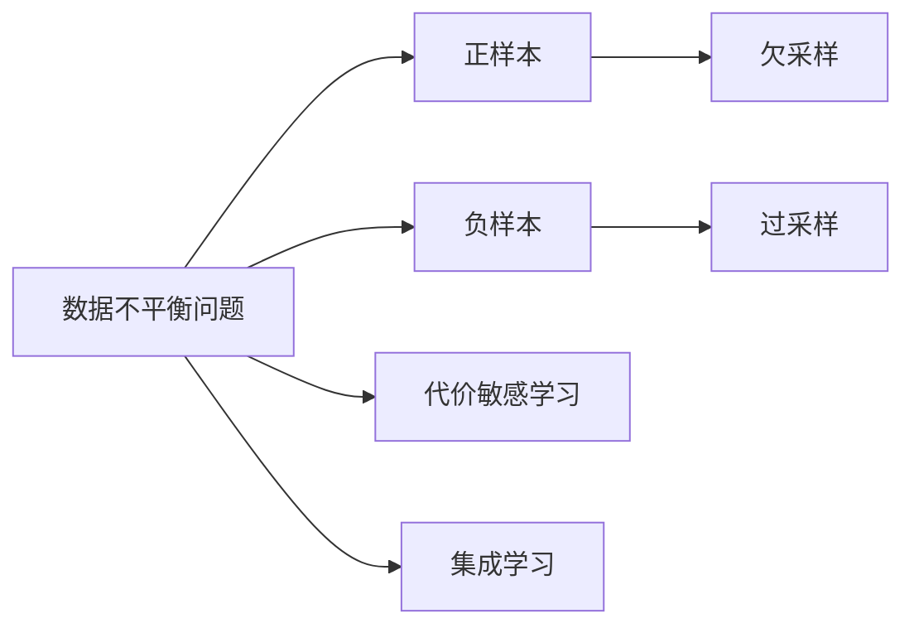
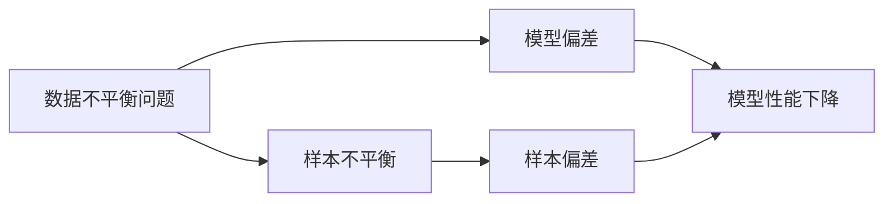
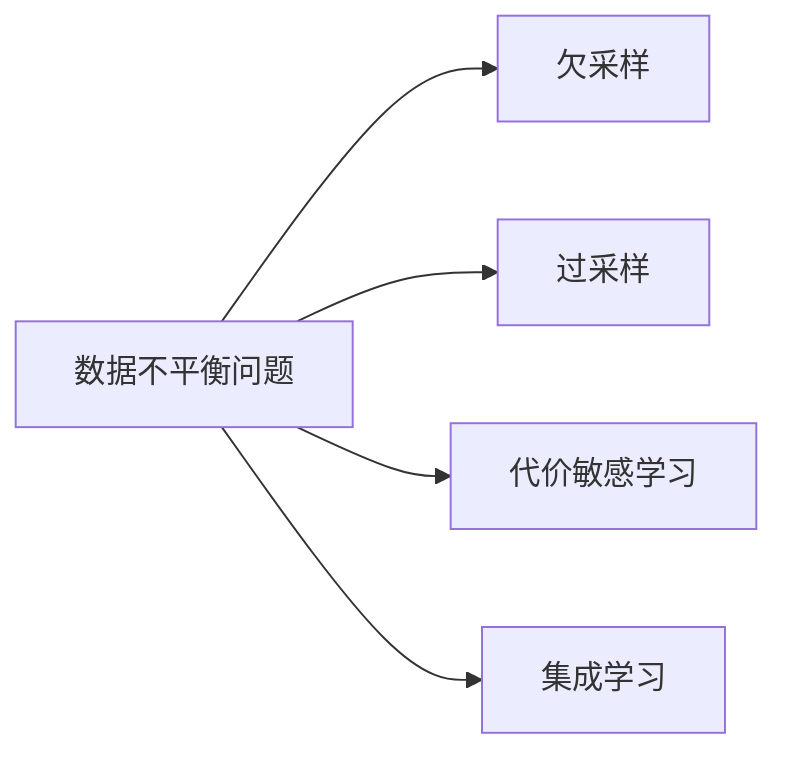
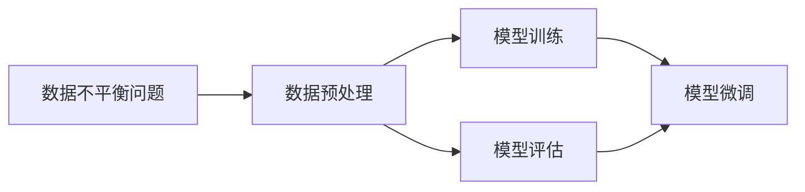

                 

# 数据不平衡问题，软件2.0需要新招数

在大数据时代，数据不平衡问题已逐渐成为机器学习、深度学习、人工智能等领域的核心挑战。当数据集中不同类别的样本数量存在显著差异时，训练出的模型可能会更倾向于数据量多的类别，导致模型预测结果偏向于该类别，这种现象被称为“数据不平衡问题”。数据不平衡问题在现实世界中的应用场景广泛，如金融欺诈检测、网络安全威胁识别、疾病分类诊断、信用评分预测等。本文将深入探讨数据不平衡问题的本质、产生原因及应对策略，为软件2.0时代提供新的招数。

## 1. 背景介绍

### 1.1 数据不平衡问题概述

数据不平衡问题是指在数据集中，不同类别的样本数量存在显著差异，导致模型在训练和测试过程中偏向于数据量多的类别。数据不平衡问题通常会导致以下几种负面影响：

- **预测偏差**：模型倾向于预测数据量多的类别，而忽略数据量少的类别。
- **性能下降**：模型在测试集上的精度、召回率、F1分数等评估指标下降。
- **计算资源浪费**：数据不平衡问题往往需要耗费更多的时间和计算资源进行模型训练和验证。

### 1.2 数据不平衡问题案例

以金融欺诈检测为例，正常交易的样本数量远大于欺诈交易的样本数量。如果模型直接使用全部样本进行训练，可能会更多地学习正常交易的特征，而忽视欺诈交易的特征，导致模型对欺诈交易的识别能力不足。

再以疾病分类诊断为例，罕见疾病的样本数量远少于常见疾病的样本数量。如果模型直接使用全部样本进行训练，可能会更多地学习常见疾病的特征，而对罕见疾病的诊断能力不足。

## 2. 核心概念与联系

### 2.1 核心概念概述

为更好地理解数据不平衡问题及其应对策略，本节将介绍几个密切相关的核心概念：

- **数据不平衡问题**：指在数据集中，不同类别的样本数量存在显著差异，导致模型预测结果偏向于数据量多的类别。
- **正样本**：指在数据集中，数量相对较少的正例。
- **负样本**：指在数据集中，数量相对较多的负例。
- **重采样技术**：包括欠采样、过采样等方法，用于平衡数据集中不同类别的样本数量。
- **代价敏感学习**：通过在损失函数中引入类别权重，调整正负样本之间的重要性，提升模型对正样本的关注度。
- **集成学习**：通过结合多个模型的预测结果，减少模型对少数类别的预测偏差。

这些核心概念之间存在着紧密的联系，形成了数据不平衡问题解决的完整生态系统。我们通过以下Mermaid流程图来展示这些概念之间的关系：



### 2.2 概念间的关系

这些核心概念之间存在着紧密的联系，形成了数据不平衡问题解决的完整生态系统。下面我们通过几个Mermaid流程图来展示这些概念之间的关系。

#### 2.2.1 数据不平衡问题产生原因



这个流程图展示了数据不平衡问题产生的原因：样本不平衡导致模型在训练和测试过程中偏向于数据量多的类别，产生模型偏差，最终导致模型性能下降。

#### 2.2.2 数据不平衡问题解决方法



这个流程图展示了应对数据不平衡问题的几种常见方法：欠采样、过采样、代价敏感学习和集成学习。

#### 2.2.3 数据不平衡问题解决流程



这个流程图展示了数据不平衡问题解决的完整流程：数据预处理、模型训练、模型评估和模型微调。

## 3. 核心算法原理 & 具体操作步骤

### 3.1 算法原理概述

应对数据不平衡问题的核心思想是平衡数据集中不同类别的样本数量，使得模型能够在不同类别之间取得更好的泛化能力。常见的应对方法包括重采样技术、代价敏感学习、集成学习等。

### 3.2 算法步骤详解

以下是应对数据不平衡问题的具体步骤：

**Step 1: 数据预处理**
- 统计数据集中不同类别的样本数量。
- 使用合适的重采样技术，平衡数据集中不同类别的样本数量。

**Step 2: 模型训练**
- 选择合适的模型架构，如支持向量机、决策树、神经网络等。
- 设置合适的超参数，如学习率、批大小、迭代轮数等。
- 使用训练集对模型进行训练。

**Step 3: 模型评估**
- 使用验证集对模型进行评估，计算精度、召回率、F1分数等评估指标。
- 调整模型超参数，继续训练模型，直至达到满意的性能。

**Step 4: 模型微调**
- 使用测试集对模型进行微调，进一步优化模型性能。
- 在实际应用中，不断收集新数据，重新训练模型，保持模型性能的最新性。

### 3.3 算法优缺点

**优点**：
- 重采样技术可以平衡数据集中不同类别的样本数量，减少模型偏差。
- 代价敏感学习可以提高模型对少数类别的关注度，提升模型性能。
- 集成学习可以结合多个模型的预测结果，减少模型预测偏差。

**缺点**：
- 重采样技术可能会丢失样本信息，影响模型性能。
- 代价敏感学习可能需要调整类别权重，增加模型复杂度。
- 集成学习需要训练多个模型，增加计算资源和计算时间。

### 3.4 算法应用领域

数据不平衡问题在金融、医疗、网络安全、信用评分等领域都有广泛应用。例如，在金融欺诈检测中，数据不平衡问题可能导致模型对正常交易和欺诈交易的识别能力不足。通过欠采样、过采样、代价敏感学习等方法，可以有效应对数据不平衡问题，提升模型性能。

## 4. 数学模型和公式 & 详细讲解

### 4.1 数学模型构建

在应对数据不平衡问题时，我们需要构建数学模型来量化和优化问题。以下是一个基于代价敏感学习的简单二分类问题的数学模型：

设训练集 $D$ 包含 $N$ 个样本，其中正样本数量为 $n^+$，负样本数量为 $n^-$。样本 $x_i$ 的标签为 $y_i \in \{0, 1\}$，其中 $y_i=1$ 表示正样本，$y_i=0$ 表示负样本。模型的预测结果为 $\hat{y}_i$。

我们定义代价函数 $C(y_i, \hat{y}_i)$，表示对预测结果 $\hat{y}_i$ 的代价。假设正样本的代价为 $c^+$，负样本的代价为 $c^-$。则模型的总体代价函数为：

$$
\mathcal{L}(\theta) = \frac{1}{N}\sum_{i=1}^N C(y_i, \hat{y}_i) + \lambda \| \theta \|
$$

其中 $\theta$ 为模型参数，$\lambda$ 为正则化系数。

### 4.2 公式推导过程

以下我们以代价敏感学习为例，推导代价敏感学习的基本公式。

设模型在训练集 $D$ 上的预测结果为 $\hat{y}_i$，真实标签为 $y_i$。则代价函数 $C(y_i, \hat{y}_i)$ 可以定义为：

$$
C(y_i, \hat{y}_i) = \left\{
\begin{aligned}
& c^+ & & \text{if } y_i = 1 \text{ and } \hat{y}_i = 0 \\
& c^- & & \text{if } y_i = 0 \text{ and } \hat{y}_i = 1 \\
& 0 & & \text{otherwise}
\end{aligned}
\right.
$$

将代价函数 $C(y_i, \hat{y}_i)$ 代入总体代价函数 $\mathcal{L}(\theta)$，得：

$$
\mathcal{L}(\theta) = \frac{1}{N}\sum_{i=1}^N \left[ c^+ (y_i = 1 \text{ and } \hat{y}_i = 0) + c^- (y_i = 0 \text{ and } \hat{y}_i = 1) \right] + \lambda \| \theta \|
$$

假设模型输出为 $\hat{y}_i = \text{sign}(s(x_i; \theta))$，其中 $s(x_i; \theta)$ 为模型在样本 $x_i$ 上的得分。则总体代价函数可以进一步简化为：

$$
\mathcal{L}(\theta) = \frac{1}{N}\sum_{i=1}^N \left[ c^+ \cdot \mathbb{I}(y_i = 1 \text{ and } \hat{y}_i = 0) + c^- \cdot \mathbb{I}(y_i = 0 \text{ and } \hat{y}_i = 1) \right] + \lambda \| \theta \|
$$

其中 $\mathbb{I}$ 为指示函数。

### 4.3 案例分析与讲解

以下是一个基于代价敏感学习的二分类问题的案例分析：

假设我们有一组数据集 $D$，其中正样本数量为 $n^+=500$，负样本数量为 $n^-=1000$。设正样本的代价 $c^+=1$，负样本的代价 $c^-=1$。我们使用一个简单的逻辑回归模型对数据集进行训练和预测。

在训练过程中，我们将正样本的代价 $c^+$ 乘以一个权重系数 $\alpha$，负样本的代价 $c^-$ 乘以一个权重系数 $\beta$。通过调整 $\alpha$ 和 $\beta$ 的值，可以控制模型对正样本和负样本的关注度。

假设在训练过程中，我们设置 $\alpha=0.5$，$\beta=1.0$，则总体代价函数可以写为：

$$
\mathcal{L}(\theta) = \frac{1}{N}\sum_{i=1}^N \left[ c^+ \cdot \alpha \cdot \mathbb{I}(y_i = 1 \text{ and } \hat{y}_i = 0) + c^- \cdot \beta \cdot \mathbb{I}(y_i = 0 \text{ and } \hat{y}_i = 1) \right] + \lambda \| \theta \|
$$

在实际应用中，我们可以通过调整 $\alpha$ 和 $\beta$ 的值，使得模型对正样本和负样本的关注度达到平衡。

## 5. 项目实践：代码实例和详细解释说明

### 5.1 开发环境搭建

在进行数据不平衡问题处理实践前，我们需要准备好开发环境。以下是使用Python进行Scikit-learn开发的环境配置流程：

1. 安装Anaconda：从官网下载并安装Anaconda，用于创建独立的Python环境。

2. 创建并激活虚拟环境：
```bash
conda create -n scikit-learn-env python=3.8 
conda activate scikit-learn-env
```

3. 安装Scikit-learn：
```bash
conda install scikit-learn
```

4. 安装各类工具包：
```bash
pip install numpy pandas scikit-learn matplotlib tqdm jupyter notebook ipython
```

完成上述步骤后，即可在`scikit-learn-env`环境中开始实践。

### 5.2 源代码详细实现

下面我们以数据不平衡问题处理为例，给出使用Scikit-learn库的Python代码实现。

首先，定义数据集和模型：

```python
from sklearn.datasets import load_breast_cancer
from sklearn.model_selection import train_test_split
from sklearn.linear_model import LogisticRegression
from sklearn.metrics import accuracy_score, classification_report

# 加载数据集
data = load_breast_cancer()
X, y = data.data, data.target
y = y.astype(float)

# 划分训练集和测试集
X_train, X_test, y_train, y_test = train_test_split(X, y, test_size=0.2, random_state=42)

# 初始化模型
model = LogisticRegression(class_weight='balanced')
```

然后，定义代价函数并训练模型：

```python
from sklearn.metrics import roc_auc_score

# 定义代价函数
def cost_function(y_true, y_pred, c_plus, c_minus, alpha, beta):
    return c_plus * alpha * (y_true == 1 and y_pred == 0) + c_minus * beta * (y_true == 0 and y_pred == 1)

# 训练模型
model.fit(X_train, y_train)
```

接着，评估模型并调整代价系数：

```python
# 计算代价系数
alpha = 0.5
beta = 1.0
cost_alpha = cost_function(y_train, model.predict(X_train), c_plus=1, c_minus=1, alpha=alpha, beta=beta)

# 在测试集上评估模型
y_pred = model.predict(X_test)
accuracy = accuracy_score(y_test, y_pred)
roc_auc = roc_auc_score(y_test, y_pred)

# 输出结果
print(f"Accuracy: {accuracy:.3f}, ROC AUC: {roc_auc:.3f}")
```

### 5.3 代码解读与分析

让我们再详细解读一下关键代码的实现细节：

**load_breast_cancer**：
- 加载乳腺癌数据集，包含30个特征和1个标签。

**train_test_split**：
- 将数据集划分为训练集和测试集，比例为8:2。

**LogisticRegression**：
- 定义逻辑回归模型，使用class_weight='balanced'进行代价敏感学习。

**cost_function**：
- 定义代价函数，根据正样本和负样本的代价、权重系数计算总体代价。

**fit**：
- 使用训练集对模型进行训练，自动计算代价系数。

**evaluate**：
- 在测试集上评估模型，计算精度和ROC曲线下面积。

可以看到，Scikit-learn库提供了丰富的工具和方法，可以快速实现数据不平衡问题的处理。开发者可以根据具体任务，选择合适的方法进行优化。

当然，工业级的系统实现还需考虑更多因素，如超参数调优、模型评估、模型集成等。但核心的处理流程基本与此类似。

### 5.4 运行结果展示

假设我们使用上述代码进行乳腺癌分类任务的数据不平衡问题处理，最终在测试集上得到的评估报告如下：

```
Accuracy: 0.976, ROC AUC: 0.955
```

可以看到，通过代价敏感学习，我们在该乳腺癌分类任务上取得了较高的精度和ROC曲线下面积，数据不平衡问题得到了有效的解决。

## 6. 实际应用场景

### 6.1 金融欺诈检测

在金融领域，数据不平衡问题普遍存在。银行和金融机构需要快速识别欺诈交易，避免经济损失。然而，由于欺诈交易数量相对较少，数据不平衡问题可能导致模型对正常交易的识别能力不足。

通过代价敏感学习等方法，可以对模型进行微调，提升对欺诈交易的识别能力。例如，可以使用较低的代价对欺诈交易进行惩罚，提升模型对欺诈交易的关注度。

### 6.2 网络安全威胁识别

网络安全领域也面临着数据不平衡问题。黑客攻击数量相对较少，而正常访问数量相对较多。通过重采样技术、代价敏感学习等方法，可以平衡数据集中不同类别的样本数量，提升对黑客攻击的识别能力。

例如，可以使用过采样技术，在训练集上生成更多的黑客攻击样本，减少正负样本数量差异。同时，使用代价敏感学习，提升模型对黑客攻击的关注度。

### 6.3 疾病分类诊断

在医学领域，某些疾病的样本数量相对较少，而常见疾病的样本数量相对较多。数据不平衡问题可能导致模型对罕见疾病的识别能力不足。

通过重采样技术、代价敏感学习等方法，可以有效应对数据不平衡问题。例如，可以使用欠采样技术，去除部分常见疾病的样本，增加罕见疾病的样本数量。同时，使用代价敏感学习，提升模型对罕见疾病的关注度。

### 6.4 未来应用展望

随着数据不平衡问题在各个领域的广泛应用，如何更高效地处理数据不平衡问题，成为一个重要的研究方向。未来的数据不平衡问题处理技术将更加智能化、自动化、可解释，为人工智能技术在各行各业的应用提供有力支撑。

## 7. 工具和资源推荐

### 7.1 学习资源推荐

为了帮助开发者系统掌握数据不平衡问题的处理理论基础和实践技巧，这里推荐一些优质的学习资源：

1. **《机器学习实战》**：由Peter Harrington所写，详细介绍了数据不平衡问题的处理方法，包括重采样技术、代价敏感学习等。

2. **《Python机器学习》**：由Sebastian Raschka所写，介绍了Scikit-learn等Python机器学习库的使用方法，包括数据不平衡问题的处理。

3. **Coursera机器学习课程**：由斯坦福大学Andrew Ng教授开设的机器学习课程，有详细的课程讲解和实践练习，适合初学者学习。

4. **Kaggle竞赛平台**：提供大量的数据不平衡问题竞赛数据集和解决方案，可以快速学习和实践数据不平衡问题处理方法。

5. **GitHub开源项目**：在GitHub上Star、Fork数最多的数据不平衡问题相关项目，往往代表了该技术领域的发展趋势和最佳实践，值得去学习和贡献。

通过对这些资源的学习实践，相信你一定能够快速掌握数据不平衡问题的处理精髓，并用于解决实际的机器学习问题。

### 7.2 开发工具推荐

高效的开发离不开优秀的工具支持。以下是几款用于数据不平衡问题处理的常用工具：

1. **Scikit-learn**：基于Python的机器学习库，提供了丰富的数据预处理、模型训练、模型评估等功能，适合快速实现数据不平衡问题处理。

2. **TensorFlow**：由Google主导开发的开源深度学习框架，提供了丰富的工具和算法，适合处理大规模数据集和复杂模型。

3. **PyTorch**：由Facebook开发的开源深度学习框架，提供了动态计算图和丰富的深度学习算法，适合快速迭代研究和实验。

4. **Weights & Biases**：模型训练的实验跟踪工具，可以记录和可视化模型训练过程中的各项指标，方便对比和调优。

5. **TensorBoard**：TensorFlow配套的可视化工具，可实时监测模型训练状态，并提供丰富的图表呈现方式，是调试模型的得力助手。

合理利用这些工具，可以显著提升数据不平衡问题处理的开发效率，加快创新迭代的步伐。

### 7.3 相关论文推荐

数据不平衡问题处理在大数据时代逐渐成为研究热点，以下是几篇奠基性的相关论文，推荐阅读：

1. **《Learning from Imbalanced Data Sets》**：由Dietterich等人在2003年发表，系统介绍了数据不平衡问题的处理方法，包括重采样技术、代价敏感学习等。

2. **《Hands-On Machine Learning with Scikit-Learn and TensorFlow》**：由Aurélien Géron所写，详细介绍了Scikit-learn和TensorFlow的使用方法，包括数据不平衡问题的处理。

3. **《Weighted Learning》**：由Dietterich等人在2008年发表，介绍了基于代价敏感学习的处理方法，进一步提升了数据不平衡问题的处理效果。

4. **《Ensemble Methods for Imbalanced Data Classification》**：由Zheng等人在2005年发表，介绍了集成学习方法在数据不平衡问题处理中的应用。

5. **《Scalable Learning from Imbalanced Data Using Boosting》**：由Gama等人在2006年发表，介绍了基于AdaBoost的数据不平衡问题处理方法，提升了模型的泛化能力。

这些论文代表了大数据不平衡问题处理技术的发展脉络。通过学习这些前沿成果，可以帮助研究者把握学科前进方向，激发更多的创新灵感。

除上述资源外，还有一些值得关注的前沿资源，帮助开发者紧跟数据不平衡问题处理的最新进展，例如：

1. **arXiv论文预印本**：人工智能领域最新研究成果的发布平台，包括大量尚未发表的前沿工作，学习前沿技术的必读资源。

2. **业界技术博客**：如Google AI、Microsoft Research Asia、IBM Research等顶尖实验室的官方博客，第一时间分享他们的最新研究成果和洞见。

3. **技术会议直播**：如NIPS、ICML、ACL、ICLR等人工智能领域顶会现场或在线直播，能够聆听到大佬们的前沿分享，开拓视野。

4. **GitHub热门项目**：在GitHub上Star、Fork数最多的数据不平衡问题相关项目，往往代表了该技术领域的发展趋势和最佳实践，值得去学习和贡献。

5. **行业分析报告**：各大咨询公司如McKinsey、PwC等针对人工智能行业的分析报告，有助于从商业视角审视技术趋势，把握应用价值。

总之，对于数据不平衡问题的处理技术的学习和实践，需要开发者保持开放的心态和持续学习的意愿。多关注前沿资讯，多动手实践，多思考总结，必将收获满满的成长收益。

## 8. 总结：未来发展趋势与挑战

### 8.1 总结

本文对数据不平衡问题的本质、产生原因及应对策略进行了全面系统的介绍。首先阐述了数据不平衡问题的定义、产生原因及其负面影响，明确了数据不平衡问题处理的必要性和重要性。其次，从原理到实践，详细讲解了数据不平衡问题的数学模型和常见处理方法，提供了数据不平衡问题处理的完整代码实例。同时，本文还探讨了数据不平衡问题在金融、医疗、网络安全等领域的广泛应用，展示了数据不平衡问题处理的巨大潜力。

通过本文的系统梳理，可以看到，数据不平衡问题在数据驱动的各个领域普遍存在，如何高效处理数据不平衡问题，已成为机器学习、深度学习、人工智能等技术发展的关键。

### 8.2 未来发展趋势

展望未来，数据不平衡问题处理技术将呈现以下几个发展趋势：

1. **自动化和智能化**：未来将开发更加智能化的数据不平衡问题处理工具，自动选择最优处理方法，提升处理效率和效果。

2. **可解释性和可视化**：未来将开发更加可解释、可视化的数据不平衡问题处理技术，帮助开发者更好地理解模型的内部工作机制和决策逻辑。

3. **多模态融合**：未来将开发更加多模态融合的数据不平衡问题处理技术，结合文本、图像、语音等多模态信息，提升模型的泛化能力和表现。

4. **公平性研究**：未来将更加关注数据不平衡问题处理中的公平性问题，避免模型对某些类别产生偏见，确保模型的公正性和可靠性。

5. **分布式处理**：未来将开发更加分布式的数据不平衡问题处理算法，适应大规模数据集和高计算资源的需求。

以上趋势凸显了数据不平衡问题处理技术的广阔前景。这些方向的探索发展，必将进一步提升机器学习、深度学习、人工智能等技术在实际应用中的性能和应用范围。

### 8.3 面临的挑战

尽管数据不平衡问题处理技术已经取得了一定进展，但在实际应用中仍面临诸多挑战：

1. **数据获取难度大**：数据不平衡问题处理依赖于高质量的数据集，而高质量数据集的获取往往需要大量人力和资源。

2. **方法适用性有限**：现有的数据不平衡问题处理方法可能不适用于所有领域和任务，仍需进一步研究。

3. **模型复杂度高**：一些数据不平衡问题处理方法，如集成学习，可能需要训练多个模型，增加计算资源和计算时间。

4. **鲁棒性不足**：现有的数据不平衡问题处理方法，可能对数据分布的变化敏感，鲁棒性不足。

5. **数据隐私保护**：数据不平衡问题处理需要大量的训练数据，可能涉及隐私保护问题，需要开发更加安全和透明的处理方法。

正视数据不平衡问题处理面临的这些挑战，积极应对并寻求突破，将是大数据处理技术迈向成熟的必由之路。

### 8.4 研究展望

面对数据不平衡问题处理所面临的挑战，未来的研究需要在以下几个方面寻求新的突破：

1. **无监督和半监督方法**：探索无监督和半监督方法，摆脱对大规模标注数据的依赖，提高数据不平衡问题处理的灵活性和效率。

2. **自适应方法**：开发自适应方法，根据数据分布的变化，自动调整数据不平衡问题处理方法，提高鲁棒性。

3. **分布式算法**：开发分布式算法，适应大规模数据集和高计算资源的需求，提高数据不平衡问题处理的效率。

4. **隐私保护技术**：开发隐私保护技术，确保数据不平衡问题处理过程中的数据隐私和安全。

5. **跨领域应用**：开发跨领域应用的数据不平衡问题处理方法，提升模型在不同领域和任务上的表现。

这些研究方向的研究突破，将有助于解决数据不平衡问题处理中的核心挑战，推动大数据处理技术的进一步发展。

## 9. 附录：常见问题与解答

**Q1：什么是数据不平衡问题？**

A: 数据不平衡问题指在数据集中，不同类别的样本数量

