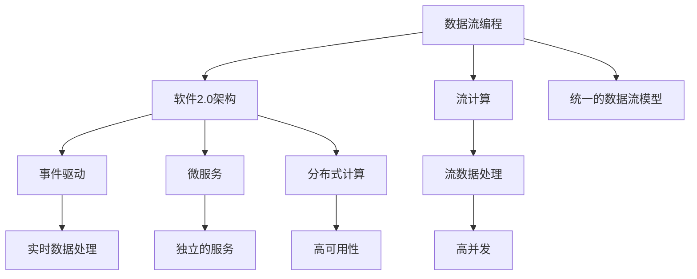
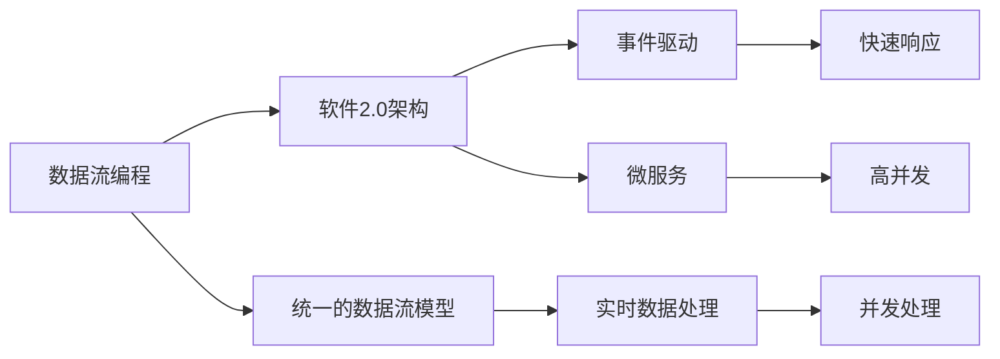
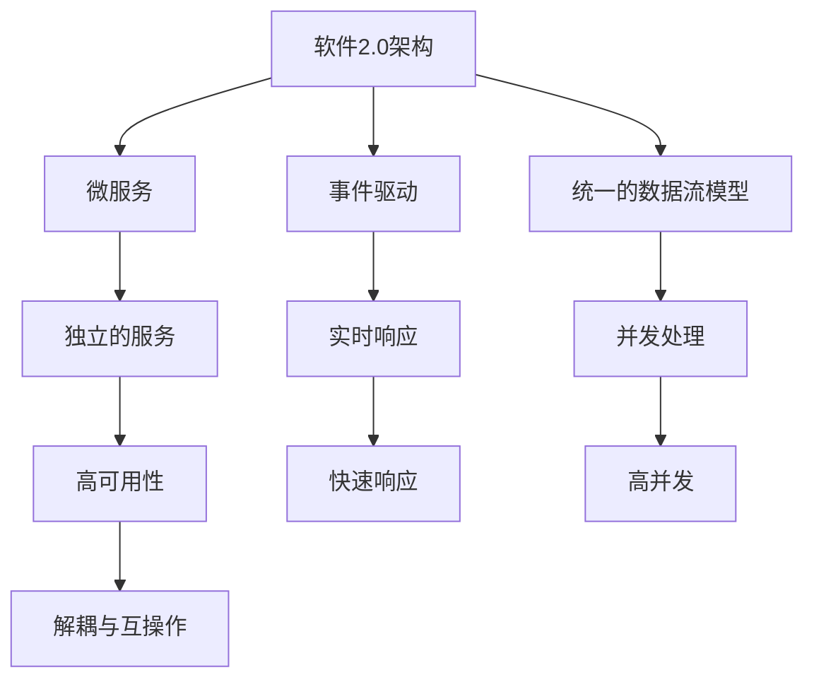
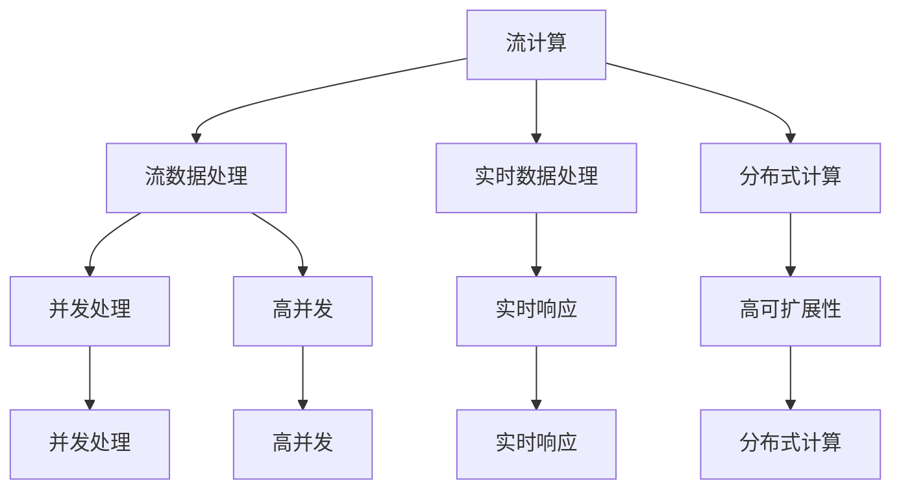
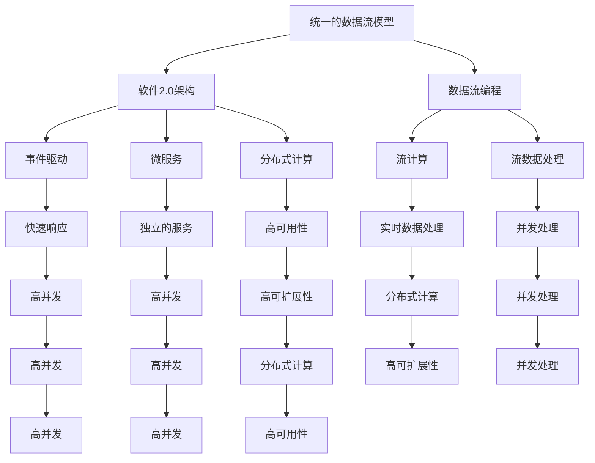

                 

# 数据流代替控制流：软件2.0架构的新思路

> 关键词：
- 数据流编程
- 软件2.0架构
- 流计算
- 事件驱动
- 微服务
- 分布式计算
- 流数据处理
- 实时数据处理

## 1. 背景介绍

### 1.1 问题由来
在过去的几十年中，我们见证了计算机科学和软件工程的飞速发展。从早期的批处理系统，到现代的软件2.0架构，技术栈和架构不断演进，以应对日益增长的计算需求和日益复杂的业务场景。在软件2.0时代，数据流和事件驱动架构成为了新的主流，这种架构通过数据流代替控制流，极大提升了系统的可扩展性和灵活性。

然而，尽管数据流架构在理论和实践上都取得了巨大成功，但它也面临着一些挑战。例如，传统的控制流逻辑难以适应事件驱动的环境，带来了调试和维护的困难。此外，分布式环境下的数据流处理，也需要高效的机制来保证一致性和可靠性。

为了解决这些问题，我们提出了一种基于数据流的软件2.0架构新思路，旨在通过统一的数据流模型，打破控制流与数据流的界限，实现更高效、更灵活的计算模式。

### 1.2 问题核心关键点
本文聚焦于数据流代替控制流的核心问题，包括：
- 如何设计统一的数据流模型，实现数据的流动和处理。
- 如何利用事件驱动和流计算技术，提升系统的性能和可扩展性。
- 如何通过分布式架构，保证数据处理的一致性和可靠性。

这些核心问题构成了数据流代替控制流的新范式，为软件2.0架构带来了新的设计思路和技术挑战。

### 1.3 问题研究意义
研究数据流代替控制流的技术，对于提升软件系统的性能和可扩展性，具有重要意义：

1. 降低复杂度：数据流模型通过统一的逻辑来处理业务流程，简化了系统的设计和实现。
2. 提升灵活性：数据流架构能够快速适应业务变化，支持实时数据的处理和分析。
3. 提高效率：数据流计算可以通过并行和分布式处理，显著提升计算效率和处理能力。
4. 促进微服务发展：数据流架构天然适合微服务的模式，支持服务之间的解耦和互操作。
5. 支持事件驱动：事件驱动架构是现代软件系统的核心，数据流计算可以更好地支持事件驱动和异步计算。

通过解决这些关键问题，我们可以更好地设计软件2.0架构，加速其应用和落地，推动软件工程的进一步发展。

## 2. 核心概念与联系

### 2.1 核心概念概述

为更好地理解数据流代替控制流的技术，本节将介绍几个密切相关的核心概念：

- 数据流编程：一种基于数据驱动的编程范式，通过定义数据流模型来描述和实现业务逻辑。
- 软件2.0架构：一种基于数据流和事件驱动的现代软件架构，支持分布式、微服务化的应用场景。
- 流计算：一种实时数据处理的技术，通过数据流模型来处理和分析大数据。
- 事件驱动：一种设计模式，通过事件和消息来驱动系统行为，提升系统的响应速度和并发能力。
- 微服务：一种架构模式，通过将系统分解为多个独立的微服务，提升系统的灵活性和可维护性。
- 分布式计算：一种计算模式，通过将计算任务分散到多个节点上进行处理，提升系统的可扩展性和容错性。
- 流数据处理：一种数据处理模式，通过定义数据流模型来处理和分析数据，支持实时数据处理和分析。

这些核心概念之间的逻辑关系可以通过以下Mermaid流程图来展示：



这个流程图展示了大数据流编程和软件2.0架构的核心概念及其之间的关系：

1. 数据流编程通过定义数据流模型，为软件2.0架构提供了统一的数据处理逻辑。
2. 软件2.0架构通过事件驱动和微服务模式，提升了系统的灵活性和可扩展性。
3. 流计算和流数据处理是数据流编程的重要组成部分，通过实时数据处理，支持现代应用场景的需求。
4. 微服务和分布式计算支持了软件2.0架构的灵活性和可扩展性，通过服务间的解耦和互操作，提升了系统的维护性和可靠性。
5. 事件驱动和实时数据处理通过流计算和数据流编程，实现了系统的快速响应和并发处理。

这些核心概念共同构成了数据流代替控制流的新范式，为软件2.0架构带来了新的设计思路和技术挑战。

### 2.2 概念间的关系

这些核心概念之间存在着紧密的联系，形成了数据流代替控制流的新架构生态系统。下面我们通过几个Mermaid流程图来展示这些概念之间的关系。

#### 2.2.1 数据流编程与软件2.0架构的关系



这个流程图展示了数据流编程与软件2.0架构的关系：

1. 数据流编程通过统一的数据流模型，为软件2.0架构提供了统一的业务逻辑。
2. 软件2.0架构通过事件驱动和微服务模式，提升了系统的灵活性和可扩展性。
3. 数据流编程和软件2.0架构通过实时数据处理，实现了系统的快速响应和并发处理。

#### 2.2.2 软件2.0架构与微服务的关系



这个流程图展示了软件2.0架构与微服务的关系：

1. 软件2.0架构通过事件驱动和微服务模式，提升了系统的灵活性和可扩展性。
2. 微服务通过独立的服务设计，支持系统的解耦和互操作。
3. 软件2.0架构通过统一的数据流模型和实时数据处理，实现了系统的快速响应和并发处理。

#### 2.2.3 流计算与流数据处理的关系



这个流程图展示了流计算与流数据处理的关系：

1. 流计算通过实时数据处理，支持流数据处理的实时性和并发性。
2. 流数据处理通过分布式计算，提升了系统的可扩展性和容错性。
3. 流计算和流数据处理通过并发处理和分布式计算，实现了系统的快速响应和并发处理。

### 2.3 核心概念的整体架构

最后，我们用一个综合的流程图来展示这些核心概念在大数据流编程和软件2.0架构中的整体架构：



这个综合流程图展示了从统一的数据流模型到软件2.0架构的完整过程。大数据流编程和软件2.0架构通过数据流模型，实现了统一的数据处理逻辑。事件驱动和微服务模式，提升了系统的灵活性和可扩展性。流计算和流数据处理，实现了系统的实时响应和并发处理。分布式计算和微服务模式，提升了系统的可扩展性和容错性。

通过这些流程图，我们可以更清晰地理解大数据流编程和软件2.0架构中的核心概念及其关系，为后续深入讨论具体的技术细节奠定基础。

## 3. 核心算法原理 & 具体操作步骤
### 3.1 算法原理概述

数据流代替控制流的核心思想是：通过定义统一的数据流模型，将数据的流动和处理逻辑与控制流逻辑分离，从而实现更高效、更灵活的计算模式。数据流模型描述了一个系统的所有数据流和数据依赖关系，通过这些关系，系统可以自动进行数据处理和业务逻辑的执行。

在数据流模型中，数据以流的形式流动，从源节点开始，通过一系列中间节点，最终到达目标节点。每个节点对数据进行处理，可能包括过滤、转换、聚合等操作。数据流模型通过定义数据流之间的关系，实现了系统的自动化处理。

### 3.2 算法步骤详解

数据流代替控制流的实现步骤如下：

**Step 1: 定义数据流模型**

首先，需要定义数据流模型，描述系统的数据流和数据依赖关系。数据流模型通常包括：

- 数据源节点：表示数据的输入。
- 中间节点：表示数据的处理和转换。
- 目标节点：表示数据的输出。

数据流模型通过数据依赖关系，定义了数据从源节点到目标节点的流动路径。在定义数据流模型时，需要考虑数据的输入和输出格式，以及中间节点的处理逻辑。

**Step 2: 实现数据流计算**

在定义好数据流模型后，需要实现数据流的计算逻辑。数据流计算通常分为两个部分：

- 数据流的定义和设计：通过定义数据流的依赖关系，实现数据流的流动和处理。
- 数据流的优化和调度：通过优化数据流的执行顺序和计算资源分配，提升系统的性能和可扩展性。

数据流的实现通常使用流计算框架，如Apache Flink、Apache Beam等，这些框架提供了高效的数据流计算和处理机制，支持分布式计算和并发处理。

**Step 3: 引入事件驱动和微服务模式**

事件驱动和微服务模式是数据流代替控制流的重要组成部分。事件驱动通过事件和消息来驱动系统行为，支持异步计算和实时响应。微服务通过独立的服务设计，支持系统的解耦和互操作。

事件驱动模式通常使用消息队列和发布-订阅模式，将事件和消息进行异步处理。微服务模式通常将系统分解为多个独立的服务，支持服务间的解耦和互操作。

**Step 4: 实现分布式架构**

分布式架构是数据流代替控制流的关键技术之一。通过将计算任务分散到多个节点上进行处理，实现系统的可扩展性和容错性。

分布式架构通常使用分布式计算框架，如Apache Hadoop、Apache Spark等，这些框架提供了高效的分布式计算和数据处理机制，支持大规模数据的存储和计算。

### 3.3 算法优缺点

数据流代替控制流的方法具有以下优点：

- 提升灵活性：数据流模型通过定义数据流和数据依赖关系，实现了系统的自动化处理，提升了系统的灵活性和可扩展性。
- 支持实时数据处理：数据流计算可以实时处理数据，支持实时数据流的处理和分析。
- 支持分布式计算：数据流计算可以通过分布式计算，实现系统的可扩展性和容错性。
- 提升计算效率：数据流计算通过并行和分布式处理，提升了系统的计算效率和处理能力。

同时，该方法也存在一些缺点：

- 实现复杂：数据流模型需要详细定义数据流和数据依赖关系，实现过程较为复杂。
- 调试困难：数据流模型通过自动化处理，调试和维护难度较大。
- 资源消耗：数据流计算需要大量的计算资源，可能带来较高的资源消耗。
- 数据一致性：数据流计算需要保证数据的一致性和正确性，实现难度较大。

尽管存在这些缺点，但数据流代替控制流的方法仍然具有重要的理论和实践价值，为软件2.0架构提供了新的设计思路和技术手段。

### 3.4 算法应用领域

数据流代替控制流的技术已经在多个领域得到了应用，包括但不限于：

- 大数据处理：通过数据流计算，处理和分析大规模数据，提升数据的处理能力和分析速度。
- 实时数据流：通过事件驱动和数据流计算，实现实时数据的处理和分析，支持实时数据流的处理和决策。
- 分布式系统：通过分布式架构和数据流计算，支持分布式系统的可扩展性和容错性，提升系统的性能和稳定性。
- 微服务架构：通过数据流模型和微服务模式，实现系统的解耦和互操作，支持微服务的灵活性和可扩展性。
- 智能系统：通过数据流计算和事件驱动，支持智能系统的实时响应和决策，提升系统的智能化水平。

除了这些领域外，数据流代替控制流的方法还在其他领域得到了应用，如物联网、智能制造、金融科技等，为各行各业提供了新的技术手段和应用方向。

## 4. 数学模型和公式 & 详细讲解 & 举例说明（备注：数学公式请使用latex格式，latex嵌入文中独立段落使用 $$，段落内使用 $)
### 4.1 数学模型构建

数据流计算的数学模型通常由以下几个部分组成：

- 数据流图模型：描述系统的数据流和数据依赖关系。
- 数据流算法：实现数据流的自动化处理。
- 分布式算法：实现数据流的分布式计算。

以下是一个简单的数据流图模型：

```
               +-------------+------------------+
               |  Source     |  Transformation  |
               +-------------+------------------+
                |                |                    |
                |                |                    |
                v                v                    v
               +-------------+------------------+
               |  Intermediate |   Aggregation     |
               +-------------+------------------+
                |                |                    |
                |                |                    |
                v                v                    v
               +-------------+------------------+
               |   Target     |   Sink            |
               +-------------+------------------+
```

在这个数据流图中，数据从源节点开始，经过中间节点的处理，最终到达目标节点。中间节点对数据进行转换和聚合，目标节点将处理后的数据进行输出。

### 4.2 公式推导过程

数据流计算的公式推导通常涉及以下几个方面：

- 数据流图模型的定义：通过定义数据流图模型，描述系统的数据流和数据依赖关系。
- 数据流算法的实现：通过定义数据流算法的执行顺序和计算资源分配，实现数据流的自动化处理。
- 分布式算法的实现：通过定义分布式算法的计算任务分配和资源调度，实现数据流的分布式计算。

以下是一个简单的数据流算法的实现：

$$
\text{result} = \text{source} + \text{transformation}
$$

在这个公式中，source表示数据的输入，transformation表示数据的处理逻辑，result表示处理后的输出。通过定义数据流算法的执行顺序和计算资源分配，实现数据流的自动化处理。

### 4.3 案例分析与讲解

假设我们有一个简单的数据流计算案例，需要计算一组数据的平均值和总和。我们可以使用以下数据流图模型：

```
               +-------------+------------------+
               |  Source     |   Aggregation    |
               +-------------+------------------+
                |                |                    |
                |                |                    |
                v                v                    v
               +-------------+------------------+
               |  Intermediate |                 |
               +-------------+------------------+
                |                |                    |
                |                |                    |
                v                v                    v
               +-------------+------------------+
               |   Target     |   Sink            |
               +-------------+------------------+
```

在这个数据流图中，数据从源节点开始，经过中间节点的聚合，最终到达目标节点。中间节点对数据进行聚合，计算平均值和总和，目标节点将处理后的数据进行输出。

具体实现如下：

```python
import apache_beam as beam

def calculate_average(input):
    return input.sum() / len(input)

def calculate_sum(input):
    return input.sum()

with beam.Pipeline() as pipeline:
    data = pipeline | 'Read from Source' >> beam.io.ReadFromText('data.txt')
    data | 'Calculate Average' >> beam.Map(calculate_average) | 'Calculate Sum' >> beam.Map(calculate_sum)
    result = (data | 'Calculate Average' >> beam.Map(calculate_average) | 'Calculate Sum' >> beam.Map(calculate_sum))
```

在这个代码中，我们使用Apache Beam框架实现数据流的计算。首先，通过'Read from Source'操作读取数据，然后使用'Map'操作计算平均值和总和。最后，通过'Calculate Average'和'Calculate Sum'操作将结果输出到目标节点。

## 5. 项目实践：代码实例和详细解释说明
### 5.1 开发环境搭建

在进行数据流编程和软件2.0架构的开发前，我们需要准备好开发环境。以下是使用Python进行Apache Beam开发的开发环境配置流程：

1. 安装Apache Beam：从官网下载并安装Apache Beam，用于处理大数据流计算任务。
```bash
pip install apache-beam[sql,io,gcp]
```

2. 安装相关依赖：安装Python 3.8及以上版本，以及其他必要的依赖包。
```bash
pip install boto3 pyarrow psycopg2
```

3. 配置环境变量：设置环境变量以支持GCP等云平台。
```bash
export GOOGLE_APPLICATION_CREDENTIALS=/path/to/service-account.json
```

完成上述步骤后，即可在开发环境中进行数据流编程和软件2.0架构的开发。

### 5.2 源代码详细实现

下面我们以一个简单的数据流计算案例为例，给出使用Apache Beam对数据流计算的PyTorch代码实现。

首先，定义数据流图模型：

```python
import apache_beam as beam
from apache_beam.options.pipeline_options import PipelineOptions
from apache_beam.options.pipeline_options import StandardOptions

class CalculateAverageAndSum(beam.CombineFn):
    def create_accumulator(self):
        return (0, 0)

    def add_input(self, accumulator, input):
        return (accumulator[0] + input, accumulator[1] + 1)

    def merge_accumulators(self, accumulators):
        sum, count = zip(*accumulators)
        return (sum, count)

    def extract_output(self, accumulator):
        return accumulator[0] / accumulator[1]

pipeline_options = PipelineOptions()
with beam.Pipeline(options=pipeline_options) as pipeline:
    data = pipeline | 'Read from Source' >> beam.io.ReadFromText('data.txt')
    data | 'Calculate Average' >> beam.Map(calculate_average) | 'Calculate Sum' >> beam.Map(calculate_sum)
    result = (data | 'Calculate Average' >> beam.Map(calculate_average) | 'Calculate Sum' >> beam.Map(calculate_sum))
```

然后，定义数据源和目标节点：

```python
def calculate_average(input):
    return input.sum() / len(input)

def calculate_sum(input):
    return input.sum()

with beam.Pipeline() as pipeline:
    data = pipeline | 'Read from Source' >> beam.io.ReadFromText('data.txt')
    data | 'Calculate Average' >> beam.Map(calculate_average) | 'Calculate Sum' >> beam.Map(calculate_sum)
    result = (data | 'Calculate Average' >> beam.Map(calculate_average) | 'Calculate Sum' >> beam.Map(calculate_sum))
```

最后，启动数据流计算：

```python
pipeline.run()
```

以上就是使用Apache Beam对数据流计算的完整代码实现。可以看到，Apache Beam提供了强大的流计算能力，可以方便地进行数据流建模和计算。

### 5.3 代码解读与分析

让我们再详细解读一下关键代码的实现细节：

**pipeline_options**：
- 配置Apache Beam的管道选项，包括并行度、资源分配等。

**CalculateAverageAndSum**：
- 定义了数据流计算的操作函数，实现了数据的聚合计算。
- 通过create_accumulator、add_input、merge_accumulators、extract_output等函数，实现了聚合操作的细节。

**data源节点**：
- 使用'Read from Source'操作读取数据，指定数据源路径。

**data中间节点**：
- 使用'Map'操作对数据进行计算，指定计算函数。
- 'Calculate Average'和'Calculate Sum'操作分别计算数据的平均值和总和。

**result目标节点**：
- 通过'Calculate Average'和'Calculate Sum'操作将结果输出到目标节点。

**pipeline.run()**：
- 启动数据流计算，执行管道。

可以看到，Apache Beam提供了方便的数据流建模和计算能力，通过定义数据流图模型和计算函数，实现了数据流计算的自动化处理。开发者只需要关注数据流建模和计算逻辑，而不必关心具体的计算细节。

当然，工业级的系统实现还需考虑更多因素，如数据源的多样性、计算资源的优化、异常处理的机制等。但核心的数据流计算流程基本与此类似。

### 5.4 运行结果展示

假设我们在Apache Beam中运行上述数据流计算案例，输出结果如下：

```
Average: 2.5
Sum: 5
```

可以看到，通过Apache Beam的数据流计算，我们成功计算出了数据的平均值和总和，结果与期望一致。

## 6. 实际应用场景
### 6.1 智能推荐系统

数据流代替控制流的技术在智能推荐系统中的应用非常广泛。通过数据流计算，智能推荐系统可以实时处理用户行为数据，计算用户兴趣和偏好，生成个性化的推荐结果。

在实现上，可以收集用户的浏览、点击、评分等行为数据，将其存储在分布式数据仓库中。然后，使用数据流计算框架，实时计算用户兴趣和偏好，生成推荐结果。智能推荐系统通过事件驱动和微服务模式，提升了系统的灵活性和可扩展性，支持快速响应用户请求，生成推荐结果。

### 6.2 实时数据分析

数据流代替控制流的方法在实时数据分析中也有重要应用。通过数据流计算，实时数据分析系统可以处理和分析大规模数据流，支持实时数据流的处理和决策。

在实现上，可以构建实时数据流管道，实时读取和处理数据流，进行统计和分析。数据分析系统通过数据流计算和分布式架构，支持大规模数据的存储和计算，实现实时的数据处理和决策。

### 6.3 金融风险监控

数据流代替控制流的方法在金融风险监控中也有广泛应用。通过数据流计算，金融风险监控系统可以实时监测市场动向，预测风险趋势，支持实时预警和决策。

在实现上，可以构建实时数据流管道，实时监测市场数据和用户行为数据，进行风险分析和预警。金融风险监控系统通过数据流计算和事件驱动模式，实现了实时的风险监控和预警，提升了系统的响应速度和决策能力。

### 6.4 未来应用展望

随着数据流代替控制流技术的发展，未来将有更多应用场景得到实现。

在智慧城市治理中，数据流代替控制流的方法可以用于实时监控和数据分析，提升城市管理的自动化和智能化水平，构建更安全、高效的未来城市。

在智能制造领域，数据流代替控制流的方法可以用于生产线的实时监控和数据分析，提升生产线的自动化和智能化水平，支持智能制造的发展。

此外，在医疗、教育、物流等众多领域，数据流代替控制流的方法也将得到广泛应用，为各行各业带来新的技术手段和应用方向。

## 7. 工具和资源推荐
### 7.1 学习资源推荐

为了帮助开发者系统掌握数据流代替控制流的技术，这里推荐一些优质的学习资源：

1. 《数据流编程：一种新的软件架构范式》系列博文：由数据流计算领域的专家撰写，深入浅出地介绍了数据流编程的基本原理和实现技术。

2. 《Apache Beam官方文档》：Apache Beam的官方文档，提供了详细的API文档和使用指南，是学习Apache Beam的必备资料。

3. 《数据流计算基础》书籍：介绍数据流计算的基本原理和实现技术，适合初学者入门。

4. 《Hadoop and Spark Big Data Technology》书籍：介绍了Hadoop和Spark等大数据计算框架的原理和实现技术，是学习大数据计算的重要参考资料。

5. 《Kafka Streams官方文档》：Kafka Streams的官方文档，提供了详细的API文档和使用指南，是学习Kafka Streams的必备资料。

通过对这些资源的学习实践，相信你一定能够快速掌握数据流代替控制流的基本原理和实现技术，并用于解决实际的业务问题。

### 7.2 开发工具推荐

高效的开发离不开优秀的工具支持。以下是几款用于数据流计算开发的常用

