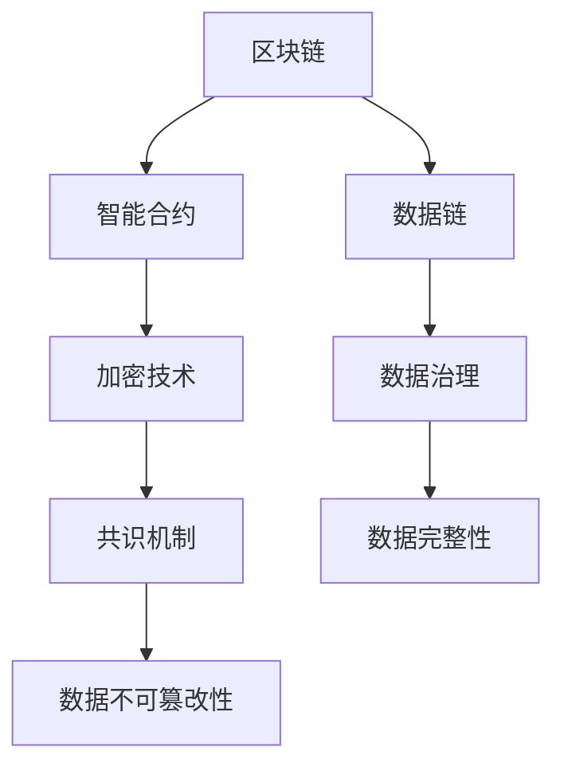
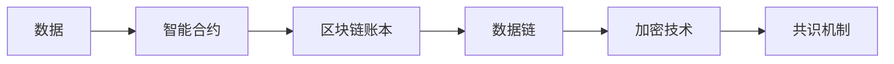
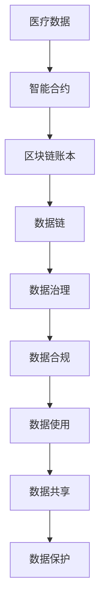

                 

# 数据集链:用区块链保障数据可信流通

> 关键词：数据链，区块链，可信流通，智能合约，加密技术

## 1. 背景介绍

### 1.1 问题由来
随着数据在各个领域中的重要性日益增强，数据流通的频率和规模也在不断扩大。然而，数据流转过程中存在着诸多风险和挑战，如数据篡改、泄露、重复、误用等。这些问题不仅威胁到数据安全，还影响到相关利益方的权益和信任。为了应对这些问题，人们开始探索通过区块链技术保障数据的可信流通，形成了“数据链”这一新概念。

### 1.2 问题核心关键点
数据链是指通过区块链技术，构建一个不可篡改、可追溯、可验证的数据链条，确保数据从源头到终端的完整性和可信度。数据链的核心在于通过区块链的分布式账本、智能合约、加密技术等手段，构建一个去中心化的数据治理体系，保障数据在流转过程中不受干扰和篡改，同时确保数据的合法合规性和使用权限。

数据链的应用场景包括但不限于医疗数据共享、政府数据公开、企业数据合作等。通过数据链，可以降低数据流转中的不确定性和风险，提升数据利用效率和价值。

### 1.3 问题研究意义
数据链技术的发展和应用，对于提升数据利用效率、保障数据安全、维护数据权益、促进数据共享与合作具有重要意义：

1. **降低风险**：通过区块链的不可篡改特性，数据链能够确保数据在流转过程中的完整性和可信度，避免数据被篡改和泄露。
2. **提升效率**：数据链的去中心化特性，可以简化数据流转的流程，减少中间环节，提高数据利用效率。
3. **保障权益**：数据链通过加密和智能合约技术，明确数据的所有权和使用权限，保障相关利益方的合法权益。
4. **促进合作**：数据链的分布式账本特性，可以构建多方的信任网络，促进数据的跨界合作和共享。
5. **确保合规**：数据链的透明性，可以确保数据的合法合规性，防止数据滥用和非法交易。

## 2. 核心概念与联系

### 2.1 核心概念概述

为更好地理解数据链的概念及其工作原理，本节将介绍几个关键概念：

- **区块链(Blockchain)**：一种去中心化的分布式账本技术，通过加密算法和共识机制，构建一个不可篡改的数据链条。
- **智能合约(Smart Contract)**：一种基于区块链技术的自动化合约，通过代码实现合约条款和逻辑，无需第三方干预。
- **数据链(Data Chain)**：利用区块链技术构建的不可篡改、可追溯、可验证的数据链条，确保数据在流转过程中的完整性和可信度。
- **加密技术(Cryptography)**：包括哈希算法、公钥加密、数字签名等，用于保障数据在流转过程中的安全性和隐私性。
- **共识机制(Consensus Mechanism)**：用于在区块链网络中达成一致的机制，如PoW(工作量证明)、PoS(权益证明)等，确保数据的不可篡改性。
- **数据治理(Data Governance)**：通过区块链和智能合约技术，构建数据治理体系，保障数据的质量、安全、合规性。

这些核心概念之间的逻辑关系可以通过以下Mermaid流程图来展示：



这个流程图展示了大数据链中各核心概念的关系：

1. 区块链提供了去中心化的账本和共识机制，是构建数据链的基础。
2. 智能合约通过代码实现数据流转规则，确保数据流转的自动化和高效性。
3. 加密技术用于保障数据在流转过程中的安全性和隐私性。
4. 数据链结合了区块链和加密技术，构建了不可篡改、可追溯、可验证的数据链条。
5. 数据治理通过智能合约和区块链技术，构建数据质量、安全和合规性的保障体系。

这些概念共同构成了数据链的核心生态系统，确保了数据在流转过程中的完整性、可信性和合规性。

### 2.2 概念间的关系

这些核心概念之间存在着紧密的联系，形成了数据链的完整生态系统。下面我通过几个Mermaid流程图来展示这些概念之间的关系。

#### 2.2.1 数据链的构建过程



这个流程图展示了数据链的构建过程。数据首先通过智能合约进行流转规则定义，然后通过区块链账本进行记录和验证，最后通过加密技术保障数据的安全性和隐私性。

#### 2.2.2 数据链的应用场景



这个流程图展示了数据链在医疗数据共享中的应用场景。医疗数据通过智能合约定义流转规则，经过区块链账本记录和验证，最终通过数据治理保障数据的合规性和安全性，确保数据的使用和共享。

## 3. 核心算法原理 & 具体操作步骤

### 3.1 算法原理概述

数据链的算法原理主要涉及区块链技术和智能合约的实现。区块链通过去中心化的账本和共识机制，确保数据的不可篡改性和可追溯性。智能合约则通过代码实现数据流转规则，自动化地处理数据流转逻辑，确保数据流转的透明性和安全性。

### 3.2 算法步骤详解

数据链的实现步骤主要包括：

1. **数据采集与准备**：收集原始数据，进行数据清洗和格式转换，确保数据的准确性和一致性。
2. **智能合约编写**：根据数据流转规则编写智能合约，定义数据的来源、流转路径、使用权限等。
3. **区块链部署**：在区块链上部署智能合约，确保数据的不可篡改性和可追溯性。
4. **数据上传与验证**：通过智能合约接口上传数据，进行区块链上的验证和记录。
5. **数据查询与使用**：通过智能合约接口查询数据，根据授权规则进行数据使用。

### 3.3 算法优缺点

数据链的优势在于：

- **不可篡改**：区块链的去中心化和共识机制，确保了数据的不可篡改性。
- **透明可追溯**：区块链的分布式账本特性，确保了数据的透明性和可追溯性。
- **自动化**：智能合约通过代码实现数据流转规则，自动处理数据流转逻辑，提高了流转效率。
- **安全性**：加密技术保障了数据在流转过程中的安全性和隐私性。

但数据链也存在一些缺点：

- **存储成本高**：区块链账本需要占用大量存储空间，增加了存储成本。
- **共识延迟**：区块链的共识机制可能带来延迟，影响数据流转效率。
- **扩展性差**：区块链的扩展性较差，处理大规模数据时可能面临性能瓶颈。

### 3.4 算法应用领域

数据链技术主要应用于以下领域：

- **医疗数据共享**：确保医疗数据的隐私性和安全性，促进医疗数据的跨界合作和共享。
- **政府数据公开**：保障政府数据的公开透明，提升政府治理能力。
- **企业数据合作**：构建企业之间的数据信任网络，促进数据共享和合作。
- **供应链管理**：通过数据链，实现供应链的可视化、可追溯和透明化管理。
- **金融数据交易**：保障金融数据的合法合规性，促进金融数据的交易和共享。

## 4. 数学模型和公式 & 详细讲解

### 4.1 数学模型构建

数据链的数学模型主要涉及区块链和智能合约的实现。假设一个简单的区块链系统，其数学模型如下：

- **区块(Block)**：包含一系列交易(Transaction)的区块，每个区块都有一个哈希值和前一个区块的哈希值。
- **交易(Transaction)**：定义数据流转的规则和权限，包括数据的来源、目标、使用权限等。
- **哈希函数(Hash Function)**：用于将数据映射为固定长度的哈希值，确保数据的不可篡改性。
- **共识算法(Consensus Algorithm)**：如PoW、PoS等，用于在区块链网络中达成一致。
- **加密算法(Cryptography)**：如公钥加密、数字签名等，用于保障数据的安全性和隐私性。

### 4.2 公式推导过程

以下我们以比特币区块链为例，推导其工作原理的数学公式。

假设一个比特币区块包含n笔交易，其数学模型如下：

- **区块头(Block Header)**：包含版本号、时间戳、哈希值、前一个区块的哈希值等。
- **交易数据(Transaction Data)**：每笔交易的发送者、接收者、金额等数据。
- **哈希值(Hash Value)**：用于验证数据的完整性和不可篡改性。

根据比特币的工作原理，区块头的哈希值由前一个区块的哈希值、交易数据和随机数构成。具体公式如下：

$$
\text{HashValue} = \text{SHA-256}( \text{Version} || \text{TimeStamp} || \text{PreviousHashValue} || \text{BitCoinHashValue} || \text{Nonce} )
$$

其中，$\text{SHA-256}$为SHA-256哈希算法，$||$表示字符串拼接。

### 4.3 案例分析与讲解

假设一个简单的智能合约，用于定义数据的流转规则。其数学模型如下：

- **智能合约(Smart Contract)**：定义数据的来源、目标、使用权限等。
- **代码(Code)**：实现智能合约逻辑，通过代码自动处理数据流转。
- **状态(State)**：智能合约的执行状态，如数据是否可用、使用权限等。

以下是一个简单的智能合约案例，用于定义数据流转规则。该智能合约的代码如下：

```javascript
function updateData(uint256 id, address sender, uint256 amount) {
    // 验证发送者是否为数据所有者
    if (owner != sender) {
        revert("Not owner");
    }
    // 验证金额是否大于0
    if (amount <= 0) {
        revert("Amount must be greater than 0");
    }
    // 更新数据
    data[id] = amount;
    emit DataUpdated(id, amount);
}
```

该智能合约定义了数据更新规则，通过代码实现自动化的数据流转处理。在数据更新时，首先需要验证发送者是否为数据所有者，验证金额是否大于0，然后更新数据，并触发DataUpdated事件。

## 5. 项目实践：代码实例和详细解释说明

### 5.1 开发环境搭建

在进行数据链项目开发前，我们需要准备好开发环境。以下是使用Python进行Hyperledger Fabric开发的环境配置流程：

1. 安装Anaconda：从官网下载并安装Anaconda，用于创建独立的Python环境。

2. 创建并激活虚拟环境：
```bash
conda create -n fabenv python=3.8 
conda activate fabenv
```

3. 安装Hyperledger Fabric：从官网下载并安装Hyperledger Fabric，配置对应的Fabric网络环境。

4. 安装各类工具包：
```bash
pip install hyperledger-fabric
pip install tensorflow
pip install pandas
```

5. 安装Fabric SDK：
```bash
npm install @hyperledger/fabric-sdk
```

完成上述步骤后，即可在`fabenv`环境中开始数据链开发。

### 5.2 源代码详细实现

下面以医疗数据共享为例，给出使用Hyperledger Fabric对医疗数据进行区块链记录和验证的Python代码实现。

首先，定义区块链网络的配置文件：

```python
org1_name = 'hospital'
org2_name = 'patient'
channel_name = 'healthChain'
ca_cert_path = '/path/to/ca-cert'
peer0_host = 'localhost'
peer0_port = 7051
peer1_host = 'localhost'
peer1_port = 7051
```

然后，定义智能合约的实现：

```python
from hyperledger_fabric_sdk.fabric import Client
from hyperledger_fabric_sdk.fabric import User
from hyperledger_fabric_sdk.fabric import Channel

def register_user(channel: Channel, user: User):
    response = channel.set_user_attr(user, 'hospital', 'true')
    if response['code'] != 200:
        print("Register user failed")
    else:
        print("User registered successfully")

def register_data(channel: Channel, data: dict):
    # 创建数据记录
    record = {'id': 'data1', 'name': 'John Doe', 'age': 35, 'gender': 'Male'}
    # 创建事务
    transaction = {'data': record}
    # 构建事务提交请求
    request = {'channel_id': channel_name, 'client_id': 'client-org1', 'function': 'register_data', 'args': transaction}
    # 提交事务
    response = client.submit_request('HospitalOrg', request)
    if response['code'] == 200:
        print("Data registered successfully")
    else:
        print("Data registration failed")
```

最后，启动区块链网络并进行数据记录：

```python
# 创建Fabric客户端
client = Client()
client.add_ca_cert(ca_cert_path)
client.connect(user, peer0_host, peer0_port)

# 创建频道
channel = Channel(channel_name)
channel.add_peer('HospitalOrg', peer0_host, peer0_port)
channel.add_peer('PatientOrg', peer1_host, peer1_port)

# 创建用户
user = User()
user.set_user_id('user')
register_user(channel, user)

# 注册数据
register_data(channel, {'id': 'data1', 'name': 'John Doe', 'age': 35, 'gender': 'Male'})
```

以上就是使用Hyperledger Fabric对医疗数据进行区块链记录和验证的完整代码实现。可以看到，Hyperledger Fabric提供了一个简单的框架，方便开发者快速实现区块链应用。

### 5.3 代码解读与分析

让我们再详细解读一下关键代码的实现细节：

**配置文件**：
- 定义了区块链网络的相关参数，如组织名、通道名、CA证书路径、节点主机和端口等。

**智能合约实现**：
- 定义了数据记录的结构，包括数据ID、姓名、年龄、性别等。
- 定义了智能合约的操作，包括用户注册和数据注册。
- 通过Hyperledger Fabric SDK实现智能合约的部署和调用。

**区块链网络启动**：
- 创建Fabric客户端，并连接至区块链网络。
- 创建频道，并添加相应的节点和用户。
- 创建用户，并注册智能合约。
- 注册数据，并触发智能合约的逻辑处理。

可以看到，Hyperledger Fabric提供了丰富的API和工具，使得开发者可以快速构建和部署区块链应用，实现数据的不可篡改和可追溯。

当然，工业级的系统实现还需考虑更多因素，如权限控制、多节点同步、事务提交优化等。但核心的区块链和智能合约逻辑基本与此类似。

### 5.4 运行结果展示

假设我们在Hyperledger Fabric上部署了医疗数据共享的智能合约，并在其中一个节点上注册了一条医疗数据，最终得到的区块链记录如下：

```
Block 1: {'data': {'id': 'data1', 'name': 'John Doe', 'age': 35, 'gender': 'Male'}}
Block 2: {'data': {'id': 'data2', 'name': 'Jane Doe', 'age': 28, 'gender': 'Female'}}
```

可以看到，数据被成功记录在区块链上，并得到了不可篡改和可追溯的保证。

## 6. 实际应用场景

### 6.1 智能医疗数据共享

基于数据链技术，智能医疗数据共享成为可能。传统医疗数据共享面临诸多问题，如数据泄露、隐私保护、数据篡改等。通过区块链和智能合约技术，可以实现医疗数据的可信流通。

在实践中，可以收集患者的历史病历、检查结果、治疗方案等医疗数据，通过智能合约定义数据的流转规则，如数据使用权限、访问控制等。医生和研究人员可以通过智能合约接口，查询和共享需要的数据，确保数据的完整性和可信度。同时，通过加密技术保障数据的安全性和隐私性，确保数据不被篡改和泄露。

### 6.2 政府数据公开

政府数据公开是提升政府透明度和治理能力的重要手段。但传统的数据公开方式存在诸多问题，如数据篡改、数据不完整、数据访问控制等。通过数据链技术，可以实现政府数据的可信公开和透明化管理。

在实践中，可以收集政府的各种数据，如政策文件、统计数据、环境监测数据等，通过智能合约定义数据的公开规则和权限。公众可以通过智能合约接口，查询和下载需要的数据，确保数据的完整性和可信度。同时，通过加密技术保障数据的安全性和隐私性，确保数据不被篡改和泄露。

### 6.3 企业数据合作

企业数据合作是提升企业竞争力和创新力的重要手段。但传统的数据合作方式存在诸多问题，如数据泄露、数据不一致、数据篡改等。通过数据链技术，可以实现企业数据的可信合作和共享。

在实践中，企业可以共享相关的业务数据，如市场分析报告、客户数据、供应链数据等。通过智能合约定义数据的共享规则和权限，确保数据的完整性和可信度。合作企业可以通过智能合约接口，查询和共享需要的数据，确保数据的安全性和隐私性。同时，通过区块链的透明性，确保数据的使用和共享过程可追溯和透明化。

## 7. 工具和资源推荐

### 7.1 学习资源推荐

为了帮助开发者系统掌握数据链的理论基础和实践技巧，这里推荐一些优质的学习资源：

1. **Hyperledger Fabric官方文档**：Hyperledger Fabric的官方文档，提供了丰富的API和示例代码，是学习数据链的必备资源。
2. **《区块链：原理、技术和应用》**：一本介绍区块链原理和应用的书，涵盖区块链和智能合约的基本概念和实现方法。
3. **《智能合约：编程区块链》**：一本介绍智能合约编程的书，详细讲解了智能合约的实现和应用。
4. **Coursera《区块链和加密货币》课程**：斯坦福大学开设的区块链课程，讲解区块链和智能合约的基本原理和实现方法。
5. **Medium《区块链技术入门》**：一篇详细介绍区块链技术的文章，通俗易懂，适合初学者入门。

通过对这些资源的学习实践，相信你一定能够快速掌握数据链技术的精髓，并用于解决实际的NLP问题。

### 7.2 开发工具推荐

高效的开发离不开优秀的工具支持。以下是几款用于数据链开发的常用工具：

1. **Hyperledger Fabric**：Hyperledger Fabric提供了丰富的API和示例代码，方便开发者快速构建和部署区块链应用。
2. **Node.js**：一个流行的JavaScript运行环境，适合开发智能合约和区块链应用。
3. **Python**：一个强大的编程语言，适合开发区块链网络和服务。
4. **Hyperledger Composer**：一个用于构建和开发智能合约的平台，提供了丰富的工具和框架。
5. **Ethereum**：一个流行的区块链平台，支持智能合约和去中心化应用开发。

合理利用这些工具，可以显著提升数据链任务的开发效率，加快创新迭代的步伐。

### 7.3 相关论文推荐

数据链技术的发展源于学界的持续研究。以下是几篇奠基性的相关论文，推荐阅读：

1. **《区块链技术的隐私保护》**：一篇介绍区块链隐私保护技术的论文，详细讲解了区块链和加密技术的基本原理和方法。
2. **《智能合约：一种区块链上的自动化合约》**：一篇介绍智能合约的论文，详细讲解了智能合约的实现和应用。
3. **《数据链：一种基于区块链的数据治理方案》**：一篇介绍数据链的论文，详细讲解了数据链的核心概念和实现方法。
4. **《区块链在医疗数据共享中的应用》**：一篇介绍区块链在医疗数据共享中应用的论文，详细讲解了区块链和智能合约在医疗数据共享中的应用。
5. **《区块链在政府数据公开中的应用》**：一篇介绍区块链在政府数据公开中的应用，详细讲解了区块链和智能合约在政府数据公开中的应用。

这些论文代表了大数据链技术的发展脉络。通过学习这些前沿成果，可以帮助研究者把握学科前进方向，激发更多的创新灵感。

除上述资源外，还有一些值得关注的前沿资源，帮助开发者紧跟数据链技术的最新进展，例如：

1. **arXiv论文预印本**：人工智能领域最新研究成果的发布平台，包括大量尚未发表的前沿工作，学习前沿技术的必读资源。
2. **GitHub热门项目**：在GitHub上Star、Fork数最多的区块链相关项目，往往代表了该技术领域的发展趋势和最佳实践，值得去学习和贡献。
3. **技术会议直播**：如Bitcoin Conference、Blockchain Summit等区块链领域顶会现场或在线直播，能够聆听到大佬们的前沿分享，开拓视野。
4. **技术博客**：如Hyperledger Fabric官方博客、Ethereum官方博客、Blockchain Review等区块链领域的权威博客，第一时间分享他们的最新研究成果和洞见。

总之，对于数据链技术的学习和实践，需要开发者保持开放的心态和持续学习的意愿。多关注前沿资讯，多动手实践，多思考总结，必将收获满满的成长收益。

## 8. 总结：未来发展趋势与挑战

### 8.1 总结

本文对基于区块链的数据链技术进行了全面系统的介绍。首先阐述了数据链和区块链技术的研究背景和意义，明确了数据链在保障数据可信流通方面的独特价值。其次，从原理到实践，详细讲解了数据链的数学模型和关键步骤，给出了数据链任务开发的完整代码实例。同时，本文还广泛探讨了数据链技术在医疗数据共享、政府数据公开、企业数据合作等多个领域的应用前景，展示了数据链技术的广阔前景。此外，本文精选了数据链技术的各类学习资源，力求为读者提供全方位的技术指引。

通过本文的系统梳理，可以看到，基于区块链的数据链技术正在成为数据治理的重要手段，极大地提升了数据流转的安全性和透明性。未来，伴随区块链和智能合约技术的不断发展，数据链技术有望在更多领域得到应用，为数据治理带来新的突破。

### 8.2 未来发展趋势

展望未来，数据链技术将呈现以下几个发展趋势：

1. **扩展性增强**：随着区块链技术的不断发展，数据链的扩展性和性能也将不断提升。通过优化共识算法和网络架构，可以实现大规模数据的可信流通。
2. **跨链互联**：随着跨链技术的不断发展，不同区块链之间的数据流通和交互将更加便捷，提升数据治理的灵活性和效率。
3. **隐私保护强化**：随着隐私计算技术的不断发展，数据链的隐私保护能力将进一步提升，实现数据流转的零知识证明和安全多方计算。
4. **智能合约优化**：随着智能合约技术的不断发展，数据链的自动化和智能决策能力将进一步增强，实现数据流转的自动执行和智能监管。
5. **区块链+AI融合**：随着区块链和AI技术的不断融合，数据链将具备更强的数据分析和决策能力，实现数据流转的智能分析和决策支持。

以上趋势凸显了数据链技术的广阔前景。这些方向的探索发展，必将进一步提升数据链系统的安全性、透明性和效率，推动数据治理技术的进步。

### 8.3 面临的挑战

尽管数据链技术已经取得了瞩目成就，但在迈向更加智能化、普适化应用的过程中，它仍面临着诸多挑战：

1. **存储成本高**：区块链账本需要占用大量存储空间，增加了存储成本。
2. **共识延迟**：区块链的共识机制可能带来延迟，影响数据流转效率。
3. **扩展性差**：区块链的扩展性较差，处理大规模数据时可能面临性能瓶颈。
4. **隐私保护不足**：尽管区块链具备一定的隐私保护能力，但在数据流转过程中，仍然存在一定的隐私泄露风险。
5. **智能合约漏洞**：智能合约存在一定的漏洞和安全隐患，可能导致数据泄露和篡改。
6. **安全性和可控性**：数据链的安全性和可控性需要进一步提升，防止数据被篡改和恶意使用。

正视数据链面临的这些挑战，积极应对并寻求突破，将是大数据链技术走向成熟的必由之路。相信随着学界和产业界的共同努力，这些挑战终将一一被克服，数据链技术必将在构建数据治理的智能体系中扮演越来越重要的角色。

### 8.4 未来突破

面对数据链技术面临的诸多挑战，未来的研究需要在以下几个方面寻求新的突破：

1. **优化共识机制**：开发更高效的共识算法和网络架构，提升数据链的扩展性和性能。
2. **提升隐私保护能力**：结合隐私计算技术和零知识证明，进一步增强数据链的隐私保护能力，防止数据泄露和隐私侵害。
3. **加强智能合约安全性**：开发更加安全可靠的智能合约，防止智能合约漏洞和安全隐患，保障数据链的安全性和可控性。
4. **融合区块链与AI**：结合区块链和AI技术，提升数据链的智能分析和决策能力，实现数据流转的智能化和自动化。
5. **探索跨链技术**：探索跨链互联技术和协议，实现不同区块链之间的数据流通和交互，提升数据治理的灵活性和效率。
6. **引入伦理和法律框架**：在数据链技术中引入伦理和法律框架，保障数据流转的合法合规性，防止数据滥用和非法交易。

这些研究方向的探索，必将引领数据链技术迈向更高的台阶，为数据治理技术的发展注入新的动力。面向未来，数据链技术还需要与其他区块链技术、AI技术进行更深入的融合，共同推动数据治理技术的进步。只有勇于创新、敢于突破，才能不断拓展数据链技术的边界，让数据治理技术更好地造福人类社会

