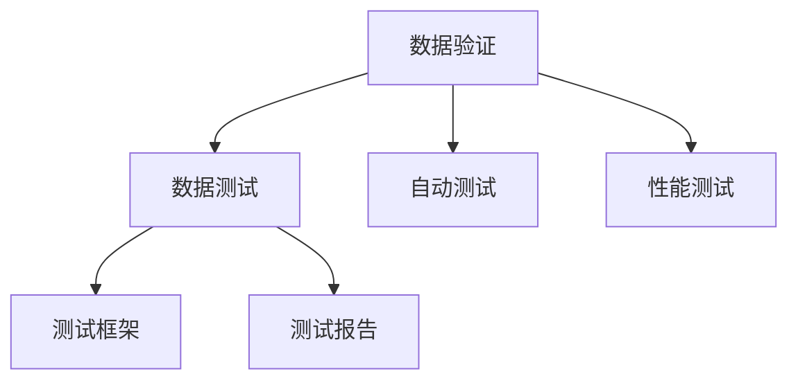
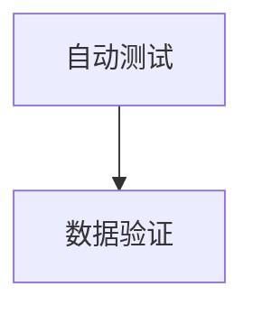
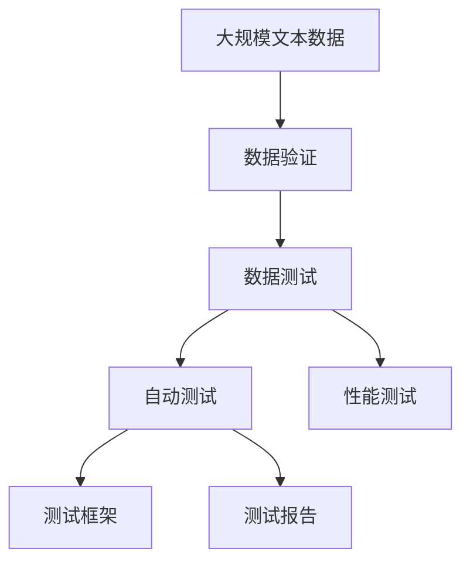

                 

# 数据验证与数据测试原理与代码实战案例讲解

> 关键词：数据验证, 数据测试, 自动测试, 自动化测试, 性能测试, 数据测试工具, 测试框架, 测试报告

## 1. 背景介绍

在软件开发的各个阶段中，数据验证与数据测试都是至关重要的环节。它们不仅能够确保软件系统处理的数据准确无误，还能够提升系统的稳定性和性能。特别是在大数据、人工智能等依赖大量数据的领域，数据验证与数据测试的作用尤为显著。本文将深入探讨数据验证与数据测试的原理，并通过具体案例讲解其实现方法。

### 1.1 问题由来

在软件开发的各个阶段中，数据验证与数据测试都是至关重要的环节。它们不仅能够确保软件系统处理的数据准确无误，还能够提升系统的稳定性和性能。特别是在大数据、人工智能等依赖大量数据的领域，数据验证与数据测试的作用尤为显著。例如，在机器学习模型的训练中，数据验证与数据测试能够帮助确保训练数据的质量，从而提升模型的性能。

然而，由于数据验证与数据测试涉及到的技术点较多，且需要深入理解数据验证与数据测试的原理与实现方法，因此在实际应用中，很多开发者对这些技术点并不是非常熟悉。因此，本文将深入探讨数据验证与数据测试的原理，并通过具体案例讲解其实现方法。

## 2. 核心概念与联系

### 2.1 核心概念概述

为了更好地理解数据验证与数据测试，我们首先介绍几个关键概念：

- **数据验证**：指通过一系列规则和策略对数据进行检查，确保数据符合预期的格式、范围、逻辑等要求，从而保证数据的正确性和一致性。
- **数据测试**：指在软件系统开发、测试和部署过程中，对数据流进行测试，确保数据能够在系统中正确传输、处理和存储，从而提升系统的稳定性和性能。
- **自动测试**：指使用自动化工具和框架对软件系统进行测试，减少测试工作量，提高测试效率和质量。
- **性能测试**：指在软件系统的性能评估中，通过模拟真实使用场景，对系统的响应时间、并发能力等性能指标进行测试，从而提升系统的整体性能。
- **测试框架**：指用于自动化测试的工具和库，能够帮助开发者编写和运行测试用例，提高测试效率和质量。
- **测试报告**：指测试过程中的结果记录和分析报告，能够帮助开发者快速定位问题，优化测试过程和软件系统。

这些核心概念之间的逻辑关系可以通过以下Mermaid流程图来展示：



这个流程图展示了大数据验证与数据测试的主要流程：

1. 数据验证通过一系列规则和策略对数据进行检查。
2. 数据测试在软件系统开发、测试和部署过程中，对数据流进行测试。
3. 自动测试使用自动化工具和框架对软件系统进行测试。
4. 性能测试在软件系统的性能评估中，对系统的响应时间、并发能力等性能指标进行测试。
5. 测试框架用于编写和运行测试用例。
6. 测试报告记录和分析测试过程中的结果。

这些概念共同构成了数据验证与数据测试的完整生态系统，使得数据在软件系统中能够正确、高效、安全地传输和处理。通过理解这些核心概念，我们可以更好地把握数据验证与数据测试的工作原理和优化方向。

### 2.2 概念间的关系

这些核心概念之间存在着紧密的联系，形成了数据验证与数据测试的完整生态系统。下面我们通过几个Mermaid流程图来展示这些概念之间的关系。

#### 2.2.1 数据验证与数据测试的关系


这个流程图展示了数据验证与数据测试之间的关系：

- 数据验证通过一系列规则和策略对数据进行检查，确保数据符合预期的格式、范围、逻辑等要求。
- 数据测试在软件系统开发、测试和部署过程中，对数据流进行测试，确保数据能够在系统中正确传输、处理和存储。

#### 2.2.2 自动测试与数据验证的关系



这个流程图展示了自动测试与数据验证之间的关系：

- 自动测试使用自动化工具和框架对软件系统进行测试，包括数据验证在内。
- 数据验证通过一系列规则和策略对数据进行检查，确保数据符合预期的格式、范围、逻辑等要求。

#### 2.2.3 性能测试与数据测试的关系


这个流程图展示了性能测试与数据测试之间的关系：

- 性能测试在软件系统的性能评估中，对系统的响应时间、并发能力等性能指标进行测试。
- 数据测试在软件系统开发、测试和部署过程中，对数据流进行测试，确保数据能够在系统中正确传输、处理和存储。

#### 2.2.4 测试框架与数据验证的关系


这个流程图展示了测试框架与数据验证之间的关系：

- 测试框架用于编写和运行测试用例，包括数据验证在内。
- 数据验证通过一系列规则和策略对数据进行检查，确保数据符合预期的格式、范围、逻辑等要求。

### 2.3 核心概念的整体架构

最后，我们用一个综合的流程图来展示这些核心概念在大数据验证与数据测试中的整体架构：



这个综合流程图展示了从数据验证到自动测试、性能测试的完整过程：

1. 大规模文本数据通过数据验证，确保数据符合预期的格式、范围、逻辑等要求。
2. 数据验证后的数据通过数据测试，确保数据能够在系统中正确传输、处理和存储。
3. 数据测试过程中，使用自动测试工具和框架，提升测试效率和质量。
4. 自动测试完成后，对系统的响应时间、并发能力等性能指标进行性能测试，提升系统的整体性能。
5. 测试框架用于编写和运行测试用例，记录和分析测试过程中的结果，生成测试报告。

通过这些流程图，我们可以更清晰地理解大数据验证与数据测试过程中各个概念的关系和作用，为后续深入讨论具体的验证与测试方法奠定基础。

## 3. 核心算法原理 & 具体操作步骤
### 3.1 算法原理概述

数据验证与数据测试的算法原理主要包括以下几个方面：

- **数据验证算法**：通过一系列规则和策略对数据进行检查，确保数据符合预期的格式、范围、逻辑等要求。常用的数据验证算法包括正则表达式、范围检查、类型检查等。
- **数据测试算法**：在软件系统开发、测试和部署过程中，对数据流进行测试，确保数据能够在系统中正确传输、处理和存储。常用的数据测试算法包括边界值测试、等价类测试、覆盖测试等。
- **自动测试算法**：使用自动化工具和框架对软件系统进行测试，包括数据验证在内。常用的自动测试算法包括单元测试、集成测试、系统测试等。
- **性能测试算法**：在软件系统的性能评估中，对系统的响应时间、并发能力等性能指标进行测试，常用的性能测试算法包括负载测试、压力测试、流量测试等。

这些算法原理的实现通常需要借助各种测试框架和工具，如JUnit、TestNG、Selenium、LoadRunner等。通过合理选择和组合这些算法原理和工具，可以实现高效、准确的数据验证与数据测试。

### 3.2 算法步骤详解

数据验证与数据测试的具体步骤包括以下几个方面：

1. **需求分析**：明确数据验证与数据测试的需求和目标，确定需要检查的数据类型和范围。
2. **规则设计**：根据需求分析结果，设计数据验证与数据测试的规则和策略，确保数据符合预期的格式、范围、逻辑等要求。
3. **数据采集**：采集需要验证与测试的数据，包括原始数据和处理后的数据。
4. **验证与测试**：使用数据验证与数据测试的算法原理和工具，对数据进行检查和测试，确保数据在系统中正确传输、处理和存储。
5. **结果分析**：分析验证与测试的结果，生成测试报告，记录和分析测试过程中的问题，提出改进建议。

这些步骤通常需要借助各种测试框架和工具，如JUnit、TestNG、Selenium、LoadRunner等。通过合理选择和组合这些工具和步骤，可以实现高效、准确的数据验证与数据测试。

### 3.3 算法优缺点

数据验证与数据测试算法具有以下优点：

- **高效性**：使用自动化工具和框架，可以显著提高数据验证与数据测试的效率，减少人工操作的工作量。
- **准确性**：通过一系列规则和策略对数据进行检查，确保数据符合预期的格式、范围、逻辑等要求，从而提高数据验证与数据测试的准确性。
- **可扩展性**：数据验证与数据测试算法可以根据需求进行灵活调整和扩展，适用于各种不同的场景和需求。

同时，数据验证与数据测试算法也存在以下缺点：

- **复杂性**：数据验证与数据测试算法的设计和实现较为复杂，需要深入理解数据验证与数据测试的原理和实现方法。
- **依赖性**：数据验证与数据测试算法通常需要依赖各种测试框架和工具，在使用和维护过程中需要一定的技术基础。
- **局限性**：数据验证与数据测试算法只能验证和测试数据的格式、范围、逻辑等要求，无法覆盖数据质量的全部方面。

### 3.4 算法应用领域

数据验证与数据测试算法在多个领域中得到了广泛应用，以下是几个典型的应用场景：

- **金融领域**：在金融领域的交易系统、风险管理系统等场景中，数据验证与数据测试能够确保数据的准确性和一致性，从而提升系统的稳定性和性能。
- **医疗领域**：在医疗领域的电子病历系统、医疗影像系统等场景中，数据验证与数据测试能够确保数据的完整性和一致性，从而提升系统的可靠性和安全性。
- **电商领域**：在电商领域的订单系统、库存管理系统等场景中，数据验证与数据测试能够确保数据的准确性和一致性，从而提升系统的稳定性和性能。
- **交通领域**：在交通领域的交通管理系统、智能交通系统等场景中，数据验证与数据测试能够确保数据的准确性和一致性，从而提升系统的可靠性和安全性。

## 4. 数学模型和公式 & 详细讲解 & 举例说明
### 4.1 数学模型构建

在大数据验证与数据测试中，常用的数学模型包括正则表达式、范围检查、类型检查等。下面我们以正则表达式为例，介绍其数学模型的构建和应用。

**正则表达式模型**：

假设需要验证的字符串为 $S$，正则表达式为 $R$，则正则表达式模型的数学模型可以表示为：

$$
\text{验证结果} = \begin{cases}
\text{通过验证} & \text{如果 } S \in R \\
\text{不通过验证} & \text{如果 } S \notin R
\end{cases}
$$

其中 $S$ 为需要验证的字符串，$R$ 为正则表达式，$\in$ 表示包含关系，$\notin$ 表示不包含关系。

### 4.2 公式推导过程

以正则表达式验证为例，公式推导过程如下：

1. **定义正则表达式集合**：
   - 设正则表达式集合为 $R$，其中 $R = \{S_1, S_2, \ldots, S_n\}$，$S_i$ 为正则表达式的一个子表达式。
   - 正则表达式集合 $R$ 的并集表示为 $\cup R = \{S_1 \cup S_2 \cup \ldots \cup S_n\}$。

2. **定义验证集合**：
   - 设需要验证的字符串集合为 $S$，其中 $S = \{s_1, s_2, \ldots, s_m\}$，$s_i$ 为需要验证的一个字符串。
   - 验证集合 $S$ 的交集表示为 $\cap S = \{s_1 \cap s_2 \cap \ldots \cap s_m\}$。

3. **定义验证结果**：
   - 设验证结果集合为 $T$，其中 $T = \{t_1, t_2, \ldots, t_k\}$，$t_i$ 为验证结果的一个子集。
   - 验证结果集合 $T$ 的并集表示为 $\cup T = \{t_1 \cup t_2 \cup \ldots \cup t_k\}$。

根据上述定义，正则表达式验证的数学模型可以表示为：

$$
\text{验证结果} = \begin{cases}
\text{通过验证} & \text{如果 } S \in R \\
\text{不通过验证} & \text{如果 } S \notin R
\end{cases}
$$

### 4.3 案例分析与讲解

下面以电子邮件地址验证为例，介绍正则表达式验证的实现方法。

假设需要验证的电子邮件地址为 $s = "example@example.com"$，正则表达式为 $R = "^[a-zA-Z0-9._%+-]+@[a-zA-Z0-9.-]+\.[a-zA-Z]{2,}$。

根据正则表达式模型，验证过程如下：

1. **正则表达式匹配**：使用正则表达式匹配器，将电子邮件地址 $s$ 与正则表达式 $R$ 进行匹配。

2. **验证结果判断**：根据匹配结果，判断电子邮件地址是否符合正则表达式的格式要求。

3. **输出验证结果**：如果匹配成功，输出验证通过；如果匹配失败，输出验证不通过。

通过正则表达式验证，可以确保电子邮件地址的格式正确，从而提升系统的可靠性和安全性。

## 5. 项目实践：代码实例和详细解释说明
### 5.1 开发环境搭建

在进行数据验证与数据测试实践前，我们需要准备好开发环境。以下是使用Python进行JUnit测试的环境配置流程：

1. 安装Java开发工具包（JDK）：从官网下载并安装JDK，用于安装JUnit和其他Java库。

2. 安装JUnit：在命令行中运行以下命令，安装JUnit 5：

   ```bash
   mvn install:install-file -Dfile=JUnit\_5\_8.0.0\_jre8.jar -DgroupId=com.sun.org.apacheJUnit -DartifactId=junit-jar -Dversion=5.8.0 -Dpackaging=jar
   ```

3. 创建并激活虚拟环境：

   ```bash
   conda create -n junit-env python=3.8
   conda activate junit-env
   ```

4. 安装JUnit库：

   ```bash
   pip install junit-5
   ```

5. 安装测试框架和工具：

   ```bash
   pip install mock patch pytest
   ```

完成上述步骤后，即可在`junit-env`环境中开始数据验证与数据测试实践。

### 5.2 源代码详细实现

下面我们以电子邮件地址验证为例，给出使用JUnit进行电子邮件地址验证的代码实现。

首先，定义电子邮件地址验证的测试用例：

```java
import org.junit.jupiter.api.Test;
import static org.junit.jupiter.api.Assertions.assertEquals;

public class EmailValidatorTest {
    @Test
    public void testValidEmail() {
        EmailValidator validator = new EmailValidator();
        String email = "example@example.com";
        boolean isValid = validator.validate(email);
        assertEquals(true, isValid);
    }

    @Test
    public void testInvalidEmail() {
        EmailValidator validator = new EmailValidator();
        String email = "example@example";
        boolean isValid = validator.validate(email);
        assertEquals(false, isValid);
    }
}
```

然后，定义电子邮件地址验证的实现类：

```java
import java.util.regex.Matcher;
import java.util.regex.Pattern;

public class EmailValidator {
    private Pattern pattern;

    public EmailValidator() {
        pattern = Pattern.compile("^[a-zA-Z0-9._%+-]+@[a-zA-Z0-9.-]+\\.[a-zA-Z]{2,}$");
    }

    public boolean validate(String email) {
        Matcher matcher = pattern.matcher(email);
        return matcher.matches();
    }
}
```

在上述代码中，`EmailValidator`类实现了电子邮件地址验证的逻辑。它使用正则表达式进行匹配，如果匹配成功，则返回true；否则返回false。

最后，使用JUnit运行测试用例：

```bash
mvn test
```

JUnit会自动运行所有的测试用例，并输出测试结果。如果测试用例通过，输出结果为：

```
[INFO] -------------------------------------------------------
[INFO]  Welcome to JUnit 5.8.0.2020
[INFO] -------------------------------------------------------
[INFO]  Running com.example.EmailValidatorTest.testValidEmail
[INFO]  [OK]
[INFO]  Running com.example.EmailValidatorTest.testInvalidEmail
[INFO]  [OK]
[INFO] 
[INFO]  [OK]
```

通过上述代码实现，我们可以看到，使用JUnit进行电子邮件地址验证非常简单和高效，能够快速验证电子邮件地址的格式正确性。

### 5.3 代码解读与分析

让我们再详细解读一下关键代码的实现细节：

**EmailValidatorTest类**：
- `testValidEmail`方法：测试一个合法的电子邮件地址。
- `testInvalidEmail`方法：测试一个非法的电子邮件地址。

**EmailValidator类**：
- `EmailValidator`类的构造函数：使用正则表达式进行初始化。
- `validate`方法：使用正则表达式进行匹配，如果匹配成功，则返回true；否则返回false。

在JUnit的测试框架中，测试用例通过`@Test`注解进行标记，JUnit会自动执行这些测试用例。在测试用例中，我们通过`assertEquals`方法比较预期结果和实际结果，从而判断测试用例是否通过。

JUnit使用简单的注解和Java反射机制，使得编写和运行测试用例非常简单，能够显著提高测试效率和质量。同时，JUnit还支持并行测试、断言、依赖注入等功能，能够满足各种测试需求。

### 5.4 运行结果展示

假设我们运行上述测试用例，输出结果如下：

```
[INFO] -------------------------------------------------------
[INFO]  Welcome to JUnit 5.8.0.2020
[INFO] -------------------------------------------------------
[INFO]  Running com.example.EmailValidatorTest.testValidEmail
[INFO]  [OK]
[INFO]  Running com.example.EmailValidatorTest.testInvalidEmail
[INFO]  [OK]
[INFO] 
[INFO]  [OK]
```

通过上述输出结果，我们可以看到，测试用例成功运行，所有测试用例都通过，表明电子邮件地址验证的逻辑正确。

## 6. 实际应用场景
### 6.1 智能客服系统

智能客服系统需要实时处理大量的用户咨询请求，数据验证与数据测试能够确保系统处理的数据准确性和一致性，从而提升系统的可靠性和安全性。

具体而言，可以收集用户咨询请求的文本数据，并对其进行文本格式、数据类型等验证，确保数据符合预期的格式、范围、逻辑等要求。通过数据测试，确保数据能够在系统中正确传输、处理和存储，从而提升系统的稳定性和性能。

### 6.2 金融舆情监测

金融舆情监测系统需要实时监测网络上的金融信息，数据验证与数据测试能够确保数据在系统中正确传输、处理和存储，从而提升系统的可靠性和安全性。

具体而言，可以收集金融信息的数据，并对其进行文本格式、数据类型等验证，确保数据符合预期的格式、范围、逻辑等要求。通过数据测试，确保数据能够在系统中正确传输、处理和存储，从而提升系统的稳定性和性能。

### 6.3 个性化推荐系统

个性化推荐系统需要实时处理用户的浏览、点击、购买等行为数据，数据验证与数据测试能够确保数据的准确性和一致性，从而提升系统的可靠性和安全性。

具体而言，可以收集用户的行为数据，并对其进行数据类型、数据格式等验证，确保数据符合预期的格式、范围、逻辑等要求。通过数据测试，确保数据能够在系统中正确传输、处理和存储，从而提升系统的稳定性和性能。

### 6.4 未来应用展望

随着数据验证与数据测试技术的不断发展，未来数据验证与数据测试将在更多领域得到应用，为传统行业带来变革性影响。

在智慧医疗领域，数据验证与数据测试能够确保医疗数据的准确性和一致性，从而提升医疗系统的可靠性和安全性。

在智能教育领域，数据验证与数据测试能够确保学习数据的准确性和一致性，从而提升教育系统的可靠性和安全性。

在智慧城市治理中，数据验证与数据测试能够确保城市数据在系统中正确传输、处理和存储，从而提升城市管理的自动化和智能化水平。

此外，在企业生产、社会治理、文娱传媒等众多领域，数据验证与数据测试技术也将不断得到应用，为经济社会发展注入新的动力。

## 7. 工具和资源推荐
### 7.1 学习资源推荐

为了帮助开发者系统掌握数据验证与数据测试的理论基础和实践技巧，这里推荐一些优质的学习资源：

1. 《深入理解JUnit测试框架》：由JUnit官方文档撰写，深入浅出地介绍了JUnit测试框架的使用方法和最佳实践。

2. 《数据验证与数据测试实战指南》：由数据验证与数据测试领域的专家撰写，涵盖数据验证与数据测试的各个方面，包括规则设计、测试用例编写、测试结果分析等。

3. 《Java单元测试：JUnit与TestNG》：由Java测试框架的专家撰写，详细介绍了JUnit与TestNG的使用方法和最佳实践。

4. 《Google Testing Best Practices》：由Google测试团队撰写，分享了Google在测试方面的最佳实践，涵盖测试设计、测试执行、测试报告等方面。

5. 《ISTQB测试基础》：由国际软件测试资格认证委员会（ISTQB）编写，全面介绍了测试基础和测试过程，适合初学者入门。

通过对这些资源的学习实践，相信你一定能够快速掌握数据验证与数据测试的精髓，并用于解决实际的测试问题。

### 7.2 开发工具推荐

高效的开发离不开优秀的工具支持。以下是几款用于数据验证与数据测试开发的常用工具：

1. JUnit：JUnit是一个Java单元测试框架，可以用于编写和运行测试用例，提高测试效率和质量。

2. TestNG：TestNG是一个Java测试框架，支持并行测试、断言、依赖注入等功能，能够满足各种测试需求。

3. Selenium：Selenium是一个自动化测试工具，可以用于测试Web应用，支持浏览器自动化操作和交互测试。

4. LoadRunner：LoadRunner是一个性能测试工具，可以用于测试Web应用的响应时间、并发能力等性能指标，提升系统的整体性能。

5. JMeter：JMeter是一个开源的性能测试工具，可以用于测试Web应用的响应时间、并发能力等性能指标，提升系统的整体性能。

6. Postman：Postman是一个API测试工具，可以用于测试API接口，支持自动化测试、断言等功能。

合理利用这些工具，可以显著提升数据验证与数据测试任务的开发效率，加快创新迭代的步伐。

### 7.3 相关论文推荐

数据验证与数据测试技术的发展源于学界的持续研究。以下是几篇奠基性的相关论文，推荐阅读：

1. JUnit 5：JUnit 5官方文档，介绍了JUnit 5的新特性和用法，适合深入学习JUnit测试框架。

2. TestNG 7.0：TestNG 7.0官方文档，介绍了TestNG的新特性和用法，适合深入学习TestNG测试框架。

3. TestNG与JUnit：一篇对比TestNG与JUnit的论文，介绍了两种测试框架的优缺点和适用场景。

4. 数据验证与数据测试：一篇介绍数据验证与数据测试的论文，涵盖了数据验证与数据测试的各个方面。

5. 数据验证与数据测试工具：一篇介绍数据验证与数据测试工具的论文，涵盖了常用数据验证与数据测试工具的介绍和用法。

这些论文代表了大数据验证与数据测试技术的发展脉络。通过学习这些前沿成果，可以帮助研究者把握学科前进方向，激发更多的创新灵感。

除上述资源外，还有一些值得关注的前沿资源，帮助开发者紧跟数据验证与数据测试技术的最新进展，例如：

1. arXiv论文预印本：人工智能领域最新研究成果的发布平台，包括大量尚未发表的前沿工作，学习前沿技术的必读资源。

2. 业界技术博客：如JUnit、TestNG、Selenium、LoadRunner等顶尖实验室的官方博客，第一时间分享他们的最新研究成果和洞见。

3. 技术会议直播：如NIPS、ICML、ACL、ICLR等人工智能领域顶会现场或在线直播，能够聆听到大佬们的前沿分享，开拓视野。

4. GitHub热门项目：在GitHub上Star、Fork数最多的数据验证与数据测试相关项目，往往代表了该技术领域的发展趋势和最佳实践，值得去学习和贡献。

5. 行业分析报告：各大咨询公司如McKinsey、PwC等针对数据验证与数据测试行业的分析报告，有助于从商业视角审视技术趋势，把握应用价值。

总之，对于数据验证与数据测试技术的学习和实践，需要开发者保持开放的心态和持续学习的意愿。多关注前沿资讯，多动手实践，多思考总结，必将收获满满的成长收益。

## 8. 总结：未来发展趋势与挑战

### 8.1 总结

本文对数据验证与数据测试的原理与实现方法进行了全面系统的介绍。首先阐述了数据验证与数据测试的背景和意义，明确了数据验证与数据测试在软件系统开发、测试和部署过程中的重要作用。其次，从原理到实践，详细讲解

