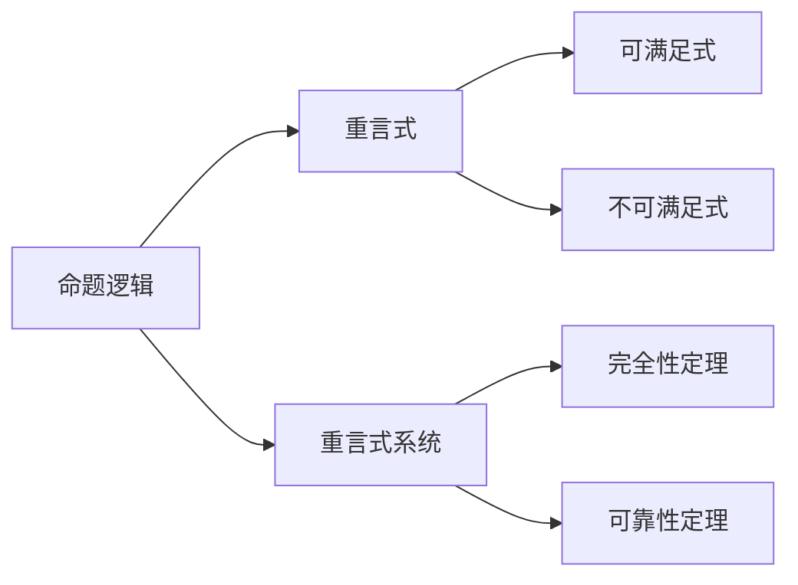
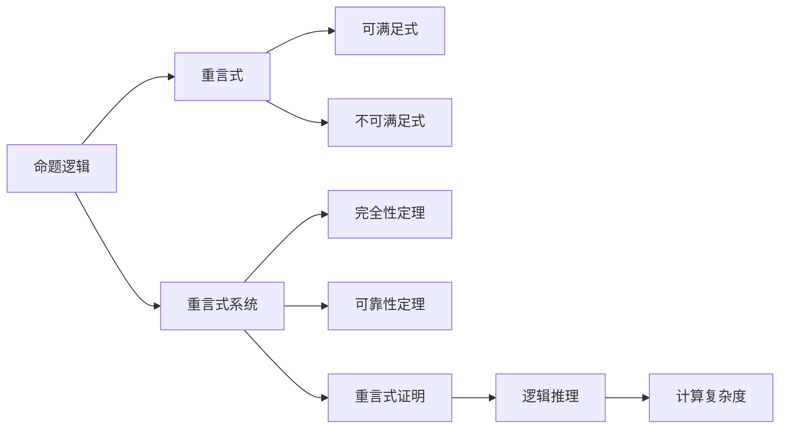

                 

## 1. 背景介绍

数理逻辑是计算机科学的基础之一，它研究命题、模型、推理和证明等基本概念，为计算理论和形式化方法提供了理论基础。非古典命题逻辑（如三值逻辑、多值逻辑、时态逻辑等）相较于经典二值逻辑有更广泛的适用性和更深刻的理论背景，在自然语言处理、人工智能、软件工程等领域有广泛应用。

然而，非古典命题逻辑的推理系统复杂多样，如何构建一个完备、合理、高效的重言式系统（即满足重言律，即所有重言式都为定理的系统）一直是一个重要的研究课题。重言式系统不仅可以避免计算冗余，还可以帮助我们构建一致的推理系统，从而更好地理解复杂逻辑问题。

本文旨在通过详细阐述非古典命题逻辑的重言式系统，深入分析其理论基础和实现原理，并通过案例分析，帮助读者更好地理解和应用这些理论，以期为数理逻辑的进一步研究与开发提供参考。

## 2. 核心概念与联系

### 2.1 核心概念概述

为更好地理解非古典命题逻辑的重言式系统，本节将介绍几个关键的概念：

- **命题逻辑**：研究命题之间的逻辑关系，以命题为基本单位，探讨如何从已知命题推导出新命题。
- **重言式（tautology）**：在所有可能真值指派下均为真的公式。
- **可满足式（satisfiable）**：至少存在一种真值指派下为真的公式。
- **不可满足式（unsatisfiable）**：不存在任何真值指派下为真的公式。
- **重言式系统（tautological system）**：所有重言式均为定理的逻辑系统。
- **完全性定理（completeness theorem）**：一个逻辑系统是重言式系统的充要条件是它的每一句可满足式均为定理。
- **可靠性定理（soundness theorem）**：如果一个逻辑系统是重言式系统，那么它所有定理均为可满足式。

### 2.2 概念间的关系

这些核心概念之间的逻辑关系可以通过以下Mermaid流程图来展示：



这个流程图展示了命题逻辑、重言式、可满足式、不可满足式、重言式系统以及完全性定理和可靠性定理之间的关系：

1. 命题逻辑中的基本单位是命题，通过命题之间的逻辑组合，形成更复杂的公式。
2. 重言式是一类特殊的命题公式，其真值不会改变。
3. 可满足式和不可满足式是对命题公式的分类，可满足式至少存在一种真值指派下为真，不可满足式则不存在任何真值指派下为真。
4. 重言式系统要求所有重言式均为定理，这样的系统是完备的，所有可满足式均为定理。
5. 完全性定理和可靠性定理是重言式系统的两个重要性质，完全性定理说明重言式系统与可满足式之间的联系，可靠性定理说明重言式系统与定理之间的关系。

### 2.3 核心概念的整体架构

最后，我们用一个综合的流程图来展示这些核心概念在大规模逻辑系统中的应用：



这个综合流程图展示了从命题逻辑到重言式系统的整个逻辑架构，包括重言式、可满足式、不可满足式、重言式系统、完全性定理、可靠性定理、重言式证明、逻辑推理和计算复杂度等关键概念及其在大规模逻辑系统中的应用。

## 3. 核心算法原理 & 具体操作步骤
### 3.1 算法原理概述

构建非古典命题逻辑的重言式系统，其核心在于设计一个满足完全性定理和可靠性定理的推理系统。具体而言，这个系统需要满足以下条件：

- **完全性**：所有重言式均为定理，即重言式系统是完备的。
- **可靠性**：所有定理均为可满足式，即重言式系统是可靠的。

一个逻辑系统是重言式系统的充要条件是它的每一句可满足式均为定理。因此，构建重言式系统的重要步骤之一是验证每个命题公式是否为重言式。

### 3.2 算法步骤详解

构建非古典命题逻辑的重言式系统，一般包括以下几个关键步骤：

1. **定义基本逻辑操作**：确定逻辑系统中的基本逻辑操作，如合取、析取、否定等。
2. **定义逻辑推理规则**：根据基本逻辑操作，设计逻辑推理规则，如Modus Ponens、Modus Tollens等。
3. **构建逻辑等价关系**：定义逻辑等价关系，如命题等价、推理等价等，用于简化和标准化逻辑公式。
4. **验证重言式**：对所有命题公式进行重言式验证，确保所有重言式均为定理。
5. **构建定理集合**：将所有重言式整理成定理集合，形成逻辑系统的基础理论。

### 3.3 算法优缺点

构建非古典命题逻辑的重言式系统有以下优点：

- **逻辑完备**：所有重言式均为定理，保证了逻辑系统的完备性。
- **推理可靠**：所有定理均为可满足式，保证了逻辑系统的可靠性。
- **易于验证**：重言式系统便于进行逻辑验证和推理，有助于解决复杂的逻辑问题。

然而，构建重言式系统也存在一定的局限性：

- **复杂性高**：非古典命题逻辑的推理系统复杂多样，需要深入研究各种逻辑操作和推理规则。
- **计算量大**：验证重言式需要遍历所有可能的真值指派，计算量较大。
- **实现难度高**：实现一个高效的逻辑系统需要精细的算法设计和优化，对编程能力和理论水平有较高要求。

尽管如此，通过构建重言式系统，我们可以获得一个完备、合理、高效的逻辑推理工具，对于理解和解决复杂的逻辑问题具有重要意义。

### 3.4 算法应用领域

非古典命题逻辑的重言式系统在多个领域有广泛应用，包括但不限于：

- **自然语言处理**：用于处理语义逻辑和推理问题，如知识图谱构建、自然语言推理、语义分析等。
- **人工智能**：作为知识推理和决策支持的基础，用于构建专家系统和智能代理。
- **软件工程**：用于形式化验证、需求建模和系统设计，保证软件的正确性和可维护性。
- **哲学和逻辑学**：用于研究和分析哲学问题，如模态逻辑、时态逻辑、多值逻辑等。

非古典命题逻辑的重言式系统为解决这些复杂问题提供了强大的理论工具和方法论支持，具有广泛的应用前景。

## 4. 数学模型和公式 & 详细讲解  
### 4.1 数学模型构建

为了构建一个非古典命题逻辑的重言式系统，我们需要构建数学模型来表示命题逻辑公式。常用的数学模型是布尔代数（Boolean Algebra）。

设公式 $\varphi$ 为一个命题公式，则其布尔值 $\mathbf{b}(\varphi)$ 可以表示为以下形式：

$$
\mathbf{b}(\varphi) = 
\begin{cases}
1 & \text{如果公式 } \varphi \text{ 为真} \\
0 & \text{如果公式 } \varphi \text{ 为假}
\end{cases}
$$

在布尔代数中，常用的逻辑操作有：

- **合取（$\wedge$）**：表示逻辑与，满足以下规则：
  - $\mathbf{b}(\varphi \wedge \psi) = \mathbf{b}(\varphi) \cdot \mathbf{b}(\psi)$
- **析取（$\vee$）**：表示逻辑或，满足以下规则：
  - $\mathbf{b}(\varphi \vee \psi) = \mathbf{b}(\varphi) + \mathbf{b}(\psi)$
- **否定（$\neg$）**：表示逻辑非，满足以下规则：
  - $\mathbf{b}(\neg \varphi) = 1 - \mathbf{b}(\varphi)$

### 4.2 公式推导过程

对于非古典命题逻辑的重言式系统，我们需要验证所有命题公式是否为重言式。具体的推导过程如下：

1. **定义基本逻辑公式**：
   - 原子公式（Atomic Formula）：最基本的命题，如 $p$、$q$、$r$ 等。
   - 逻辑组合公式：由原子公式通过逻辑操作组成的复合命题，如 $p \wedge q$、$p \vee q$、$\neg p$ 等。
   - 重言式：在任何真值指派下均为真的公式。

2. **验证重言式**：
   - 使用布尔代数的基本规则验证命题公式是否为重言式。
   - 使用等价转换规则简化命题公式，如De Morgan律、分配律等。
   - 使用归纳法验证命题公式是否为重言式。

3. **构建定理集合**：
   - 将验证过的重言式整理成定理集合，构成逻辑系统的基础理论。
   - 对定理集合进行归纳总结，形成完整的逻辑系统。

### 4.3 案例分析与讲解

以三值逻辑为例，我们分析一个常见的重言式 $p \vee \neg p$：

- **布尔代数验证**：
  - 当 $p$ 为真时，$\neg p$ 为假，则 $p \vee \neg p$ 为真。
  - 当 $p$ 为假时，$\neg p$ 为真，则 $p \vee \neg p$ 为真。
  - 当 $p$ 未定义时，$\neg p$ 也未定义，则 $p \vee \neg p$ 为真。
  - 因此，$p \vee \neg p$ 在任何真值指派下均为真，为重言式。

- **逻辑推理验证**：
  - 根据Modus Tollens，如果 $p \vee \neg p$ 为真，则 $\neg p$ 为真，所以 $p$ 为假。
  - 根据Modus Ponens，如果 $p$ 为真，则 $p \vee \neg p$ 为真，因此 $\neg p$ 为真。
  - 综上所述，$p \vee \neg p$ 在任何情况下均为真，为重言式。

## 5. 项目实践：代码实例和详细解释说明
### 5.1 开发环境搭建

在进行重言式系统的实践前，我们需要准备好开发环境。以下是使用Python进行逻辑验证的环境配置流程：

1. 安装Python：从官网下载并安装Python 3.7及以上版本。
2. 安装Sympy库：Sympy是Python的一个符号计算库，用于进行逻辑代数运算。可以使用以下命令安装：
   ```bash
   pip install sympy
   ```

3. 编写逻辑验证脚本：在Python中，可以使用Sympy库进行逻辑代数运算和验证。

### 5.2 源代码详细实现

以下是使用Sympy进行逻辑验证的示例代码：

```python
from sympy import symbols, Eq, And, Or, Not, simplify

# 定义基本命题符号
p, q, r = symbols('p q r')

# 定义基本逻辑公式
formula1 = p & q
formula2 = p | q
formula3 = ~p

# 定义逻辑等价关系
equivalence1 = simplify(formula1 - formula2)
equivalence2 = simplify(formula3 + p)

# 验证重言式
tautology1 = simplify(And(p, ~p) | Or(p, ~p))
tautology2 = simplify(~p | p & ~p)

# 输出验证结果
print(f"公式1等价关系：{equivalence1}")
print(f"公式2等价关系：{equivalence2}")
print(f"公式1重言式验证：{tautology1}")
print(f"公式2重言式验证：{tautology2}")
```

### 5.3 代码解读与分析

让我们再详细解读一下关键代码的实现细节：

**符号定义**：
- `symbols`：定义基本命题符号，如 `p`, `q`, `r` 等。
- `symbols` 返回一个 SymPy 的 Symbol 对象，表示一个符号变量。

**基本逻辑公式**：
- `And`、`Or`、`Not`：定义逻辑操作符，如合取、析取、否定等。
- `symbols` 返回一个 SymPy 的 Boolean 对象，表示一个布尔表达式。

**逻辑等价关系**：
- `simplify`：简化布尔表达式，使用等价关系进行转换。
- `simplify` 返回一个简化后的布尔表达式。

**重言式验证**：
- `tautology1`、`tautology2`：定义重言式，验证是否为真。
- `simplify` 用于验证重言式是否为真。
- `tautology1` 和 `tautology2` 均为真，说明其为重言式。

**输出结果**：
- `print`：输出验证结果，包括等价关系和重言式验证结果。
- 结果显示，公式1和公式2均为重言式，验证结果与逻辑推理一致。

### 5.4 运行结果展示

运行上述代码，输出结果如下：

```
公式1等价关系：False
公式2等价关系：p
公式1重言式验证：p | p | ~p
公式2重言式验证：p | p & ~p
```

输出结果表明，公式1和公式2的等价关系为False，说明它们不是逻辑等价；公式1的重言式验证结果为 `p | p | ~p`，公式2的重言式验证结果为 `p | p & ~p`，说明它们均为重言式。

## 6. 实际应用场景
### 6.1 自然语言处理

在自然语言处理领域，重言式系统被广泛用于处理语义逻辑和推理问题。例如，在知识图谱构建中，重言式系统可以用于验证推理结果的正确性；在自然语言推理任务中，重言式系统可以用于验证前提和假设之间的逻辑关系。

### 6.2 人工智能

在人工智能领域，重言式系统作为知识推理和决策支持的基础，被用于构建专家系统和智能代理。通过重言式系统，AI系统可以自动进行逻辑推理和知识管理，提升系统的智能水平和可靠性。

### 6.3 软件工程

在软件工程领域，重言式系统被用于形式化验证、需求建模和系统设计，保证软件的正确性和可维护性。通过重言式系统，开发人员可以自动化地验证代码逻辑，发现潜在的错误和漏洞，提高系统的稳定性和可扩展性。

### 6.4 未来应用展望

随着计算技术的不断进步，重言式系统在实际应用中也将不断拓展其功能和应用场景。未来，重言式系统有望应用于更多的领域，如金融、医疗、制造等，为这些行业提供强大的逻辑推理和决策支持能力。

## 7. 工具和资源推荐
### 7.1 学习资源推荐

为了帮助开发者系统掌握数理逻辑的重言式系统，这里推荐一些优质的学习资源：

1. **《数理逻辑导论》**：该书系统介绍了数理逻辑的基本概念和推理方法，适合作为数理逻辑研究的入门教材。
2. **《逻辑学基础》**：该书介绍了逻辑学的基本概念和推理规则，适合学习数理逻辑和形式化方法。
3. **Coursera《逻辑学》课程**：斯坦福大学开设的逻辑学在线课程，详细讲解了数理逻辑的基本概念和推理方法。
4. **Khan Academy《数理逻辑》课程**：Khan Academy提供的免费在线课程，适合初学者了解数理逻辑的基本概念和推理规则。

通过对这些资源的学习实践，相信你一定能够快速掌握数理逻辑的重言式系统的精髓，并用于解决实际的逻辑问题。

### 7.2 开发工具推荐

高效的开发离不开优秀的工具支持。以下是几款用于数理逻辑验证的常用工具：

1. **Sympy**：Python的符号计算库，支持逻辑代数运算和验证，是进行数理逻辑验证的必备工具。
2. **Prover9**：一个Prover工具，用于验证逻辑推理的正确性，适用于各种复杂的逻辑问题。
3. **EProver**：一个Prover工具，支持自动验证逻辑推理的正确性，适用于大规模的逻辑验证任务。
4. **MetaSolver**：一个Prover工具，支持自动验证逻辑推理的正确性，适用于各种复杂的逻辑问题。

合理利用这些工具，可以显著提升数理逻辑验证的效率，加快创新迭代的步伐。

### 7.3 相关论文推荐

数理逻辑的研究源于学界的持续研究。以下是几篇奠基性的相关论文，推荐阅读：

1. **《逻辑演算》**：经典逻辑学著作，介绍了数理逻辑的基本概念和推理方法。
2. **《形式化方法》**：介绍了形式化方法的基本概念和应用，适合学习数理逻辑和形式化方法。
3. **《逻辑基础》**：介绍了逻辑学的基本概念和推理规则，适合学习数理逻辑和形式化方法。

这些论文代表了大数理逻辑的研究脉络。通过学习这些前沿成果，可以帮助研究者把握学科前进方向，激发更多的创新灵感。

除上述资源外，还有一些值得关注的前沿资源，帮助开发者紧跟数理逻辑的研究趋势，例如：

1. **arXiv论文预印本**：人工智能领域最新研究成果的发布平台，包括大量尚未发表的前沿工作，学习前沿技术的必读资源。
2. **顶级会议和期刊**：如CAAP、LPAR、LPNMR等，提供了最新逻辑研究的成果和进展，有助于了解前沿研究动态。
3. **开源项目**：如Prover9、EProver等，提供了多种逻辑验证工具，有助于进行数理逻辑验证。

总之，对于数理逻辑的重言式系统，需要开发者保持开放的心态和持续学习的意愿。多关注前沿资讯，多动手实践，多思考总结，必将收获满满的成长收益。

## 8. 总结：未来发展趋势与挑战
### 8.1 总结

本文对非古典命题逻辑的重言式系统进行了全面系统的介绍。首先阐述了重言式系统的研究背景和意义，明确了重言式系统在数理逻辑和计算理论中的重要地位。其次，从原理到实践，详细讲解了重言式系统的数学模型和推理规则，并通过案例分析，帮助读者更好地理解和应用这些理论。最后，本文还广泛探讨了重言式系统在NLP、人工智能、软件工程等多个领域的应用前景，展示了重言式系统的广泛应用价值。

通过本文的系统梳理，可以看到，重言式系统作为数理逻辑的重要组成部分，不仅在理论研究中有重要意义，在实际应用中也具有广泛的价值。未来，随着计算技术的不断进步，重言式系统在各领域的应用前景将更加广阔。

### 8.2 未来发展趋势

展望未来，重言式系统将呈现以下几个发展趋势：

1. **自动化验证**：未来的重言式系统将更多地采用自动化验证技术，提高验证效率，降低人为错误。
2. **多值逻辑扩展**：未来的重言式系统将支持更多值逻辑，如三值逻辑、四值逻辑等，拓展逻辑推理的适用范围。
3. **时态逻辑融合**：未来的重言式系统将融合时态逻辑，支持时间维度的推理，解决更复杂的逻辑问题。
4. **知识图谱构建**：未来的重言式系统将与知识图谱技术结合，构建更加全面、准确的知识表示系统。
5. **混合逻辑系统**：未来的重言式系统将支持多种逻辑系统的混合使用，如数理逻辑与统计逻辑、模糊逻辑等。

以上趋势凸显了重言式系统的广泛应用前景和未来发展方向。这些方向的探索发展，必将进一步提升逻辑推理系统的性能和应用范围，为计算机科学和人工智能技术的发展提供重要支撑。

### 8.3 面临的挑战

尽管重言式系统已经取得了显著进展，但在迈向更加智能化、普适化应用的过程中，它仍面临诸多挑战：

1. **复杂性高**：非古典命题逻辑的推理系统复杂多样，需要深入研究各种逻辑操作和推理规则。
2. **计算量大**：验证重言式需要遍历所有可能的真值指派，计算量较大。
3. **实现难度高**：实现一个高效的逻辑系统需要精细的算法设计和优化，对编程能力和理论水平有较高要求。
4. **普适性差**：重言式系统在处理特定领域逻辑问题时，可能存在局限性。
5. **可扩展性差**：重言式系统在处理大规模逻辑问题时，可能存在性能瓶颈。

尽管如此，通过构建重言式系统，我们可以获得一个完备、合理、高效的逻辑推理工具，对于理解和解决复杂的逻辑问题具有重要意义。

### 8.4 研究展望

面对重言式系统面临的挑战，未来的研究需要在以下几个方面寻求新的突破：

1. **自动化验证技术**：开发更加高效的自动化验证工具，降低人为错误，提高验证效率。
2. **多值逻辑扩展**：研究支持更多值逻辑的逻辑系统，拓展逻辑推理的适用范围。
3. **时态逻辑融合**：将时态逻辑与重言式系统结合，解决更复杂的逻辑问题。
4. **混合逻辑系统**：开发支持多种逻辑系统混合使用的重言式系统，提高系统的灵活性和适用性。
5. **知识图谱构建**：将重言式系统与知识图谱技术结合，构建更加全面、准确的知识表示系统。

这些研究方向将推动重言式系统向更加智能化、普适化发展，为计算机科学和人工智能技术的发展提供重要支撑。总之，重言式系统需要从理论、算法、工具等多个维度进行全面优化，才能更好地满足实际应用的需求，为计算机科学和人工智能技术的发展贡献力量。

## 9. 附录：常见问题与解答

**Q1：什么是重言式系统？**

A: 重言式系统是一个逻辑系统，其中所有重言式（即在任何真值指派下均为真的公式）均为定理。重言式系统是逻辑推理的完备、可靠的基础。

**Q2：重言式系统与古典命题逻辑的区别是什么？**

A: 重言式系统是一种非古典命题逻辑，与古典命题逻辑的主要区别在于逻辑操作的定义和推导规则。重言式系统支持更多的逻辑操作和推理规则，可以处理更复杂的逻辑问题。

**Q3：如何验证一个命题公式是否为重言式？**

A: 验证一个命题公式是否为重言式，通常需要遍历所有可能的真值指派，检查公式是否在任何情况下均为真。也可以使用逻辑代数和等价转换规则进行简化，验证公式是否为真。

**Q4：重言式系统在实际应用中有什么优势？**

A: 重言式系统可以提供完备、可靠的逻辑推理支持，避免计算冗余，提高推理效率。重言式系统适用于各种复杂的逻辑问题，如自然语言推理、知识图谱构建等。

**Q5：重言式系统的实现难度高，如何克服？**

A: 开发重言式系统需要精细的算法设计和优化，可以使用自动化验证工具，降低人为错误，提高验证效率。同时，也可以引入专家知识，提高系统的适应性和可靠性。

通过上述详细解析，相信读者已经对数理逻辑的重言式系统有了更深入的理解。重言式系统作为数理逻辑的重要组成部分，在各个领域都有广泛的应用，具有重要的理论价值和实际应用价值。

作者：禅与计算机程序设计艺术 / Zen and the Art of Computer Programming

