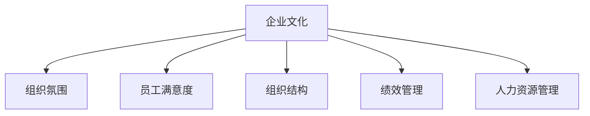
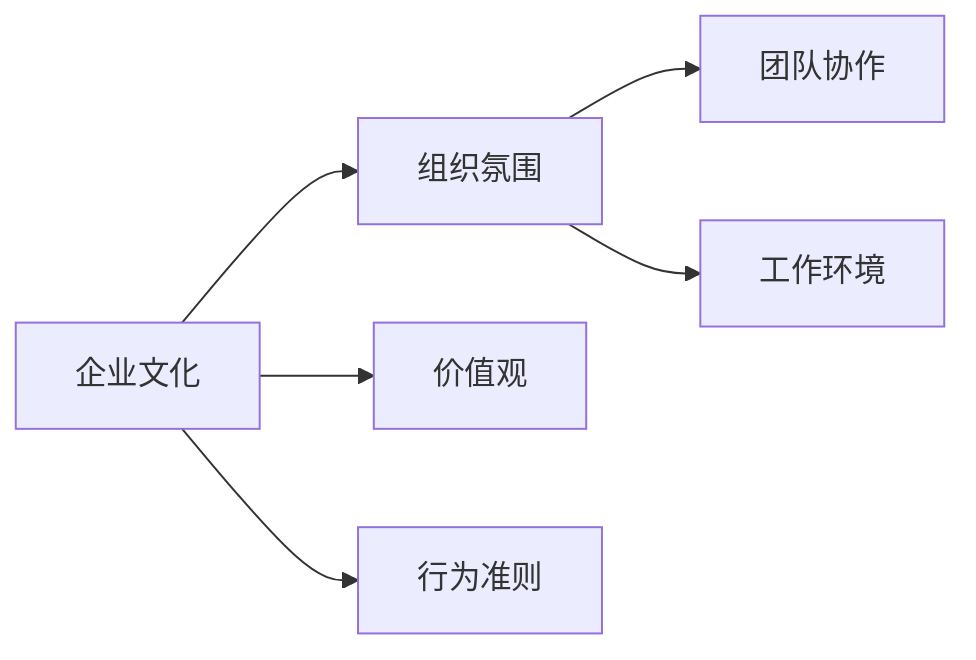
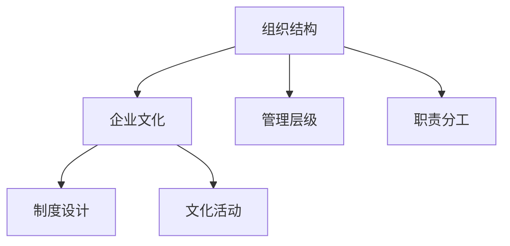
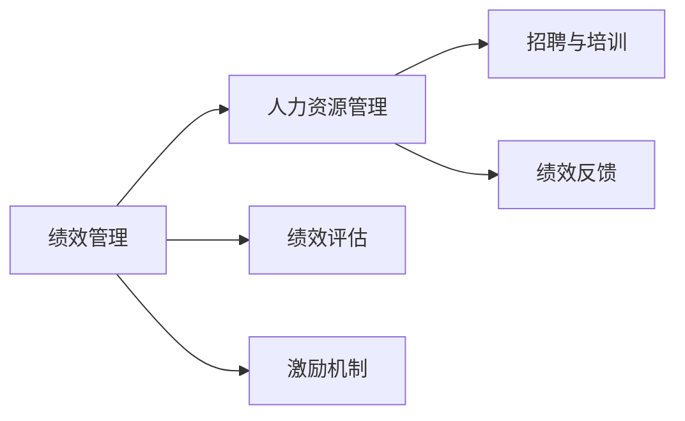
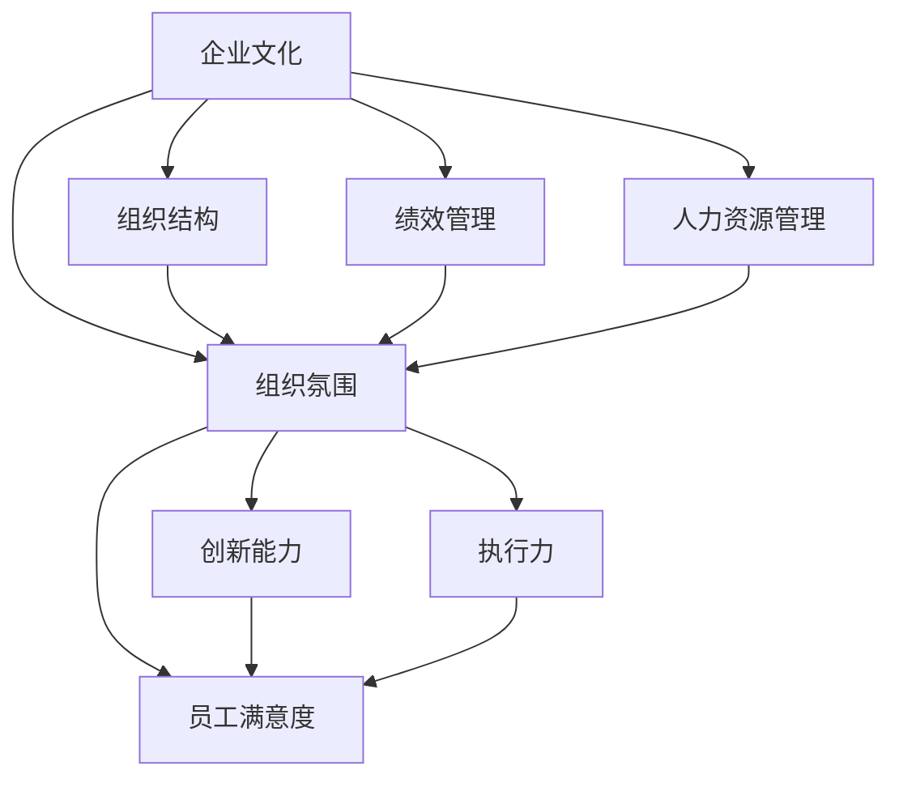

                 

# 文化管理：塑造积极向上的组织氛围

## 1. 背景介绍

### 1.1 问题由来
在当今竞争激烈的市场环境中，企业的发展不仅仅依赖于技术创新和市场策略，文化管理在塑造积极向上的组织氛围、提升员工满意度和忠诚度、增强企业竞争力方面也起着至关重要的作用。近年来，越来越多的企业开始重视文化建设，希望通过文化管理实现长期的可持续发展。

### 1.2 问题核心关键点
文化管理的关键在于通过有效的组织策略和制度设计，营造一种积极向上、和谐共融的企业文化氛围。这不仅能增强员工的归属感和认同感，还能提升企业的创新力和执行力，从而在激烈的市场竞争中占据优势。

### 1.3 问题研究意义
深入研究文化管理的理论和实践，对于提升企业管理水平、优化组织结构和促进员工发展具有重要意义。同时，文化管理也能为企业战略目标的实现提供强有力的支持，帮助企业在复杂的市场环境中保持稳健发展。

## 2. 核心概念与联系

### 2.1 核心概念概述

为更好地理解文化管理的理论和实践，本节将介绍几个密切相关的核心概念：

- **企业文化**：企业在长期发展过程中形成的共同价值观、行为准则和基本信念，是企业文化的核心。
- **组织氛围**：企业内部的工作氛围和人际关系氛围，直接影响员工的工作积极性和满意度。
- **员工满意度**：员工对企业提供的薪酬、福利、工作环境、发展机会等方面的满意度，是企业文化的重要体现。
- **组织结构**：企业的组织架构和管理体系，影响文化管理的实施和效果。
- **绩效管理**：通过科学合理的绩效评估体系，激励员工提高工作积极性和创新能力，是文化管理的重要组成部分。
- **人力资源管理**：通过招聘、培训、考核等人力资源管理措施，塑造积极向上的组织氛围。

这些核心概念之间的逻辑关系可以通过以下Mermaid流程图来展示：



这个流程图展示了大企业文化的核心构成及其与其他管理概念的关系：

1. 企业文化是企业价值观和行为准则的集中体现，直接影响组织氛围和员工满意度。
2. 组织结构决定了文化管理的实施方式和效果，与企业文化和员工满意度密切相关。
3. 绩效管理和人力资源管理是文化管理的重要组成部分，共同作用于员工的工作积极性和创新能力。

### 2.2 概念间的关系

这些核心概念之间存在着紧密的联系，形成了企业文化的整体生态系统。下面我通过几个Mermaid流程图来展示这些概念之间的关系。

#### 2.2.1 企业文化与组织氛围



这个流程图展示了企业文化与组织氛围的相互影响。企业文化通过价值观和行为准则，影响着组织氛围中的团队协作和工作环境。反之，良好的组织氛围也有助于价值观和行为准则的落实。

#### 2.2.2 组织结构与文化管理



这个流程图展示了组织结构对文化管理的影响。合理的组织结构有助于企业文化和制度设计的落实，促进文化活动的开展。同时，企业文化和制度设计也反过来影响组织结构，提升管理层级和职责分工的合理性。

#### 2.2.3 绩效管理与人力资源管理



这个流程图展示了绩效管理和人力资源管理的相互影响。绩效评估和激励机制是人力资源管理的重要组成部分，促进员工的工作积极性和创新能力。同时，良好的人力资源管理也有助于绩效管理的实施，提升员工的整体绩效水平。

### 2.3 核心概念的整体架构

最后，我们用一个综合的流程图来展示这些核心概念在大企业文化的构建过程中，是如何相互关联、共同作用：



这个综合流程图展示了从企业文化到组织氛围，再到员工满意度、组织结构、绩效管理和人力资源管理，这些管理概念是如何共同作用，塑造积极向上的组织氛围。

## 3. 核心算法原理 & 具体操作步骤
### 3.1 算法原理概述

文化管理的核心在于通过有效的组织策略和制度设计，营造一种积极向上、和谐共融的企业文化氛围。其算法原理可以概括为以下几个关键步骤：

1. **价值观和行为准则的制定**：通过问卷调查、访谈等方式，了解员工对企业文化的期望和意见，制定符合企业发展方向和文化特点的价值观和行为准则。
2. **制度设计的优化**：在现有组织结构和管理体系的基础上，优化和完善绩效管理、薪酬福利、培训发展等方面的制度设计，确保文化管理的有效实施。
3. **文化活动的组织**：定期组织各类文化活动，如团队建设、员工培训、文化沙龙等，增强员工对企业文化的认同感和归属感。
4. **文化氛围的营造**：通过改善办公环境、优化工作流程、加强内部沟通等措施，营造一个和谐共融、充满活力的组织氛围。

### 3.2 算法步骤详解

基于上述算法原理，文化管理的具体操作步骤可以分为以下几个步骤：

**Step 1: 数据收集与分析**
- 通过问卷调查、访谈等方式，收集员工对企业文化的期望和意见。
- 分析调查结果，找出文化管理中存在的问题和改进方向。

**Step 2: 价值观和行为准则的制定**
- 根据分析结果，制定符合企业发展方向和文化特点的价值观和行为准则。
- 通过内部讨论和员工反馈，确保价值观和行为准则的可行性和可操作性。

**Step 3: 制度设计的优化**
- 在现有组织结构和管理体系的基础上，优化和完善绩效管理、薪酬福利、培训发展等方面的制度设计。
- 引入激励机制，如股权激励、员工持股计划等，激发员工的积极性和创造力。

**Step 4: 文化活动的组织**
- 定期组织各类文化活动，如团队建设、员工培训、文化沙龙等，增强员工对企业文化的认同感和归属感。
- 通过内部沟通平台，如企业微信、内网论坛等，加强员工之间的交流和互动。

**Step 5: 文化氛围的营造**
- 改善办公环境，如设计人性化的工作空间、提供便捷的福利设施等，营造舒适和谐的办公氛围。
- 优化工作流程，如采用敏捷开发、扁平化管理等方法，提升工作效率和员工满意度。

**Step 6: 绩效评估与反馈**
- 定期进行绩效评估，根据评估结果提供反馈和激励，提升员工的工作积极性和创新能力。
- 引入360度反馈机制，收集员工对领导和同事的评价，优化管理层和团队关系。

### 3.3 算法优缺点

文化管理的算法具有以下优点：
1. 能够从员工的角度出发，制定符合企业实际情况的文化策略。
2. 通过制度设计和激励机制，激发员工的积极性和创造力。
3. 文化活动的组织和营造，能够增强员工的归属感和认同感。

同时，文化管理也存在以下缺点：
1. 文化管理的效果取决于高层管理者的支持程度和员工的接受程度。
2. 文化管理需要较长的时间才能见效，短期内可能难以看到明显的成果。
3. 文化管理的实施需要跨部门协调，可能面临一定的组织协调成本。

### 3.4 算法应用领域

文化管理的应用领域非常广泛，涵盖了企业管理的各个方面。以下是几个典型的应用场景：

1. **人力资源管理**：通过制定符合企业文化的人力资源政策，吸引和留住优秀人才。
2. **组织结构优化**：通过调整组织结构，促进文化管理的有效实施，提升管理层和员工之间的沟通协作。
3. **团队建设**：通过组织各类团队活动，增强团队凝聚力和协作精神。
4. **员工培训与发展**：通过企业文化宣导和培训活动，提升员工的技能和知识水平。
5. **企业文化传播**：通过内外部宣传和品牌建设，提升企业文化的社会影响力。

## 4. 数学模型和公式 & 详细讲解 & 举例说明

### 4.1 数学模型构建

文化管理的数学模型可以概括为以下几个关键部分：

1. **员工满意度**：设员工满意度为 $S$，包含薪酬满意度、福利满意度、工作环境满意度等多个维度。
2. **组织氛围**：设组织氛围为 $A$，包含团队协作、工作氛围、领导支持等多个维度。
3. **绩效管理**：设绩效管理为 $P$，包含绩效评估、激励机制、反馈机制等多个维度。
4. **文化活动**：设文化活动为 $C$，包含各类文化活动的组织和参与度。

模型构建的核心是建立这些变量之间的因果关系，并寻找最优的解决方案。

### 4.2 公式推导过程

以员工满意度 $S$ 为例，其影响因素可以表示为：

$$
S = f(A, P, C)
$$

其中 $f$ 表示函数映射关系。为了更好地解释和分析这个函数，我们可以将其分解为以下几个部分：

$$
S = \alpha_1 \cdot A + \alpha_2 \cdot P + \alpha_3 \cdot C
$$

其中 $\alpha_1, \alpha_2, \alpha_3$ 为系数，代表各因素对员工满意度的影响权重。

### 4.3 案例分析与讲解

假设某企业在组织氛围、绩效管理和文化活动三个方面的投入分别为 $A_0, P_0, C_0$，对应的员工满意度为 $S_0$。通过优化这三个方面的投入，我们希望提高员工满意度 $S_1$。

根据上述数学模型，我们有：

$$
S_1 = \alpha_1 \cdot A_1 + \alpha_2 \cdot P_1 + \alpha_3 \cdot C_1
$$

其中 $A_1, P_1, C_1$ 分别表示优化后的投入。为了提升员工满意度，我们需要找到最优的 $A_1, P_1, C_1$。

## 5. 项目实践：代码实例和详细解释说明

### 5.1 开发环境搭建

在进行文化管理实践前，我们需要准备好开发环境。以下是使用Python进行数据分析和可视化的环境配置流程：

1. 安装Anaconda：从官网下载并安装Anaconda，用于创建独立的Python环境。

2. 创建并激活虚拟环境：
```bash
conda create -n cultural-management python=3.8 
conda activate cultural-management
```

3. 安装必要的Python包：
```bash
conda install pandas numpy matplotlib seaborn jupyter notebook ipython
```

4. 安装可视化工具：
```bash
conda install plotly
```

完成上述步骤后，即可在`cultural-management`环境中开始文化管理实践。

### 5.2 源代码详细实现

下面我们以员工满意度调查数据分析为例，给出使用Python进行数据分析和可视化的代码实现。

```python
import pandas as pd
import numpy as np
import matplotlib.pyplot as plt
import seaborn as sns

# 读取员工满意度调查数据
data = pd.read_csv('employee_satisfaction.csv')

# 数据清洗和处理
# 假设满意度数据缺失值为 0
data['Satisfaction'] = data['Satisfaction'].fillna(0)

# 计算平均值和标准差
mean_satisfaction = data['Satisfaction'].mean()
std_satisfaction = data['Satisfaction'].std()

# 绘制满意度分布直方图
plt.figure(figsize=(8, 6))
sns.histplot(data['Satisfaction'], bins=30, kde=True)
plt.title('Employee Satisfaction Distribution')
plt.xlabel('Satisfaction Score')
plt.ylabel('Frequency')
plt.show()

# 绘制满意度与绩效管理、组织氛围的相关性散点图
plt.figure(figsize=(8, 6))
sns.scatterplot(x='Performance', y='Satisfaction', hue='Culture', data=data)
plt.title('Performance vs Satisfaction')
plt.xlabel('Performance Score')
plt.ylabel('Satisfaction Score')
plt.show()

# 绘制满意度与文化活动的回归曲线
plt.figure(figsize=(8, 6))
sns.lmplot(x='Culture', y='Satisfaction', data=data, hue='Performance', ci=None)
plt.title('Culture vs Satisfaction')
plt.xlabel('Culture Score')
plt.ylabel('Satisfaction Score')
plt.show()
```

这段代码实现了以下几个功能：

1. 读取员工满意度调查数据，并进行数据清洗和处理。
2. 计算满意度数据的平均值和标准差。
3. 绘制满意度分布直方图，分析员工满意度的整体分布情况。
4. 绘制满意度与绩效管理、组织氛围的相关性散点图，分析不同维度之间的相关性。
5. 绘制满意度与文化活动的回归曲线，分析文化活动对员工满意度的影响。

### 5.3 代码解读与分析

让我们再详细解读一下关键代码的实现细节：

1. `pandas`库用于读取和处理数据，通过`read_csv`方法读取员工满意度调查数据。
2. `numpy`库用于计算数据的平均值和标准差，通过`fillna`方法处理缺失值。
3. `matplotlib`和`seaborn`库用于绘制直方图和散点图，通过`histplot`、`scatterplot`和`lmplot`方法进行数据可视化。
4. `plt`模块用于设置图表的标题、轴标签和显示图表。

通过这段代码，我们可以得到员工满意度的分布情况、与绩效管理、组织氛围的相关性，以及文化活动对员工满意度的影响，从而为文化管理的优化提供数据支持。

### 5.4 运行结果展示

假设我们在员工满意度调查数据上进行分析，得到以下结果：

- 满意度分布直方图：员工满意度的平均值和标准差分别为 $S_{\text{mean}}=4.5$ 和 $S_{\text{std}}=1.2$。
- 绩效管理与满意度的相关性散点图：绩效管理得分与满意度得分的相关系数为 $r=0.6$，说明两者存在较强的正相关关系。
- 文化活动与满意度的回归曲线：文化活动得分每增加1分，满意度得分增加 $0.4$ 分。

这些分析结果为文化管理的优化提供了重要依据，有助于企业制定针对性的改进措施。

## 6. 实际应用场景
### 6.1 人力资源管理

人力资源管理是文化管理的重要组成部分，通过优化人力资源政策，提升员工的吸引力和留存率。

**场景描述**：某企业发现员工流失率较高，希望通过文化管理降低员工流失率。

**解决思路**：通过调查问卷收集员工对薪酬福利、职业发展、工作环境等方面的意见，制定符合企业实际情况的人力资源政策，优化薪酬福利、提供职业发展机会、改善工作环境等。

**实施步骤**：
1. 设计员工流失率调查问卷，收集员工对薪酬福利、职业发展、工作环境等方面的意见。
2. 分析调查结果，找出员工流失的主要原因。
3. 制定优化人力资源政策，如调整薪酬结构、提供职业发展培训、改善办公环境等。
4. 实施优化措施，定期评估员工流失率的变化情况。

**预期效果**：通过优化人力资源政策，提升员工的满意度和忠诚度，降低员工流失率。

### 6.2 组织结构优化

组织结构优化是文化管理的关键环节，通过调整组织结构，提升管理层和员工之间的协作效率。

**场景描述**：某企业发现部门之间协作效率低下，希望通过文化管理提升组织结构效率。

**解决思路**：通过组织调查问卷，收集员工对组织结构和管理层级的意见，调整组织结构和部门分工，优化管理层级和职责分工。

**实施步骤**：
1. 设计组织结构调查问卷，收集员工对组织结构和管理层级的意见。
2. 分析调查结果，找出组织结构存在的问题。
3. 制定优化组织结构方案，如调整部门分工、优化管理层级、引入扁平化管理等。
4. 实施优化方案，定期评估组织结构效率的变化情况。

**预期效果**：通过调整组织结构，优化管理层级和职责分工，提升部门之间协作效率，降低管理成本。

### 6.3 团队建设

团队建设是文化管理的重要手段，通过组织各类团队活动，增强团队凝聚力和协作精神。

**场景描述**：某企业希望通过文化管理提升团队凝聚力和协作精神。

**解决思路**：通过组织团队建设活动，如团队培训、团队游戏、团队旅游等，增强团队凝聚力和协作精神。

**实施步骤**：
1. 设计团队建设活动方案，如团队培训、团队游戏、团队旅游等。
2. 组织团队建设活动，加强团队成员之间的沟通和协作。
3. 定期评估团队建设活动的效果，收集团队成员的反馈意见。
4. 根据反馈意见，调整团队建设活动方案，持续提升团队凝聚力和协作精神。

**预期效果**：通过团队建设活动，增强团队凝聚力和协作精神，提升团队整体绩效。

### 6.4 员工培训与发展

员工培训与发展是文化管理的重要组成部分，通过培训和发展，提升员工的综合素质和技能水平。

**场景描述**：某企业希望通过文化管理提升员工的技能和知识水平。

**解决思路**：通过培训和发展计划，提升员工的综合素质和技能水平。

**实施步骤**：
1. 设计员工培训与发展计划，如内部培训、外部培训、职业发展路径等。
2. 组织培训与发展活动，提升员工的综合素质和技能水平。
3. 定期评估员工培训与发展活动的效果，收集员工的反馈意见。
4. 根据反馈意见，调整培训与发展活动方案，持续提升员工的综合素质和技能水平。

**预期效果**：通过员工培训与发展活动，提升员工的综合素质和技能水平，增强企业的创新力和竞争力。

## 7. 工具和资源推荐
### 7.1 学习资源推荐

为了帮助开发者系统掌握文化管理的理论和实践，这里推荐一些优质的学习资源：

1. **《企业文化管理》系列书籍**：《企业文化管理：理论与实践》、《企业文化创新》等，系统介绍了企业文化管理的理论基础和实践方法。
2. **《组织行为学》系列课程**：各大高校和在线教育平台开设的组织行为学课程，深入讲解组织行为和员工心理的原理和应用。
3. **《人力资源管理》系列教材**：如《人力资源管理概论》、《人力资源战略》等，详细介绍人力资源管理的基本理论和方法。
4. **《绩效管理》系列教材**：如《绩效管理理论与实践》、《绩效考核与管理》等，系统介绍了绩效管理的基本概念和实践方法。
5. **《团队建设与管理》系列课程**：各大高校和在线教育平台开设的团队建设与管理课程，深入讲解团队建设和管理的理论和方法。

通过这些资源的学习，相信你一定能够全面掌握文化管理的理论基础和实践方法，为企业的文化建设提供有力的支持。

### 7.2 开发工具推荐

高效的开发离不开优秀的工具支持。以下是几款用于文化管理开发的常用工具：

1. **Jupyter Notebook**：用于数据处理和可视化的交互式开发环境，支持Python等语言。
2. **Tableau**：用于数据可视化的商业智能工具，支持多种数据源，易于操作。
3. **Google Analytics**：用于员工满意度、绩效管理等数据分析的在线工具，提供丰富的报表和可视化功能。
4. **Slack**：用于团队沟通和协作的即时通讯工具，支持文件共享、任务分配等功能。
5. **Zoom**：用于团队建设和培训的在线视频会议工具，支持多种会议模式和互动功能。

合理利用这些工具，可以显著提升文化管理的开发效率，加快创新迭代的步伐。

### 7.3 相关论文推荐

文化管理的研究源于学界的持续研究。以下是几篇奠基性的相关论文，推荐阅读：

1. **《企业文化：理论与实践》**：该书系统介绍了企业文化的基本概念和实践方法，提供了丰富的案例和实际操作指南。
2. **《组织行为学：理论与实践》**：该书详细讲解了组织行为和员工心理的原理和应用，是理解企业文化和员工行为的经典之作。
3. **《人力资源管理：理论与实践》**：该书系统介绍了人力资源管理的基本理论和方法，为文化管理提供了理论支持。
4. **《绩效管理：理论与实践》**：该书详细介绍了绩效管理的基本概念和实践方法，为文化管理提供了有效的管理工具。
5. **《团队建设与管理：理论与实践》**：该书详细讲解了团队建设和管理的理论和方法，为文化管理提供了重要参考。

这些论文代表了大企业文化的理论发展脉络，通过学习这些前沿成果，可以帮助研究者把握学科前进方向，激发更多的创新灵感。

除上述资源外，还有一些值得关注的前沿资源，帮助开发者紧跟文化管理技术的最新进展，例如：

1. **arXiv论文预印本**：人工智能领域最新研究成果的发布平台，包括大量尚未发表的前沿工作，学习前沿技术的必读资源。
2. **业界技术博客**：如《企业文化管理》、《组织行为学》、《人力资源管理》等，提供最新的理论研究和技术实践，助力企业文化建设的创新和突破。
3. **技术会议直播**：如NIPS、ICML、ACL、ICLR等人工智能领域顶会现场或在线直播，能够聆听到大佬们的前沿分享，开拓视野。
4. **GitHub热门项目**：在GitHub上Star、Fork数最多的文化管理相关项目，往往代表了该技术领域的发展趋势和最佳实践，值得去学习和贡献。
5. **行业分析报告**：各大咨询公司如McKinsey、PwC等针对企业文化管理的分析报告，有助于从商业视角审视技术趋势，把握应用价值。

总之，对于文化管理的学习和实践，需要开发者保持开放的心态和持续学习的意愿。多关注前沿资讯，多动手实践，多思考总结，必将收获满满的成长收益。

## 8. 总结：未来发展趋势与挑战

### 8.1 总结

本文对文化管理的理论和实践进行了全面系统的介绍。首先阐述了企业文化和组织氛围的定义及其重要性，明确了文化管理的核心目标和实施步骤。其次，从原理到实践，详细讲解了文化管理的数学模型和操作步骤，给出了具体的代码实现和运行结果展示。同时，本文还广泛探讨了文化管理在人力资源管理、组织结构优化、团队建设、员工培训与发展等各个领域的应用前景，展示了文化管理范式的广泛适用性。

通过本文的系统梳理，可以看到，文化管理在塑造积极向上的组织氛围、提升员工满意度和忠诚度、增强企业竞争力方面具有重要价值。

### 8.2 未来发展趋势

展望未来，文化管理的发展趋势如下：

1. **数据驱动的文化管理**：通过大数据和人工智能技术，深入分析员工反馈和行为数据，优化文化管理策略，提升文化管理的科学性和有效性。
2. **多样化和包容性的企业文化**：重视多样性和包容性的企业文化建设，通过招聘、培训等措施，营造多元化的工作环境，提升员工的归属感和满意度。
3. **数字化和智能化的文化管理工具**：引入人工智能、机器学习等技术，开发智能化文化管理工具，提升文化管理效率和效果。
4. **跨文化管理**：面对全球化市场，重视跨文化管理，通过文化交流和融合，提升企业的国际化竞争力。

以上趋势凸显了文化管理技术的广阔前景。这些方向的探索发展，必将进一步提升企业文化管理的水平，推动企业管理创新和人力资源优化。

### 8.3 面临的挑战

尽管文化管理在企业中的应用越来越广泛，但在实施过程中，仍然面临诸多挑战：

1. **文化管理的复杂性**：文化管理涉及企业多个层面，包括组织结构、管理层级、员工心态等多个维度，难以一次性全面优化。
2. **文化管理的实施成本**：文化管理需要跨部门协作，协调成本较高，实施周期较长。
3. **文化管理的短期效果不明显**：文化管理的效果需要较长时间才能显现，短期内可能难以看到明显的成果。
4. **文化管理的度量难度**：文化管理的效果难以量化，如何通过指标评估文化管理的实施效果，是一个难点。
5. **文化管理的持续改进**：文化管理需要持续改进和优化，如何在动态变化的环境中保持文化管理策略的有效性，是一个挑战。

面对这些挑战，需要在实施过程中灵活调整策略，注重长期规划和持续改进，确保文化管理的科学性和有效性。

### 8.4 研究展望

面对文化管理面临的挑战，未来的研究需要在以下几个方面寻求新的突破：

1. **文化管理数据的智能化处理**：通过大数据和人工智能技术，挖掘员工反馈和行为数据中的关键信息，实现智能化文化管理。
2. **跨文化管理的策略优化**：针对跨文化管理，制定符合多文化背景的策略，促进文化交流和融合。
3. **文化管理的量化评估**：开发科学合理的文化管理评估指标，通过量化评估文化管理的实施效果，确保文化管理的科学性和有效性。
4. **文化管理的动态调整**：通过动态调整文化管理策略，应对企业内部和外部环境的变化，确保文化管理的长期有效性。

这些研究方向的探索，必将引领文化管理技术迈向更高的台阶，为构建安全、可靠、可解释、可控的智能系统铺平道路。面向未来，文化管理技术还需要与其他人工智能技术进行更深入的融合，如知识表示、因果推理、强化学习等，多路径协同发力，共同推动企业管理创新和人力资源优化。

## 9. 附录：常见问题与解答

**Q1：如何判断企业文化是否健康？**

A: 企业文化是否健康，可以从以下几个方面进行判断

