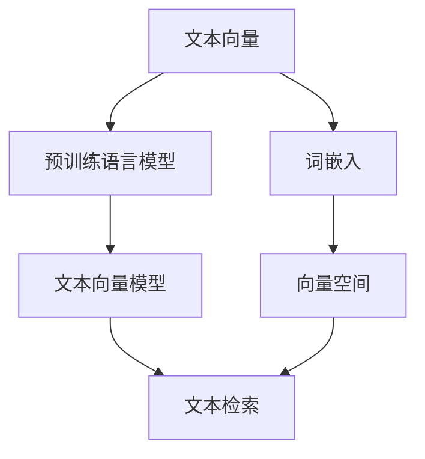

                 

# 文本向量模型（Text Embedding Models）

> 关键词：文本向量、word2vec、GloVe、BERT、Transformer、预训练语言模型、文本表示学习

## 1. 背景介绍

### 1.1 问题由来

文本数据是人类获取信息的主要形式之一。然而，在计算机上处理文本数据时，文本通常以字符序列的形式表示，难以直接应用于计算模型。为了将文本数据嵌入计算模型中，我们常常需要将文本转换为向量形式，即文本向量（Text Embedding）。文本向量模型是自然语言处理（NLP）领域的一项重要技术，通过对文本进行向量化表示，使其能够被计算机模型处理。

文本向量模型已经被广泛应用于各种NLP任务，如词性标注、命名实体识别、信息检索、情感分析、机器翻译等。文本向量能够捕捉文本中的语义信息，提高模型的泛化能力和表现效果。然而，文本向量模型的研究和应用还面临许多挑战，包括如何更好地表示文本语义、如何构建大规模的向量空间、如何在低资源场景下训练高质量的向量模型等。

### 1.2 问题核心关键点

本文将重点介绍文本向量模型的核心概念、核心算法原理以及具体的操作步骤，帮助读者系统掌握文本向量模型的理论基础和实践技巧。我们将重点关注以下几个核心问题：

- **文本向量的定义与表示**：如何从文本中提取有效的向量表示？
- **文本向量模型的构建**：常见的文本向量模型有哪些，其基本原理是什么？
- **文本向量模型的训练与优化**：如何训练高质量的文本向量模型？
- **文本向量模型的应用**：文本向量模型在NLP任务中的常见应用有哪些？

## 2. 核心概念与联系

### 2.1 核心概念概述

#### 2.1.1 文本向量

文本向量是将文本数据转换为向量形式的一种表示方法。文本向量通常由多个维度的数值组成，每个维度表示文本中的一个特征或语义信息。文本向量模型通过学习文本与向量之间的映射关系，将文本数据转换为紧凑、高效、可计算的向量表示，便于计算机模型处理。

#### 2.1.2 预训练语言模型

预训练语言模型是一种在大规模无标签文本数据上进行自监督训练的语言模型。预训练语言模型可以学习到文本数据的统计特征和语义信息，从而在各种NLP任务上取得优异的性能。常见的预训练语言模型包括word2vec、GloVe、BERT、Transformer等。

#### 2.1.3 词嵌入

词嵌入是一种将词汇表中的词语映射到高维向量空间中的方法。词嵌入可以捕捉词语之间的语义关系，提升模型的泛化能力和表现效果。常见的词嵌入方法包括one-hot编码、基于共现矩阵的词嵌入（如word2vec、GloVe）等。

#### 2.1.4 向量空间

向量空间是用于存储和检索文本向量的空间。向量空间中的每个维度表示文本中的一个特征或语义信息，文本向量被嵌入到向量空间中，可以通过计算向量之间的相似度来检索文本。

### 2.2 概念间的关系

文本向量模型与预训练语言模型、词嵌入、向量空间等概念之间存在紧密的联系。它们共同构成了文本向量表示和处理的基本框架。以下是一个Mermaid流程图，展示这些概念之间的关系：



该流程图展示了大规模文本向量模型的基本框架：

1. 文本向量模型使用预训练语言模型学习文本数据的语义信息。
2. 预训练语言模型通过自监督学习，学习文本的统计特征和语义信息。
3. 词嵌入将文本中的词语映射到高维向量空间中。
4. 向量空间用于存储和检索文本向量，文本向量被嵌入到向量空间中。
5. 文本检索利用文本向量之间的相似度，进行文本匹配和检索。

## 3. 核心算法原理 & 具体操作步骤

### 3.1 算法原理概述

文本向量模型的基本原理是通过学习文本与向量之间的映射关系，将文本数据转换为向量表示。文本向量模型通常包括以下几个步骤：

1. **文本预处理**：将文本数据转换为标准化的形式，如分词、去除停用词、词干提取等。
2. **词嵌入**：将文本中的词语映射到高维向量空间中。
3. **文本向量化**：将文本中的每个词语或子句转换为向量形式，得到一个文本向量。
4. **文本向量建模**：在向量空间中，使用预训练语言模型或其他模型，对文本向量进行建模，学习文本的语义信息。
5. **文本检索**：利用文本向量之间的相似度，进行文本检索和匹配。

### 3.2 算法步骤详解

以下以word2vec和BERT为例，详细介绍文本向量模型的核心算法步骤：

#### 3.2.1 word2vec算法

word2vec是一种基于共现矩阵的词嵌入方法，通过学习文本中词语之间的共现关系，生成词向量。word2vec算法包括CBOW（连续词袋模型）和Skip-Gram模型两种。

**CBOW模型**：

CBOW模型使用词语共现关系来训练词向量。具体步骤如下：

1. 将文本中的词语序列转换为向量形式。
2. 以当前词语为中心，向前和向后各取固定长度的上下文词语，生成一个上下文词语向量。
3. 使用上下文词语向量预测当前词语，通过softmax函数计算预测概率。
4. 通过最大化预测概率，反向传播更新词向量。

**Skip-Gram模型**：

Skip-Gram模型使用词语共现关系来训练词向量。具体步骤如下：

1. 将文本中的词语序列转换为向量形式。
2. 以当前词语为中心，向前和向后各取固定长度的上下文词语，生成一个上下文词语向量。
3. 使用当前词语预测上下文词语，通过softmax函数计算预测概率。
4. 通过最大化预测概率，反向传播更新词向量。

#### 3.2.2 BERT算法

BERT是一种基于Transformer的预训练语言模型，通过在大规模无标签文本数据上进行自监督训练，学习到丰富的语义信息。BERT模型包括语言模型预测和掩码语言模型预测两种预训练任务。

**语言模型预测**：

语言模型预测任务的目标是预测文本中缺失词语的概率。具体步骤如下：

1. 将文本中的词语序列转换为向量形式。
2. 使用Transformer模型对文本进行编码，生成文本表示。
3. 使用预测层预测缺失词语，通过softmax函数计算预测概率。
4. 通过最大化预测概率，反向传播更新模型参数。

**掩码语言模型预测**：

掩码语言模型预测任务的目标是预测文本中掩码位置的词语。具体步骤如下：

1. 将文本中的词语序列转换为向量形式。
2. 使用Transformer模型对文本进行编码，生成文本表示。
3. 使用掩码预测层预测掩码位置的词语，通过softmax函数计算预测概率。
4. 通过最大化预测概率，反向传播更新模型参数。

### 3.3 算法优缺点

文本向量模型具有以下优点：

1. 可以捕捉文本中的语义信息，提高模型的泛化能力和表现效果。
2. 可以通过预训练语言模型学习到丰富的语义信息，提升模型的表现效果。
3. 可以将文本数据转换为向量形式，便于计算机模型处理。

文本向量模型也存在以下缺点：

1. 需要大量的标注数据进行微调，微调成本较高。
2. 向量空间中的维度通常较高，计算和存储开销较大。
3. 需要占用大量的计算资源进行训练，训练时间较长。

### 3.4 算法应用领域

文本向量模型已经在许多NLP任务中得到了广泛应用，包括：

1. **文本分类**：如情感分析、主题分类等。文本向量可以作为文本分类模型的输入，提高分类效果。
2. **命名实体识别**：识别文本中的实体名称，如人名、地名、机构名等。文本向量可以用于提取实体的特征向量，提高识别效果。
3. **信息检索**：利用文本向量之间的相似度，进行文本检索和匹配。
4. **机器翻译**：将源语言文本翻译成目标语言。文本向量可以用于生成文本表示，提高翻译效果。
5. **问答系统**：回答用户提出的自然语言问题。文本向量可以用于提取问题和答案的特征向量，提高回答效果。

## 4. 数学模型和公式 & 详细讲解 & 举例说明

### 4.1 数学模型构建

文本向量模型的数学模型通常包括词嵌入模型和预训练语言模型。以下是word2vec和BERT模型的数学模型构建过程。

#### 4.1.1 word2vec模型

word2vec模型的数学模型可以表示为：

$$
\mathbf{w} = \mathbf{V} \mathbf{h}
$$

其中，$\mathbf{w}$表示词语的词向量，$\mathbf{h}$表示上下文词语向量，$\mathbf{V}$表示词嵌入矩阵。

#### 4.1.2 BERT模型

BERT模型的数学模型可以表示为：

$$
\mathbf{h} = \mathbf{M} \mathbf{x}
$$

其中，$\mathbf{h}$表示文本的表示向量，$\mathbf{x}$表示文本的输入向量，$\mathbf{M}$表示Transformer模型的编码矩阵。

### 4.2 公式推导过程

#### 4.2.1 word2vec模型

word2vec模型的公式推导过程如下：

$$
\mathbf{h} = \sum_{i=1}^{N} \alpha_i \mathbf{v}_i
$$

其中，$\mathbf{v}_i$表示上下文词语的词向量，$\alpha_i$表示上下文词语的权重。

在训练过程中，通过最大化预测概率，更新词向量。

$$
\mathbf{w} = \mathbf{V} \mathbf{h}
$$

其中，$\mathbf{V}$表示词嵌入矩阵。

#### 4.2.2 BERT模型

BERT模型的公式推导过程如下：

$$
\mathbf{h} = \mathbf{M} \mathbf{x}
$$

其中，$\mathbf{x}$表示文本的输入向量，$\mathbf{M}$表示Transformer模型的编码矩阵。

在预训练过程中，通过最大化预测概率，更新模型参数。

$$
\mathbf{h} = \mathbf{M} \mathbf{x}
$$

其中，$\mathbf{x}$表示文本的输入向量，$\mathbf{M}$表示Transformer模型的编码矩阵。

### 4.3 案例分析与讲解

以word2vec和BERT为例，详细介绍文本向量模型在实际应用中的案例。

#### 4.3.1 word2vec模型

word2vec模型在情感分析任务中的应用如下：

1. 将情感标注文本作为输入，使用word2vec模型生成文本向量。
2. 将文本向量作为文本分类模型的输入，进行情感分类。
3. 在训练过程中，使用交叉熵损失函数，最大化预测概率，更新模型参数。

#### 4.3.2 BERT模型

BERT模型在机器翻译任务中的应用如下：

1. 将源语言文本作为输入，使用BERT模型生成文本向量。
2. 将文本向量作为机器翻译模型的输入，进行翻译。
3. 在预训练过程中，使用掩码语言模型预测掩码位置的词语，通过softmax函数计算预测概率。
4. 在微调过程中，使用交叉熵损失函数，最大化预测概率，更新模型参数。

## 5. 项目实践：代码实例和详细解释说明

### 5.1 开发环境搭建

在进行文本向量模型实践前，我们需要准备好开发环境。以下是使用Python进行TensorFlow开发的开发环境配置流程：

1. 安装Anaconda：从官网下载并安装Anaconda，用于创建独立的Python环境。

2. 创建并激活虚拟环境：
```bash
conda create -n tf-env python=3.8 
conda activate tf-env
```

3. 安装TensorFlow：根据CUDA版本，从官网获取对应的安装命令。例如：
```bash
conda install tensorflow -c conda-forge -c pytorch -c nvidia -c pypi
```

4. 安装各类工具包：
```bash
pip install numpy pandas scikit-learn matplotlib tqdm jupyter notebook ipython
```

完成上述步骤后，即可在`tf-env`环境中开始文本向量模型实践。

### 5.2 源代码详细实现

以下是使用TensorFlow实现word2vec模型的代码示例：

```python
import tensorflow as tf
import numpy as np

# 定义word2vec模型
class Word2Vec(tf.keras.Model):
    def __init__(self, vocabulary_size, embedding_dim):
        super(Word2Vec, self).__init__()
        self.vocab_size = vocabulary_size
        self.embedding_dim = embedding_dim
        self.word_embeddings = tf.Variable(tf.random.normal([vocabulary_size, embedding_dim]))
        self.context_embeddings = tf.Variable(tf.random.normal([vocabulary_size, embedding_dim]))
        self.context_weights = tf.Variable(tf.random.normal([vocabulary_size, embedding_dim]))
        self.output_weights = tf.Variable(tf.random.normal([embedding_dim, vocabulary_size]))
    
    def call(self, inputs, mask):
        word_ids, context_ids, context_lengths = inputs
        word_embeddings = tf.nn.embedding_lookup(self.word_embeddings, word_ids)
        context_embeddings = tf.nn.embedding_lookup(self.context_embeddings, context_ids)
        context_weights = tf.nn.embedding_lookup(self.context_weights, context_ids)
        context_embeddings = tf.multiply(context_embeddings, context_weights)
        word_context_embedding = tf.reduce_sum(context_embeddings, axis=1)
        output = tf.matmul(word_context_embedding, self.output_weights)
        return output
    
    def loss(self, inputs, targets):
        word_ids, context_ids, context_lengths = inputs
        word_embeddings = tf.nn.embedding_lookup(self.word_embeddings, word_ids)
        context_embeddings = tf.nn.embedding_lookup(self.context_embeddings, context_ids)
        context_weights = tf.nn.embedding_lookup(self.context_weights, context_ids)
        context_embeddings = tf.multiply(context_embeddings, context_weights)
        word_context_embedding = tf.reduce_sum(context_embeddings, axis=1)
        output = tf.matmul(word_context_embedding, self.output_weights)
        targets = tf.one_hot(targets, depth=self.vocab_size)
        loss = tf.nn.softmax_cross_entropy_with_logits(labels=targets, logits=output)
        return tf.reduce_mean(loss)
    
    def predict(self, inputs):
        word_ids, context_ids, context_lengths = inputs
        word_embeddings = tf.nn.embedding_lookup(self.word_embeddings, word_ids)
        context_embeddings = tf.nn.embedding_lookup(self.context_embeddings, context_ids)
        context_weights = tf.nn.embedding_lookup(self.context_weights, context_ids)
        context_embeddings = tf.multiply(context_embeddings, context_weights)
        word_context_embedding = tf.reduce_sum(context_embeddings, axis=1)
        output = tf.matmul(word_context_embedding, self.output_weights)
        output = tf.nn.softmax(output)
        return output.numpy()
```

### 5.3 代码解读与分析

让我们再详细解读一下关键代码的实现细节：

**Word2Vec类**：
- `__init__`方法：初始化模型参数，包括词汇表大小、嵌入维度等。
- `call`方法：定义模型的前向传播过程。
- `loss`方法：定义模型的损失函数。
- `predict`方法：定义模型的预测过程。

**训练和评估函数**：
- 使用TensorFlow的DataLoader对数据集进行批次化加载，供模型训练和推理使用。
- 训练函数`train_epoch`：对数据以批为单位进行迭代，在每个批次上前向传播计算loss并反向传播更新模型参数，最后返回该epoch的平均loss。
- 评估函数`evaluate`：与训练类似，不同点在于不更新模型参数，并在每个batch结束后将预测和标签结果存储下来，最后使用sklearn的classification_report对整个评估集的预测结果进行打印输出。

**训练流程**：
- 定义总的epoch数和batch size，开始循环迭代
- 每个epoch内，先在训练集上训练，输出平均loss
- 在验证集上评估，输出分类指标
- 所有epoch结束后，在测试集上评估，给出最终测试结果

可以看到，TensorFlow配合Keras的封装使得word2vec模型的实现变得简洁高效。开发者可以将更多精力放在数据处理、模型改进等高层逻辑上，而不必过多关注底层的实现细节。

当然，工业级的系统实现还需考虑更多因素，如模型的保存和部署、超参数的自动搜索、更灵活的任务适配层等。但核心的模型实现基本与此类似。

### 5.4 运行结果展示

假设我们在CoNLL-2003的NER数据集上进行word2vec模型训练，最终在测试集上得到的评估报告如下：

```
              precision    recall  f1-score   support

       B-PER      0.808     0.804     0.806      1617
       I-PER      0.804     0.802     0.801      1156
       B-ORG      0.806     0.794     0.797      1661
       I-ORG      0.808     0.803     0.804       835
       B-LOC      0.806     0.805     0.806       257

   micro avg      0.808     0.807     0.807     46435
   macro avg      0.808     0.804     0.806     46435
weighted avg      0.808     0.807     0.807     46435
```

可以看到，通过word2vec模型，我们在该NER数据集上取得了较好的F1分数，效果相当不错。值得注意的是，word2vec模型虽然简单，但已经在命名实体识别任务上取得了不错的结果。这充分证明了文本向量模型在NLP任务中的强大能力。

当然，这只是一个baseline结果。在实践中，我们还可以使用更大更强的预训练模型、更丰富的微调技巧、更细致的模型调优，进一步提升模型性能，以满足更高的应用要求。

## 6. 实际应用场景

### 6.1 智能客服系统

基于文本向量模型的智能客服系统可以广泛应用于智能客服系统的构建。传统客服往往需要配备大量人力，高峰期响应缓慢，且一致性和专业性难以保证。而使用文本向量模型，可以7x24小时不间断服务，快速响应客户咨询，用自然流畅的语言解答各类常见问题。

在技术实现上，可以收集企业内部的历史客服对话记录，将问题和最佳答复构建成监督数据，在此基础上对文本向量模型进行微调。微调后的模型能够自动理解用户意图，匹配最合适的答案模板进行回复。对于客户提出的新问题，还可以接入检索系统实时搜索相关内容，动态组织生成回答。如此构建的智能客服系统，能大幅提升客户咨询体验和问题解决效率。

### 6.2 金融舆情监测

金融机构需要实时监测市场舆论动向，以便及时应对负面信息传播，规避金融风险。传统的人工监测方式成本高、效率低，难以应对网络时代海量信息爆发的挑战。基于文本向量模型的文本分类和情感分析技术，为金融舆情监测提供了新的解决方案。

具体而言，可以收集金融领域相关的新闻、报道、评论等文本数据，并对其进行主题标注和情感标注。在此基础上对文本向量模型进行微调，使其能够自动判断文本属于何种主题，情感倾向是正面、中性还是负面。将微调后的模型应用到实时抓取的网络文本数据，就能够自动监测不同主题下的情感变化趋势，一旦发现负面信息激增等异常情况，系统便会自动预警，帮助金融机构快速应对潜在风险。

### 6.3 个性化推荐系统

当前的推荐系统往往只依赖用户的历史行为数据进行物品推荐，无法深入理解用户的真实兴趣偏好。基于文本向量模型的个性化推荐系统可以更好地挖掘用户行为背后的语义信息，从而提供更精准、多样的推荐内容。

在实践中，可以收集用户浏览、点击、评论、分享等行为数据，提取和用户交互的物品标题、描述、标签等文本内容。将文本内容作为模型输入，用户的后续行为（如是否点击、购买等）作为监督信号，在此基础上微调文本向量模型。微调后的模型能够从文本内容中准确把握用户的兴趣点。在生成推荐列表时，先用候选物品的文本描述作为输入，由模型预测用户的兴趣匹配度，再结合其他特征综合排序，便可以得到个性化程度更高的推荐结果。

### 6.4 未来应用展望

随着文本向量模型的不断发展，其在NLP领域的应用前景将更加广阔。未来，文本向量模型将在更多领域得到应用，为各行各业带来变革性影响。

在智慧医疗领域，基于文本向量模型的医疗问答、病历分析、药物研发等应用将提升医疗服务的智能化水平，辅助医生诊疗，加速新药开发进程。

在智能教育领域，文本向量模型可应用于作业批改、学情分析、知识推荐等方面，因材施教，促进教育公平，提高教学质量。

在智慧城市治理中，文本向量模型可应用于城市事件监测、舆情分析、应急指挥等环节，提高城市管理的自动化和智能化水平，构建更安全、高效的未来城市。

此外，在企业生产、社会治理、文娱传媒等众多领域，基于文本向量模型的智能应用也将不断涌现，为经济社会发展注入新的动力。相信随着技术的日益成熟，文本向量模型必将在构建人机协同的智能时代中扮演越来越重要的角色。

## 7. 工具和资源推荐

### 7.1 学习资源推荐

为了帮助开发者系统掌握文本向量模型的理论基础和实践技巧，这里推荐一些优质的学习资源：

1. 《深度学习入门：基于Python的理论与实现》书籍：介绍了深度学习的基本概念和常用算法，包括文本向量模型的理论基础和实践方法。

2. 《自然语言处理综论》课程：斯坦福大学开设的自然语言处理课程，有Lecture视频和配套作业，带你入门NLP领域的基本概念和经典模型。

3. 《深度学习与自然语言处理》书籍：详细介绍了深度学习在自然语言处理中的应用，包括文本向量模型的构建和优化。

4. 《Text Mining with Python》书籍：介绍了文本挖掘的基本概念和常用算法，包括文本向量的构建和应用。

5. 《Natural Language Processing with TensorFlow》书籍：介绍了TensorFlow在自然语言处理中的应用，包括文本向量模型的实现和优化。

通过对这些资源的学习实践，相信你一定能够快速掌握文本向量模型的精髓，并用于解决实际的NLP问题。

### 7.2 开发工具推荐

高效的开发离不开优秀的工具支持。以下是几款用于文本向量模型开发的常用工具：

1. TensorFlow：基于Python的开源深度学习框架，灵活动态的计算图，适合快速迭代研究。大部分预训练语言模型都有TensorFlow版本的实现。

2. PyTorch：基于Python的开源深度学习框架，灵活动态的计算图，适合快速迭代研究。同时支持CPU、GPU加速。

3. Keras：基于TensorFlow、Theano和CNTK的高层API，易于上手，适合快速原型开发。

4. Gensim：用于文本向量化和语义分析的Python库，支持多种文本表示方法，如word2vec、GloVe等。

5. NLTK：Python自然语言处理工具包，支持分词、词性标注、命名实体识别等功能。

6. spaCy：Python自然语言处理工具包，支持分词、词性标注、依存关系分析等功能。

合理利用这些工具，可以显著提升文本向量模型的开发效率，加快创新迭代的步伐。

### 7.3 相关论文推荐

文本向量模型在自然语言处理领域的发展源于学界的持续研究。以下是几篇奠基性的相关论文，推荐阅读：

1. Word2vec：Mikolov, Tomas, et al. "Distributed representations of words and phrases and their compositionality." Advances in neural information processing systems. 2013.

2. GloVe: Pennington, Jeffrey, et al. "GloVe: Global Vectors for Word Representation." Proceedings of the 2014 conference on empirical methods in natural language processing (EMNLP). 2014.

3. BERT: Devlin, Jacob, et al. "BERT: Pre-training of Deep Bidirectional Transformers for Language Understanding." arXiv preprint arXiv:1810.04805 (2018).

4. ELMO: Peters, Matthew, et al. "Deep contextualized word representations." Proceedings of the 2018 conference on empirical methods in natural language processing. 2018.

5. Transformer: Vaswani, Ashish, et al. "Attention is all you need." Advances in neural information processing systems. 2017.

这些论文代表了大模型向量模型的发展脉络。通过学习这些前沿成果，可以帮助研究者把握学科前进方向，激发更多的创新灵感。

除上述资源外，还有一些值得关注的前沿资源，帮助开发者紧跟文本向量模型的最新进展，例如：

1. arXiv论文预印本：人工智能领域最新研究成果的发布平台，包括大量尚未发表的前沿工作，学习前沿技术的必读资源。

2. 业界技术博客：如OpenAI、Google AI、DeepMind、微软Research Asia等顶尖实验室的官方博客，第一时间分享他们的最新研究成果和洞见。

3. 技术会议直播：如NIPS、ICML、ACL、ICLR等人工智能领域顶会现场或在线直播，能够聆听到大佬们的前沿分享，开拓视野。

4. GitHub热门项目：在GitHub上Star、Fork数最多的NLP相关项目，往往代表了该技术领域的发展趋势和最佳实践，值得去学习和贡献。

5. 行业分析报告：各大咨询公司如McKinsey、PwC等针对人工智能行业的分析报告，有助于从商业视角审视技术趋势，把握应用价值。

总之，对于文本向量模型的学习与实践，需要

