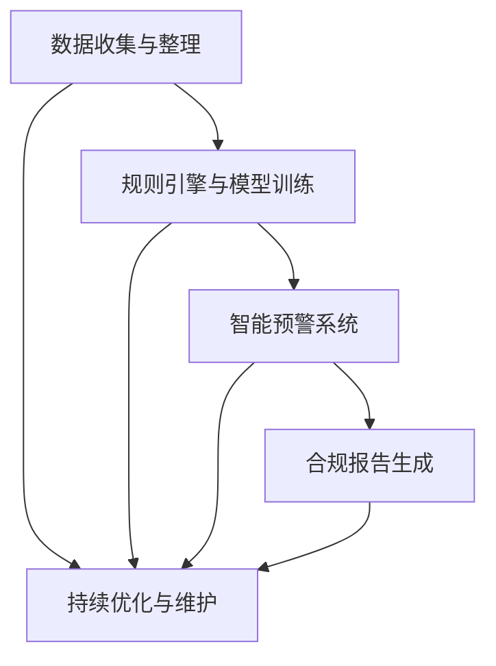

                 

## 1. 背景介绍

### 1.1 问题由来
随着全球金融市场的快速发展，合规风险管理成为金融机构日益重视的重要领域。传统的合规管理依赖大量人工审核和纸质文档，流程繁琐、效率低下、成本高昂，难以满足复杂多变的监管要求。智能合规系统利用人工智能和大数据技术，通过自动化、智能化的手段，极大地提升了合规管理的效率和准确性。

### 1.2 问题核心关键点
智能合规系统的核心在于如何高效地自动化处理合规风险信息，并在短时间内生成符合监管要求的合规报告。具体而言，包括以下几个关键点：

- **数据收集与整理**：从各类金融系统、内部记录、监管报告等渠道收集合规数据，并进行去重、清洗、格式化等处理。
- **规则引擎与模型训练**：基于监管法规，构建规则引擎和数据模型，实现对合规风险的自动识别和评估。
- **智能预警与报告生成**：实时监测合规风险指标，一旦违规行为发生，立即生成预警信息，并自动生成合规报告。
- **持续优化与维护**：定期更新规则和模型，确保合规系统能够及时响应监管政策变化，保持系统有效性和实时性。

### 1.3 问题研究意义
智能合规系统能够显著提升金融机构的合规管理能力，具有重要意义：

1. **提升效率与降低成本**：自动化处理合规数据，减少人工审核，缩短处理时间，降低运营成本。
2. **提高合规准确性**：通过先进的算法和模型，减少人为错误，确保合规判断的准确性和公正性。
3. **增强风险控制能力**：实时监测合规风险，提前预警，快速响应，降低违规风险。
4. **优化监管沟通**：自动生成合规报告，提高监管沟通效率，提升监管机构的信任度。
5. **支持合规创新**：智能合规系统为金融机构的合规创新提供了技术支撑，推动合规技术的发展。

## 2. 核心概念与联系

### 2.1 核心概念概述

智能合规系统主要包括以下几个核心概念：

- **智能合规管理**：利用人工智能和大数据技术，对合规风险进行自动化监测、识别和评估。
- **规则引擎**：基于监管法规和规则，构建的自动化决策引擎，实现对合规风险的智能识别和评估。
- **数据模型**：利用机器学习算法，对合规数据进行建模，以实现合规风险的自动预测和评估。
- **智能预警系统**：实时监测合规风险指标，一旦违规行为发生，立即发出预警信息。
- **合规报告生成**：自动生成符合监管要求的合规报告，便于监管机构审查和内部管理。

这些概念之间的联系紧密，共同构成了智能合规系统的核心架构：

1. **数据收集与整理**：为规则引擎和模型训练提供数据基础。
2. **规则引擎与模型训练**：基于规则和数据，实现对合规风险的自动化判断。
3. **智能预警系统**：实时监测合规风险，触发预警机制。
4. **合规报告生成**：生成符合监管要求的合规报告，用于内部管理和外部审计。
5. **持续优化与维护**：定期更新规则和模型，保持系统的有效性和实时性。

这些核心概念的协同工作，使得智能合规系统能够高效地处理合规风险，提升金融机构的合规管理能力。

### 2.2 概念间的关系

这些核心概念之间的关系可以通过以下Mermaid流程图来展示：



该流程图展示了智能合规系统的完整工作流程：

1. **数据收集与整理**：从各类金融系统、内部记录、监管报告等渠道收集合规数据，并进行去重、清洗、格式化等处理。
2. **规则引擎与模型训练**：基于监管法规，构建规则引擎和数据模型，实现对合规风险的自动识别和评估。
3. **智能预警系统**：实时监测合规风险指标，一旦违规行为发生，立即生成预警信息。
4. **合规报告生成**：自动生成符合监管要求的合规报告，便于监管机构审查和内部管理。
5. **持续优化与维护**：定期更新规则和模型，确保合规系统能够及时响应监管政策变化，保持系统有效性和实时性。

这些环节共同构成了一个高效、准确、可靠的智能合规系统，为金融机构提供了强大的合规风险管理能力。

## 3. 核心算法原理 & 具体操作步骤
### 3.1 算法原理概述

智能合规系统的核心算法原理主要包括数据预处理、规则引擎、机器学习模型训练、智能预警和报告生成等环节。

- **数据预处理**：从不同渠道收集合规数据，并进行清洗、格式化等处理，以便后续分析和建模。
- **规则引擎**：基于监管法规，构建规则库，实现对合规风险的自动判断。
- **机器学习模型训练**：利用历史合规数据，训练数据模型，实现合规风险的自动预测和评估。
- **智能预警系统**：实时监测合规风险指标，一旦违规行为发生，立即发出预警信息。
- **报告生成**：基于自动化判断和预测结果，生成符合监管要求的合规报告。

这些算法原理共同构成了智能合规系统的核心算法框架。

### 3.2 算法步骤详解

智能合规系统的具体操作步骤可以概括为以下几个关键步骤：

1. **数据收集与整理**：
   - 从各类金融系统、内部记录、监管报告等渠道收集合规数据。
   - 对数据进行清洗、去重、格式化等处理，确保数据的一致性和可用性。
   - 对数据进行分区，确保后续处理的效率和准确性。

2. **规则引擎与模型训练**：
   - 基于监管法规，构建规则库，定义合规风险的判断标准和处理流程。
   - 利用历史合规数据，训练机器学习模型，实现合规风险的自动预测和评估。
   - 对模型进行调优，确保其在新的数据集上的泛化性能。

3. **智能预警系统**：
   - 实时监测合规风险指标，如交易金额、交易频率等。
   - 当监测指标超出预设阈值时，立即触发预警机制，生成预警信息。
   - 将预警信息发送至相关人员，并记录预警日志。

4. **报告生成**：
   - 基于自动化判断和预测结果，生成符合监管要求的合规报告。
   - 报告应包含合规事件的时间、地点、参与人员、违规行为等关键信息。
   - 报告应清晰明了，便于监管机构审查和内部管理。

5. **持续优化与维护**：
   - 定期更新规则和模型，确保其能够及时响应监管政策变化。
   - 对系统进行性能优化和故障排查，确保系统的稳定性和可靠性。
   - 对系统进行安全加固，防止数据泄露和系统攻击。

### 3.3 算法优缺点

智能合规系统的优点主要体现在以下几个方面：

1. **高效性**：自动化处理合规数据，减少人工审核，缩短处理时间。
2. **准确性**：利用先进算法和模型，减少人为错误，确保合规判断的准确性和公正性。
3. **实时性**：实时监测合规风险，快速响应，提高合规管理的响应速度。
4. **成本低**：减少人工审核和纸质文档的使用，降低运营成本。
5. **灵活性**：规则和模型可以根据监管政策的变化进行动态更新，保持系统的实时性和有效性。

同时，智能合规系统也存在以下缺点：

1. **复杂性高**：系统构建和维护需要较高的技术门槛，对技术人员要求较高。
2. **数据依赖**：系统的有效性依赖于高质量的合规数据，数据不足可能导致系统失效。
3. **维护成本高**：系统更新和维护需要投入大量资源，成本较高。
4. **隐私风险**：处理大量敏感数据，需注意数据隐私和安全保护。
5. **依赖性强**：系统依赖金融机构的内部数据和规则，灵活性受限。

### 3.4 算法应用领域

智能合规系统在金融、证券、保险、银行等众多领域都有广泛应用，具体包括：

1. **金融风险管理**：监测和评估金融机构的合规风险，防范洗钱、反欺诈等风险。
2. **证券交易监管**：监控证券市场的合规交易行为，防范内幕交易、操纵市场等违规行为。
3. **保险业务合规**：监控和评估保险公司的合规行为，防范欺诈、误导消费者等风险。
4. **银行内部审计**：对银行的内部管理流程和风险控制措施进行审计和评估，确保合规性。
5. **法律法规遵守**：确保金融机构的业务操作符合相关法律法规，防范法律风险。

## 4. 数学模型和公式 & 详细讲解  
### 4.1 数学模型构建

智能合规系统主要涉及以下数学模型：

- **数据预处理模型**：对原始合规数据进行清洗、去重、格式化等处理，确保数据的一致性和可用性。
- **规则引擎模型**：基于监管法规，构建规则库，定义合规风险的判断标准和处理流程。
- **机器学习模型**：利用历史合规数据，训练数据模型，实现合规风险的自动预测和评估。

### 4.2 公式推导过程

假设有一批合规数据集 $D=\{(x_i, y_i)\}_{i=1}^N$，其中 $x_i$ 表示合规事件的属性，$y_i$ 表示合规事件的标签（合规或不合规）。

**数据预处理模型**：

- 数据清洗：去除噪声、重复数据等，确保数据的一致性。
- 数据标准化：将数据缩放到[0,1]区间，方便后续计算。

**规则引擎模型**：

- 定义合规风险的判断标准：
  - 合规风险 $R$ 可由一系列规则 $r_1, r_2, ..., r_n$ 描述，其中每个规则 $r_i$ 表示一个判断条件 $C_i$ 和一个处理结果 $H_i$。
  - 当 $C_i(x)$ 成立时，执行 $H_i$，否则跳过该规则。
  - 判断条件 $C_i$ 通常为逻辑表达式，如 $x_i > 10$。

**机器学习模型**：

- 假设选择线性回归模型，表示合规风险与合规事件属性之间的关系：
  - $R(x) = \theta_0 + \theta_1 x_1 + \theta_2 x_2 + ... + \theta_n x_n$
  - 其中 $\theta_0, \theta_1, \theta_2, ..., \theta_n$ 为模型参数。
  - 通过最小化损失函数 $L(\theta)$ 来优化模型参数。
  - 常用的损失函数为均方误差：
    - $L(\theta) = \frac{1}{N} \sum_{i=1}^N (R(x_i) - y_i)^2$

### 4.3 案例分析与讲解

以证券交易合规监控为例，假设有一批交易数据 $D=\{(x_i, y_i)\}_{i=1}^N$，其中 $x_i$ 表示交易行为（买入、卖出、大额交易等），$y_i$ 表示合规状态（合规、不合规）。

- **数据预处理**：对交易数据进行清洗和标准化处理，去除噪声数据，确保数据的一致性。
- **规则引擎**：定义交易合规的判断规则，如大额交易、频繁交易等，基于规则引擎判断每个交易是否合规。
- **机器学习模型**：利用历史交易数据训练模型，预测未来交易的合规状态。
- **智能预警系统**：实时监测交易数据，一旦发现违规行为，立即发出预警信息。
- **报告生成**：基于自动化判断和预测结果，生成合规报告，便于监管机构审查和内部管理。

## 5. 项目实践：代码实例和详细解释说明
### 5.1 开发环境搭建

智能合规系统的开发环境搭建主要包括以下几个步骤：

1. **安装Python和相关库**：
   - 安装Python，确保版本为3.8或更高。
   - 安装必要的Python库，如Pandas、NumPy、Scikit-Learn等。

2. **设置虚拟环境**：
   - 使用conda创建虚拟环境，确保开发环境的隔离性。
   - 激活虚拟环境，确保开发和运行时的依赖一致性。

3. **安装工具和框架**：
   - 安装数据处理工具，如Pandas、NumPy等。
   - 安装机器学习框架，如Scikit-Learn、TensorFlow等。
   - 安装规则引擎工具，如Apache Drools等。

### 5.2 源代码详细实现

以下是一个简化的智能合规系统代码实现，包括数据预处理、规则引擎和机器学习模型训练：

```python
# 数据预处理
import pandas as pd
from sklearn.preprocessing import StandardScaler

# 读取数据
data = pd.read_csv('compliance_data.csv')

# 数据清洗和标准化
data = data.dropna()
scaler = StandardScaler()
data['features'] = scaler.fit_transform(data[['feature1', 'feature2', 'feature3']])

# 规则引擎
import Drools

# 加载规则
rule = Drools.loadRule('compliance.drl')

# 执行规则
result = Drools.execute(rule, data)

# 机器学习模型
from sklearn.linear_model import LinearRegression

# 特征和标签
X = data[['feature1', 'feature2', 'feature3']]
y = data['compliance']

# 模型训练
model = LinearRegression()
model.fit(X, y)

# 预测新数据
new_data = pd.read_csv('new_compliance_data.csv')
new_data = new_data.dropna()
new_data['features'] = scaler.transform(new_data[['feature1', 'feature2', 'feature3']])
prediction = model.predict(new_data[['feature1', 'feature2', 'feature3']])
```

### 5.3 代码解读与分析

**数据预处理**：
- 使用Pandas读取合规数据，去除缺失值，并进行标准化处理。
- 标准化处理使数据更适合后续的机器学习模型训练。

**规则引擎**：
- 使用Drools构建规则引擎，定义合规风险的判断标准。
- Drools是一个开源的规则引擎，支持多种规则语言，能够方便地构建复杂的规则逻辑。

**机器学习模型**：
- 使用Scikit-Learn的LinearRegression模型，训练合规风险预测模型。
- 利用历史合规数据进行模型训练，生成合规风险预测结果。

**智能预警系统**：
- 实时监测合规风险指标，一旦违规行为发生，立即发出预警信息。
- 可以将预警信息发送至相关人员，并记录预警日志。

**报告生成**：
- 基于自动化判断和预测结果，生成符合监管要求的合规报告。
- 报告应包含合规事件的时间、地点、参与人员、违规行为等关键信息。

## 6. 实际应用场景
### 6.1 智能合规系统在金融风险管理中的应用

在金融风险管理中，智能合规系统能够实时监测和评估金融机构的合规风险，防范洗钱、反欺诈等风险。具体应用包括：

- **反洗钱监控**：监测交易金额、交易频率等指标，一旦发现异常行为，立即发出预警信息，并生成合规报告。
- **反欺诈监控**：实时监测交易行为，识别出可疑交易，防止欺诈行为发生。
- **内部审计**：对金融机构的内部管理流程和风险控制措施进行审计和评估，确保合规性。

### 6.2 智能合规系统在证券交易监管中的应用

在证券交易监管中，智能合规系统能够实时监控证券市场的合规交易行为，防范内幕交易、操纵市场等违规行为。具体应用包括：

- **市场监控**：实时监测证券市场的交易行为，识别出可疑交易，防止违规操作。
- **交易审核**：对证券交易行为进行审核，确保符合相关法律法规。
- **合规报告**：自动生成合规报告，便于监管机构审查和内部管理。

### 6.3 智能合规系统在保险业务合规中的应用

在保险业务合规中，智能合规系统能够监控和评估保险公司的合规行为，防范欺诈、误导消费者等风险。具体应用包括：

- **理赔审核**：自动审核理赔申请，确保符合保险合同规定，防范欺诈行为。
- **保险条款审核**：对保险条款进行合规性审查，确保符合相关法律法规。
- **客户投诉处理**：自动处理客户投诉，确保合规处理，提高客户满意度。

### 6.4 智能合规系统在银行内部审计中的应用

在银行内部审计中，智能合规系统能够对银行的内部管理流程和风险控制措施进行审计和评估，确保合规性。具体应用包括：

- **业务流程审计**：自动审核银行内部业务流程，确保符合相关法律法规。
- **风险控制评估**：对银行的风险控制措施进行评估，防范金融风险。
- **合规报告生成**：自动生成合规报告，便于内部管理和外部审计。

## 7. 工具和资源推荐
### 7.1 学习资源推荐

为了帮助开发者系统掌握智能合规系统的理论基础和实践技巧，这里推荐一些优质的学习资源：

1. **《人工智能在金融风险管理中的应用》**：本书系统介绍了人工智能在金融风险管理中的各种应用，包括智能合规系统的构建和实现。
2. **《机器学习在金融合规中的应用》**：本书深入探讨了机器学习在金融合规中的各种应用，包括数据预处理、规则引擎和模型训练等。
3. **《智能合规系统的设计与实现》**：本书详细介绍了智能合规系统的设计与实现，涵盖数据处理、规则引擎和模型训练等环节。
4. **《智能合规系统的案例分析》**：本书通过多个实际案例，展示了智能合规系统在不同行业中的应用，便于读者理解和借鉴。
5. **《智能合规系统的最佳实践》**：本书总结了智能合规系统的最佳实践，包括数据预处理、规则引擎和模型训练等技术细节。

通过对这些资源的学习实践，相信你一定能够快速掌握智能合规系统的精髓，并用于解决实际的金融合规问题。

### 7.2 开发工具推荐

高效的开发离不开优秀的工具支持。以下是几款用于智能合规系统开发的常用工具：

1. **Python**：Python是最常用的编程语言之一，具有丰富的库和工具支持，适合数据分析和机器学习任务。
2. **Pandas**：Pandas是Python中的数据分析库，支持数据清洗、转换和分析等操作。
3. **NumPy**：NumPy是Python中的数学库，支持高效的数值计算和矩阵运算。
4. **Scikit-Learn**：Scikit-Learn是Python中的机器学习库，支持多种机器学习算法的实现。
5. **Drools**：Drools是一个开源的规则引擎，支持多种规则语言，能够方便地构建复杂的规则逻辑。

合理利用这些工具，可以显著提升智能合规系统的开发效率，加快创新迭代的步伐。

### 7.3 相关论文推荐

智能合规系统的发展源于学界的持续研究。以下是几篇奠基性的相关论文，推荐阅读：

1. **《人工智能在金融风险管理中的应用》**：提出了一种基于人工智能的金融风险管理系统，包括数据预处理、规则引擎和机器学习模型训练等环节。
2. **《机器学习在金融合规中的应用》**：提出了一种基于机器学习的金融合规系统，通过历史数据训练模型，实现合规风险的自动预测和评估。
3. **《智能合规系统的设计与实现》**：详细介绍了智能合规系统的设计与实现，涵盖数据处理、规则引擎和模型训练等环节。
4. **《智能合规系统的案例分析》**：通过多个实际案例，展示了智能合规系统在不同行业中的应用，便于读者理解和借鉴。
5. **《智能合规系统的最佳实践》**：总结了智能合规系统的最佳实践，包括数据预处理、规则引擎和模型训练等技术细节。

这些论文代表了大语言模型微调技术的发展脉络。通过学习这些前沿成果，可以帮助研究者把握学科前进方向，激发更多的创新灵感。

除上述资源外，还有一些值得关注的前沿资源，帮助开发者紧跟智能合规系统的最新进展，例如：

1. **arXiv论文预印本**：人工智能领域最新研究成果的发布平台，包括大量尚未发表的前沿工作，学习前沿技术的必读资源。
2. **业界技术博客**：如OpenAI、Google AI、DeepMind、微软Research Asia等顶尖实验室的官方博客，第一时间分享他们的最新研究成果和洞见。
3. **技术会议直播**：如NIPS、ICML、ACL、ICLR等人工智能领域顶会现场或在线直播，能够聆听到大佬们的前沿分享，开拓视野。
4. **GitHub热门项目**：在GitHub上Star、Fork数最多的智能合规系统相关项目，往往代表了该技术领域的发展趋势和最佳实践，值得去学习和贡献。
5. **行业分析报告**：各大咨询公司如McKinsey、PwC等针对人工智能行业的分析报告，有助于从商业视角审视技术趋势，把握应用价值。

总之，对于智能合规系统的学习，需要开发者保持开放的心态和持续学习的意愿。多关注前沿资讯，多动手实践，多思考总结，必将收获满满的成长收益。

## 8. 总结：未来发展趋势与挑战
### 8.1 总结

本文对智能合规系统在风险管理中的应用进行了全面系统的介绍。首先阐述了智能合规系统的背景和意义，明确了其在提升金融机构的合规管理能力方面的独特价值。其次，从原理到实践，详细讲解了智能合规系统的核心算法原理和具体操作步骤，给出了智能合规系统开发的完整代码实例。同时，本文还广泛探讨了智能合规系统在金融、证券、保险、银行等众多领域的应用前景，展示了智能合规系统的广阔前景。最后，本文精选了智能合规系统的各类学习资源，力求为读者提供全方位的技术指引。

通过本文的系统梳理，可以看到，智能合规系统通过自动化处理合规风险信息，极大地提升了金融机构的合规管理能力，具有重要意义。未来，伴随技术的不懈探索和实践的持续优化，智能合规系统必将在更多行业领域得到应用，为社会带来更多的便利和效益。

### 8.2 未来发展趋势

展望未来，智能合规系统将呈现以下几个发展趋势：

1. **技术进步**：伴随人工智能和大数据技术的不断进步，智能合规系统的准确性和实时性将进一步提升，实现更高效的合规管理。
2. **应用扩展**：智能合规系统将在更多行业领域得到应用，如医疗、制造、能源等，帮助更多行业提升合规管理能力。
3. **系统集成**：智能合规系统将与其他系统进行更深入的集成，如与内部管理系统、审计系统等进行协同工作，提高合规管理效率。
4. **用户定制化**：智能合规系统将具备更强的用户定制化能力，根据不同机构的需求提供量身定制的合规管理方案。
5. **合规生态**：智能合规系统将构建起合规生态，与其他合规服务提供商、监管机构等进行互动，形成更全面的合规解决方案。

以上趋势凸显了智能合规系统的广阔前景。这些方向的探索发展，必将进一步提升金融机构的合规管理能力，为更多行业带来合规变革。

### 8.3 面临的挑战

尽管智能合规系统已经取得了瞩目成就，但在迈向更加智能化、普适化应用的过程中，它仍面临诸多挑战：

1. **技术门槛高**：智能合规系统构建和维护需要较高的技术门槛，对技术人员要求较高。
2. **数据依赖性强**：系统的有效性依赖于高质量的合规数据，数据不足可能导致系统失效。
3. **维护成本高**：系统更新和维护需要投入大量资源，成本较高。
4. **隐私风险**：处理大量敏感数据，需注意数据隐私和安全保护。
5. **依赖性强**：系统依赖金融机构的内部数据和规则，灵活性受限。

### 8.4 未来突破

面对智能合规系统面临的挑战，未来的研究需要在以下几个方面寻求新的突破：

1. **技术简化**：简化智能合规系统的构建和维护流程，降低技术门槛，提高易用性。
2. **数据扩充**：采用数据增强、数据补全等技术，扩充合规数据集，提升系统准确性。
3. **成本控制**：采用分布式计算、模型压缩等技术，降低系统维护成本。
4. **隐私保护**：采用数据脱敏、加密等技术，保护数据隐私和安全。
5. **灵活性增强**：开发更灵活的规则引擎和数据模型，提升系统的适应性。

这些研究方向的探索，必将引领智能合规系统迈向更高的台阶，为金融机构提供更加智能、高效、安全的合规管理服务。

## 9. 附录：常见问题与解答

**Q1：智能合规系统的准确性和可靠性如何保证？**

A: 智能合规系统的准确性和可靠性依赖于高质量的合规数据和先进的算法模型。在数据预处理阶段，应进行数据清洗和标准化处理，去除噪声数据，确保数据的一致性和可用性。在模型训练阶段，应选择适合任务的算法模型，并进行充分的调优，确保模型在新的数据集上的泛化性能。

**Q2：智能合规系统能否应对复杂的合规要求？**

A: 智能合规系统能够应对复杂的合规要求，但需要具备足够的规则引擎和数据模型。规则引擎应定义合规风险的判断标准和处理流程，能够涵盖各种合规要求。数据模型应具备足够的复杂度和鲁棒性，能够准确预测合规风险。

**Q3：智能合规系统的开发和维护成本如何控制？**

A: 智能合规系统的开发和维护成本可以通过采用分布式计算、模型压缩等技术进行控制。在开发阶段，应选择合适的开发工具和框架，提高开发效率。在维护阶段，应定期更新规则和模型，确保系统能够及时响应监管政策变化。

**Q4：智能合规系统能否与内部管理系统集成？**

A: 智能合规系统可以与内部管理系统进行深度集成，通过API接口进行数据交互和信息传递。在集成过程中，应确保系统的数据安全和隐私保护，防止数据泄露和系统攻击。

**

