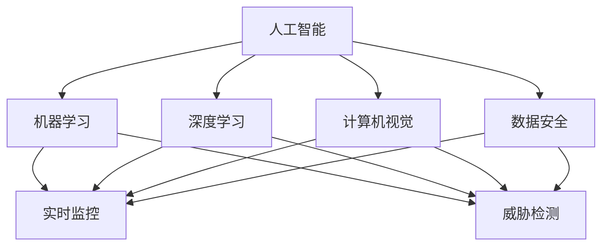
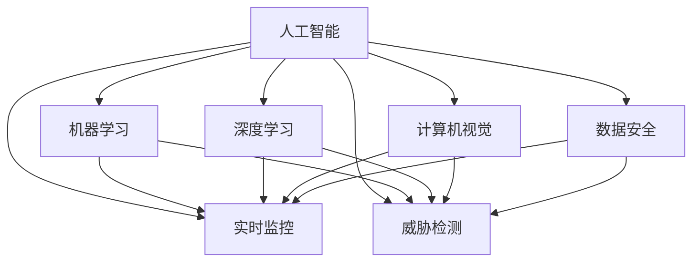

                 

# 智能安防创业：AI驱动的安全解决方案

> 关键词：
1. 人工智能
2. 机器学习
3. 深度学习
4. 计算机视觉
5. 数据安全
6. 实时监控
7. 威胁检测

## 1. 背景介绍

随着技术的进步和社会的发展，智能安防行业正处于快速增长的阶段。在城市安全、企业防护、个人隐私保护等领域，安防系统的需求日益增加。然而，传统的安防系统更多依赖人工监控和固定摄像头，无法有效识别和应对复杂的威胁，如入侵、盗窃、火灾等。而人工智能（AI）和机器学习（ML）技术的引入，为安防系统带来了全新的解决方案，将人机协作提升到一个新的高度。

人工智能在安防领域的应用，包括但不限于：
- 实时监控和视频分析
- 人脸识别和行为分析
- 异常检测和威胁识别
- 数据安全和隐私保护

AI驱动的安全解决方案，不仅能显著提高安防系统的效率和准确性，还能大幅降低人力成本，为安防公司带来新的商业机遇。因此，智能安防创业成为当下热门领域之一。

## 2. 核心概念与联系

### 2.1 核心概念概述

为了更好地理解智能安防创业的AI驱动解决方案，本节将介绍几个关键概念及其联系：

- **人工智能（AI）**：指的是利用计算机算法和数据处理能力，模拟人类智能过程的技术。
- **机器学习（ML）**：是一种让计算机通过数据学习和改进其性能的技术，是AI的重要组成部分。
- **深度学习（DL）**：是一种基于人工神经网络的ML技术，擅长处理大规模非结构化数据，如图像和语音。
- **计算机视觉（CV）**：利用计算机算法对图像和视频进行分析，识别物体、场景和行为的技术。
- **数据安全（DS）**：指保护数据免受未经授权的访问、使用、泄露、破坏、修改或销毁的技术。
- **实时监控**：指对特定区域进行连续、实时的图像和视频采集与分析，以便实时响应紧急情况。
- **威胁检测**：利用AI技术识别和分析潜在威胁，及时采取措施应对。

这些核心概念之间的联系可以通过以下Mermaid流程图来展示：



这个流程图展示了人工智能、机器学习、深度学习、计算机视觉和数据安全在智能安防中的作用及其联系：

1. 人工智能涵盖了机器学习和深度学习的核心能力，提供数据处理和决策支持。
2. 计算机视觉利用图像和视频数据进行分析和识别，实现实时监控和威胁检测。
3. 数据安全保障数据不被非法访问和篡改，维护系统的稳定性和可靠性。
4. 实时监控和威胁检测分别利用机器学习和深度学习的算法，提高监控效率和威胁识别能力。

### 2.2 概念间的关系

这些核心概念之间的逻辑关系可以进一步通过下面的Mermaid流程图来展示：



这个综合流程图展示了人工智能、机器学习、深度学习、计算机视觉和数据安全在智能安防中的综合作用及其联系。

## 3. 核心算法原理 & 具体操作步骤
### 3.1 算法原理概述

AI驱动的智能安防解决方案，通常基于以下几个核心算法：

- **卷积神经网络（CNN）**：用于图像和视频分析，识别物体、场景和行为。
- **循环神经网络（RNN）**：用于序列数据分析，如语音识别和行为模式识别。
- **深度信念网络（DBN）**：用于异常检测和威胁识别，通过层间互相关联的信念传递机制，学习复杂的数据分布。
- **支持向量机（SVM）**：用于分类和回归问题，如入侵检测和异常检测。
- **集成学习（Ensemble Learning）**：通过组合多个学习器的输出，提高模型的鲁棒性和准确性。

这些算法通常通过深度学习框架（如TensorFlow、PyTorch等）实现。

### 3.2 算法步骤详解

以下是AI驱动的智能安防解决方案的详细算法步骤：

1. **数据收集与预处理**：
   - 从摄像头、传感器等设备获取原始视频和图像数据。
   - 对数据进行清洗、标注和增强，以提高数据质量和模型泛化能力。

2. **模型训练与验证**：
   - 使用深度学习框架训练卷积神经网络（CNN）和循环神经网络（RNN）模型。
   - 使用标注数据进行模型训练，通过交叉验证和调参找到最优模型。

3. **实时监控与分析**：
   - 部署训练好的模型到服务器或云端，进行实时监控和视频分析。
   - 实时采集视频流，传入模型进行处理，提取关键特征和行为模式。

4. **异常检测与威胁识别**：
   - 利用深度信念网络（DBN）和支持向量机（SVM）进行异常检测和威胁识别。
   - 根据模型输出，进行进一步的分析和判断，如入侵检测和火灾预警。

5. **数据安全与隐私保护**：
   - 对关键数据进行加密和脱敏处理，保障数据安全。
   - 在数据传输和存储过程中，使用安全协议和加密技术。

6. **结果反馈与优化**：
   - 对模型输出结果进行评估和反馈，优化模型性能。
   - 定期收集新数据进行模型更新和重新训练。

### 3.3 算法优缺点

AI驱动的智能安防解决方案具有以下优点：

- **高准确性和实时性**：通过深度学习和机器学习算法，能够实现高准确性的分析和快速响应。
- **成本低廉**：减少了对人工监控和人工分析的依赖，降低了人力成本。
- **数据驱动**：利用大规模数据训练模型，提高了模型的泛化能力和鲁棒性。

但同时，也存在一些缺点：

- **依赖高质量数据**：模型的训练和优化需要大量高质量的标注数据，数据获取成本较高。
- **算法复杂度**：深度学习和机器学习算法复杂度较高，需要较高的计算资源和专业技能。
- **隐私和安全问题**：大量数据的处理和存储，可能导致隐私泄露和安全问题。

### 3.4 算法应用领域

AI驱动的智能安防解决方案已经在多个领域得到应用，包括但不限于：

- **城市安防**：用于监控城市公共区域，如街道路口、地铁、机场等，及时发现异常行为和威胁。
- **企业防护**：用于监控企业内部和外部，预防盗窃、破坏、间谍等行为。
- **个人安全**：用于家庭安防，如智能门锁、入侵检测、异常行为预警等。
- **交通监控**：用于交通路口的实时监控和违法行为识别，提高交通管理效率。
- **工业安全**：用于工业企业的安全监控和异常行为检测，预防工业事故和安全隐患。

## 4. 数学模型和公式 & 详细讲解 & 举例说明

### 4.1 数学模型构建

以图像分类任务为例，建立一个卷积神经网络（CNN）模型：

- **输入**：原始图像像素矩阵 $X \in \mathbb{R}^{H \times W \times C}$，其中 $H$、$W$ 分别为图像的高度和宽度，$C$ 为图像通道数（RGB）。
- **卷积层**：使用卷积核对输入图像进行特征提取，输出特征图 $Y \in \mathbb{R}^{H' \times W' \times F}$，其中 $H'$、$W'$ 为特征图的高度和宽度，$F$ 为特征图通道数。
- **池化层**：对特征图进行下采样，减小特征图大小，减少计算量。
- **全连接层**：将池化层的输出连接成向量，输入到全连接层进行分类。

### 4.2 公式推导过程

卷积神经网络（CNN）的公式推导如下：

设卷积核大小为 $k \times k$，步长为 $s$，则卷积操作可以表示为：

$$ Y_{i,j} = \sum_{m=0}^{k-1} \sum_{n=0}^{k-1} W_{m,n} \times X_{i+m,j+n} $$

其中，$X_{i+m,j+n}$ 为输入图像的卷积核位置，$W_{m,n}$ 为卷积核权重。

### 4.3 案例分析与讲解

以图像分类为例，假设我们有一张 $32 \times 32$ 的彩色图像，经过一层 $3 \times 3$ 的卷积核和步长 $1$ 的池化层，可以得到一张 $16 \times 16$ 的特征图，通道数为 $64$。具体计算过程如下：

```
输入：X = [R, G, B] \in \mathbb{R}^{32 \times 32 \times 3}
卷积核：W = [W_{m,n}]_{3 \times 3}
输出：Y = [Y_{i,j}]_{16 \times 16 \times 64}
```

$$ Y_{i,j} = \sum_{m=0}^{2} \sum_{n=0}^{2} W_{m,n} \times X_{i+m,j+n} $$

## 5. 项目实践：代码实例和详细解释说明

### 5.1 开发环境搭建

在进行智能安防系统的开发之前，需要搭建一个开发环境。以下是Python开发环境搭建的步骤：

1. 安装Python：从官网下载并安装Python，建议使用Python 3.7及以上版本。
2. 安装必要的库：
   - 安装TensorFlow和Keras：
     ```bash
     pip install tensorflow
     pip install keras
     ```
   - 安装OpenCV：
     ```bash
     pip install opencv-python
     ```
   - 安装numpy和pandas：
     ```bash
     pip install numpy
     pip install pandas
     ```
   - 安装Flask：
     ```bash
     pip install flask
     ```

### 5.2 源代码详细实现

以下是一个简单的图像分类模型的Python代码实现：

```python
import tensorflow as tf
from tensorflow.keras import layers, models

# 定义卷积神经网络
model = models.Sequential()
model.add(layers.Conv2D(32, (3, 3), activation='relu', input_shape=(32, 32, 3)))
model.add(layers.MaxPooling2D((2, 2)))
model.add(layers.Conv2D(64, (3, 3), activation='relu'))
model.add(layers.MaxPooling2D((2, 2)))
model.add(layers.Conv2D(128, (3, 3), activation='relu'))
model.add(layers.MaxPooling2D((2, 2)))
model.add(layers.Flatten())
model.add(layers.Dense(64, activation='relu'))
model.add(layers.Dense(10, activation='softmax'))

# 编译模型
model.compile(optimizer='adam',
              loss='sparse_categorical_crossentropy',
              metrics=['accuracy'])

# 训练模型
model.fit(train_images, train_labels, epochs=10, validation_data=(test_images, test_labels))
```

以上代码中，我们使用TensorFlow和Keras构建了一个简单的卷积神经网络（CNN）模型，包含多个卷积层、池化层和全连接层。模型通过Adam优化器进行编译和训练，使用交叉熵损失函数和准确率作为评价指标。

### 5.3 代码解读与分析

以上代码实现了一个简单的图像分类模型，具体解读如下：

- `Conv2D` 层：用于卷积操作，提取图像特征。
- `MaxPooling2D` 层：用于下采样，减小特征图大小。
- `Flatten` 层：将特征图展平，方便输入到全连接层。
- `Dense` 层：用于全连接操作，实现分类。
- `Model` 类：用于创建和编译模型，指定优化器和损失函数。
- `fit` 方法：用于训练模型，指定训练集和验证集。

## 6. 实际应用场景

### 6.1 城市安防

在城市安防领域，智能安防系统可以应用于以下几个方面：

- **视频监控**：在街道路口、地铁站、商场等公共区域部署摄像头，实时监控视频流。
- **行为分析**：利用计算机视觉技术，识别异常行为，如走失儿童、人员聚集等。
- **入侵检测**：通过深度学习算法，实时检测入侵行为，如翻越围栏、尾随跟踪等。
- **火灾预警**：利用计算机视觉和红外传感器，实时检测火灾烟雾和火焰，及时预警。

### 6.2 企业防护

在企业防护领域，智能安防系统可以应用于以下几个方面：

- **监控摄像头**：在企业内部和外部部署摄像头，实时监控视频流。
- **入侵检测**：通过深度学习算法，实时检测入侵行为，如翻越围栏、破坏门锁等。
- **异常行为分析**：利用计算机视觉技术，识别异常行为，如斗殴、失窃等。
- **访客管理**：通过人脸识别技术，验证访客身份，控制访问权限。

### 6.3 个人安全

在个人安全领域，智能安防系统可以应用于以下几个方面：

- **智能门锁**：通过人脸识别技术，控制门锁开关，提高安全性。
- **入侵检测**：利用深度学习算法，实时检测入侵行为，如撬锁、破坏门窗等。
- **异常行为分析**：利用计算机视觉技术，识别异常行为，如暴力冲突、盗窃等。
- **紧急报警**：在检测到危险行为时，自动触发报警系统，及时通知业主和安保人员。

## 7. 工具和资源推荐

### 7.1 学习资源推荐

为了帮助开发者掌握智能安防创业的技术，以下推荐一些优质的学习资源：

- **《深度学习》书籍**：由Ian Goodfellow、Yoshua Bengio和Aaron Courville共同编写，系统介绍了深度学习的基础理论和实践方法。
- **Coursera深度学习课程**：由Andrew Ng教授主讲的深度学习课程，涵盖了深度学习的基本概念、模型训练和优化技术。
- **Kaggle竞赛**：参加Kaggle上的图像分类和行为识别竞赛，实战练习深度学习算法。
- **GitHub开源项目**：在GitHub上寻找和智能安防相关的开源项目，学习其代码实现和设计思路。

### 7.2 开发工具推荐

智能安防系统的开发需要使用多种工具，以下是一些推荐工具：

- **TensorFlow**：谷歌开发的深度学习框架，支持多种GPU和TPU硬件加速，适合大规模模型训练。
- **PyTorch**：Facebook开发的深度学习框架，支持动态计算图，灵活度高，适合研究和原型开发。
- **OpenCV**：开源计算机视觉库，支持图像和视频处理、特征提取等。
- **Flask**：Python Web框架，支持快速搭建API接口，便于部署和集成。
- **AWS SageMaker**：亚马逊提供的云端机器学习平台，支持深度学习模型的训练和部署。

### 7.3 相关论文推荐

智能安防领域的最新研究论文，推荐阅读以下几篇：

- **"Real-Time Object Detection with a Single Shot MultiBox Detector"**：由Joseph Redmon等人在2015年提出的YOLO算法，用于实时目标检测。
- **"Deep Learning for Person Re-identification: A Survey"**：由Hui-Yu Li等人在2017年总结的人脸识别算法综述，介绍了多种深度学习模型和人脸识别技术。
- **"Leveraging Transfer Learning for Deep Face Recognition"**：由Shan Li等人在2017年提出的基于迁移学习的深度人脸识别算法，提高了人脸识别精度。
- **"Deep Learning for Intrusion Detection: A Survey"**：由Chenghao Li等人在2018年总结的入侵检测算法综述，介绍了多种深度学习模型和入侵检测技术。

## 8. 总结：未来发展趋势与挑战

### 8.1 研究成果总结

智能安防领域的AI驱动解决方案，通过深度学习和计算机视觉技术，大幅提升了安防系统的效率和准确性，减少了人力成本。在城市安防、企业防护、个人安全等多个领域，智能安防系统已得到广泛应用。

### 8.2 未来发展趋势

智能安防领域未来将呈现以下几个发展趋势：

- **实时视频分析**：利用深度学习算法，实时处理视频流，提高监控效率和响应速度。
- **多模态融合**：结合图像、视频、声音等多种数据源，实现更加全面和精准的安防监控。
- **边缘计算**：利用边缘计算技术，实现视频和数据在本地处理和存储，减少云端计算和存储成本。
- **联邦学习**：利用分布式计算和加密技术，保障数据隐私和安全，同时提高模型性能。

### 8.3 面临的挑战

智能安防领域的发展也面临一些挑战：

- **数据获取成本高**：高质量的安防数据获取成本较高，需要投入大量人力和财力。
- **算法复杂度高**：深度学习算法和计算机视觉技术复杂度高，需要专业的技术人才和计算资源。
- **隐私和安全问题**：大量数据的处理和存储，可能导致隐私泄露和安全问题，需要加强数据保护措施。
- **实时性要求高**：实时视频和数据处理要求高，需要优化算法和硬件配置。

### 8.4 研究展望

未来的智能安防研究需要在以下几个方面进行突破：

- **数据增强技术**：利用数据增强技术，提高数据质量和泛化能力，降低数据获取成本。
- **轻量级模型**：开发轻量级模型，降低计算和存储成本，提高实时性。
- **联邦学习**：利用联邦学习技术，保障数据隐私和安全，同时提高模型性能。
- **多模态融合**：结合图像、视频、声音等多种数据源，实现更加全面和精准的安防监控。
- **边缘计算**：利用边缘计算技术，实现视频和数据在本地处理和存储，减少云端计算和存储成本。

## 9. 附录：常见问题与解答

### Q1: 智能安防系统的核心技术是什么？

**A1:** 智能安防系统的核心技术包括深度学习算法、计算机视觉技术、数据安全和隐私保护技术等。其中，深度学习算法是实现智能监控和异常检测的基础，计算机视觉技术是实现目标识别和行为分析的关键，数据安全和隐私保护技术是保障系统可靠性的重要手段。

### Q2: 智能安防系统的应用场景有哪些？

**A2:** 智能安防系统的应用场景包括城市安防、企业防护、个人安全、交通监控、工业安全等。在这些场景中，智能安防系统能够实时监控视频流，检测异常行为，实现威胁预警和紧急响应，提高安全性。

### Q3: 智能安防系统如何保护数据隐私和安全？

**A3:** 智能安防系统通过以下措施保护数据隐私和安全：
1. 数据加密和脱敏处理：对关键数据进行加密和脱敏处理，保障数据安全。
2. 安全协议：在数据传输过程中，使用安全协议保障数据传输的安全性。
3. 访问控制：采用访问控制技术，限制数据访问权限，防止未经授权的访问。

### Q4: 智能安防系统的开发难点有哪些？

**A4:** 智能安防系统的开发难点包括：
1. 数据获取成本高：高质量的安防数据获取成本较高，需要投入大量人力和财力。
2. 算法复杂度高：深度学习算法和计算机视觉技术复杂度高，需要专业的技术人才和计算资源。
3. 实时性要求高：实时视频和数据处理要求高，需要优化算法和硬件配置。

### Q5: 智能安防系统的未来发展方向是什么？

**A5:** 智能安防系统的未来发展方向包括：
1. 实时视频分析：利用深度学习算法，实时处理视频流，提高监控效率和响应速度。
2. 多模态融合：结合图像、视频、声音等多种数据源，实现更加全面和精准的安防监控。
3. 边缘计算：利用边缘计算技术，实现视频和数据在本地处理和存储，减少云端计算和存储成本。
4. 联邦学习：利用联邦学习技术，保障数据隐私和安全，同时提高模型性能。

---

作者：禅与计算机程序设计艺术 / Zen and the Art of Computer Programming

