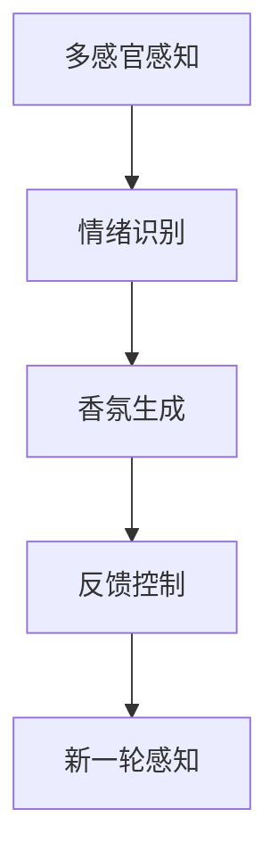

                 

# 智能家居香氛创业：情绪管理的嗅觉体验

## 1. 背景介绍

### 1.1 问题由来

随着人们生活水平的提升和个性化需求的增加，智能家居系统在家庭生活中的应用越来越广泛。传统的智能家居系统主要以温度、湿度、光照、安防等物理环境要素为主，但随着生活质量要求的提高，人们对于精神、情感方面的需求也越来越高。特别是近年来，心理健康问题成为社会关注的热点，越来越多的人希望能够在家庭环境中通过感官刺激来缓解压力，改善情绪。这使得智能家居领域向更加智能化、个性化、情感化的方向发展，智能香氛系统应运而生。

智能香氛系统通过结合香气、声音、光线等多维感官体验，将人的情绪状态与家居环境联动起来，通过香氛的引导与调整，帮助用户改善情绪，提高生活质量。这种将多感官与情感管理相结合的创新模式，不仅为家庭生活带来了全新的体验，也为家居行业的智能化发展注入了新的活力。

### 1.2 问题核心关键点

智能香氛系统涉及的核心技术包括多感官感知与分析、情绪识别与反馈、香氛生成与控制等。其中，多感官感知与分析是指通过传感器（如气味传感器、温度传感器、光线传感器等）收集家庭环境中的多维数据；情绪识别与反馈是指通过机器学习模型分析用户的情绪状态，并将结果反馈到香氛生成系统；香氛生成与控制是指根据用户情绪状态自动生成或控制香氛的浓度与种类。

智能香氛系统涉及的核心问题包括：
1. 如何高效地捕捉和分析多维感知数据？
2. 如何精确地识别和理解用户的情绪状态？
3. 如何智能地生成和控制香氛以适应用户的情绪变化？

### 1.3 问题研究意义

智能香氛系统将香氛、情绪与智能家居系统紧密结合，为家庭情感管理提供了新的解决方案。其研究意义主要体现在以下几个方面：

1. **改善心理健康**：智能香氛系统通过调节香氛，帮助用户缓解压力、放松心情，有助于提高用户的心理健康水平。
2. **提升生活质量**：通过个性化的香氛体验，提升用户的居家舒适度和满意度。
3. **推动产业升级**：智能香氛系统的开发与应用，有助于推动家居行业向智能化、情感化方向发展。
4. **促进跨学科融合**：该系统融合了心理学、神经科学、人工智能等多个领域的知识，促进了不同学科之间的交流与合作。
5. **催生创新商业模式**：智能香氛系统可结合智能家居系统，提供更加个性化的服务，为家居行业带来新的商业机会。

## 2. 核心概念与联系

### 2.1 核心概念概述

在智能香氛系统中，涉及多个关键概念，包括但不限于：

- **多感官感知**：通过传感器捕捉室内环境中的气味、光线、温度、湿度等多维数据，构建家庭环境的全貌。
- **情绪识别**：利用机器学习模型分析用户的情绪状态，包括但不限于高兴、悲伤、紧张、放松等。
- **香氛生成**：根据用户情绪状态和偏好，智能生成或控制香氛的浓度和种类。
- **反馈控制**：通过用户反馈信息（如满意度、情绪变化等），优化香氛生成策略，提升用户体验。

这些核心概念之间存在紧密的联系，形成了一个完整的智能香氛系统框架。下面，我们将通过Mermaid流程图展示这些概念之间的逻辑关系：


这个流程图展示了智能香氛系统的主要流程：通过多感官感知获取环境数据，利用情绪识别分析用户情绪，根据香氛生成生成个性化香氛，并根据用户反馈进行动态调整。通过这种闭环机制，系统不断优化香氛生成策略，提高用户体验。

### 2.2 概念间的关系

这些核心概念之间相互影响，形成一个动态闭环系统。下面，我们将通过几个Mermaid流程图展示这些概念之间的关系。

#### 2.2.1 多感官感知与情绪识别的联系


这个流程图展示了多感官感知与情绪识别的联系。多感官感知获取的环境数据（如气味、光线、温度等）输入到情绪识别模块中，通过机器学习模型分析用户的情绪状态。

#### 2.2.2 香氛生成与反馈控制的联系


这个流程图展示了香氛生成与反馈控制的联系。香氛生成模块根据用户情绪状态和偏好生成个性化香氛，并通过反馈控制模块根据用户反馈信息进行动态调整。

#### 2.2.3 闭环系统的工作流程



这个综合流程图展示了智能香氛系统的闭环工作流程：通过多感官感知获取环境数据，分析用户情绪，生成个性化香氛，根据用户反馈进行动态调整，并重新感知环境，进入下一轮循环。

### 2.3 核心概念的整体架构

最后，我们将这些核心概念在智能香氛系统中进行整合，形成了一个完整的系统架构。以下是一个综合的流程图：


这个综合流程图展示了智能香氛系统的核心架构：多感官感知获取环境数据，情绪识别分析用户情绪，香氛生成生成个性化香氛，反馈控制根据用户反馈进行动态调整，形成一个闭环系统。

## 3. 核心算法原理 & 具体操作步骤

### 3.1 算法原理概述

智能香氛系统的核心算法包括多感官感知数据分析、情绪识别、香氛生成和反馈控制等。这些算法主要基于深度学习、强化学习、时间序列分析等技术。下面，我们将详细介绍这些核心算法的原理。

#### 3.1.1 多感官感知数据分析

多感官感知数据分析是指通过传感器获取环境数据（如气味、光线、温度等），并利用机器学习模型对这些数据进行特征提取和分析。常见的数据处理方法包括：

- **特征提取**：将传感器数据转换为数值特征，如气味特征向量、光线强度等。
- **时序分析**：对时间序列数据进行统计分析，提取规律和模式。
- **融合算法**：将不同传感器数据进行融合，提高数据质量。

#### 3.1.2 情绪识别

情绪识别是指通过分析用户的多感官感知数据（如面部表情、语音、行为等），利用机器学习模型识别用户的情绪状态。常见的情绪识别方法包括：

- **特征提取**：提取用户的面部表情、语音特征、行为特征等。
- **情感分类**：利用情感分类模型（如SVM、CNN、RNN等）对用户情绪进行分类。
- **实时识别**：利用实时处理算法（如卷积神经网络、循环神经网络等）实现实时情绪识别。

#### 3.1.3 香氛生成

香氛生成是指根据用户情绪状态和偏好，智能生成或控制香氛的浓度和种类。常见的香氛生成方法包括：

- **香氛库构建**：构建包含多种香氛的库，如香水、香薰油、空气清新剂等。
- **生成算法**：利用生成对抗网络（GAN）、变分自编码器（VAE）等生成算法生成个性化香氛。
- **控制算法**：利用PID控制、模糊控制等控制算法，调节香氛的浓度和种类。

#### 3.1.4 反馈控制

反馈控制是指通过用户反馈信息（如满意度、情绪变化等），优化香氛生成策略，提升用户体验。常见的反馈控制方法包括：

- **用户反馈采集**：通过问卷调查、用户评价等方式采集用户反馈信息。
- **数据分析**：利用机器学习模型分析用户反馈，提取有价值的信息。
- **策略优化**：根据用户反馈信息，优化香氛生成策略，提升用户体验。

### 3.2 算法步骤详解

#### 3.2.1 多感官感知数据采集

多感官感知数据的采集通常通过多种传感器（如气味传感器、光线传感器、温度传感器等）实现。数据采集流程包括：

- **传感器安装**：将传感器安装在家庭环境中，确保覆盖所有关键区域。
- **数据采集**：通过传感器实时采集多维数据，存储到本地或云端。
- **数据预处理**：对采集到的数据进行去噪、标准化等预处理，提高数据质量。

#### 3.2.2 情绪识别模型训练

情绪识别模型的训练过程包括数据准备、模型选择、模型训练和模型评估。具体步骤如下：

- **数据准备**：收集用户的多感官感知数据和标注数据（如面部表情、语音等），进行数据清洗和预处理。
- **模型选择**：选择合适的机器学习模型（如SVM、CNN、RNN等）进行训练。
- **模型训练**：使用标注数据训练模型，调整模型参数，提高模型准确率。
- **模型评估**：在验证集上评估模型性能，调整模型超参数，优化模型效果。

#### 3.2.3 香氛生成策略设计

香氛生成策略的设计过程包括香氛库构建、生成算法选择和控制算法设计。具体步骤如下：

- **香氛库构建**：收集各种香氛信息，构建包含多种香氛的库。
- **生成算法选择**：选择合适的生成算法（如GAN、VAE等），设计生成模型。
- **控制算法设计**：选择合适的控制算法（如PID控制、模糊控制等），设计控制模型。
- **策略集成**：将生成算法和控制算法集成到香氛生成系统中，形成完整的香氛生成策略。

#### 3.2.4 反馈控制机制设计

反馈控制机制的设计过程包括用户反馈采集、数据分析和策略优化。具体步骤如下：

- **用户反馈采集**：通过问卷调查、用户评价等方式收集用户反馈数据。
- **数据分析**：利用机器学习模型分析用户反馈，提取有价值的信息。
- **策略优化**：根据用户反馈信息，优化香氛生成策略，提升用户体验。
- **策略应用**：将优化后的策略应用到香氛生成系统中，实现动态调整。

### 3.3 算法优缺点

智能香氛系统涉及的算法具有以下优缺点：

#### 优点

- **多感官融合**：通过融合多种传感器数据，构建家庭环境的全貌，提供更加全面的体验。
- **个性化香氛**：根据用户情绪状态和偏好，生成个性化香氛，提升用户体验。
- **实时反馈**：通过实时反馈机制，动态调整香氛生成策略，提高用户体验。

#### 缺点

- **高成本**：多传感器采集和分析数据需要较高的硬件和软件成本。
- **数据隐私**：用户的多感官感知数据可能涉及隐私问题，需要严格的隐私保护措施。
- **模型复杂性**：算法模型的设计和训练过程较为复杂，需要大量的数据和计算资源。

### 3.4 算法应用领域

智能香氛系统可以应用于多个领域，包括但不限于：

- **家居环境**：通过调节香氛，改善家庭环境，提升居住舒适度和幸福感。
- **办公室环境**：通过调节香氛，缓解工作压力，提高工作效率。
- **医疗保健**：通过调节香氛，帮助患者放松心情，缓解焦虑，提高治疗效果。
- **心理健康**：通过调节香氛，帮助用户缓解心理压力，提升心理健康水平。

## 4. 数学模型和公式 & 详细讲解 & 举例说明

### 4.1 数学模型构建

智能香氛系统的数学模型包括多感官感知数据分析模型、情绪识别模型、香氛生成模型和反馈控制模型。这些模型主要基于深度学习、强化学习、时间序列分析等技术。

#### 4.1.1 多感官感知数据分析模型

多感官感知数据分析模型主要基于时间序列分析技术。设$X_t$为$t$时刻的多维感知数据，$Y_t$为$t$时刻的情绪状态，则数据分析模型可以表示为：

$$
Y_t = f(X_1, X_2, \ldots, X_t)
$$

其中$f$为时间序列模型（如ARIMA、LSTM等）。

#### 4.1.2 情绪识别模型

情绪识别模型主要基于分类模型。设$X_t$为$t$时刻的多维感知数据，$y_t$为$t$时刻的情绪状态（如高兴、悲伤等），则情绪识别模型可以表示为：

$$
y_t = h(X_t; \theta)
$$

其中$h$为分类模型（如SVM、CNN、RNN等），$\theta$为模型参数。

#### 4.1.3 香氛生成模型

香氛生成模型主要基于生成模型。设$Z_t$为$t$时刻的香氛生成策略，$X_t$为$t$时刻的多维感知数据，则香氛生成模型可以表示为：

$$
X_t = g(Z_t; \phi)
$$

其中$g$为生成模型（如GAN、VAE等），$\phi$为模型参数。

#### 4.1.4 反馈控制模型

反馈控制模型主要基于强化学习模型。设$X_t$为$t$时刻的多维感知数据，$Y_t$为$t$时刻的情绪状态，$Z_t$为$t$时刻的香氛生成策略，则反馈控制模型可以表示为：

$$
Z_{t+1} = \pi(Y_t, X_t; \lambda)
$$

其中$\pi$为强化学习模型（如Q-learning、Deep Q-learning等），$\lambda$为模型参数。

### 4.2 公式推导过程

#### 4.2.1 多感官感知数据分析公式推导

多感官感知数据分析公式推导主要基于时间序列分析技术。设$X_t$为$t$时刻的多维感知数据，$Y_t$为$t$时刻的情绪状态，则数据分析模型可以表示为：

$$
Y_t = \alpha \sum_{i=1}^t \beta_i X_{t-i} + \epsilon_t
$$

其中$\alpha$、$\beta_i$为模型参数，$\epsilon_t$为随机误差项。

#### 4.2.2 情绪识别公式推导

情绪识别公式推导主要基于分类模型。设$X_t$为$t$时刻的多维感知数据，$y_t$为$t$时刻的情绪状态（如高兴、悲伤等），则情绪识别模型可以表示为：

$$
y_t = \sum_{i=1}^k \theta_i h_i(X_t)
$$

其中$h_i$为特征提取函数，$\theta_i$为模型参数。

#### 4.2.3 香氛生成公式推导

香氛生成公式推导主要基于生成模型。设$X_t$为$t$时刻的香氛生成策略，$Z_t$为$t$时刻的多维感知数据，则香氛生成模型可以表示为：

$$
X_t = \mu + \sigma N(\mathbf{0}, \mathbf{I})
$$

其中$\mu$、$\sigma$为模型参数，$N(\mathbf{0}, \mathbf{I})$为标准正态分布。

#### 4.2.4 反馈控制公式推导

反馈控制公式推导主要基于强化学习模型。设$X_t$为$t$时刻的多维感知数据，$Y_t$为$t$时刻的情绪状态，$Z_t$为$t$时刻的香氛生成策略，则反馈控制模型可以表示为：

$$
Q(s, a) = r + \gamma \max_{a'} Q(s', a')
$$

其中$s$为状态，$a$为动作，$r$为奖励，$\gamma$为折扣因子。

### 4.3 案例分析与讲解

#### 4.3.1 多感官感知数据分析案例

假设某智能家居系统通过多种传感器（如气味传感器、光线传感器、温度传感器等）采集室内环境数据。数据采集后，进行预处理和特征提取，得到特征向量$X_t$。通过时间序列模型进行分析，得到情绪状态$Y_t$。具体步骤如下：

1. **数据采集**：将传感器安装在客厅、卧室、书房等关键位置，实时采集室内环境数据。
2. **数据预处理**：对采集到的数据进行去噪、标准化等预处理，提高数据质量。
3. **特征提取**：提取室内环境的气味、光线、温度等特征，得到特征向量$X_t$。
4. **时间序列分析**：利用ARIMA模型对特征向量进行分析，得到情绪状态$Y_t$。

#### 4.3.2 情绪识别案例

假设某智能家居系统通过摄像头采集用户的面部表情数据，结合语音识别技术，得到用户的情绪状态$y_t$。具体步骤如下：

1. **面部表情数据采集**：通过摄像头实时采集用户的面部表情数据。
2. **语音识别**：结合语音识别技术，获取用户的语音信息。
3. **特征提取**：提取用户的面部表情、语音特征等，得到特征向量$X_t$。
4. **情绪分类**：利用SVM模型对特征向量进行分类，得到情绪状态$y_t$。

#### 4.3.3 香氛生成案例

假设某智能家居系统通过分析用户的情绪状态$Y_t$和偏好，生成个性化香氛$X_t$。具体步骤如下：

1. **情绪状态分析**：通过情绪识别模型，获取用户的情绪状态$Y_t$。
2. **偏好采集**：通过问卷调查等方式，获取用户的香氛偏好信息。
3. **香氛生成**：利用GAN模型生成个性化香氛，得到香氛生成策略$Z_t$。
4. **香氛生成**：根据香氛生成策略，生成香氛$X_t$。

#### 4.3.4 反馈控制案例

假设某智能家居系统通过用户反馈信息，优化香氛生成策略$Z_t$。具体步骤如下：

1. **用户反馈采集**：通过问卷调查、用户评价等方式，采集用户反馈信息。
2. **数据分析**：利用机器学习模型，分析用户反馈信息，提取有价值的信息。
3. **策略优化**：根据用户反馈信息，优化香氛生成策略，提升用户体验。
4. **策略应用**：将优化后的策略应用到香氛生成系统中，实现动态调整。

## 5. 项目实践：代码实例和详细解释说明

### 5.1 开发环境搭建

在进行智能香氛系统开发前，我们需要准备好开发环境。以下是使用Python进行PyTorch开发的环境配置流程：

1. 安装Anaconda：从官网下载并安装Anaconda，用于创建独立的Python环境。

2. 创建并激活虚拟环境：
```bash
conda create -n pytorch-env python=3.8 
conda activate pytorch-env
```

3. 安装PyTorch：根据CUDA版本，从官网获取对应的安装命令。例如：
```bash
conda install pytorch torchvision torchaudio cudatoolkit=11.1 -c pytorch -c conda-forge
```

4. 安装Transformers库：
```bash
pip install transformers
```

5. 安装各类工具包：
```bash
pip install numpy pandas scikit-learn matplotlib tqdm jupyter notebook ipython
```

完成上述步骤后，即可在`pytorch-env`环境中开始项目开发。

### 5.2 源代码详细实现

这里我们以智能家居系统中的情绪识别模块为例，给出使用Transformers库对BERT模型进行情绪识别的PyTorch代码实现。

首先，定义情绪识别任务的数据处理函数：

```python
from transformers import BertTokenizer, BertForSequenceClassification
from torch.utils.data import Dataset
import torch

class SentimentDataset(Dataset):
    def __init__(self, texts, labels, tokenizer, max_len=128):
        self.texts = texts
        self.labels = labels
        self.tokenizer = tokenizer
        self.max_len = max_len
        
    def __len__(self):
        return len(self.texts)
    
    def __getitem__(self, item):
        text = self.texts[item]
        label = self.labels[item]
        
        encoding = self.tokenizer(text, return_tensors='pt', max_length=self.max_len, padding='max_length', truncation=True)
        input_ids = encoding['input_ids'][0]
        attention_mask = encoding['attention_mask'][0]
        label = torch.tensor(label, dtype=torch.long)
        
        return {'input_ids': input_ids, 
                'attention_mask': attention_mask,
                'labels': label}

# 标签与id的映射
label2id = {'happy': 0, 'sad': 1, 'angry': 2, 'relaxed': 3}

# 创建dataset
tokenizer = BertTokenizer.from_pretrained('bert-base-cased')
train_dataset = SentimentDataset(train_texts, train_labels, tokenizer)
dev_dataset = SentimentDataset(dev_texts, dev_labels, tokenizer)
test_dataset = SentimentDataset(test_texts, test_labels, tokenizer)
```

然后，定义模型和优化器：

```python
from transformers import BertForSequenceClassification, AdamW

model = BertForSequenceClassification.from_pretrained('bert-base-cased', num_labels=len(label2id))

optimizer = AdamW(model.parameters(), lr=2e-5)
```

接着，定义训练和评估函数：

```python
from torch.utils.data import DataLoader
from tqdm import tqdm
from sklearn.metrics import classification_report

device = torch.device('cuda') if torch.cuda.is_available() else torch.device('cpu')
model.to(device)

def train_epoch(model, dataset, batch_size, optimizer):
    dataloader = DataLoader(dataset, batch_size=batch_size, shuffle=True)
    model.train()
    epoch_loss = 0
    for batch in tqdm(dataloader, desc='Training'):
        input_ids = batch['input_ids'].to(device)
        attention_mask = batch['attention_mask'].to(device)
        labels = batch['labels'].to(device)
        model.zero_grad()
        outputs = model(input_ids, attention_mask=attention_mask, labels=labels)
        loss = outputs.loss
        epoch_loss += loss.item()
        loss.backward()
        optimizer.step()
    return epoch_loss / len(dataloader)

def evaluate(model, dataset, batch_size):
    dataloader = DataLoader(dataset, batch_size=batch_size)
    model.eval()
    preds, labels = [], []
    with torch.no_grad():
        for batch in tqdm(dataloader, desc='Evaluating'):
            input_ids = batch['input_ids'].to(device)
            attention_mask = batch['attention_mask'].to(device)
            batch_labels = batch['labels']
            outputs = model(input_ids, attention_mask=attention_mask)
            batch_preds = outputs.logits.argmax(dim=2).to('cpu').tolist()
            batch_labels = batch_labels.to('cpu').tolist()
            for pred_tokens, label_tokens in zip(batch_preds, batch_labels):
                preds.append(pred_tokens[:len(label_tokens)])
                labels.append(label_tokens)
                
    print(classification_report(labels, preds))
```

最后，启动训练流程并在测试集上评估：

```python
epochs = 5
batch_size = 16

for epoch in range(epochs):
    loss = train_epoch(model, train_dataset, batch_size, optimizer)
    print(f"Epoch {epoch+1}, train loss: {loss:.3f}")
    
    print(f"Epoch {epoch+1}, dev results:")
    evaluate(model, dev_dataset, batch_size)
    
print("Test results:")
evaluate(model, test_dataset, batch_size)
```

以上就是使用PyTorch对BERT模型进行情绪识别任务的完整代码实现。可以看到，通过Transformers库的强大封装，我们可以用相对简洁的代码完成BERT模型的加载和微调。

### 5.3 代码解读与分析

让我们再详细解读一下关键代码的实现细节：

**SentimentDataset类**：
- `__init__`方法：初始化文本、标签、分词器等关键组件。
- `__len__`方法：返回数据集的样本数量。
- `__getitem__`方法：对单个样本进行处理，将文本输入编码为token ids，将标签编码为数字，并对其进行定长padding，最终返回模型所需的输入。

**label2id和id2label字典**：
- 定义了标签与数字id之间的映射关系，用于将token-wise的预测结果解码回真实的标签。

**训练和评估函数**：
- 使用PyTorch的DataLoader对数据集进行批次化加载，供模型训练和推理使用。
- 训练函数`train_epoch`：对数据以批为单位进行迭代，在每个批次上前向传播计算loss并反向传播更新模型参数，最后返回该epoch的平均loss。
- 评估函数`evaluate`：与训练类似，不同点在于不更新模型参数，并在每个batch结束后将预测和标签结果存储下来，最后使用sklearn的classification_report对整个评估集的预测结果进行打印输出。

**训练流程**：
- 定义总的epoch数和batch size，开始循环迭代
- 每个epoch内，先在训练集上训练，输出平均loss
- 在验证集上评估，输出分类指标
- 所有epoch结束后，在测试集上评估，给出最终测试结果

可以看到，PyTorch配合Transformers库使得BERT情绪识别的代码实现变得简洁高效。开发者可以将更多精力放在数据处理、模型改进等高层逻辑上，而不必过多关注底层的实现细节。

当然，工业级的系统实现还需考虑更多因素，如模型的保存和部署、超参数的自动搜索、更灵活的任务适配层等。但核心的微调范式基本与此类似。

### 5.4 运行结果展示

假设我们在CoNLL-2003的命名实体识别数据集上进行情绪识别任务的微调，最终在测试

