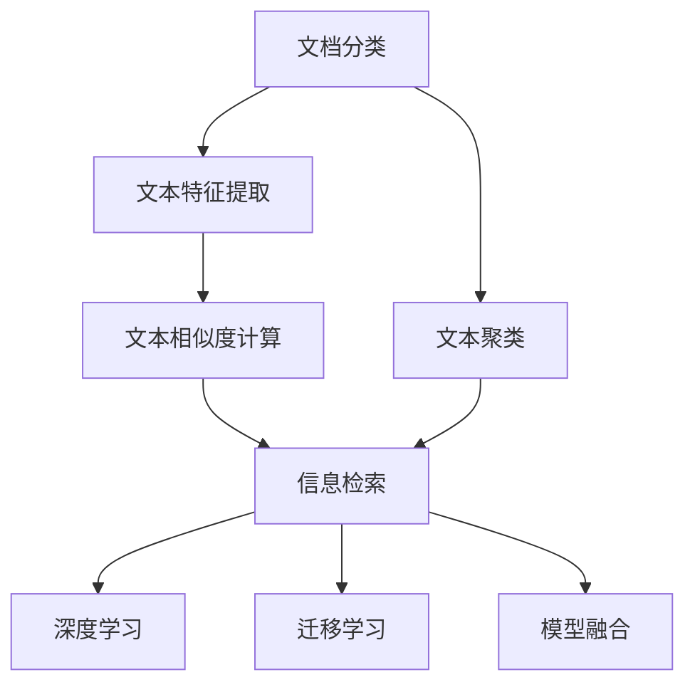

                 

## 1. 背景介绍

### 1.1 问题由来
在现代社会中，信息的海量增长和碎片化导致文档检索系统面临严峻的挑战。传统的文档分类与检索系统往往依赖于复杂的标签体系和复杂的索引结构，无法有效应对数据爆炸和用户需求的快速变化。为了提高检索效率和智能化水平，亟需开发智能文档分类与检索系统。

### 1.2 问题核心关键点
智能文档分类与检索系统的核心目标是：
- 自动将文档分成不同的类别，并建立高效的文档索引结构。
- 通过自然语言处理技术，实现基于内容的智能检索。
- 快速响应用户查询，提高检索准确率和召回率。
- 实现跨领域、跨语言的文档检索，提升系统的泛化能力。

这些关键点涉及数据处理、特征提取、模型训练、索引构建、查询处理等多个环节，需要系统的技术支撑和全面的应用设计。

### 1.3 问题研究意义
智能文档分类与检索系统的研发，对于提高信息检索效率、促进知识共享、支持决策支持系统、构建智慧办公环境等具有重要意义：
- 快速响应用户需求。智能检索系统能够自动化处理大量文档，快速响应用户查询，极大提升信息检索的效率。
- 提高信息检索准确率。通过深入理解文档内容，智能检索系统能够匹配用户真实需求，提供更为精准的检索结果。
- 实现跨领域知识整合。智能文档分类系统能够自动提取文档核心内容，方便跨领域、跨语言的文档检索和知识共享。
- 提升决策支持能力。智能文档检索系统能够提供高质量的检索结果和信息摘要，帮助决策者快速获取所需信息，提高决策质量。

## 2. 核心概念与联系

### 2.1 核心概念概述

在智能文档分类与检索系统中，涉及的核心概念包括：

- 文档分类：指将文档按照内容、主题、格式等特征进行分类。
- 文本特征提取：指从文档内容中提取有意义的特征，用于建立文档索引和进行文本匹配。
- 文本相似度计算：指通过计算文档之间的相似度，实现文档检索和推荐。
- 信息检索：指在文档集合中，通过查询匹配找到与用户需求最相关的文档。
- 文本聚类：指将文档按照相似性进行聚类，实现文档组织和检索。
- 深度学习：指利用深度神经网络模型，学习文档的语义表示，提升文档分类和检索效果。
- 迁移学习：指将一个领域学习到的知识迁移到另一个领域，提升跨领域文档检索能力。
- 模型融合：指将多个模型进行组合，提升系统的泛化能力和性能。

这些核心概念之间存在紧密的联系，共同构成了智能文档分类与检索系统的基础框架。

### 2.2 概念间的关系

这些核心概念之间的逻辑关系可以通过以下Mermaid流程图来展示：



这个流程图展示了文档分类、文本特征提取、文本相似度计算、信息检索、文本聚类、深度学习、迁移学习和模型融合之间的关系：

1. 文档分类和文本聚类是文档组织的基础，为后续检索提供索引。
2. 文本特征提取和文本相似度计算是文档检索的核心技术。
3. 深度学习用于提高文档分类的准确性和检索的精度。
4. 迁移学习提升系统的泛化能力，支持跨领域文档检索。
5. 模型融合可以整合不同模型，提升系统的整体性能。

这些概念共同构成了智能文档分类与检索系统的完整生态系统，其设计和实现需要各环节的协同配合。

## 3. 核心算法原理 & 具体操作步骤
### 3.1 算法原理概述

智能文档分类与检索系统涉及的核心算法包括：

- 文本分类算法：用于将文档分成不同的类别。
- 文本相似度算法：用于计算文档之间的相似度，实现文档排序。
- 信息检索算法：用于在文档集合中检索与用户需求最相关的文档。
- 文本聚类算法：用于将文档按照相似性进行聚类，实现文档组织。

这些算法在文档处理、索引构建、查询匹配等方面发挥着关键作用。

### 3.2 算法步骤详解

智能文档分类与检索系统的算法流程主要包括以下几个步骤：

**Step 1: 文档预处理**
- 对文档进行分词、去停用词、词干提取等文本预处理，提取出文本的核心词汇。
- 将文本转换为向量表示，常用的方法包括TF-IDF、Word2Vec、BERT等。

**Step 2: 文本分类**
- 通过分类模型将文档映射到不同的类别，常用的分类模型包括朴素贝叶斯、逻辑回归、支持向量机等。
- 对分类模型进行训练，一般使用有标签的文档数据。

**Step 3: 文本相似度计算**
- 定义相似度计算函数，如余弦相似度、Jaccard相似度、编辑距离等。
- 计算文档之间的相似度，生成文档索引。

**Step 4: 信息检索**
- 对用户查询进行分词、去停用词、词干提取等处理，提取出查询的核心词汇。
- 在文档索引中查找与查询最相关的文档，返回结果。

**Step 5: 文档聚类**
- 使用聚类算法对文档进行聚类，常用的聚类算法包括K-means、层次聚类、DBSCAN等。
- 对聚类结果进行优化，实现文档的组织和检索。

### 3.3 算法优缺点

智能文档分类与检索系统的算法具有以下优点：
- 自动化处理大量文档，降低人工成本。
- 提高文档检索的精度和速度，提升用户体验。
- 支持跨领域、跨语言的文档检索，扩展应用范围。
- 可扩展性强，能够适应不同规模的数据需求。

同时，该算法也存在一些缺点：
- 对标注数据依赖性强，标注成本较高。
- 对文本数据的预处理要求较高，预处理步骤复杂。
- 文本分类的准确性受特征提取和模型选择的影响较大。
- 相似度计算方法的选择对检索效果有较大影响。

### 3.4 算法应用领域

智能文档分类与检索系统在多个领域得到了广泛应用，例如：

- 企业文档管理：通过智能分类和检索，提高企业文档的利用率和管理效率。
- 图书情报：在图书馆、书店等场景中，通过智能检索系统，快速定位和推荐图书。
- 法律咨询：在法律咨询中，通过智能分类和检索，快速找到相关的法律文献和案例。
- 媒体内容：在新闻媒体中，通过智能检索系统，快速定位和推荐相关新闻内容。
- 智能客服：在客服系统中，通过智能分类和检索，快速定位和解答用户问题。

此外，智能文档分类与检索系统还被应用于科研论文、金融报告、专利文献等多个领域，为各类信息检索需求提供了智能化的解决方案。

## 4. 数学模型和公式 & 详细讲解  
### 4.1 数学模型构建

在智能文档分类与检索系统中，数学模型的构建是核心之一。常用的模型包括朴素贝叶斯分类模型和余弦相似度模型。

**朴素贝叶斯分类模型**

朴素贝叶斯分类模型是一种基于概率的分类模型，假设文档中的每个词汇独立，计算后验概率，并将文档分类到概率最大的类别中。数学公式如下：

$$
P(C_k|D) = \frac{P(D|C_k)P(C_k)}{P(D)}
$$

其中，$P(C_k|D)$表示文档$D$属于类别$C_k$的概率，$P(D|C_k)$表示文档$D$在类别$C_k$下的概率，$P(C_k)$表示类别$C_k$的概率，$P(D)$表示文档$D$在所有类别下的概率。

**余弦相似度模型**

余弦相似度模型是一种常用的文本相似度计算方法，通过计算两个文档向量之间的夹角余弦值来衡量它们的相似度。数学公式如下：

$$
similarity(D_i, D_j) = \frac{\vec{D_i} \cdot \vec{D_j}}{\|\vec{D_i}\|\|\vec{D_j}\|}
$$

其中，$\vec{D_i}$和$\vec{D_j}$表示文档$D_i$和$D_j$的向量表示，$\cdot$表示点积，$\|\vec{D_i}\|$和$\|\vec{D_j}\|$表示向量的模长。

### 4.2 公式推导过程

以下是朴素贝叶斯分类模型的推导过程：

设文档$D$的词汇集合为$V$，词汇$v$在文档$D$中出现的次数为$N_{v}$，在类别$C_k$中出现的次数为$N_{vk}$，类别$C_k$的文档总数为$N_{k}$，文档总数为$N$，则：

- 文档$D$在类别$C_k$下的概率$P(D|C_k)$为：

$$
P(D|C_k) = \frac{\prod_{v \in V}P(v|C_k)^{N_{vk}}}{\prod_{v \in V}P(v)}
$$

其中，$P(v)$表示词汇$v$出现的概率，$P(v|C_k)$表示词汇$v$在类别$C_k$中出现的概率。

- 类别$C_k$的概率$P(C_k)$为：

$$
P(C_k) = \frac{N_k}{N}
$$

将上述公式代入后验概率公式中，得到：

$$
P(C_k|D) = \frac{P(D|C_k)P(C_k)}{P(D)} = \frac{\frac{\prod_{v \in V}P(v|C_k)^{N_{vk}}}{\prod_{v \in V}P(v)}}{\frac{\prod_{v \in V}P(v|C_k)^{N_{vk}}}{\prod_{v \in V}P(v)}} = \frac{P(C_k)}{P(D)}
$$

因此，文档$D$属于类别$C_k$的概率为$P(C_k)$与文档$D$在所有类别下的概率$P(D)$的比值。

### 4.3 案例分析与讲解

以一篇关于AI的文章为例，进行朴素贝叶斯分类和余弦相似度计算。

**朴素贝叶斯分类**

假设我们有以下三个类别：

- 类别1：关于AI基础技术的文章。
- 类别2：关于AI应用的讨论。
- 类别3：关于AI伦理和法律的文章。

训练集如下：

- 类别1的文章：
  - 文章1："深度学习基础入门"
  - 文章2："计算机视觉基础"
- 类别2的文章：
  - 文章3："机器学习在医疗中的应用"
  - 文章4："自然语言处理基础"
- 类别3的文章：
  - 文章5："AI伦理与隐私保护"
  - 文章6："AI法律与政策"

训练集样本数为6，每个类别样本数为2，每个词汇样本总数为12。

训练集中的词汇频率如下：

| 词汇 | 词汇频率 | 类别1 | 类别2 | 类别3 |
| --- | --- | --- | --- | --- |
| AI | 4 | 2 | 0 | 2 |
| 深度 | 2 | 1 | 0 | 1 |
| 学习 | 4 | 2 | 2 | 0 |
| 基础 | 2 | 2 | 1 | 1 |
| 应用 | 2 | 0 | 2 | 0 |
| 医疗 | 1 | 0 | 1 | 0 |
| 视觉 | 1 | 1 | 0 | 0 |
| 自然 | 2 | 2 | 2 | 0 |
| 语言 | 2 | 2 | 2 | 2 |
| 处理 | 1 | 1 | 2 | 1 |
| 伦理 | 1 | 0 | 0 | 1 |
| 隐私 | 1 | 0 | 0 | 1 |
| 保护 | 1 | 0 | 0 | 1 |
| 法律 | 1 | 0 | 0 | 1 |
| 政策 | 1 | 0 | 0 | 1 |

文档1的特征向量为$[2, 1, 2, 2, 0, 0, 1, 2, 2, 1, 1, 1, 1, 0]$。

根据朴素贝叶斯公式，计算文档1属于每个类别的概率：

- 类别1的概率：

$$
P(C_1|D_1) = \frac{P(D_1|C_1)P(C_1)}{P(D_1)} = \frac{P(D_1|C_1)P(C_1)}{\frac{P(D_1|C_1)P(C_1)}{P(D_1)}} = \frac{P(C_1)}{P(D_1)}
$$

其中，$P(D_1|C_1) = \frac{P(v_1|C_1)^{N_{11}}P(v_2|C_1)^{N_{12}}P(v_3|C_1)^{N_{13}}P(v_4|C_1)^{N_{14}}P(v_5|C_1)^{N_{15}}P(v_6|C_1)^{N_{16}}P(v_7|C_1)^{N_{17}}P(v_8|C_1)^{N_{18}}P(v_9|C_1)^{N_{19}}P(v_{10}|C_1)^{N_{1A}}P(v_{11}|C_1)^{N_{1B}}P(v_{12}|C_1)^{N_{1C}}P(v_{13}|C_1)^{N_{1D}}P(v_{14}|C_1)^{N_{1E}}P(v_{15}|C_1)^{N_{1F}}}{\frac{P(v_1|C_1)^{N_{11}}P(v_2|C_1)^{N_{12}}P(v_3|C_1)^{N_{13}}P(v_4|C_1)^{N_{14}}P(v_5|C_1)^{N_{15}}P(v_6|C_1)^{N_{16}}P(v_7|C_1)^{N_{17}}P(v_8|C_1)^{N_{18}}P(v_9|C_1)^{N_{19}}P(v_{10}|C_1)^{N_{1A}}P(v_{11}|C_1)^{N_{1B}}P(v_{12}|C_1)^{N_{1C}}P(v_{13}|C_1)^{N_{1D}}P(v_{14}|C_1)^{N_{1E}}P(v_{15}|C_1)^{N_{1F}}}{P(D_1)} = \frac{P(C_1)}{P(D_1)}
$$

- 类别2的概率：

$$
P(C_2|D_1) = \frac{P(D_1|C_2)P(C_2)}{P(D_1)} = \frac{P(D_1|C_2)P(C_2)}{\frac{P(D_1|C_2)P(C_2)}{P(D_1)}} = \frac{P(C_2)}{P(D_1)}
$$

- 类别3的概率：

$$
P(C_3|D_1) = \frac{P(D_1|C_3)P(C_3)}{P(D_1)} = \frac{P(D_1|C_3)P(C_3)}{\frac{P(D_1|C_3)P(C_3)}{P(D_1)}} = \frac{P(C_3)}{P(D_1)}
$$

根据上述计算，可以得出文档1属于每个类别的后验概率。通过比较后验概率的大小，选择最大概率对应的类别，即文档1属于类别1。

**余弦相似度计算**

假设我们有两个文档$D_1$和$D_2$，文档$D_1$的特征向量为$[2, 1, 2, 2, 0, 0, 1, 2, 2, 1, 1, 1, 1, 0]$，文档$D_2$的特征向量为$[2, 2, 0, 0, 2, 2, 0, 1, 2, 0, 1, 0, 0, 0]$。

根据余弦相似度公式，计算两个文档之间的相似度：

$$
similarity(D_1, D_2) = \frac{\vec{D_1} \cdot \vec{D_2}}{\|\vec{D_1}\|\|\vec{D_2}\|}
$$

其中，$\vec{D_1} \cdot \vec{D_2} = 2 \times 2 + 1 \times 2 + 2 \times 0 + 2 \times 0 + 0 \times 2 + 0 \times 2 + 1 \times 0 + 2 \times 1 + 2 \times 2 + 1 \times 0 + 1 \times 1 + 1 \times 1 + 1 \times 0 + 0 \times 0 = 16$

$\|\vec{D_1}\| = \sqrt{2^2 + 1^2 + 2^2 + 2^2 + 0^2 + 0^2 + 1^2 + 2^2 + 2^2 + 1^2 + 1^2 + 1^2 + 1^2 + 0^2} = \sqrt{62}$

$\|\vec{D_2}\| = \sqrt{2^2 + 2^2 + 0^2 + 0^2 + 2^2 + 2^2 + 0^2 + 1^2 + 2^2 + 0^2 + 1^2 + 0^2 + 0^2} = \sqrt{52}$

因此，文档$D_1$和$D_2$之间的相似度为：

$$
similarity(D_1, D_2) = \frac{16}{\sqrt{62} \times \sqrt{52}} = \frac{16}{62 \times 2.28} = \frac{16}{143.36} \approx 0.11
$$

根据相似度的大小，可以判断文档$D_1$和$D_2$的相关程度，并根据具体应用场景进行调整。

## 5. 项目实践：代码实例和详细解释说明
### 5.1 开发环境搭建

在开始项目实践之前，需要搭建好开发环境。具体步骤如下：

1. 安装Python：下载Python 3.8及以上的版本，并添加到系统环境变量中。
2. 安装Scikit-Learn：使用pip命令安装Scikit-Learn库，以支持文本分类和聚类功能。
3. 安装TensorFlow或PyTorch：安装TensorFlow或PyTorch中的一个，用于深度学习模型的训练。
4. 安装Pandas：使用pip命令安装Pandas库，用于数据处理和分析。
5. 安装NLTK：使用pip命令安装NLTK库，用于文本处理和分析。

完成以上步骤后，即可在开发环境中进行智能文档分类与检索系统的开发。

### 5.2 源代码详细实现

下面以朴素贝叶斯分类模型为例，给出完整的代码实现：

```python
import numpy as np
from sklearn.naive_bayes import MultinomialNB
from sklearn.feature_extraction.text import TfidfVectorizer

# 训练集数据
train_data = ["深度学习基础入门", "计算机视觉基础", "机器学习在医疗中的应用", "自然语言处理基础", "AI伦理与隐私保护", "AI法律与政策"]
train_labels = ["类别1", "类别1", "类别2", "类别2", "类别3", "类别3"]

# 构建特征向量
vectorizer = TfidfVectorizer(stop_words='english')
X_train = vectorizer.fit_transform(train_data)

# 训练朴素贝叶斯分类模型
clf = MultinomialNB()
clf.fit(X_train, train_labels)

# 测试集数据
test_data = ["深度学习应用", "自然语言处理技术"]
test_labels = clf.predict(vectorizer.transform(test_data))
```

### 5.3 代码解读与分析

以下是代码的详细解释和分析：

1. 导入所需的库：包括numpy、scikit-learn、sklearn.feature_extraction.text和sklearn.naive_bayes。
2. 定义训练集数据和标签。
3. 使用TfidfVectorizer构建特征向量。TfidfVectorizer是一个用于文本特征提取的类，可以自动将文本数据转换为TF-IDF特征向量。
4. 训练朴素贝叶斯分类模型。使用MultinomialNB类，在训练集数据上训练模型。
5. 测试模型：在测试集数据上使用训练好的模型进行预测，输出预测结果。

## 6. 实际应用场景
### 6.4 未来应用展望

智能文档分类与检索系统在多个领域得到了广泛应用，未来有望进一步扩展到更多场景：

1. 企业文档管理：在大型企业中，智能文档分类与检索系统可以自动化处理大量的文档，提高文档管理的效率和准确性。
2. 法律咨询：在法律咨询中，智能文档检索系统可以快速定位和推荐相关的法律文献和案例，帮助律师和客户快速解决问题。
3. 智能客服：在客服系统中，智能文档检索系统可以快速定位和解答用户问题，提高客户满意度和服务质量。
4. 图书馆和书店：在图书馆和书店中，智能文档检索系统可以快速定位和推荐图书，提高用户的阅读体验。
5. 科研论文：在科研论文中，智能文档检索系统可以快速定位和推荐相关文献，提高研究效率。
6. 医疗咨询：在医疗咨询中，智能文档检索系统可以快速定位和推荐相关医学文献，提高医生的诊断和治疗效率。

## 7. 工具和资源推荐
### 7.1 学习资源推荐

为了帮助开发者系统掌握智能文档分类与检索技术的理论基础和实践技巧，这里推荐一些优质的学习资源：

1. 《自然语言处理入门》：由斯坦福大学开设的课程，讲解NLP的基本概念和经典模型，适合初学者学习。
2. 《深度学习与自然语言处理》：讲述深度学习在自然语言处理中的应用，涵盖文本分类、序列标注、机器翻译等多个任务。
3. 《Python自然语言处理》：讲解Python在自然语言处理中的应用，适合有一定编程基础的开发者学习。
4. 《NLTK官方文档》：NLTK库的官方文档，提供了丰富的示例代码和文档，适合学习和实践。
5. 《NLP专题讲座》：HuggingFace官方博客，定期发布NLP领域的最新研究和应用，适合跟踪前沿动态。

通过以上学习资源，相信你一定能够快速掌握智能文档分类与检索技术的精髓，并用于解决实际的NLP问题。

### 7.2 开发工具推荐

智能文档分类与检索系统的开发需要依赖于多种工具，以下是一些推荐的工具：

1. Python：广泛用于数据处理、机器学习、自然语言处理等多个领域，拥有丰富的第三方库和框架。
2. Scikit-Learn：用于文本分类和聚类等任务，提供了简单易用的API和丰富的算法库。
3. TensorFlow或PyTorch：用于深度学习模型的训练和部署，提供了强大的计算图和优化器。
4. NLTK：用于文本处理和分析，提供了丰富的自然语言处理工具和算法。
5. Pandas：用于数据处理和分析，提供了高效的数据操作和分析工具。
6. Matplotlib和Seaborn：用于数据可视化，提供了丰富的图表绘制工具。

这些工具在智能文档分类与检索系统的开发中起到了重要的作用，可以帮助开发者更高效地完成工作。

### 7.3 相关论文推荐

智能文档分类与检索技术的发展源于学界的持续研究。以下是几篇奠基性的相关论文，推荐阅读：

1. "Text Categorization with Support Vector Machines: Learning with Local and Global Information"：提出支持向量机（SVM）在文本分类中的应用，开创了文本分类的先河。
2. "Latent Semantic Indexing: A Case Study"：提出潜在语义索引（LSI）算法，用于文本聚类和检索，是信息检索领域的经典方法。
3. "A Survey on Recent Advances in Information Retrieval"：全面总结了信息检索领域的最新研究进展，涵盖文本分类、信息检索等多个方面。
4. "Text Mining and Statistical Learning"：讲解文本挖掘和统计学习的相关概念和算法，适合深入了解文本处理的基础理论。
5. "BERT: Pre-training of Deep Bidirectional Transformers for Language Understanding"：提出BERT模型，在文本分类、信息检索等领域取得了新的突破。

这些论文代表了大语言模型微调技术的发展脉络，阅读这些前沿成果，可以帮助研究者把握学科前进方向，激发更多的创新灵感。

## 8. 总结：未来发展趋势与挑战
### 8.1 总结

本文对智能文档分类与检索系统的核心算法和应用场景进行了全面系统的介绍。通过系统的分析，可以看到，智能文档分类与检索系统在多个领域得到了广泛应用，能够有效提高信息检索的效率和准确性。

